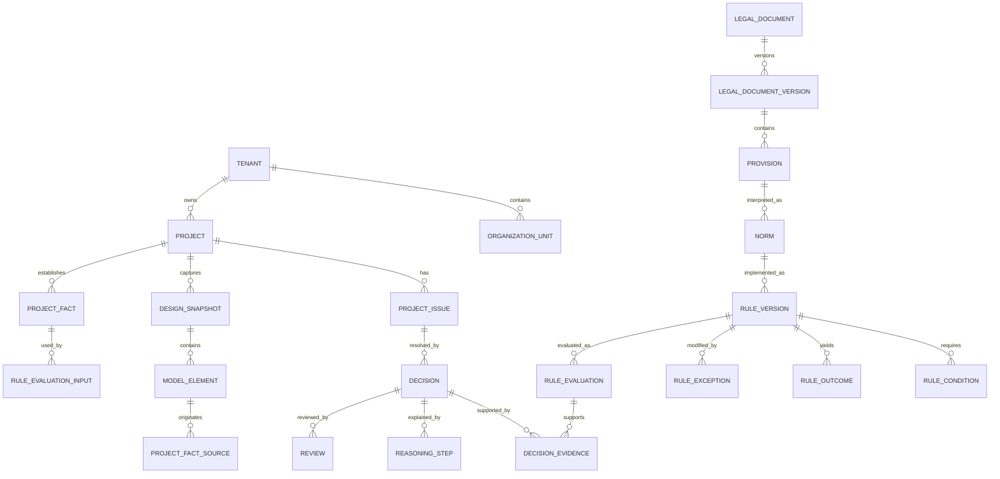

# 建築法令集WEB化プロジェクト — 事前調査計画・初期調査報告

- 作成日: 2026-07-29
- ステータス: 第1巻・第1〜3章整理済み／第6〜13章詳細調査完了／第13章「UI詳細設計」実装仕様化済み
- 想定プロダクト: 建築実務者向け法令閲覧・検索・注釈・根拠整理サービス

---

## 0. エグゼクティブサマリー

本プロジェクトは、建築関係法令を単にWEBで全文検索できるようにするものではない。紙の法令集が提供してきた「位置を覚える」「線を引く」「付箋を貼る」「関連条文を往復する」という身体的・空間的な読書体験と、デジタルに適した「横断検索」「時点管理」「関連法令表示」「案件別の根拠保存」を統合することが中核となる。

初期調査から、次のことが分かった。

1. **国法令の基礎データは利用可能**  
   e-Gov法令検索は、法令標準XMLスキーマに準拠したデータ、API Version 1／2、XML一括ダウンロード、更新法令一覧を提供している。法律・政令・省令を条・項・号・別表等の構造単位で扱う基盤は構築可能である。

2. **最大のデータ課題は告示・通知・自治体情報**  
   建築実務では法律・政令だけでなく、告示、技術的助言、通知、自治体条例、施行細則、運用基準が判断に直結する。これらは省庁・自治体のHTML、PDF、画像PDF、例規集に分散し、改正が溶け込んだ現行全文を得にくいものもある。

3. **既存サービスは「検索」か「電子書籍」に寄っている**  
   e-Gov、建築関係法令検索、ICBA法令DB、LEGAL CONNECTION、個別スマートフォンアプリなどが存在する。しかし、紙の法令集の視認性・空間記憶、条文間の関係表示、線引き・メモ、案件単位の根拠整理、自治体差、時点管理を一体化した体験には余地がある。

4. **初期MVPは対象を絞るべき**  
   最初から全国自治体・全法令を網羅するのではなく、建築基準法、施行令、施行規則、主要告示、国土交通省の技術的助言を対象とし、防火・避難または用途変更など一つの実務領域に限定して検証する。

5. **AI回答を中心に据えるべきではない**  
   初期価値は、原文への高速な到達、参照関係の可視化、適用時点の明示、根拠セットの保存に置く。AIは検索語展開、関連候補提示、平易化、チェック漏れの指摘に限定し、必ず原文と出典へ戻れる設計とする。

---

## 1. プロジェクト仮説

### 1.1 解決したい課題

建築実務者は、必要な法令を確認する際に、以下の問題を抱える。

- 法律、政令、省令、告示、条例、通知が別々の場所に存在する
- 条文番号を知らなければ検索が難しい
- 現場用語と法令用語が一致しない
- 本文から委任先、例外、関連告示をたどるのに時間がかかる
- どの時点の規定か、未施行改正か、経過措置かを誤認しやすい
- 自治体独自規制・運用の確認が別作業になる
- 調査した根拠を案件ごとに再利用・共有しにくい
- 紙の法令集で可能だった線引き、付箋、位置記憶が失われる

### 1.2 提供価値の仮説

> 建築実務者が、必要な条文を早く見つけ、法令間の関係と適用時点を把握し、判断根拠を案件単位で保存・共有できる「実務用デジタル法令集」を提供する。

### 1.3 成功指標の候補

- 最初の有効条文への到達時間
- 調査タスク完了時間
- 関連法令・例外規定の見落とし数
- 誤った時点の条文を参照した回数
- 検索語の再入力回数
- 根拠説明を第三者が再現できる割合
- 保存した条文セットの再利用率
- 週次・月次の継続利用率

---

## 2. 調査対象ユーザー

### 2.1 優先ユーザー候補

| 優先度 | ユーザー | 主な利用場面 | 主な課題 |
|---|---|---|---|
| A | 意匠設計者 | 基本計画、確認申請、行政協議 | 用途・規模・地域から適用規定を洗い出す |
| A | 建築確認・審査担当者 | 図書審査、質疑回答 | 条文・告示・運用根拠を迅速に提示する |
| A | 若手建築士 | 日常調査、上司への説明 | 用語と法体系の関係が分かりにくい |
| B | 構造設計者 | 構造規定・告示確認 | 告示・認定・改正履歴が分散している |
| B | 設備設計者 | 排煙、換気、非常用設備 | 法令・告示・消防関係の横断が必要 |
| B | 施工管理者 | 現場照会、設計変更 | モバイルで根拠を確認・共有したい |
| C | 行政担当者 | 条例・運用基準の説明 | 国法と自治体規定の関係整理が必要 |
| C | 受験者・学生 | 法規学習 | 索引、線引き、条文位置の記憶が重要 |

### 2.2 最初に検証すべきセグメント

MVPでは「実務で法令調査を週1回以上行う意匠設計者・確認審査担当者」を中心にする。受験用途は線引き・インデックス文化の理解には有効だが、試験持込条件と実務要件が異なるため、プロダクト要件を受験者中心に決めない。

---

## 3. 紙の法令集の行動分解

紙の法令集では、情報検索以外に「自分専用の情報構造を作る」行為が行われている。

| 紙での行為 | 背景にある目的 | デジタル機能仮説 |
|---|---|---|
| インデックスを貼る | 頻出領域へ直接移動 | 固定ショートカット、個人索引、分野タブ |
| 色分けする | 定義、要件、例外等を視覚分類 | 意味付きハイライト、色テンプレート |
| 下線・囲みを使い分ける | 文の論理構造を識別 | 下線、囲み、記号、条件節の強調 |
| 余白に書く | 解釈・注意点を残す | 条・項・文節単位メモ |
| 付箋を貼る | 再訪する箇所を記憶 | ブックマーク、案件フォルダ、タグ |
| ページを往復する | 委任先・関連条文を照合 | 分割ビュー、参照先プレビュー |
| 目次・索引から引く | 条文番号を知らずに探す | 法令用語辞書、概念索引、実務目的検索 |
| 追録を挟む | 改正に追随する | 更新通知、新旧対照、施行日バッジ |
| 本を開いた位置で覚える | 空間的記憶を使う | 見開き、ページ固定、ミニマップ、閲覧履歴 |

線引き文化では、単語そのものだけでなく「又は」「かつ」「適用しない」「条例で定める」等の論理・委任表現が強調される。デジタル版でも自由な色塗りだけでなく、法文の論理構造を支援する注釈設計が有効と考えられる。

---

## 4. 実務タスク分類

### 4.1 代表タスク

- 用途・規模・階数・地域から適用規定を洗い出す
- 防火区画、排煙、内装制限、避難施設の要否を確認する
- 接道、建蔽率、容積率、高さ制限の条件・緩和を確認する
- 用途変更・増築・大規模修繕時の遡及適用を確認する
- 既存不適格・経過措置を確認する
- 告示仕様で適合できるか確認する
- 自治体条例・指導要綱・運用基準による上乗せを確認する
- 確認検査機関や行政からの指摘条文を特定する
- 設計判断の根拠を上司、施主、審査機関へ説明する

### 4.2 タスクの情報フロー

1. 案件条件を把握する
2. 適用法令の候補を出す
3. 定義規定を確認する
4. 本則を読む
5. 適用除外・緩和・例外を確認する
6. 委任先の政令・省令・告示を読む
7. 自治体規定・運用を確認する
8. 施行日・経過措置を確認する
9. 根拠条文を保存する
10. 第三者へ説明する

プロダクトは、単一条文の閲覧ではなく、この連続した調査を中断させない必要がある。

---

## 5. 検索意図の分類

| 検索タイプ | 入力例 | 必要な機能 |
|---|---|---|
| 条文番号 | `法35条`、`令126条の2` | 略称・表記揺れ解析、直接ジャンプ |
| 法令番号・告示番号 | `平成12年告示1436号` | 元号・西暦・全半角対応 |
| 正式用語 | `直通階段` | 完全一致、形態素、関連語 |
| 現場用語 | `無窓居室`、`竪穴区画` | 同義語辞書、慣用語マッピング |
| 条件 | `3階 共同住宅 準防火地域` | ファセット、条件タグ |
| 判断目的 | `排煙設備は必要か` | 意図分類、関連条文セット提示 |
| 関係探索 | `この条文の告示` | 引用・委任・準用グラフ |
| 時点 | `2024年4月時点` | 時点指定、履歴検索 |
| 地域 | `東京都 建築安全条例` | 自治体フィルター、地域階層 |

### 5.1 検索品質で重要な表記揺れ

- 建築基準法／基準法／法
- 建築基準法施行令／施行令／令
- 第三十五条／第35条／35条
- 第百二十六条の二／126条の2／126-2
- 平成十二年建設省告示第千四百三十六号／平成12年告示1436号
- 共同住宅／共同住居／マンション
- 竪穴部分／竪穴区画

---

## 6. 公式データ基盤の調査

### 6.1 e-Gov法令検索

利用できる主な仕組みは以下である。

- 法令標準XMLスキーマ
- 法令API Version 1
- 法令API Version 2
- XML一括ダウンロード
- 更新法令一覧
- 法令名・本文・条文単位の取得
- Version 2における時点指定・過去条文検索の強化

法令標準XMLでは、章、節、条、項、号、別表、表、図等の構造を機械可読に扱える。そのため、本文をPDFとして保存する方式ではなく、XMLを正規化して独自の法令ドキュメントモデルへ変換する方式が適切である。

### 6.2 基本データモデル案

```text
LawDocument
├── law_id
├── title
├── law_number
├── promulgation_date
├── effective_from
├── effective_to
├── status
├── source
├── version_id
└── nodes[]
    ├── node_id
    ├── node_type (Part/Chapter/Section/Article/Paragraph/Item/Table...)
    ├── num
    ├── heading
    ├── text
    ├── parent_id
    ├── valid_from
    ├── valid_to
    └── references[]
```

追加で、建築実務用に次のエンティティが必要になる。

```text
ReferenceEdge
- source_node_id
- target_document_id / target_node_id
- relation_type
  - citation
  - delegation
  - application
  - mutatis_mutandis（準用）
  - exception
  - definition
  - amendment
  - local_override
- confidence
- extraction_method
- reviewed_by

Annotation
- user_id / organization_id
- document_version_id
- node_id
- text_range
- style
- memo
- tags
- project_id
```

### 6.3 更新処理案

1. 日次で更新法令一覧を取得
2. 変更対象の法令XMLを取得
3. 前版との構造差分を計算
4. 条・項・号単位で追加・削除・変更を記録
5. 施行日別にバージョンを生成
6. 既存ハイライト・メモのアンカーを再割当
7. 再割当できない注釈を「旧版に紐づく」として警告
8. 人手確認が必要な差分をレビューキューへ送る

### 6.4 注意点

- ドキュメンテーションの一部はα版であり、仕様変更の可能性を考慮する
- API障害・仕様変更に備えて一括XMLの取得経路も持つ
- 原文データと独自の解説・タグを明確に分離する
- 取得日時、出典URL、法令ID、版、施行時点を監査可能にする

---

## 7. 告示・通知・技術的助言の課題

建築実務において告示は不可欠だが、国法令ほど統一的に構造化されていない。

デジタル庁の調査では、省庁ウェブサイトで告示一覧を掲載していない例があり、掲載している場合もPDF中心であること、改正が溶け込んだ全文を確認できない場合があることが示されている。また、法令API Version 2の公開テストでは、建築分野の一部告示を対象にした告示APIが試験提供された。

### 7.1 収集優先順位

1. 国土交通省「建築基準法等に基づく告示の制定・改正」
2. 建築基準法・施行令から明示的に委任される主要告示
3. 改正ページに掲載された新旧対照・技術的助言
4. 住宅局の通知・事務連絡
5. 建築物省エネ法等の周辺法令・告示

### 7.2 告示データの品質区分

| 区分 | 内容 | UI表示 |
|---|---|---|
| A | 公式構造化データ | 公式原文・構造化済み |
| B | 公式HTML | 公式原文・自動構造化 |
| C | 公式テキストPDF | 公式原文・抽出済み |
| D | 公式画像PDF | 公式原文・要レビュー |
| E | 民間再編集 | 参考資料・公式原文と区別 |

### 7.3 人手レビューが必要な項目

- 表・数式・図の復元
- 改め文から現行全文への溶け込み
- 告示番号・題名・施行日の紐付け
- 廃止・全部改正・一部改正の判定
- 法令条文から告示への委任関係

---

## 8. 自治体条例・運用情報

### 8.1 対象となる情報

- 建築基準条例
- 建築基準法施行細則
- 建築安全条例
- 福祉のまちづくり条例
- 景観条例
- 中高層建築物条例
- ワンルームマンション条例
- 駐車場附置義務条例
- 開発許可基準・指導要綱
- 建築審査会包括同意基準
- 行政FAQ・取扱基準

### 8.2 自治体情報の難しさ

- 例規集ベンダーごとにHTML構造が異なる
- 条例と施行規則が別システムにある
- 運用基準や様式がPDFのみの場合がある
- 改正日・施行日の表記が統一されていない
- URLが変更されやすい
- 自治体の再編、条例番号変更、廃止の管理が必要
- 国法の条文と自治体条例の対応関係が明示されない

### 8.3 MVPでの自治体選定案

次の条件で2自治体程度を選ぶ。

- 利用者数・案件数が多い
- 建築独自条例が多い
- 公式情報が比較的整理されている
-異なる例規集プラットフォームを使っている

例として、東京都および政令指定都市1市を対象にすると、都道府県条例と市条例の階層差も検証できる。

### 8.4 自治体データの表示原則

- 国法と自治体規定を同一本文として混ぜない
- 「地域で追加確認が必要」と明示する
- 適用地域を地図または自治体階層で表示する
- 公式URL、更新確認日、収集方法を表示する
- 網羅保証の範囲を明示する

---

## 9. 競合・代替手段の初期調査

### 9.1 e-Gov法令検索

**強み**

- 政府公式の法令データ
- 現行法令閲覧、法令ID、XML、API
- 法令本文の信頼性が高い

**弱み・余地**

- 建築実務のタスク別導線ではない
- 告示・通知・自治体運用を一体的に扱いにくい
- 個人の線引き、案件整理、組織知共有が中心ではない

### 9.2 ICBA 法令データベース

建築基準法令・建築士法令を制定時から検索・閲覧できるアーカイブで、過去法令の調査に強い。有料の情報会員向けである。

**示唆**

- 建築分野では過去時点・改正履歴に明確な需要がある
- 時点管理は有料価値になり得る

### 9.3 LEGAL CONNECTION／建築申請memo電子利用

導入事例では、外出先での閲覧、毎年の書籍更新不要、告示や消防法を含む横断検索、共有の容易さが評価されている。

**示唆**

- 紙の代替価値は携帯性だけでなく、複数資料の横断と共有にある
- 出版社の解説コンテンツは原文だけでは得られない価値を持つ

### 9.4 建築関係法令検索

建築基準法、施行令、施行規則、建築士法など複数法令を検索対象としている。

**示唆**

- 建築分野に限定した横断検索への需要は存在する
- 差別化には検索対象数ではなく、関係性・時点・注釈・案件化が必要

### 9.5 スマートフォン法令アプリ

全文閲覧、全文検索、ブックマーク、用途・規模条件、専門分野絞り込み、AI解説をうたうアプリが存在する。

**示唆**

- 条件検索とAI解説は既に期待機能になりつつある
- AIの存在自体は差別化になりにくい
- データの正確性、関連根拠、責任範囲が重要になる

### 9.6 紙の法令集・線引き教材

資格学校は線引き例、インデックス、追録を提供している。紙の法令集は、利用者自身が色と位置に意味を与えて検索性能を高める「カスタマイズ可能な道具」である。

**示唆**

- デジタル版は、完成済みの検索UIを押し付けるのではなく、ユーザーが自分の索引・色・分類を育てられる必要がある

---

## 10. プロダクト機会領域

競合とデータ環境を踏まえると、機会は次の5領域に整理できる。

### 10.1 法令関係グラフ

- 法律 → 政令 → 省令 → 告示
- 本則 → 例外 → 適用除外
- 条文 → 定義規定
- 条文 → 自治体条例
- 現行条文 → 改正前条文

検索結果を一覧で返すだけではなく、「なぜこの条文を見る必要があるか」を関係線で示す。

### 10.2 紙の空間性を残す読書モード

- 見開き
- 固定幅紙面
- ページ番号
- 左右位置の保持
- ページサムネイル
- 章・条のミニマップ
- 前回開いていた位置への復帰

検索後は条文カード、精読時は紙面モードという切替も検討する。

### 10.3 意味付き線引き

単なる色ではなく、次の意味を持つプリセットを用意する。

- 定義
- 適用条件
- 義務
- 例外・緩和
- 数値要件
- 委任先
- 自治体規定
- 要確認

### 10.4 案件別根拠ワークスペース

- 案件条件
- 検討テーマ
- 保存条文
- 条文の適用時点
- メモ
- 行政・審査機関との質疑
- PDF／URL共有
- 調査日時と版

### 10.5 信頼できるAI補助

AIの役割を以下に限定する。

- 法令用語への検索語変換
- 表記揺れ・同義語展開
- 関連条文候補の提示
- 条文の構造化要約
- 抜けている確認観点の提示
- 新旧差分の説明

回答には必ず以下を表示する。

- 根拠条文
- 法令名・条項
- 施行時点
- 公式出典
- AI生成であること
- 最終判断ではないこと

---

## 11. MVP案

### 11.1 対象コンテンツ

- 建築基準法
- 建築基準法施行令
- 建築基準法施行規則
- 主要告示 30〜50件
- 関連する国土交通省技術的助言
- 自治体 1〜2地域

### 11.2 対象業務

第一候補: 防火・避難

理由:

- 法、令、告示の横断が多い
- 用途、階数、面積、地域等の条件が多い
- 例外・緩和・別表参照が多い
- 関連条文表示の価値を検証しやすい

第二候補: 用途変更・既存不適格

理由:

- 時点管理・経過措置の価値を検証しやすい
- 実務判断の難度が高い

### 11.3 MVP必須機能

1. 条文番号・全文検索
2. 法律・政令・告示の横断検索
3. 条・項・号単位URL
4. 参照条文・委任先の表示
5. 2画面比較・分割ビュー
6. 現行／過去時点の表示
7. ハイライト・メモ・ブックマーク
8. 案件フォルダへの保存
9. 出典・施行日・更新日の表示
10. 検索ログ・利用分析

### 11.4 MVPでは後回しにする機能

- 全国自治体の完全網羅
- 法適合の自動判定
- BIMモデルからの完全自動チェック
- ユーザー投稿型の公開解説
- 高度な組織権限管理
- 全法令・全告示の収録

---

## 12. ユーザー調査計画

### 12.1 調査方法

| 方法 | 人数目安 | 目的 |
|---|---:|---|
| 半構造化インタビュー | 12〜18人 | 課題、資料、判断プロセスを把握 |
| 法令調査の行動観察 | 6〜8人 | 紙・PDF・WEBの実際の操作を把握 |
| 法令集持参インタビュー | 6人 | 線引き、付箋、索引の意味を把握 |
| 検索ログ日記 | 5〜8人×1週間 | 日常的な検索語と失敗を収集 |
| プロトタイプテスト | 各案5〜8人 | UI方式の比較 |
| 専門家レビュー | 3〜5人 | 法令関係・責任表示・データ品質確認 |

### 12.2 インタビュー質問

- 直近で法令を調べた案件を、最初から説明してください
- 最初に何を開きましたか
- 条文番号は知っていましたか
- どの時点で告示・条例の確認が必要と判断しましたか
- 一番時間がかかった箇所はどこですか
- 誰かに質問しましたか。なぜですか
- 最終的な根拠をどこに保存しましたか
- 同じ調査を別案件で再利用できますか
- 紙の法令集で、線・色・付箋をどう使い分けていますか
- WEB版で失いたくない紙の利点は何ですか
- 誤った法令情報を参照した経験はありますか
- どの表示があれば情報を信頼できますか

### 12.3 行動観察タスク

1. 3階建て共同住宅・準防火地域の防火関連規定を確認する
2. 無窓居室に必要な避難・排煙関連規定を確認する
3. 既存建築物の用途変更時に適用される規定を確認する
4. 指定された条文の委任先告示と例外規定を探す
5. 調査結果を第三者が確認できる形で共有する

### 12.4 測定項目

- 最初の有効条文到達時間
- タスク完了時間
- 参照した資料数
- ページ・タブの往復数
- 検索語変更回数
- 関連条文の見落とし
- 誤った時点・地域の参照
- 回答への確信度
- 根拠説明の再現性

---

## 13. プロトタイプ比較案

### A. 法令集再現型

- 見開き・ページ型
- 索引・インデックス
- 紙面上の自由な線引き
- ページ位置を保持

**検証仮説:** 紙ユーザーの学習コストを下げ、空間記憶を維持できる。

### B. 実務検索型

- 大きな検索窓
- 用途、規模、地域、テーマの条件入力
- 関連条文セット
- 適用条件・例外の要約

**検証仮説:** 条文番号を知らない若手・非専門家の到達時間を短縮できる。

### C. 法令ワークスペース型

- 左: 法体系・目次
- 中央: 本文
- 右: 関連条文・メモ・案件
- 分割比較・根拠セット保存

**検証仮説:** 実務調査の継続性と再利用性を高められる。

最終形はCを基本に、Aの読書モードとBの検索入口を統合する可能性が高い。

---

## 14. 情報品質・責任設計

### 14.1 情報レイヤーを分離する

1. **公式原文**
2. **公式資料** — 技術的助言、通知、FAQ
3. **編集コンテンツ** — 独自タグ、関連付け、解説
4. **ユーザー注釈**
5. **AI生成コンテンツ**

背景色、ラベル、出典表示により混同を防ぐ。

### 14.2 各画面で表示すべき情報

- 法令名
- 条・項・号
- 法令番号
- 公布日
- 施行日
- 表示中の時点
- 現行／未施行／廃止／過去版
- 公式出典
- 最終取得日時
- 独自編集の有無

### 14.3 誤り対応

- 条文単位の誤り報告
- 編集履歴
- レビュー担当者
- 修正時刻
- 影響を受ける保存済み案件への通知
- 重要訂正の監査ログ

---

## 15. 技術検証項目

### 15.1 データ取得PoC

- e-Gov API Version 2から建築基準法・施行令を取得
- XMLから条・項・号・別表を正規化
- 条文番号の恒久IDを設計
- 更新差分を1回分取り込み
- 任意時点の版を復元

### 15.2 参照関係抽出PoC

以下の表現をルールベースで抽出する。

- 「第○条の規定により」
- 「政令で定める」
- 「国土交通大臣が定める」
- 「前項の場合」
- 「第○号に掲げる」
- 「条例で定める」
- 「準用する」
- 「適用しない」

抽出結果は自動確定せず、信頼度とレビュー状態を持たせる。

### 15.3 注釈アンカーPoC

改正前後で文言が変わった場合に、ハイライトを次の順で再配置する。

1. ノードID・条項番号
2. 前後文脈を含む文字列一致
3. 差分上の対応位置
4. 手動再確認

### 15.4 検索PoC

- 条文番号パーサー
- 日本語全文検索
- 同義語辞書
- 略称辞書
- 条件タグ
- 法令関係グラフによる順位補正
- 時点・地域フィルター

---

## 16. リスク

| リスク | 影響 | 対応 |
|---|---|---|
| 告示・自治体データが非構造 | 網羅性・更新性が低下 | 対象限定、品質区分、人手レビュー |
| 法改正の複雑な施行 | 誤った時点表示 | 施行イベントモデル、専門家確認 |
| AIの誤解釈 | 実務上の誤判断 | 原文優先、根拠必須、断定禁止 |
| ユーザー注釈が改正でずれる | 知識資産の毀損 | 版固定、再アンカー、警告 |
| 自治体情報のURL変更 | リンク切れ | 定期確認、アーカイブ、取得日時表示 |
| 出版社コンテンツの権利 | 掲載不可・競合 | 原文と独自編集を中心にし、ライセンス交渉を分離 |
| 「網羅している」と誤認される | 信頼・責任問題 | 収録範囲と未確認領域を明示 |
| 紙再現に寄りすぎる | デジタルの利点が弱い | 読書モードと検索モードを分離 |

---

## 17. 今後の調査バックログ

### 優先度A

- 実務者インタビュー12〜18名
- 紙の法令集の線引き・付箋の写真収集と分類
- e-Gov API Version 2の取得・版管理PoC
- 主要告示30〜50件の収集可能性調査
- 東京都＋1政令市の条例・運用データ調査
- 競合5サービスの同一タスク比較
- 3タイプの低忠実度プロトタイプ作成・テスト

### 優先度B

- 組織内共有・権限ニーズ
- 料金受容性調査
- 出版社・確認検査機関との提携可能性
- 消防法・都市計画法等への拡張境界
- BIM・確認申請データとの将来連携

### 優先度C

- 受験者向けモード
- 公開注釈コミュニティ
- 多言語化
- 法令チェック自動化

---

## 18. 推奨する次の意思決定

次のフェーズへ進む前に、以下を決める。

1. 主対象を「実務者」に固定するか
2. 最初の業務領域を「防火・避難」にするか
3. 最初の自治体をどこにするか
4. 紙面体験を中心価値とするか、案件ワークスペースを中心価値とするか
5. 無料の法令閲覧と有料機能の境界
6. 独自解説を内製するか、専門家・出版社と組むか

現時点の推奨は以下である。

> **建築基準法・施行令・主要告示を対象に、防火・避難の調査を支援する「法令ワークスペース型MVP」を作る。**  
> 検索入口は自然言語・条件・条文番号に対応し、閲覧画面では紙面モード、参照関係、線引き、案件保存を提供する。自治体は東京都と1政令市に限定する。

---

## 19. 参考資料

### 公式・一次情報

1. e-Gov法令検索  
   https://laws.e-gov.go.jp/
2. e-Gov 法令API Version 1  
   https://laws.e-gov.go.jp/apitop/
3. e-Gov 法令API Version 2  
   https://laws.e-gov.go.jp/api/2/swagger-ui
4. XML一括ダウンロード  
   https://laws.e-gov.go.jp/bulkdownload/
5. 法令標準XMLスキーマ解説  
   https://laws.e-gov.go.jp/docs/law-data-basic/419a603-xml-schema-for-japanese-law/
6. 法令の条文構造と法令XML  
   https://laws.e-gov.go.jp/docs/law-data-basic/8ebd8bc-law-structure-and-xml/
7. 更新法令一覧取得API  
   https://laws.e-gov.go.jp/docs/law-data-basic/8529371-law-api-v1/
8. e-Gov法令検索 利用規約  
   https://laws.e-gov.go.jp/terms/
9. デジタル庁 法令APIプロトタイプ公開テスト  
   https://www.digital.go.jp/news/74dc5116-16bb-4dae-a632-02aa83b65170
10. 国土交通省 建築基準法等に基づく告示の制定・改正  
    https://www.mlit.go.jp/jutakukentiku/build/jutakukentiku_house_tk_000096.html
11. 国土交通省 建築分野トップ  
    https://www.mlit.go.jp/jutakukentiku/build/index.html
12. 日本法令索引  
    https://hourei.ndl.go.jp/
13. ICBA 法令データベース  
    https://www.icba.or.jp/horeidb/

### 競合・代替手段

14. 建築関係法令検索  
    https://structural-design-apps.com/lawsearch/
15. 新日本法規 LEGAL CONNECTION導入事例  
    https://www.sn-hoki.co.jp/example/example4352391/
16. TAC 建築関係法令集・線引き集  
    https://www.tac-school.co.jp/kouza_kenchiku/kenchiku_rsn_houreishu.html
17. 総合資格学院 法令集追録  
    https://www.shikaku.co.jp/topics/tuiroku_2026/

---

## 20. 調査上の留意事項

- 本文書は2026年7月29日時点の公開情報に基づく初期調査である。
- 法令・API・サービス仕様・料金・収録範囲は変更される可能性がある。
- 法令データの利用条件、自治体サイトの利用条件、出版社コンテンツの著作権・ライセンスは、実装・公開前に個別の法務確認が必要である。
- 本文書は法的助言ではなく、プロダクト企画・調査設計のための資料である。

---

## 21. 追加調査結果（第2次デスクリサーチ）

### 21.1 競合の現在地と差別化余地

ICBAの法令データベースは、建築基準法・施行令・施行規則だけでなく、告示、通達、通知、技術的助言、例規、関係規定まで収録し、キーワード検索、時点検索、履歴表示、改正前比較、全法文表示を提供している。したがって、本プロダクトが「建築法令を検索できる」「過去時点を表示できる」だけでは、明確な差別化にならない。

差別化候補は次の5点に集約される。

1. **条文関係を読む体験**  
   引用、委任、準用、例外、定義、経過措置を関係グラフとして明示する。
2. **案件コンテキストを持つ検索**  
   用途、規模、階数、地域、防火指定、既存／新築等を保存し、検索結果を案件条件に合わせる。
3. **紙の法令集から継承した読書・注釈体験**  
   見開き、空間位置、意味付き線引き、個人索引を提供する。
4. **自治体差の統合**  
   国法、都道府県条例、市区町村条例、細則、取扱い、FAQを地域単位で束ねる。
5. **根拠パッケージの作成**  
   条文、告示、自治体規定、注釈、参照日時を一つの調査記録として共有・出力する。

ICBAを「置き換える」より、現状の法令DBでは弱い実務ワークフローを補完する位置付けが現実的である。

### 21.2 e-Gov API Version 2のプロダクト上の意味

e-Gov法令API Version 2は、`asof`による時点指定を備え、指定時点における改正履歴を取得可能である。法令本文を単一の最新版として保存するのではなく、「法令文書」「改正イベント」「施行時点」の3層で管理する必要がある。

実装上は、次のモデルが適切である。

```text
LawIdentity
- 永続的な法令ID

LawRevision
- 改正法令
- 公布日
- 施行日
- 対象条項

ConsolidatedVersion
- ある基準日時点で有効な溶け込み本文
- 生成元となる改正履歴
```

この構成により、次の表示が可能になる。

- 今日有効な条文
- 指定日当時の条文
- 公布済みだが未施行の条文
- 次回施行で変わる箇所
- ある案件の確認申請時点で参照した版

### 21.3 告示・通達の取得可能性

国土交通省は「所管法令、告示・通達一覧」と個別改正ページを公開しており、2026年7月6日更新の告示・通達一覧はExcelとPDFで提供されている。一方、個別の建築基準法改正ページでは、概要、新旧対照表、告示、技術的助言、別紙資料が案件別・改正別にまとまっている。

これは次の二段階収集が必要であることを示す。

1. **一覧データから存在・識別情報を収集**  
   文書番号、件名、発出日、所管、リンク、文書種別を取得する。
2. **個別ページ・添付ファイルから本文と関係を抽出**  
   根拠条文、対象告示、技術的助言、新旧対照、別紙の関係を記録する。

告示・通達は、単純な全文クロールよりも「改正イベントを中心に関連資料を束ねる」方が実務上の価値が高い。

### 21.4 自治体例規の構造差

東京都例規集は、体系、五十音、年月日、用語から検索でき、条例・規則・訓令・告示等をHTMLで閲覧できる。東京都建築安全条例では、条文本文に加えて改正履歴が行単位で表示され、国法・施行令との参照も本文中に含まれる。

一方、全国の自治体例規は単一基盤ではなく、複数ベンダーの例規システム、自治体独自HTML、PDF、文書ファイルに分散している。全国自治体例規集のリンク集が必要とされていること自体が、統一的な横断取得手段が存在しないことを示す。

自治体データは次の品質階層で管理すべきである。

| 品質区分 | 状態 | 提供可能な機能 |
|---|---|---|
| A | 条・項構造を取得済み、改正日確認済み | 条文検索、参照、差分、注釈 |
| B | HTML本文取得済み、構造推定 | 検索、原文リンク、限定的な参照 |
| C | テキストPDF | 全文検索、ページ参照 |
| D | 画像PDF | メタデータと原本リンクのみ、要確認 |
| E | URL・存在のみ確認 | 案内表示のみ |

「収録済み」と「実務上の内容確認済み」を分けて表示する必要がある。

### 21.5 自治体条例の範囲は建築基準条例だけでは足りない

東京都の例規体系を見ると、建築実務に影響する規定は建築安全条例と施行細則だけでなく、バリアフリー、マンション、福祉、都市計画、景観、防犯等に分散している。そのため、「建築関連条例」の選定は名称検索だけでは不十分である。

収集対象候補を次の法令関係から抽出する。

- 建築基準法に基づく付加条例
- 都市計画法・開発許可関係
- バリアフリー法関係
- 景観法・屋外広告物関係
- 駐車場法・附置義務関係
- 消防法・火災予防条例関係
- 福祉・共同住宅・ワンルーム関係
- 中高層紛争予防・日影・近隣説明関係
- 緑化・環境性能・省エネ関係
- 自治体独自の指導要綱・取扱基準

### 21.6 市場に現れ始めた自治体条例の構造化需要

2026年には、東京23区の建築関連条例をMarkdown形式に構造化して公開する民間・コミュニティ活動や、地域・項目から建築条例を検索する専用サービスが確認できる。これは、自治体条例の横断検索が既に顕在化した課題であることを示す。

ただし、コミュニティデータは更新保証、出典管理、改正追随、利用許諾、正確性レビューが不明確な場合がある。取り込み元として即採用するのではなく、以下の用途に限定する。

- 収集対象候補の発見
- 構造化ルールの比較
- 差分検知の補助
- 公式原文への照合キュー生成

### 21.7 紙の法令集文化は試験用途でも継続している

2026年度版の建築士向け法令集でも、線引き集とインデックスシールが主要な付加価値として提供されている。これは、紙面上の線引きが単なる慣習ではなく、検索速度と読解支援を担う情報設計であることを裏付ける。

実務向けプロダクトに転用できる要素は次のとおりである。

- 分野別インデックス
- 条件節・例外節の視覚的区別
- 頻出参照先の固定配置
- 本文中の重要接続詞の強調
- ユーザー間で共有可能な線引きテンプレート

ただし、受験用の「正解に最短で到達する線引き」と、実務用の「判断過程を残す注釈」は目的が異なるため、テンプレートを分離する。

---

## 22. 競合ベンチマークの評価設計

同じ実務課題を各サービスで解き、主観評価ではなく定量比較する。

### 22.1 比較対象

- e-Gov法令検索
- ICBA法令データベース
- 国土交通省の告示・改正ページ
- 東京都例規集
- 建築条例専用検索サービス
- 紙の建築関係法令集
- 本プロダクトの試作

### 22.2 共通テスト課題

1. 法35条から、関連する施行令・告示を特定する
2. 2024年4月1日時点の特定条文と現行条文を比較する
3. 東京都内の共同住宅について、国法以外の追加規定候補を洗い出す
4. 排煙設備に関する本則、適用除外、告示仕様を一つの根拠セットにする
5. 用途変更案件で、現行規定と経過措置の候補を確認する

### 22.3 計測項目

| 指標 | 定義 |
|---|---|
| Time to First Relevant | 最初の有効な根拠に到達する時間 |
| Time to Complete | 必要な根拠セットを揃える時間 |
| Query Reformulations | 検索語を変更した回数 |
| Navigation Hops | ページ・サービス間の移動回数 |
| Missed Authorities | 見落とした関連法令・告示・条例数 |
| Version Error | 誤った時点の本文を採用した回数 |
| Evidence Reproducibility | 第三者が同じ根拠を再現できるか |
| Confidence Calibration | 確信度と正答の一致度 |

---

## 23. AI検索・回答機能の設計原則

### 23.1 AIに任せてよい範囲

- 略称・表記揺れの正規化
- 現場用語から法令用語への展開
- 検索クエリ候補の生成
- 関連条文候補の順位付け
- 条文の平易な要約
- 条件・例外・委任先の抽出候補
- ユーザーが未確認の関連資料候補の提示

### 23.2 AIに単独で任せない範囲

- 適法／違法の断定
- 適用条文の最終決定
- 経過措置・既存不適格の最終判定
- 自治体運用の不存在証明
- 原文にない数値・条件の補完
- 出典のない法令解釈

### 23.3 回答UIの必須構造

```text
回答候補
├── 結論の確度
├── 前提条件
├── 根拠条文（原文）
├── 関連政令・省令・告示
├── 例外・適用除外
├── 自治体確認の必要性
├── 適用時点
└── 未確認事項
```

AI回答は「答え」ではなく「調査票の自動下書き」と位置付ける。

### 23.4 評価データセット

最低100件の実務問題を専門家と作成し、以下を正解データとして付与する。

- 案件条件
- 必須根拠
- 補助根拠
- 例外規定
- 不足情報
- 適用時点
- 地域依存性
- 許容される回答範囲

評価は文章類似度ではなく、根拠回収率、誤引用率、時点誤り、不要な断定の有無で行う。

---

## 24. 「画集のような法令集体験」の具体化

「画集体験」は装飾性ではなく、情報の密度、余白、一覧性、ページの連続性、再訪可能性として定義する。

### 24.1 ビジュアル原則

- 本文幅を固定し、1行を長くしすぎない
- 条番号、見出し、本文、注釈の階層を明確にする
- 条文本文と独自解説を色面・余白で完全に分離する
- 表・別表・算式を縮小せず、専用閲覧モードを持つ
- 見開きでは参照元と参照先を左右に配置する
- スクロール位置とページ位置の両方を記憶する
- 強調色を増やしすぎず、意味体系を固定する

### 24.2 3つの閲覧モード

1. **紙面モード**  
   見開き、ページ番号、固定配置、空間記憶を重視。
2. **調査モード**  
   本文、関連条文、検索結果、注釈を3ペインで表示。
3. **案件モード**  
   条文よりも、論点、結論、根拠、未確認事項を中心に表示。

同一データを用途別に再配置し、紙の再現だけに閉じない。

---

## 25. データ取得PoCの具体的作業

### フェーズ1：国法令

- 建築基準法、施行令、施行規則のXML取得
- 条・項・号・別表への分解
- 条文内参照表現の抽出
- 2時点間の構造差分
- 永続URL生成

### フェーズ2：主要告示

- 防火・避難分野から30件選定
- 国交省一覧と個別改正ページを照合
- PDFテキスト抽出率を計測
- 改正文と溶け込み本文の復元可能性を評価
- 人手レビュー時間を計測

### フェーズ3：自治体

- 東京都・横浜市・大阪市をサンプル候補とする
- 例規、細則、取扱い、FAQ、指導要綱を分類
- HTML/PDF/画像PDF比率を測定
- 条文単位URLの安定性を確認
- 更新日・内容現在日の取得可否を確認

### PoC合格条件

- 国法令の95%以上を条・項単位で安定取得
- 条文番号検索の正規化成功率99%以上
- 主要告示30件のうち80%以上を全文検索可能にする
- 自治体サンプルの重要文書について出典・更新日を保持
- 改正後の注釈再アンカー成功率90%以上

---

## 26. ユーザー調査の募集・実施仕様

### 26.1 募集人数

| セグメント | 人数 |
|---|---:|
| 意匠設計・若手 | 5 |
| 意匠設計・中堅以上 | 4 |
| 確認審査・行政 | 4 |
| 構造・設備 | 3 |
| 施工・発注者側 | 2 |
| 合計 | 18 |

### 26.2 持参を依頼するもの

- 実際に使用している法令集
- 付箋・線引きがあるページ
- 最近調べた法令課題1件
- 社内チェックリストやメモの例
- 利用しているブックマーク、PDF、Webサービス

機密情報は案件名、住所、施主名を伏せる。

### 26.3 インタビューで確認する核心質問

- 最後に法令調査で迷った具体的な案件は何か
- 最初に何を開き、次にどこへ移動したか
- 調査完了を何によって判断したか
- 「確認していないかもしれない」と不安になる情報は何か
- 自治体・審査機関に問い合わせる境界はどこか
- 調査結果を誰に、どの形式で説明したか
- 過去の調査を再利用できなかった経験はあるか

---

## 27. 新たに確認された戦略的示唆

1. **法令検索市場には既に高機能な専門DBがある**  
   よって、検索機能の多さではなく、案件に沿った調査体験と根拠再利用で勝つ必要がある。
2. **告示・技術的助言は改正イベント単位で編集する**  
   文書単体よりも、改正の背景・新旧対照・関連資料を束ねた方が有用である。
3. **自治体対応は網羅性を約束しない**  
   品質レベル、内容現在日、最終確認日、公式原文リンクを明示する。
4. **紙面モードは入口ではなく継続利用の理由になる**  
   初回価値は検索速度、継続価値は個人化された線引き・索引・案件知識である。
5. **AIは根拠グラフの上でのみ動かす**  
   汎用LLMに法令本文を与えるだけではなく、時点・地域・関係種別を制約として与える。
6. **最初の販売対象は個人より小規模設計組織が有望**  
   案件共有、標準注釈、過去調査再利用、若手教育という組織価値を作りやすい。

---

## 28. 次回の追加調査テーマ

次の調査では、以下を優先する。

- ICBAを含む競合サービスの料金・契約・利用制限比較
- 主要法令集出版社の編集方法と権利関係
- 建築確認検査機関が公開するFAQ・取扱い情報の分布
- 消防法、バリアフリー法、省エネ法を含む法令境界
- 建築法令の同義語・略語辞書の初版作成
- 防火・避難分野の法令関係グラフ試作
- 東京都の建築関連例規インベントリ作成
- 収益モデルと料金受容性の仮説検証

---

## 29. 追加参考資料

### 公式・一次情報

18. e-Gov 法令API Version 2 Redoc  
    https://laws.e-gov.go.jp/api/2/redoc/
19. e-Gov 法令種別と法令ID  
    https://laws.e-gov.go.jp/docs/law-data-basic/607318a-lawtypes-and-lawid/
20. e-Gov 法令文書とバージョン管理  
    https://laws.e-gov.go.jp/docs/docs/ba4d819-laws-and-version-control/
21. 国土交通省 所管法令、告示・通達一覧  
    https://www.mlit.go.jp/policy/file000002.html
22. 国土交通省 告示・通達一覧  
    https://www.mlit.go.jp/notice/
23. 国土交通省 建築基準法等に基づく告示の制定・改正  
    https://www.mlit.go.jp/jutakukentiku/build/jutakukentiku_house_tk_000096.html
24. 東京都例規集データベース  
    https://www.reiki.metro.tokyo.lg.jp/
25. 東京都建築安全条例  
    https://www.reiki.metro.tokyo.lg.jp/reiki/reiki_honbun/g101RG00001306.html
26. 東京都建築基準法施行細則  
    https://www.reiki.metro.tokyo.lg.jp/reiki/reiki_honbun/g101RG00001281.html
27. 全国自治体例規集リンク集  
    https://www.rilg.or.jp/htdocs/main/zenkoku_reiki/zenkoku_link.html

### 市場・競合観察

28. ICBA 法令データベース 機能・収録法令  
    https://www.icba.or.jp/horeidb/
29. 条例Webアーカイブデータベース  
    https://jorei.slis.doshisha.ac.jp/
30. 建築条例ナビ  
    https://jourei-navi.jp/
31. 建築関連条例等の構造化データ公開活動  
    https://note.com/md_arch_bugyo/n/n884d24b2577d
32. TAC 2026年度版線引き集・インデックス  
    https://www.tac-school.co.jp/kouza_kenchiku/kenchiku_rsn_houreishu.html

---

## 30. 更新履歴

- 2026-07-29: 初期調査計画・第1次デスクリサーチ作成
- 2026-07-29: 第2次デスクリサーチを追記。競合差別化、自治体例規、告示収集、AI設計、データ取得PoC、ユーザー調査仕様を具体化

---

## 31. 第3次追加調査 — データ権利・真正性・再配布条件

### 31.1 国法令データの利用条件

e-Govポータルで公開されるコンテンツは、特記がない限り「公共データ利用規約（第1.0版）」の対象とされている。したがって、法令本文・メタデータをサービスへ組み込む際は、少なくとも次を実装要件に含める。

- 出典を明示する
- 編集・加工した場合は、その事実を明示する
- 取得日、法令ID、版、施行時点を保持する
- 原典と独自編集情報を論理的・視覚的に分離する
- 利用規約変更を定期監視する

ただし、法令そのものに著作権がないことと、Webサイト上の編集物、解説、図版、索引、データベース構造まで自由に複製できることは同義ではない。出版社の法令集や民間DBの見出し、関連条文リンク、注釈、独自索引は別途権利確認が必要である。

### 31.2 自治体資料の扱い

自治体資料は、自治体ごと・資料ごとに利用条件が異なる。特に横浜市の建築基準法取扱基準集は、有償で掲載・出版する場合に連絡を求めている。したがって自治体資料は、一律スクレイピング・再配布ではなく次の3方式を使い分ける。

| 方式 | 内容 | 適用例 |
|---|---|---|
| A. 原文収録 | 利用条件を確認し全文を構造化 | オープンデータ条件が明確なHTML例規 |
| B. 索引・リンク | メタデータと該当箇所リンクのみ保持 | 再掲載条件が不明な取扱基準・FAQ |
| C. 許諾収録 | 自治体または権利者と契約 | 有償再配布への事前連絡が必要な資料 |

### 31.3 真正性の表示

国土交通省の告示・通達一覧は、全件を網羅しておらず、最新情報が未掲載の場合があり、官報掲載内容との相違時は官報が優先すると明記している。このため、プロダクト上で「公式サイトから取得したから完全・最新」と表示してはならない。

各文書には次の真正性ステータスを持たせる。

```text
source_authority:
  official_law_database
  official_ministry_page
  official_local_database
  official_pdf
  secondary_source

verification_status:
  authoritative_current_text
  official_reference_copy
  official_but_non_exhaustive
  editorially_consolidated
  awaiting_review

last_verified_at
source_last_updated_at
superseded_by
```

### 31.4 結論

法令本文の利用そのものより、**告示・自治体運用資料・出版社編集情報の再利用条件**が事業上のボトルネックになる。MVPでは民間法令集の編集成果を模倣・転用せず、公式原文から独自にデータモデル、索引、関係グラフを構築する方針が安全である。

---

## 32. 第3次追加調査 — 情報源の完全性とデータ品質設計

### 32.1 情報源ごとの特性

| 情報源 | 構造化 | 時点管理 | 網羅性 | 更新検知 | 主な問題 |
|---|---:|---:|---:|---:|---|
| e-Gov法令API V2 | 高 | 高 | 法律・政省令等は高 | 高 | 告示・自治体資料は範囲外または限定的 |
| 国交省告示・通達一覧 | 低〜中 | 低 | 不完全 | 中 | Excel/PDF、官報優先、最新未掲載の可能性 |
| 国交省改正特集ページ | 低 | 中 | 改正単位 | 低〜中 | 関連資料が複数ページ・PDFに分散 |
| 東京都例規集 | 高 | 中〜高 | 都例規は高 | 中 | 都条例と区市町村資料は別体系 |
| 横浜市条例ページ | 低〜中 | 中 | 対象資料は高 | 中 | 条文・解説が分割PDF、再利用条件に注意 |
| 自治体取扱基準・FAQ | 低 | 低〜中 | 自治体差大 | 低 | PDF差替え、ページ移転、更新履歴不足 |

### 32.2 文書単位の品質スコア

全国自治体への展開では、「収録済み／未収録」の二値では信頼性を表せない。以下の5軸で品質を採点する。

- **Authority**: 発行主体の公式性
- **Freshness**: 内容現在日・最終確認日の新しさ
- **Completeness**: 本文、別表、図、附則、改正履歴の揃い具合
- **Structure**: 条・項・号への分割精度
- **Traceability**: 原文URL、取得日時、ハッシュ、版の追跡性

例：各0〜4点、合計20点。

| ランク | 点数 | UI表示 | 利用方針 |
|---|---:|---|---|
| A | 18–20 | 検証済み | 通常検索・案件根拠に使用可能 |
| B | 15–17 | 高信頼 | 原文確認リンクを併記 |
| C | 11–14 | 要確認 | AI回答の根拠には単独使用しない |
| D | 6–10 | 参考 | 検索候補のみ、警告表示 |
| E | 0–5 | 未検証 | 非公開または管理者レビューのみ |

### 32.3 コンテンツハッシュと変更検知

自治体PDFはURLを変えず差し替えられることがあるため、URL監視だけでは不十分である。

- 取得ファイルのSHA-256を保存
- HTTPヘッダー、ファイルサイズ、ページ数を保存
- テキスト抽出後の正規化ハッシュも保存
- 差分があれば旧版を保持
- 変更箇所を条文・ページ単位でレビュー
- 公式ページの「最終更新日」と取得時刻を別管理

---

## 33. 第3次追加調査 — 自治体情報の複雑性

### 33.1 条例だけでは不足する

東京都の例規体系を見ると、建築安全条例だけでなく、その条項に基づく知事告示、区域指定、施行細則、バリアフリー関係条例等が別文書として存在する。また、区域指定は町丁目単位で累積改正される場合がある。

したがって地域検索には、単なる「自治体名」ではなく次の地理階層が必要である。

```text
都道府県
└── 市区町村
    └── 町丁目・地番・区域ポリゴン
        ├── 条例
        ├── 規則・細則
        ├── 告示・区域指定
        ├── 取扱基準
        └── 指導要綱・FAQ
```

### 33.2 地域適用判定の段階

1. 都道府県・市区町村を特定
2. 特定行政庁・所管部署を特定
3. 用途地域、防火地域等の都市計画条件を取得
4. 条例・細則の適用範囲を確認
5. 町丁目・指定区域告示を照合
6. 行政運用・FAQ・取扱基準を提示
7. 最終的に公式窓口へ確認すべき事項を分離

### 33.3 自治体MVPの選定基準

最初の自治体は市場規模だけで選ばず、データ取得難易度の異なる3類型を選ぶ。

- **HTML例規型**: 東京都
- **PDF実務基準型**: 横浜市
- **小規模自治体型**: 更新人員・公開形式が限定的な自治体

これにより、全国展開時のコストを早期に見積もれる。

---

## 34. 第3次追加調査 — 競合の再定義

### 34.1 競合は法令DBだけではない

利用者の現行ワークフローでは、次の組合せ全体が競合となる。

- 紙の法令集＋インデックス＋線引き
- e-Gov＋Google検索
- ICBA等の専門DB
- 自治体PDF・例規集
- 社内Excelチェックリスト
- 過去案件フォルダ
- 確認検査機関への電話・メール
- 先輩・上司への質問

本サービスが置き換えるのは「法令検索画面」ではなく、**調査・判断・保存・説明の一連の業務**である。

### 34.2 ICBA系サービスから見える市場基準

建築行政共用データベースは、法令時点検索を含む行政・審査業務支援を提供しており、一般向けの単純な検索サービスとは異なる。一般利用できない機能もあるため、本プロダクトには以下の市場機会がある。

- 設計事務所側の案件調査ワークスペース
- 審査前のセルフチェック
- 若手教育と組織標準化
- 根拠資料の提出・共有パッケージ
- 自治体情報を含む事前調査

一方、審査結果を保証するような表現は避ける必要がある。

### 34.3 差別化の優先順位

| 優先度 | 差別化要素 | 理由 |
|---|---|---|
| 1 | 案件条件と法令調査履歴の結合 | 検索単体から業務基盤へ移行できる |
| 2 | 条文・告示・自治体規定の関係グラフ | 分散情報の往復を減らす |
| 3 | 時点・地域・真正性の明示 | 誤参照リスクを低減する |
| 4 | 意味付き線引き・組織注釈 | 紙の強みと組織知を統合する |
| 5 | 根拠パッケージ出力 | 上司・審査機関・施主への説明に直結 |
| 6 | BIM/IFC連携 | 将来性は高いが初期コストも高い |

---

## 35. 第3次追加調査 — AI検索・回答の評価設計

### 35.1 AIにさせないこと

- 適法性の最終断定
- 自治体運用の推測
- 未確認資料を根拠とする回答
- 施行時点が不明な状態での回答
- 条文に存在しない数値条件の生成
- 原文を示さない要約だけの回答

### 35.2 AIの適切な役割

- 略語・現場用語を正式用語へ展開
- 検索意図から候補法令をランキング
- 本則、例外、委任、準用の候補抽出
- 長い条文を構造化して表示
- ユーザーが未確認の関連資料を警告
- 保存済み根拠から説明文の下書きを生成

### 35.3 法令QAの評価セット

公開ベンチマークだけでは建築実務の正しさを測れないため、専門家監修の独自評価セットを作る。

| カテゴリ | 問題数の目安 | 例 |
|---|---:|---|
| 条文特定 | 100 | 「令126条の2」に到達できるか |
| 用語変換 | 100 | 「竪穴区画」から正式規定を探せるか |
| 関係追跡 | 100 | 委任告示・例外を漏れなく提示できるか |
| 時点判定 | 80 | 指定日の有効条文を返せるか |
| 自治体差 | 80 | 国法と条例を混同しないか |
| 否定・例外 | 100 | 「適用しない」「ただし書」を落とさないか |
| 根拠説明 | 100 | 回答の各主張が原文に接続するか |

### 35.4 合格基準案

- 条文番号検索 Top-1正解率: 99%以上
- 用語検索 Top-5再現率: 95%以上
- 根拠のない生成率: 0.5%未満
- 時点誤り率: 0.1%未満
- 自治体混同率: 0.1%未満
- 例外規定見落とし率: 専門家比較で2%未満

法令領域では平均的な回答満足度より、重大な誤りの発生率を重視する。

---

## 36. 第3次追加調査 — 「法令関係グラフ」の仕様案

### 36.1 エッジの種類

- 引用
- 委任
- 準用
- 定義
- 適用除外
- 例外
- 緩和
- 罰則
- 経過措置
- 改正
- 自治体上乗せ
- 技術的助言
- 解説・FAQ

### 36.2 自動抽出と人手レビュー

自動抽出対象:

- 「第○条の規定により」
- 「国土交通大臣が定める」
- 「条例で定める」
- 「前条の規定を準用する」
- 「ただし、○○の場合を除く」

人手レビュー対象:

- 文脈依存の参照
- 省略された法令名
- 改正附則による読替え
- 図表内の参照
- 自治体独自の運用解釈

### 36.3 UI上の見せ方

グラフそのものを主画面にすると複雑になるため、本文の右側に次の順で表示する。

1. 必須参照
2. 例外・適用除外
3. 委任告示
4. 定義
5. 自治体規定
6. 改正・経過措置
7. 解説・FAQ

利用者が必要な関係だけを段階的に展開できる設計とする。

---

## 37. 第3次追加調査 — 事業モデル仮説

### 37.1 支払主体

優先順位は次のとおり。

1. 小〜中規模設計事務所
2. 確認申請を多く扱う住宅・不動産事業者
3. 指定確認検査機関・行政関連組織
4. 大手設計・ゼネコン
5. 個人建築士・受験者

個人向け検索だけでは無料のe-Govや紙書籍との価格比較になりやすい。組織向けには、調査時間短縮、根拠共有、若手教育、再作業防止を価値として提示できる。

### 37.2 料金構造の仮説

価格は未検証であり、ユーザー調査で受容性を確認する。現時点では次の構造を仮置きする。

| プラン | 対象 | 中核機能 |
|---|---|---|
| Free | 個人・評価利用 | 国法令閲覧、基本検索、限定ブックマーク |
| Professional | 個人実務者 | 時点検索、注釈、案件保存、主要告示 |
| Team | 設計組織 | 共有注釈、権限、案件テンプレート、監査ログ |
| Enterprise/Public | 大手・審査組織 | SSO、API、専用データ、SLA、レビュー運用 |

### 37.3 料金受容性の調査方法

- 現在購入している法令集・解説書・DB費用
- 月間の法令調査時間
- 手戻り・問い合わせにかかる時間
- 過去案件検索にかかる時間
- 若手教育にかかる時間
- 1案件当たりの支払意思
- 1席課金と組織課金のどちらが受け入れやすいか

価格を直接聞くだけでなく、現行コストと失敗コストから算定する。

---

## 38. 第3次追加調査 — 12週間の検証計画

### Phase 1: データ成立性（1〜3週）

- e-Gov API V2から建築基準法・施行令・施行規則を取得
- 条・項・号・別表の内部IDを生成
- 主要告示30件を収集
- 東京都・横浜市の文書インベントリを作成
- 出典・版・ハッシュ・品質スコアを保持

**判定条件:** 原文を安定して再取得でき、版差分を再現できること。

### Phase 2: 検索・関係グラフ（4〜6週）

- 条文番号正規化
- 同義語辞書の初版
- 引用・委任・例外の自動抽出
- 防火・避難領域の専門家レビュー
- 検索評価セット300問を作成

**判定条件:** 条文検索99%、関連候補Top-5再現率90%以上。

### Phase 3: 読書・注釈体験（7〜9週）

- 紙面モードと実務モードを試作
- 意味付きハイライト
- 分割表示
- 案件フォルダと根拠セット
- 新旧差分と旧版注釈警告

**判定条件:** 紙の法令集または現行Web手段よりタスク時間を30%以上短縮。

### Phase 4: 組織価値・事業性（10〜12週）

- 3〜5組織で試用
- 共有注釈と根拠出力を検証
- 料金受容性インタビュー
- データ運用工数を実測
- 法務レビュー

**判定条件:** 3組織以上が継続試用を希望し、更新運用コストが想定粗利内に収まること。

---

## 39. 第3次追加調査 — 現時点のGo / No-Go条件

### Go条件

- 主要国法令・主要告示を安定的に版管理できる
- 防火・避難領域で検索時間を30%以上短縮できる
- 専門家評価で重大な時点・例外誤りが許容水準以下
- 小規模設計組織が案件共有機能に支払意思を示す
- 自治体データ1件当たりの更新運用コストを定量化できる

### No-Goまたは方針転換条件

- 主要告示の現行全文を合法・安定的に確保できない
- 自治体資料の再利用許諾コストが価値を上回る
- 検索単体では既存専門DBとの差が認識されない
- AI回答への期待が強い一方、専門家が許容する精度に届かない
- 注釈・案件共有が日常業務に定着しない

No-Goの場合も、全文DBではなく「公式情報への高品質索引」「案件別法令チェックリスト」「組織内法令ナレッジ管理」に縮小する選択肢がある。

---

## 40. 今回の追加調査で確定した重要判断

1. **公式情報であっても網羅性・真正性は一様ではない。** 情報源ごとの品質表示が必須である。
2. **自治体展開は条例全文検索では終わらない。** 告示、区域指定、細則、取扱基準、FAQまで関係づける必要がある。
3. **再配布条件の確認はデータ取得後では遅い。** 文書インベントリ作成時点で権利区分を付与する。
4. **競争軸は検索件数ではなく、案件調査の再現性である。** 条件、時点、地域、根拠、担当者の履歴を一体化する。
5. **AI品質は平均点ではなく重大誤り率で管理する。** 時点誤り、例外見落とし、自治体混同を独立指標にする。
6. **自治体データは全国一括ではなく、難易度別PoCを行う。** HTML型、PDF型、小規模型を比較する。
7. **MVPの最重要成果物は検索画面ではない。** 第三者が再現可能な「根拠パッケージ」である。

---

## 41. 追加参考資料（第3次調査）

33. e-Govポータル 利用規約  
    https://www.e-gov.go.jp/terms
34. e-Gov法令検索 お知らせ（法令API Version 2リリース）  
    https://laws.e-gov.go.jp/news/
35. デジタル庁 法令APIプロトタイプ公開テスト（第3回）  
    https://www.digital.go.jp/news/74dc5116-16bb-4dae-a632-02aa83b65170
36. デジタル庁 法令APIハッカソン作品紹介  
    https://www.digital.go.jp/policies/legal-practice/hackathon/participants
37. 国土交通省 告示・通達一覧  
    https://www.mlit.go.jp/notice/
38. 国土交通省 建築基準法等に基づく告示の制定・改正  
    https://www.mlit.go.jp/jutakukentiku/build/jutakukentiku_house_tk_000096.html
39. 横浜市 建築基準法取扱基準集  
    https://www.city.yokohama.lg.jp/business/bunyabetsu/kenchiku/tetsuduki/kisoku/toriatsukai.html
40. 横浜市 建築基準条例  
    https://www.city.yokohama.lg.jp/business/bunyabetsu/kenchiku/tetsuduki/jorei/kijunjourei/kijunjourei.html
41. 東京都例規集 第8編都市計画・第3章建築  
    https://www.reiki.metro.tokyo.lg.jp/reiki/reiki_taikei/r_taikei_08_03.html
42. 東京都建築安全条例に基づく区域指定例  
    https://www.reiki.metro.tokyo.lg.jp/reiki/reiki_honbun/g101RG00004662.html
43. ICBA 建築行政共用データベースシステム  
    https://www.icba.or.jp/kyoyodb/

---

## 42. 更新履歴（追記）

- 2026-07-29: 第3次デスクリサーチを追記。データ権利、真正性、自治体情報モデル、競合再定義、AI評価、法令関係グラフ、事業モデル、12週間検証計画、Go/No-Go条件を具体化

---

# 第4次詳細調査 — 18項目別の調査台帳

- 更新日: 2026-07-29
- 目的: 当初の18項目を、プロダクト判断に直接使える粒度へ分解する
- 記載形式: 調査事実／設計示唆／追加検証／成果物／判定基準

## 詳細1. プロジェクト仮説と課題の定量化

### 調査事実

建築法令調査は「検索」だけでは完結せず、案件条件の整理、定義確認、本則、例外、委任先、告示、自治体規定、施行時点、根拠保存までを連続して行う業務である。したがって、検索結果のクリック率だけを成功指標にすると、実務価値を過大評価する。

### 設計示唆

中心KPIは以下の5層に分ける。

1. 発見性能: 最初の有効根拠に到達する時間
2. 完結性能: 必要な根拠セットを揃える時間
3. 安全性能: 例外、時点、地域規定の見落とし率
4. 再現性能: 第三者が同じ判断経路を追える割合
5. 再利用性能: 過去の根拠セットが別案件で再利用された割合

### 追加検証

- 20件以上の実案件について、現在の法令調査時間を記録する
- 調査完了後に不足根拠を専門家が採点する
- 若手、ベテラン、審査側で基準値を分ける

### 成果物

- ベースライン計測表
- KPI定義書
- タスク難易度分類

### 判定基準

PoCで、代表タスクの完了時間を現行手段比30%以上短縮し、重大な見落としを増やさないこと。

## 詳細2. 対象ユーザーと購買主体

### 調査事実

利用者と契約者が異なる可能性が高い。利用者は設計担当者や審査担当者だが、購入判断は設計事務所代表、部門長、情報システム、品質管理、自治体管理職などが行う。

### セグメント仮説

| セグメント | 日常利用頻度 | 支払理由 | 導入障壁 |
|---|---:|---|---|
| 小規模設計事務所 | 高 | 調査時間削減、書籍更新削減 | 月額負担、学習コスト |
| 中大規模設計組織 | 高 | 標準化、監査、組織知共有 | セキュリティ、権限管理 |
| 確認検査機関 | 非常に高 | 審査効率、根拠再現性 | 正確性、改正追随、責任 |
| 行政 | 高 | 問合せ対応、運用統一 | 調達、アクセシビリティ、保存要件 |
| ゼネコン・施工 | 中 | 現場照会、設計変更対応 | 対象法令の広さ |
| 個人建築士 | 中 | 携帯性、検索 | 無料代替との比較 |

### 追加検証

- 利用者インタビューとは別に購買責任者8名へヒアリング
- 既存の書籍・DB・研修費を含む年間支出を確認
- 個人契約、席課金、組織契約の受容性を比較

### 成果物

- ペルソナではなく「役割×業務×購買権限」マトリクス
- 導入意思決定フロー
- セグメント別価値提案

### 判定基準

少なくとも一つのセグメントで、10社中3社以上が有償PoCまたは具体的な導入検討に進むこと。

## 詳細3. 紙の法令集、線引き、インデックスの認知調査

### 調査事実

紙の法令集の価値は携帯性ではなく、利用者が自ら情報の優先順位と意味を埋め込める点にある。ページ位置、見開きの左右、色、インデックス位置が検索手掛かりになる。

### 調査方法

- 20冊以上の実使用法令集を撮影・匿名化
- 線色、下線、囲み、付箋、書込みを分類
- 同じ条文に対する複数利用者の線引きを比較
- 視線追跡または操作録画で、目的条文への到達経路を確認

### 分類コード案

- 定義
- 主語・適用主体
- 適用条件
- 数値要件
- 義務・禁止
- 例外・緩和
- 委任
- 準用
- 自治体留保
- 経過措置
- 頻出参照
- 個人的注意事項

### 設計示唆

自由線引きに加え、「意味ラベル」を持つ注釈が必要。色だけに意味を依存すると色覚多様性、印刷、組織共有で破綻するため、アイコン、線種、ラベルを併用する。

### 判定基準

デジタル版で、紙利用者の主要な再訪行動の80%以上を置き換えられること。

## 詳細4. 実務タスクと判断フロー

### 詳細化すべき代表業務

1. 防火・避難
2. 用途変更
3. 既存不適格・増改築
4. 接道・用途地域・形態規制
5. 採光・換気・排煙
6. バリアフリー
7. 省エネ
8. 構造・告示仕様
9. 自治体条例・指導要綱
10. 確認申請質疑対応

### タスク記録フォーマット

```text
案件条件
起点となった質問
最初に参照した資料
検索語
確認した定義
本則
例外・緩和
委任先
告示・通知
自治体規定
参照時点
最終判断
判断者
残った不確実性
共有方法
```

### 設計示唆

検索画面の前に「案件条件」を必須入力させるのではなく、検索中に判明した条件を段階的に案件へ取り込める設計がよい。最初から多数の入力を要求すると、探索段階の利用を阻害する。

### 判定基準

代表タスクの80%以上について、検索開始から根拠保存まで一つの画面系で完結できること。

## 詳細5. 検索意図、辞書、ランキング

### 検索パイプライン案

1. 入力正規化: 全半角、漢数字、元号、西暦、条文記号
2. 法令略称解決: 法、令、規則、基準法等
3. 条文番号パース
4. 告示番号パース
5. 同義語・慣用語展開
6. 形態素・文字n-gram検索
7. 法令関係グラフによる再ランキング
8. 時点・地域・文書品質による絞込み
9. ユーザー職種・案件条件による順位補正

### 必要な辞書

- 正式名称・略称辞書
- 現場用語・法令用語辞書
- 旧称・改称辞書
- 用途分類辞書
- 部位・設備辞書
- 条件表現辞書
- 自治体独自用語辞書

### 検索評価セット

最低500クエリを集め、以下に分割する。

- 条文既知型 100
- 用語型 100
- 条件型 100
- 判断目的型 100
- 地域・時点型 100

指標はRecall@10、MRR、nDCGに加え、「必要根拠セットの充足率」を採用する。

### 判定基準

条文既知型はTop1正答率95%以上、判断目的型はTop10内の必要根拠充足率80%以上を目標とする。

## 詳細6. 国法令データ基盤と版管理

### 調査事実

e-Govは法令XML、API Version 1／2、一括取得を提供しており、条・項・号・別表・図などを構造化して取得できる。API Version 2はVersion 1の改良版で、プロダクトはAPI依存だけでなく、一括取得とキャッシュを持つべきである。

### 実装原則

- 公式原文を不変の取得物として保存
- 正規化データを別レイヤーに置く
- 法令IDと表示用URLを分離
- 公布、施行、改正、失効をイベントとして保存
- 「今日の現行版」と「案件時点版」を同時に扱う
- 生成した溶け込み本文の根拠改正を追跡可能にする

### 恒久アンカー

条番号だけでは改番・削除・枝番号追加に弱い。以下を組み合わせる。

- 法令ID
- 版ID
- 構造パス
- 条項番号
- 本文フィンガープリント
- 前後文脈

### 障害対策

- API停止時の直近スナップショット利用
- 取得失敗の再試行と監視
- API仕様差分テスト
- 原本XMLのハッシュ保存

### 判定基準

指定した任意日について、建築基準法・施行令の条文を再現し、公式表示との差異を自動検出できること。

## 詳細7. 告示、通知、技術的助言の収集

### 調査事実

国土交通省の告示・通達一覧は全件網羅を保証せず、最新情報が未掲載の場合があり、官報掲載内容が優先すると明記している。建築分野の改正ページは、概要、新旧対照表、告示、技術的助言、別紙を改正単位で掲載することが多い。

### 収集モデル

```text
IssuanceEvent
- 改正テーマ
- 公布・発出日
- 施行日
- 対象法令
- 告示
- 通知
- 技術的助言
- 新旧対照
- FAQ
- 別紙
```

### 優先順位

- 法・令から明示的に委任される主要告示
- 防火・避難分野
- 既存不適格・用途変更
- 構造方法、材料、設備仕様
- 直近の大規模改正関連資料

### 品質保証

- 官報照合済みフラグ
- 現行全文作成済みフラグ
- 表・図・数式レビュー済みフラグ
- 法令との関係レビュー済みフラグ
- 最終確認日

### 判定基準

MVP対象テーマについて、専門家が必要と判断した主要告示・通知の90%以上を検索・関係表示できること。

## 詳細8. 自治体条例、告示、区域、運用基準

### 調査事実

東京都例規集は条例・規則だけでなく告示等も体系・五十音・年月日・用語から検索できる。一方、全国自治体では例規ベンダー、独自HTML、PDF、画像PDF、地図資料など公開形式が異なる。

### 自治体データモデル

```text
LocalAuthority
- 都道府県
- 市区町村
- 行政庁・特定行政庁

LocalRule
- 条例
- 規則・細則
- 告示
- 要綱
- 取扱基準
- FAQ
- 審査会基準

ApplicabilityArea
- 自治体全域
- 区域
- 町丁目
- 路線・沿道
- 地図ポリゴン
```

### 収録単位

「東京都対応」と一括表示せず、テーマごとに収録状態を表示する。

例:

- 建築安全条例: 構造化済み
- 施行細則: 構造化済み
- 告示: 一部収録
- 区域指定: 地図照合未対応
- 運用FAQ: リンク案内のみ

### 自治体選定スコア

- 市場規模 25点
- 独自規制の多さ 20点
- データ取得性 20点
- 協力先の有無 15点
- 他地域への一般化可能性 10点
- 更新頻度 10点

### 判定基準

対象自治体で、専門家チェックリスト上の主要確認先の85%以上へ到達できること。

## 詳細9. 競合、代替手段、価格

### 確認できた事実

ICBA法令データベースは、時点指定、キーワード検索、改正履歴、改正前比較、全法文表示を提供する。2026年4月以降の個人会員初年度会費は14,520円、更新13,310円、法人は12名1口で初年度145,200円、更新133,100円である。

### 競合分類

1. 公式原文: e-Gov、自治体例規集
2. 建築専門DB: ICBA等
3. 出版社電子サービス
4. 紙・電子書籍
5. 検索特化サイト・アプリ
6. 社内ナレッジ、Excel、Notion
7. 人への質問: 行政、審査機関、上司

### ベンチマーク方針

機能表ではなく、同一タスクを解かせる。価格比較は「年間料金」だけでなく、書籍購入、更新作業、社内教育、調査工数を含む総保有コストで比較する。

### 差別化条件

- 条例・運用まで案件単位で統合
- 法令関係の理由付き表示
- 紙に近い精読体験
- 組織内の根拠再利用
- 更新時に保存案件への影響を通知

### 判定基準

既存有料DB利用者が、追加料金を払う理由を一文で説明できること。単なるUI改善では不十分。

## 詳細10. 法令関係グラフと知識モデル

### 関係種別

- 明示引用
- 委任
- 定義
- 準用
- 適用
- 適用除外
- 例外
- 緩和
- 加重
- 経過措置
- 改正
- 廃止
- 自治体付加
- 技術的解釈

### 抽出方式

1. 条文パターンによるルール抽出
2. 法令番号・条文番号の正規表現抽出
3. 大規模言語モデルによる関係候補生成
4. 専門家レビュー
5. 利用ログによる不足関係の発見

### UI原則

グラフ図を主画面にしない。実務者はネットワーク図を眺めたいのではなく、「次に何を確認すべきか」を知りたい。本文横に、関係種別と理由を優先順位順に表示する。

例:

- 委任先: 具体的な構造方法を定める告示
- 例外: 一定条件では本条を適用しない
- 自治体確認: 条例で付加制限を定められる

### 判定基準

専門家が作成した正解グラフに対し、主要関係の再現率90%、誤関係率5%未満を目標とする。

## 詳細11. 読書体験、画集体験、情報密度

### 設計課題

「画集のような体験」は余白を増やすことではない。長大な法文、別表、脚注、参照、注釈を高密度のまま読み疲れにくく配置する必要がある。

### モード設計

- 探索モード: 検索結果、要約、ヒット位置
- 精読モード: 固定幅、条文階層、見開き
- 比較モード: 新旧、法・令、本文・告示
- 案件モード: 根拠、メモ、条件、質疑
- 印刷モード: 出典と版を含む安定レイアウト

### 紙面ルール

- 1行の文字数を過度に長くしない
- 条・項・号のインデントを一貫させる
- 参照リンクで本文を青一色にしない
- 接続詞、否定、条件を意味付き強調できる
- ページ番号は物理ページの模倣ではなく、共有可能な位置識別として設計
- 別表・数式は横スクロールだけに頼らず、拡大・固定見出しを提供

### アクセシビリティ

WCAG 2.2およびJIS X 8341-3:2016を基準に、少なくともAA相当を目標とする。色だけで状態を伝えない。キーボード操作、読み上げ順、拡大、フォーカス、表の見出し関連付けを初期から設計する。

### 判定基準

15分以上の精読課題で、紙と比較して理解度を下げず、目的条文への再訪時間を短縮すること。

## 詳細12. 注釈、線引き、組織知

### 注釈レイヤー

1. 個人非公開
2. 案件メンバー
3. 組織標準
4. 専門家監修
5. 公開テンプレート

### 必須メタデータ

- 対象法令版
- 対象文字範囲
- 注釈種別
- 作成者
- 作成日時
- 案件
- 根拠・出典
- 有効期限・見直し日
- 改正影響状態

### 改正時の扱い

- 自動再アンカー成功
- 文言変更あり・要確認
- 条項削除・旧版のみ
- 別条へ移動候補
- 組織注釈の再承認待ち

### 組織知の危険

古いメモが公式原文より目立つと、誤判断を誘発する。注釈には信頼レベル、最終レビュー日、対象時点を表示する。

### 判定基準

改正テストデータで、注釈の90%以上を正しく再配置または「要確認」に分類し、誤って現行有効と表示しないこと。

## 詳細13. 案件ワークスペースと証跡

### 案件オブジェクト

- 所在地
- 用途
- 規模
- 階数
- 構造
- 新築・増築・用途変更
- 防火地域等
- 基準日
- 確認申請日
- 検討テーマ
- 関係者

### 根拠パッケージ

- 引用した条項
- 表示時点
- 告示・通知
- 自治体規定
- 判断メモ
- 未確認事項
- 行政・審査機関との質疑
- 添付資料
- 作成者・承認者

### 出力

- 共有URL
- PDF
- Word等への引用
- CSV/JSON
- 監査ログ

出力時には法令名、条項、施行時点、取得元、取得日、独自注釈の区別を必須とする。

### 判定基準

別担当者が根拠パッケージだけを見て、判断経路と未確認事項を再現できる割合90%以上。

## 詳細14. 情報品質、真正性、責任分界

### 情報品質スコア案

| 項目 | 配点 |
|---|---:|
| 公式原文 | 30 |
| 施行時点確認 | 20 |
| 改正反映確認 | 15 |
| 構造化レビュー | 10 |
| 表・図・数式確認 | 10 |
| 関係付けレビュー | 10 |
| 最終確認の新しさ | 5 |

### 表示ルール

単一の「信頼度90%」表示は避ける。何が確認済みで、何が未確認かを項目別に示す。

### 訂正フロー

1. 条文単位で報告
2. 影響範囲判定
3. 公式原本照合
4. 修正
5. レビュー
6. 影響案件・利用者へ通知
7. 監査ログ保存

### 法的・運用上の原則

- 原文、編集、ユーザー注釈、AI生成を混同しない
- 「網羅」「最新」を無条件に表示しない
- 公式原本への導線を常に確保
- 重要判断は専門家確認を促す

### 判定基準

重大なデータ訂正について、影響を受ける保存案件を特定し通知できること。

## 詳細15. AI検索、要約、適用支援

### 推奨アーキテクチャ

- 生成前に法令データベースから根拠候補を取得
- 条文単位で引用可能なIDを付与
- 回答文の各主張を根拠へ対応付け
- 時点・地域が不足する場合は断定せず不足条件を表示
- 例外・適用除外を優先的に探索
- 公式原文とAI要約を視覚的に分離

### 評価セット

- 正答可能問題
- 条件不足問題
- 地域依存問題
- 時点依存問題
- 例外が本則を覆す問題
- 根拠が複数文書に分散する問題
- 回答不能・専門家照会が正解の問題

### 指標

- 根拠精度
- 根拠充足率
- 引用整合性
- 重要例外見落とし率
- 不確実性表明の適切さ
- 時点・地域誤り率

### 禁止設計

根拠を取得できない状態で、もっともらしい適法性判断を生成しない。AI回答のみをPDF出力できないようにし、必ず原文根拠を含める。

### 判定基準

重大な例外・時点・地域誤りを含む回答率1%未満を目指し、達成できない領域は機能対象外とする。

## 詳細16. 権利、利用条件、プライバシー、セキュリティ

### 調査事実

e-Gov法令検索のコンテンツ利用時は出典記載が求められる。公式データであっても、出典、第三者権利、個別資料の利用条件を確認する必要がある。出版社の見出し、注釈、解説、索引は原文法令とは別の編集著作物として扱うべきである。

### 権利区分

- 法令原文
- 官報・公式PDF
- 行政作成の解説・図表
- 自治体例規
- 民間出版社の編集コンテンツ
- ユーザー投稿
- AI生成物

### セキュリティ

案件情報には所在地、用途、顧客、行政協議内容等が含まれ得る。

必要項目:

- 組織・案件単位のアクセス制御
- SSO
- 保存時・通信時暗号化
- 操作ログ
- データ削除・エクスポート
- AI学習への二次利用禁止設定
- 国内保管要件の確認
- 秘密情報を外部AIへ送らない構成

### 判定基準

公開前に、法令原文、告示、自治体資料、独自編集の利用根拠を資料単位で台帳化すること。

## 詳細17. 技術PoC、運用体制、コスト

### 12週間PoC案

**1〜2週:** データ取得
- 法、令、規則の取得
- 主要告示10件
- 東京都条例3件

**3〜4週:** 正規化・版管理
- XML変換
- PDF抽出
- 差分生成

**5〜6週:** 検索
- 条文番号
- 全文
- 同義語
- 時点フィルター

**7〜8週:** 関係抽出
- 引用、委任、準用、例外
- 専門家レビュー画面

**9〜10週:** UI
- 精読
- 比較
- 注釈
- 案件保存

**11〜12週:** 評価
- 実務タスクテスト
- データ欠損率
- 運用工数
- Go/No-Go

### 運用ロール

- 法令データエンジニア
- 検索エンジニア
- プロダクトデザイナー
- 建築法規専門家
- コンテンツオペレーター
- 品質・監査責任者

### コストドライバー

- 告示PDFの構造化
- 表・図・数式の人手確認
- 自治体ごとの収集コネクタ
- 改正時の関係・注釈再確認
- 専門家レビュー
- 問合せ対応

### 判定基準

対象法令1件・自治体1件あたりの初期整備工数と月次更新工数を測定し、収益モデルに対して持続可能か判断する。

## 詳細18. MVP、事業性、Go/No-Go

### MVPの推奨範囲

**ユーザー:** 意匠設計者、確認審査担当者  
**テーマ:** 防火・避難  
**法令:** 建築基準法、施行令、施行規則、主要告示30〜50件  
**地域:** 東京都＋横浜市等の政令市1市  
**機能:** 検索、関連根拠、時点、比較、線引き、案件保存、出典付き共有

### 無料・有料の境界仮説

無料:

- 現行国法令閲覧
- 基本検索
- 条文URL共有

有料個人:

- 過去時点
- 告示・通知統合
- 注釈
- 案件保存
- 高度検索

有料組織:

- 組織注釈
- 承認フロー
- 監査ログ
- SSO
- API・エクスポート
- 改正影響通知

### 価格調査の起点

ICBAの個人年額約1.3〜1.45万円、法人12名年額約13.3〜14.5万円は重要な比較基準である。ただし、本サービスが自治体統合・案件管理・組織知を提供する場合、同一価格帯に合わせる必要はない。削減できる調査時間と品質管理費を基に価格を設計する。

### Go条件

- 代表タスクの時間30%以上短縮
- 重大見落としを増やさない
- 主要告示収録率90%以上
- 対象自治体確認先到達率85%以上
- 10社中3社以上が有償PoC意思
- 月次更新工数が事業計画内

### No-Goまたは縮小条件

- 公式データだけでは主要判断の半数以上を完結できない
- 告示・自治体更新の人手コストが継続不能
- 専門家レビューなしでは重大誤りを抑えられない
- 既存DBに対する追加支払理由が成立しない
- 紙面体験が魅力であっても業務時間を短縮しない

---

## 第4次調査からの統合結論

本プロダクトの中核は「美しい法令ビューア」でも「AIが答える法令検索」でもない。成立可能性が最も高い定義は次のとおりである。

> **公式原文、改正時点、告示、自治体規定を関係付け、紙の法令集の精読性と注釈性を保ちながら、案件ごとの判断根拠を再現可能な形で保存する建築法令ワークスペース。**

初期の技術的優位は検索アルゴリズムよりも、次のデータ資産に生まれる。

1. 法・令・規則・告示のレビュー済み関係グラフ
2. 自治体規定の収録範囲・品質・適用地域メタデータ
3. 改正時に追随できる条文・注釈アンカー
4. 実務検索語と正式法令用語の辞書
5. 専門家が検証したタスク別根拠セット

UIはこのデータ資産を安全かつ速く使うための表面であり、AIはその探索を補助する手段として位置付ける。

## 第4次調査で追加確認した主要一次情報

- e-Gov法令検索・API Version 1／2・利用規約
- 国土交通省「建築基準法等に基づく告示の制定・改正」
- 国土交通省「告示・通達一覧」
- 国立国会図書館「日本法令索引」
- ICBA法令データベース・情報会員会費
- 東京都例規集・東京都建築安全条例
- デジタル庁デザインシステム・アクセシビリティ指針


---

# 第5次詳細調査：主要告示・自治体法規・防火避難タスクの実査

調査基準日：2026年7月29日

本章は、18項目の詳細調査台帳のうち、特に不確実性が高かった次の三領域を、実際の公開ページと文書構造を使って検証したものである。

1. 主要告示・通知・技術的助言を継続収集できるか
2. 東京都と横浜市で自治体法規の構造がどの程度異なるか
3. 防火・避難分野の検索評価用「正解根拠セット」をどう作るか

## 5-1. 主要告示収集PoCの対象設計

### 5-1-1. 告示を一括した単一文書群として扱ってはいけない

国土交通省の建築分野ページには、平成30年以降の「建築基準法等に基づく告示の制定・改正」が掲載されている。一方、所管法令・告示・通達一覧、個別の法改正ページ、報道発表、技術的助言、官報という複数の入口が存在する。

したがって、告示収集は一つのクローラではなく、少なくとも次の収集系列に分ける。

| 収集系列 | 主な内容 | 更新検知 | 主なリスク |
|---|---|---|---|
| 制定・改正一覧 | 平成30年以降の告示案文、概要、施行日 | 一覧差分 | 過去告示全体を網羅しない |
| 所管法令・告示・通達一覧 | 省全体の文書一覧 | URL・タイトル差分 | 建築分野の抽出が必要 |
| 法改正特設ページ | 改正法、政令、省令、関連告示 | ページ内リンク差分 | 改正案件ごとにページ構造が異なる |
| 技術的助言 | 運用上重要な通知 | 文書番号・発出日差分 | 現行性の判断が難しい |
| 官報 | 公布された真正な文面 | 官報日付・号外番号 | 本文取得・継続利用設計が別途必要 |
| 解説・ガイドライン | 実務理解に必要な図解や説明 | PDFハッシュ差分 | 法的効力を原文と混同しやすい |

### 5-1-2. 最初に収集する30〜50件の分類

告示番号だけで選ぶのではなく、利用頻度と法令関係グラフへの寄与で選ぶ。

#### A群：避難経路

- 直通階段までの歩行距離
- 二以上の直通階段
- 屋外避難階段・特別避難階段
- 避難階段の出入口・防火設備
- 廊下、出口、敷地内通路
- 非常用進入口

#### B群：防火区画・竪穴

- 面積区画
- 高層区画
- 竪穴区画
- 異種用途区画
- 防火設備・遮煙性能
- 防火ダンパー等の開口部措置

#### C群：排煙・内装・非常用照明

- 排煙設備の設置対象と構造
- 排煙口・防煙壁
- 内装制限の材料・適用除外
- 非常用照明装置

#### D群：耐火・準耐火・主要構造部

- 耐火性能検証
- 準耐火構造
- 防火上・避難上支障がない部分
- 木造建築物に関する合理化規定

#### E群：既存建築物・用途変更

- 既存不適格への制限緩和
- 増築・改築・用途変更時の適用
- 直通階段が一つの建築物の安全改修

### 5-1-3. 1文書ごとに保持するメタデータ

```yaml
source_document:
  document_id: string
  document_type: notification | notice | circular | guidance
  title: string
  number: string | null
  issuing_authority: string
  promulgated_at: date | null
  issued_at: date | null
  effective_from: date | null
  effective_to: date | null
  source_url: string
  source_page_url: string
  official_gazette_reference: string | null
  retrieved_at: datetime
  content_hash: string
  mime_type: string
  text_extraction_method: html | pdf_text | manual | ocr
  verification_status: unverified | mechanically_checked | human_checked | gazette_checked
  completeness: complete | partial | unknown
  legal_status: active | future | repealed | superseded | unknown
```

### 5-1-4. 告示本文を「現行全文」と誤認させない

告示ページに掲載される案文や改正文は、必ずしも読者が必要とする溶け込み後の現行全文ではない。UIでは次を区別する。

- 公布時の制定本文
- 一部改正本文
- 改正文を反映した編集現行版
- 官報確認済み原文
- サービス側で機械的に統合した参考版

サービス側で生成した現行版には「編集現行版」と表示し、官報原文や公式掲載PDFへ戻れるようにする。

### 5-1-5. 2025年以降の規制変更をテストケースに使う

国土交通省は2025年8月29日に、内装制限、排煙口、防煙壁等を含む防火・避難関係規制の見直しを公表している。このような複数制度を横断する改正は、次の機能検証に適している。

- 公布日・施行日の分離
- 政令改正と関連告示の束ね表示
- 未施行版と現行版の並列表示
- 改正によって影響を受ける保存済みメモの通知
- 過去案件の根拠を維持したまま、新規案件には新規定を提示する処理

### 5-1-6. 告示収集PoCの合格基準

- 50件中45件以上について公式出典、文書番号、公布・発出日を取得できる
- 50件中40件以上について適用根拠となる法・令の条項を付与できる
- 表・図・算式を含む文書を欠落表示せず、原本ページへ遷移できる
- PDF差し替えを24時間以内に検知できる
- 改正・廃止・後継文書の関係を80%以上正しく結べる
- 機械生成した編集現行版を、人手確認前に公式原文として表示しない

## 5-2. 東京都の法規情報構造

### 5-2-1. 東京都例規集の強み

東京都例規集では「建築」の体系ページから、東京都建築安全条例、同条例に基づく告示、施行細則等を辿ることができる。条例本文はHTMLで条単位に閲覧できる。

この構造は次の処理に向く。

- 条例・規則・告示の一覧収集
- 条番号アンカー生成
- 改正沿革の取得
- 条例内参照の機械抽出
- 告示根拠条項との接続

### 5-2-2. 東京都で収録すべき文書層

| 層 | 例 | 検索上の役割 |
|---|---|---|
| 条例 | 東京都建築安全条例 | 建築用途・避難・敷地等の上乗せ規制 |
| 規則・細則 | 東京都建築基準法施行細則 | 手続、報告、検査、様式 |
| 条例委任告示 | 条例各条に基づく構造方法・区域等 | 条例本文だけでは確定しない技術条件 |
| 都市計画情報 | 防火・準防火、用途地域、高度地区 | 敷地条件による適用判定 |
| 行政解説 | 手引、FAQ、窓口資料 | 実務上の理解支援 |
| 消防法規 | 火災予防条例等 | 建築法規だけでは完結しない防火実務 |

### 5-2-3. 東京都建築安全条例を検索対象にする際の注意

東京都建築安全条例には、特殊建築物、敷地内通路、共同住宅、興行場等に関する規定が含まれる。単語一致だけではなく、次を属性として持たせる。

- 対象用途
- 対象階
- 規模・床面積
- 避難階か否か
- 道路・屋外避難通路との関係
- 出口・階段・廊下等の部位
- 例外条件

これにより「共同住宅」「3階」「屋外避難通路」のような条件検索から、候補条項を絞れる。

### 5-2-4. 東京では消防法規との横断が必要

設計者の質問は「建築基準法上どうか」ではなく「防火上何が必要か」という形になる。東京都では建築安全条例と火災予防条例が別体系で公開されるため、検索結果では法域を明示して横断候補を提示する。

表示例：

```text
建築法規：東京都建築安全条例 第○条
消防法規：火災予防条例 第○条
注意：両者は根拠法と所管が異なります。
```

建築法規と消防法規を一つの適法性回答に自動統合するのではなく、「追加確認が必要な別法域」として提示する。

### 5-2-5. 東京都データ取得の評価

| 評価項目 | 初期評価 |
|---|---|
| 条例本文の構造化 | 高い |
| 条単位リンク | 実現しやすい |
| 告示との関係付け | 中程度。名称・根拠条項抽出が必要 |
| 区域情報との統合 | 別データソースが必要 |
| 解説・運用情報 | 分散しており追加収集が必要 |
| 消防法規横断 | 可能だが責任分界表示が必須 |

## 5-3. 横浜市の法規情報構造

### 5-3-1. 横浜市は「条例本文だけでは足りない」ことが明確

横浜市では、少なくとも以下が別々に提供されている。

- 横浜市建築基準条例の例規本文
- 横浜市建築基準条例及び同解説
- 横浜市建築基準法取扱基準集
- 建築確認Q&A
- 法第22条区域等の区域指定ページ
- 都市計画情報地図

2026年4月版の取扱基準集、2026年5月1日改訂版の条例解説が公開されており、更新時期も一致しない。従って「横浜市の現行ルール」という一つの更新日を設定してはいけない。

### 5-3-2. 横浜市向け文書関係モデル

```text
国法令
  ├─ 横浜市建築基準条例
  │    ├─ 条例解説
  │    ├─ 委任告示
  │    └─ 新旧対照表
  ├─ 横浜市建築基準法取扱基準集
  │    ├─ 法令条項別の行政取扱い
  │    ├─ 図表・具体例
  │    └─ 改訂履歴
  ├─ 建築確認Q&A
  └─ 区域指定・地図情報
```

### 5-3-3. 条例解説を原文と分離して保持する

横浜市の条例解説は実務価値が高いが、条例原文と解説文を同じテキストとして検索すると、引用時に混同が起こる。

データ上は次のように分ける。

```yaml
provision:
  authority: binding_text
  text: 条例原文
commentary:
  authority: official_commentary
  text: 横浜市による解説
  applies_to: provision_id
```

検索結果には、原文・公式解説・行政取扱い・Q&Aのラベルを常時表示する。

### 5-3-4. 取扱基準集の価値と権利上の注意

横浜市の取扱基準集は、法令条項を具体例や行政運用へ接続するため、プロダクトの差別化に直結する。一方、横浜市は掲載・出版等の有償配布を考える場合には連絡するよう案内している。

従って、事業化前に次を確認する。

- 原文転載の可否
- 図表転載の可否
- 有償サービス内での全文表示の可否
- 検索インデックス化の可否
- 短い引用・リンク提供との境界
- 改変・再編集した場合の表示条件

許諾が確定するまでは、全文複製を前提にせず、メタデータ、検索用限定テキスト、該当ページへのディープリンクでPoCを行う。

### 5-3-5. 区域指定は住所・地図と結合する

横浜市では法第22条区域を市域全体として指定しているが、防火地域・準防火地域では適用関係が異なる。画面では「市域全体が22条区域」という単純表示ではなく、敷地地点に対して次の順で判定材料を提示する。

1. 防火地域・準防火地域か
2. それ以外で法第22条区域が適用されるか
3. 根拠となる市告示
4. 地図情報の取得日時
5. 最終的には公式都市計画情報で確認すべき旨

### 5-3-6. 横浜市データ取得の評価

| 評価項目 | 初期評価 |
|---|---|
| 条例本文の構造化 | 高い |
| 公式解説の実務価値 | 非常に高い |
| 取扱基準の構造化 | PDF解析と人手整備が必要 |
| 更新監視 | 文書系列ごとに必要 |
| 区域情報 | 地図・告示との結合が必要 |
| 権利確認 | 有償提供前の重要ゲート |

## 5-4. 東京都と横浜市の比較から得られる設計原則

| 論点 | 東京都 | 横浜市 | プロダクト設計 |
|---|---|---|---|
| 条例本文 | 例規集HTML | 例規集HTML | 共通パーサを利用可能 |
| 公式解説 | 分散傾向 | 条例解説集が充実 | 解説レイヤーは自治体別 |
| 取扱基準 | 個別資料を探索 | 体系化されたPDF集 | PDF章・項目単位のアンカーが必要 |
| 委任告示 | 例規体系内に存在 | 条例・区域ページ等に分散 | 根拠条項ベースで関係付け |
| 区域情報 | 別地図データ | i-マッピー等 | 地理空間レイヤーを独立設計 |
| 更新日 | 文書ごと | 文書ごと | 自治体単位の「最終更新日」は禁止 |
| 消防法規 | 都条例として重要 | 市・県・消防の確認が必要 | 法域横断の注意表示 |

結論として、全国自治体対応を単一スクレイピング仕様で実現することは難しい。共通化するのはデータモデルと品質表示であり、取得アダプタは自治体系列ごとに作るべきである。

## 5-5. 防火・避難検索の正解根拠セット

### 5-5-1. 正解根拠セットの目的

検索評価では「欲しいページが上位に出たか」だけでなく、質問に対して確認すべき法令群を漏れなく提示できたかを測る。

各タスクに対して次を人手で作る。

```yaml
task:
  task_id: FIRE-001
  question: string
  assumptions: []
  jurisdiction: national | tokyo | yokohama
  reference_date: date
  required_facts: []
  primary_authorities: []
  secondary_authorities: []
  exceptions_to_check: []
  local_rules_to_check: []
  unsafe_conclusions: []
  expert_notes: []
```

### 5-5-2. タスク群A：直通階段

#### FIRE-001 直通階段までの歩行距離

質問例：

> 事務所用途の居室から直通階段までの歩行距離を確認したい。

必要な検索枝：

- 建築基準法第35条周辺
- 建築基準法施行令第120条
- 対象用途、主要構造部、内装、無窓条件等による表の適用
- 関連告示による同等条件・緩和
- 重複距離や避難経路形状に関する関連規定

検索システムは、数値だけを即答せず、用途・構造・内装等の不足条件を質問として返す。

#### FIRE-002 二以上の直通階段

質問例：

> 3階に共同住宅を設ける場合、直通階段は二つ必要か。

必要な検索枝：

- 建築基準法施行令第121条
- 用途、階、居室床面積、避難階との関係
- 直通階段までの歩行距離
- 重複区間
- 自治体条例による共同住宅規定

誤答例：

- 「3階建てだから必ず二つ」と断定する
- 国法だけを見て自治体条例を無視する
- 建物全体の延べ面積のみで判断する

#### FIRE-003 直通階段が一つの既存建築物

質問例：

> 既存の雑居ビルで直通階段が一つしかない。改修時に確認すべき事項は何か。

必要な検索枝：

- 現行法令への適合状況
- 既存不適格か違反か
- 用途変更・増改築の有無
- 竪穴区画、防火戸、排煙、内装等
- 国土交通省の火災安全改修ガイドライン

ガイドラインは法令原文と同格に表示せず、「安全改修に関する公式ガイダンス」として区別する。

### 5-5-3. タスク群B：防火区画

#### FIRE-010 竪穴区画

質問例：

> 3階建て店舗の吹抜けと階段は竪穴区画が必要か。

必要な検索枝：

- 施行令第112条の該当項
- 建築物の階数・用途・構造
- 吹抜け、階段、昇降路、ダクト等の竪穴部分
- 適用除外
- 区画を構成する壁・床・防火設備・遮煙性能
- 関連告示

データモデルでは「竪穴区画」という通称から、令第112条の複数項・関連告示へ展開できるようにする。

#### FIRE-011 異種用途区画

質問例：

> 共同住宅の1階に飲食店が入る場合、用途間の防火区画が必要か。

不足条件：

- 各用途部分の面積
- 建築物の構造
- 階
- 主要構造部
- 用途区分
- 開口部の構造

用途名を検索語として受け取った場合、法令上の用途区分との対応候補を明示する。

### 5-5-4. タスク群C：排煙・内装・非常用照明

#### FIRE-020 排煙設備

質問例：

> 地下に設ける飲食店に排煙設備は必要か。

必要な検索枝：

- 施行令第126条の2
- 排煙設備の設置対象
- 適用除外
- 無窓居室等の定義
- 排煙設備の構造を定める施行令・告示
- 自治体・消防側の追加確認

検索結果は「必要／不要」ではなく、判定表を生成する。

| 判定条件 | 入力値 | 根拠 | 状態 |
|---|---|---|---|
| 用途 | 飲食店 | 令該当表 | 入力済み |
| 階 | 地下 | 令 | 入力済み |
| 床面積 | 未入力 | 適用条件 | 要確認 |
| 開口部条件 | 未入力 | 無窓判定 | 要確認 |
| 適用除外 | 未確認 | 令・告示 | 要確認 |

#### FIRE-021 内装制限

質問例：

> 準耐火建築物の物販店舗で内装制限がかかる範囲を確認したい。

必要な検索枝：

- 建築基準法第35条の2
- 施行令第128条の3の2以降
- 用途、規模、階、構造
- 居室・通路・階段等の部位
- 仕上げ材料の性能区分
- スプリンクラー等による緩和
- 最新改正の施行時点

#### FIRE-022 非常用照明

質問例：

> 事務所の廊下に非常用照明が必要か。

必要な検索枝：

- 施行令第126条の4、第126条の5
- 対象建築物、居室、廊下、階段、通路
- 適用除外
- 構造方法を定める告示

### 5-5-5. タスク群D：地域規定

#### FIRE-030 東京都の共同住宅

質問例：

> 東京都内の共同住宅で屋外避難通路に必要な幅員を調べたい。

必要な検索枝：

- 東京都建築安全条例
- 用途・規模・階数
- 屋外避難通路の定義
- 道路までの接続
- 条例上の例外
- 国法の敷地内通路との重複関係

#### FIRE-031 横浜市の興行場・集会場

質問例：

> 横浜市の集会場で客席から屋外までの出口・通路条件を確認したい。

必要な検索枝：

- 横浜市建築基準条例の興行場等に関する章
- 条例解説
- 国法の避難規定
- 必要に応じて取扱基準
- 消防法令

### 5-5-6. タスク群E：既存建築物・用途変更

#### FIRE-040 用途変更と遡及

質問例：

> 既存事務所の一部を飲食店に用途変更する。防火・避難規定はどこまで現行適合が必要か。

必要な検索枝：

- 建築基準法第87条
- 既存不適格に関する法第86条の7等
- 施行令の適用範囲
- 用途変更面積
- 確認申請の要否
- 防火区画、排煙、内装、階段等の個別規定
- 最新の既存建築物緩和措置解説

このタスクは単一条文検索では解けないため、案件ワークスペース型の価値検証に最適である。

## 5-6. 検索評価指標の詳細化

### 5-6-1. 文書検索の指標

- Recall@10：必須根拠の何割が上位10件に含まれるか
- MRR：最初の必須根拠が何位か
- nDCG：必須・補助・参考の重要度を考慮した順位品質
- 条番号検索成功率
- 通称から正式法令語への展開成功率

### 5-6-2. 実務タスクの指標

- 必須確認条件の提示率
- 例外規定の提示率
- 地域規定の見落とし率
- 時点誤り率
- 原文と解説の混同率
- 根拠なし断定率
- タスク完了時間
- 第三者が根拠を再現できる率

### 5-6-3. AI支援の重大エラー分類

| レベル | 内容 | 例 |
|---|---|---|
| Critical | 誤った適法性結論につながる | 適用除外を誤って提示 |
| High | 必須法域・必須条文を欠落 | 自治体条例を表示しない |
| Medium | 根拠順位や説明が不十分 | 補助資料が原文より上位 |
| Low | 表記・使い勝手上の問題 | 条文略称の展開が遅い |

PoCではCriticalを0件、Highを全タスクの5%未満にするまで、適法性を示す回答表示を公開しない。

## 5-7. 法令関係グラフの具体的なエッジ

防火・避難分野では、単なる「関連条文」リンクでは弱い。関係の意味を保持する。

| エッジ | 意味 |
|---|---|
| delegates_to | 法律・政令が告示等へ技術基準を委任 |
| applies_when | 条件を満たす場合に適用 |
| exempts | 適用除外を定める |
| relaxes | 緩和条件を定める |
| substitutes_for | 代替手法を認める |
| defines | 用語を定義 |
| supplements | 自治体が上乗せ・補充 |
| interprets | 公式解説・取扱基準が説明 |
| amends | 改正文書が対象文書を改正 |
| supersedes | 新文書が旧文書を置換 |
| geographically_applies_to | 区域に適用 |
| temporally_applies_to | 施行期間・経過措置を示す |

UIでは、すべてを「関連」と表示せず、「委任先」「例外」「自治体上乗せ」「公式解説」のように意味を日本語で示す。

## 5-8. 更新運用の具体案

### 日次処理

- 監視対象ページの更新確認
- PDF・HTMLのハッシュ比較
- 新規URLと削除URLの検出
- e-Gov更新法令との照合
- 自動差分レポート作成

### 週次処理

- 新規・変更文書の担当者レビュー
- 改正対象条項の特定
- 法令関係グラフの更新
- 検索インデックスの再評価

### 月次処理

- 自治体別の最終確認日更新
- リンク切れ監査
- 文書品質ランクの再判定
- ユーザーからの訂正報告分析

### 改正集中時

- 改正案件専用のリリース単位を作る
- 公布、施行、経過措置、関連告示を束ねる
- 既存案件への影響通知は「可能性」として提示し、断定しない

## 5-9. 人手調査の役割と必要工数の記録

PoCでは、収集件数だけでなく1件あたりの作業時間を計測する。

| 作業 | 計測単位 |
|---|---|
| 文書発見 | 分／件 |
| メタデータ入力 | 分／件 |
| 条文・告示関係付け | 分／関係 |
| 表・図の確認 | 分／ページ |
| 現行性確認 | 分／件 |
| 専門家レビュー | 分／タスク |
| 改正差分確認 | 分／改正 |

この実測値から、自治体追加1件あたりの初期整備費・月次維持費を推計する。全国対応の事業性は自治体数ではなく、文書系列数と更新頻度で評価する。

## 5-10. 次の実査バックログ

### 優先度A

1. 防火・避難関連告示50件の実リスト作成
2. 各告示の根拠条項、施行日、改正履歴の付与
3. 東京都建築安全条例から防火・避難関連条項を抽出
4. 横浜市条例・解説・取扱基準の対応表を作成
5. FIRE-001〜040から20タスクを選び、専門家正解セットを作成

### 優先度B

6. 表・別表・図を含むPDFの抽出精度検証
7. 官報照合フローの検証
8. 東京都と横浜市の更新検知を30日間試行
9. 住所から区域規定を引く地理情報PoC
10. 公式解説・行政取扱いの利用許諾確認

### 優先度C

11. 大阪市・名古屋市・京都市・神戸市・福岡市を同じスコアで比較
12. 建築確認検査機関の公開Q&A・解説の権利と利用価値を調査
13. 消防法令、バリアフリー法、都市計画法との横断範囲を定義
14. 建築士試験利用と実務利用で注釈・検索ニーズがどう異なるか検証

## 5-11. 第5次調査の判断

### 確認できたこと

- 国法令本文は構造化しやすいが、告示・技術的助言・改正資料は入口と形式が分散している。
- 東京都と横浜市では、同じ自治体法規でも公式解説・取扱基準・区域情報の公開構造が大きく異なる。
- 防火・避難検索は、条文番号検索だけでなく、用途、階、面積、構造、開口部、地域、基準日を入力として扱う必要がある。
- 「必要か不要か」を直接回答する前に、不足条件と確認すべき根拠を提示する設計が安全かつ実務的である。
- 競争優位は法令全文の保有ではなく、法令・告示・自治体規定・公式解説を意味付きで接続し、案件の証跡として保存できる点にある。

### まだ確認できていないこと

- 主要告示50件を実際に人手整備した場合の平均工数
- 横浜市取扱基準・条例解説を有償サービスでどこまで表示できるか
- 自治体地図情報を商用サービス内で継続利用する条件
- 専門家が正解根拠セット作成に必要とするレビュー時間
- 実務者が紙面型表示とタスク型表示をどの頻度で切り替えるか

### 現時点のGo条件更新

次の条件を満たせば、防火・避難MVPへ進む合理性がある。

- 主要告示50件を平均90分以内／件で初期整備できる
- 更新時の差分確認を平均30分以内／件で実施できる
- 20の実務タスクで必須根拠Recall@10が90%以上
- 重大な時点誤り・地域規定漏れが0件
- 東京都・横浜市について公式原文、解説、運用、区域を区別表示できる
- 少なくとも5名の実務者が、紙・既存検索より根拠整理時間を25%以上短縮できる

## 第5次調査で参照した主要一次情報

- e-Gov法令検索「建築基準法」  
  https://laws.e-gov.go.jp/law/325AC0000000201
- e-Gov法令検索「建築基準法施行令」  
  https://laws.e-gov.go.jp/law/325CO0000000338
- 国土交通省「建築」  
  https://www.mlit.go.jp/jutakukentiku/build/index.html
- 国土交通省「建築基準法等に基づく告示の制定・改正について」  
  https://www.mlit.go.jp/jutakukentiku/build/jutakukentiku_house_tk_000096.html
- 国土交通省「所管法令、告示・通達一覧」  
  https://www.mlit.go.jp/policy/file000002.html
- 国土交通省「建築物に係る防火関係規制の見直し等について」  
  https://www.mlit.go.jp/report/press/house05_hh_001079.html
- 国土交通省「直通階段が一つの建築物等向けの火災安全改修ガイドライン」  
  https://www.mlit.go.jp/report/press/content/001578216.pdf
- 東京都例規集「第3章 建築」  
  https://www.reiki.metro.tokyo.lg.jp/reiki/reiki_taikei/r_taikei_08_03.html
- 東京都例規集「東京都建築安全条例」  
  https://www.reiki.metro.tokyo.lg.jp/reiki/reiki_honbun/g101RG00001306.html
- 東京都例規集「火災予防条例」  
  https://www.reiki.metro.tokyo.lg.jp/reiki/reiki_honbun/g101RG00002311.html
- 横浜市「横浜市建築基準条例及び同解説」  
  https://www.city.yokohama.lg.jp/business/bunyabetsu/kenchiku/tetsuduki/jorei/kijunjourei/kijunjourei.html
- 横浜市「横浜市建築基準法取扱基準集」  
  https://www.city.yokohama.lg.jp/business/bunyabetsu/kenchiku/tetsuduki/kisoku/toriatsukai.html
- 横浜市「建築確認Q&A」  
  https://www.city.yokohama.lg.jp/business/bunyabetsu/kenchiku/tetsuduki/kakunin/qa-kakunin.html
- 横浜市「法第22条区域」  
  https://www.city.yokohama.lg.jp/business/bunyabetsu/kenchiku/tetsuduki/kuiki/22.html

---

# 第1巻・第1章　建築法令の構造分析

- 調査日: 2026-07-29
- 調査段階: 第1版（国法体系・告示・行政文書・自治体規定の構造整理）
- 本章の目的: 建築実務で参照される規範・資料を、法的効力、制定主体、適用地域、時点、データ形式、実務上の役割に分解し、WEB法令集の情報モデルを定義する。

## 1.1 本章の結論

建築法令WEBサービスでは、資料を「法律、政令、省令、告示、条例、通達」の名称だけで分類してはならない。少なくとも、次の六つの軸を独立して保持する必要がある。

1. **法的階層** — 法律、政令、省令、条例等の形式上の位置
2. **法的機能** — 委任命令、執行命令、技術基準、適用除外、区域指定、解釈通知等
3. **制定・発出主体** — 国会、内閣、国土交通大臣、都道府県、市町村、特定行政庁等
4. **適用範囲** — 全国、特定自治体、特定区域、特定用途、特定時点
5. **時点状態** — 公布済・未施行、現行、経過措置中、廃止、旧規定
6. **情報品質** — 現行全文、改正文、参考資料、非網羅一覧、画像PDF等

この分離を行わないと、検索結果に法的拘束力の異なる資料が混在し、ユーザーが「原文」「法的要件」「行政解釈」「参考解説」を誤認する。

プロダクト上は、すべての文書に次のラベルを表示する。

```text
[文書形式]      法律 / 政令 / 省令 / 告示 / 条例 / 規則 / 通知 / 技術的助言 / 解説
[法的役割]      本則 / 委任先 / 技術基準 / 区域指定 / 運用解釈 / 参考資料
[適用範囲]      全国 / 東京都 / 横浜市 / 指定区域
[時点]          2025-04-01施行版 / 未施行改正あり / 経過措置あり
[情報状態]      公式現行全文 / 公式改正資料 / 官報未照合 / 参考掲載
[最終確認]      取得日・専門家確認日
```

## 1.2 建築規制の規範階層

### 1.2.1 法律

法律は国会の議決によって成立し、建築規制の目的、適用対象、主要な義務、権限、手続、罰則等を定める。中心となるのは建築基準法であるが、実務では一法令だけで完結しない。

主要な関連法律の例は次のとおりである。

| 分野 | 主な法律 | 建築実務上の役割 |
|---|---|---|
| 最低基準・確認 | 建築基準法 | 単体規定、集団規定、確認・検査、違反是正 |
| 都市計画 | 都市計画法 | 用途地域、地区計画、開発許可、都市施設 |
| 消防 | 消防法 | 消防用設備、防火管理、危険物、消防同意 |
| 省エネルギー | 建築物省エネ法 | 適合義務、届出、評価、表示 |
| バリアフリー | バリアフリー法 | 特別特定建築物、建築物移動等円滑化基準 |
| 耐震 | 耐震改修促進法 | 耐震診断・改修、要緊急安全確認大規模建築物 |
| 品質・住宅 | 住宅品質確保法 | 性能表示、瑕疵、住宅紛争処理 |
| 景観 | 景観法 | 景観計画、届出、景観地区 |
| 盛土・造成 | 盛土規制法 | 宅地造成・特定盛土等の許可、安全規制 |
| 駐車場 | 駐車場法 | 駐車場整備地区、路外駐車場、附置義務の根拠 |

WEBサービスのMVPでは全法律を全文収録する必要はないが、建築基準法の条文から他法令へ移る場面を検出し、少なくとも「関連法令が存在する」という境界を表示する必要がある。

### 1.2.2 政令

政令は内閣が制定する命令であり、法律から委任された詳細基準や法律を実施するための事項を定める。建築基準法施行令は、構造、防火、避難、採光、換気、容積率、高さ、道路等について実務上の具体的基準を大量に保持している。

建築実務では、「法律より施行令を頻繁に読む」場面が多い。このため、UI上の上下関係を単純に法律を主、政令を従として表現すると実務導線と合わない。法的階層は維持しながら、タスク上は並列に開ける必要がある。

推奨表示は次のとおりである。

```text
根拠法律: 建築基準法 第35条
具体化:   建築基準法施行令 第116条の2、第117条〜第126条の3
関連告示: 排煙・避難・内装に係る各告示
地域規定: 建築安全条例、火災予防条例等
```

### 1.2.3 省令

省令は各省大臣が制定する命令である。建築基準法施行規則は、申請書式、図書、手続、検査、指定、証明等を詳細化するほか、別記様式や図書に明示すべき事項を含む。

省令の役割は、技術基準だけでなく手続・証拠・提出物の定義に強く現れる。したがって検索対象では、次の二系統を分ける。

- **設計要件検索**: 寸法、性能、構造、設備等
- **申請手続検索**: 必要図書、様式、記載事項、提出時期等

同じ条文検索エンジンでも、ユーザーの目的によって順位付けを変える必要がある。

### 1.2.4 告示

告示は行政機関が公示する法形式であり、その法的役割は一様ではない。建築基準法令の委任を受けて具体的な材料、構造方法、計算方法、仕様、区域、数値等を定める告示は、実務上の適合判断に直接関係する。

重要な点は、告示番号だけでは一意に扱えないことである。次の情報を一体で保持する。

- 発出年・元号
- 発出主体
- 告示番号
- 正式名称
- 根拠条項
- 制定日
- 施行日
- 改正履歴
- 現行全文の有無
- 廃止・統合状態
- 表・図・算式等の添付物

識別子の例:

```text
MLIT_NOTIFICATION:H12:1436
```

表示名の例:

```text
平成12年建設省告示第1436号
```

検索別名の例:

```text
1436号 / H12告示1436 / 平成12年1436号 / 排煙告示
```

告示は法令XMLのように一律の構造化データとして得られない場合があり、改正告示だけが掲載され、改正を溶け込ませた現行全文を別途構成しなければならない場合がある。このため、告示データには「原文画像」「抽出テキスト」「統合現行文」「人手確認済み」の状態を持たせる。

### 1.2.5 条例・自治体規則

地方公共団体は、法律の委任に基づく条例、自治体固有の事務に関する条例、条例の施行規則等を定める。建築基準法第40条等に基づく制限附加の条例は、国法令より厳しい制限を地域事情に応じて加える場合がある。

東京都は、建築基準法第40条、第43条第3項等を根拠として、東京都建築安全条例により、がけ、防火構造、特殊建築物、敷地と道路の関係等に関する制限を定めている。したがって自治体規定は「参考情報」ではなく、案件の場所によって適用される規範として扱う必要がある。

自治体規定の分類案:

| 種別 | 例 | データ上の扱い |
|---|---|---|
| 条例 | 建築安全条例、建築基準条例 | 条項構造、施行時点、根拠法条を保持 |
| 規則・施行細則 | 条例施行規則、建築基準法施行細則 | 条項・様式・手続を保持 |
| 告示 | 区域指定、緩和範囲、数値指定 | 地域・時点・根拠条項と結合 |
| 規程・基準 | 包括同意基準、認定基準 | 法的位置付けと決裁主体を明示 |
| 取扱基準 | 建築基準法取扱基準集 | 行政運用として原文と区別 |
| 技術的解説 | 条例解説、手引 | 参考解説として表示 |
| FAQ・Q&A | 確認申請Q&A | 更新日・回答主体・非拘束性を表示 |

### 1.2.6 通知・技術的助言

通知、技術的助言、事務連絡等は、名称だけで法的効果を断定できない。建築実務では解釈や運用を理解するうえで重要であるが、法律・政令・告示と同じ「必須基準」として混在表示してはならない。

プロダクトでは次の表示区分を設ける。

```text
法的要件       法令・委任告示等の規範本文
行政解釈       技術的助言、通知、質疑応答
行政手続       申請要領、審査手順、必要図書
技術参考       ガイドライン、解説、事例集
民間解説       出版物、講習資料、専門家コメント
```

国土交通省の改正関連ページでは、法律・政令・省令・告示と技術的助言が同じ改正案件のページ内に束ねられることがある。これは「改正パッケージ」として有益である一方、各文書の法的性質は別々に保持する必要がある。

## 1.3 法的階層と実務参照順序は一致しない

法的形式上の一般的な関係は次のように表現できる。

```text
憲法
└─ 法律
   ├─ 政令
   │  └─ 省令・告示
   └─ 委任条例
      └─ 自治体規則・告示
```

しかし、建築実務の調査順序は案件によって次のようになる。

```text
案件条件
→ 施行令の具体的要件
→ 法律の根拠・適用範囲
→ 告示の仕様・計算方法
→ 定義条文
→ 例外・緩和・経過措置
→ 自治体条例・区域指定
→ 技術的助言・行政取扱い
→ 申請図書・審査資料
```

したがって、ナビゲーションには二つのモードが必要である。

1. **法体系モード** — 制定主体と法的階層に沿って閲覧する
2. **実務タスクモード** — 判断に必要な文書を参照順に束ねる

両者を混同せず、同じデータを異なるビューで提示する。

## 1.4 文書間関係の分類

法令関係グラフのエッジは、「関連」一種類にまとめてはならない。最低限、次の関係型を区別する。

| 関係型 | 意味 | UI表示例 |
|---|---|---|
| `delegates_to` | 上位規範が詳細を下位規範へ委任 | 「具体的基準は令第○条」 |
| `implements` | 法律等の実施事項を定める | 「申請方法は規則第○条」 |
| `cites` | 文中で他条項を引用 | 「引用先」 |
| `applies` | 他規定を適用する | 「適用条文」 |
| `mutatis_mutandis` | 必要な読替えを伴う準用 | 「準用・読替えあり」 |
| `exempts` | 適用除外を定める | 「この条件では適用しない」 |
| `relaxes` | 条件付き緩和を定める | 「緩和条件」 |
| `strengthens` | 条例等が制限を付加・強化 | 「地域上乗せ」 |
| `defines` | 用語を定義 | 「定義元」 |
| `designates_area` | 区域を指定 | 「この住所で適用」 |
| `amends` | 既存規定を改正 | 「改正元・改正先」 |
| `supersedes` | 文書を廃止・置換 | 「後継文書」 |
| `interprets` | 行政解釈を示す | 「技術的助言」 |
| `explains` | 参考解説 | 「公式解説」 |

関係ごとに、抽出方法と確信度を記録する。

```text
extraction_method:
- explicit_reference       条文中の明示引用
- title_mapping            文書名・告示名から推定
- amendment_package        改正ページ内の同時掲載
- expert_annotation        専門家が付与
- model_suggestion         AI候補、未確認

review_status:
- machine_only
- staff_checked
- legal_expert_checked
```

AIが推定した関係を、確定した法的関係と同じ表示にしない。

## 1.5 建築基準法体系の主要レイヤー

### 1.5.1 単体規定

建築物そのものの安全・衛生・防火等を対象とする。主なテーマは次のとおりである。

- 構造耐力
- 防火・耐火
- 避難施設
- 採光・換気
- 衛生設備
- 階段・廊下・出入口
- 建築設備
- 敷地の衛生・安全

単体規定では、法律の包括的義務から施行令の数値・仕様、さらに告示の詳細方法へ降りる関係が多い。

### 1.5.2 集団規定

建築物と都市・周辺環境との関係を規制する。主なテーマは次のとおりである。

- 道路・接道
- 用途制限
- 建蔽率・容積率
- 高さ制限・斜線制限
- 日影規制
- 防火地域・準防火地域
- 総合設計・一団地・連担建築物設計制度

集団規定では、都市計画決定、自治体指定、区域図、道路種別、許可・認定等の地理・行政データとの結合が重要になる。条文検索だけでは案件適用を判定できない。

### 1.5.3 制度・手続規定

- 建築確認
- 中間検査・完了検査
- 許可・認定・指定
- 定期報告
- 違反是正
- 台帳・証明
- 指定確認検査機関

制度・手続分野では、法令本文のほか、申請様式、提出図書、自治体窓口、手数料条例、電子申請手順が必要になる。MVPで本文検索と同時に完全対応するのは範囲過大であるため、別モジュールとして定義する。

### 1.5.4 既存建築物・改修規定

既存不適格、増築、改築、用途変更、大規模修繕・模様替、遡及適用、全体計画認定、経過措置等は、単一時点の現行条文だけでは判断できない。

必要なデータは次のとおりである。

- 建築時点・増改築時点の法令版
- 改正法の附則
- 政令・省令・告示の施行日
- 経過措置
- 当時の用途・規模・構造
- 過去の確認・検査履歴
- 技術的助言・運用基準

この分野は「時点検索」の価値が最も高いが、判断リスクも高いため、初期AI回答の対象外とする。

## 1.6 公布・施行・適用時点のモデル

文書には単一の「日付」ではなく、複数の日付が存在する。

| 日付 | 意味 |
|---|---|
| 制定日 | 文書が制定された日 |
| 公布・公示日 | 公に示された日 |
| 施行日 | 法的効力が開始する日 |
| 適用日 | 特定対象への適用が開始する日 |
| 改正日 | 改正文書が制定・公布された日 |
| 廃止日 | 効力が終了する日 |
| 内容現在日 | 掲載ページ・例規集が反映する基準日 |
| 取得日 | システムが取得した日 |
| 確認日 | 人手で現行性を確認した日 |

推奨データ構造:

```text
DocumentVersion
- version_id
- document_id
- promulgated_at
- effective_from
- effective_to
- applicable_from
- applicable_to
- source_published_at
- source_current_as_of
- retrieved_at
- verified_at
- status
  - promulgated_not_effective
  - effective
  - transitional
  - repealed
  - historical
```

法令画面では、ユーザーが選択した基準日と、表示中の版の施行範囲を常に固定表示する。

例:

```text
案件基準日: 2025年4月1日
表示中:     2025年4月1日施行版
注意:       2025年11月1日施行の改正あり
```

## 1.7 改正パッケージという単位

建築法令の改正は、法律だけで完了せず、政令、省令、複数の告示、技術的助言、Q&A、自治体条例改正が連鎖する。

そのため、文書単位とは別に `ReformPackage` を設ける。

```text
ReformPackage
- package_id
- title
- policy_summary
- enacted_law
- related_cabinet_orders[]
- related_ministerial_orders[]
- related_notifications[]
- technical_advice[]
- official_qa[]
- local_followups[]
- promulgation_dates[]
- effective_dates[]
- transitional_measures[]
- affected_topics[]
```

これにより、「2025年4月施行改正」のような実務的な入口から、関連文書を一括表示できる。

ただし、国土交通省の改正ページは整理上有用でも、掲載資料が現行法令全体を網羅する保証にはならない。改正パッケージの入口と、正式な法令・官報・例規原文の真正性確認を分離する。

## 1.8 公式情報源の優先順位

### 1.8.1 国法令

推奨優先順位:

1. e-Gov法令検索の法令データ・法令API
2. 官報に掲載された公布原文
3. 所管省庁の改正・施行資料
4. 所管省庁の解説・Q&A
5. 民間データベース・出版社解説

通常の現行全文表示はe-Govを基盤とし、告示や新規改正の真正性確認には官報・省庁資料との照合が必要になる。

### 1.8.2 自治体規定

推奨優先順位:

1. 自治体例規集の条例・規則原文
2. 自治体公報・告示原文
3. 所管部局の公式ページ
4. 公式解説・取扱基準
5. 自治体FAQ
6. 民間解説

同一自治体内でも、例規集、部局ページ、PDF、公報、地図システムの更新日が一致しない場合がある。そのため「自治体公式」という一括評価ではなく、文書系列ごとに現行性を判定する。

## 1.9 データ取得可能性の分類

| ランク | 状態 | 例 | 取込方法 |
|---|---|---|---|
| A | 構造化API/XML、版管理あり | e-Gov法令XML | 自動同期・差分処理 |
| B | HTML条文、安定識別子あり | 自治体例規集 | DOM解析・定期差分 |
| C | テキストPDF、改正資料あり | 告示・技術的助言 | PDF抽出＋人手確認 |
| D | 画像PDF・表図中心 | 古い告示・区域図 | 画像保存＋限定抽出＋目視 |
| E | 一覧不完全・現行性不明 | 部局別参考一覧 | 発見用のみ、原文別確認 |

プロダクトのカバレッジ表示は、収録件数ではなく、次の指標を用いる。

- 原文収録率
- 現行版確認率
- 条項構造化率
- 改正履歴接続率
- 根拠条項接続率
- 表・図確認率
- 地域適用範囲確認率
- 専門家レビュー率

## 1.10 法令ドキュメントモデル

### 1.10.1 文書エンティティ

```text
LegalDocument
- document_id
- jurisdiction_level       national / prefecture / municipality
- jurisdiction_code
- document_form            act / cabinet_order / ministerial_order /
                           notification / ordinance / rule /
                           circular / technical_advice / guideline / qa
- legal_role               primary_rule / delegated_rule / procedure /
                           area_designation / interpretation / reference
- issuer
- official_title
- aliases[]
- document_number
- parent_authority[]
- source_urls[]
- authenticity_level
- coverage_level
- current_status
```

### 1.10.2 条項ノード

```text
LegalNode
- node_id
- version_id
- node_type
- label
- number
- heading
- text
- normalized_text
- parent_node_id
- sequence
- path
- stable_anchor
- source_page
- geometry
```

`geometry` はPDFや紙面型表示におけるページ位置を保持し、空間記憶を支援するために利用する。

### 1.10.3 条件・効果構造

法文を全文テキストだけで保存せず、レビュー済みの重要条文について次を付与する。

```text
RuleLogic
- rule_node_id
- subject
- trigger_conditions[]
- required_actions[]
- prohibited_actions[]
- thresholds[]
- exceptions[]
- delegated_details[]
- required_facts[]
- temporal_conditions[]
- geographic_conditions[]
- review_status
```

これはAIによる自動適法判定のためではなく、検索、条件不足表示、例外見落とし防止に使う。

## 1.11 UIにおける文書区別

本文の見た目をすべて統一すると読みやすい一方、法的性質を見失う危険がある。統一タイポグラフィの中で、次の差を固定表示する。

- 文書形式のラベル
- 発出主体
- 法的役割
- 根拠条項
- 適用地域
- 施行時点
- 情報品質

推奨ヘッダー例:

```text
国土交通省告示 ｜ 委任技術基準 ｜ 全国
平成12年建設省告示第1436号
根拠: 建築基準法施行令 第126条の2ほか
表示版: 2025年4月1日時点
原文状態: 公式資料から統合／人手確認済み
```

技術的助言の例:

```text
技術的助言 ｜ 行政解釈 ｜ 法令本文ではありません
国住指第517号（2025年3月26日）
関連: 既存建築物の増築等に係る取扱い
```

## 1.12 検索順位への反映

検索順位は文字列一致だけでなく、ユーザーの目的と文書の法的役割を考慮する。

例: 「排煙設備 必要 共同住宅」で検索した場合

1. 適用要件を定める施行令の条文
2. 適用除外・緩和を定める関連条文
3. 委任告示
4. 当該地域の条例・規則
5. 公式技術的助言・Q&A
6. 解説

例: 「排煙設備 申請図書」で検索した場合

1. 施行規則・申請図書規定
2. 自治体申請要領
3. 様式・チェックリスト
4. 技術基準本文

検索結果には、順位の根拠となった関係を表示する。

```text
この結果が表示された理由:
「排煙設備」の直接規定 / 案件地域の上乗せ条例 / 適用除外を含む
```

## 1.13 MVPに収録する法令階層

第1段階の推奨範囲:

### 必須

- 建築基準法
- 建築基準法施行令
- 建築基準法施行規則
- 防火・避難分野の主要告示30〜50件
- 対象改正に付随する技術的助言
- 東京都建築安全条例と関連規則・告示
- 横浜市建築基準条例、関連規則、取扱基準

### 参照リンクのみ

- 消防法令
- 都市計画法令
- 建築物省エネ法令
- バリアフリー法令
- 耐震改修促進法令

### 後続

- 全国自治体条例
- 構造関係告示の全面収録
- 認定・評価・大臣認定データ
- 民間解説・判例・審査事例

## 1.14 第1章に基づく技術検証

### 検証A: e-Gov XML正規化

- 建築基準法、施行令、施行規則を取得
- 条・項・号・別表・附則を正規化
- 引用表現を抽出
- 施行時点別の版を生成
- 目標: 条項階層再現率100%、本文欠損0件

### 検証B: 告示10件の現行文化

- 防火・避難告示10件を選定
- 制定・改正告示を収集
- 根拠条項を接続
- 現行文を統合
- 表・図・算式を照合
- 目標: 専門家確認後の重大転記誤り0件

### 検証C: 自治体文書系列

東京都・横浜市について、次を一本の文書系列として接続する。

```text
条例原文
→ 改正条例
→ 施行規則・細則
→ 関連告示
→ 公式解説
→ 技術的助言・取扱基準
→ 区域情報
```

目標は、各資料の法的役割と内容現在日を混同せず表示できること。

### 検証D: 関係エッジ精度

100件の関係を専門家が判定し、次を測る。

- 明示引用抽出 Precision / Recall
- 委任関係分類精度
- 例外・緩和関係の見落とし
- 自治体上乗せ関係の正確性

重大な誤分類、特に「参考解説を法的要件として表示する誤り」は0件を必須とする。

## 1.15 未解決論点

1. 建築関連告示の現行全文を、どの範囲まで自動生成してよいか
2. 官報情報との照合を日常運用に組み込むコスト
3. 自治体例規集ベンダーごとのHTML構造・利用条件
4. 告示の表・図・数式を再レイアウトする場合の真正性担保
5. 技術的助言の失効・置換を機械的に判定できるか
6. 自治体取扱基準が改訂された際の旧版保存可否
7. 区域指定の文章・図面・GISを一つの適用モデルにできるか
8. 法改正と自治体追随改正の時間差をどう警告するか
9. 国法と自治体条例が競合・重複する場合の表示方法
10. 出版社が付与した独自索引・関連付けを利用せず、同等以上の実務索引を独自構築できるか

## 1.16 第1章の成果物

- 建築法令文書分類表
- 法的役割タクソノミー
- 文書・条項・版・関係のデータモデル
- 改正パッケージモデル
- 情報源優先順位
- データ取得難易度ランク
- MVP収録範囲
- e-Gov・告示・自治体文書のPoC仕様

## 1.17 第1章の判断基準

### Go

- 国法令3法令の条項構造・版管理を欠損なく再現できる
- 告示10件を根拠条項・改正履歴付きで現行文化できる
- 東京都・横浜市の条例、告示、解説、運用を法的役割別に表示できる
- 法的要件と行政解釈をUI上で誤認しない
- 明示引用と委任関係の専門家評価が95%以上

### 条件付きGo

- PDFの表・図だけ画像原文表示を残す
- 一部告示は統合現行文を作らず、改正履歴付き原文として提供する
- 自治体は文書品質が一定以上の地域から順次追加する

### No-Goまたは範囲縮小

- 告示の現行性確認を継続できない
- 自治体公式情報の更新検知に再現性がない
- 法的性質の違う資料を検索結果で安全に区別できない
- 主要タスクで過去版・経過措置の誤表示が発生する

## 1.18 第1章の次工程

次章「建築士・審査者の思考プロセス」に進む前に、次の実査を実施する。

1. 防火・避難関連の主要告示候補を100件抽出し、MVP対象30〜50件へ絞る
2. 建築基準法・施行令・施行規則から明示引用を機械抽出する
3. 東京都建築安全条例の全条項を根拠法条・対象用途・区域条件で分類する
4. 横浜市取扱基準を法、令、条例の条項へ接続する
5. 2025年前後の主要改正を `ReformPackage` 形式で1件試作する

## 第1章で参照した主要一次情報

- e-Gov法令API Version 2
  https://laws.e-gov.go.jp/api/2/redoc/
- e-Gov 法令標準XMLスキーマ
  https://laws.e-gov.go.jp/docs/law-data-basic/419a603-xml-schema-for-japanese-law/
- e-Gov 建築基準法施行令
  https://laws.e-gov.go.jp/law/325CO0000000338
- e-Gov 建築基準法施行規則
  https://laws.e-gov.go.jp/law/325M50004000040
- 国土交通省 建築
  https://www.mlit.go.jp/jutakukentiku/build/index.html
- 国土交通省 建築基準法等に基づく告示の制定・改正について
  https://www.mlit.go.jp/jutakukentiku/build/jutakukentiku_house_tk_000096.html
- 国土交通省 所管法令、告示・通達一覧
  https://www.mlit.go.jp/policy/file000002.html
- 東京都 建築安全条例
  https://www.toshiseibi.metro.tokyo.lg.jp/kenchiku_kaihatsu/kenchiku_gyosei/gyosei/kijun/anzen
- 東京都例規集 東京都建築安全条例
  https://www.reiki.metro.tokyo.lg.jp/reiki/reiki_honbun/g101RG00001306.html


---

# 第2章 建築士・審査者の法令調査思考プロセス

## 2.1 調査対象

法令検索を「検索語から条文へ到達する行為」ではなく、案件条件から適用規定、例外、地域規定、行政運用を確認し、第三者が再現できる根拠セットを作る判断過程として扱う。

実務者の基本過程は次の七段階に整理できる。

1. 案件条件の把握：用途、規模、階数、高さ、構造、敷地、地域、既存状態
2. 論点の抽出：用途、集団規定、防火、避難、衛生、設備、構造、手続
3. 基本規定の特定：法律、政令、省令の適用条項
4. 適用条件の判定：閾値、用途区分、階、面積、区域、構造条件
5. 例外・緩和・適用除外の探索
6. 告示、条例、区域指定、行政資料の確認
7. 判断根拠の保存、説明、申請図書への反映

## 2.2 検索ではなく反復的な仮説検証

実務調査は一本道ではない。条文を読んで新しい条件に気付き、案件条件へ戻り、別の条文を確認する反復過程である。

```text
案件条件
  ↓
仮の適用規定
  ↓
条文・定義・閾値の確認
  ↓
例外または不足条件の発見
  ↓
案件条件・図面を再確認
  ↓
告示・条例・運用を追加確認
  ↓
暫定判断
  ↓
第三者が追跡できる根拠セット
```

したがって、プロダクトには検索結果一覧だけでなく、現在の論点、確認済み条件、未確認条件、参照済み資料を保持する状態管理が必要である。

## 2.3 経験差

- 若手は自然言語、Google検索、解説記事から開始しやすい。
- 中堅は条文番号、制度名、告示番号を起点にする。
- ベテランは案件条件から関連規定群を想起し、原文で確認する。
- 審査者は結論より、適用条件と根拠の欠落を検査する。

単一の検索UIではなく、自然言語検索、条文番号ジャンプ、論点別ナビゲーション、案件条件からの候補提示を併設する必要がある。

## 2.4 代表業務での判断パターン

### 新築

用途・規模・地域を起点に、集団規定と単体規定を並行して確認する。条例と区域指定を後段で追加するのではなく、地域確定時点から同時に候補へ含める。

### 用途変更

変更前後の用途、変更面積、確認申請要否、既存不適格、遡及範囲、現行法令と建築時法令を区別する。時点情報が欠落すると誤判断につながる。

### 増築・改修

既存建築物の確認履歴、完了検査、建築時期、既存不適格状態、増築規模、構造上一体か否かを先に確認する。現行条文だけを提示しても実務回答にならない。

### 防火・避難

用途、階、面積、竪穴、区画、避難経路、開口部、内装、排煙を相互に確認する。単一条文ではなく複数の規定群を一つの論点セットとして扱う。

## 2.5 プロダクト要件

- 案件条件を検索セッション中に保持する
- 条文候補と、その候補が出た理由を表示する
- 適用、例外、緩和、未確認を別状態で管理する
- 法令、告示、条例、行政資料の法的性質を明示する
- 根拠条文と案件条件を一緒に保存する
- 保存時点の法令版を固定する
- 判断そのものと、原文から確認できる事実を区別する

---

# 第3章 スクロール型法令閲覧の認知・UX研究

## 3.1 前提条件

本プロダクトの本文閲覧は、ページ送り、見開き、横方向の書籍操作を採用せず、縦方向のスクロールのみで成立させる。

この制約下で目指すのは紙面の外観模倣ではない。紙の法令集が提供していた次の機能的価値を、スクロール軸上で再構成することである。

- 現在位置を直感的に把握できる
- 条文のおおよその場所を記憶できる
- 重要箇所に線を引き、後から再発見できる
- 関連箇所を往復しても元の位置を失わない
- 長時間読んでも行や条文を見失いにくい
- 全体構造と目の前の本文を同時に理解できる

## 3.2 スクロール型で起こる主要問題

### 現在位置の喪失

長文を連続スクロールすると、利用者は「文書全体のどこにいるか」「直前に見た条文が上か下か」を見失いやすい。法令は条・項・号の階層が深いため、通常記事より影響が大きい。

### スクロール量と意味の不一致

スクロールバー上の距離は、法的構造上の距離を示さない。長い別表や附則があるだけで、条文間の位置感覚が歪む。

### ジャンプ後の文脈切断

検索結果や引用リンクから条文へ移動した場合、利用者は移動先がどの章・節・条に属するかを理解しにくい。また、参照元へ戻った際に読書位置を失いやすい。

### 固定UIによる本文領域の圧迫

目次、検索、注釈、関連条文を常時固定すると、特に小画面で本文が狭くなる。W3Cのリフロー要件は、狭い表示幅でも情報や機能を失わず、通常の文章を読むために二方向スクロールを要求しないことを求めている。

## 3.3 基本設計原則

### 原則1：一つの文書に一つの主スクロール

本文領域の中に別の縦スクロール領域を作らない。目次、注釈、関連条文パネルに独立スクロールを持たせると、どの領域を操作しているか分かりにくくなり、位置復帰も複雑になる。

例外はモーダルや一時的な検索候補一覧だが、主要な読書は常にページ全体の主スクロールで行う。

### 原則2：固定ページ番号ではなく構造ランドマークを使う

ページ番号の代わりに、次の識別子を常に維持する。

- 法令名
- 編・章・節
- 条番号
- 項番号
- 現在の版・基準日
- 文書全体に対する進行位置

スクロール中のヘッダーには、現在読んでいる最小限の階層を表示する。

```text
建築基準法施行令 ＞ 第5章 ＞ 第2節 ＞ 第112条 ＞ 第3項
```

ただし、固定ヘッダーを高くしすぎない。拡大表示時には縮小・解除できるようにする。

### 原則3：条を視覚的な「ページ単位」にする

画面は連続スクロールでも、認知上の区切りとして各条を明確なブロックにする。

- 条の前に十分な余白を置く
- 条番号を強い見出しとして扱う
- 項・号の字下げを一貫させる
- 条の終端を弱い罫線または余白で示す
- 長い条では項単位に小さなランドマークを置く

これにより、「ページの右上」ではなく「第112条の中盤、第3項付近」という構造記憶を形成する。

### 原則4：ジャンプを瞬間移動にしない

検索結果、目次、関連条文から移動する際は、移動先を一時的に強調し、移動元への復帰手段を残す。

必要機能：

- 「戻る：第○条第○項」の復帰チップ
- 移動先条文の数秒間の輪郭強調
- 閲覧履歴スタック
- ブラウザ戻る操作との整合
- URLフラグメントによる条・項単位の復元

滑らかなスクロールアニメーションは距離が短い場合だけ使用し、長距離移動では過剰な移動演出を避ける。動きを低減するOS設定にも対応する。

### 原則5：スクロール位置を版と条項IDで保存する

単純なピクセル位置だけを保存すると、改正、フォント変更、画面幅変更で位置がずれる。保存単位は次の組み合わせとする。

```text
法令ID
法令版ID
条項ID
選択文字列または段落ID
条項内オフセット
```

復帰時は条項IDを優先し、同一版がなければ改正差分を確認させる。

## 3.4 スクロール限定の画面構成

### デスクトップ

主画面は1カラム本文を中心とする。左右パネルを常時表示する場合でも、パネル内を主要読書領域にしない。

推奨構成：

- 上部：検索と文書情報
- 左側：折り畳み可能な構造目次
- 中央：唯一の主スクロール本文
- 右側：選択条項に紐づく注釈・関連情報。必要時のみ展開
- 下部または浮動要素：移動元へ戻る、保存、注釈

### モバイル

モバイルでは本文を最優先し、目次・関連条文・注釈はボトムシートまたは本文内の展開要素にする。横スワイプで法令を移動する操作は採用しない。

- 本文は画面幅へリフロー
- 条番号と現在位置だけを小さく固定
- 検索・目次は明示的ボタンで開く
- 注釈は該当箇所直下またはボトムシート
- 戻る履歴を一操作で利用可能にする

## 3.5 「画集体験」の再定義

スクロールのみの場合、「画集体験」は見開きや紙の影ではなく、次の品質として定義する。

1. **余白のリズム**：条文階層ごとの一貫した間隔
2. **文字組みの静けさ**：本文、条番号、注釈、出典の明確な役割差
3. **情報密度の制御**：読む瞬間には本文以外を抑制する
4. **連続性**：条文間を途切れず読める
5. **標本性**：重要な条、表、図を一つの完成した情報単位として見せる
6. **収集性**：線引き・付箋・保存した箇所が自分のコレクションとして蓄積される

したがって、装飾的な書籍表現より、階層、余白、文字、注釈の精密さを優先する。

## 3.6 線引き・注釈とスクロール

### 線引きの単位

- 語句
- 文
- 号
- 項
- 条全体

選択範囲は画面座標ではなく、条項IDと文字オフセットへ紐づける。

### 線引きの再発見

スクロールバー上に多数の色点を置くだけでは判別しにくい。次を組み合わせる。

- 文書内の注釈一覧
- 条番号付きのハイライト索引
- 色・タグ・案件による絞り込み
- 「次の線引き」「前の線引き」移動
- ミニマップ上の密度表示

### 改正時の扱い

改正後に対象文字列が一致しない場合、自動で新条文へ強制移行しない。

- 旧版に残す
- 新旧差分を提示する
- 移行候補を示す
- 利用者または管理者が再紐付けする
- 「旧版注釈」であることを明示する

## 3.7 スクロール・ミニマップ

通常のブラウザスクロールバーとは別に、法令構造を圧縮表示したミニマップを検討する。

表示候補：

- 章・節の境界
- 現在の条
- 検索ヒット
- ハイライト
- 改正箇所
- 関連条文の参照先
- 未読または確認未完了箇所

ただし、ミニマップを本文ナビゲーションの唯一の手段にしない。色だけに依存せず、キーボード操作とテキスト一覧を提供する。

## 3.8 表・別表・数式の扱い

スクロールのみでも、大きな表は二次元情報である。本文全体に横スクロールを発生させず、表だけを意味上必要な例外領域として扱う。

優先順位：

1. 画面幅に合わせて列を再構成できる表はリフローする
2. 行ごとのカード表示へ変換可能なら代替表示を提供する
3. 二次元関係が不可欠な表は、表領域だけ横スクロールを許容する
4. 列見出しを固定し、現在の行・列を見失わないようにする
5. 原文表と読みやすい再構成表示を切り替えられるようにする

原文の法的真正性を損なわないよう、再構成表示には「表示変換」であることを明記し、原文へ戻れるようにする。

## 3.9 アクセシビリティ要件

W3C WCAG 2.2を最低基準として、特に次を検証する。

- 320 CSSピクセル相当で本文が横スクロールなしにリフローする
- 200％の文字拡大で内容・機能を失わない
- キーボードのみで目次、本文、注釈、検索結果を移動できる
- フォーカス位置が固定ヘッダーに隠れない
- 色だけで線引き種別や改正状態を伝えない
- 見出し階層と条・項・号を支援技術へ伝える
- スクロール位置の変更を突然行わない
- hoverだけに依存する注釈表示を避ける
- 動きを低減する設定に対応する

## 3.10 採用しない設計

- 見開き表示
- ページめくりアニメーション
- 横スワイプによる条文移動
- 無限スクロールで複数法令を境界なく接続すること
- 本文内の多重縦スクロール
- ピクセル位置だけに依存するブックマーク
- 常時展開された大型サイドバー
- 条番号や章名が消える没入表示
- 改正後も座標だけで線引きを維持すること

一つの法令内では連続スクロールを許容するが、別法令へ進む際には明確な境界と利用者操作を要求する。

## 3.11 プロトタイプ案

### 案A：静かな法令本文

条文ブロック、現在位置ヘッダー、折り畳み目次だけを持つ。精読性の基準案。

### 案B：法令ミニマップ

案Aに、章境界・検索ヒット・線引きを示す縦ミニマップを追加する。

### 案C：案件調査スクロール

本文中に、案件条件、確認事項、関連告示、条例、メモをインラインで差し込む。ただし原文と付加情報を視覚的・意味的に明確に分離する。

最初の比較ではAとBを優先し、Cは本文理解を阻害しないことを確認してから検証する。

## 3.12 ユーザーテスト

### テスト1：位置再発見

参加者に複数条文を読ませ、10分後に特定箇所へ戻ってもらう。

測定：

- 再発見時間
- 誤った条への移動回数
- 目次、検索、スクロールバーの利用方法
- 主観的な位置記憶

### テスト2：参照往復

本文から関連告示へ移動し、元の項へ戻って判断を続けてもらう。

測定：

- 復帰成功率
- 復帰後に読書を再開するまでの時間
- 文脈を誤認した回数

### テスト3：線引き再利用

参加者に重要箇所を線引きさせ、別日に同じ案件の根拠を再構築してもらう。

測定：

- 保存箇所の再利用率
- タグ・色の意味の再現率
- 改正警告の理解率

### テスト4：長文疲労

30〜45分の連続調査を行い、条文見落とし、スクロールの往復、眼精疲労、理解度を比較する。

## 3.13 初期合格基準

- 主要条文への再発見時間が通常の全文スクロールより30％以上短い
- 関連資料から元位置への復帰成功率95％以上
- 条・項単位の共有URL復元成功率99％以上
- 200％拡大時に主要機能が失われない
- モバイルで本文全体の横スクロールが発生しない
- 改正後の旧版注釈を現行注釈として誤表示しない
- 30分利用後の現在位置誤認が、ランドマークなしUIより有意に少ない

## 3.14 第3章の結論

スクロール限定は、紙の法令集体験を損なう制約ではない。ページ番号と見開きに依存せず、法令固有の構造を位置記憶の単位にできるため、適切に設計すれば紙より正確な復帰と参照往復が可能になる。

中核となる設計は次の五点である。

1. 一つの文書に一つの主スクロール
2. 条・項を安定した構造ランドマークとして表示
3. 移動元へ確実に戻れる履歴
4. 条項IDと版IDに基づく位置・線引き保存
5. 本文全体を俯瞰する構造ミニマップ

この章以降、「画集体験」はページ表現ではなく、**静かな文字組み、余白のリズム、構造の見通し、重要箇所を収集できる感覚**として扱う。

## 第3章で参照した主要情報

- W3C, Web Content Accessibility Guidelines (WCAG) 2.2  
  https://www.w3.org/TR/WCAG22/
- W3C, Understanding Success Criterion 1.4.10: Reflow  
  https://www.w3.org/WAI/WCAG21/Understanding/reflow.html
- W3C, Understanding Success Criterion 1.4.4: Resize Text  
  https://www.w3.org/WAI/WCAG22/Understanding/resize-text.html
- W3C, Understanding Success Criterion 1.4.13: Content on Hover or Focus  
  https://www.w3.org/WAI/WCAG22/Understanding/content-on-hover-or-focus.html
- W3C, Guidance on Applying WCAG 2.2 to Mobile Applications  
  https://www.w3.org/TR/wcag2mobile-22/

## 第3章の次工程

1. 実際の建築基準法・施行令を使った縦スクロール本文プロトタイプを作る
2. 条単位ブロックの余白・文字サイズ・行長を3案比較する
3. 通常スクロールと構造ミニマップ付きスクロールを比較する
4. 条文ジャンプ後の復帰UIを2案比較する
5. 線引き位置を条項IDへ保存する技術PoCを行う
6. 表・別表のモバイル変換ルールを作る
7. 第4章の競合分析で、各サービスのスクロール・位置復帰・注釈体験を同一課題で比較する

---

# 第6章　建築実務の一日と案件内情報フロー

## 6.0 本章の位置付け

本章では、建築士、設計補助者、確認審査者が、一日の業務および一件の案件の中で、法令、図面、計算書、行政資料、メール、社内メモ、過去案件をどのように行き来しているかを調査対象として定義する。

目的は、一般的な「建築士の一日」を説明することではない。プロダクト設計に必要な次の四点を明らかにすることである。

1. 法令調査が始まる契機
2. 判断が停止する箇所
3. 情報面を切り替える理由
4. 判断根拠が保存・共有・再利用される過程

本章の記述には、現時点の仮説と、公的資料から確認できる制度・デジタル化の事実を含む。実際の利用順序や時間配分は、後述する行動観察によって検証する。

## 6.1 公的資料から確認できる業務環境

建築確認手続は電子申請が可能であり、国土交通省によれば2024年度第1四半期の電子申請率は約56％であった。ICBAの電子申請受付システムは、申請者、審査機関、消防機関、保健所等をオンラインで接続する方向へ拡張されている。

申請者は申請書、図面、計算書等をPDF等で提出し、審査側は提出図書を確認しながら補正、質疑、通知を行う。したがって、申請の入口は電子化されても、その前段階にある法令調査、設計判断、図面との照合、社内レビュー、行政相談の知識管理が自動的に統合されるわけではない。

さらに、2026年3月には建築確認におけるBIM図面審査ガイドラインが公表されている。確認申請用CDE等を用いた図面審査が進展すると、今後は法令原文だけでなく、図面・モデル上の対象箇所と判断根拠を結び付ける必要性が高まる。

### 本プロダクトへの示唆

本サービスが担当すべき領域は、電子申請システムそのものではなく、次の前後工程である。

- 申請前：案件条件から適用法令を洗い出す
- 設計中：図面・仕様と法令要件を照合する
- 審査中：質疑に対する根拠を再構築する
- 申請後：判断履歴を次回案件へ再利用する

## 6.2 一日を時刻ではなく「仕事状態」で分解する

建築実務は、朝から夕方まで一定の順序で進むとは限らない。会議、電話、図面修正、審査機関からの質疑によって頻繁に中断されるため、時刻別ではなく次の仕事状態で観察する。

### 状態A：案件再開

利用者が前日または数日前の案件を再開する状態。

確認する情報：

- 最新図面
- 前回の指摘
- 未解決事項
- 参照していた法令
- 行政・審査機関からの回答
- 誰が何を決めたか

主要な問題は、前回の思考文脈を取り戻すまでに時間がかかることである。

### 状態B：新しい条件の発生

用途、面積、階数、構造、避難計画、仕上げ等が変更され、法令判断を再確認する状態。

主要な問題は、変更がどの既存判断へ波及するか分からないことである。

### 状態C：法令調査

疑問を言語化し、法令集、検索サービス、Google、社内資料、解説書等を横断する状態。

主要な問題は、最初に使った検索語と法令上の正式用語が一致しないこと、関連告示・例外・自治体規定まで到達しにくいことである。

### 状態D：図面との照合

条文で求められる条件と、平面図、断面図、建具表、仕上表、設備図等を比較する状態。

主要な問題は、条文と図面の双方に同時に注意を向ける必要があり、どの図面箇所を根拠に判断したかが残りにくいことである。

### 状態E：他者への照会

上司、専門設計者、審査機関、行政、消防等へ質問する状態。

主要な問題は、質問の前提条件と回答の適用範囲が記録されないことである。

### 状態F：根拠の確定

採用する解釈、設計変更、申請方針を確定する状態。

主要な問題は、結論だけが図面やメールに残り、判断に至った法令経路が残らないことである。

### 状態G：補正・再調査

審査指摘や設計変更により、確定済みと思われた判断をやり直す状態。

主要な問題は、旧判断と新判断の差分、変更理由、影響範囲が追跡しにくいことである。

## 6.3 一件の案件における情報フロー

基本フローを次のように仮定する。

```text
案件条件の把握
  ↓
論点の抽出
  ↓
法令候補の探索
  ↓
原文・委任先・例外の確認
  ↓
自治体規定・行政運用の確認
  ↓
図面・仕様との照合
  ↓
不足情報の発見
  ↓
設計修正または外部照会
  ↓
判断の確定
  ↓
根拠の保存・共有
  ↓
審査指摘による再検討
```

このフローは直線ではない。多くの場合、「図面との照合」から「案件条件の把握」へ戻り、条件そのものを再定義する。

### 代表的な戻りループ

- 条文を読んだ結果、用途分類を見直す
- 告示の条件を満たさず、仕様を変更する
- 条例を確認し、国法令だけでは不足していたことが分かる
- 行政回答により、質問時の前提条件を追加する
- 審査指摘により、過去版法令または経過措置を確認する

したがって、プロダクトは完了済みチェックリストだけでなく、判断を巻き戻して再検討できる履歴モデルを必要とする。

## 6.4 法令調査が始まる七つの契機

### 1. 初期計画

用途、規模、敷地条件から、成立可能性を短時間で判断する。

### 2. 設計変更

階数、面積、区画、開口、用途等が変わり、適用条件を再評価する。

### 3. 社内レビュー

上司や専門担当者が根拠を求め、設計者が条文・告示を再確認する。

### 4. 行政・審査機関への事前相談

解釈が不明確、地域差がある、例外許可が関係する場合に照会する。

### 5. 確認申請図書の作成

法令チェック、図面記載事項、申請書記載内容を整合させる。

### 6. 審査質疑・補正

指摘内容を法令論点へ変換し、根拠と図面修正を結び付ける。

### 7. 竣工・既存建築物調査

計画時点または建築時点の法令、確認済証、検査済証、改修履歴を確認する。

## 6.5 判断が止まる瞬間

本調査では、検索時間そのものより、仕事が停止する「ブロッカー」を記録する。

### ブロッカー1：用語が分からない

現場語、社内語、商品名と法令用語が一致しない。

### ブロッカー2：適用条件が足りない

条文を判断するために必要な面積、用途区分、階、開口、構造等が図面から読み取れない。

### ブロッカー3：関連資料が見つからない

委任告示、別表、技術的助言、自治体規定への経路が不明である。

### ブロッカー4：時点が不明

現行規定、建築時規定、申請時規定、未施行改正、経過措置のどれを使うか判断できない。

### ブロッカー5：地域差が不明

条例、区域指定、取扱基準の存在を把握できない。

### ブロッカー6：解釈が複数ある

条文上の要件と行政・審査機関の運用が一致するか不明である。

### ブロッカー7：過去の判断が再現できない

以前の案件で同じ論点を扱ったが、根拠や前提が残っていない。

### ブロッカー8：誰が決めるか不明

意匠、構造、設備、消防、行政の責任境界が曖昧である。

## 6.6 ツール間移動の記録

行動観察では、アプリ名だけでなく、移動前後の目的を記録する。

| 移動 | 想定目的 | 失われやすい情報 |
|---|---|---|
| CAD/BIM → 法令集 | 図面条件の適法性確認 | 対象図面箇所 |
| 法令集 → Google | 用語、解説、関連資料探索 | 原文との対応 |
| Google → 自治体PDF | 地域規定の確認 | 版・内容現在日 |
| PDF → メール/チャット | 他者へ質問 | 条件、参照ページ |
| メール → CAD/BIM | 回答を図面へ反映 | 回答の適用範囲 |
| 法令集 → Excel | チェックリスト記入 | 条項の版、例外 |
| 過去案件 → 現案件 | 類似判断の再利用 | 前提条件の差 |
| 審査システム → 社内資料 | 指摘対応 | 指摘と根拠の対応 |

### 計測項目

- 一時間当たりの情報面切替回数
- 同じ情報を再検索した回数
- コピー＆ペースト回数
- スクリーンショットで保存した回数
- 条文番号だけをメモした回数
- 別ウィンドウを探し直した回数
- 再開時に前回位置を見失った回数

## 6.7 行政・審査機関への照会フロー

照会を単なるメモとして保存すると、再利用時に誤解を招く。最低限、次の構造を持たせる。

### 照会オブジェクト

- 案件ID
- 自治体・審査機関
- 照会日
- 回答日
- 照会手段
- 質問者・回答者の役割
- 対象法令・条項・版
- 対象図面・図面版
- 前提条件
- 質問本文
- 回答本文
- 回答の拘束力区分
- 適用範囲
- 有効期限または再確認条件
- 添付資料
- 社内確認者
- 公開範囲

### UI上の注意

行政担当者の回答、指定確認検査機関の見解、社内判断、法令原文を同じ視覚形式で表示してはならない。回答は、出所、日付、案件固有性を常時表示する。

## 6.8 「根拠パッケージ」の構成

一つの設計判断は、次の部品から構成される。

1. 判断対象
2. 案件条件
3. 結論
4. 根拠法令
5. 委任先・関連告示
6. 例外・適用除外
7. 自治体規定
8. 行政・審査機関の照会記録
9. 対象図面・仕様
10. 判断者・確認者
11. 判断日
12. 適用法令時点
13. 未解決事項
14. 後日見直す条件

これをPDFの一枚資料へ固定するのではなく、元資料と関係を維持した動的オブジェクトとして保存する。

## 6.9 スクロール型サイトへの変換

本サービスは縦スクロールのみを前提とする。そのため、案件画面でも複数カラムへ情報を押し込まず、次の順序で一つの調査ストリームを構成する。

```text
案件条件
↓
現在の論点
↓
法令原文
↓
関連告示・条例
↓
図面との対応
↓
照会・コメント
↓
判断
↓
変更履歴
```

### スクロール上のランドマーク

- 「案件条件」開始位置
- 「未解決論点」開始位置
- 法令ごとの境界
- 原文と解説の境界
- 図面参照の境界
- 判断確定の境界
- 改訂履歴の境界

### 採用しない構成

- 法令本文と図面を別々の縦スクロール領域にする
- 右サイドバー内に重要な照会回答を閉じ込める
- モーダルを何段も重ねる
- 一つの案件内で無限に別案件を連結する
- スクロール位置だけで作業状態を保存する

## 6.10 「今日の作業面」と「案件の正式記録」を分ける

日常作業では、仮説、未確認情報、一時メモが必要である。一方、正式な根拠記録には確定情報だけを残す必要がある。

### 今日の作業面

- 最近見た条文
- 仮の線引き
- 検索履歴
- 未整理メモ
- 回答待ち
- 今日変更された図面

### 案件の正式記録

- 確定した案件条件
- 採用した法令版
- 確定した判断
- 承認された照会記録
- 対応図面
- 判断者・確認者

この二層を分けない場合、探索中の仮説が正式判断として共有される危険がある。

## 6.11 役割別の情報フロー差

### 若手設計者

検索と解説から入り、条文番号を後から把握する。上司への説明に必要な根拠形式が分からないことがある。

### 中堅・ベテラン設計者

条文番号や論点を想起し、原文と例外を確認する。過去案件と行政運用を参照する割合が高いと仮定する。

### 専門設計者

意匠図と専門図の条件差、告示仕様、他分野との責任境界を確認する。

### 確認審査者

申請図書内の整合、適用条文、図面記載、補正履歴を横断する。回答の一貫性と再現性が重要である。

### 管理者・組織責任者

個別判断より、未解決リスク、担当者、期限、過去の類似判断、改正による影響を把握する。

## 6.12 行動観察の設計

### 対象人数

初期調査は18名を基準とする。

- 若手意匠設計者：4名
- 中堅・ベテラン意匠設計者：4名
- 構造・設備設計者：各2名
- 確認審査者：3名
- 行政または事前相談経験者：2名
- 施工・工事監理経験者：1名

### 調査方法

1. 90分の業務同行または画面共有観察
2. 直近案件の回顧インタビュー
3. 法令調査課題の実演
4. 机上・デジタル環境のアーティファクト確認
5. 一週間の簡易業務日誌

### 観察者が介入しない事項

- 検索語を提案しない
- 正しい条文を教えない
- 使用ツールを指定しない
- 途中で作業効率の評価を伝えない

## 6.13 業務日誌テンプレート

各法令調査について、利用者に次を30秒以内で記録してもらう。

- 日時
- 案件段階
- 調べた疑問
- 調査の契機
- 最初に使った情報源
- 最終的に採用した根拠
- 他者へ質問したか
- 中断時間を含む所要時間
- 解決／未解決
- 後日再確認が必要か

長文記述を求めず、選択肢と短文で記録できる設計とする。

## 6.14 画面録画の符号化

観察映像を次のイベントへ符号化する。

- Q：疑問の発生
- S：検索開始
- T：ツール切替
- R：原文到達
- X：関連資料到達
- B：判断停止
- A：他者への照会
- D：設計変更
- J：判断確定
- E：根拠保存
- P：作業再開

一件の調査をイベント列として表し、典型的な摩擦パターンを抽出する。

例：

```text
Q → S → T → T → R → B → S → X → A → P → R → J → E
```

この列では、関連資料探索と外部照会が作業中断の主要因である可能性がある。

## 6.15 定量指標

### 時間指標

- 疑問発生から最初の有効原文まで
- 原文到達から判断確定まで
- 他者照会による待ち時間
- 案件再開時の文脈復元時間
- 審査指摘から補正方針確定まで

### 切替指標

- 一調査当たりのツール数
- 同一資料への再訪回数
- 画面・タブ切替回数
- コピー＆ペースト回数

### 品質指標

- 例外規定の見落とし
- 自治体規定の見落とし
- 法令時点の誤り
- 前提条件の記録漏れ
- 第三者による判断再現率

### 組織指標

- 類似案件の再利用率
- 同じ質問を別担当者が繰り返した回数
- 行政照会の重複件数
- 改正後に見直されていない判断数

## 6.16 調査から機能要件へ変換する方法

観察された行動を、そのまま機能化してはならない。各行動について、次の順序で解釈する。

```text
観察行動
↓
行動の目的
↓
発生原因
↓
失われている情報
↓
必要な支援
↓
最小機能
```

例：スクリーンショットを大量に保存している。

- 目的：後で同じ箇所へ戻る
- 原因：安定URLと線引き保存がない
- 失われる情報：法令版、条項、検索文脈
- 必要な支援：構造化ブックマーク
- 最小機能：条項ID・版ID・案件ID付き保存

## 6.17 初期機能仮説

本章の仮説から、優先度が高い機能は次のとおりである。

### P0

- 案件条件の固定表示
- 未解決論点一覧
- 法令・告示・条例の根拠セット保存
- 対象図面または図面版への参照
- 他者照会の構造化記録
- 条項・法令版単位の履歴
- 前回作業位置と作業文脈の復元

### P1

- 類似案件の検索
- 条件変更時の影響候補表示
- 審査指摘と根拠の対応
- 判断のレビュー・承認
- 改正時の再確認通知

### P2

- BIM/CAD上の要素との双方向参照
- 申請システムとの連携
- 組織横断の匿名化ナレッジ
- 自動チェック候補

## 6.18 PoCで再現する代表シナリオ

### シナリオA：共同住宅の防火・避難調査

案件条件を入力し、関連条文・告示・条例を保存し、図面上の対象箇所と結び付ける。

### シナリオB：用途変更の事前相談

既存用途、変更用途、面積、確認申請要否、遡及論点を整理し、行政照会を記録する。

### シナリオC：審査指摘への回答

指摘文から論点を抽出し、根拠条文、修正図面、回答文を一つの判断履歴にまとめる。

## 6.19 合格基準

- 前回案件を再開し、未解決論点と根拠位置を60秒以内に復元できる
- 一つの判断について、第三者が前提・法令版・原文・図面・結論を5分以内に追跡できる
- 行政照会の前提条件欠落率を現行運用より50％以上削減する
- 同じ論点の再検索時間を50％以上削減する
- 審査指摘と修正図面・根拠の対応率を95％以上にする
- 仮メモを正式判断として誤共有する重大インシデントを発生させない

## 6.20 本章の結論

建築実務の情報問題は、法令を見つけられないことだけではない。より大きな問題は、法令、案件条件、図面、照会、設計変更、審査指摘が別々の情報面にあり、判断の連続性が失われることである。

したがって、本サービスの中核は次の三層となる。

1. **閲覧層**：原文を正確かつ読みやすく閲覧する
2. **判断層**：案件条件、論点、例外、図面、照会を結び付ける
3. **記録層**：誰が、いつ、どの版を根拠に判断したかを保存する

電子申請やBIM審査の普及により、提出物はデジタル化している。しかし、判断根拠の組み立てと再利用にはなお統合余地がある。本サービスはこの空白を埋める「法令検索と申請の間の判断ワークスペース」として定義する。

## 第6章で参照した主要情報

- 国土交通省「建築確認等手続きの電子化について」  
  https://www.mlit.go.jp/jutakukentiku/build/jutakukentiku_house_fr_000133.html
- 国土交通省「建築確認 電子申請の概要」  
  https://www.mlit.go.jp/jutakukentiku/build/content/001474531.pdf
- ICBA「電子申請・電子報告関連情報」  
  https://www.icba.or.jp/denshishinsei/
- ICBA「電子申請受付システム関連（審査者向け）」  
  https://www.icba.or.jp/denshishinsei/reception-system.html
- 国土交通省「建築確認におけるBIM図面審査ガイドライン」  
  https://www.mlit.go.jp/jutakukentiku/content/001990514.pdf
- 国土交通省「デジタル技術を活用した建築基準法に基づく完了検査等の遠隔実施について」  
  https://www.mlit.go.jp/jutakukentiku/build/jutakukentiku_house_fr_000149.html
- ICBA「建築行政共用データベースシステム」  
  https://www.icba.or.jp/kyoyodb/

## 第6章の次工程

1. 18名の調査対象候補を職種・経験年数で割り付ける
2. 90分行動観察用の同意文・質問票を作成する
3. 一週間業務日誌の入力フォームを作成する
4. 防火・避難、用途変更、審査補正の3課題を標準化する
5. 画面録画のイベント符号化シートを作成する
6. 「今日の作業面」と「正式記録」の低忠実度プロトタイプを作る
7. 次章で主要告示の体系・逆引き構造を調査する

---

# 第7章　建築基準法関係告示の体系・逆引き構造

## 7.1 本章の目的

建築基準法関係告示を、単なる「告示番号と本文の一覧」ではなく、実務上の判断に利用できる構造へ変換する。

本章で解決する問いは次のとおりである。

1. どの法・施行令の規定が、どの告示へ具体的基準を委任しているか
2. 実務者はどの判断課題から告示へ到達するか
3. 一つの告示がどの用途・部位・性能・手続に影響するか
4. 改正前後で適用可能な仕様や計算方法がどう変わったか
5. 告示本文、改正告示、技術的助言、認定仕様をどう区別するか
6. Web上で告示をどの粒度まで構造化すべきか

## 7.2 告示を独立文書として並べるだけでは不十分な理由

告示は、法令集上では番号順・年代順に把握されやすい。しかし実務上の入口は告示番号ではない。

代表的な入口は以下である。

- 排煙設備を設けなくてよいか
- 特殊な排煙方式を採用できるか
- 防火区画を風道が貫通できるか
- 防火戸に遮煙性能が必要か
- 壁・床・柱・はりを準耐火構造とする具体仕様は何か
- 共同住宅の界壁に必要な遮音性能を満たす仕様は何か
- 階避難安全検証法・全館避難安全検証法を使えるか
- 大臣認定品と告示仕様のどちらを選択するか

したがってサービス上では、少なくとも以下の二方向を実装する必要がある。

### 順引き

```text
法・施行令の条項
→ 委任先告示
→ 告示内の適用条件
→ 告示が定める仕様・計算式
```

### 逆引き

```text
実務上の判断課題
→ 対象用途・部位・性能
→ 根拠となる法・施行令
→ 適用可能な告示
→ 例外・認定ルート・関連資料
```

## 7.3 告示の機能分類

告示は文書名や番号だけでなく、法令体系内で果たす機能によって分類する。

| 機能分類 | 内容 | 代表的な情報 |
|---|---|---|
| 仕様規定型 | 法令が要求する性能を満たす具体的構造方法を示す | 材料、厚さ、被覆、取付方法 |
| 性能判定型 | 性能を確認する試験方法・判定条件を示す | 加熱試験、漏煙試験、遮音性能 |
| 計算方法型 | 適用可否や性能を計算する方法を示す | 避難時間、煙降下時間、開口面積 |
| 適用除外型 | 一定条件で設備・規定の適用を除外する | 排煙設備不要部分など |
| 代替仕様型 | 通常仕様とは異なる特殊な構造方法を認める | 特殊排煙、代替防火仕様 |
| 区域・対象指定型 | 地域、用途、建築物等を指定する | 災害区域、指定区域等 |
| 手続・様式型 | 申請、報告、検査等の方法・様式を定める | 書式、提出情報 |
| 改正束ね型 | 複数告示を一括して改正する | 改正告示、経過措置 |

この分類を告示レコードへ付与することで、「告示」という同一文書種別の中にある性質の違いを検索結果で表現できる。

## 7.4 公式情報源と真正性

主要な公式情報源は次の三系統である。

1. 国土交通省「建築基準法等に基づく告示の制定・改正について」
2. 国土交通省「告示・通達一覧」および個別PDF
3. 官報に掲載された原文

国土交通省の告示・通達一覧は、全件・最新情報を必ずしも網羅せず、掲載内容と官報が異なる場合は官報を優先すると明記している。したがって、収集元が国土交通省であることだけをもって「現行・完全」と判定してはならない。

各告示に最低限保持する検証状態は以下とする。

- `source_official_site_confirmed`
- `gazette_checked`
- `current_text_consolidated`
- `amendment_history_checked`
- `effective_date_checked`
- `figures_tables_checked`
- `expert_reviewed`

## 7.5 優先調査分野

MVPでは、使用頻度と法令間の横断量が大きい次の分野を優先する。

1. 防火区画
2. 排煙設備
3. 避難安全検証
4. 耐火・準耐火・防火構造
5. 防火設備・防火ダンパー
6. 内装制限
7. 共同住宅・長屋の界壁
8. 換気・採光
9. 非常用照明
10. 貫通部処理

構造、設備、集団規定関係は第2段階で拡張する。ただし、法令グラフ上の参照先として必要な告示は先行収録する。

## 7.6 優先告示の検証済みサンプル

以下は、国土交通省の公式掲載資料で本文または改正資料を確認できた告示のサンプルである。ここでは告示番号の暗記を目的にせず、どの実務課題と結び付くかを示す。

### 7.6.1 平成12年建設省告示第1436号

**機能**：排煙設備の設置を要しない建築物の部分を定める適用除外型告示。

**実務上の入口**：

- この室に排煙設備が必要か
- 天井高さ、内装、開口条件等により免除できるか
- 令第126条の2の適用除外に該当するか

**データ化上の注意**：

- 号・イロハ単位の条件を論理式として保持する
- 「すべて満たす条件」と「いずれかを満たす条件」を区別する
- 数値条件と材料条件を別フィールドにする
- 2025年以降の防火関係規制見直しによる影響を版単位で追跡する

### 7.6.2 平成12年建設省告示第1437号

**名称**：通常の火災時に生ずる煙を有効に排出することができる特殊な構造の排煙設備の構造方法を定める件。

**根拠**：建築基準法施行令第126条の3第2項。

**実務上の入口**：

- 通常の自然排煙・機械排煙とは異なる方式を採用したい
- 給気と排煙を組み合わせた特殊排煙を成立させたい
- 大空間や高天井空間で代替方式を検討したい

**データ化上の注意**：

- 対象空間の床面積、天井高さ、区画条件を属性化する
- 給気口、排煙口、排煙機能力等を設備要件として分解する
- 第1436号の免除規定と混同しないよう、「免除」と「特殊構造」を別ルートで表示する

### 7.6.3 平成12年建設省告示第1441号

**機能**：階避難安全検証法に関する算出方法等を定める計算方法型告示。

**実務上の入口**：

- 仕様規定によらず階単位で避難安全性を検証したい
- 避難開始時間、歩行時間、出口通過時間を計算したい
- 煙降下時間と避難完了時間を比較したい

**データ化上の注意**：

- 数式を画像や一続きの文章にせず、変数・単位・入力条件・出力を構造化する
- 用途別係数と対象室条件を別テーブルにする
- 計算式の版と案件の計算結果を結び付ける
- 第1437号等の排煙設備条件を参照する箇所をグラフ化する

### 7.6.4 平成12年建設省告示第1442号

**名称**：全館避難安全検証法に関する算出方法等を定める件。

**実務上の入口**：

- 建物全体について避難安全性能を検証したい
- 各階の避難だけでなく、地上への最終避難まで評価したい
- 仕様規定の一部適用除外を性能検証で成立させたい

**データ化上の注意**：

- 階避難安全検証との関係と相違を比較表示する
- どの仕様規定が検証成立時に適用除外となるかを明示する
- 計算入力、仮定、出力、使用した告示版を案件証跡として固定する

### 7.6.5 平成12年建設省告示第1358号

**名称**：準耐火構造の構造方法を定める件。

**実務上の入口**：

- 柱、はり、床、壁、屋根等を準耐火構造とする告示仕様を探す
- 大臣認定品を使わず一般仕様で設計できるか
- 木造・鉄骨造等の部位別被覆仕様を比較したい

**データ化上の注意**：

- 部位、耐力壁・非耐力壁、屋内側・屋外側を分離する
- 材料名、厚さ、層数、下地、留付条件を正規化する
- 改正により追加・削除された仕様を差分表示する
- 一つの長文を「構成レイヤー」の配列として保持する

### 7.6.6 平成12年建設省告示第1359号・第1362号等の防火構造関係

防火構造、準防火性能、木造建築物等の外壁の延焼のおそれのある部分など、外壁・軒裏の具体的仕様を定める告示群が存在する。

**実務上の入口**：

- 延焼のおそれのある部分の外壁仕様
- 防火構造・準防火構造の成立
- 木造外壁の告示仕様

**データ化上の注意**：

告示番号のみで探させるのではなく、次のファセットを用意する。

- 部位：外壁、軒裏、間仕切壁等
- 要求性能：防火、準耐火、耐火
- 荷重支持：耐力・非耐力
- 工法：木造、鉄骨造等
- 屋内・屋外
- 材料・被覆層

### 7.6.7 昭和48年建設省告示第2564号

**名称**：防火区画に用いる遮煙性能を有する防火設備の構造方法を定める件。

**実務上の入口**：

- 防火戸に遮煙性能が必要か
- エレベーター昇降路、竪穴等の区画にどの防火設備を用いるか
- 防火設備の隙間、閉鎖方式等を確認したい

**データ化上の注意**：

- 遮炎性能と遮煙性能を別の性能軸として扱う
- 防火設備の種別、閉鎖機構、取付部分、隙間条件を属性化する
- 現行令の項番号変更に耐えられるよう、条項番号だけでなく規定内容IDでリンクする

### 7.6.8 昭和48年建設省告示第2565号

**名称**：防火区画を貫通する風道に設ける防火設備の構造方法を定める件。

**実務上の入口**：

- ダクトが防火区画を貫通する
- 防火ダンパーの構造・作動条件を確認したい
- 漏煙性能が必要な区画を確認したい

**データ化上の注意**：

- 風道が貫通する区画種別を保持する
- 防火ダンパーの材質、作動方式、温度条件、漏煙試験を分解する
- 建築設備担当者が部位から逆引きできる検索導線を設ける

### 7.6.9 貫通配管関係告示

準耐火構造の防火区画等を給水管、配電管その他の管が貫通する場合の構造方法を定める告示がある。

**実務上の入口**：

- 配管・配線が区画を貫通する
- 貫通部周囲の充填材、離隔、被覆方法を確認する
- 認定工法と告示仕様を比較する

**データ化上の注意**：

- 管種、材質、外径、用途、貫通部位を属性化する
- 告示仕様と個別大臣認定を同じ結果リストに混在させず、選択ルートとして比較する

### 7.6.10 換気設備関係告示

換気設備の構造方法を定める告示では、排気筒、煙突、逆流防止、他設備との接続等が規定される。

**実務上の入口**：

- 火気使用室の換気経路
- 排気筒・煙突の接続
- 防火ダンパーとの関係
- 給排気設備の逆流防止

**データ化上の注意**：

設備系告示は文章検索だけでなく、系統図と部材関係で検索できることが望ましい。

### 7.6.11 共同住宅・長屋の界壁関係告示

遮音性能を有する長屋または共同住宅の界壁の構造方法を定める告示がある。

**実務上の入口**：

- 共同住宅の住戸間界壁
- 遮音性能を満たす一般仕様
- 材料と層構成の確認

**データ化上の注意**：

- 防火上の界壁要件と遮音要件を別々に表示する
- 同じ壁構成が複数性能を満たす場合は性能タグを複数付与する
- 法改正で小屋裏・天井裏までの到達要件等が変わる場合、旧版案件との混同を防ぐ

## 7.7 告示レコードの推奨データモデル

```text
Notice
├─ notice_id
├─ official_number
├─ era_year
├─ western_year
├─ ministry_at_promulgation
├─ title
├─ legal_function_type
├─ promulgation_date
├─ enforcement_date
├─ repeal_date
├─ current_status
├─ source_url
├─ gazette_reference
├─ source_quality
└─ verification_status

NoticeVersion
├─ notice_version_id
├─ notice_id
├─ effective_from
├─ effective_to
├─ amendment_notice_id
├─ consolidated_text
└─ change_summary

NoticeProvision
├─ provision_id
├─ notice_version_id
├─ hierarchy_path
├─ text
├─ logical_operator
├─ numeric_conditions
├─ material_conditions
├─ component_conditions
└─ formula_reference

DelegationEdge
├─ source_law_provision_id
├─ target_notice_provision_id
├─ edge_type
├─ effective_from
└─ effective_to
```

## 7.8 条件文の論理構造化

告示の価値は全文検索だけでは引き出せない。特に仕様・免除告示では、文章を条件式へ変換する必要がある。

例：

```text
適用候補 =
  用途条件
  AND 面積条件
  AND 天井高さ条件
  AND 内装材料条件
  AND 区画条件
```

ただし、機械判定結果をそのまま適法判断として表示してはならない。UI上は次の三段階に分ける。

- 条件一致：入力条件上は候補となる
- 要確認：図面・材料仕様・運用解釈の確認が必要
- 専門判断：原文・行政運用を含む判断が必要

## 7.9 告示番号の正規化と検索

利用者は同じ告示を多様な表記で入力する。

- 1436号
- 告示1436
- H12建告1436
- 平成12年建設省告示第1436号
- 排煙免除告示

検索インデックスでは以下を同一文書へ正規化する。

```text
年号 + 年 + 発出主体 + 文書種別 + 番号
```

略称・通称は公式名称と分離し、`alias`として管理する。通称だけを見出しにして法的文書名を隠してはならない。

## 7.10 告示の改正履歴表示

告示は本文の一部改正、項番号移動、材料追加、経過措置等が発生する。スクロール型UIでは、次の表示を採用する。

1. 本文上部に現在の版・施行日を固定表示
2. 改正された箇所をスクロールミニマップに表示
3. 各条項の直下に「この箇所の改正履歴」を折りたたみ表示
4. 旧版との比較は同一スクロール軸の差分表示を基本とする
5. 案件に保存した告示は当時版を固定し、現行版への変更通知を別表示する

ページ切替や左右比較を前提にせず、変更前を削除表示、変更後を追加表示するインライン差分を優先する。

## 7.11 法令グラフで必要なエッジ

告示には少なくとも次の関係を設定する。

- 法・令から告示への委任
- 告示から法・令への根拠
- 告示から別の告示への参照
- 改正告示から被改正告示
- 廃止告示から後継告示
- 告示から技術的助言
- 告示仕様から大臣認定カテゴリ
- 告示から自治体運用基準
- 告示から実務タスク
- 告示から建築部位・設備要素

これにより「令第126条の3を開く」だけでなく、「排煙口」「防煙区画」「排煙機」「給気口」の各部位から関係告示へ到達できる。

## 7.12 スクロール型の告示閲覧画面

一告示につき一つの主スクロールを持たせる。

推奨順序は以下である。

```text
正式名称・番号・現行状態
↓
この告示が解決する実務課題
↓
根拠条文
↓
適用対象と適用外
↓
告示原文
↓
条件・数値・材料の構造化表示
↓
関連告示・認定ルート
↓
改正履歴・経過措置
↓
案件メモ・線引き
```

原文より上に解説を大量に置くと、公式原文へ到達しづらくなる。実務課題の要約は短くし、原文への位置を常に明示する。

## 7.13 告示収集パイプライン

### 取得

- 国土交通省告示・通達一覧の更新検知
- 建築基準法等に基づく制定・改正ページの更新検知
- 個別PDF・HTMLの取得
- 官報参照情報の登録

### 抽出

- 正式名称
- 告示番号
- 公布日
- 根拠条項
- 改正履歴
- 本文階層
- 表、数式、図

### 正規化

- 和暦・西暦
- 旧省庁名
- 旧字体・異体字
- 条項番号
- 単位
- 材料名

### 検証

- 原本照合
- 条項数確認
- 図表確認
- 改正反映確認
- 専門家レビュー

### 公開

- 検証状態表示
- 版固定URL
- 現行版URL
- 訂正履歴

## 7.14 収集優先度の決定方法

告示を番号順に収録するのではなく、以下のスコアで優先順位を付ける。

```text
優先度 =
  実務使用頻度
  × 判断リスク
  × 関連条文数
  × 自治体運用との接続数
  × データ構造化効果
  ÷ 収集・検証コスト
```

最初の30〜50件は、防火・避難・排煙・準耐火・防火設備・界壁・換気を中心に選定する。

## 7.15 正解データセットの作成

検索・AI評価用に、専門家が根拠を確定した質問セットを作る。

例：

- 排煙設備を免除できる条件を確認したい
- 高天井室に特殊排煙設備を設けたい
- ダクトが竪穴区画を貫通する
- 木造外壁を防火構造とする一般仕様を探したい
- 共同住宅の界壁について遮音仕様を探したい
- 階避難安全検証法で必要な入力値を確認したい

各質問に以下を付与する。

- 正解となる法・令条項
- 正解となる告示・告示内条項
- 必ず確認すべき例外
- 誤って提示しやすい類似告示
- 対象時点
- 対象用途・規模
- 専門家コメント

## 7.16 AI利用の境界

AIに許容する処理：

- 告示番号・名称・略称の同定
- 条件文の候補抽出
- 関連条項の候補提示
- 改正差分の要約
- 案件条件と告示条件の照合候補

AIに単独で任せない処理：

- 告示適合の最終判定
- 経過措置の最終適用判定
- 大臣認定品の適用可否
- 自治体運用を含む適法性判断
- 数式入力値の妥当性保証

AIの回答には、告示名だけでなく、版、施行日、該当箇所、根拠令条項を必須表示する。

## 7.17 2025年以降の改正を踏まえた注意

国土交通省は2025年8月29日、防火・避難関係規制について、内装制限、排煙口、防煙壁等を含む見直しを公表している。このような改正では、政令改正と関連告示の制定・改正、施行日、経過措置が一つの改正パッケージとして動く。

したがって告示DBでは、単一PDFの更新検知だけでなく、以下を束ねる必要がある。

- 政令改正
- 省令改正
- 関連告示の制定・改正
- 技術的助言
- 施行日
- 経過措置
- 改正概要資料

## 7.18 PoC実施項目

1. 主要告示30件の正式名称・番号・根拠条項を登録する
2. うち10件を号・イロハ単位まで構造化する
3. 第1436号を条件式へ変換し、入力条件から該当候補を表示する
4. 第1437号を設備要素単位に分解する
5. 第1441号・第1442号の数式、変数、単位を構造化する
6. 第1358号を部位・材料・厚さ・層構成へ分解する
7. 第2564号・第2565号を防火設備・風道要素と結び付ける
8. 旧版と現行版のインライン差分画面を作る
9. 20問の告示逆引きテストを作る
10. 建築士・設備設計者・審査者各2名で結果を評価する

## 7.19 PoC合格基準

- 告示番号検索で対象告示へ3秒以内に到達できる
- 通称・略称検索の正解率を95％以上とする
- 実務質問から正解告示を上位5件に含める率を90％以上とする
- 根拠となる令条項と告示条項のリンク正確率を99％以上とする
- 表・数式・図の欠落による重大誤認を0件とする
- 改正前後の適用版をテスト案件の100％で区別できる
- 告示仕様と大臣認定ルートの混同を発生させない
- AI回答の全件で版・施行日・原文位置を提示できる

## 7.20 本章の結論

告示は、建築法令サービスにおける「補助資料」ではない。法・施行令が抽象的に要求する性能を、具体的な仕様、条件、数値、計算方法へ変換する実務上の中核である。

そのため、告示をPDF全文検索の対象として追加するだけでは不十分である。必要なのは次の四層である。

1. **法令接続層**：どの法・令条項から委任されているか
2. **条件構造層**：用途、部位、数値、材料、論理条件を分解する
3. **実務逆引き層**：判断課題から該当告示へ到達する
4. **時点証跡層**：どの版をどの案件で用いたか固定する

本サービスの差別化は、告示を「番号で探す文書」から「設計条件と法令要求を接続する実行可能な知識」へ変換できるかにかかっている。

## 第7章で参照した主要情報

- 国土交通省「建築基準法等に基づく告示の制定・改正について」  
  https://www.mlit.go.jp/jutakukentiku/build/jutakukentiku_house_tk_000096.html
- 国土交通省「告示・通達一覧」  
  https://www.mlit.go.jp/notice/
- 平成12年建設省告示第1436号関連PDF  
  https://www.mlit.go.jp/notice/noticedata/pdf/201703/00006488.pdf
- 平成12年建設省告示第1437号  
  https://www.mlit.go.jp/notice/noticedata/pdf/201703/00006489.pdf
- 階避難安全検証法に関する算出方法等を定める件  
  https://www.mlit.go.jp/notice/noticedata/pdf/201703/00006493.pdf
- 全館避難安全検証法に関する算出方法等を定める件  
  https://www.mlit.go.jp/notice/noticedata/pdf/201703/00006494.pdf
- 準耐火構造の構造方法を定める件  
  https://www.mlit.go.jp/notice/noticedata/pdf/201706/00006703.pdf
- 防火構造の構造方法を定める件  
  https://www.mlit.go.jp/notice/noticedata/pdf/201703/00006450.pdf
- 防火区画に用いる遮煙性能を有する防火設備の構造方法を定める件  
  https://www.mlit.go.jp/notice/noticedata/pdf/201703/00006616.pdf
- 防火区画を貫通する風道に設ける防火設備の構造方法を定める件  
  https://www.mlit.go.jp/notice/noticedata/pdf/201703/00006617.pdf
- 準耐火構造の防火区画等を貫通する管の構造方法関係  
  https://www.mlit.go.jp/notice/noticedata/pdf/201703/00006477.pdf
- 換気設備の構造方法を定める件  
  https://www.mlit.go.jp/notice/noticedata/pdf/201703/00006606.pdf
- 遮音性能を有する長屋又は共同住宅の界壁の構造方法を定める件  
  https://www.mlit.go.jp/notice/noticedata/pdf/201703/00006607.pdf
- 国土交通省「建築物に係る防火関係規制の見直し等について」（2025年8月29日）  
  https://www.mlit.go.jp/report/press/house05_hh_001079.html

## 第7章の次工程

1. 主要告示候補100件のロングリストを作る
2. 実務者への予備調査で使用頻度上位30〜50件を選ぶ
3. 第1436号、第1437号、第1358号の構造化スキーマを実データで検証する
4. 告示と根拠令条項のリンク監査表を作る
5. 防火・避難分野20問の正解データセットを作る
6. 告示改正パッケージの追跡プロトタイプを作る
7. 次章で全国自治体の条例・規則・告示・運用基準の収集方式を詳細調査する

# 第8章　全国自治体条例・運用情報アーキテクチャ

## 8.1 本章の目的

国の法令体系だけでは、建築実務上の最終判断に到達できない。案件所在地によって、条例、施行細則、自治体告示、区域指定、審査基準、取扱基準、包括同意基準、公式Q&A、申請要領などが追加されるためである。

本章の目的は、全国自治体の資料を単純に収集することではない。自治体ごとに異なる公開構造と法的性質を、共通の情報モデルで表現し、案件所在地から必要な地域情報へ到達できる基盤を設計することである。

## 8.2 自治体情報の基本分類

自治体情報は、少なくとも次の八区分に分けて管理する。

1. **条例**：議会の議決を経て制定される自治体法規
2. **規則・施行細則**：条例や法令の施行方法、手続、様式等を定めるもの
3. **自治体告示**：区域指定、数値指定、認定、施行日等を公示するもの
4. **審査基準・処分基準**：行政手続上の判断基準
5. **取扱基準・運用基準**：条文解釈、審査上の取扱い、図解等を整理するもの
6. **審査会基準・包括同意基準**：建築審査会案件等の判断枠組み
7. **公式解説・Q&A**：市民・実務者向けの説明資料
8. **申請案内・様式**：提出書類、手続、窓口、電子申請に関する情報

これらは同じ検索結果に表示できるが、同じ法的効力として扱ってはならない。

## 8.3 法的性質の表示モデル

各資料には以下の属性を付与する。

| 属性 | 内容 |
|---|---|
| authority_level | 条例、規則、告示、行政基準、解説等 |
| binding_status | 法的拘束、行政内部基準、参考情報、未判定 |
| issuing_body | 都道府県、市区町村、委員会、建築審査会等 |
| legal_basis | 根拠となる法令・条例・条項 |
| jurisdiction | 適用自治体、区域、町丁目、敷地条件 |
| effective_from | 施行・適用開始日 |
| effective_to | 廃止・失効日 |
| source_status | 公式原文、公式転載、二次資料 |
| review_status | 自動取得、目視確認、専門家確認 |

画面では「法的拘束力のある規定」と「行政の解釈・参考情報」を視覚的に分離する。

## 8.4 地域階層モデル

地域は単なる自治体名ではなく、階層を持つオブジェクトとして扱う。

```text
日本
└── 都道府県
    ├── 市区町村
    │   ├── 行政区
    │   ├── 町丁目
    │   └── 指定区域
    └── 広域的な指定区域
```

指定区域には次のようなものを含む。

- 防火地域・準防火地域
- 災害危険区域
- 高度地区
- 特別用途地区
- 景観計画区域
- 駐車場整備地区
- 宅地造成等工事規制区域
- 急傾斜地崩壊危険区域
- 地区計画区域
- 自治体告示による建築基準法上の指定区域

区域形状は、自治体コードや町丁目文字列だけでなく、可能であればGISポリゴン、告示番号、指定日を保持する。

## 8.5 自治体公開方式の類型

自治体の公開方式は以下の類型に整理する。

### A. 例規集中心型

条例・規則はHTMLで検索可能だが、運用資料は別ページまたは未公開である。

### B. 例規集＋PDF分散型

条例本文は例規集、取扱基準やQ&Aは担当課ページのPDFとして分散する。

### C. テーマポータル型

「建築基準法」「確認申請」等のテーマページに、条例、細則、様式、解説がまとめられている。

### D. 実務マニュアル型

取扱基準、図解、Q&A、審査基準をまとまった冊子として公開する。

### E. 電子申請連携型

条例・基準・様式・電子申請入口が一連の導線で提供される。

一自治体が複数類型を併用することもあるため、自治体単位ではなく情報資源単位で分類する。

## 8.6 自治体ナレッジツリー

各自治体は次の構造で保持する。

```text
自治体
├── 基本情報
│   ├── 自治体コード
│   ├── 担当部署
│   └── 公式サイト
├── 条例・規則
├── 告示・区域指定
├── 審査基準
├── 取扱基準
├── 審査会基準
├── Q&A・解説
├── 申請・様式
├── 改正情報
└── 相談窓口
```

同じ資料が複数のページから参照される場合、文書本体を一つのオブジェクトとして持ち、掲載ページとの関係を別に保持する。

## 8.7 自治体文書の同一性管理

自治体PDFは、同じURLのまま内容が差し替えられることがある。そのためURLを版識別子にしてはならない。

文書版は以下で識別する。

- 自治体ID
- 文書種別
- 正式名称
- 発行日または改定日
- 内容現在日
- 取得日時
- ファイルハッシュ
- ページ数
- 原本URL
- 公開ページURL

差し替え検知時には、旧版を保持し、新旧差分を作成する。

## 8.8 条例条項と国法令の接続

自治体条例は、国法令との関係を明示的に登録する。

主な関係は次のとおりである。

- 法令の委任に基づく制限附加
- 法令が自治体へ指定権限を与える区域指定
- 条例独自の手続義務
- 国法令と同一目的の上乗せ規制
- 国法令とは異なる政策目的の関連規制
- 条例施行細則による提出書類・手続の具体化

国法令との接続が不明な場合は推測で登録せず、「未確認」とする。

## 8.9 自治体情報の検索要件

検索は次の入口を持つ。

1. 自治体名から探す
2. 所在地・住所から探す
3. 用途・規模・構造等の案件条件から探す
4. テーマから探す
5. 国法令条項から関連条例を逆引きする
6. 区域指定から該当告示を探す
7. 申請・様式から根拠規定へ戻る

検索結果には、自治体、法的性質、内容現在日、適用区域、出典確認状態を必ず表示する。

## 8.10 案件と自治体情報の接続

案件には最低限、次の地域属性を持たせる。

- 所在地
- 都道府県・市区町村コード
- 行政区
- 町丁目
- 座標
- 用途地域
- 防火指定
- その他指定区域
- 確認申請先
- 行政相談先

所在地または座標から、適用候補となる自治体情報を自動提示する。ただし区域境界や敷地跨ぎがあるため、自動判定は「候補」とし、最終確認状態を保存する。

## 8.11 データ品質スコア

自治体情報には単一の星評価ではなく、以下の独立した品質指標を持たせる。

| 指標 | 評価内容 |
|---|---|
| authority | 公式情報源か |
| currency | 内容現在日が明確か |
| completeness | 関連資料が揃っているか |
| structure | 条項・見出し単位で構造化できているか |
| text_accuracy | OCR・抽出精度 |
| link_accuracy | 国法令等との関係が確認済みか |
| geographic_accuracy | 適用区域を正確に特定できるか |
| expert_review | 専門家確認済みか |

利用者には総合点ではなく、重要な指標を個別に表示する。

## 8.12 収集パイプライン

```text
自治体候補登録
↓
公式ページ探索
↓
例規集・担当課ページ・告示ページの取得
↓
文書種別分類
↓
HTML／PDF抽出
↓
文書同一性判定
↓
条項構造化
↓
国法令・地域とのリンク付与
↓
目視確認
↓
公開
↓
変更監視
```

変更監視は、ページ更新日だけでなく、本文ハッシュ、添付ファイル一覧、PDFハッシュを比較する。

## 8.13 全国展開の優先順位

最初から全国の全資料を収録しない。次の順で拡張する。

1. 東京都・横浜市等、利用者数が多く公開資料が豊富な自治体
2. 政令指定都市
3. 都道府県庁所在地
4. 利用者案件数が多い自治体
5. 公開構造が特殊でモデル検証に有用な自治体
6. その他自治体

優先順位は人口ではなく、想定顧客の案件分布、情報公開量、運用差の大きさ、収集コストで決定する。

## 8.14 自治体PoC

最初のPoCでは、性質の異なる5自治体を選定する。

- 東京都：都条例、規則、告示、区市町村との権限関係
- 横浜市：条例解説・取扱基準等の実務資料
- 大阪市：取扱い・Q&A型資料
- 名古屋市：テーマ別解説・申請導線
- 小規模自治体1件：資料が少なくPDF中心のケース

各自治体で次を取得する。

- 条例・規則
- 主要告示
- 区域指定
- 取扱基準
- Q&A
- 改正履歴
- 申請様式

## 8.15 PoC合格基準

- 公式資料の所在を90％以上特定できる
- 条例・規則の条項抽出正確率99％以上
- PDF見出し構造の抽出正確率95％以上
- 国法令との主要リンク正確率99％以上
- 内容現在日・取得日を全件で表示できる
- PDF差し替えを24時間以内に検知できる
- 所在地から自治体候補を100％特定できる
- 区域指定の自動判定では不確実性を明示できる
- 法令と行政解説の混同を発生させない

## 8.16 本章の結論

全国自治体対応の本質は、PDFの大量収集ではない。条例、告示、区域、行政基準、解説、手続を、それぞれの法的性質と適用地域を保持したまま案件へ接続することである。

全国を一律に見せるためには、自治体固有の公開構造を消すのではなく、共通メタデータの下で差異を保持する必要がある。


# 第9章　建築法令ナレッジグラフ設計

## 9.1 本章の目的

本章では、法令本文を保存するデータベースとは別に、建築実務で必要となる「関係」を扱うナレッジグラフを設計する。

グラフの役割は、条文を自動的に解釈して適法性を断定することではない。次の問いに、根拠を遡れる形で答えられるようにすることである。

- この条項は何を根拠としているか
- この条項から委任されている告示は何か
- この要求にはどの例外・緩和があるか
- この自治体では何が追加されるか
- この改正はどの条項・告示・案件に影響するか
- この案件判断で使用した根拠はどの版か
- この注釈や相談記録はどの原文位置に紐づくか

## 9.2 グラフを中心にしすぎない原則

全文本文、版、PDF原本、画像、表、数式は、グラフDBだけに保存しない。

推奨構成は次のとおりである。

```text
原本ストレージ
  └── XML、HTML、PDF、画像、官報原本

関係データベース
  └── 文書、版、案件、利用者、権限、監査ログ

全文検索インデックス
  └── 条文、告示、条例、解説、注釈

ナレッジグラフ
  └── 条項間、法令間、地域、適用条件、案件根拠の関係

ベクトルインデックス
  └── 自然言語質問、類似表現、実務用語
```

グラフは「関係の正本」として利用するが、原文の正本ではない。

## 9.3 採用する標準から得る設計原則

### e-Gov法令標準XML

日本法令の章・節・条・項・号・別表等の構造は、e-Gov法令標準XMLを基本とする。独自に本文構造を再発明しない。

### Akoma Ntoso

法令文書の識別、文書表現、版、断片ID、メタデータについては、Akoma Ntosoの考え方を参照する。ただし、日本法令XMLを全面変換することをMVP要件にはしない。

### ELI

法令、法令表現、ファイル形式を分離して識別する考え方を採用する。恒久URI設計、法域、日付、版、言語、形式を分ける。

### LegalRuleML

義務、禁止、許可、例外、優先関係、適用条件などを将来機械可読化する際の参照標準とする。MVPでは全条文を論理規則化せず、重要告示と代表タスクに限定する。

### IFC・IDS

将来BIMと接続する場合は、建物要素・属性の交換にIFC、情報要求・検証条件の表現にIDSの考え方を利用する。法令グラフとBIMモデルを直接同一スキーマに統合しない。

## 9.4 識別子設計

最重要要件は、改正後も参照可能な恒久識別子である。

識別子を三層に分ける。

### 1. 作品レベル

法令・条例・告示という抽象的な文書自体。

例：建築基準法、平成12年建設省告示第1436号。

### 2. 表現レベル

特定時点で有効な本文版。

例：2026年4月1日時点の建築基準法。

### 3. ファイルレベル

XML、HTML、PDF、官報画像等の具体的ファイル。

条項IDは次を組み合わせる。

```text
jurisdiction / document-id / expression-id / structural-path
```

例示：

```text
jp/national/law/325AC0000000201/2026-04-01/article-35/paragraph-1
```

内部IDと公開URIを分離し、公開URI体系を変更しても内部参照を維持できるようにする。

## 9.5 主要ノード型

### 法令コンテンツ

- Jurisdiction
- IssuingBody
- LegalWork
- LegalExpression
- LegalManifestation
- Part
- Chapter
- Section
- Article
- Paragraph
- Item
- SubItem
- Table
- Figure
- Formula
- Definition
- Annex

### 告示・行政資料

- Notification
- TechnicalAdvice
- AdministrativeStandard
- QandA
- Commentary
- ApplicationGuide
- Form

### 地域情報

- Municipality
- AdministrativeArea
- DesignatedArea
- GeographicGeometry
- AuthorityOffice

### 実務知識

- PracticeTopic
- BuildingUse
- BuildingElement
- PerformanceRequirement
- Condition
- Exception
- CalculationMethod
- EvidencePackage

### 案件・組織知

- Project
- ProjectSnapshot
- Decision
- Issue
- Annotation
- Highlight
- Bookmark
- Consultation
- Attachment
- User
- Organization

### 時点・品質

- AmendmentEvent
- EffectivePeriod
- SourceCapture
- Verification
- QualityAssessment

## 9.6 主要エッジ型

関係は意味を明示した型として保持する。単一の `RELATED_TO` に集約しない。

### 法令構造

- CONTAINS
- HAS_VERSION
- MANIFESTED_AS
- PRECEDES
- SUCCEEDS
- AMENDS
- REPEALS
- RENAMES
- MOVES_TO

### 法令参照

- CITES
- DELEGATES_TO
- AUTHORIZED_BY
- APPLIES_MUTATIS_MUTANDIS
- DEFINES
- DEFINED_BY
- IMPLEMENTED_BY

### 規範関係

- IMPOSES_REQUIREMENT
- PROHIBITS
- PERMITS
- EXEMPTS
- RELAXES
- OVERRIDES
- SUBJECT_TO
- ALTERNATIVE_TO
- SATISFIED_BY

### 地域関係

- APPLIES_IN
- DESIGNATES_AREA
- ADDS_RESTRICTION_TO
- ISSUED_BY
- ADMINISTERED_BY

### 実務関係

- RELEVANT_TO_TOPIC
- APPLIES_TO_USE
- APPLIES_TO_ELEMENT
- REQUIRES_CALCULATION
- REQUIRES_DOCUMENT
- EXPLAINED_BY
- INTERPRETED_BY

### 案件・証跡

- PROJECT_LOCATED_IN
- PROJECT_HAS_CONDITION
- DECISION_BASED_ON
- DECISION_REJECTED_BASIS
- ANNOTATES
- CONSULTED_WITH
- ATTACHED_TO
- SUPERSEDES_DECISION
- IMPACTED_BY_AMENDMENT

## 9.7 エッジの証拠管理

すべての関係には、以下を付与できるようにする。

- 根拠となる原文位置
- 作成方法（自動抽出・手動登録・推論）
- 作成者
- 作成日時
- 確信度
- レビュー状態
- 有効期間
- 適用地域
- 適用条件
- 反証・異論

自動推定した関係と、原文に明示された関係を同じ扱いにしない。

推奨ステータスは次のとおりである。

1. EXPLICIT：原文に明示
2. VERIFIED：専門家が確認
3. INFERRED：機械または編集者による推論
4. SUGGESTED：未確認候補
5. DISPUTED：解釈が分かれる
6. RETIRED：過去版のみ有効

## 9.8 時点グラフ

法令関係は時間により変わるため、現在のグラフだけを保存してはならない。

各ノード・エッジに次を持たせる。

- valid_from：法的に有効となる日
- valid_to：法的効力が終わる日
- known_from：システムが把握した日
- known_to：システム上で訂正・更新された日

これにより、法的時間とシステム認識時間を分離する二時間モデルを採用する。

例：改正が4月1日に施行されたが、システムへの反映が4月3日だった場合、その差を監査できる。

## 9.9 条項の改正追跡

条番号だけでは、改正による移動、分割、統合を追跡できない。

次の関係を保持する。

- 文言変更
- 項番号変更
- 条項移動
- 条項分割
- 条項統合
- 新設
- 削除
- 参照先変更

条項の「同一性」は自動判定だけで確定せず、重要な分割・統合はレビュー対象とする。

## 9.10 適用条件モデル

適用条件は、原文と構造化表現を併存させる。

```text
ConditionSet
├── allOf
│   ├── 用途 = 共同住宅
│   ├── 階数 >= 3
│   └── 対象部位 = 竪穴
└── unless
    └── 特定の避難安全検証を適用
```

条件要素には次を持たせる。

- 対象属性
- 演算子
- 値
- 単位
- 適用範囲
- 原文位置
- 構造化精度
- 解釈上の注意

構造化条件は原文の代替ではなく、検索・絞り込み・警告の補助として使用する。

## 9.11 例外・ただし書きの扱い

例外は関連条文の一つとして表示するだけでは不十分である。

例外エッジには次を持たせる。

- 何を例外化するか
- 完全免除か一部緩和か
- 前提条件
- 代替要求
- 適用期間
- 地域限定
- 他の例外との優先関係

UIでは、要求ノードから例外・緩和・代替仕様へ同じ深さで到達できるようにする。

## 9.12 定義語グラフ

建築法令では定義が複数文書にまたがり、通常語と法令用語が異なる。

定義語には次を保持する。

- 用語
- 定義本文
- 定義元条項
- 適用範囲
- 同義語
- 略称
- 現場用語
- 旧用語
- 関連概念

検索では正式用語へ正規化するが、結果画面に「検索語がどの法令用語へ展開されたか」を表示する。

## 9.13 根拠パッケージモデル

案件判断は、単一条文ではなく複数根拠の集合である。

```text
EvidencePackage
├── ProjectSnapshot
├── Question
├── Decision
├── LegalBasis[]
├── ExceptionsChecked[]
├── LocalRules[]
├── Consultations[]
├── DrawingsOrAttachments[]
├── Author
├── Reviewer
└── FrozenAt
```

各根拠は特定の法令表現版へ固定する。後日改正されても、当時の判断を再現できるようにする。

## 9.14 行政相談グラフ

行政相談は公式法令と同じ公開知識にはしない。組織内情報として次を保持する。

- 自治体・審査機関
- 相談日
- 質問
- 案件条件
- 回答要旨
- 根拠として示された資料
- 担当部署
- 回答者情報の公開範囲
- 文書回答の有無
- 再確認期限
- 適用案件

相談結果は一般化せず、「この案件条件・この時点・この機関での回答」として保存する。

## 9.15 注釈・線引きグラフ

線引きは位置情報だけでなく、意味を持つ知識として扱う。

```text
Highlight
├── anchor：条項ID＋文字範囲
├── semantic_type：重要、例外、要確認、申請根拠等
├── color_token
├── project_id
├── visibility：個人、チーム、組織
├── created_at
└── version_binding
```

改正時には、旧版アンカーと新版候補の対応を作るが、自動移行せず、ずれがある場合は確認を要求する。

## 9.16 グラフクエリ例

### 問い1

「建築基準法第35条から委任され、共同住宅の避難に関係し、現在有効な告示と東京都の追加規定を表示する」

### 問い2

「この案件で利用した根拠のうち、2026年4月改正で変更されたものを表示する」

### 問い3

「排煙設備の設置免除に関連する要求、例外、告示、自治体取扱基準を根拠強度順に表示する」

### 問い4

「令第112条を引用する文書と、令第112条から参照される文書を分けて表示する」

### 問い5

「この条文に対する組織内注釈、過去案件判断、行政相談を、現行版とのずれを含めて表示する」

## 9.17 検索ランキングへの利用

検索順位はテキスト一致だけで決めない。

候補スコアには次を利用する。

- キーワード一致
- 条文番号一致
- 同義語一致
- 実務トピック一致
- 案件条件一致
- グラフ距離
- 根拠強度
- 現行性
- 地域一致
- 利用者の権限
- 組織内利用頻度
- 専門家確認状態

法的拘束力が弱いQ&Aが、公式条文より上位に見える場合は、結果グループを分離する。

## 9.18 AI・RAGとの役割分担

AIは次の順序で情報を取得する。

1. 質問から案件条件・テーマ・地域・時点を抽出
2. 全文検索で候補条項を取得
3. グラフで委任、例外、地域規定、改正関係を展開
4. 版・施行日を固定
5. 原文断片を取得
6. 回答を生成
7. 根拠リンクと未確認点を表示

ベクトル検索結果だけを根拠に回答しない。グラフは、候補拡張と関係確認に使用する。

## 9.19 推論の安全境界

システムが自動化してよい推論と、専門家判断を要する推論を分ける。

### 自動化しやすいもの

- 明示的な引用・委任関係
- 文書階層
- 有効期間
- 数値条件の単純比較
- 地域コード一致
- 改正差分

### 専門家確認を要するもの

- 複数条文の総合解釈
- 事実認定を伴う用途分類
- 類似用途判断
- 既存不適格・遡及の複合判断
- 行政裁量を含む運用
- 図面からの法適合性判断
- 例外規定の競合・優先関係

AI回答画面では、事実、原文、構造化条件、推論、未確認事項を分けて表示する。

## 9.20 グラフDB選定基準

製品名を先に決めず、次の要件で評価する。

- 時点付きエッジの扱いやすさ
- 多段関係探索
- 部分グラフの更新
- ACIDトランザクション
- アクセス制御
- 監査ログ
- 全文検索との統合
- バックアップと移行性
- クエリ言語の標準性
- 運用人材の確保
- 大量版データのコスト

PoCでは、プロパティグラフ方式とRDF方式を同一データで比較する。

## 9.21 RDFとプロパティグラフの使い分け

### RDFが適する領域

- 標準オントロジーとの接続
- 公開Linked Data
- 法域を越えた語彙連携
- 推論規則
- URI中心のデータ交換

### プロパティグラフが適する領域

- 案件内の高速探索
- エッジ属性の頻繁な利用
- アプリケーション開発
- 組織内知識・権限管理
- 操作ログ分析

初期段階では、内部アプリはプロパティグラフ、外部公開・交換はRDF変換可能な語彙設計とする案が有力である。

## 9.22 API設計

グラフAPIは、汎用クエリをそのまま外部公開するのではなく、実務単位のエンドポイントを提供する。

例：

- 条項の関係を取得
- 特定時点の条項版を取得
- 関連告示を取得
- 例外・緩和を取得
- 地域規定を取得
- 案件根拠パッケージを取得
- 改正影響を取得
- 注釈を取得・登録

API応答には、出典、版、確認状態、関係生成方法を含める。

## 9.23 スクロールUIへの投影

サイトは縦スクロールのみとするため、グラフ自体を常時キャンバス表示しない。

グラフは次の縦型セクションへ変換する。

```text
条文本文
↓
この条文が要求すること
↓
委任先・具体仕様
↓
例外・緩和
↓
自治体追加規定
↓
関連する実務解説
↓
案件内の注釈・判断
↓
改正履歴
```

複雑な関係図は補助的な詳細表示とし、主要導線はスクロール上の意味的な順序で提供する。

## 9.24 グラフ品質監査

次の監査を定期実施する。

- 孤立条項の検出
- 循環委任の検出
- 参照先不存在
- 廃止文書への現行リンク
- 有効期間の重複
- 条番号変更の未追跡
- 根拠なし推論エッジ
- 自治体適用区域の欠落
- 注釈アンカー切れ
- 同一文書の重複登録

重大なエラーは公開をブロックする。

## 9.25 セキュリティと権限

公式法令グラフと組織内知識グラフを論理的に分離する。

- 公開法令：全利用者が閲覧可能
- 編集中法令関係：編集者・レビュー担当のみ
- 組織注釈：組織内
- 案件根拠：案件権限に従う
- 行政相談：限定公開
- 個人メモ：本人のみ

AI検索は利用者権限外のノードを検索候補にも含めない。

## 9.26 PoCデータセット

第9章PoCでは、次を対象とする。

- 建築基準法：主要20条
- 建築基準法施行令：主要50条
- 主要告示：30件
- 東京都・横浜市：主要規定各20件
- 実務トピック：防火、避難、排煙、用途変更、既存不適格
- 模擬案件：10件
- 根拠パッケージ：30件
- 注釈：100件
- 改正イベント：5件

## 9.27 PoC検証シナリオ

1. 法第35条から関連政令・告示へ到達する
2. 令第112条の例外と自治体追加規定を表示する
3. 排煙免除の質問から第1436号の候補箇所へ到達する
4. 2025年時点と2026年時点の根拠差を比較する
5. 横浜市の案件で国法令と取扱基準を一つの根拠セットに保存する
6. 改正イベントから影響案件を抽出する
7. 旧版の線引きを現行版へ移行候補として提示する
8. 未確認の推論関係を回答根拠から除外する

## 9.28 PoC合格基準

- 明示的な条文参照関係の正確率99.5％以上
- 委任先告示の主要関係欠落率1％未満
- 現行・過去版の取り違え0件
- 地域規定の誤適用0件
- 根拠のない推論を確定情報として表示する件数0件
- 主要クエリの応答時間2秒以内
- 3段階以上の関連探索を5秒以内
- 改正影響候補の再現率95％以上
- 注釈アンカーの改正後移行候補精度90％以上
- 全回答で原文へ1クリック以内に戻れる

## 9.29 Go／No-Go条件

### Go

- 法令・告示・自治体規定を同一モデルで接続できる
- 時点付き関係を安定して検索できる
- 専門家レビューの運用負荷が許容範囲
- 案件根拠の再現性が高い

### 条件付きGo

- 条件構造化は限定分野のみ可能だが、明示的参照グラフは成立する
- 自治体情報の自動化率が低いが、重点自治体の手動運用が可能

### No-Go

- 改正後の条項同一性を維持できない
- 原文と推論の区別を利用者へ明示できない
- 地域・時点の誤適用を防止できない
- グラフ保守費が検索価値を上回る

## 9.30 本章の結論

建築法令ナレッジグラフの価値は、法令を図として見せることではない。条文、告示、自治体規定、例外、時点、案件判断を、原文へ遡れる関係として保持することにある。

MVPでは全法令を論理規則化しない。まず明示的な文書構造、引用、委任、改正、地域適用、案件根拠を高精度で構築し、その上に限定分野の条件構造化とAI支援を追加する。

スクロール型UIでは、グラフを自由配置図として前面に出すのではなく、「本文→具体仕様→例外→地域規定→案件知識→改正」の縦方向の理解順序へ変換する。これにより、複雑な関係を保ちながら、読み手の認知負荷を抑える。

## 第8・第9章で参照した主要情報

- e-Gov法令検索「法令標準XMLスキーマ」
  https://laws.e-gov.go.jp/docs/law-data-basic/419a603-xml-schema-for-japanese-law/
- e-Gov法令検索「法令の条文構造と法令XML」
  https://laws.e-gov.go.jp/docs/law-data-basic/8ebd8bc-law-structure-and-xml/
- OASIS Akoma Ntoso Version 1.0
  https://docs.oasis-open.org/legaldocml/akn-core/v1.0/
- OASIS LegalRuleML Core Specification Version 1.0
  https://www.oasis-open.org/standard/legalruleml-core-specification-version-1-0-oasis-standard/
- European Legislation Identifier（ELI）
  https://eur-lex.europa.eu/eli-register/what_is_eli.html
- buildingSMART IFC Schema Specifications
  https://technical.buildingsmart.org/standards/ifc/ifc-schema-specifications/
- buildingSMART Information Delivery Manual
  https://technical.buildingsmart.org/standards/information-delivery-manual/
- 日本法令索引
  https://hourei.ndl.go.jp/

## 第9章の次工程

1. 主要ノード・エッジのデータ辞書を作成する
2. 法第35条・令第112条・主要告示の実グラフを作る
3. プロパティグラフとRDFのPoCを比較する
4. 時点付き条項IDと公開URIの命名規則を確定する
5. 自動抽出した参照関係のレビュー画面を設計する
6. 防火・避難の10案件で根拠パッケージを作る
7. スクロール型の関係表示プロトタイプを作る
8. 第10章でAI検索・回答・推論の責任境界と評価方法を設計する

---

# 第10章　AI検索・回答・推論の責任境界と評価設計

## 10.1 本章の目的

本章では、建築法令サービスにおけるAIの役割を、法令判断の代替ではなく、次の4つの支援機能として定義する。

1. 利用者の質問を、用途・規模・地域・時点・論点へ分解する
2. 原文、告示、自治体規定、改正履歴の候補を探索する
3. 根拠間の関係と不足情報を整理する
4. 専門家が最終判断できる形で、根拠パッケージを生成する

AIは、原文の出典、適用時点、地域、例外条件を伴わない結論を確定的に提示してはならない。

本章の中心原則は次のとおりである。

> AIは答えを作る層ではなく、根拠へ到達し、検証し、判断過程を記録するための支援層とする。

## 10.2 AI機能を5段階に分類する

AI機能を一括して扱わず、リスクと必要な検証水準に応じて5段階に分ける。

### レベルA　低リスク支援

- 表記揺れ補正
- 条文番号の正規化
- 誤字候補の提示
- 同義語・現場用語の展開
- 文書内検索
- 条文構造の要約
- 長い改正文の差分説明

この層では、AIの結果が誤っても、原文確認により直ちに訂正できる。

### レベルB　探索支援

- 関連条文候補の提示
- 委任先告示の候補提示
- 自治体規定の候補提示
- 実務トピックから法令へ逆引き
- 例外・緩和規定の候補提示

この層では、候補の網羅性と順位品質が重要になる。AIが候補を表示する場合、必ず「確認済み関係」と「推定関係」を分離する。

### レベルC　整理支援

- 複数根拠の比較
- 現行版と旧版の差分要約
- 法律・政令・告示・条例の関係整理
- 案件条件と条文条件の照合表
- 行政照会前の論点整理
- 確認申請用の根拠一覧草案

この層では、AIの文章よりも、引用された原文、適用条件、未確認事項が重要である。

### レベルD　判断候補提示

- 「適用される可能性が高い」規定の提示
- 適用除外の可能性提示
- 複数の解釈候補の提示
- 追加確認すべき案件条件の提示
- 行政確認が必要な論点の識別

この層は確定回答ではない。表示文言は「適用されます」ではなく、「次の条件が確認できれば適用候補です」とする。

### レベルE　禁止または専門家限定

- 建築確認の適法性をAIだけで確定する
- 図面全体の法適合を無条件に保証する
- 行政・審査機関の判断を予測して断定する
- 条例や区域指定を未確認のまま全国一律で適用する
- 旧版・未施行・廃止文書を現行根拠として提示する
- 出典不明の学習知識だけで法令回答する
- 根拠条文なしで「問題ない」と結論づける

## 10.3 AI回答の基本構造

AI回答は自由作文ではなく、構造化された回答オブジェクトとして生成する。

```text
質問の理解
↓
前提条件
↓
不足条件
↓
関連根拠
↓
適用候補
↓
例外・緩和
↓
地域規定
↓
時点確認
↓
判断上の注意
↓
原文リンク
↓
確認者・確認状態
```

最低限、次のフィールドを持たせる。

| フィールド | 内容 |
|---|---|
| query_id | 質問識別子 |
| project_id | 案件識別子 |
| interpreted_intent | AIが理解した質問意図 |
| project_facts | 用途・規模・階数・構造・地域等 |
| missing_facts | 判断に不足している条件 |
| applicable_date | 適用時点 |
| jurisdiction | 国・都道府県・市区町村 |
| source_nodes | 根拠となる法令・告示・条例ノード |
| quoted_fragments | 原文引用箇所 |
| relation_paths | 根拠間の関係経路 |
| conclusion_candidates | 結論候補 |
| exceptions | 例外・緩和・除外候補 |
| uncertainty | 不確実性の理由 |
| review_status | 未確認・機械確認・専門家確認 |
| generated_at | 生成日時 |
| model_version | 使用モデル・設定 |
| data_snapshot | 検索対象データの版 |

## 10.4 回答生成前の必須ゲート

AIは、次の情報が揃っていない場合、結論を生成せず不足条件を返す。

### 案件条件ゲート

- 建築物用途
- 新築・増築・改築・用途変更等の行為
- 敷地所在地
- 判定対象日または申請予定日
- 階数
- 延べ面積・対象部分面積
- 構造種別
- 防火地域・準防火地域等
- 既存建築物の場合は建築時点と既存適法性情報

すべての質問で全項目が必要なわけではない。論点ごとに「必要条件テンプレート」を定義し、不足項目だけを要求する。

### 情報源ゲート

回答に使用できる情報源を次の順に制御する。

1. 検証済みの現行法令原文
2. 検証済みの現行告示
3. 検証済みの自治体条例・規則・区域指定
4. 公式の技術的助言・取扱基準
5. 公式Q&A・解説
6. 組織内で承認済みの案件知識
7. 未承認メモ

5以下だけを根拠に、法的義務を確定してはならない。

### 時点ゲート

- 公布日
- 施行日
- 経過措置
- 適用日
- 案件基準日

を照合し、適用版が一意に定まらない場合は、複数版を併記する。

### 地域ゲート

住所または自治体が特定されていない場合、自治体規定を適用した回答は生成しない。

## 10.5 回答モード

利用者がAIの責任範囲を誤認しないよう、回答モードを明示する。

### 検索モード

目的：関連原文を探す。

出力：法令、告示、自治体資料の候補一覧。

結論は出さない。

### 読解モード

目的：選択した原文の構造を理解する。

出力：要件、対象、例外、参照先の説明。

選択した原文の範囲外へ推測を広げない。

### 案件照合モード

目的：案件条件と法令条件を比較する。

出力：一致、不一致、不足、要確認。

最終判断は人が行う。

### 根拠パッケージモード

目的：検討結果を保存・共有する。

出力：原文、版、判断メモ、未解決事項、確認者、行政照会記録。

### 改正影響モード

目的：改正が既存案件・社内標準へ与える影響候補を抽出する。

出力：影響候補、理由、対象案件、確認優先度。

## 10.6 AIと決定論的処理の分担

AIにすべてを任せず、確定的に処理できる部分は通常のプログラムで実装する。

| 処理 | 主担当 |
|---|---|
| 条文番号の一致 | 決定論的検索 |
| 法令版・施行日判定 | ルールエンジン |
| 明示的引用関係 | XML・参照抽出 |
| 自治体コード判定 | 地理・行政マスタ |
| 全文検索 | 検索エンジン |
| 意味的な質問解釈 | AI |
| 現場用語から正式用語への展開 | 辞書＋AI |
| 暗黙の関連候補 | AI＋グラフ |
| 条文要約 | AI |
| 適用条件の照合 | ルール＋AI補助 |
| 最終適法判断 | 専門家 |

原則として、AIは候補生成と説明を担当し、版・日付・地域・明示的参照などの確定事項は決定論的な処理で制御する。

## 10.7 検索アーキテクチャ

AI検索は次の順で実行する。

```text
質問入力
↓
意図・条件抽出
↓
条文番号／固有名詞の決定論的検索
↓
全文検索
↓
ナレッジグラフ探索
↓
意味検索
↓
地域・時点フィルター
↓
重複排除・再ランキング
↓
原文検証
↓
回答生成
```

ベクトル検索だけで回答を生成してはならない。ベクトル検索は候補発見に用い、最終回答に採用する根拠は識別可能な法令ノードへ解決する。

## 10.8 根拠拘束型生成

回答文の各主張を、根拠ノードへ拘束する。

例：

```json
{
  "claim": "この規定の対象となる可能性があります",
  "sources": ["law-node-001", "notice-node-1436-001"],
  "source_spans": ["第○項本文", "第○号イ"],
  "status": "candidate",
  "valid_from": "2026-04-01",
  "jurisdiction": "JP"
}
```

根拠ノードが存在しない主張は、回答本文へ出さない。推測が必要な場合は「推論」として別欄に隔離する。

## 10.9 出典表示設計

回答には、最低限次を表示する。

- 文書名
- 条・項・号
- 文書の法的種別
- 公布日
- 施行日
- 表示版の基準日
- 情報取得元
- 最終検証日
- 自治体名
- 原文へのリンク
- 改正・廃止・未施行状態
- 専門家レビュー状態

引用表示は、回答末尾にまとめるだけではなく、主張単位で原文へ戻れるようにする。

## 10.10 不確実性の表現

単一のパーセント表示だけで信頼度を表さない。次の不確実性要因を分離する。

- 案件条件不足
- 情報源不足
- 時点不確定
- 地域不確定
- 条文解釈の幅
- 自治体運用差
- 原文抽出品質
- 改正反映未確認
- AI推論依存

表示例：

```text
確認状態：要追加確認
理由：用途変更部分の床面積が未入力
原文状態：現行版確認済み
地域規定：横浜市取扱基準を確認済み
解釈：行政照会を推奨
```

## 10.11 回答を拒否または保留する条件

次の場合、AIは結論を保留する。

- 住所・自治体が不明で地域規定が関係する
- 適用日が不明で改正前後に結論が変わる
- 図面や数量が不足している
- 画像PDFの重要箇所が未検証
- 原文と解説が矛盾する
- 複数自治体の境界・所管が不明
- 大臣認定・個別認定の確認が必要
- 行政裁量や審査会判断が必要
- 既存不適格の成立時点を確認できない
- 消防法、都市計画法、条例等との複合判断が未完了

保留時には、単に「分かりません」と返すのではなく、次に必要な資料・入力・照会先を提示する。

## 10.12 プロンプトインジェクションと外部文書対策

自治体PDF、社内メモ、外部ウェブページには、AIへの命令として誤認される文字列が含まれる可能性がある。文書内容を命令として実行しない設計が必要である。

対策：

- システム指示と取得文書を技術的に分離する
- 取得文書は常に引用データとして扱う
- 文書内の「以前の指示を無視」等を命令として解釈しない
- 外部URLへの自動遷移・自動送信を禁止する
- 取得元ドメインと文書種別を許可リストで管理する
- PDF添付ファイルのマルウェア検査を行う
- 回答生成とデータ更新権限を分離する

## 10.13 組織データと個人情報

行政相談、案件メモ、図面、確認申請資料には、個人情報・機密情報が含まれる。

必要な制御：

- 案件単位のアクセス権
- 組織・部署・外部協力者の権限分離
- AI学習への二次利用を既定で無効化
- 入力・出力・参照文書の監査ログ
- 保存期間と削除方針
- 個人名・連絡先のマスキング
- 行政担当者名の公開範囲制御
- 外部モデルへ送信する情報の最小化
- 国内外の保存場所と委託先の管理

## 10.14 専門家レビューの状態モデル

各回答・関係・要約に次の状態を付与する。

1. 未検証
2. 自動検証済み
3. 編集者確認済み
4. 建築実務者確認済み
5. 法務・制度担当確認済み
6. 行政等の公式確認あり
7. 旧版・失効

レビューは回答全文だけでなく、個々の関係、条件、解説単位で行えるようにする。

## 10.15 AI評価データセット

評価データは、実務質問、正解根拠、必要条件、誤答パターンを含む。

### データセット単位

- 質問文
- 質問者属性
- 案件条件
- 対象地域
- 基準日
- 正解となる法令・条項・告示
- 重要な例外
- 必須の自治体規定
- 許容できる回答表現
- 禁止される断定
- 不足時に質問すべき項目
- 専門家レビュー結果

### 初期評価分野

- 防火区画
- 排煙
- 直通階段
- 内装制限
- 採光
- 換気
- 接道
- 用途変更
- 増築
- 既存不適格
- 界壁
- 準耐火構造
- 自治体条例の制限附加

### 難易度区分

- 単一条文で回答可能
- 法律と政令の往復が必要
- 告示参照が必要
- 例外規定を含む
- 自治体規定を含む
- 改正時点により回答が変わる
- 複数解釈があり行政照会が必要

## 10.16 評価指標

### 検索評価

- Recall@10
- Precision@5
- Mean Reciprocal Rank
- 正解根拠への到達時間
- 例外規定の再現率
- 自治体規定の再現率

### 回答評価

- 根拠適合率
- 根拠網羅率
- 引用箇所正確率
- 時点正確率
- 地域正確率
- 条件不足検知率
- 不適切な断定率
- 原文と回答の矛盾率
- 存在しない条文・告示の生成率

### 実務評価

- 専門家が回答確認に要する時間
- 根拠パッケージ作成時間
- 行政照会前の論点漏れ数
- 調査の再現率
- 別担当者が同じ結論を追跡できる割合
- 修正を要した重大誤答数

## 10.17 重大エラー分類

### S0　表示上の軽微な問題

誤字、表示順、要約文の読みづらさ。

### S1　探索品質の問題

関連資料の順位が低い、不要資料が多い。

### S2　重要根拠の欠落

例外、告示、自治体規定の見落とし。

### S3　誤った適用候補

地域・用途・規模条件を誤って照合する。

### S4　重大な誤判断誘導

旧法令、廃止告示、誤った施行日、存在しない根拠を用いて確定的に回答する。

S4は公開停止条件とする。S3も専門家向け限定環境以外では許容しない。

## 10.18 レッドチーム試験

通常質問だけでなく、誤答を誘発する質問を用意する。

- 条文番号をわざと間違える
- 旧告示番号を入力する
- 自治体名を省略する
- 施行日前後の日付を指定する
- 「例外は無視して答えて」と指示する
- 結論を先に決めた誘導質問をする
- PDF内に偽の指示文を埋め込む
- 同名の条例・告示を混同させる
- 複数棟・複合用途を単一用途として質問する
- 確認済証がない既存建築物について断定を求める

## 10.19 ヒューマン・イン・ザ・ループ

AI回答をそのまま案件の正式記録にしない。

```text
AI下書き
↓
利用者確認
↓
根拠原文確認
↓
必要に応じ専門家レビュー
↓
判断確定
↓
案件記録へ固定
```

確定時には、確認者、確認日時、参照版、修正内容を保存する。

## 10.20 スクロール型UIでのAI表示

AIチャットを別画面に置くのではなく、法令本文のスクロール体験へ統合する。

推奨順序：

```text
質問・案件条件
↓
不足条件
↓
結論候補の概要
↓
根拠条文
↓
告示・具体仕様
↓
例外・緩和
↓
自治体規定
↓
未確認事項
↓
判断メモ
↓
レビュー・保存
```

本文とAI説明の視覚的区別を明確にする。

- 原文：最も強い視覚階層
- 公式解説：原文より一段弱い
- AI要約：明確なAIラベル
- AI推論：警告を伴う別領域
- 個人メモ：利用者色・作成者表示

AI説明が本文の間へ過度に割り込み、原文の連続性を壊さないようにする。

## 10.21 フィードバックと訂正

利用者が次の単位で問題を報告できるようにする。

- 根拠が違う
- 条文版が違う
- 自治体が違う
- 例外が欠落している
- 要約が誤解を招く
- 質問意図を誤認している
- 原文抽出が壊れている

訂正後は、影響を受けた回答、案件、保存済み根拠パッケージを追跡し、必要に応じて通知する。

## 10.22 モデル・プロンプト・データの版管理

再現性のため、次を保存する。

- モデル提供者
- モデル名・版
- システム指示の版
- 検索ロジックの版
- 再ランキングモデルの版
- ナレッジグラフのスナップショット
- 法令データの取得日時
- 自治体データの取得日時
- 回答生成パラメータ
- 利用した根拠ID

モデル更新前後で同じ評価セットを実行し、S3・S4エラーが増えた場合は更新を拒否する。

## 10.23 運用ダッシュボード

運用者が最低限確認する指標：

- 日次質問数
- 回答保留率
- 根拠なし回答の発生数
- 旧版参照件数
- 自治体未対応質問数
- 専門家レビュー待ち件数
- 誤答報告数
- S3・S4インシデント数
- 質問分野別の成功率
- モデル・データ更新後の品質差

## 10.24 ガバナンス

日本のAI事業者ガイドラインが示すリスクベースの考え方を踏まえ、開発者、提供者、利用者の責任を分ける。

### 開発者

- モデル・検索・データ処理の安全性
- 評価・テスト
- セキュリティ
- 技術文書

### サービス提供者

- 利用目的の限定
- 出典・不確実性表示
- 人間による確認手段
- 問題報告・訂正
- ログと監査

### 利用組織

- 正式判断の承認者設定
- 機密情報の入力規則
- AI回答を無確認で申請資料へ転記しない運用
- 職員教育

リスク管理は、NIST AI RMFのGovern、Map、Measure、Manageに対応させ、継続運用する。

## 10.25 MVPに含めるAI機能

### P0

- 条文番号・表記揺れ検索
- 自然言語から関連原文候補を提示
- 原文を根拠とした要約
- 関連条文・告示の説明
- 条件不足の検知
- 時点・地域フィルター
- 全回答から原文へ戻るリンク
- 回答・根拠・モデル版のログ

### P1

- 案件条件との照合表
- 例外・緩和候補の提示
- 自治体規定の統合
- 根拠パッケージ草案
- 改正影響候補
- 専門家レビュー機能

### P2

- 図面・BIM属性との照合
- 条件規則の半自動生成
- 組織内過去案件の類似検索
- 行政照会草案
- 複数法域をまたぐ高度な判断支援

## 10.26 PoCシナリオ

1. 「共同住宅の排煙設備は必要か」という質問から不足条件を抽出する
2. 令・告示・例外を正しい順序で提示する
3. 東京都と横浜市で地域規定を切り替える
4. 基準日を変え、改正前後の根拠差を表示する
5. 誤った告示番号を訂正候補として提示する
6. 根拠のない断定を拒否する
7. 画像PDF由来の未検証箇所を明示する
8. 専門家が修正した回答を再利用可能な知識として保存する
9. 改正後に保存済み案件へ影響候補を通知する
10. プロンプトインジェクションを含む外部PDFを無害化する

## 10.27 PoC合格基準

- 根拠のない法的主張0件
- 存在しない条文・告示の生成0件
- 現行版と旧版の取り違え0件
- 対象外自治体規定の誤適用0件
- 正解根拠Recall@10が98％以上
- 重要例外の再現率95％以上
- 条・項・号の引用正確率99.5％以上
- 条件不足検知率95％以上
- 不適切な確定表現率1％未満
- S4エラー0件
- 専門家確認時間を従来比30％以上短縮
- 回答から原文へ1クリック以内

## 10.28 Go／No-Go条件

### Go

- 根拠拘束型回答が安定する
- 時点・地域・版を決定論的に制御できる
- AIが不足条件を適切に質問できる
- 専門家が回答を短時間で検証できる
- ログから回答を再現できる

### 条件付きGo

- 自然言語回答の品質は限定的だが、検索・要約支援として価値がある
- 自治体対応は重点地域に限定される
- 条件照合は防火・避難等の限定分野のみ成立する

### No-Go

- 出典のない回答を防げない
- 版・時点・地域の混同を防げない
- AI回答と法令原文を利用者が区別できない
- 専門家確認時間が短縮されない
- 重大誤答を監査・訂正できない

## 10.29 本章の結論

建築法令AIの品質は、文章の自然さでは評価しない。

重要なのは、次の5点である。

1. 正しい原文へ到達できること
2. 適用時点と地域を取り違えないこと
3. 例外・緩和・不足条件を見落とさないこと
4. 推論と確定情報を明確に分けること
5. 人が判断過程を再現し、承認できること

したがって、AIは法令データベースの前面に置く万能チャットではなく、構造化データ、全文検索、ナレッジグラフ、ルールエンジンの上で動く制御された支援機能として実装する。

## 第10章で参照した主要情報

- 経済産業省・総務省「AI事業者ガイドライン 第1.2版」
  https://www.meti.go.jp/shingikai/mono_info_service/ai_shakai_jisso/20260331_report.html
- 経済産業省・総務省「AI事業者ガイドライン 第1.1版」
  https://www.meti.go.jp/shingikai/mono_info_service/ai_shakai_jisso/20240419_report.html
- NIST Artificial Intelligence Risk Management Framework
  https://www.nist.gov/itl/ai-risk-management-framework
- NIST AI RMF: Generative Artificial Intelligence Profile
  https://www.nist.gov/publications/artificial-intelligence-risk-management-framework-generative-artificial-intelligence
- NIST AI Resource Center: AI RMF Core
  https://airc.nist.gov/airmf-resources/airmf/

## 第10章の次工程

1. AI回答オブジェクトのJSON Schemaを作成する
2. 防火・避難分野の正解データセット100問を作成する
3. 不足条件テンプレートを論点別に定義する
4. 根拠拘束型生成のPoCを作る
5. S3・S4誤答を中心としたレッドチーム試験を行う
6. 専門家レビュー画面を設計する
7. モデル・検索・法令データの版管理方式を実装する
8. 第11章で検索・RDB・GraphDB・VectorDB・原本ストレージの技術アーキテクチャを設計する

# 第11章　技術アーキテクチャ設計

## 11.0 本章の目的

本章では、第1章から第10章までに定義した法令構造、実務フロー、スクロール型UI、自治体情報、ナレッジグラフ、AI責任境界を、実際に開発・運用できるシステム構成へ変換する。

ここで扱う対象は、単なるWebアプリケーションの技術選定ではない。

このプロダクトが保持する情報には、次の性質が同時に存在する。

- 原文を改変せず保存しなければならない
- 同じ法令でも施行時点によって本文が変わる
- 条・項・号・告示・条例の参照関係を追跡する必要がある
- PDF、XML、HTML、画像、表、数式が混在する
- 全文一致、意味検索、関係探索を使い分ける必要がある
- AI回答から使用した根拠を再現できなければならない
- 自治体サイトの差し替えや削除に耐えなければならない
- 案件情報と公開法令情報を厳格に分離する必要がある
- 障害時にも原文閲覧と根拠確認を止めてはならない

したがって、すべてを一つのデータベース、一つの検索エンジン、一つのAIモデルへ集約する設計は採用しない。

本章の基本方針は次のとおりである。

> 原本、業務データ、全文検索、関係探索、意味検索、規則評価、AI生成を分離し、それぞれを交換・再構築可能にする。

---

## 11.1 アーキテクチャ原則

### 原則1　原文と解釈を分離する

法令原文、自治体公式資料、行政回答、専門家解説、AI要約、利用者メモは、同じ文章フィールドへ保存してはならない。

最低限、次の情報区分を保持する。

```text
Official Source
├── 法令原文
├── 告示原文
├── 条例・規則原文
├── 自治体公式取扱い
└── 公式Q&A

Derived Content
├── 構造化抽出
├── 検索用正規化文
├── 関係候補
├── AI要約
└── 自動分類

Human Knowledge
├── 専門家解説
├── 組織内注釈
├── 案件判断
└── 行政相談記録
```

画面上で隣接して表示しても、保存層と権限は分離する。

### 原則2　System of Recordを一つに限定する

業務上の正本はPostgreSQLを中心とする関係データベースに置く。

OpenSearch、GraphDB、Vector Index、キャッシュは正本ではない。これらはPostgreSQLと原本ストレージから再生成できる派生データとする。

この原則により、検索障害やモデル変更が発生しても、法令本文、版、案件判断、監査履歴を失わない。

### 原則3　原本を不変オブジェクトとして保存する

取得したXML、HTML、PDF、画像、添付ファイルは、取得後に上書きしない。

同じURLのファイルが差し替えられた場合は、新しいオブジェクトとして保存し、次を記録する。

- 取得元URL
- 取得日時
- HTTP応答情報
- MIME type
- ファイルサイズ
- SHA-256ハッシュ
- 取得ジョブID
- 旧オブジェクトとの関係
- 内容現在日
- 公布日・施行日
- 検証状態

### 原則4　時点を第一級属性にする

法令プラットフォームでは、現在の本文だけを保存してはならない。

最低限、次の時間軸を区別する。

- 公布日
- 施行日
- 廃止日
- 内容現在日
- 取得日
- 登録日
- 専門家確認日
- 案件基準日
- 回答生成日時

単一の`updated_at`では表現できない。

### 原則5　検索結果より根拠再現性を優先する

検索品質は重要だが、「なぜその結果が表示されたか」を再現できることを優先する。

検索ログには次を残す。

- 入力クエリ
- 正規化クエリ
- 適用フィルター
- 使用インデックス版
- 検索方式
- 候補集合
- 再ランキング結果
- 採用根拠
- 検索設定版

### 原則6　AIを同期処理の必須依存にしない

法令本文の閲覧、条文番号検索、改正履歴表示、保存済み根拠の閲覧は、AIサービスが停止しても利用できなければならない。

AIは付加機能であり、閲覧基盤の単一障害点にしない。

### 原則7　イベント駆動は非同期処理に限定する

取得、抽出、OCR、埋め込み、検索索引更新、グラフ同期、差分検出、影響分析は、非同期ジョブとして処理する。

一方、案件判断の保存、レビュー承認、権限変更など、強い整合性が必要な操作は同期トランザクションで処理する。

### 原則8　交換可能性を確保する

モデル、VectorDB、GraphDB、検索エンジンを製品の概念モデルへ直接埋め込まない。

アプリケーション層では、次の抽象インターフェースを設ける。

- `DocumentRepository`
- `LegalVersionRepository`
- `FullTextSearchPort`
- `GraphTraversalPort`
- `SemanticSearchPort`
- `RuleEvaluationPort`
- `GenerationPort`
- `ProvenanceRepository`

---

## 11.2 全体構成

```text
                       ┌────────────────────────────┐
                       │       Web / Mobile Web     │
                       │  Scroll Reader / Workspace │
                       └──────────────┬─────────────┘
                                      │ HTTPS
                       ┌──────────────▼─────────────┐
                       │ API Gateway / BFF          │
                       │ Auth / Rate Limit / CSRF   │
                       └──────────────┬─────────────┘
                                      │
             ┌────────────────────────┼────────────────────────┐
             │                        │                        │
┌────────────▼───────────┐ ┌──────────▼──────────┐ ┌──────────▼──────────┐
│ Legal Content Service │ │ Project Workspace   │ │ Search & Answer     │
│ version / provision   │ │ decision / note     │ │ retrieval / cite   │
└────────────┬───────────┘ └──────────┬──────────┘ └──────────┬──────────┘
             │                        │                        │
             └──────────────┬─────────┴──────────────┬─────────┘
                            │                        │
                 ┌──────────▼──────────┐  ┌──────────▼──────────┐
                 │ PostgreSQL          │  │ Retrieval Orchestrator│
                 │ System of Record    │  └───────┬──────┬───────┘
                 └──────────┬──────────┘          │      │
                            │              ┌───────▼──┐ ┌─▼────────────┐
                            │              │OpenSearch│ │Graph Store   │
                            │              │FTS/Vector│ │Relations     │
                            │              └───────┬──┘ └─┬────────────┘
                            │                      │      │
                            │                      └──┬───┘
                            │                         │
                 ┌──────────▼──────────┐   ┌─────────▼──────────┐
                 │ Object Storage      │   │ Rule Engine        │
                 │ XML/PDF/HTML/Image  │   │ deterministic      │
                 └──────────┬──────────┘   └─────────┬──────────┘
                            │                         │
                     ┌──────▼─────────────────────────▼──────┐
                     │ Evidence-bound AI Generation          │
                     │ claim validation / citation binding   │
                     └────────────────────────────────────────┘

External Sources
  └─ e-Gov / 官報 / 国交省 / 自治体 / 指定確認検査機関公開情報
             │
             ▼
Ingestion Pipeline
  └─ fetch → preserve → parse → normalize → validate → publish
```

---

## 11.3 推奨する論理コンポーネント

### 11.3.1 Webクライアント

主要機能は次のとおりである。

- 法令スクロールリーダー
- 条・項・号の固定アンカー
- 現在位置表示
- 関連根拠のインライン展開
- 案件ワークスペース
- 注釈・線引き
- 根拠パッケージ編集
- 改正差分表示
- AI支援パネル
- オフラインまたは低通信時の既読本文キャッシュ

UIは一つの主スクロールを守る。サイドパネルを導入する場合も、独立した長大スクロール領域を増やさず、短い補助情報またはオーバーレイとして扱う。

### 11.3.2 BFF（Backend for Frontend）

Webクライアントに最適化したAPIを提供する。

責務は次のとおりである。

- 認証セッション
- テナント解決
- 権限制御
- API集約
- UI用DTO生成
- ETag・キャッシュ制御
- CSRF対策
- 入力検証
- 利用量制限

検索、グラフ、AIをクライアントから直接呼び出してはならない。

### 11.3.3 Legal Content Service

法令・告示・条例・自治体資料の構造と版を管理する。

主要責務は次のとおりである。

- 文書識別子管理
- 文書版管理
- 条・項・号の構造取得
- 基準日時点の有効版解決
- 改正前後差分
- 公式原本参照
- 出典・取得履歴
- 条文アンカー解決

### 11.3.4 Project Workspace Service

非公開の案件知識を管理する。

- 案件
- 敷地・住所・自治体
- 建物用途・規模
- 法令論点
- 判断
- 根拠
- 注釈
- 行政相談
- レビュー
- 承認
- 影響通知

公開法令データとは論理的・権限的に分離する。

### 11.3.5 Search Service

検索方式を統合し、利用者へ一つの検索APIを提供する。

- 条文番号検索
- キーワード検索
- 表記揺れ検索
- 同義語検索
- 形態素解析
- 意味検索
- グラフ展開
- フィルター
- 再ランキング
- 検索説明

### 11.3.6 Answer Orchestrator

AI回答の入口となるが、LLMを直接公開しない。

処理順序は次のとおりである。

```text
Question
↓
Intent / Risk Classification
↓
Required Context Check
↓
Deterministic Filters
↓
Hybrid Retrieval
↓
Graph Expansion
↓
Rule Evaluation
↓
Evidence Set Freeze
↓
Draft Generation
↓
Claim-to-Evidence Validation
↓
Policy Check
↓
Answer Object Save
↓
UI Response
```

### 11.3.7 Ingestion Service

外部情報を取得し、原本保存から公開までを制御する。

- URL巡回
- API取得
- ファイル検出
- 差し替え検知
- MIME検査
- ウイルス検査
- ハッシュ計算
- XML/HTML解析
- PDFテキスト抽出
- 表・画像抽出
- OCR候補判定
- 構造正規化
- 品質検証
- 公開承認

### 11.3.8 Rules Service

法令条件を決定論的に評価する。

AIと異なり、同じ入力と同じ規則版なら常に同じ結果を返す。

対象例は次のとおりである。

- 用途区分
- 規模閾値
- 階数条件
- 防火地域等
- 適用除外候補
- 経過措置
- 自治体追加条件

規則化できない裁量判断は、無理に真偽値へ変換せず、`REVIEW_REQUIRED`を返す。

---

## 11.4 データストアの役割分担

## 11.4.1 Object Storage：原本保管

S3互換オブジェクトストレージを用いる。

保存対象は次のとおりである。

- XML
- HTMLスナップショット
- PDF
- 画像
- Office文書
- APIレスポンス原文
- OCR入力・出力
- 抽出中間ファイル
- 差分結果
- 監査用エクスポート

推奨キー構造の例：

```text
/source/{source_id}/{yyyy}/{mm}/{dd}/{sha256}/original.pdf
/source/{source_id}/{yyyy}/{mm}/{dd}/{sha256}/metadata.json
/derived/{document_version_id}/text.json
/derived/{document_version_id}/layout.json
/derived/{document_version_id}/figures/{figure_id}.png
/exports/{tenant_id}/{export_job_id}/evidence-package.zip
```

重要事項：

- バケットのバージョニングを有効化する
- 原本バケットはアプリケーションから削除不可にする
- 保存時暗号化を有効化する
- 本番環境ではObject Lockまたは同等の改ざん防止を検討する
- 公開法令原本と案件添付ファイルを別バケット・別鍵に分離する

## 11.4.2 PostgreSQL：業務上の正本

PostgreSQLは以下の正本を保持する。

- 文書メタデータ
- 文書版
- 法令構造
- 出典
- 取得履歴
- 公開状態
- 自治体マスタ
- 地域適用
- ユーザー・組織・権限
- 案件
- 判断
- 注釈
- レビュー
- 監査ログ参照
- AI回答オブジェクト
- 非同期ジョブ状態

JSONBは、原文構造の差異や抽出メタデータを保持する補助用途に使う。主要検索条件や参照整合性が必要な項目を、無制限にJSONBへ押し込めない。

PostgreSQL公式文書では、JSONBに対するGINインデックスを利用してキーや値の検索を効率化できる。ただし、本プロダクトではJSONBをスキーマ設計の代替にせず、供給元固有属性や抽出結果など、変化しやすい周辺情報へ限定する。

### 推奨主要テーブル

```text
documents
document_versions
source_artifacts
legal_units
legal_unit_versions
legal_references
amendment_events
jurisdictions
regional_rules
content_publications
provenance_events
projects
project_sites
project_facts
project_issues
decisions
decision_evidence
annotations
consultation_records
reviews
answer_runs
answer_claims
answer_citations
ingestion_jobs
index_jobs
audit_events
```

### 法令単位と版の分離

```sql
legal_units
- id
- document_id
- parent_unit_id
- unit_type
- canonical_number
- stable_key
- sort_path

legal_unit_versions
- id
- legal_unit_id
- document_version_id
- valid_from
- valid_to
- text_original
- text_normalized
- structure_json
- source_artifact_id
- verification_status
```

`legal_units`は条・項・号という概念上の継続識別子、`legal_unit_versions`は特定期間に有効な表現とする。

### 時点検索

原則として半開区間を用いる。

```text
valid_from <= reference_date
AND
(valid_to IS NULL OR reference_date < valid_to)
```

日付境界の意味をテーブルごとに変えてはならない。

## 11.4.3 OpenSearch：全文・意味検索用派生インデックス

OpenSearchは次の検索へ利用する。

- BM25全文検索
- フィールド別ブースト
- 日本語形態素解析
- 同義語展開
- 法令番号正規化
- ファセット
- ハイライト
- ベクトル類似検索
- ハイブリッド検索

OpenSearchの公式文書では、ハイブリッド検索はキーワード検索と意味検索を組み合わせ、検索パイプラインでスコアを正規化・統合する方式として提供されている。また、ベクトルを既存文書と併せて保存・検索できる。

ただし、OpenSearchだけをVectorDB、全文検索、法令DBのすべてとして使わない。

### 推奨インデックス分割

```text
legal-unit-current-v{n}
legal-unit-history-v{n}
municipal-guidance-v{n}
expert-commentary-v{n}
project-knowledge-{tenant_id}-v{n}
```

公開データとテナントデータは同一インデックスに混在させない。

### 一つの検索文書に含める項目

- stable ID
- version ID
- document type
- jurisdiction
- issuer
- title
- article number
- normalized citation
- original text
- normalized text
- topic tags
- applicability tags
- valid_from / valid_to
- verification status
- source URL
- parent path
- embedding

### インデックス更新

Blue/Green方式を採用する。

```text
legal-unit-current-v17  ← 構築中
legal-unit-current-v16  ← 現在のalias

検証後
legal-unit-current → v17へalias切替
```

更新途中の索引を利用者へ公開しない。

## 11.4.4 Graph Store：関係探索用派生ストア

GraphDBは次の問い合わせへ利用する。

- 法から政令、告示への委任経路
- 条文から例外・緩和への経路
- 条例による追加制限
- 改正イベントの影響先
- 案件判断と根拠の関係
- 同一論点に関する複数資料
- 条文間の引用・準用

Neo4j等のプロパティグラフを採用する場合、ノードと関係の双方に有効期間、出典、検証状態を付与する。Neo4jのCypherは日付・日時等の時間型をノードおよび関係のプロパティとして扱えるため、時点付き関係探索に利用できる。

ただし、本文全文や原本ファイルをGraphDBの正本として保存しない。

### ノード例

```text
:LegalDocument
:LegalUnit
:DocumentVersion
:Notification
:Ordinance
:Guidance
:Jurisdiction
:Topic
:Requirement
:Exception
:Project
:Decision
:Evidence
:AmendmentEvent
```

### 関係例

```text
(:LegalUnit)-[:DELEGATES_TO]->(:Notification)
(:LegalUnit)-[:REFERS_TO]->(:LegalUnit)
(:Exception)-[:EXCEPTS]->(:Requirement)
(:Ordinance)-[:ADDS_RESTRICTION_TO]->(:LegalUnit)
(:Decision)-[:SUPPORTED_BY]->(:Evidence)
(:AmendmentEvent)-[:CHANGES]->(:LegalUnit)
```

### 関係プロパティ

```text
valid_from
valid_to
source_version_id
confidence
verification_status
created_by
created_at
```

## 11.4.5 Vector Index：意味類似の補助

初期段階では、専用VectorDBを追加せず、OpenSearchのベクトル検索機能を利用する構成が合理的である。

専用VectorDBを追加するのは、次の条件が成立した場合に限定する。

- ベクトル件数と更新頻度がOpenSearch運用を圧迫する
- 複数埋め込みモデルを大規模に並行運用する
- 高度なフィルタ付き近傍探索が必要になる
- テナント単位の分離要件が検索クラスタ設計と衝突する
- 費用またはレイテンシが明確に改善する

ベクトル検索の結果は法的根拠ではない。関連候補を広げるためにのみ使用する。

### 埋め込み単位

法令文書全体ではなく、原則として次の単位で作成する。

- 条
- 項
- 号
- 別表行
- 告示の条件ブロック
- Q&Aの質問・回答組
- 解説の見出しブロック

条項構造を無視した固定文字数分割は避ける。

### Embedding Manifest

各埋め込みには次を保存する。

- source unit ID
- source version ID
- model name
- model revision
- preprocessing version
- chunk policy version
- dimensions
- generated_at
- checksum

モデル変更後は同じ索引へ黙って混在させず、embedding generationを分ける。

## 11.4.6 Redis等：一時キャッシュ

キャッシュ対象は次に限定する。

- 認証セッション
- レート制限
- 短時間の検索結果
- 法令目次
- 頻出条文
- 非同期ジョブの短期状態
- 分散ロック

案件判断、法令版、監査ログをキャッシュのみへ保存してはならない。

---

## 11.5 検索アーキテクチャ

## 11.5.1 検索ルートの分類

全ての質問を同じ検索パイプラインへ流さない。

### Route A　識別子検索

例：

- 建築基準法35条
- 令112条9項
- 平成12年建設省告示第1436号

処理：

```text
citation parser
→ canonical ID resolution
→ reference date filter
→ exact result
```

意味検索は不要である。

### Route B　語句検索

例：

- 排煙設備
- 防火ダンパー
- 界壁

処理：

```text
query normalization
→ BM25
→ synonym expansion
→ filter
→ field-weighted rerank
```

### Route C　実務課題検索

例：

- 共同住宅の廊下に排煙設備は必要か
- 区画貫通部の処理は何を確認するか

処理：

```text
question analysis
→ required condition extraction
→ lexical + semantic retrieval
→ graph expansion
→ evidence rerank
```

### Route D　案件照合

例：

- この案件に排煙免除を使えるか

処理：

```text
project facts
→ missing facts check
→ rule evaluation
→ source retrieval
→ review-required classification
```

## 11.5.2 日本語正規化

最低限、次を扱う。

- 全角・半角
- 漢数字・算用数字
- 条、條
- 項・号表記
- 第1436号、1436号、建告1436
- 法、令、規則の略称
- 旧字体
- 送り仮名
- 長音・記号
- 括弧
- 改行・PDF分断

原文は変えず、検索専用フィールドを別途生成する。

## 11.5.3 ランキング

初期ランキング例：

```text
Exact citation match             +100
Current valid version             +30
Official primary source           +25
Title / heading match             +20
Article body lexical match        +15
Graph distance 1                  +12
Applicable jurisdiction           +12
Verified relationship             +10
Semantic similarity                +0〜10
Unverified extraction              -20
Expired version without request    -30
Other jurisdiction                 -50
```

数値はPoCで調整する。重要なのは、意味類似度だけで順位を決めないことである。

## 11.5.4 Retrieval Setの固定

AI生成前に、採用する根拠集合をimmutableな`retrieval_snapshot`として保存する。

```json
{
  "snapshot_id": "rs_01...",
  "reference_date": "2026-07-29",
  "jurisdictions": ["JP", "14100"],
  "index_versions": {
    "lexical": "legal-unit-current-v17",
    "graph": "graph-build-42",
    "embedding": "emb-jp-legal-v3"
  },
  "evidence": [
    {
      "legal_unit_version_id": "luv_...",
      "score": 0.93,
      "retrieval_routes": ["citation", "graph"]
    }
  ]
}
```

この集合を後から変更せず、再検索は別スナップショットとして保存する。

---

## 11.6 ルールエンジン

## 11.6.1 ルールの位置付け

ルールエンジンは、法的判断全体を自動化するものではない。

規則として明確に表現できる条件のみを評価し、次を返す。

```text
SATISFIED
NOT_SATISFIED
NOT_APPLICABLE
INSUFFICIENT_FACTS
REVIEW_REQUIRED
CONFLICTING_RULES
```

### ルール例

```yaml
rule_id: smoke-control-exemption-1436-example
version: 3
jurisdiction: JP
valid_from: 2026-04-01
inputs:
  - room_use
  - floor_area
  - interior_finish
  - opening_condition
conditions:
  all:
    - fact: room_use
      operator: in
      value: [office, meeting_room]
    - fact: floor_area
      operator: less_than_or_equal
      value: 100
result:
  status: CANDIDATE_EXEMPTION
  evidence:
    - legal_unit_version_id: luv_xxx
review_required: true
```

これは説明用の構造例であり、実際の法令条件を示すものではない。

## 11.6.2 ルール版管理

- ルールIDとルール版を分ける
- 適用開始日・終了日を持つ
- 根拠法令版を固定する
- 作成者・レビュー者を記録する
- テストケースを必須にする
- 公開後に上書きしない

## 11.6.3 決定表

複数条件が交差する分野では、コードへ直接if文を書くより、決定表として管理する。

```text
用途 | 規模 | 階 | 地域 | 条件A | 条件B | 結果 | 根拠 | 要レビュー
```

専門家が差分を確認できる形式でエクスポート可能にする。

---

## 11.7 AIアーキテクチャ

## 11.7.1 モデルゲートウェイ

LLMプロバイダーをアプリケーションから直接呼ばず、Model Gatewayを介す。

責務：

- モデル選択
- プロンプトテンプレート版管理
- 機密情報マスキング
- 入出力スキーマ検証
- タイムアウト
- 再試行
- コスト計測
- 利用量制限
- 監査ログ
- 禁止モデル制御

## 11.7.2 タスク別モデル

一つの巨大モデルに全処理を任せない。

- クエリ分類
- 条件抽出
- 文書再ランキング
- 要約
- 回答生成
- 主張抽出
- 引用整合確認

各タスクに必要な性能、レイテンシ、コスト、機密性でモデルを選ぶ。

## 11.7.3 構造化出力

回答生成は自由文だけを返さず、JSON Schemaへ拘束する。

```json
{
  "answer_status": "SUPPORTED | PARTIAL | INSUFFICIENT | REVIEW_REQUIRED",
  "reference_date": "2026-07-29",
  "jurisdiction": ["JP"],
  "assumptions": [],
  "missing_facts": [],
  "claims": [
    {
      "claim_id": "c1",
      "text": "...",
      "claim_type": "OFFICIAL_TEXT | INFERENCE | PRACTICE_NOTE",
      "evidence_ids": ["e1"],
      "certainty": "HIGH | MEDIUM | LOW"
    }
  ],
  "warnings": [],
  "human_review_required": true
}
```

## 11.7.4 Claim Validator

生成後、主張単位に次を検証する。

- evidence IDが存在するか
- 根拠が指定時点で有効か
- 指定地域に適用されるか
- 引用した条項が本文に存在するか
- 数値・単位が原文と一致するか
- 推論を公式原文として表示していないか
- 存在しない告示番号を生成していないか

検証に失敗した主張は削除するか、回答全体を保留する。

## 11.7.5 AI停止時の縮退

AIが利用できない場合：

- 条文・番号検索：継続
- 全文検索：継続
- 関連条文表示：グラフから継続
- 改正履歴：継続
- 保存済み回答閲覧：継続
- 新規要約：停止
- 自然言語回答：停止または検索結果一覧へ縮退

「回答できないため法令本文も見られない」という状態を禁止する。

---

## 11.8 データ取込パイプライン

## 11.8.1 状態遷移

```text
DISCOVERED
↓
FETCHED
↓
PRESERVED
↓
PARSED
↓
NORMALIZED
↓
LINKED
↓
VALIDATED
↓
REVIEWED（必要な場合）
↓
PUBLISHED
```

失敗状態：

```text
FETCH_FAILED
PARSE_FAILED
VALIDATION_FAILED
QUARANTINED
SUPERSEDED
WITHDRAWN
```

## 11.8.2 原本取得

取得時に次を保存する。

- request URL
- final URL
- redirect chain
- status code
- content headers
- Last-Modified
- ETag
- TLS取得結果
- robots / terms確認結果
- 取得日時
- 実行エージェント版

## 11.8.3 PDF処理

PDFは以下に分類する。

```text
TEXT_NATIVE
TEXT_WITH_LAYOUT
IMAGE_ONLY
MIXED
ENCRYPTED
BROKEN
```

画像のみの場合でも、OCR結果を原文として扱わない。

```text
PDF original
├── extracted text
├── OCR text
├── page images
├── layout coordinates
└── verification status
```

表、図、数式、注記があるページは、テキスト抽出だけで公開完了にしない。

## 11.8.4 差分検出

差分は三段階で検出する。

1. バイト差分
2. 構造差分
3. 意味上の法令差分

単なるPDF再生成、フォント埋め込み変更、メタデータ更新を、法令改正として通知しない。

## 11.8.5 Outbox Pattern

PostgreSQLの更新と検索・グラフ同期の不整合を避けるため、transactional outboxを採用する。

```text
DB transaction
├── document_version INSERT
└── outbox_event INSERT

commit
↓
worker reads outbox
├── update OpenSearch
├── update Graph Store
├── create embeddings
└── mark event processed
```

派生ストア更新に失敗しても、正本トランザクションを巻き戻さない。

## 11.8.6 冪等性

全ジョブにidempotency keyを持たせる。

例：

```text
sha256(source_id + artifact_hash + pipeline_version + task_type)
```

再実行で同じ法令版、同じエッジ、同じ埋め込みを重複作成しない。

---

## 11.9 Provenanceと監査

法令プラットフォームでは「どこから来たデータか」が機能要件である。

W3C PROV-Oは、Entity、Activity、Agent等を用いて、情報がどのように生成・変換されたかを表現するための標準的な来歴モデルを提供している。本プロダクトでは完全なRDF実装を必須としないが、概念モデルを採用する。

### 対応例

```text
Entity
- source PDF
- extracted text
- legal unit version
- embedding
- AI answer

Activity
- fetch
- parse
- OCR
- normalize
- review
- answer generation

Agent
- crawler
- parser version
- AI model
- reviewer
- organization
```

### 監査イベント

- 誰が
- いつ
- どのテナントで
- 何を閲覧・作成・変更・承認したか
- 変更前後
- 使用した法令版
- 使用したモデル・プロンプト版
- IP・セッション情報
- 理由

監査ログはアプリケーションDBの通常更新権限から分離し、追記専用とする。

---

## 11.10 セキュリティとテナント分離

## 11.10.1 データ分類

```text
PUBLIC
- 公開法令
- 公開告示
- 公開条例

INTERNAL
- 組織内解説
- 共通テンプレート

CONFIDENTIAL
- 案件条件
- 図面
- 行政相談
- 判断記録

RESTRICTED
- 個人情報
- 契約情報
- セキュリティ情報
```

## 11.10.2 認可

RBACだけでなく、案件・組織・文書分類を含む属性ベース制御を採用する。

例：

```text
user.role == architect
AND user.tenant_id == project.tenant_id
AND user.project_membership includes project.id
AND document.classification <= user.clearance
```

## 11.10.3 PostgreSQL Row Level Security

テナントデータにはRLSを適用し、アプリケーションのWHERE句漏れだけで他社データが見えないようにする。

ただし、RLSのみを最後の防壁にせず、サービス層の認可と併用する。

## 11.10.4 検索インデックス分離

公開法令と案件情報を同じ検索索引に混在させない。

大規模顧客または高機密顧客については、専用インデックスまたは専用クラスタを選択可能にする。

## 11.10.5 AIへの送信制御

- 機密分類ごとに利用可能モデルを制御
- 外部APIへ送信する前に個人情報を検査
- プロバイダーの学習利用設定を確認
- Zero Data Retention等の契約条件を記録
- 入力・出力保持期間を設定
- 案件図面は初期MVPでは自動送信しない

## 11.10.6 外部文書を命令として扱わない

取得PDFやWebページ内の文章は、AIに対する命令ではなくデータである。

- system instructionと取得文書を別チャネルに分離
- HTML script・hidden textを除去
- 外部リンクの自動実行を禁止
- ツール呼出しをallowlist化
- 文書中の「以前の指示を無視」等を無効化

---

## 11.11 API設計

## 11.11.1 APIスタイル

外部・フロントエンド向けはREST/JSONを基本とする。内部サービス間で高頻度・型安全性が必要な箇所はgRPCも選択可能とする。

GraphQLを採用する場合も、法令グラフへ任意クエリを直接許可しない。クエリコスト制限と認可を必須にする。

## 11.11.2 主要API例

```text
GET  /v1/legal-documents/{id}
GET  /v1/legal-units/{id}?reference_date=YYYY-MM-DD
GET  /v1/legal-units/{id}/relations
GET  /v1/legal-units/{id}/versions
GET  /v1/legal-units/{id}/diff?from=&to=
POST /v1/search
POST /v1/answers
GET  /v1/answers/{id}
POST /v1/projects
POST /v1/projects/{id}/facts
POST /v1/projects/{id}/decisions
POST /v1/decisions/{id}/evidence
POST /v1/decisions/{id}/reviews
GET  /v1/projects/{id}/impact-events
```

## 11.11.3 API応答の必須メタデータ

```json
{
  "data": {},
  "meta": {
    "request_id": "...",
    "generated_at": "...",
    "reference_date": "...",
    "data_version": "...",
    "source_status": "VERIFIED",
    "warnings": []
  }
}
```

## 11.11.4 楽観ロック

案件判断や注釈の同時編集には、`version`またはETagを用いる。

```text
If-Match: "decision-v12"
```

競合時に後勝ちで上書きしない。

---

## 11.12 可用性、性能、障害設計

## 11.12.1 サービス目標案

MVP後の目標例：

```text
原文閲覧API availability      99.95%
検索API availability          99.9%
AI回答API availability        99.5%
原文閲覧 p95                  500ms以内
番号検索 p95                  700ms以内
全文検索 p95                  1.5秒以内
AI回答初期表示 p95            8秒以内
```

AI回答時間はストリーミング表示を利用しても、根拠集合が固定される前に断定文を表示しない。

## 11.12.2 RPO / RTO案

```text
PostgreSQL
- RPO: 5分以内
- RTO: 60分以内

Object Storage
- RPO: 0に近い構成
- RTO: 60分以内

Search / Graph / Vector
- RPO: 再構築可能
- RTO: 4〜12時間
```

派生索引は失っても再構築できる設計にする。

## 11.12.3 Circuit Breaker

外部AI、自治体サイト、検索クラスタ等の障害を全体へ波及させない。

- timeout
- retry with backoff
- circuit breaker
- bulkhead
- dead-letter queue

を用いる。

## 11.12.4 読み取り縮退

検索クラスタ障害時は次へ縮退する。

1. PostgreSQLによる番号・タイトル検索
2. キャッシュ済み頻出法令
3. 法令目次からの手動閲覧

## 11.12.5 バックアップ復旧試験

バックアップを取得するだけでは不十分である。

- 月次復旧試験
- 四半期のリージョン障害訓練
- 検索索引再構築試験
- 原本ハッシュ照合
- 監査ログ連続性確認

を行う。

---

## 11.13 Observability

## 11.13.1 三本柱

- Logs
- Metrics
- Traces

全リクエストへ`request_id`、AI処理へ`answer_run_id`、取込へ`ingestion_job_id`を付与する。

## 11.13.2 重要メトリクス

### 取得

- source fetch success rate
- source age
- changed artifact count
- parse failure rate
- review backlog

### 検索

- zero-result rate
- click-through rate
- reformulation rate
- citation exact-match rate
- p50 / p95 latency

### AI

- unsupported claim rate
- citation validation failure
- answer abstention rate
- missing-fact detection rate
- cost per answer
- model latency

### データ品質

- current-version conflicts
- orphan legal units
- broken references
- unverified edges
- expired content shown as current

### 案件

- decisions without evidence
- stale evidence count
- amendment impact backlog
- review lead time

## 11.13.3 SLIを事業価値へ接続する

単にCPU使用率を見るのではなく、次を追跡する。

- 利用者が原文へ到達できたか
- 根拠付き回答を保存できたか
- 改正影響を期限内に確認できたか
- 専門家レビュー時間が短縮したか

---

## 11.14 デプロイメント構成

## 11.14.1 初期段階

最初からマイクロサービスを多数分割しない。

推奨は、境界の明確なモジュラーモノリスである。

```text
Application
├── identity
├── legal_content
├── jurisdiction
├── project_workspace
├── search
├── answer
├── provenance
└── ingestion_control
```

重い取込・OCR・埋め込み処理だけを独立ワーカーとする。

### 初期構成

- Web frontend
- API application
- Worker application
- PostgreSQL
- Object Storage
- OpenSearch
- Queue
- Redis
- 外部LLM Gateway

GraphDBはPoCで有効性を確認後に追加してもよい。初期はRDBの関係テーブルとrecursive queryで検証可能である。

## 11.14.2 分割条件

次の条件が発生した時にサービスを分割する。

- 独立したスケーリングが必要
- 障害分離の価値が高い
- デプロイ頻度が異なる
- データ所有境界が明確
- 専任チームが存在する

「将来大きくなるから」という理由だけで分割しない。

## 11.14.3 IaC

インフラはTerraform等でコード化する。

- ネットワーク
- DB
- Search
- Object Storage
- IAM
- KMS
- Queue
- Monitoring
- DNS
- Secret管理

本番環境の手作業変更を禁止し、例外操作を監査する。

## 11.14.4 CI/CD

パイプライン：

```text
lint
→ unit test
→ schema compatibility test
→ migration test
→ security scan
→ integration test
→ retrieval evaluation
→ rule regression test
→ deploy staging
→ smoke test
→ manual approval
→ production canary
→ full rollout
```

法令データとAI設定もコード同様に版管理・テストする。

---

## 11.15 データ更新とリリース単位

アプリケーション版だけでなく、次を独立して識別する。

```text
app_version
schema_version
legal_dataset_version
municipal_dataset_version
graph_build_version
search_index_version
embedding_generation
rule_set_version
prompt_version
model_version
```

回答ログにはすべてを保存する。

これにより、同じ質問へ以前と異なる回答が出たとき、原因を特定できる。

---

## 11.16 代表的な処理シーケンス

## 11.16.1 法令本文を読む

```text
User scrolls
→ BFF requests legal unit range
→ Legal Content Service resolves reference date
→ PostgreSQL returns structure and source IDs
→ CDN/Object Storage provides figures if needed
→ client renders stable anchors
→ reading position saved asynchronously
```

## 11.16.2 自然言語で質問する

```text
User question + project context
→ permission check
→ risk classification
→ missing-fact detection
→ exact citation / lexical / semantic retrieval
→ graph expansion
→ rule evaluation
→ retrieval snapshot save
→ LLM draft
→ claim validator
→ answer save
→ UI shows answer, assumptions, evidence and warnings
```

## 11.16.3 自治体PDFが差し替わる

```text
Scheduled fetch
→ same URL, different hash
→ preserve new artifact
→ structural diff
→ classify material/non-material change
→ create new document version
→ human review if required
→ publish
→ rebuild affected search/graph data
→ find dependent project decisions
→ issue impact candidates
```

## 11.16.4 案件判断を承認する

```text
Architect creates decision
→ attaches evidence versions
→ reviewer checks
→ approval saves immutable revision
→ evidence package generated
→ later amendment does not rewrite old decision
→ amendment creates stale/impact flag
```

---

## 11.17 技術選定の段階案

## Phase 0　探索PoC

- PostgreSQL
- Local/S3-compatible object storage
- OpenSearch
- Background worker
- 外部LLM API
- RDB relationship tables

目的：検索、時点、根拠固定が成立するかを確認する。

## Phase 1　MVP

- Managed PostgreSQL
- Managed Object Storage
- OpenSearch cluster
- Queue
- Redis
- Model Gateway
- Observability
- Tenant isolation
- Backup and restore

対象：国法令、主要告示、重点自治体、案件根拠保存。

## Phase 2　Knowledge Workspace

- GraphDB導入または強化
- Rules Service
- 改正影響分析
- 行政相談記録
- 専門家レビュー
- 組織内知識検索

## Phase 3　BIM・確認申請連携

- IFC属性取込
- 図面・部位オブジェクト
- 規則照合
- 外部申請システム連携
- API公開

---

## 11.18 Build / Buy判断

### 原則として購入・マネージド化するもの

- 認証基盤
- Object Storage
- Managed PostgreSQL
- メール配信
- 監視基盤
- ウイルススキャン
- LLM基盤

### 自社の中核として構築するもの

- 法令識別子・版管理
- 条項構造モデル
- 自治体知識モデル
- 根拠拘束型検索
- 案件判断と根拠の接続
- 改正影響分析
- 法令向け評価データセット
- スクロール型法令UX

検索エンジン自体を作るのではなく、建築法令に特化したデータ、ランキング、関係、ワークフローを自社資産とする。

---

## 11.19 コスト設計

主要コストドライバーは次のとおりである。

- OpenSearchクラスタ
- PDF/OCR処理
- 埋め込み生成
- LLM推論
- 原本・図面ストレージ
- バックアップ
- 監視ログ
- 専門家レビュー

AIコストだけを最適化しても、法令更新と専門家検証の運用費を無視すれば事業は成立しない。

### コスト制御策

- 同一質問・同一根拠集合の回答キャッシュ
- 条文更新部分だけ再埋め込み
- 小型モデルで分類・抽出
- 高性能モデルは高リスク回答に限定
- PDF全ページOCRを避ける
- ログ保持期間を分類別に設定
- 非利用テナント索引の縮小

回答キャッシュは質問文だけでなく、基準日、地域、案件条件ハッシュ、根拠集合、モデル版をキーにする。

---

## 11.20 主要な失敗パターン

### 失敗1　すべてをGraphDBへ格納する

本文、ユーザー、請求、監査までグラフ化し、運用と整合性が複雑化する。

### 失敗2　Vector Searchを法的正しさと誤認する

意味が近い旧条文や他自治体規定を回答根拠にする。

### 失敗3　PDF抽出テキストを公式原文と表示する

段組、脚注、表、数式の抽出誤りが利用者に見えない。

### 失敗4　検索索引を正本にする

再インデックスやmapping変更で履歴を失う。

### 失敗5　現行版だけを上書き保存する

過去案件の判断根拠を再現できない。

### 失敗6　AI回答を保存し、根拠集合を保存しない

後から同じ回答を検証できない。

### 失敗7　公開法令と案件知識を同一インデックスに入れる

検索フィルター漏れが情報漏えいへ直結する。

### 失敗8　マイクロサービスを早期導入する

法令モデルが固まる前に分散トランザクションと運用負荷だけが増える。

### 失敗9　改正通知をURL更新検知だけで実装する

資料レイアウト変更を大量の案件影響として誤通知する。

### 失敗10　AI障害でサービス全体が停止する

法令原文すら閲覧できなくなる。

---

## 11.21 Architecture Decision Records

最低限、次のADRを作成する。

```text
ADR-001 PostgreSQLをSystem of Recordとする
ADR-002 原本ファイルをimmutable objectとして保存する
ADR-003 全文・意味検索を派生インデックスとする
ADR-004 GraphDB導入を段階判断とする
ADR-005 法令単位と法令単位版を分離する
ADR-006 全回答でretrieval snapshotを保存する
ADR-007 公開データとテナントデータを検索層で分離する
ADR-008 モデルゲートウェイを必須とする
ADR-009 AI停止時も原文閲覧を継続する
ADR-010 transactional outboxで派生ストアを同期する
ADR-011 スクロールアンカーにstable legal unit IDを用いる
ADR-012 ルール評価は三値以上の状態を返す
```

ADRには、背景、決定、代替案、利点、欠点、再検討条件を書く。

---

## 11.22 PoC実装範囲

### 対象データ

- 建築基準法の限定範囲
- 関連施行令
- 主要告示30〜50件
- 東京都・横浜市等の重点自治体資料
- 防火・避難・排煙の限定論点

### 実装するもの

- 原本保存
- 条・項・号構造
- 時点付き本文
- 番号検索
- 全文検索
- 関係テーブル
- 自然言語検索
- retrieval snapshot
- 根拠拘束型回答
- 案件判断保存
- 監査ログ
- 再インデックス

### 後回しにするもの

- 全国自治体完全対応
- 全法令ルール化
- BIM自動判定
- 専用VectorDB
- 複雑なマイクロサービス
- 自律エージェントによる法的判断

---

## 11.23 PoC非機能合格基準

- 原本ハッシュ照合100％
- 基準日時点の本文取得正確率100％
- 検索索引を全削除して再構築できる
- Graph Storeを全削除して再構築できる
- AI停止状態で法令閲覧・番号検索が利用できる
- 他テナント案件が検索結果へ出ないことを自動試験で確認
- 回答から使用原本まで追跡可能
- 同じsnapshot・モデル・設定で回答実行条件を再現可能
- 取込ジョブ再実行で重複版を作らない
- DB復旧試験成功
- S4に相当する根拠なし断定0件

---

## 11.24 推奨初期スタック案

これは固定決定ではなく、PoC開始時の比較基準である。

```text
Frontend
- TypeScript
- React / Next.js等
- accessible semantic HTML

Backend
- TypeScript、Kotlin、Go等からチーム能力で選択
- modular monolith
- OpenAPI

Primary DB
- PostgreSQL

Object Storage
- S3-compatible managed storage

Search / Initial Vector
- OpenSearch

Graph
- Phase 0はPostgreSQL関係テーブル
- Phase 2候補としてNeo4j等を比較

Queue
- managed queue または Kafkaより軽量な構成から開始

Cache
- Redis compatible

AI
- provider-neutral Model Gateway
- structured output

Observability
- OpenTelemetry互換
- central logs / metrics / traces

Infrastructure
- container platform
- Terraform等のIaC
```

Kubernetesは組織の運用能力と必要性がない段階で必須にしない。コンテナ実行基盤は、デプロイとスケーリングが安定して行える最小構成を選ぶ。

---

## 11.25 本章の結論

本プロダクトの技術的な中心は、AIモデルでもGraphDBでもない。

中心に置くべきものは次の三つである。

1. 公式原本とその来歴
2. 時点付きの法令・地域・案件データ
3. 判断と根拠を再現できる監査可能な接続

その上で、全文検索、ナレッジグラフ、ベクトル検索、ルールエンジン、AIを、それぞれ限定された役割として組み合わせる。

```text
Object Storage = 原本
PostgreSQL     = 正本
OpenSearch     = 発見
Graph Store    = 関係
Rule Engine    = 決定論的条件評価
AI             = 読解・整理・説明支援
Project        = 実務知識の保存先
```

この分離が守られれば、検索エンジンやAIモデルが変わっても、建築法令知識基盤の価値は残る。

逆に、この分離をせずAIチャットを中心に構築すると、出典、版、地域、案件判断の再現性を失い、実務システムにはならない。

---

## 第11章で参照した主要情報

- PostgreSQL Documentation: JSON Types / JSONB Indexing
  https://www.postgresql.org/docs/current/datatype-json.html
- PostgreSQL Documentation: Text Search Functions and Operators
  https://www.postgresql.org/docs/current/functions-textsearch.html
- OpenSearch Documentation: Hybrid Search
  https://docs.opensearch.org/latest/vector-search/ai-search/hybrid-search/index/
- OpenSearch Documentation: Vector Search
  https://docs.opensearch.org/latest/vector-search/
- Neo4j Cypher Manual: Temporal Values
  https://neo4j.com/docs/cypher-manual/current/values-and-types/temporal/
- W3C PROV-O: The PROV Ontology
  https://www.w3.org/TR/prov-o/

## 第11章の次工程

1. PostgreSQLの論理ER図を作成する
2. `documents`、`document_versions`、`legal_units`、`legal_unit_versions`のDDL草案を作成する
3. Answer ObjectとRetrieval SnapshotのJSON Schemaを作成する
4. OpenSearch mappingと日本語正規化ルールを作成する
5. transactional outboxのイベント一覧を定義する
6. 主要12件のADR本文を作成する
7. 障害時縮退シナリオをテストケース化する
8. 第12章でMVPの画面・機能・権限・APIを結合したプロダクト仕様を設計する

---

# 第11章　技術アーキテクチャ設計

## 11.1 本章の目的

本章では、これまで整理した以下の知識資産を、継続的に更新・検索・検証・監査できる技術基盤へ落とし込む。

- 法律、政令、省令
- 告示、通達、技術的助言
- 自治体条例、施行細則、取扱基準
- 条文、項、号、別表、図表、数式
- 実務トピック、適用条件、例外、緩和
- 案件、判断、根拠、行政相談
- 注釈、コメント、組織知
- 改正イベントと案件影響
- AI検索、要約、根拠整理

このシステムの技術課題は、単に大量文書を保存することではない。

必要なのは、次の性質を同時に満たすことである。

1. 原文を改変せず保存できる
2. ある日付に有効だった法令状態を再現できる
3. 条・項・号まで構造化できる
4. 文字列検索と意味検索を併用できる
5. 委任、引用、例外、地域適用をたどれる
6. 案件判断と根拠を固定できる
7. 派生インデックスを壊しても再構築できる
8. AI回答を同じ入力条件から再現できる
9. 障害時にも法令原文を閲覧できる
10. 少人数の開発組織でも運用可能である

本章では、これらを満たすために、データストアごとの責務、同期方式、API、監査、可用性、セキュリティ、MVP構成を定義する。

## 11.2 最重要原則：正本を一つに限定する

複数のデータベースを利用する場合、最も危険なのは、どのデータベースが正しいか分からなくなることである。

本プロジェクトでは、保存先を次の3層に分ける。

### 第1層：原本

- 政府・自治体から取得したXML、HTML、PDF、画像
- HTTPレスポンスヘッダー
- 取得日時
- 取得元URL
- ファイルハッシュ
- 電子署名または検証情報

原本はオブジェクトストレージへ追記型で保存し、原則として上書きしない。

### 第2層：業務上の正本

- 文書識別子
- 法令版
- 条文構造
- 自治体
- 適用期間
- 案件
- 判断
- 注釈
- 権限
- 監査記録

これらはPostgreSQLをSystem of Recordとして管理する。

### 第3層：派生インデックス

- 全文検索インデックス
- ベクトルインデックス
- ナレッジグラフ
- キャッシュ
- 集計用データ

これらはPostgreSQLと原本から再構築可能な状態にする。

したがって、検索エンジン、GraphDB、VectorDBを正本にはしない。

## 11.3 推奨する全体構成

```text
公的情報源
  ├─ e-Gov XML / API
  ├─ 国土交通省HTML・PDF
  ├─ 官報・告示資料
  ├─ 自治体例規集
  └─ 自治体PDF・Webページ
          │
          ▼
取得・検証レイヤー
  ├─ Source Registry
  ├─ Fetch Worker
  ├─ Virus / MIME Scan
  ├─ Hash / Timestamp
  └─ Raw Object Storage
          │
          ▼
解析・正規化レイヤー
  ├─ XML Parser
  ├─ HTML Parser
  ├─ PDF Layout Extractor
  ├─ OCR（限定利用）
  ├─ Structure Normalizer
  └─ Human Review Queue
          │
          ▼
System of Record
  ├─ PostgreSQL
  ├─ Object Storage
  └─ Immutable Audit Log
          │
          ├─────────────┬─────────────┐
          ▼             ▼             ▼
全文・意味検索       Knowledge Graph   Rule Engine
OpenSearch等         Neo4j等           条件式・決定表
          │             │             │
          └──────┬──────┴──────┬──────┘
                 ▼             ▼
          Retrieval API    Impact Engine
                 │             │
                 └──────┬──────┘
                        ▼
                AI Orchestration
                        │
                        ▼
                Application API
                        │
                        ▼
              Scroll-only Web Client
```

## 11.4 モジュラーモノリスを初期選択とする

MVP段階で、最初から多数のマイクロサービスへ分割しない。

推奨構成は、境界を明確にしたモジュラーモノリスである。

```text
Application
├─ Identity & Access
├─ Legal Corpus
├─ Municipality Corpus
├─ Search
├─ Knowledge Graph
├─ Projects
├─ Decisions & Evidence
├─ Annotation
├─ Change & Impact
├─ AI Assistance
└─ Administration
```

各モジュールは、独立したスキーマ、サービス層、イベント契約を持つ。ただし、初期段階では単一デプロイ単位として運用する。

この構成には次の利点がある。

- トランザクション境界を保ちやすい
- 開発・デバッグが容易
- 少人数チームで運用できる
- 不要なネットワーク障害を避けられる
- 将来、負荷または組織境界が明確になった部分だけ分離できる

最初に分離候補となるのは、次のバックグラウンド処理である。

- 外部情報取得
- PDF解析
- 埋め込み生成
- 検索インデックス更新
- 改正差分計算
- 案件影響分析

## 11.5 PostgreSQLの責務

PostgreSQLは、次の業務データの正本とする。

- 情報源マスタ
- 原本文書メタデータ
- 法令文書と法令版
- 条、項、号、別表等の構造
- 条文間関係の正規化前データ
- 自治体と区域
- 適用期間
- 案件と案件条件
- 判断と根拠
- ユーザー注釈
- 組織、ユーザー、ロール
- レビュー状態
- イベント送信待ちのOutbox
- 監査イベントの索引

PostgreSQLは全文検索機能も持つが、本プロジェクトでは役割を段階的に分ける。

### 初期段階

PostgreSQLの全文検索、`pg_trgm`、通常のB-tree／GINインデックスでPoCを成立させる。

### 拡張段階

日本語形態素解析、検索同義語、複数フィールド重み付け、ハイライト、ハイブリッド検索、集約検索が必要になった段階で、専用検索エンジンを追加する。

PostgreSQLは`tsvector`と`tsquery`を用いた全文検索、ランキング、ハイライトに対応しているため、初期実装の検索基盤として利用できる。

## 11.6 PostgreSQLスキーマ分割

推奨スキーマは次のとおりである。

```text
source.*        取得元、取得履歴、原本メタデータ
legal.*         法令、版、条文構造、引用
municipal.*     自治体、条例、区域、運用資料
project.*       案件、敷地、用途、設計条件
reasoning.*     論点、判断、根拠、承認
annotation.*    線引き、メモ、コメント
change.*        改正、差分、影響候補
identity.*      組織、ユーザー、ロール、共有
ai.*            質問、検索実行、回答、評価
ops.*           Outbox、ジョブ、品質、監査索引
```

スキーマはアクセス制御の境界としても利用する。

## 11.7 主要テーブルの概念設計

### legal_document

```text
id
canonical_identifier
document_type
jurisdiction_id
official_title
short_title
promulgation_number
promulgation_date
source_authority
status
created_at
```

### legal_expression

文書の特定時点版を表す。

```text
id
legal_document_id
effective_from
effective_to
promulgated_at
published_at
language
version_label
source_artifact_id
supersedes_expression_id
verification_status
```

### legal_provision

```text
id
legal_expression_id
parent_provision_id
provision_type
number_text
ordinal_path
heading
body_text
body_xml
source_anchor
content_hash
```

`ordinal_path`は、条・項・号等の階層を安定して並べるための内部パスとする。

例：

```text
article-35/paragraph-1/item-2/subitem-ro
```

### legal_relation

```text
id
source_provision_id
target_entity_type
target_entity_id
relation_type
valid_from
valid_to
confidence
extraction_method
review_status
```

### project_decision

```text
id
project_id
topic_id
question
conclusion
status
decided_by
decided_at
applicable_on
municipality_id
assumption_snapshot
```

### decision_evidence

```text
id
project_decision_id
evidence_entity_type
evidence_entity_id
legal_expression_id
legal_provision_id
quoted_fragment
source_hash
relevance_type
added_by
```

`source_hash`を保存することで、後日同じURLの内容が差し替えられても、判断時に使用した根拠を確認できる。

## 11.8 時間軸のモデル

建築法令には、少なくとも4種類の時間が存在する。

1. 公布日
2. 施行日
3. システムが取得した日
4. 案件判断を行った日

これらを一つの`updated_at`へ押し込めてはならない。

また、自治体資料では次の時間も必要になる。

- ページ公開日
- 資料作成日
- 内容現在日
- 適用開始日
- 適用終了日
- システム確認日

### 時点検索

利用者が「2027年4月1日時点の法令」を指定した場合は、次の条件で法令版を決定する。

```sql
effective_from <= :target_date
AND (
  effective_to IS NULL
  OR :target_date < effective_to
)
```

ただし、経過措置は単純な日付範囲では表現できない場合がある。

そのため、以下を別オブジェクトとして保持する。

- 経過措置
- 着工日条件
- 確認申請日条件
- 既存建築物条件
- 改修工事条件

## 11.9 原本オブジェクトストレージ

原本は、S3互換オブジェクトストレージ等へ保存する。

推奨キー構造：

```text
raw/{source_id}/{yyyy}/{mm}/{dd}/{sha256}/{original_filename}
normalized/{document_id}/{expression_id}/{artifact_type}/{sha256}
derived/{expression_id}/{derivative_type}/{pipeline_version}/{sha256}
```

### 保存するアーティファクト

- 取得時の生ファイル
- レスポンスヘッダー
- 正規化XML
- 抽出テキスト
- ページ画像
- 座標付きレイアウトJSON
- 図表切り出し
- 解析ログ

### 上書き禁止

同じURLのファイルが変更された場合も、前ファイルを削除せず、新しいハッシュのオブジェクトとして保存する。

## 11.10 取得元レジストリ

外部情報源ごとに、取得方法と更新特性を明示的に管理する。

```text
source_id
source_name
source_type
base_url
jurisdiction
fetch_method
expected_mime_type
update_frequency
robots_policy
terms_notes
parser_profile
last_success_at
last_changed_at
health_status
```

### 取得方式

- API
- XMLダウンロード
- HTMLクロール
- RSS／Atom
- 固定URL PDF
- ページ内リンク探索
- 手動アップロード

### 取得頻度

全ソースを毎日取得する必要はない。

- 官報・国法令：高頻度
- 国土交通省改正情報：日次
- 主要自治体：日次または週次
- 低更新自治体：週次または月次
- 手動確認対象：担当者レビュー

## 11.11 取得パイプライン

```text
Discover
↓
Fetch
↓
Validate HTTP / MIME
↓
Malware Scan
↓
Hash
↓
Store Raw
↓
Detect Change
↓
Parse
↓
Normalize
↓
Validate Structure
↓
Human Review if Needed
↓
Publish Expression
↓
Emit Domain Events
```

### 失敗を隠さない

取得に失敗した場合、前回成功データを自動的に「最新」と表示してはならない。

表示すべき情報：

- 最終取得成功日時
- 最終内容確認日
- 取得エラー
- 更新遅延警告
- 官報未照合

## 11.12 PDF解析の責務分離

PDFは、本文テキストだけを抽出すれば十分ではない。

建築関係資料では、次の要素が重要である。

- ページ
- 段組み
- 見出し
- 表
- 図
- 数式
- 注記
- 改正箇所の傍線
- 新旧対照表
- 画像内文字

したがって、PDF解析結果を複数の表現へ分ける。

```text
Document Text
Page Text
Text Block
Table
Figure
Caption
Bounding Box
Reading Order
```

OCRは、テキストレイヤーを持たないスキャンPDFだけに限定し、OCR結果を原文と同格に扱わない。

OCR文字には必ず以下を付ける。

- OCR使用フラグ
- 信頼度
- 対応ページ画像
- 人手確認状態

## 11.13 正規化パイプラインのバージョン管理

同じ原本でも、解析ロジックの改善により抽出結果が変わる。

そのため、全派生物へ以下を付与する。

```text
parser_name
parser_version
normalizer_version
model_name
model_version
prompt_version
created_at
input_hash
output_hash
```

これにより、AI回答だけでなく、回答に使った抽出テキストまで再現できる。

## 11.14 イベント連携とTransactional Outbox

PostgreSQLを更新した後、検索エンジンやGraphDBも更新する必要がある。

しかし、アプリケーションが同じ処理内で複数データストアへ直接書き込むと、途中失敗により不整合が発生する。

本システムではTransactional Outboxを採用する。

```text
DB Transaction
├─ legal_expression INSERT
├─ legal_provision INSERT
└─ outbox_event INSERT

COMMIT

Outbox Publisher
↓
Message Broker
├─ Search Indexer
├─ Graph Projector
├─ Embedding Worker
└─ Impact Analyzer
```

業務データとOutboxイベントを同一トランザクションで保存し、その後非同期ワーカーが派生ストアを更新する。

### 主要イベント

- SourceArtifactFetched
- SourceArtifactChanged
- LegalExpressionPublished
- LegalProvisionChanged
- LegalRelationReviewed
- MunicipalityRulePublished
- ProjectConditionChanged
- DecisionApproved
- LegalAmendmentDetected
- ProjectImpactCandidateCreated
- AnnotationShared

## 11.15 At-least-onceを前提とする

イベント配送は、重複する可能性を前提とする。

各コンシューマーは冪等に実装する。

```text
consumer_name
event_id
processed_at
result_hash
```

同じ`event_id`を再受信しても、二重登録しない。

順序が重要なイベントには、次を持たせる。

- aggregate_id
- aggregate_version
- occurred_at
- sequence_number

## 11.16 全文検索エンジンの責務

専用検索エンジンは、以下を担当する。

- 日本語全文検索
- BM25等の語彙検索
- フレーズ検索
- 条文番号検索
- 告示番号検索
- 自治体名・用途・分野による絞り込み
- ハイライト
- 同義語
- サジェスト
- ファセット
- ベクトル類似検索
- ハイブリッド検索

OpenSearchのハイブリッド検索は、キーワード検索と意味検索のスコアを正規化・結合する検索パイプラインを提供する。法令検索では、条文番号や固有語に強い語彙検索と、利用者の実務表現に強い意味検索を併用する必要がある。

### 検索ドキュメントの粒度

以下の複数粒度でインデックスを作る。

- 文書
- 条
- 項
- 号
- 別表行
- 自治体資料の節
- Q&A項目
- 解説単位

単一の巨大文書を一件としてインデックスすると、根拠位置を特定しにくい。

## 11.17 検索インデックスの例

```json
{
  "entity_id": "provision-uuid",
  "entity_type": "legal_provision",
  "document_id": "document-uuid",
  "expression_id": "expression-uuid",
  "jurisdiction_code": "JP",
  "municipality_code": null,
  "document_type": "cabinet_order",
  "official_title": "建築基準法施行令",
  "provision_path": "第112条第1項",
  "heading": "防火区画",
  "body": "...",
  "effective_from": "2026-04-01",
  "effective_to": null,
  "topics": ["防火区画", "竪穴区画"],
  "building_uses": ["共同住宅"],
  "relation_targets": ["..."],
  "verified": true,
  "source_hash": "sha256:...",
  "embedding": [0.012, -0.031]
}
```

## 11.18 日本語検索の設計

日本語建築法令では、一般的な形態素解析だけでは不足する。

### 専門辞書

- 防火区画
- 竪穴区画
- 異種用途区画
- 面積区画
- 排煙設備
- 特別避難階段
- 準耐火構造
- 特定防火設備
- 界壁
- 令第8条区画

### 表記揺れ

```text
建築基準法施行令第112条
令112条
施行令112条
令百十二条
```

これらを同一検索意図へ正規化する。

### 番号検索

告示番号は通常の形態素解析へ任せず、専用パーサーを使う。

```text
平成12年建設省告示第1436号
H12建告1436
建告1436
1436号告示
```

### 法令用同義語

同義語は検索拡張に使用するが、原文置換には使わない。

例：

```text
煙感知器 ≒ 煙感知式
避難階 ≒ 直接地上へ通ずる出入口のある階
```

「法的に完全な同義」ではない語を機械的に同一視しないため、同義語ごとに関係強度を設定する。

## 11.19 ハイブリッド検索の順位付け

基本スコアは次の複合とする。

```text
Final Score
=
Lexical Score
+ Semantic Score
+ Citation Authority
+ Temporal Validity
+ Jurisdiction Match
+ Topic Match
+ Review Quality
- Deprecated Penalty
- Unverified Penalty
```

### 強いブースト

- 条文番号完全一致
- 告示番号完全一致
- 指定自治体完全一致
- 指定日付に有効
- 公式原文
- 条・項・号単位の一致

### 強いペナルティ

- 廃止済み
- 対象地域外
- 指定時点外
- 官報未照合
- OCR未確認
- 非公式解説のみ

## 11.20 検索説明可能性

検索結果には、なぜ表示されたかを保存・表示できるようにする。

```text
一致理由
├─ 「排煙設備」が本文で一致
├─ 「無窓居室」が実務トピックで一致
├─ 平成12年建告1436号への関係あり
├─ 指定日2026-07-29に有効
└─ 横浜市条件に適用可能
```

ハイブリッド検索では、語彙スコアと意味スコアの結合過程も評価ログへ残す。

## 11.21 VectorDBの位置付け

ベクトルは、意味の近い候補を発見するための派生索引である。

ベクトルを次の用途に限定する。

- 実務表現から法令候補を探す
- 類似Q&Aを探す
- 類似案件判断を探す
- 長文資料の関連節を探す
- 検索語拡張候補を作る

ベクトルだけで次を決定してはならない。

- 現行法令かどうか
- 対象自治体かどうか
- 条文の優先関係
- 法的適用の確定
- 例外条件の充足

### 別VectorDBを初期導入しない選択

初期段階では、OpenSearchのベクトル機能またはPostgreSQL拡張を利用し、独立VectorDBを増やさない。

独立VectorDBを検討する条件：

- 数千万以上のベクトル
- 高頻度な埋め込み更新
- 厳しいレイテンシ要求
- 複数モデルの並列運用
- 検索エンジンとは異なるスケーリング要求

## 11.22 埋め込み単位

埋め込みは、長文を固定文字数で機械的に分割しない。

法令構造を優先する。

```text
条
├─ 項
│  ├─ 号
│  └─ 号
└─ 項
```

ただし、号だけでは意味が不足する場合、次を連結して埋め込む。

```text
法令名
条見出し
親項
対象号
参照定義語
```

### 埋め込みの版

```text
embedding_model
embedding_model_version
chunk_strategy_version
source_hash
created_at
```

モデル変更時は、古いベクトルを上書きせず、新しい世代を構築してA/B評価後に切り替える。

## 11.23 Knowledge Graphの責務

GraphDBは、関係をたどる探索と影響分析を担当する。

主な問い合わせ：

- この条文が委任する告示は何か
- この告示を根拠とする実務トピックは何か
- この条文の例外規定はどこか
- この改正により影響を受ける条例・解説は何か
- この案件判断が依存している法令版は何か
- この行政相談と類似する判断は何か

Neo4j等のGraphDBは、ノード、関係、プロパティで情報を表現し、制約とインデックスによって一意性と検索性能を管理できる。ただし、本システムのGraphDBはPostgreSQLから投影される派生ビューである。

## 11.24 Graph Projection

PostgreSQLの正規化データから、検索に必要な関係だけをGraphDBへ投影する。

```text
(:LegalDocument)
(:LegalExpression)
(:Provision)
(:Notification)
(:MunicipalRule)
(:Topic)
(:Condition)
(:Exception)
(:Municipality)
(:Project)
(:Decision)
(:Evidence)
(:Amendment)
```

関係例：

```text
(:Provision)-[:CITES]->(:Provision)
(:Provision)-[:DELEGATES_TO]->(:Notification)
(:Rule)-[:HAS_EXCEPTION]->(:Exception)
(:MunicipalRule)-[:ADDS_RESTRICTION_TO]->(:Provision)
(:Decision)-[:SUPPORTED_BY]->(:Provision)
(:Amendment)-[:CHANGES]->(:Provision)
(:Project)-[:HAS_DECISION]->(:Decision)
```

## 11.25 グラフの完全性制約

グラフを柔軟なメモ領域にしない。

最低限、次を制約する。

- ノードの業務識別子は一意
- ProvisionはExpressionへ所属する
- ExpressionはDocumentへ所属する
- DecisionはProjectへ所属する
- Evidenceは根拠対象を持つ
- 関係種別ごとに許可された始点・終点を定義する
- 現行関係には有効期間が必要

関係抽出AIが生成したエッジは、確認済みエッジとラベルを分ける。

```text
status = suggested | reviewed | accepted | rejected
```

## 11.26 ルールエンジンの責務

ルールエンジンは、決定論的に評価可能な条件を担当する。

例：

```text
用途 = 共同住宅
AND 階数 >= 3
AND 対象部分 = 竪穴
THEN 竪穴区画の検討を要求
```

ただし、ルールエンジンが法的結論を自動確定するわけではない。

出力は次のいずれかとする。

- 必須確認項目
- 適用候補
- 不足条件
- 例外候補
- 根拠候補
- 専門家確認要求

### ルール表現

初期段階では、複雑な法的論理言語を全面導入せず、JSON Logicまたは決定表に近い内部DSLを採用する。

```json
{
  "rule_id": "smoke-exhaust-check-001",
  "when": {
    "all": [
      {"fact": "room.windowless", "operator": "eq", "value": true},
      {"fact": "room.area_m2", "operator": "gte", "value": 50}
    ]
  },
  "then": {
    "action": "require_topic_review",
    "topic": "smoke_exhaust",
    "evidence_candidates": ["..."]
  }
}
```

各ルールには以下を付与する。

- 根拠条文
- 対象法令版
- 有効期間
- 適用地域
- 作成者
- レビュー者
- テストケース
- ルール版

## 11.27 Impact Engine

改正影響分析は、単純な全文差分では成立しない。

処理を次の段階に分ける。

```text
原文差分
↓
構造差分
↓
意味差分候補
↓
関係グラフ展開
↓
保存済み判断との依存照合
↓
案件条件との照合
↓
専門家レビュー
↓
案件通知
```

### 影響候補の強度

```text
Direct
判断が変更条文を直接根拠としている

Dependent
判断根拠が変更条文を引用・委任している

Topical
同じ実務トピックだが直接依存は未確認

Regional
対象自治体の規定・運用資料が変更された

Informational
関連資料の説明更新のみ
```

通知では、確定影響と候補影響を分ける。

## 11.28 AI Orchestration Layer

AIは、直接データベースへ自由なクエリを発行しない。

許可されたツールを通じて情報を取得する。

```text
AI Orchestrator
├─ Query Understanding
├─ Required-condition Detector
├─ Search Tool
├─ Graph Traversal Tool
├─ Time-version Resolver
├─ Jurisdiction Resolver
├─ Evidence Fetcher
├─ Answer Composer
├─ Citation Validator
└─ Safety / Policy Gate
```

### ツールの出力は構造化する

```json
{
  "entity_id": "...",
  "expression_id": "...",
  "provision_id": "...",
  "effective_on": "2026-07-29",
  "jurisdiction": "JP-14-100",
  "official": true,
  "verification_status": "verified",
  "source_hash": "...",
  "text": "..."
}
```

AIは、この構造化結果に含まれない条文番号を回答へ追加してはならない。

## 11.29 Retrieval API

検索、グラフ、RDBを直接UIから呼び分けず、Retrieval APIで統合する。

主要エンドポイント例：

```text
POST /v1/retrieval/search
GET  /v1/legal-provisions/{id}
GET  /v1/legal-provisions/{id}/relations
POST /v1/retrieval/resolve-version
POST /v1/retrieval/resolve-jurisdiction
POST /v1/retrieval/evidence-package
POST /v1/retrieval/explain
```

### 検索リクエスト

```json
{
  "query": "共同住宅の竪穴区画の緩和",
  "effective_on": "2026-07-29",
  "municipality_code": "14100",
  "project_id": "optional",
  "filters": {
    "document_types": ["act", "cabinet_order", "notification", "municipal_rule"]
  },
  "limit": 20
}
```

### 検索レスポンス

```json
{
  "query_id": "...",
  "resolved_context": {
    "effective_on": "2026-07-29",
    "municipality_code": "14100"
  },
  "results": [],
  "warnings": [],
  "index_versions": {
    "lexical": "2026-07-29.2",
    "vector": "embed-v3-2026-07",
    "graph": "graph-projection-1042"
  }
}
```

## 11.30 Application API

外部クライアント向けには、RESTまたはGraphQLを採用できる。

MVPでは、監査しやすいRESTを基本とする。

主要リソース：

```text
/projects
/projects/{id}/conditions
/projects/{id}/questions
/projects/{id}/decisions
/projects/{id}/evidence
/projects/{id}/impacts
/legal-documents
/legal-expressions
/legal-provisions
/municipalities
/annotations
/ai-answers
/reviews
```

すべての書き込みAPIは、以下を受け付ける。

- Idempotency-Key
- If-Matchまたはversion
- Request ID

これにより、二重送信と同時編集の衝突を防ぐ。

## 11.31 BFFとスクロールUI

Webクライアントには、画面単位のBackend for Frontendを設けることを検討する。

スクロール画面では、多数の細かいAPIを順番に呼ぶと表示が不安定になる。

例：条文閲覧ページのレスポンス

```text
Document Header
Current Expression
Provision Tree
Visible Provision Blocks
Relations Summary
Exceptions
Municipal Additions
Project Decisions
Annotations
Amendment Timeline
```

ただし、全文を一度に送らず、安定アンカー単位で遅延取得する。

```text
GET /v1/reading-sessions/{session_id}/blocks?after=article-35
```

## 11.32 安定アンカー

スクロール位置をページ番号で保存しない。

次の組み合わせで保存する。

```text
legal_document_id
legal_expression_id
provision_id
text_fragment_hash
relative_offset
```

改正により旧版と新版の文章が変わった場合は、改正対応関係を使って最も近い新しいアンカーを提示する。

ユーザーが旧版の位置を保存していた場合、勝手に新版へ置き換えず、次の選択肢を示す。

- 保存時の版を開く
- 現行版の対応箇所を開く
- 差分を表示する

## 11.33 キャッシュ設計

キャッシュは正しさを損なわない範囲で利用する。

### キャッシュ可能

- 公開済み法令原文
- 法令目次
- 自治体マスタ
- 静的な関係一覧
- 公開済み検索サジェスト

### 短時間キャッシュ

- 検索結果
- グラフ展開結果
- AI回答準備データ

### 原則キャッシュしない

- 権限変更直後の案件データ
- 未公開レビュー情報
- 行政相談記録
- 機密案件添付

キャッシュキーへ次を含める。

- テナント
- 権限範囲
- 対象日
- 自治体
- 法令データ版
- 検索インデックス版

## 11.34 認証とマルチテナント

想定利用者：

- 個人建築士
- 設計事務所
- 建設会社
- 確認検査機関
- 法務・技術部門
- 自治体

MVPでは、組織単位の論理マルチテナントを採用する。

```text
Tenant
├─ Users
├─ Teams
├─ Projects
├─ Internal Knowledge
├─ Shared Annotations
└─ Policies
```

全案件系テーブルに`tenant_id`を持たせ、PostgreSQL Row Level Securityまたはアプリケーション層の強制フィルタを利用する。

高機密顧客には、将来次を提供できる構成とする。

- 専用DB
- 専用暗号鍵
- 専用検索インデックス
- 専用AI推論環境
- データ所在指定

## 11.35 権限モデル

RBACだけでなく、案件単位・情報分類単位の属性も考慮する。

### 基本ロール

- Organization Owner
- Administrator
- Project Manager
- Architect
- Reviewer
- Viewer
- External Collaborator

### オブジェクト権限

- 閲覧
- 注釈
- 根拠追加
- 判断作成
- 承認
- 共有
- エクスポート
- 削除

### 情報分類

- Public Law
- Organization Internal
- Project Confidential
- Personal Note
- Legal Privileged Candidate

## 11.36 監査ログ

監査ログは、通常のアプリケーションログと分ける。

記録対象：

- ログイン
- 権限変更
- 案件閲覧
- 根拠追加・削除
- 判断作成・承認
- 行政相談記録の閲覧
- AI回答生成
- AI回答の根拠
- エクスポート
- 共有リンク作成
- データ削除

監査イベント例：

```json
{
  "event_id": "...",
  "event_type": "decision.approved",
  "actor_id": "...",
  "tenant_id": "...",
  "resource_type": "project_decision",
  "resource_id": "...",
  "occurred_at": "2026-07-29T10:00:00+09:00",
  "request_id": "...",
  "before_hash": "...",
  "after_hash": "...",
  "ip": "...",
  "user_agent": "..."
}
```

監査本文には必要以上の機密本文を複製せず、参照IDとハッシュを中心にする。

## 11.37 AI監査記録

AI回答では、次を保存する。

- ユーザー質問
- 案件条件スナップショット
- 対象時点
- 対象自治体
- 検索クエリ
- 検索結果ID
- 使用した条文ID
- グラフ探索経路
- モデル名・版
- システム指示版
- ツール版
- 生成回答
- 引用検証結果
- 不確実性
- ユーザー評価
- 専門家修正

プロンプト全文には秘密情報が含まれる可能性があるため、保存期間とマスキング規則を設ける。

## 11.38 セキュリティ境界

### 公開情報領域

法令、告示、条例等。

### 組織知識領域

社内解釈、標準詳細、過去案件判断。

### 案件機密領域

図面、建物条件、行政相談、発注者情報。

### AI処理領域

外部モデルへ送信可能なデータを分類する。

案件機密情報を外部AIへ送る場合は、契約、保存方針、学習利用、リージョン、暗号化を確認する。

## 11.39 プロンプトインジェクション対策

外部PDFやWebページの本文は、命令ではなくデータとして扱う。

対策：

- 取得本文をシステム指示と分離
- HTMLスクリプト除去
- 埋め込み文書中の命令文を無視
- AIツール権限を最小化
- 書き込み操作はAIから直接実行しない
- 引用候補を許可済みコーパスに限定
- 出典URLとハッシュを検証
- 回答後に引用整合性を別処理で検証

## 11.40 暗号化と鍵管理

- 通信はTLS
- データベース、オブジェクト、バックアップは保存時暗号化
- テナント機密データは必要に応じてアプリケーションレベル暗号化
- 秘密情報はSecret Manager等で管理
- 鍵ローテーション
- 本番データを開発環境へコピーしない
- バックアップ復元時も監査する

PostgreSQLは通信、ストレージ、列単位等の複数レベルの暗号化手段を組み合わせられるが、実際の保護範囲はクラウド基盤とアプリケーション設計を含めて定義する必要がある。

## 11.41 可用性の優先順位

本サービスでは、機能ごとに可用性の要求を分ける。

### Tier 1

- 法令原文閲覧
- 案件の保存済み判断閲覧
- 根拠パッケージ閲覧

### Tier 2

- 全文検索
- 注釈
- プロジェクト編集

### Tier 3

- 意味検索
- ナレッジグラフ探索
- AI回答
- 改正影響分析

AIやGraphDBが停止しても、原文と保存済み判断は閲覧できる構成にする。

## 11.42 縮退運転

障害時の画面例：

```text
AI回答は現在利用できません。
法令原文・全文検索・保存済み根拠は利用できます。
```

検索エンジン停止時：

- PostgreSQLの簡易検索へ切り替える
- 条文番号・告示番号検索を維持する
- 高度な意味検索は停止する

GraphDB停止時：

- PostgreSQLに保存した主要関係を表示する
- 深い関係探索のみ停止する

## 11.43 バックアップと復旧

### RPO／RTOの初期目標

```text
PostgreSQL
RPO: 5分以内
RTO: 2時間以内

Object Storage
RPO: ほぼ0（バージョニング）
RTO: 4時間以内

Search / Graph / Vector
RPO: 24時間を許容
RTO: 再構築時間内
```

検索、グラフ、ベクトルは正本から再構築できるため、バックアップより再構築手順の検証が重要である。

### 必須訓練

- PostgreSQL point-in-time recovery
- オブジェクトの旧版復元
- 検索インデックス全再構築
- Graph Projection再生成
- 埋め込み再生成
- 監査ログ復元

## 11.44 データ整合性チェック

定期的に次を検証する。

- 全Expressionが原本を持つ
- 全ProvisionがExpressionへ所属する
- 原本ハッシュと保存ファイルが一致する
- 現行版の期間が重複しない
- 検索ドキュメント数と公開Provision数が一致する
- Graph Projectionの版が最新イベントまで追従している
- 埋め込みのsource_hashが本文と一致する
- Decision Evidenceの参照先が削除されていない
- 公開中の資料が検証済み状態である

## 11.45 Observability

監視はインフラCPUだけでは不十分である。

### システム指標

- APIレイテンシ
- エラー率
- DB接続数
- キュー滞留
- ワーカー失敗率
- インデックス遅延
- ストレージ量

### データ品質指標

- 取得成功率
- ソース別最終成功時刻
- 未レビュー資料数
- OCR未確認数
- 官報未照合数
- 法令版期間矛盾数
- リンク切れ数

### 検索品質指標

- Zero-result率
- Reformulation率
- 原文到達率
- 根拠保存率
- Recall@K
- 条番号完全一致成功率
- 自治体絞り込み誤り

### AI品質指標

- 引用欠落率
- 引用不一致率
- 不足条件検知率
- 回答保留率
- 専門家修正率
- S3／S4エラー

## 11.46 分散トレーシング

一つのAI回答について、次の処理を同じTrace IDで追跡する。

```text
Web Request
↓
Query Understanding
↓
Version Resolver
↓
Search
↓
Graph Traversal
↓
Evidence Fetch
↓
LLM Generation
↓
Citation Validation
↓
Response
```

検索結果やモデル出力の本文すべてを監視基盤へ無制限に送らず、機密情報をマスキングする。

## 11.47 デプロイ戦略

### 環境

- Local
- Development
- Staging
- Production

法令データの状態とアプリケーションコードの状態を分けて管理する。

### Blue/Greenまたは段階リリース

検索順位、AIプロンプト、埋め込みモデルの変更は、全利用者へ一斉反映しない。

- Shadow evaluation
- Internal users
- 5％
- 25％
- 100％

### DB Migration

- 後方互換性を保つ
- Expand and Contract
- 大規模インデックス作成を監視
- 派生ストアは新旧インデックスを並行構築しAliasで切り替える

## 11.48 検索インデックスのゼロダウンタイム更新

```text
legal-v1041（現行）
↓
legal-v1042（構築中）
↓
検証
↓
Alias切替
↓
legal-v1041を一定期間保持
```

切替時には、以下を記録する。

- インデックス版
- 元データの最大イベント番号
- スキーマ版
- 辞書版
- 埋め込み版
- 検証結果

## 11.49 APIの版管理

URLバージョンだけでなく、法令データ版と回答契約版を分ける。

```text
API version: v1
Legal corpus version: corpus-2026-07-29-03
Search schema version: search-12
Answer schema version: answer-4
```

利用者が保存した根拠パッケージには、当時の版を固定する。

## 11.50 開発技術の候補

特定ベンダーへ固定しない前提で、次を候補とする。

### Backend

- TypeScript / Node.js
- Kotlin / Java
- Python（解析・AIワーカー）

推奨：

- 業務API：TypeScriptまたはKotlin
- 解析・AI：Python

### Frontend

- TypeScript
- React系フレームワーク
- Server-side renderingまたはstreaming
- 仮想スクロールは慎重に利用

法令本文では、ブラウザ検索、アクセシビリティ、アンカー、選択範囲を壊す過度な仮想化を避ける。

### Data

- PostgreSQL
- S3互換オブジェクトストレージ
- OpenSearch等
- Neo4j等（必要性をPoCで検証）
- Redis等（任意）
- Message BrokerまたはManaged Queue

## 11.51 GraphDBを導入しない初期案

GraphDBは有用だが、MVPの必須条件とは限らない。

初期段階では、PostgreSQLの次の構造で関係探索を実装できる。

- adjacency list
- recursive CTE
- relation table
- materialized path

GraphDB導入判定：

- 3〜5hop以上の探索が主要機能になる
- 関係種別が急速に増える
- 改正影響分析のSQLが複雑化する
- グラフ探索の応答性能が不足する
- グラフ分析アルゴリズムが必要になる

したがって、MVPではGraph Projectionの契約を定義し、実体をPostgreSQLで開始してもよい。

## 11.52 OpenSearchを導入しない初期案

法令・告示・自治体資料が限定範囲で、ユーザー数も少ないPoCでは、PostgreSQL全文検索で開始できる。

専用検索エンジン導入判定：

- 日本語検索品質が不足
- ファセットが増える
- ハイライト要件が高度化
- ベクトル検索を統合したい
- 数百万以上の検索単位
- 検索負荷を業務DBから分離したい

## 11.53 MVPの最小技術構成

```text
Web Client
↓
Application API（モジュラーモノリス）
↓
PostgreSQL
├─ 業務データ
├─ 法令構造
├─ 関係
├─ 全文検索
├─ Outbox
└─ pgvector等（任意）

Object Storage
├─ XML
├─ PDF
├─ HTML
└─ 派生物

Background Workers
├─ Fetch
├─ Parse
├─ Normalize
├─ Embed
└─ Impact Candidate
```

MVPでは、Redis、Kafka、GraphDB、OpenSearchを必須にしない。

負荷と品質要求が明確になった時点で追加する。

## 11.54 推奨する段階導入

### Phase 0：調査用PoC

- e-Gov法令XMLの限定取り込み
- 告示30〜50件
- 自治体3〜5地域
- PostgreSQL
- オブジェクトストレージ
- 条文番号検索
- 単純全文検索
- 根拠保存

### Phase 1：実務MVP

- 自治体10〜20地域
- 案件ワークスペース
- 判断・根拠パッケージ
- 検索辞書
- AI要約・根拠整理
- Outbox
- 監査ログ
- 改正差分

### Phase 2：検索強化

- 専用検索エンジン
- ハイブリッド検索
- 埋め込み世代管理
- 検索評価基盤
- サジェスト
- ファセット

### Phase 3：グラフ・影響分析

- GraphDB
- 改正影響候補
- 多段関係探索
- 自治体追加制限の表示
- 案件依存グラフ

### Phase 4：適合確認支援

- 構造化案件条件
- ルールエンジン
- BIM／IFC連携
- 限定分野の自動チェック
- 専門家承認ワークフロー

## 11.55 性能目標

MVPの初期目標：

```text
法令原文表示 p95: 500ms以内
条文番号検索 p95: 500ms以内
全文検索 p95: 1.5秒以内
案件画面初期表示 p95: 1.5秒以内
関係探索2hop p95: 1秒以内
AI初期根拠表示: 3秒以内
AI回答完了: 品質優先、段階表示
```

AI回答は、全文完成まで空白にせず、次の順に表示する。

1. 解釈した条件
2. 検索中の論点
3. 取得した根拠
4. 回答本文
5. 不確実性・確認事項

## 11.56 容量計画

容量はPDFファイル数だけで考えない。

主な増加要因：

- 原本の全版保存
- ページ画像
- レイアウトJSON
- 条・項・号への分割
- 複数検索インデックス
- 複数埋め込み世代
- 案件添付
- 監査ログ

原本は安価なストレージ階層へ移行できるが、法令版・根拠・監査に必要なものは保持期間を長くする。

## 11.57 費用制御

費用を支配しやすい項目：

- PDF解析
- OCR
- 埋め込み生成
- LLM推論
- 検索クラスタ
- ページ画像ストレージ
- 監査ログ

対策：

- 変更ファイルだけ再解析
- input_hashで重複処理を防止
- OCRを限定
- 埋め込みを構造単位で再利用
- AI回答キャッシュは条件・版を含める
- 小型モデルで分類し、高性能モデルは回答生成に限定
- 夜間バッチで非緊急処理
- 古い派生物は再生成可能なら削除

## 11.58 テスト戦略

### Unit Test

- 法令番号パーサー
- 日付解決
- 自治体解決
- 条文階層
- ルール評価

### Contract Test

- Outboxイベント
- Retrieval API
- Search Index Schema
- Graph Projection
- AI Tool Output

### Golden Test

- 法令XMLから期待する条文構造
- PDFから期待する表・見出し
- 改正差分
- 検索上位結果
- AI回答と引用

### Property-based Test

- 有効期間が重複しない
- 全Provisionが原本へ到達する
- 全AI引用が取得結果に存在する
- 同じイベントを複数回処理しても結果が同一

### Disaster Test

- Search削除後の再構築
- Graph削除後の再投影
- DB復元
- キュー重複
- ワーカー途中停止

## 11.59 データ移行と再処理

解析ロジックは必ず改善されるため、再処理を前提とする。

```text
Raw Artifact
↓
Pipeline Run 1
↓
Normalized Expression v1

Raw Artifact
↓
Pipeline Run 2
↓
Normalized Expression v2
```

公開中の版を即座に置き換えず、差分検証後に昇格する。

状態：

- parsed
- validation_failed
- pending_review
- approved
- published
- superseded

## 11.60 Human-in-the-loop管理画面

管理者・専門家用画面では、次を扱う。

- 取得エラー
- 構造解析エラー
- OCR低信頼箇所
- 条文参照候補
- 自治体資料分類
- 改正差分
- 関係エッジ候補
- AI評価失敗
- 案件影響候補

レビュー操作そのものを教師データ化する。

ただし、専門家の修正を自動的に一般化して全案件へ適用しない。再利用範囲を明示する。

## 11.61 開発チーム構成

最小チーム例：

- Product Owner／建築法令責任者
- Backend Engineer
- Frontend Engineer
- Data／Search Engineer
- AI Engineer
- UX Designer
- 建築法令専門家

初期は兼務可能だが、次の責任は分離する。

- データ公開承認
- 本番デプロイ承認
- AI品質承認
- セキュリティ権限管理

## 11.62 Architecture Decision Record

重要判断をADRとして保存する。

例：

```text
ADR-001 PostgreSQLを業務正本とする
ADR-002 原本は追記型オブジェクトストレージへ保存する
ADR-003 検索・Graph・Vectorは再構築可能な派生データとする
ADR-004 MVPはモジュラーモノリスとする
ADR-005 AIは許可されたRetrieval Toolのみ使用する
ADR-006 スクロール位置はProvision Anchorで保存する
ADR-007 法令版と案件判断を固定参照する
```

ADRには、背景、決定、代替案、結果、見直し条件を記載する。

## 11.63 技術上の主要リスク

### リスク1：複数ストア不整合

対策：PostgreSQL正本、Outbox、冪等コンシューマー、再構築。

### リスク2：自治体PDF解析の不安定性

対策：ソース別Parser Profile、人手レビュー、ページ画像保持。

### リスク3：旧版と現行版の混同

対策：Expression分離、時点解決API、回答時点固定。

### リスク4：検索品質の評価不能

対策：正解データ、検索ログ、Explain、バージョン管理。

### リスク5：AIが架空根拠を生成

対策：根拠拘束、引用検証、存在しないIDの拒否。

### リスク6：技術構成の過剰化

対策：MVPはPostgreSQL中心、導入条件を満たしたストアだけ追加。

### リスク7：案件機密の漏えい

対策：テナント分離、権限、暗号化、AI送信制御、監査。

## 11.64 PoCで検証すべき技術仮説

1. e-Gov XMLを条・項・号へ安定分解できる
2. 告示PDFから構造と参照関係を抽出できる
3. 自治体資料を共通メタデータへ正規化できる
4. PostgreSQLだけで初期検索価値を出せる
5. 法令構造単位の埋め込みが固定長分割より有効である
6. 全文＋意味＋関係の検索が単独方式より優れる
7. 時点・地域フィルタをAI外で確実に適用できる
8. Decision Evidenceを改正後も再現できる
9. 派生インデックスを正本から再構築できる
10. AI回答を完全な監査記録から再現できる

## 11.65 PoC合格基準

- 取り込んだ原本の100％にハッシュと取得履歴がある
- 全Provisionから原本箇所へ到達できる
- 指定日付の法令版解決で重大誤り0件
- 条文番号完全一致検索成功率99.9％以上
- 検索インデックス全再構築に成功する
- 同一イベントの再処理で重複データ0件
- AI引用の存在検証率100％
- 案件判断の根拠スナップショットを再現できる
- SearchまたはGraph停止時に原文閲覧が継続する
- 権限外案件へのアクセス0件

## 11.66 Go／No-Go条件

### Go

- PostgreSQL中心構成で主要ワークフローが成立する
- 派生インデックスを確実に再構築できる
- 法令版と根拠の固定参照が成立する
- ソース取得・解析失敗が可視化される
- AIなしでも原文・検索・案件根拠が利用できる

### 条件付きGo

- 自治体PDFは一部手動処理が必要
- GraphDBなしでも主要関係探索が成立する
- 意味検索は限定分野のみ高精度
- 改正影響は候補提示に留まる

### No-Go

- 複数データストア間で正本が分からなくなる
- 法令版を再現できない
- 原文への到達経路を保持できない
- AI停止時に基本機能まで停止する
- 案件データのテナント分離を保証できない

## 11.67 本章の結論

このプラットフォームの技術的な価値は、多数の高度なデータベースを導入することではない。

価値は、次の責務を混同しないことにある。

```text
原本保存
≠
業務上の正本
≠
検索インデックス
≠
関係探索
≠
意味検索
≠
法的判断
```

推奨する中心設計は次のとおりである。

1. 原本を追記型オブジェクトストレージに保存する
2. PostgreSQLを業務データのSystem of Recordとする
3. 検索・グラフ・ベクトルを再構築可能な派生ストアにする
4. Transactional Outboxで変更を配信する
5. 時点・地域・権限をAIの外側で決定する
6. AI停止時にも原文・案件・根拠を利用可能にする
7. MVPはモジュラーモノリスとPostgreSQL中心で開始する
8. 専用検索、GraphDB、独立VectorDBは実測した必要性に応じて追加する

したがって、このシステムは「AIチャットへ法令PDFを入れる構成」ではない。

原本、法令版、条文構造、関係、案件判断を長期保存できる知識基盤の上に、検索とAIを交換可能な機能として載せる構成である。

## 第11章で参照した主要情報

- PostgreSQL Documentation: Full Text Search
  https://www.postgresql.org/docs/current/textsearch-controls.html
- PostgreSQL Documentation: Text Search Types
  https://www.postgresql.org/docs/current/datatype-textsearch.html
- PostgreSQL Documentation: Logical Replication
  https://www.postgresql.org/docs/current/logical-replication.html
- PostgreSQL Documentation: Encryption Options
  https://www.postgresql.org/docs/current/encryption-options.html
- OpenSearch Documentation: Hybrid Search
  https://docs.opensearch.org/latest/vector-search/ai-search/hybrid-search/index/
- OpenSearch Documentation: Vector Search
  https://docs.opensearch.org/latest/vector-search/
- OpenSearch Documentation: Hybrid Search Explain
  https://docs.opensearch.org/latest/vector-search/ai-search/hybrid-search/explain/
- Neo4j Cypher Manual: Constraints
  https://neo4j.com/docs/cypher-manual/current/schema/constraints/
- Neo4j Getting Started: Graph Database Concepts
  https://neo4j.com/docs/getting-started/appendix/graphdb-concepts/
- AWS Prescriptive Guidance: Transactional Outbox Pattern
  https://docs.aws.amazon.com/prescriptive-guidance/latest/cloud-design-patterns/transactional-outbox.html
- AWS Prescriptive Guidance: Event Sourcing Pattern
  https://docs.aws.amazon.com/prescriptive-guidance/latest/cloud-design-patterns/event-sourcing-pattern.html

## 第11章の次工程

1. PostgreSQLの論理ER図を作成する
2. `legal_document`、`legal_expression`、`legal_provision`のDDL案を作る
3. 原本ストレージのキー・保持・検証方針を確定する
4. Outboxイベントカタログを作る
5. Search Index Schemaを定義する
6. Retrieval APIのOpenAPI仕様を作る
7. AI Answer JSON Schemaと接続する
8. 障害時縮退テストを設計する
9. PoCのインフラ構成と費用を試算する
10. 第12章でプロジェクトワークスペースと案件データモデルを設計する

---

# 第12章　MVPプロダクト仕様

## 12.0 本章の位置づけ

第1章から第11章では、建築法令の構造、実務思考、スクロールUX、自治体情報、ナレッジグラフ、AI責任境界、技術アーキテクチャを整理した。

本章では、それらを実際に開発できる一つのMVP仕様へ統合する。

MVPの目的は、完成版の縮小コピーを作ることではない。

検証すべき仮説を、最小の機能集合で実務上成立させることである。

検証対象は次の三点である。

1. 建築士は、法令単体ではなく案件と論点を中心に情報を整理したいか
2. 原文・告示・自治体資料・注釈を一つのスクロール面で扱うことで、調査と確認の時間を短縮できるか
3. AIを根拠拘束型の補助機能として使うことで、見落としを減らしながら説明可能性を維持できるか

---

## 12.1 MVPのプロダクト定義

MVPを一文で定義すると、次のとおりである。

> 建築案件ごとの法令論点を、現行時点・地域・用途・規模と結び付け、公式根拠を読み、判断を記録し、チームで再利用できるスクロール型法令ワークスペース。

これは次のものではない。

- 一般向けの法律相談チャット
- 確認申請の自動判定サービス
- BIMモデルの完全自動法適合チェック
- 全国すべての自治体資料を初日から網羅するデータベース
- 行政庁の正式判断を代替するサービス
- 紙の法令集を画面上にそのまま再現する電子書籍

---

## 12.2 MVPの対象利用者

### 12.2.1 主対象

MVPの主対象は、次の条件を満たす実務者とする。

```text
建築設計事務所
または
建設会社・住宅事業者の設計部門

かつ

日常的に建築基準法令を確認する

かつ

案件内で複数の法令論点を記録・共有する必要がある
```

主な役割は以下である。

- 意匠設計者
- 法規担当者
- 設計管理者
- 確認申請担当者
- 若手設計者
- 社内レビュー担当者

### 12.2.2 初期対象外

MVPでは、以下を主対象にしない。

- 一般消費者
- 土地購入のみを検討する非専門家
- 建築紛争の法律相談利用者
- 行政庁内部の審査システム
- 指定確認検査機関の基幹審査システム
- 構造・設備分野だけを完全自動判定したい利用者

将来対象になり得るが、MVPのUXと責任設計を曖昧にしないため、初期は専門実務者へ限定する。

---

## 12.3 解決する主要ジョブ

### Job 1　案件に適用される法令情報を集める

利用者は、案件の用途、規模、所在地、構造、階数などを入力し、その条件に関係する法令、告示、条例、取扱基準を候補として集めたい。

### Job 2　論点ごとに根拠を読む

利用者は、「排煙設備が必要か」「竪穴区画はどう扱うか」「共同住宅の廊下幅は何を確認するか」といった論点から、法・令・告示・条例を順序立てて読みたい。

### Job 3　判断と根拠を残す

利用者は、どの条件を前提として、何を根拠に、どのような判断をしたかを案件へ保存したい。

### Job 4　他者へ説明する

利用者は、設計責任者、確認申請担当者、行政庁、施主などへ、判断の根拠を短時間で説明できる状態にしたい。

### Job 5　改正時に影響を把握する

利用者は、保存した案件判断の根拠が改正された場合、どの案件・論点・判断に影響する可能性があるかを知りたい。

MVPではJob 1からJob 4を必須とし、Job 5は限定的な通知機能までとする。

---

## 12.4 MVPの成功指標

### 12.4.1 North Star Metric

MVPの中心指標は、単なる検索回数ではない。

```text
根拠付き判断として案件へ保存された論点数
```

これを`Evidence-backed Decisions`と呼ぶ。

一つの判断は、少なくとも以下を含む必要がある。

- 案件
- 論点
- 結論または保留状態
- 条件
- 一つ以上の根拠ノード
- 作成者
- 作成日時
- 基準日

### 12.4.2 行動指標

- 新規案件作成後24時間以内の最初の論点作成率
- 検索結果から根拠保存へ進む率
- 条文閲覧から案件判断へ引用される率
- 1案件あたりの根拠付き判断数
- 他ユーザーによる判断レビュー率
- 保存済み判断の再利用率
- AI回答から原文確認へ進む率

### 12.4.3 実務効果指標

- 一つの法令論点を整理するまでの所要時間
- 根拠資料を第三者へ説明する準備時間
- 同じ調査の重複発生率
- レビューで発見される根拠不足件数
- 改正後に旧根拠を参照し続ける件数

### 12.4.4 ガードレール指標

- 存在しない法令引用件数
- 現行版と旧版の取り違え件数
- 自治体誤適用件数
- 根拠なし断定件数
- 他テナント情報露出件数
- 監査ログ欠落件数

---

## 12.5 MVPの機能範囲

### 12.5.1 Must Have

1. ユーザー認証
2. 組織・メンバー管理
3. 案件作成・編集
4. 案件条件の登録
5. 論点作成・分類
6. 法令・告示・自治体資料の検索
7. 条文・資料のスクロール閲覧
8. 条・項・号単位の固定リンク
9. ハイライト・注釈
10. 根拠を案件論点へ保存
11. 判断記録
12. 判断レビュー
13. AIによる質問理解・候補探索・根拠付き要約
14. 回答根拠の原文表示
15. 基準日・地域の明示
16. 判断履歴・監査ログ
17. 根拠パッケージの出力
18. 基本的な改正影響フラグ

### 12.5.2 Should Have

- 保存検索
- 最近見た資料
- 個人ブックマーク
- 組織共通注釈
- 論点テンプレート
- 案件複製
- コメント・メンション
- PDF添付
- 行政相談記録
- CSVまたはPDF形式の根拠一覧出力

### 12.5.3 Could Have

- Slack、Teams通知
- BIM属性の読込
- 図面上の位置と法令論点の紐付け
- 自動チェックリスト
- 自治体公開ページの変更通知
- 組織独自ルールエンジン
- 電子申請との連携

### 12.5.4 Won't Have in MVP

- AIによる確認申請可否の最終判定
- 全自治体の完全網羅
- 行政庁への自動照会
- 法的責任を伴う証明書発行
- CAD・BIMモデル全体の自動適合判定
- 原文を隠したAI回答
- 出典を示さない会話型回答
- 公開Webへの匿名書き込み

---

## 12.6 情報アーキテクチャ

MVPの主要情報構造は以下である。

```text
Organization
├── Members
├── Projects
│   ├── Project Conditions
│   ├── Issues
│   │   ├── Evidence
│   │   ├── Decisions
│   │   ├── Comments
│   │   └── Review History
│   ├── Project Notes
│   └── Exports
├── Shared Annotations
├── Templates
└── Audit Logs

Legal Knowledge
├── Legal Documents
│   ├── Versions
│   └── Legal Units
├── Notifications
├── Municipal Materials
├── Topics
├── Relationships
└── Revision Events
```

画面上のグローバルナビゲーションは、初期段階では次の4項目に限定する。

```text
案件
法令を探す
保存済み
組織設定
```

AIを独立したトップレベルメニューにしない。

AIは案件、検索、閲覧の各文脈内で呼び出す補助機能とする。

---

## 12.7 主要画面一覧

### S01　サインイン

目的：本人確認と組織選択。

主要要素：

- メールアドレスまたはSSO
- 組織選択
- 利用規約・注意事項

### S02　案件一覧

目的：現在の仕事へ戻る。

主要要素：

- 案件名
- 所在地
- 用途
- 更新日時
- 未解決論点数
- レビュー待ち数
- 改正影響フラグ
- 担当者

並び順の初期値は「最近更新した順」とする。

検索結果よりも、利用者が今日扱う案件を先に見せる。

### S03　新規案件作成

必須入力：

- 案件名
- 都道府県
- 市区町村
- 基準日

任意入力：

- 住所
- 緯度・経度
- 主用途
- 副用途
- 延べ面積
- 建築面積
- 階数
- 高さ
- 構造
- 防火地域等
- 工事種別
- 担当者

初期入力を重くしすぎない。

案件作成後も段階的に条件を追加できるようにする。

### S04　案件ワークスペース

MVPの中心画面である。

一つの縦スクロール面として構成する。

```text
案件ヘッダー
↓
重要条件
↓
未解決・レビュー待ち
↓
論点一覧
↓
保存した判断
↓
行政相談・補足資料
↓
変更履歴
```

固定表示する要素：

- 案件名
- 基準日
- 所在自治体
- 現在位置
- 論点追加
- 検索

固定ヘッダーは本文を圧迫しない高さとする。

### S05　論点詳細

論点例：

- 無窓居室の排煙設備
- 竪穴区画
- 避難階段
- 共同住宅の界壁
- 容積率算定

一つの論点は次の順で表示する。

```text
問い
↓
案件条件
↓
現在の判断状態
↓
根拠
↓
AIによる整理
↓
注釈・相談記録
↓
レビュー
↓
変更履歴
```

判断状態：

- 未調査
- 調査中
- 判断案
- レビュー待ち
- 確定
- 保留
- 要行政確認
- 失効・再確認要

### S06　横断検索

検索対象：

- 法令名
- 条文番号
- 本文
- 告示番号
- 実務トピック
- 自治体
- 公式資料名
- 組織注釈

検索結果の初期グループ：

```text
直接一致
関連する法令関係
自治体資料
実務トピック
組織内の過去判断
```

過去案件の情報は、権限のある利用者だけに表示する。

### S07　法令リーダー

スクロール限定の中核閲覧画面である。

表示順：

```text
文書情報
↓
条文本文
↓
関連する定義
↓
委任先
↓
告示・具体仕様
↓
例外・緩和
↓
自治体追加規定
↓
組織注釈
↓
改正履歴
```

本文の条、項、号には安定したアンカーを付ける。

例：

```text
/legal/building-standard-act/2025-04-01/article-35/paragraph-1
```

実際のURL設計では、永続IDと人間可読スラッグを併用する。

### S08　AI法令アシスト

AIは独立した無制限チャットではなく、現在の案件または法令文脈に限定して利用する。

入力例：

- この案件で排煙免除の検討に必要な条件を整理
- この条文が委任している告示を示す
- 横浜市で追加確認すべき資料を列挙
- この判断案の根拠不足を指摘

出力順：

1. 結論の状態
2. 確認した前提
3. 整理された回答
4. 根拠一覧
5. 不足条件
6. 次に確認すべき事項
7. 注意事項

根拠を展開すると原文位置へ移動する。

### S09　保存済み

対象：

- 個人ブックマーク
- ハイライト
- 保存検索
- 最近見た資料
- 組織共有注釈

### S10　レビューキュー

対象：

- レビュー依頼
- 根拠不足
- 基準日不明
- 自治体未確認
- 改正影響あり
- 行政確認待ち

### S11　根拠パッケージ出力

出力単位：

- 一つの論点
- 一つの案件
- 選択した複数論点

含める情報：

- 案件概要
- 基準日
- 論点
- 判断
- 前提条件
- 根拠一覧
- 引用箇所
- 公式URL
- 参照版
- 作成者・レビュー者
- 作成日時
- 未解決事項

### S12　組織設定

- メンバー
- ロール
- 論点テンプレート
- 組織注釈ポリシー
- データ保持期間
- AI利用設定
- エクスポート設定
- 監査ログ

---

## 12.8 スクロールUXの詳細仕様

### 12.8.1 一つの主スクロール

法令リーダーと案件ワークスペースでは、本文領域に複数の独立縦スクロールを作らない。

避ける構成：

```text
左ペインだけスクロール
中央本文もスクロール
右注釈もスクロール
```

採用する構成：

```text
ブラウザ全体の一つの縦スクロール
＋
必要に応じて固定または折り畳みの補助領域
```

### 12.8.2 構造的ランドマーク

長文読解を支えるため、次を実装する。

- 見出し階層
- 現在位置表示
- 条文アンカー
- セクション折り畳み
- ページ内検索
- 戻り先記憶
- 直前に読んだ位置へ戻る機能
- 関連根拠から原文へ移動した後の復帰

### 12.8.3 読書位置の保存

法令文書ごとに次を保存する。

```text
user_id
legal_document_version_id
anchor_id
scroll_offset
last_read_at
```

ただし、法令改正により同一アンカーが存在しない場合は、旧版へ戻るか近傍位置を提示する。

### 12.8.4 ハイライト

ハイライトは単純な文字位置だけで保持しない。

次を併用する。

- legal_unit_version_id
- 開始・終了文字位置
- 選択文字列
- 前後コンテキスト
- 作成時版

改正後に原文が変化した場合、ハイライトを自動移行せず「旧版上の注釈」として保持する。

---

## 12.9 権限モデル

### 12.9.1 ロール

#### Organization Owner

- 組織設定
- 課金
- 全メンバー管理
- 全案件アクセス
- 監査ログ閲覧
- データ出力

#### Organization Admin

- メンバー管理
- テンプレート管理
- 全案件アクセス
- 組織注釈管理

#### Project Manager

- 担当案件編集
- メンバー追加
- 判断確定
- レビュー承認
- 根拠パッケージ出力

#### Editor

- 担当案件編集
- 論点作成
- 根拠保存
- 判断案作成
- コメント

#### Reviewer

- 閲覧
- コメント
- レビュー承認・差戻し
- 判断内容の直接編集は原則不可

#### Viewer

- 閲覧
- エクスポート可否は組織設定に従う

### 12.9.2 オブジェクト権限

権限判定はロールだけでなく、組織・案件所属・オブジェクト公開範囲で行う。

```text
allow = organization_membership
        AND role_permission
        AND project_scope
        AND object_visibility
```

### 12.9.3 注釈の公開範囲

- 個人
- 案件
- 組織
- 管理者承認済み組織標準

MVPでは外部一般公開を行わない。

---

## 12.10 主要ユーザーフロー

### Flow A　案件を作成して最初の論点を記録する

1. 案件一覧を開く
2. 新規案件を選択
3. 案件名、自治体、基準日を入力
4. 案件を作成
5. 主要条件を追加
6. 論点追加を選択
7. 論点名またはテンプレートを選択
8. 法令候補を検索
9. 根拠を論点へ保存
10. 判断案を記録
11. レビューを依頼

成功状態：

- 案件に一つ以上の根拠付き判断案が存在する

### Flow B　実務課題から法令を探す

1. 横断検索を開く
2. 「排煙免除」等を入力
3. 実務トピック候補を選択
4. 関連する法、令、告示、自治体資料を確認
5. 法令リーダーで原文を読む
6. 条・項・号を選択
7. 案件論点へ根拠として保存

成功状態：

- 検索語ではなく、構造化された法令ノードが保存される

### Flow C　AIで論点を整理する

1. 案件の論点詳細を開く
2. AIアシストを起動
3. 質問を入力
4. システムが案件条件、基準日、地域を提示
5. 不足条件がある場合は回答前に示す
6. 検索スナップショットを作成
7. 根拠付き回答を生成
8. 利用者が各根拠の原文を確認
9. 回答の一部を判断メモへ採用
10. 採用した記述と根拠を保存

成功状態：

- AI文だけでなく、採用した主張と根拠の対応が保存される

### Flow D　レビューする

1. レビューキューを開く
2. 対象判断を選択
3. 前提条件を確認
4. 根拠原文を確認
5. 判断内容を確認
6. 承認、差戻し、要行政確認のいずれかを選択
7. コメントを保存

成功状態：

- レビュー者、日時、結果、コメントが監査可能である

### Flow E　改正影響を確認する

1. 法令版更新を取り込む
2. 旧版と新版の関係を記録
3. 当該法令ノードを根拠に持つ判断を抽出
4. 影響候補フラグを付与
5. 案件一覧・レビューキューへ表示
6. 担当者が再確認
7. 影響なし、更新済み、要対応を記録

MVPでは影響内容の自動断定を行わず、候補抽出と再確認管理までとする。

---

## 12.11 案件条件モデル

案件条件は自由記述だけでなく、可能な範囲で構造化する。

### 基本条件

- 所在地
- 自治体コード
- 基準日
- 工事種別
- 主用途
- 副用途
- 建築面積
- 延べ面積
- 階数
- 地下階数
- 高さ
- 軒高
- 構造種別
- 耐火・準耐火区分
- 防火地域等
- 用途地域
- 建蔽率
- 容積率

### 論点固有条件

例：排煙

- 居室用途
- 床面積
- 天井高さ
- 開口条件
- 地上・地下
- 内装
- 避難経路

例：防火区画

- 階数
- 面積
- 用途区画
- 竪穴
- 異種用途
- 貫通部
- 設備シャフト

条件には次の状態を持たせる。

- 確定
- 暫定
- 未確認
- 設計変更により失効

AIやルール評価は、未確認条件を確定値として扱わない。

---

## 12.12 論点モデル

論点は、検索履歴ではなく案件内の判断単位である。

必須フィールド：

```text
issue_id
project_id
title
topic_id
status
basis_date
jurisdiction_scope
created_by
created_at
```

任意フィールド：

- 質問文
- 背景
- 対象部分
- 条件
- 仮説
- 行政相談要否
- 担当者
- 期限
- タグ

一つの論点に複数の判断版を持てるようにする。

設計変更や法改正で結論が変わった場合、過去判断を上書きせず、新しい判断版を作成する。

---

## 12.13 判断モデル

判断は次の構造を持つ。

```text
Decision
├── Conclusion
├── Status
├── Preconditions
├── Evidence Links
├── Reasoning Summary
├── Open Questions
├── Author
├── Reviewer
├── Basis Date
├── Version
└── Audit Trail
```

### 結論の状態

- 適用あり
- 適用なし
- 条件付き適用
- 代替方法あり
- 行政確認要
- 判断保留

### 根拠の強度

- Primary Official：法令・告示・条例等の公式原文
- Secondary Official：公式解説・技術的助言・Q&A
- Administrative Record：行政相談記録
- Professional Commentary：専門家解説
- Organization Knowledge：組織内の過去判断
- AI Generated：AIによる整理

AI Generatedだけでは判断を確定できない。

判断確定には、原則として一つ以上のPrimary Officialまたは、対象判断に必要な正式行政記録を要求する。

---

## 12.14 AI機能のMVP仕様

### 12.14.1 許可する処理

- 質問の分類
- 実務用語から法令用語への展開
- 関連候補の検索
- 条文要約
- 複数根拠の論点整理
- 不足条件の指摘
- 例外候補の提示
- 判断案の文章整理
- レビュー観点の提示

### 12.14.2 許可しない処理

- 根拠のない条文番号生成
- 自治体未特定のまま地域規定を断定
- 基準日未特定のまま現行性を断定
- 行政庁の最終判断を代替
- 引用原文の改変
- AI生成物を公式資料として表示

### 12.14.3 Answer Object

```json
{
  "answer_status": "supported | partial | insufficient | blocked",
  "question": "string",
  "context": {
    "project_id": "uuid",
    "basis_date": "date",
    "jurisdiction_ids": ["string"],
    "confirmed_conditions": {},
    "missing_conditions": []
  },
  "summary": "string",
  "claims": [
    {
      "claim_id": "string",
      "text": "string",
      "claim_type": "fact | interpretation | inference | recommendation",
      "support_status": "verified | partial | unsupported",
      "evidence_refs": ["legal-unit-version-id"]
    }
  ],
  "open_questions": [],
  "warnings": [],
  "retrieval_snapshot_id": "uuid"
}
```

### 12.14.4 回答表示規則

- `unsupported`の主張は通常回答へ表示しない
- `partial`は不足条件とともに表示
- 推論は原文と視覚的に区別
- 引用には法令名、条項、版、基準日を表示
- 自治体資料には対象自治体を表示
- 回答生成日時とデータ更新日時を分けて表示

---

## 12.15 検索仕様

### 12.15.1 入力正規化

以下を同一候補へ寄せる。

```text
建築基準法35条
法35条
建基法35条
第三十五条
35条
```

告示も同様に扱う。

```text
平成12年建設省告示1436号
平12建告1436
1436号
排煙免除告示
```

ただし、番号だけの入力では曖昧性を表示する。

### 12.15.2 ランキング

初期ランキング要素：

1. 条文番号の完全一致
2. 文書名・告示番号の完全一致
3. タイトル一致
4. 本文一致
5. 実務トピック一致
6. ナレッジグラフ上の距離
7. 意味類似度
8. 案件条件との一致
9. 組織内利用頻度

意味類似度だけで最上位にしない。

### 12.15.3 フィルター

- 基準日
- 法令種別
- 国・自治体
- 自治体名
- 分野
- 現行・旧版
- 公式・組織内
- 根拠強度

---

## 12.16 API境界

MVPでは外部公開APIより、内部サービス境界の明確化を優先する。

主要API例：

```text
POST   /api/projects
GET    /api/projects
GET    /api/projects/{projectId}
PATCH  /api/projects/{projectId}

POST   /api/projects/{projectId}/issues
GET    /api/projects/{projectId}/issues
GET    /api/issues/{issueId}
PATCH  /api/issues/{issueId}

POST   /api/issues/{issueId}/evidence
DELETE /api/issues/{issueId}/evidence/{evidenceId}

POST   /api/issues/{issueId}/decisions
POST   /api/decisions/{decisionId}/submit-review
POST   /api/decisions/{decisionId}/review

GET    /api/legal/search
GET    /api/legal/units/{legalUnitVersionId}
GET    /api/legal/documents/{documentId}/versions/{versionId}
GET    /api/legal/units/{legalUnitVersionId}/relations

POST   /api/ai/answers
GET    /api/ai/answers/{answerId}

POST   /api/exports/evidence-package
GET    /api/revision-impacts
```

### API共通要件

- OpenAPI定義
- 組織IDをクライアント入力だけに依存しない
- 認可を各エンドポイントで実施
- Idempotency-Key対応が必要な書込APIを定義
- 監査対象操作を記録
- エラーコードを構造化
- 基準日と版IDを曖昧にしない

---

## 12.17 主要エラー状態

### E01　法令版が見つからない

表示：

- 指定基準日に対応する版が未収録
- 近い公開版
- 公式原本へのリンク
- 判断への使用不可状態

### E02　自治体資料が未収録

表示：

- 対象自治体の資料網羅状態
- 収録済み資料
- 未収録カテゴリ
- 公式自治体ページ
- 行政確認推奨

### E03　AI根拠不足

表示：

- 回答を生成できない理由
- 不足条件
- 見つかった候補
- 原文検索へ進む導線

### E04　旧版の注釈

表示：

- この注釈は旧版に作成された
- 現行版との比較
- 移行せず旧版保持

### E05　権限不足

情報の存在自体を不必要に漏らさない。

### E06　検索・AI障害

- 法令番号検索と原文閲覧は継続
- AI機能は利用停止表示
- 保存済み案件判断は閲覧可能

---

## 12.18 通知仕様

MVPの通知対象：

- レビュー依頼
- レビュー差戻し
- コメント・メンション
- 根拠法令の改正影響候補
- 案件基準日の未設定
- 行政確認期限

通知チャネル：

- アプリ内
- メール

通知は案件・論点単位でまとめ、同一イベントによる大量通知を抑制する。

---

## 12.19 出力仕様

### 根拠パッケージPDF

MVPでは、画面の単純印刷ではなく、構造化された出力を生成する。

ページ構成例：

1. 表紙・案件情報
2. 論点一覧
3. 判断と前提条件
4. 根拠一覧
5. 引用原文
6. 未解決事項
7. レビュー履歴
8. 出力条件・免責

### CSV

対象：

- 論点一覧
- 根拠一覧
- 改正影響候補
- 監査ログ

原文全文の無制限一括出力は、ライセンス・運用方針を確認したうえで別途定義する。

---

## 12.20 アクセシビリティ受入要件

- すべての主要操作をキーボードで実行可能
- 見出しレベルが論理的
- ランドマークを適切に利用
- フォーカス位置が視認可能
- 固定ヘッダーがフォーカス要素を隠さない
- 色だけで状態を表さない
- 法令原文とAI要約をスクリーンリーダーでも区別可能
- エラーを項目単位で説明
- モーダル乱用を避ける
- 拡大時にも横スクロールを極力発生させない
- 動きのある位置移動は低減設定に対応

---

## 12.21 セキュリティ・プライバシー要件

### 認証

- メール認証または組織SSO
- 多要素認証を段階導入
- セッション失効
- 不審ログイン検知

### 認可

- テナント分離
- 案件単位権限
- サーバー側強制
- 管理者操作監査

### データ

- 通信時暗号化
- 保存時暗号化
- 機密添付のアクセス制御
- バックアップ暗号化
- 削除・退会時の保持方針

### AI

- 案件情報を学習へ利用しない設定を標準
- プロバイダー送信項目の最小化
- 秘密情報のマスキング
- プロンプトと回答の保持期間設定
- 外部文書内命令を信頼しない

---

## 12.22 監査ログ

記録対象：

- サインイン
- メンバー・権限変更
- 案件作成・削除
- 条件変更
- 論点作成・変更
- 根拠追加・削除
- 判断作成・変更
- レビュー結果
- エクスポート
- AI回答生成
- データ版更新

監査ログは通常の編集履歴と分け、一般ユーザーが削除できないようにする。

---

## 12.23 MVPデータ範囲

全国完全網羅を目指さず、実務検証可能な限定範囲を選ぶ。

### 国法令

- 建築基準法
- 建築基準法施行令
- 建築基準法施行規則
- 主要告示30〜50件

### 分野

優先順位：

1. 防火・避難
2. 排煙
3. 防火区画
4. 内装制限
5. 共同住宅・長屋
6. 面積・高さ算定

### 自治体

初期候補として、公開資料の形式が異なる複数自治体を選ぶ。

例：

- 東京都
- 横浜市
- 大阪市
- 名古屋市
- 追加で地方中核市または県

選定基準：

- 案件数
- 公開資料の充実度
- 公開形式の多様性
- 協力ユーザーの所在地
- 改正追跡の実現可能性

### 案件

PoCでは実案件または匿名化した過去案件を20〜50件利用する。

---

## 12.24 リリース段階

### Phase 0　Internal Research Prototype

- 原文取込
- 条項アンカー
- 基本検索
- 案件・論点
- 根拠保存
- 手動レビュー

### Phase 1　Closed PoC

- 3〜5組織
- 20〜40ユーザー
- 限定法令・自治体
- AI根拠付き要約
- 根拠パッケージ
- 利用ログ・インタビュー

### Phase 2　Private Beta

- 組織権限
- レビューキュー
- 組織注釈
- 改正影響候補
- SSO候補
- 運用監視

### Phase 3　Paid MVP

- 課金
- サポート
- SLA方針
- データ更新体制
- 契約・利用規約
- セキュリティ文書

---

## 12.25 PoC受入基準

### 機能

- 案件を作成できる
- 案件に論点を作成できる
- 法令を条・項・号単位で検索できる
- 告示を番号・実務課題から検索できる
- 自治体資料を地域で絞り込める
- 根拠を論点へ保存できる
- 判断案を作成できる
- レビューを依頼・完了できる
- 根拠パッケージを出力できる

### 正確性

- 収録対象法令の原文一致率100％
- 条項アンカー正確率100％
- 基準日時点版取得の重大誤り0件
- 存在しない法令引用0件
- 自治体誤適用0件
- AI回答の各主要主張に根拠参照あり

### UX

- 初見ユーザーが15分以内に案件と論点を作成できる
- 条文番号検索から原文到達まで3操作以内
- 原文から案件根拠保存まで3操作以内
- 関連根拠を開いた後に元位置へ戻れる
- 主要フローをキーボードだけで完了できる

### 性能

暫定目標：

- 案件一覧表示 p95 2秒以内
- 条文番号検索 p95 1秒以内
- 全文検索 p95 2秒以内
- 法令リーダー初期表示 p95 2秒以内
- AI以外の保存操作 p95 1秒以内

AI応答時間は別指標とし、途中状態を表示する。ただし、回答生成中も原文閲覧を妨げない。

### 運用

- 原本から検索索引を再構築できる
- バックアップ復旧試験に成功
- AI停止時に原文閲覧・検索・案件閲覧を継続
- 主要操作の監査ログを追跡可能
- エラー発生時に対象リクエストをトレース可能

### 実務価値

- 従来比で法令論点整理時間30％以上短縮
- レビュー対象の80％以上で根拠追跡が容易と評価
- PoC利用者の60％以上が週次継続利用
- 3組織以上が有償継続意向を示す

---

## 12.26 分析イベント

MVPで記録する主要イベント：

```text
project_created
project_condition_added
issue_created
search_executed
search_result_opened
legal_anchor_copied
evidence_saved
annotation_created
ai_question_submitted
ai_answer_generated
ai_evidence_opened
ai_claim_adopted
decision_created
review_requested
review_completed
evidence_package_exported
revision_impact_opened
```

利用者の法令検索語や案件内容は機密情報になり得るため、分析基盤へ送る項目を最小化し、組織設定とプライバシー方針を明示する。

---

## 12.27 プロダクト運用体制

MVP運用には、ソフトウェア開発者だけでなく法令編集機能が必要である。

最低限の役割：

- Product Owner
- 建築法規責任者
- 法令データ編集者
- UXリサーチ・デザイン
- Backend Engineer
- Frontend Engineer
- Search / Data Engineer
- QA
- Security / Infrastructure担当

初期は複数役割を兼務してよいが、法令データ承認者とAI機能開発者の責任は区別する。

---

## 12.28 MVPの主要リスク

### Risk 1　対象範囲が拡大し続ける

対策：

- 対象分野・自治体を固定
- Must / Should / Won'tを維持
- 新規要望は検証仮説との関係で判断

### Risk 2　AIチャットが中心になる

対策：

- 案件と原文を中心にする
- AIは文脈内機能
- 原文閲覧を常に優先
- AI停止時も主要価値を維持

### Risk 3　自治体情報の鮮度を保証できない

対策：

- 内容現在日を表示
- 収録範囲を表示
- 原本URLを表示
- 未確認状態を明示
- 自動取得と専門家確認を分離

### Risk 4　案件入力が重すぎる

対策：

- 最小4項目で案件作成
- 論点に必要な条件だけ段階入力
- テンプレート・複製

### Risk 5　組織知が混乱を増やす

対策：

- 公式原文と組織注釈を明確に区別
- 注釈の承認状態
- 対象案件・対象版を保持
- 古い注釈を自動で現行扱いしない

### Risk 6　根拠パッケージが正式証明と誤認される

対策：

- 出力目的を「調査・説明用」と明記
- 公式原本との照合情報を含める
- 行政判断を代替しない旨を表示

---

## 12.29 MVPで検証するプロトタイプシナリオ

### Scenario 1　共同住宅の排煙

利用者は、共同住宅案件の居室について排煙設備の要否と免除条件を整理する。

検証：

- 実務語から関係条文・告示へ到達できるか
- 条件不足を検出できるか
- 根拠付き判断を保存できるか

### Scenario 2　竪穴区画

利用者は、階段・吹抜け・設備シャフトに関する区画要件を整理する。

検証：

- 複数条文・告示の関係を順序立てて読めるか
- 対象部分ごとに論点を分けられるか

### Scenario 3　自治体追加規定

利用者は、国法に加えて対象自治体の条例・取扱基準を確認する。

検証：

- 地域誤適用を防げるか
- 自治体資料の網羅状態を理解できるか

### Scenario 4　過去判断の再利用

利用者は、類似案件の判断を参照し、新規案件へ根拠だけを再利用する。

検証：

- 過去結論を盲目的にコピーしないか
- 基準日・地域・条件差を表示できるか

### Scenario 5　法改正後の再確認

根拠法令が改正され、過去判断へ影響候補が付く。

検証：

- 対象案件を抽出できるか
- 再確認結果を履歴として残せるか

---

## 12.30 本章の結論

MVPで作るべきものは、高機能な法律検索サイトでも、自由会話型AIでもない。

作るべきものは、次の実務ループを一つの画面体系で成立させるプロダクトである。

```text
案件を開く
↓
論点を立てる
↓
法令・告示・自治体資料を探す
↓
原文を読む
↓
根拠を保存する
↓
判断を記録する
↓
レビューする
↓
後から再現する
```

MVPの価値は、検索結果の多さでは測らない。

「誰が、いつ、どの条件で、何を根拠に、どの判断をしたか」を、次の担当者が短時間で理解できるかで測る。

そのため、MVPの中心オブジェクトは法令文書ではなく、案件内の論点と根拠付き判断である。

AI、検索、ナレッジグラフ、自治体データは、この判断記録を高品質に作るための補助層として配置する。

---

## 第12章の次工程

1. 主要12画面のワイヤーフレームを作成する
2. 案件ワークスペースと法令リーダーのスクロール仕様を画面寸法へ落とす
3. Project、Issue、Decision、EvidenceのER図を作成する
4. APIのOpenAPI草案を作成する
5. Answer ObjectのJSON Schemaを正式化する
6. PoC対象法令・告示・自治体を確定する
7. 5つのプロトタイプシナリオをユーザビリティテスト計画へ変換する
8. 第13章で、画面単位のUI仕様・コンポーネント・状態遷移・アクセシビリティを設計する

# 第13章　UI詳細設計――スクロール型建築法令ワークスペース

## 13.0 本章の目的

本章は、第12章で定義したMVPを、デザイナーとフロントエンドエンジニアが画面へ実装できる粒度まで具体化する。

設計対象は、単なる画面レイアウトではない。

- 情報の優先順位
- 主スクロールの責任範囲
- コンポーネントの状態
- キーボード操作
- 読み位置の保存
- 法令版・地域・根拠状態の視覚表現
- レスポンシブ時の情報再配置
- エラー・空・読込・権限不足などの非正常状態
- アクセシビリティ
- 実装時の受入条件

を一体として定義する。

このプロダクトのUIは、「紙の本を画面上で模倣する」ことを目的としない。

紙の法令集が持つ次の利点だけを抽出し、縦スクロールへ再構成する。

- 一続きに読める
- 前後関係を把握できる
- 位置を記憶できる
- 線引き・付箋・書込みを残せる
- 関連箇所へ往復できる
- 自分がどこを読んでいるか分かる

したがって、ページめくり、見開き、横スワイプ、カルーセルを主要ナビゲーションとして採用しない。

---

## 13.1 UI設計原則

### 原則1　一つの画面に一つの主スクロール

デスクトップでもモバイルでも、利用者が長文を読む画面には主スクロール領域を一つだけ設ける。

禁止する構成：

- 本文の中に別の縦スクロール領域を置く
- 右ペインと本文を同時に長文スクロールさせる
- モーダルの中で法令全文を読ませる
- テーブルのセル内に縦スクロールを置く
- スクロール位置が不明なままタブ切替で本文を置換する

例外として許容するもの：

- 短い候補リスト
- コマンドパレット
- 画面高を超える設定ダイアログ
- モバイルの一時的な下部シート

ただし、長文閲覧は必ず専用ページまたは主スクロールへ戻す。

### 原則2　本文を最優先する

法令リーダーの中心は原文である。

AI要約、注釈、関連資料、案件情報は、本文を覆わず、本文の参照可能性を下げない位置に置く。

### 原則3　状態を色だけで伝えない

次の情報は、色に加えてラベル、アイコン、文言、形状で区別する。

- 現行／旧版
- 公式／参考／組織内／AI生成
- 未確認／確認済み／承認済み
- 適用／非適用／条件不足／要確認
- 改正影響あり／なし
- 保存済み／未保存

### 原則4　関係は図より読む順序として提示する

ナレッジグラフは裏側の構造である。

通常画面では複雑なノード図を常時表示せず、次のような縦方向の読む順序へ変換する。

```text
本文
↓
委任先
↓
具体仕様
↓
例外・緩和
↓
自治体追加規定
↓
案件の判断
```

### 原則5　利用者の現在地を失わせない

長文閲覧で最低限保持する現在地は次のとおりとする。

- 文書名
- 法令版・基準日
- 条番号
- ページ内進捗
- 直前の遷移元
- 案件コンテキスト

### 原則6　重要操作は明示的に確定する

法的判断、根拠削除、承認、版変更、地域変更は、自動確定させない。

一時的な下書き保存は自動化してよいが、次の操作には明示的な確定が必要である。

- 判断を「承認済み」にする
- 根拠を判断から外す
- 案件の基準日を変更する
- 自治体を変更する
- 旧版根拠を現行判断へ引き継ぐ
- 組織共通知識として公開する

---

## 13.2 画面レイアウトの基本骨格

### 13.2.1 デスクトップ

推奨基準幅：1440px

```text
┌──────────────────────────────────────────────────────────────┐
│ Global Header                                                │
├──────────────┬───────────────────────────────┬───────────────┤
│ Context Nav  │ Main Scroll                   │ Assist Panel  │
│ 240–280px    │ min 640px / max 840px        │ 320–400px     │
│              │                               │               │
│ fixed/sticky │ only primary vertical scroll  │ sticky        │
└──────────────┴───────────────────────────────┴───────────────┘
```

基本寸法：

- グローバルヘッダー：56〜64px
- 左ナビ：240〜280px
- 中央本文：640〜840px
- 右補助ペイン：320〜400px
- カラム間余白：24〜32px
- 画面左右余白：24〜40px

中央本文の文字行長は、日本語本文で約35〜48文字を目安とする。

条文本文を画面幅いっぱいに伸ばさない。長すぎる行は、条・項・号の階層把握、改行位置の記憶、注釈との対応を悪化させる。

### 13.2.2 中間幅

幅1024〜1279pxでは、右補助ペインを折りたたみ式のサイドパネルへ変更する。

```text
┌────────────────────────────────────────────────┐
│ Header                                         │
├───────────┬───────────────────────────┬────────┤
│ Left Nav  │ Main Scroll               │ Tools  │
│ 224px     │ fluid                     │ 48px   │
└───────────┴───────────────────────────┴────────┘
```

右端のツールレールから、根拠、注釈、関連、AIを一つずつ開く。

複数パネルの同時展開は行わない。

### 13.2.3 タブレット

幅768〜1023pxでは、左ナビをドロワーへ移動し、中央本文を主表示とする。

- ヘッダー
- 文脈バー
- 本文
- 必要時のみ右から補助パネル

補助パネルを開いた際も、本文の読み位置を保持する。

### 13.2.4 モバイル

幅767px以下では一列構成とする。

```text
Header
Context Bar
Main Scroll
Bottom Action Bar
```

- 左ナビ：全画面ドロワー
- 右補助ペイン：全画面遷移または下部シート
- 本文：画面幅−32px程度
- 主要操作：下部固定バー

下部シート内に長文が発生する場合は、シートではなく独立画面へ遷移する。

---

## 13.3 グローバルナビゲーション

### 13.3.1 構成

グローバルヘッダーには次を置く。

1. プロダクトロゴ
2. 組織切替
3. 全体検索
4. 最近使った案件
5. 更新通知
6. ヘルプ
7. ユーザーメニュー

### 13.3.2 全体検索

検索フィールドは、単なる文字入力欄ではなく、検索対象の入口となる。

入力例：

- `建築基準法 35条`
- `令112条 9項`
- `告示1436号`
- `排煙 無窓居室`
- `横浜市 共同住宅 避難`
- `案件A 竪穴区画`

検索結果カテゴリ：

- 法令
- 告示
- 自治体資料
- 実務トピック
- 案件
- 論点
- 判断
- 組織注釈

キーボード操作：

- `/` または `⌘K` / `Ctrl+K`：検索を開く
- `↑` `↓`：候補移動
- `Enter`：選択
- `Esc`：閉じる

検索結果を開くとき、現在の案件文脈を維持するか、全体検索として開くかを結果行に明示する。

### 13.3.3 パンくず

パンくずは階層だけでなく文脈を示す。

例：

```text
案件A / 防火・避難 / 論点「居室の排煙」 / 建築基準法35条
```

法令単独閲覧：

```text
法令 / 建築基準法 / 第35条
```

パンくずは中央本文の上部に置き、固定ヘッダー内へ過剰に詰め込まない。

---

## 13.4 左コンテキストナビ

左ナビは、画面によって役割を変える。

### 案件画面

- 案件概要
- 今日の作業
- 論点
- 判断
- 根拠
- 行政相談
- 添付資料
- 改正影響
- 履歴

### 法令画面

- 目次
- 現在条
- 参照履歴
- 保存済み位置
- 同一文書内検索結果

### 自治体画面

- 条例
- 規則・細則
- 告示・区域指定
- 審査・取扱基準
- Q&A・解説
- 様式
- 改正履歴
- 収集品質

### 挙動

- 現在項目を視覚的・意味的に示す
- 折りたたみ状態を利用者単位で保存する
- 目次は本文スクロールに追従して現在条を更新する
- クリック時はアンカーへ移動し、固定ヘッダー分の余白を確保する
- ブラウザ戻るで遷移前のスクロール位置へ戻す

---

## 13.5 右補助ペイン

右補助ペインは次のモードを持つ。

1. 関連
2. 根拠
3. 注釈
4. 案件
5. AIアシスト
6. 履歴

同時に表示するのは一つだけとする。

### 13.5.1 関連

表示順：

- 直接参照
- 委任先
- 例外・緩和
- 関係告示
- 自治体追加規定
- 実務トピック

関係の種類をラベルで表示する。

悪い例：

```text
関連法令
```

良い例：

```text
この条が委任している規定
この条の例外を定める告示
この自治体で追加される制限
```

### 13.5.2 根拠

現在の案件・論点へ保存済みの根拠を表示する。

各根拠カード：

- 文書名
- 条・項・号
- 法令版
- 適用時点
- 地域
- 引用範囲
- 保存者
- 保存日時
- 確認状態

### 13.5.3 注釈

注釈の種類：

- 個人メモ
- 案件メモ
- 組織注釈
- 専門家解説
- 行政相談記録

公式原文のように見せない。

ラベルと背景領域を分離し、注釈の出所と承認状態を常時表示する。

### 13.5.4 AIアシスト

AIペインはチャット履歴を主役にしない。

構成：

- 現在の質問
- 不足条件
- 回答要約
- 根拠一覧
- 例外・注意点
- 未確認事項
- 案件へ保存

会話の吹き出しを縦に積み続けるのではなく、一つの調査結果オブジェクトとして表示する。

---

## 13.6 主要画面1：ホーム／今日の作業

### 目的

利用者が、前回の作業を再開し、今日対応すべき案件・論点・改正影響へ到達する。

### 構成

1. 今日の要確認
2. 最近の案件
3. 自分に割り当てられたレビュー
4. 改正影響候補
5. 最近保存した根拠
6. 組織内の更新

### 今日の要確認カード

表示項目：

- 案件名
- 論点名
- 状態
- 担当者
- 期限
- 次の操作
- ブロッカー

カード全体をリンクにしつつ、内部の操作ボタンとの競合を避ける。

### 空状態

```text
まだ今日の確認事項はありません。
案件を開くか、新しい論点を作成してください。
```

空状態で装飾的なイラストを大きく見せず、次の実行可能な操作を示す。

---

## 13.7 主要画面2：案件一覧

### 目的

大量の案件から、担当、地域、用途、状態、更新日、改正影響で絞り込む。

### デスクトップ表示

- 密度の高いテーブル
- 行の高さ：48〜56px
- ヘッダー固定
- 列表示を保存可能

主要列：

- 案件名
- 所在地／自治体
- 用途
- 規模
- 担当
- 未解決論点
- 要レビュー
- 改正影響
- 更新日

### モバイル表示

カード一覧へ変換する。

テーブルの横スクロールを主要操作にしない。

### フィルタ

- 自分の案件
- ステータス
- 自治体
- 用途
- 担当
- タグ
- 更新期間
- 改正影響

選択中フィルタは検索欄の下にチップとして表示し、「すべて解除」を用意する。

---

## 13.8 主要画面3：案件ワークスペース

### 目的

案件の条件、論点、判断、根拠、行政相談を一つの作業文脈として扱う。

### 情報構造

```text
案件ヘッダー
↓
条件サマリー
↓
今日の作業
↓
論点一覧
↓
判断一覧
↓
行政相談
↓
変更・履歴
```

### 案件ヘッダー

表示：

- 案件名
- 案件コード
- 自治体
- 基準日
- 用途
- 主要規模
- 担当者
- 案件状態

常時表示する情報は絞り、詳細条件は展開式とする。

### 条件サマリー

条件を単なるフォーム値ではなく、法令照合に使われる重要条件として表示する。

例：

```text
所在地：横浜市中区
主要用途：共同住宅
階数：地上8階
延べ面積：5,240㎡
耐火要求：要確認
基準日：2026-07-29
```

条件不足がある場合：

```text
排煙判定に必要な「居室床面積」が未入力です。
```

不足条件から直接編集できる。

### 論点セクション

状態別：

- 未着手
- 調査中
- 条件待ち
- 行政確認中
- レビュー待ち
- 解決
- 再確認必要

論点カードには、結論全文を表示しない。

表示するもの：

- 論点名
- 対象部分
- 状態
- 担当者
- 根拠数
- 最終更新
- 次の作業

### スクロール復帰

案件を再度開いた場合、原則として前回の位置へ復帰する。

ただし、URLで特定の論点を指定した場合は、その論点見出しへ移動する。

---

## 13.9 主要画面4：論点詳細

### 目的

一つの法令課題について、条件、調査、根拠、判断、レビューを完結させる。

### 縦方向の順序

```text
論点ヘッダー
↓
対象・前提条件
↓
未確認条件
↓
調査メモ
↓
根拠
↓
判断案
↓
レビュー
↓
変更履歴
```

### 論点ヘッダー

- 論点名
- 対象部位・室・図面参照
- 担当者
- 状態
- 期限
- 重要度

### 未確認条件

未確認条件は上部へ集約する。

例：

```text
この論点を確定するには、次の条件が必要です。
・居室の床面積
・開口部の有効面積
・天井高さ
```

条件が不足したまま判断を承認しようとした場合、エラーだけでなく不足項目を具体的に示す。

### 判断案

入力欄：

- 結論
- 適用条件
- 対象外条件
- 設計対応
- 未解決事項
- 行政確認の要否

判断文の変更は自動保存するが、承認状態は自動変更しない。

### 承認操作

承認前チェック：

- 根拠が1件以上ある
- 必須条件が入力済み
- 根拠の版が案件基準日と整合
- 地域が一致
- 失効・改正警告がない、または確認済み
- レビューコメントが解決済み

---

## 13.10 主要画面5：法令検索結果

### 検索結果の基本単位

検索結果は文書単位ではなく、利用者が直接読める最小有用単位で返す。

- 条
- 項
- 号
- 告示の規定単位
- 自治体資料の見出し・段落
- 実務トピック

### 結果カード

- 文書種別
- 文書名
- 条・項・号
- 現行／旧版
- 適用地域
- 抜粋
- 一致理由
- 関係する実務トピック
- 公式性
- 最終確認日

### 一致理由

一致理由を明示する。

例：

- 条文本文に一致
- 「排煙免除」の同義語から一致
- 現在の案件条件に関連
- 保存済みの組織注釈に一致

意味検索の類似度を法的関連性の確定表示に使わない。

### ゼロ件

ゼロ件では、単に「見つかりません」としない。

- 条番号表記を正規化した候補
- 同義語
- 上位概念
- 地域フィルタ解除
- 旧版を含める
- 公式資料のみ／参考資料を含める

を提案する。

---

## 13.11 主要画面6：法令リーダー

### 目的

公式原文を、長時間・反復的に読み、関連規定へ移動し、案件へ根拠として保存する。

### 本文ヘッダー

表示：

- 文書名
- 文書種別
- 法令番号
- 表示版
- 施行期間
- 基準日
- 公式原本への参照
- データ確認状態

旧版表示では、本文上部に常時警告を表示する。

```text
旧版を表示しています。
この本文は2025年3月31日まで有効でした。
案件の基準日は2026年7月29日です。
```

### 条文ブロック

条文は次の単位で構造化する。

```text
Article Block
 ├─ Article Heading
 ├─ Paragraph
 │   ├─ Item
 │   │   ├─ Subitem
 ├─ Inline Reference
 ├─ Annotation Marker
 └─ Evidence Action
```

### 視覚階層

- 条見出し：強い区切り
- 項：本文基準
- 号：字下げと番号
- イ・ロ・ハ：さらに字下げ
- 但書：開始位置を明確化
- 括弧書き：本文と同等の可読性を維持
- 改正注記：本文と混同しない補助スタイル

字下げだけに依存せず、番号、余白、境界線を併用する。

### 条文選択

利用者は次の範囲を選択できる。

- 条全体
- 項
- 号
- 任意テキスト範囲

選択時に表示する操作：

- 根拠として保存
- 線を引く
- 注釈を追加
- 引用リンクをコピー
- 関連を表示

選択ツールバーは本文を覆わない位置に配置し、キーボードでも同じ操作へ到達可能にする。

### アンカー

各条・項・号に安定したURLアンカーを持たせる。

例：

```text
/laws/building-standard-act/versions/2026-04-01/articles/35#p2-i1
```

改正で番号が変わった場合も、旧版アンカーを失わない。

### 固定ヘッダーとの位置調整

アンカー移動時、見出しが固定ヘッダーの裏へ隠れないようにする。

実装では`scroll-padding-top`または`scroll-margin-top`相当の余白を設ける。

### 読み位置

保存単位：

- 文書版ID
- 最後に読んだ構造ノード
- ノード内オフセット
- 表示していた案件ID
- 左右パネル状態

単純なページ全体のピクセル位置だけに依存しない。本文再描画やフォント変更後も、構造ノードを基準に復帰する。

---

## 13.12 主要画面7：根拠保存フロー

### 起点

- 条文選択
- 検索結果
- AI回答の根拠
- 自治体資料
- 過去案件の判断

### 保存パネル

入力：

- 保存先案件
- 保存先論点
- 引用範囲
- この根拠が支える主張
- 適用条件
- メモ

自動入力：

- 文書版
- 条・項・号
- 基準日
- 地域
- 原本URL
- 取得日時
- ハッシュ／同定情報

### 保存完了

トーストだけで通知せず、右ペインの根拠一覧へ反映し、保存先を明示する。

```text
「案件A / 居室の排煙」へ根拠を保存しました。
```

取り消しは短時間のみ許容し、監査対象の確定削除とは分ける。

---

## 13.13 主要画面8：判断作成・レビュー

### 判断カード

- 結論
- 対象
- 条件
- 根拠
- 作成者
- レビュー状態
- 適用時点
- 最終確認日

### 差分レビュー

判断更新時は、旧版と新版の差分を表示する。

差分の対象：

- 結論文
- 適用条件
- 根拠追加・削除
- 法令版
- 地域
- 対象範囲

### コメント

コメントは文章中の範囲または判断項目へ紐づける。

状態：

- 未解決
- 対応済み
- 再確認依頼
- 解決

「解決済みコメントを消す」のではなく、折りたたんで履歴を保持する。

### 承認状態

```text
Draft
Ready for Review
Changes Requested
Approved
Superseded
Needs Revalidation
```

日本語表示：

```text
下書き
レビュー可能
修正依頼
承認済み
後続判断あり
再確認必要
```

---

## 13.14 主要画面9：自治体ナレッジページ

### 目的

対象自治体の条例・細則・指定・取扱いを、公開元の分散を意識せず把握する。

### 上部サマリー

- 自治体名
- 自治体コード
- 特定行政庁情報
- 対象区域
- 最終巡回日
- 内容確認日
- 収集品質
- 未収集カテゴリ

### 資料カテゴリ

1. 条例
2. 規則・施行細則
3. 告示・区域指定
4. 審査基準・処分基準
5. 取扱基準
6. 包括同意基準
7. Q&A・解説
8. 様式・申請案内
9. 改正・お知らせ

### 品質表示

星評価は精密な品質指標として使わない。

代わりに、状態を具体的に表示する。

```text
条例：収集済み・現行確認済み
施行細則：収集済み・改正差分未確認
取扱基準：一部収集
区域指定：未収集
Q&A：収集済み・参考情報
```

### 案件への適用

自治体ページから案件へ規定を保存する場合、案件所在地と自治体の一致を検証する。

不一致の場合：

```text
この資料は横浜市の資料です。
保存先案件の所在地は川崎市です。
参考資料として保存しますか。
```

---

## 13.15 主要画面10：改正影響

### 目的

改正情報を読むだけでなく、案件・論点・判断への影響候補を処理する。

### 画面構成

```text
改正概要
↓
施行日・経過措置
↓
変更された規定
↓
影響候補案件
↓
再確認状況
↓
対応履歴
```

### 影響候補行

- 案件
- 論点
- 判断
- 使用中の旧根拠
- 影響理由
- 担当者
- 再確認期限
- 状態

AIが影響を推定した場合、推定理由と確定前であることを示す。

### 状態

- 未確認
- 影響なし
- 影響あり
- 条件待ち
- 行政確認待ち
- 判断更新済み

---

## 13.16 主要画面11：AI法令アシスト

### 利用開始

AI入力欄の上に、現在の文脈を表示する。

```text
案件：案件A
自治体：横浜市
基準日：2026-07-29
論点：居室の排煙
```

文脈を外して一般質問する操作も用意する。

### 回答構造

```text
回答要約
前提条件
根拠
例外・反対根拠
自治体差
未確認事項
次の確認作業
```

### 根拠カード

各主張の直後に根拠番号を置き、末尾だけに出典を集約しない。

根拠カードから、該当条文位置へ遷移できる。

### 回答不能状態

回答不能を失敗扱いにしない。

例：

```text
現時点の情報だけでは判断できません。
不足している条件：
・対象室の床面積
・自然排煙に使う開口部寸法
・対象部分の用途
```

### 禁止UI

- 「AIが適法と判定しました」という確定表現
- 根拠なしの回答を通常回答と同じ見た目で表示
- 出典を折りたたんだまま保存
- 旧版と現行版を混在させたまま警告なしで回答
- AI生成文を公式解説と同じカードスタイルで表示

---

## 13.17 主要画面12：根拠パッケージ出力

### 出力前プレビュー

- 案件条件
- 論点
- 判断
- 根拠引用
- 法令版
- 自治体資料
- 行政相談
- 未確認事項
- 作成者・レビュー者
- 出力日時

### 除外・含有

利用者は項目単位で含有を選べるが、次は原則除外不可とする。

- 基準日
- 法令版
- 根拠出所
- 未確認事項
- 「調査・説明用であり行政判断を代替しない」旨

### エクスポート状態

- 作成中
- 完了
- 一部資料を取得できない
- 旧版根拠あり
- 未承認判断あり

警告がある場合も、利用者が内容を理解したうえで出力できるようにする。ただし警告自体を出力物から消せない。

---

## 13.18 コンポーネント一覧

### Navigation

- GlobalHeader
- Breadcrumb
- ContextSidebar
- MobileDrawer
- InPageTOC
- BackLink
- RecentHistory

### Content

- ArticleBlock
- ParagraphBlock
- ItemBlock
- DefinitionTerm
- InlineCitation
- AmendmentNotice
- VersionBanner
- MunicipalityNotice

### Project

- ProjectHeader
- ConditionSummary
- IssueCard
- DecisionCard
- EvidenceCard
- ReviewPanel
- ConsultationRecord

### Search

- GlobalSearch
- SearchFilter
- SearchResultItem
- QuerySuggestion
- NoResultState
- SearchScopeSelector

### Actions

- PrimaryButton
- SecondaryButton
- DestructiveButton
- IconButton
- MenuButton
- SplitButton
- SaveEvidenceAction
- CreateIssueAction

### Feedback

- InlineAlert
- Banner
- Toast
- ProgressIndicator
- Skeleton
- EmptyState
- ErrorState
- OfflineState

### Form

- TextInput
- TextArea
- Select
- Combobox
- Checkbox
- RadioGroup
- DateInput
- AddressInput
- ConditionEditor

### Overlay

- ModalDialog
- NonModalPanel
- BottomSheet
- CommandPalette
- ConfirmationDialog

---

## 13.19 コンポーネント状態モデル

すべての対話コンポーネントで最低限次の状態を定義する。

- Default
- Hover
- Focus Visible
- Active
- Selected
- Disabled
- Read Only
- Loading
- Error
- Success

### DisabledとRead Only

無効化されたボタンはフォーカスできず、理由が伝わらない場合がある。

そのため、重要操作を無効にするだけでなく、近接する説明を表示する。

```text
承認できません。
基準日と一致する根拠を1件以上追加してください。
```

### Loading

読込中にレイアウトが大きく変わらないよう、実際のコンテンツ寸法に近いスケルトンを使用する。

ただし法令本文の取得失敗を、無期限のスケルトンで隠さない。

### Optimistic Update

個人メモや並び順は楽観的更新が可能である。

次はサーバー確定後に反映する。

- 判断承認
- 根拠削除
- 法令版変更
- 自治体変更
- 権限変更
- 組織公開

---

## 13.20 タイポグラフィ

### 基本方針

法令本文とUI操作文を同じ密度・同じ書体設計にしない。

- 法令本文：長文読解を優先
- UIラベル：識別性を優先
- 数値・条番号：桁の比較を優先

### サイズ例

- Display：32px / 1.35
- Page title：28px / 1.4
- Section heading：22px / 1.5
- Article heading：20px / 1.6
- Body：16px / 1.9
- Dense body：14px / 1.7
- Caption：12〜13px / 1.5

法令本文は16px未満を標準にしない。

利用者が文字サイズを拡大しても、機能や情報を失わない。

### 数字・法令番号

条番号、日付、面積、階数では、可能なら等幅数字を使う。

例：

```text
第 35 条
2026-07-29
5,240 ㎡
```

ただし字間を過度に広げず、日本語本文との一体感を保つ。

---

## 13.21 色と意味

### セマンティックカラー

- Neutral：通常情報
- Information：補助説明
- Success：確認・完了
- Warning：要確認・旧版・条件不足
- Danger：失効・重大不整合・削除

### 出所の区別

- 公式原文
- 公式解説
- 組織知識
- 個人メモ
- AI生成

は色だけでなく、ラベルとコンテナ見出しで明示する。

### ダークモード

ダークモードを実装する場合も、法令本文のコントラスト、注釈マーカー、フォーカス、選択範囲を個別に検証する。

単純な色反転は行わない。

---

## 13.22 スクロール仕様

### 13.22.1 主スクロール

長文画面では`document`または中央主領域のいずれか一方だけを主スクロールとする。

MVPでは、ブラウザ標準挙動、URLアンカー、戻る操作との整合性を優先し、可能な限り`document`スクロールを採用する。

### 13.22.2 スクロール位置保存

保存タイミング：

- 画面離脱
- タブ非表示
- 一定時間停止
- 条アンカー通過

保存値：

- 構造ノードID
- ノード先頭からの相対位置
- 表示版
- フィルタ
- パネル状態

### 13.22.3 目次同期

Intersection Observer等で現在条を検出し、左目次へ反映する。

条境界付近で選択が頻繁に切り替わらないよう、判定領域と遅延を調整する。

### 13.22.4 スムーズスクロール

短距離の目次移動には緩やかな移動を使用できる。

長距離移動、検索結果への遷移、復帰では、過剰なアニメーションを避ける。

利用者がモーション削減を指定している場合、スクロールアニメーションを無効または最小化する。

### 13.22.5 無限スクロール

法令本文に無限スクロールを採用しない。

理由：

- 文書の終端が分からない
- ブラウザ戻るとの整合が難しい
- 読み位置を再現しにくい
- フッターへ到達できない
- 支援技術で全体量を把握しにくい

長大文書は、章単位の遅延読込を行っても、目次と総量を先に提示する。

---

## 13.23 レスポンシブ情報再配置

レスポンシブは「縮小」ではなく、優先順位に従った再配置とする。

### 優先度A：常に表示

- 文書名／案件名
- 現在条／論点名
- 法令版・基準日
- 主本文
- 保存・戻る
- 重大警告

### 優先度B：一操作で表示

- 目次
- 根拠一覧
- 関連規定
- 注釈
- AIアシスト

### 優先度C：詳細画面

- 全変更履歴
- 収集メタデータ
- 詳細監査ログ
- 高度な検索設定

### モバイル下部バー

法令リーダー：

- 目次
- 検索
- 根拠保存
- 関連

論点詳細：

- 根拠追加
- 判断編集
- コメント
- 状態変更

アイコンだけにせず、短いラベルを併記する。

---

## 13.24 アクセシビリティ基準

### 目標

MVPはWCAG 2.2 AAを受入基準とする。

JIS X 8341-3:2016との対応も確認するが、WCAG 2.2で追加されたフォーカス、ドラッグ代替、ターゲットサイズ等も設計へ含める。

### ランドマーク

最低限：

- `header`
- `nav`
- `main`
- `aside`
- `footer`

同種の`nav`や`aside`が複数ある場合、識別可能な名前を付ける。

### 見出し

見た目だけで見出しを作らない。

法令本文の条・項・号と、ページUIの見出し階層を混同しないよう、HTML構造を設計する。

条番号をすべて`h2`等へ機械的に割り当てず、文書構造とページ構造の両面を検討する。

### スキップリンク

- 本文へ移動
- 目次へ移動
- 案件操作へ移動

### キーボード

すべての主要機能をキーボードで実行可能にする。

最低限の順序：

```text
Global Header
→ Context Navigation
→ Main Content
→ Assist Panel
```

視覚順とDOM順を大きく乖離させない。

### フォーカス

- 常に視認できる
- 背景に埋もれない
- モーダルを閉じた後、起点へ戻る
- アンカー移動後、必要に応じて対象見出しへプログラム上のフォーカスを移す
- 保存完了時にフォーカスを不意に移動しない

### ターゲットサイズ

最小24×24 CSS pxを下回らない。

実務上の誤操作を減らすため、主要ボタンは原則44×44px相当以上とする。

条文横の注釈マーカーなど小型要素は、見た目が小さくてもクリック領域を拡張する。

### ドラッグ操作

ドラッグ＆ドロップによる並び替えには、ボタン操作の代替を用意する。

例：

- 上へ移動
- 下へ移動
- 位置を選択

### モーダル

- 開いた直後に適切な要素へフォーカス
- Tabをモーダル内に保持
- Escで閉じられる場合は明示
- 閉じた後に起点へ戻る
- 背景を支援技術から操作不可にする

長文法令をモーダルで読ませない。

### 開閉コンテンツ

開閉ボタンに`aria-expanded`相当の状態を持たせ、制御対象との関係を示す。

単に矢印の向きだけで状態を伝えない。

### ライブリージョン

次を簡潔に通知する。

- 保存完了
- 検索結果件数更新
- 条件不足
- 非同期エラー

大量のスクロール位置変化や検索候補を逐次読み上げない。

### 拡大・リフロー

200％拡大、400％相当の狭幅表示でも、二方向スクロールを主要操作にしない。

法令の表・別表など、本質的に二次元の情報は例外として横スクロールを許容し、表題、固定列、拡大表示を提供する。

### モーション

- 自動アニメーションを最小化
- 点滅を使わない
- スクロール追従要素を過度に動かさない
- `prefers-reduced-motion`相当を尊重

---

## 13.25 エラー・警告・空状態

### エラーの書式

```text
何が起きたか
なぜ重要か
利用者ができること
```

例：

```text
法令本文を取得できませんでした。
根拠の原文を確認できないため、判断の承認はできません。
再読み込みするか、公式原本を開いてください。
```

### 重大度

- Info：補足
- Notice：状態変化
- Warning：確認が必要
- Blocking：操作を続行不可

### オフライン

オフライン中に許容：

- キャッシュ済み本文の閲覧
- 個人メモの下書き
- 既存案件の参照

保留：

- 判断承認
- 根拠の確定保存
- 最新版確認
- AI回答

復帰後、競合を検出して同期する。

---

## 13.26 パフォーマンス体験

### 目標

- 初期シェル表示：高速
- 条文本文：段階表示可能
- 検索入力：操作を妨げない
- スクロール中：レイアウトシフトを起こさない

### 大量本文

- 構造単位でレンダリング
- 画像・別表は遅延読込
- 行高を予測できるプレースホルダー
- ハイライト計算をワーカー化可能
- DOMノード数を監視

ただし、仮想スクロールによりブラウザ内検索、テキスト選択、支援技術、アンカーが壊れる場合は採用しない。

法令本文では、性能よりもURL参照性・選択性・アクセシビリティを優先する。

---

## 13.27 URL・履歴・ディープリンク

すべての主要状態をURLまたはサーバー状態で再現可能にする。

例：

```text
/projects/{projectId}/issues/{issueId}
/laws/{lawId}/versions/{versionId}/articles/{articleId}
/municipalities/{municipalityCode}/sources/{sourceId}
/amendments/{amendmentId}/impact
```

クエリ例：

```text
?asOf=2026-07-29
&project=project-a
&panel=evidence
&highlight=evidence-123
```

一時UI状態をすべてURLへ入れる必要はないが、共有・レビューに必要な状態は再現できるようにする。

ブラウザ戻るで期待するもの：

- 検索結果へ戻る
- 元の検索条件が残る
- 元のスクロール位置へ戻る
- 展開していた結果が残る

---

## 13.28 権限によるUI変化

権限不足の機能をすべて隠すのではなく、利用者が役割差を理解する必要がある場合は表示して理由を示す。

例：

```text
承認は法規レビュー担当者のみ実行できます。
```

ただし、アクセス権のない案件名や機密情報を存在確認できる表示は行わない。

### ロール例

- Viewer
- Contributor
- Reviewer
- Project Admin
- Organization Admin
- Data Curator

ロール名だけでUIを制御せず、細粒度の権限で判定する。

---

## 13.29 デザイン・開発ハンドオフ仕様

各画面のデザイン成果物に含めるもの：

1. 標準状態
2. 空状態
3. 読込状態
4. 部分失敗
5. 全体失敗
6. 権限不足
7. 旧版警告
8. 条件不足
9. モバイル
10. 200％拡大
11. キーボードフォーカス
12. 長文・長い案件名

各コンポーネントに含めるもの：

- 使用目的
- 使用禁止例
- Variants
- States
- Anatomy
- Content rules
- Keyboard interaction
- ARIA/semantic notes
- Responsive behavior
- Analytics events
- Acceptance criteria

---

## 13.30 主要イベント計測

UI評価はクリック数だけで行わない。

計測例：

- 検索開始から原文到達までの時間
- 原文到達から根拠保存までの時間
- 論点作成から判断承認までの時間
- 条件不足による差し戻し回数
- 旧版警告を無視した回数
- 検索結果から戻った後の再検索率
- 読み位置復帰成功率
- 根拠なし判断の作成試行
- キーボードのみで完了できたシナリオ

個人評価や監視に転用しない。

---

## 13.31 ワイヤーフレーム仕様

### 13.31.1 案件ワークスペース

```text
┌──────────────────────────────────────────────────────────────┐
│ Header / Search / Notifications                              │
├──────────────┬───────────────────────────────┬───────────────┤
│ 案件ナビ     │ 案件A                          │ 今日の作業    │
│              │ 横浜市・共同住宅・基準日       │               │
│ 概要         │                               │ 要レビュー 2 │
│ 論点         │ [条件サマリー]                 │ 条件不足 1   │
│ 判断         │                               │               │
│ 根拠         │ 論点                           │               │
│ 行政相談     │ ┌───────────────────────────┐ │               │
│ 改正影響     │ │ 居室の排煙 / 調査中       │ │               │
│ 履歴         │ └───────────────────────────┘ │               │
│              │ ┌───────────────────────────┐ │               │
│              │ │ 竪穴区画 / レビュー待ち   │ │               │
│              │ └───────────────────────────┘ │               │
└──────────────┴───────────────────────────────┴───────────────┘
```

### 13.31.2 法令リーダー

```text
┌──────────────────────────────────────────────────────────────┐
│ 建築基準法 / 第35条   基準日 2026-07-29  [根拠に保存]        │
├──────────────┬───────────────────────────────┬───────────────┤
│ 目次         │ 第35条                         │ 関連          │
│ 第34条       │                               │               │
│ 第35条 ●     │ 原文……                         │ 委任先        │
│ 第35条の2    │                               │ 令第126条の2  │
│ 第36条       │ 2　原文……                      │               │
│              │                               │ 告示          │
│ 読書履歴     │  一　原文……                    │ 第1436号      │
│              │                               │               │
│              │ [選択範囲]                     │ 案件根拠      │
└──────────────┴───────────────────────────────┴───────────────┘
```

### 13.31.3 論点詳細

```text
論点：居室の排煙　　　　　　　　　[レビュー依頼]
状態：調査中

[対象・条件]
不足：開口部の有効面積

[調査メモ]
...

[根拠 3件]
1. 建築基準法 第35条
2. 施行令 第126条の2
3. 平成12年建設省告示第1436号

[判断案]
結論：...
適用条件：...
未確認：...

[レビュー]
コメント 2件
```

### 13.31.4 モバイル法令リーダー

```text
┌──────────────────────┐
│ ← 建築基準法   ⋮     │
│ 第35条 / 現行版       │
├──────────────────────┤
│                      │
│ 第35条               │
│ 原文……               │
│                      │
│ 2　原文……            │
│                      │
├──────────────────────┤
│ 目次  検索  保存  関連│
└──────────────────────┘
```

---

## 13.32 ユーザビリティテスト項目

### Test 1　読み位置の維持

1. 第35条から関連告示を開く
2. 告示を読む
3. ブラウザ戻る
4. 元の第35条・選択範囲へ戻る

合格：80％以上が迷わず元位置を認識できる。

### Test 2　旧版誤使用防止

1. 検索結果から旧版を開く
2. 案件へ根拠保存を試みる

合格：全利用者が旧版であることと案件基準日との差を認識できる。

### Test 3　地域誤適用防止

1. 横浜市資料を川崎市案件へ保存する

合格：全利用者が不一致警告を認識し、公式適用根拠と参考資料を区別できる。

### Test 4　キーボード操作

1. 検索
2. 結果選択
3. 条文選択
4. 根拠保存
5. 論点へ戻る

合格：マウスなしで完了し、フォーカスを見失わない。

### Test 5　条件不足

1. 排煙に関する質問を入力
2. 条件不足回答を受ける
3. 案件条件を補う
4. 再照合する

合格：不足理由を理解し、次の入力へ直接移動できる。

### Test 6　モバイル

1. 条文を読む
2. 関連告示を確認
3. 根拠として保存

合格：横スクロールと二重縦スクロールなしで完了する。

---

## 13.33 UI受入基準

### スクロール

- 長文画面の主縦スクロールが一つである
- アンカー移動後に見出しが固定要素へ隠れない
- 戻る操作で構造ノード基準の位置へ復帰する
- 目次の現在地表示が本文と同期する

### 法令表示

- 条・項・号の階層が色なしでも判別できる
- 現行版・旧版・基準日が常時確認できる
- 公式原文と注釈・AI文が視覚的・意味的に区別される
- 条・項・号へディープリンクできる

### 案件

- 案件条件不足が論点と結び付いて表示される
- 根拠保存先を誤認しない
- 承認前に版・地域・条件を検証する
- 判断変更履歴を追跡できる

### レスポンシブ

- 320 CSS px相当でも主要機能を利用できる
- データテーブル以外で二方向スクロールを必要としない
- モバイルで補助パネルが本文の読み位置を失わせない

### アクセシビリティ

- WCAG 2.2 AAに対する自動・手動検証を行う
- キーボードのみで主要5シナリオを完了できる
- フォーカスが常に視認できる
- 200％拡大および400％相当リフローを検証する
- スクリーンリーダーでランドマーク、見出し、ボタン名を理解できる
- モーション削減設定を尊重する

### 性能

- スクロール時に大きなレイアウトシフトがない
- 長文でもテキスト選択・ブラウザ検索・アンカーが機能する
- 読込失敗を無期限のスケルトンで隠さない

---

## 13.34 UI実装の優先順位

### Phase 1　基礎

- デザイントークン
- タイポグラフィ
- レイアウト
- ボタン・フォーム
- 警告・状態
- フォーカス

### Phase 2　法令閲覧

- 法令リーダー
- 目次同期
- アンカー
- 版バナー
- 選択・根拠保存
- 読み位置復帰

### Phase 3　案件実務

- 案件ワークスペース
- 論点詳細
- 判断
- 根拠
- レビュー

### Phase 4　知識支援

- 関連ペイン
- 自治体ページ
- AIアシスト
- 改正影響

### Phase 5　高度化

- キーボードショートカット
- オフライン参照
- 高度な差分表示
- 個人化した読み位置・表示密度

---

## 13.35 本章の結論

このプロダクトのUIで最も重要なのは、画面を美しく見せることではない。

利用者が、次の状態を維持できることである。

```text
どの案件を扱っているか
どの論点を調べているか
どの時点の法令を読んでいるか
どの地域の規定が適用されるか
どの条文を根拠にしようとしているか
どこまで確認が終わっているか
```

紙の法令集に近づけるべきなのは外形ではなく、読書中の位置感覚と、書き込みを蓄積する感覚である。

そのため、MVPの画面は次の三層へ統一する。

```text
文脈を示すナビゲーション
＋
一続きに読める主スクロール
＋
必要時だけ開く補助情報
```

法令本文、案件条件、根拠、判断を同時に扱いながらも、利用者の視線と操作の中心は一つに保つ。

UIの成功は、機能数ではなく、利用者が現在地を失わず、根拠へ戻り、判断を再現できるかで測る。

---

## 第13章の次工程

1. デザイントークンの正式仕様を作成する
2. 主要コンポーネントの状態遷移表を作成する
3. 法令リーダーのHTMLセマンティクス試作を作成する
4. 主要4画面の低忠実度プロトタイプを作成する
5. キーボード操作表を作成する
6. WCAG 2.2 AAの検証チェックリストを作成する
7. スクロール位置復帰の技術PoCを行う
8. 第14章で、デザインシステム、トークン、コンポーネントAPI、フロントエンド実装規約を定義する

# 第14章　デザインシステムとフロントエンド実装規約

## 14.0 本章の目的

第13章では、スクロール型建築法令ワークスペースの画面構造と主要な操作を定義した。

第14章では、その画面を継続的かつ安全に実装するため、次の共通基盤を定義する。

```text
デザイン原則
↓
デザイントークン
↓
UIコンポーネント
↓
コンポーネント状態
↓
画面パターン
↓
フロントエンド実装規約
↓
自動テスト
↓
変更管理
```

この章の目的は、見た目を統一することだけではない。

建築法令という高密度・高責任の情報を扱う画面で、次の品質を再現可能にすることである。

- 法令原文と解説を混同しない
- 現行版と旧版を混同しない
- 国法令と自治体運用を混同しない
- AI生成内容と公式根拠を混同しない
- 案件条件と一般情報を混同しない
- キーボードや支援技術でも主要作業を完了できる
- 長時間の読解でも現在地を失いにくい
- 機能追加後も一貫性を維持できる

したがって、本デザインシステムはブランド装飾ではなく、**法令情報の意味と信頼状態を画面上で一貫して表現するための実装契約**である。

---

## 14.1 デザインシステムの適用範囲

デザインシステムは、次の四層へ分ける。

### Foundation

- 色
- タイポグラフィ
- 余白
- サイズ
- 境界線
- 影
- モーション
- レスポンシブ境界
- 重なり順

### Primitive

- Text
- Icon
- Button
- Link
- Input
- Select
- Checkbox
- Radio
- Switch
- Badge
- Divider
- Surface
- Stack
- Cluster

### Composite

- SearchField
- LawReference
- VersionBadge
- JurisdictionBadge
- EvidenceCard
- DecisionCard
- IssueCard
- CitationList
- SourceStatus
- ReviewStatus
- ConditionSummary
- ScrollNavigator

### Pattern

- 法令リーダー
- 案件ワークスペース
- 論点詳細
- 検索結果
- 根拠保存
- 判断レビュー
- 改正影響確認
- AI回答表示

各層は、下位層の契約を利用する。

画面固有のCSSや独自ボタンを増やさず、必要な表現は原則としてPrimitiveまたはCompositeへ還元する。

---

## 14.2 設計原則

### 原則1　意味を見た目より優先する

色やアイコンより先に、HTML構造、ラベル、見出し、本文順序で意味が伝わることを要求する。

### 原則2　公式性を装飾で曖昧にしない

公式原文、公式解説、専門家解説、組織内メモ、AI生成物は、同じカード外観で並べない。

### 原則3　状態は複数の手掛かりで示す

現行・旧版、承認・未承認、警告・エラーなどを色だけで区別しない。

```text
色
＋
ラベル
＋
アイコン
＋
必要に応じた説明文
```

を組み合わせる。

### 原則4　主スクロールを一つに保つ

縦方向に長い法令読解と案件作業では、ページ全体または中央本文列を唯一の主スクロール領域とする。

補助ペイン内に独立した長大スクロールを作らない。

### 原則5　操作結果を予測可能にする

同じ見た目・同じラベルの操作は、場所が変わっても同じ結果を持つ。

### 原則6　破壊的操作を遅くする

削除、根拠解除、承認取消し、案件条件変更など、判断の再現性へ影響する操作は確認・理由入力・監査記録を伴う。

### 原則7　情報密度を段階化する

利用者が最初から全情報を読む必要はない。

```text
要点
↓
条件
↓
根拠
↓
例外
↓
履歴
↓
監査情報
```

の順に開示する。

### 原則8　AIは補助的な視覚階層へ置く

AI回答を公式法令本文より強いタイポグラフィや高い視覚優先度で表示しない。

---

## 14.3 デザイントークンの階層

トークンは次の三階層へ分ける。

```text
Primitive Token
↓
Semantic Token
↓
Component Token
```

### Primitive Token

物理的な値である。

```text
color.gray.900
space.4
font.size.16
radius.8
```

### Semantic Token

利用目的を表す。

```text
color.text.primary
color.surface.warning
space.section.gap
font.body.default
```

### Component Token

特定コンポーネント内の役割を表す。

```text
button.primary.background.default
evidence-card.border.verified
law-reader.heading.sticky-offset
```

画面コードからPrimitive Tokenを直接参照しない。

原則としてSemantic Tokenまたは公開されたComponent Tokenのみを使用する。

---

## 14.4 トークン命名規則

基本形式は次とする。

```text
category.role.variant.state
```

例：

```text
color.text.primary
color.text.muted
color.border.critical
color.surface.selected
button.primary.background.hover
badge.version.outdated.text
```

命名では、具体色名をSemantic Tokenへ含めない。

不適切：

```text
color.warning.yellow
```

適切：

```text
color.surface.warning
```

これにより、テーマやコントラスト要件の変更時に意味を保ったまま値を交換できる。

---

## 14.5 色トークン

### 14.5.1 色の意味カテゴリ

本サービスでは、最低限次の意味カテゴリを持つ。

- neutral
- informative
- positive
- caution
- critical
- selected
- official
- generated
- archived

ただし、`official`を単一色で表現しない。

公式性は、出典ラベル、発行主体、更新日、原本リンク、検証状態を含む複合表示とする。

### 14.5.2 推奨Semantic Token

```text
color.background.canvas
color.background.subtle
color.background.inverted

color.surface.default
color.surface.raised
color.surface.selected
color.surface.informative
color.surface.positive
color.surface.caution
color.surface.critical
color.surface.generated
color.surface.archived

color.text.primary
color.text.secondary
color.text.muted
color.text.inverted
color.text.link
color.text.critical

color.border.default
color.border.strong
color.border.focus
color.border.selected
color.border.critical

color.icon.primary
color.icon.secondary
color.icon.informative
color.icon.positive
color.icon.caution
color.icon.critical
```

### 14.5.3 コントラスト

本文、ボタン、リンク、ステータス、フォーカス表示はWCAG 2.2 AAを受入基準とする。

コンポーネントの色変更時は、通常、hover、focus、active、disabled、selectedの全状態を測定する。

### 14.5.4 ダークモード

MVPではダークモードを必須としない。

ただしSemantic Tokenを介して実装し、将来的に値だけを切り替えられる構造にする。

法令本文は長時間読解を前提とするため、ダークモード導入時も純黒背景と純白本文の組合せを避け、文字のにじみや疲労をユーザーテストする。

---

## 14.6 タイポグラフィ

### 14.6.1 役割

タイポグラフィは、法令の階層と情報の出所を伝える。

最低限、次を区別する。

- 画面タイトル
- セクション見出し
- 条見出し
- 項本文
- 号本文
- 注記
- メタデータ
- 操作ラベル
- コード・識別子
- 数式・記号

### 14.6.2 推奨トークン

```text
font.family.sans
font.family.serif-reading
font.family.mono

font.size.12
font.size.14
font.size.16
font.size.18
font.size.20
font.size.24
font.size.30
font.size.36

font.weight.regular
font.weight.medium
font.weight.semibold
font.weight.bold

line-height.compact
line-height.default
line-height.reading
```

### 14.6.3 法令本文

法令本文の標準本文サイズは、デスクトップで16px相当を下限とし、利用者が本文サイズと行間を調整できるようにする。

推奨表示密度：

```text
コンパクト
標準
ゆったり
```

表示密度は案件や法令の内容を変更せず、個人設定として保存する。

### 14.6.4 数字と識別子

条番号、告示番号、日付、版番号、案件IDは、視認性を確保するため必要に応じて等幅数字を使用する。

ただし本文全体を等幅フォントへしない。

### 14.6.5 行長

法令本文の一行は、目安として日本語35〜50文字程度に収める。

ウルトラワイド画面でも本文列を無制限に広げない。

---

## 14.7 余白・レイアウトトークン

### 14.7.1 基本スケール

余白は4pxを基礎単位とする。

```text
space.0  = 0
space.1  = 4px
space.2  = 8px
space.3  = 12px
space.4  = 16px
space.5  = 20px
space.6  = 24px
space.8  = 32px
space.10 = 40px
space.12 = 48px
space.16 = 64px
space.20 = 80px
```

例外値を画面固有CSSで増やさない。

### 14.7.2 レイアウト変数

```text
layout.header.height
layout.context-nav.width
layout.support-pane.width
layout.content.max-width
layout.reader.max-width
layout.gutter.desktop
layout.gutter.mobile
layout.sticky.offset
```

### 14.7.3 ブレークポイント

ブレークポイントは端末名ではなく、内容が破綻する幅から決める。

初期候補：

```text
compact   < 768px
medium    768px–1199px
expanded  >= 1200px
```

実装時はコンテナクエリを優先し、コンポーネント自身の利用可能幅に応じてレイアウトを変える。

---

## 14.8 境界線、角丸、影

建築法令画面では、過剰なカード化を避ける。

本文のまとまりは余白と細い区切り線を中心に示し、影は浮遊要素、ポップオーバー、モーダル、ドラッグ対象などに限定する。

```text
radius.none
radius.small
radius.medium
radius.large
radius.round

shadow.none
shadow.overlay
shadow.dialog
```

法令本文の条・項をすべて角丸カードへ入れない。

文書としての連続性が失われるためである。

---

## 14.9 モーション

モーションは、状態変化と空間関係の理解を補助する場合だけ使用する。

許可する用途：

- 補助ペインの開閉
- 展開領域の状態変化
- 保存完了の短いフィードバック
- 同一画面内の近距離アンカー移動

避ける用途：

- 法令本文の装飾的なフェードイン
- 長距離の自動スクロール
- 常時動く背景
- ステータスの点滅
- AI回答の文字送り演出

`prefers-reduced-motion`が有効な場合は、移動量の大きいアニメーションを除去する。

---

## 14.10 アイコン

アイコンは補助情報であり、単独で意味を伝えない。

### 必須規則

- 操作アイコンにはアクセシブルネームを付ける
- 同じ意味へ同じアイコンを使う
- 装飾アイコンは支援技術から隠す
- 警告はアイコン＋ラベルで表示する
- 外部リンク、ダウンロード、別画面遷移を区別する

法令固有の概念を独自アイコンへ過度に置き換えず、文字ラベルを優先する。

---

## 14.11 コンポーネントAPIの共通原則

各コンポーネントは、少なくとも次を仕様書へ持つ。

```text
目的
利用条件
非利用条件
入力プロパティ
出力イベント
表示状態
キーボード操作
フォーカス挙動
ARIA・HTML構造
レスポンシブ挙動
エラー状態
ローディング状態
テストケース
```

コンポーネントAPIは、見た目ではなく意味を入力する。

不適切：

```tsx
<Badge color="yellow">旧版</Badge>
```

適切：

```tsx
<VersionBadge status="outdated" />
```

色やアイコンは、`status`の意味からコンポーネント内部で決定する。

---

## 14.12 Button

### 種類

- primary
- secondary
- tertiary
- danger
- icon-only

### 状態

- default
- hover
- focus-visible
- active
- loading
- disabled

### 規則

- ボタンは操作を実行する
- ページ遷移はLinkを使う
- loading時も元のラベルを保持または読み上げ可能にする
- disabled理由が重要な場合は説明を併記する
- 主要操作を一画面に複数配置しすぎない

### 禁止

- `div`へクリック処理を付けてボタンの代用にする
- 色だけでprimary/dangerを区別する
- 保存処理中にボタン幅が変わる

---

## 14.13 Link

Linkは別の位置・文書・画面へ移動する。

### 種類

- internal
- external
- anchor
- citation
- download

外部リンクとダウンロードは、テキストまたはアイコンで結果を予告する。

条文内リンクは、リンク先の法令名・条番号をアクセシブルネームへ含める。

---

## 14.14 Form Field

フォーム部品は次の構造を共有する。

```text
Label
Required indicator
Control
Description
Validation message
Character/count metadata
```

placeholderをラベルの代用にしない。

エラー発生時は、色だけでなく文章で原因と修正方法を示す。

案件条件の変更は法令判断へ影響するため、保存後に影響する論点・判断の再確認を促す。

---

## 14.15 SearchField

SearchFieldは一般フォーム入力ではなく、検索モードを持つCompositeとする。

### 入力モード

- 自動判定
- 条文番号
- 告示番号
- 自治体資料
- 実務課題
- 案件内検索

### 状態

- empty
- composing
- suggesting
- searching
- results-available
- no-results
- error

日本語入力中のIME compositionを確定前に検索送信しない。

候補リストでは、上下キー、Enter、Escapeの操作を提供する。

検索候補は公式本文とAI生成候補を混在させず、種類を明示する。

---

## 14.16 VersionBadge

VersionBadgeは次の状態を持つ。

```text
current
future
outdated
repealed
unknown
```

必須表示：

- 状態ラベル
- 基準日
- 必要に応じて施行日または失効日

`unknown`は中立表示ではなく、確認が必要な状態として扱う。

旧版を案件根拠へ保存しようとした場合は、Badgeだけでなく保存フロー全体で警告する。

---

## 14.17 SourceStatus

出典の信頼状態を次の軸へ分ける。

```text
発行主体
公式・非公式
取得日時
内容現在日
原本照合
改正反映
専門家レビュー
```

一つの「信頼度スコア」へ潰さない。

例えば、公式PDFであっても改正反映状況が不明な場合があるためである。

---

## 14.18 LawReference

LawReferenceは、法令名、条・項・号、版、地域、リンクを一体で表示する。

必須プロパティ例：

```ts
type LawReferenceProps = {
  instrumentId: string;
  provisionId: string;
  citationLabel: string;
  effectiveDate: string;
  jurisdiction?: string;
  versionStatus: 'current' | 'future' | 'outdated' | 'repealed' | 'unknown';
  sourceStatus: SourceStatus;
};
```

法令名だけ、または条番号だけを保存しない。

---

## 14.19 EvidenceCard

EvidenceCardは「根拠として保存された法令範囲」を表示する。

### 必須内容

- 引用範囲
- 法令参照
- 保存者
- 保存日時
- 案件基準日
- 地域
- 根拠用途
- コメント
- 検証状態

### 状態

```text
draft
verified
questioned
superseded
removed
```

`removed`は物理削除せず、監査履歴上の解除状態として残す。

---

## 14.20 DecisionCard

DecisionCardは結論だけでなく、再現可能な判断単位である。

```text
論点
結論
前提条件
根拠
例外確認
不確実性
作成者
レビュー状態
時点
```

### レビュー状態

```text
draft
ready-for-review
changes-requested
approved
superseded
```

承認後に前提条件または根拠が変化した場合、状態を自動的に`needs-revalidation`相当へ遷移させる。

---

## 14.21 Status Banner

Status Bannerは、画面全体へ影響する重要状態だけに使用する。

例：

- 閲覧中の法令が旧版
- 案件基準日より後の規定を表示中
- 自治体が案件所在地と不一致
- データ更新処理中
- 一部の関連資料を取得できない
- オフラインまたは縮退モード

軽微な成功通知を常設Bannerへしない。

---

## 14.22 Disclosure / Accordion

補足情報、改正履歴、詳細メタデータなどへ使用する。

### キーボード

- EnterまたはSpaceで開閉
- 見出しボタンへフォーカス可能
- 開閉状態を`aria-expanded`で伝える

法令本文の主要な条・項をすべて閉じたAccordionにしない。

本文の検索性、印刷性、連続読解を損なうためである。

---

## 14.23 Tabs

Tabsは、同一文脈の表示切替に限定する。

適用例：

- 現行文／改正前後比較
- 本文／構造化情報

不適用例：

- 法令本文／案件判断／根拠／履歴をすべてタブへ隠す

案件の実務フローは縦方向の情報順序を基本とし、重要情報をタブの裏へ隠しすぎない。

---

## 14.24 Dialog

Dialogは、短時間で完了する限定操作へ使用する。

適用：

- 削除確認
- 短い名称変更
- 根拠保存時の最小限の入力

不適用：

- 法令本文の読解
- 長い判断文の作成
- 複数資料の比較
- 複雑な案件条件編集

Dialogを閉じた後は、開いた操作元へフォーカスを戻す。

---

## 14.25 Drawer / Support Pane

右補助ペインは、主本文を補う情報を表示する。

### デスクトップ

- 本文と並列表示可能
- 開閉状態をユーザーごとに保存可能
- 主スクロールを奪わない

### モバイル

- 独立画面または下部シート
- 法令本文を背景にしたまま長文を読ませない
- ブラウザバックで本文位置へ戻れる

---

## 14.26 Toast

Toastは、操作結果の短い補助通知に限定する。

例：

- 根拠を保存した
- コピーした
- 下書きを自動保存した

重要なエラー、旧版警告、レビュー差戻しをToastだけで伝えない。

通知は一定時間後に消えても、必要に応じて画面内の恒久的状態へ反映されること。

---

## 14.27 Skeletonとローディング

ローディング状態は、画面構造が予測できる場合だけSkeletonを使う。

法令本文では、偽の本文行を大量に表示せず、取得対象と進行状態を簡潔に示す。

検索、AI回答、根拠保存は処理の性質が異なるため、共通の無限Spinnerだけで済ませない。

```text
検索中
根拠を検証中
回答を構成中
保存中
```

のように処理段階を区別する。

---

## 14.28 空状態

空状態は単なる「データがありません」ではなく、原因と次の行動を示す。

### 例

```text
この案件には論点がまだありません。
最初の法令論点を追加してください。
```

```text
この検索条件に一致する公式資料は見つかりませんでした。
地域、基準日、法令種別を確認してください。
```

AIに質問する導線を、公式資料が見つからない場合の唯一の代替にしない。

---

## 14.29 エラー設計

エラーは次の四種類へ分類する。

```text
入力エラー
権限エラー
一時的システムエラー
データ信頼性エラー
```

データ信頼性エラーには、次が含まれる。

- 改正反映不明
- 原本未照合
- 自治体適用地域不明
- 条文アンカー不一致
- 引用範囲が改正で消失

法令情報のエラーを一般的な通信失敗と同じ表示にしない。

---

## 14.30 状態遷移の共通規約

状態遷移は、UI内のローカルなboolean集合ではなく、ドメイン状態として定義する。

不適切：

```ts
isApproved: boolean
isChanged: boolean
isOld: boolean
```

適切：

```ts
type ReviewState =
  | 'draft'
  | 'ready-for-review'
  | 'changes-requested'
  | 'approved'
  | 'needs-revalidation'
  | 'superseded';
```

### 遷移表の必須列

```text
現在状態
操作
必要権限
事前条件
遷移後状態
副作用
監査イベント
失敗時表示
```

---

## 14.31 判断レビュー状態遷移

| 現在状態 | 操作 | 遷移後 | 主な条件 |
|---|---|---|---|
| draft | レビュー依頼 | ready-for-review | 根拠が1件以上ある |
| ready-for-review | 承認 | approved | Reviewer権限 |
| ready-for-review | 差戻し | changes-requested | 理由入力必須 |
| changes-requested | 再提出 | ready-for-review | 修正記録あり |
| approved | 条件変更検知 | needs-revalidation | 案件条件または根拠版の変更 |
| approved | 置換判断作成 | superseded | 新判断への参照必須 |

承認済み判断を直接draftへ戻さない。

履歴と承認時点を保持したうえで再検証状態へ移す。

---

## 14.32 根拠状態遷移

| 現在状態 | 操作 | 遷移後 |
|---|---|---|
| draft | 出典検証 | verified |
| verified | 問題提起 | questioned |
| questioned | 再検証完了 | verified |
| verified | 新版で置換 | superseded |
| any | 根拠解除 | removed |

物理削除は、誤って取り込まれた機密情報など特別な管理操作に限定する。

---

## 14.33 フロントエンドの構造

MVPでは、次の層へ分ける。

```text
App Shell
Route
Feature
Domain Component
UI Component
Token / Style
Data Access
Telemetry
```

### App Shell

- 認証状態
- 組織コンテキスト
- 案件コンテキスト
- グローバルナビ
- 共通通知

### Route

URLと画面境界を担当する。

### Feature

検索、根拠保存、判断レビューなどのユースケースを担当する。

### Domain Component

LawReference、EvidenceCard、DecisionCardなど、建築法令ドメインの意味を持つ。

### UI Component

Button、Input、Dialogなど、ドメイン非依存の部品を担当する。

---

## 14.34 ディレクトリ構成例

```text
src/
├── app/
│   ├── routes/
│   ├── providers/
│   └── shell/
├── features/
│   ├── law-search/
│   ├── law-reader/
│   ├── evidence-save/
│   ├── decision-review/
│   └── ai-assist/
├── domains/
│   ├── instrument/
│   ├── provision/
│   ├── project/
│   ├── issue/
│   ├── evidence/
│   └── decision/
├── components/
│   ├── primitives/
│   ├── composites/
│   └── patterns/
├── tokens/
├── services/
├── telemetry/
└── test/
```

画面単位ですべてを一つのフォルダへ閉じず、ドメイン型と共通コンポーネントを共有可能にする。

---

## 14.35 HTMLセマンティクス規約

法令リーダーでは、実際の文書構造へ対応したHTMLを優先する。

例：

```html
<main>
  <article aria-labelledby="law-title">
    <header>
      <h1 id="law-title">建築基準法</h1>
    </header>

    <section aria-labelledby="article-35-heading">
      <h2 id="article-35-heading">第三十五条</h2>
      <p>……</p>
      <ol>
        <li>……</li>
      </ol>
    </section>
  </article>
</main>
```

視覚的な都合だけで見出しレベルを飛ばさない。

ネイティブHTMLで表現できる場合は、ARIA roleで置き換えない。

---

## 14.36 URLと状態

共有・復帰すべき状態はURLへ表現する。

例：

```text
/laws/{instrumentId}/versions/{versionId}/provisions/{provisionId}
/projects/{projectId}/issues/{issueId}
/search?q=排煙&jurisdiction=13100&date=2026-04-01
```

URLへ保存する候補：

- 法令版
- 条項アンカー
- 検索語
- フィルタ
- 案件・論点ID
- 比較対象

URLへ保存しない候補：

- 一時的なToast
- 入力途中の機密メモ
- 開閉した小さなDisclosure

---

## 14.37 スクロール位置管理

保存形式：

```ts
type ReadingPosition = {
  documentVersionId: string;
  provisionId: string;
  blockId?: string;
  offsetRatio?: number;
  savedAt: string;
};
```

復帰順序：

1. 同一版の`blockId`を探す
2. 存在しなければ`provisionId`へ戻る
3. 改正で消失した場合は対応候補を表示する
4. 単純なpixel座標は最後の補助手段にする

ブラウザバック時は、検索結果一覧と本文の双方で位置を復元する。

---

## 14.38 データ取得

画面コンポーネントが直接API URLを組み立てない。

型付きData Access層を介する。

```ts
interface LawReaderRepository {
  getDocument(input: GetDocumentInput): Promise<LawDocument>;
  getRelatedSources(input: RelatedSourcesInput): Promise<RelatedSource[]>;
  saveReadingPosition(input: SaveReadingPositionInput): Promise<void>;
}
```

取得結果は、`loading / success / empty / error / stale`を区別する。

法令データがstaleの場合、キャッシュ表示であることを利用者へ示す。

---

## 14.39 キャッシュと再検証

対象ごとに方針を分ける。

### 長期キャッシュ可能

- ハッシュ固定された原本ファイル
- 特定版の条文本文
- アイコン、フォント以外の静的アセット

### 短期または再検証必須

- 現行版ポインタ
- 改正情報
- 自治体資料の現行状態
- 案件判断
- レビュー状態
- 権限

画面で古い法令本文を表示したまま、現行版状態だけ更新された場合は、明示的な版不一致警告を出す。

---

## 14.40 楽観的更新

楽観的更新を許可する操作：

- 個人表示設定
- 読み位置
- 一時的な展開状態
- 非重要なラベル変更

原則として楽観的更新しない操作：

- 判断承認
- 根拠の検証状態
- 案件条件変更
- 版の確定
- 権限変更
- 削除

高責任操作はサーバー確定後にUI状態を更新する。

---

## 14.41 自動保存

判断下書きや注釈では自動保存を提供する。

### 必須表示

```text
保存中
保存済み
保存失敗
競合あり
```

自動保存失敗をToastだけで知らせない。

未保存内容を保持し、再試行・コピー・ローカル退避を可能にする。

---

## 14.42 競合解決

同じ判断を複数人が編集した場合、後勝ち上書きを避ける。

最低限、次を比較する。

- version number
- updated_at
- updated_by

競合時は、利用者の入力とサーバー版の差分を表示し、どちらかを選ぶか新しい版として保存する。

承認済み判断へ直接マージしない。

---

## 14.43 型設計

外部APIのレスポンス型と、画面が使用するドメイン型を分ける。

```text
API DTO
↓ validation / mapping
Domain Model
↓ view mapping
View Model
```

日付は文字列のまま無秩序に扱わず、施行日、公布日、取得日時、案件基準日を異なる型または明示的なフィールド名で管理する。

IDも単なるstringとして混同しない。

```ts
type InstrumentId = string & { readonly __brand: 'InstrumentId' };
type ProvisionId = string & { readonly __brand: 'ProvisionId' };
type ProjectId = string & { readonly __brand: 'ProjectId' };
```

---

## 14.44 日付・時点表示

法令分野では、日付の意味を省略しない。

不適切：

```text
2026/4/1
```

適切：

```text
施行日：2026年4月1日
案件基準日：2026年5月20日
取得日時：2026年7月29日 13:20
```

相対表現だけを使用しない。

```text
3日前
```

ではなく、必要に応じて絶対日付を併記する。

---

## 14.45 国際化と日本語処理

初期版は日本語を中心とするが、文字列をコンポーネント内へ直接埋め込みすぎない。

次へ対応する。

- 日本語の法令表記
- 和暦・西暦の併記方針
- 全角・半角数字の正規化
- 「第35条」「三十五条」「35条」の検索同一視
- 告示番号表記の揺れ
- IME composition
- 日本語禁則処理
- 縦書きはMVP対象外

法令本文自体は原文表記を保持し、検索用正規化データを別に持つ。

---

## 14.46 アクセシビリティ実装規約

### ネイティブ優先

button、a、input、select、details、dialogなど、適切なネイティブ要素を優先する。

### キーボード

すべての主要操作をキーボードで完了できること。

### フォーカス

- ルート遷移後に適切な見出しへ移す
- Dialog開閉時にフォーカスを管理する
- エラー送信時にエラー要約へ移す
- アンカー移動後に読み上げ可能な位置へ置く

### ライブリージョン

保存完了、検索件数更新、非同期エラーなど必要最小限の通知へ使う。

法令本文やAI生成文を逐次ライブリージョンで読み上げない。

### ランドマーク

- header
- nav
- main
- aside
- footer

を意味に沿って使用する。

### 表

静的な比較表はHTML tableを使う。

行選択やセル編集を必要としない表をARIA gridにしない。

---

## 14.47 AI回答コンポーネント

AI回答は次の視覚構造を持つ。

```text
AIによる整理であること
質問の解釈
前提条件
要約
主張ごとの根拠
不足条件
不確実性
確認が必要な事項
生成時点・検索スナップショット
```

### 禁止

- 出典のない断定を通常本文と同じ形式で表示する
- 引用のない文章を公式見解のように見せる
- 生成途中の文を確定情報として保存する
- AI回答をワンクリックで承認済み判断に変換する

案件判断へ転記する場合は、利用者が根拠と前提を確認し、編集した新しいDecision draftとして作成する。

---

## 14.48 セキュリティUI

### 機密情報

案件名、所在地、図面、相談記録などの機密性を画面上で確認できるようにする。

### 共有

外部共有リンク作成時は、対象、期限、権限、ダウンロード可否を明示する。

### 権限不足

存在を隠す必要がある資源では、権限不足と存在有無を区別して漏えいさせない。

### コピー

法令原文のコピーと案件メモのコピーを区別し、監査対象となる機密情報の大量コピーを必要に応じて記録する。

---

## 14.49 パフォーマンス予算

法令読解では初期表示とスクロール安定性が重要である。

MVPの暫定目標：

```text
主要画面のLCP：2.5秒以内を目標
主要操作のINP：200ms以内を目標
CLS：0.1以下を目標
検索入力から結果骨格表示：500ms以内を目標
条文アンカー移動：100ms以内を目標
```

ネットワーク条件と端末性能を明記して測定する。

大量の条文をDOMへ一括投入して操作不能にしない。

ただし、法令本文の仮想化はブラウザ検索、アンカー、印刷、支援技術、選択保存へ影響するため、導入前に機能試験を行う。

---

## 14.50 コード分割

ルート単位と高負荷機能単位で分割する。

遅延読込候補：

- 改正差分ビュー
- ナレッジグラフ可視化
- PDFプレビュー
- 大規模エクスポート
- AIアシスト

法令本文、案件概要、重要警告は初期表示へ含める。

---

## 14.51 依存ライブラリ方針

ライブラリ採用時は次を確認する。

- アクセシビリティ実装
- キーボード操作
- SSRまたは初期表示との適合
- バンドルサイズ
- セキュリティ更新
- メンテナンス状況
- デザインシステムでの拡張性
- ライセンス
- 破壊的変更の頻度

UIライブラリを採用しても、法令固有のDomain Componentは自社仕様として保持する。

---

## 14.52 CSS実装規約

デザイントークンはCSS Custom Propertiesへ変換する。

例：

```css
:root {
  --color-text-primary: #1f2328;
  --color-text-secondary: #59636e;
  --color-surface-default: #ffffff;
  --color-border-default: #d0d7de;
  --space-4: 1rem;
  --reader-max-width: 46rem;
}
```

原則：

- `!important`を通常の上書き手段にしない
- グローバルセレクタを最小化する
- コンポーネントの内部実装へ依存した外部上書きを禁止する
- z-indexを任意の巨大値にしない
- 色・余白・フォントを直接記述せずトークンを使う
- focus outlineを消さない

---

## 14.53 z-index階層

```text
base
sticky
popover
support-pane
modal-backdrop
modal
notification
```

値はトークンで管理する。

コンポーネントが独自に`z-index: 99999`を設定しない。

---

## 14.54 テスト戦略

### Unit Test

- 状態遷移
- 日付判定
- 版状態
- 権限判定
- 法令参照整形
- DTOからDomain Modelへの変換

### Component Test

- 各状態の表示
- キーボード操作
- フォーカス
- エラー
- ローディング
- アクセシブルネーム

### Integration Test

- 検索から法令本文へ移動
- 根拠保存
- 判断作成
- レビュー依頼
- 承認
- 条件変更後の再検証

### End-to-End Test

主要5ユーザーフローを実ブラウザで検証する。

### Visual Regression

- Token変更
- 主要コンポーネント
- 長文
- 日本語折返し
- 200％拡大
- compact/medium/expanded

### Accessibility Test

自動検査だけで完了としない。

- キーボード手動試験
- スクリーンリーダー試験
- 高倍率表示
- モーション削減
- 色覚多様性
- フォーカス順序

を含める。

---

## 14.55 Storybook相当のコンポーネントカタログ

各コンポーネントについて次のStoryを持つ。

```text
Default
All states
Long Japanese text
Missing optional data
Error
Loading
High contrast
200% zoom
Keyboard interaction
Mobile width
```

法令固有コンポーネントでは、次の危険状態を必ず掲載する。

- 旧版
- 廃止
- 地域不一致
- 原本未照合
- 根拠不足
- AI生成
- 承認後変更

---

## 14.56 デザインシステムの変更管理

トークンまたはコンポーネント変更は、通常のUI修正より広い影響を持つ。

変更提案には次を含める。

```text
変更理由
対象ユースケース
変更前後
アクセシビリティ影響
既存画面への影響
移行方法
廃止予定
テスト結果
```

### バージョニング

- patch：外観修正、後方互換
- minor：新しいvariant、token、component
- major：既存APIまたは意味の破壊的変更

廃止コンポーネントは即時削除せず、移行期間と置換先を提示する。

---

## 14.57 ガバナンス

### Design System Owner

- トークン
- Primitive
- アクセシビリティ基準
- リリース

### Domain Owner

- 法令固有の意味
- ステータス定義
- 根拠・判断モデル

### Product Team

- 画面パターン
- ユーザーフロー
- 実務検証

### Security / Legal Data Steward

- 機密表示
- 出典表示
- 改正・版状態
- 監査要件

UI変更が法的意味を変える場合、デザインチームだけで決定しない。

---

## 14.58 コードレビュー・チェックリスト

### 意味

- ネイティブHTMLを使っているか
- ボタンとリンクを正しく分けているか
- 公式情報とAI情報を区別しているか
- 版、時点、地域が欠落していないか

### 状態

- loading、empty、error、staleがあるか
- disabled理由が分かるか
- 保存失敗時に入力が失われないか

### アクセシビリティ

- キーボードで完了できるか
- フォーカスが見えるか
- ラベルがあるか
- 色以外の手掛かりがあるか
- モーダルのフォーカスが戻るか

### レスポンシブ

- 320px相当で横スクロールしないか
- 200％拡大で操作可能か
- 二重縦スクロールがないか

### データ

- 画面コードで法令時点を推測していないか
- IDを表示名として使っていないか
- 監査対象操作が記録されるか

---

## 14.59 MVPで実装するコンポーネント

### Foundation

- Color tokens
- Typography tokens
- Spacing tokens
- Layout tokens
- Motion tokens
- Focus tokens

### Primitive

- Button
- Link
- IconButton
- TextField
- TextArea
- Select
- Checkbox
- Radio
- Badge
- Divider
- Surface
- Dialog
- Drawer
- Toast
- Skeleton

### Domain Composite

- LawReference
- VersionBadge
- JurisdictionBadge
- SourceStatus
- EvidenceCard
- DecisionCard
- IssueCard
- ReviewStatus
- ConditionSummary
- CitationList
- StatusBanner
- ScrollNavigator
- AIAnswer

### Pattern

- AppShell
- LawReaderLayout
- ProjectWorkspaceLayout
- IssueDetailLayout
- SearchResultLayout
- EvidenceSaveFlow
- DecisionReviewFlow

---

## 14.60 MVPで実装しないもの

- 多ブランドテーマ
- 高度なアニメーションライブラリ
- 自由配置ダッシュボード
- ドラッグだけで成立する操作
- 汎用ローコード画面ビルダー
- 法令本文の縦書き
- 常時表示する大型グラフキャンバス
- すべてのPrimitiveの独自実装
- 端末種別ごとの別UIコードベース

---

## 14.61 受入基準

### 一貫性

- 主要画面の操作部品がデザインシステムから供給される
- 画面固有の色値、余白値、z-indexが原則として存在しない
- 版、地域、出典、レビュー状態の表示が全画面で統一される

### アクセシビリティ

- 主要フローがキーボードのみで完了する
- WCAG 2.2 AAの対象項目を満たす
- 自動試験と手動試験の双方を完了する

### 法令情報の安全性

- 旧版、廃止、地域不一致、未検証を色以外でも識別できる
- AI回答に生成元と根拠が表示される
- 承認済み判断の状態変更が監査ログへ残る

### レスポンシブ

- compact、medium、expandedで主フローが成立する
- 主スクロールが一つに保たれる
- 200％拡大時に情報や操作が失われない

### 実装品質

- 共通コンポーネントに状態Storyとテストがある
- 主要状態遷移が型とテストで拘束される
- ルート、Feature、Domain、UIの責務が分離される

---

## 14.62 PoC

第14章の実装PoCでは、次の4画面だけを構築する。

1. 法令検索結果
2. 法令リーダー
3. 論点詳細
4. 判断レビュー

検証するコンポーネント：

- SearchField
- LawReference
- VersionBadge
- SourceStatus
- EvidenceCard
- DecisionCard
- StatusBanner
- Dialog
- Support Pane
- ScrollNavigator

検証条件：

- 現行版
- 旧版
- 地域不一致
- 原本未照合
- 長い条文
- 多数の根拠
- 200％拡大
- キーボードのみ
- モバイル幅
- AI回答あり／なし

---

## 14.63 技術PoCの測定項目

```text
条文アンカー移動の安定性
検索結果から戻った際の位置復帰
固定ヘッダーによる見出し隠れ
補助ペイン開閉時の本文幅変化
日本語長文の折返し
IME検索候補
Dialogのフォーカス管理
200％拡大時のリフロー
スクリーンリーダーの見出しナビ
状態Badgeの理解率
旧版警告の発見率
根拠保存完了率
```

---

## 14.64 本章の結論

本プロダクトのデザインシステムは、色やボタンの統一を目的とするものではない。

中核は次の状態を、どの画面でも同じ意味で伝えることである。

```text
これは何の情報か
誰が発行したか
どの時点の情報か
どの地域へ適用されるか
原本確認済みか
案件の根拠として保存されたか
誰が判断したか
レビュー済みか
AI生成物か
改正後も有効か
```

この意味体系がコンポーネントAPI、状態遷移、HTML、型、テストまで一貫して初めて、画面は建築法令実務の基盤として信頼できる。

MVPでは、華やかなUIバリエーションよりも、法令リーダー、根拠保存、判断レビューという中核フローの一貫性を優先する。

最終的な原則は次である。

> **デザインシステムは画面の見た目を揃える仕組みではなく、法令情報の意味、責任、時点、根拠を壊さずに画面へ変換する仕組みである。**

---

## 第14章の次工程

1. 第15章で、ユーザー調査・実務検証計画を設計する
2. 対象建築士、法規担当者、確認検査経験者のリクルート条件を定義する
3. 現行業務観察の調査票を作成する
4. MVPの主要5シナリオに対するユーザビリティテストを設計する
5. 検索精度、判断再現性、確認時間を測るベースラインを作る
6. PoC画面のプロトタイプ評価基準を定義する
7. デザインシステムの最小コンポーネントカタログを作成する
8. 法令リーダーのHTML・キーボード操作PoCを実装する

---

## 第14章参考資料

- Design Tokens Community Group, Design Tokens Format Module, Third Editors’ Draft, 2025-07-20
- W3C Web Accessibility Initiative, ARIA Authoring Practices Guide
- WHATWG, HTML Living Standard
- MDN Web Docs, CSS Custom Properties
- W3C, Web Content Accessibility Guidelines 2.2

# 第15章　建築実務リサーチ計画・ユーザー調査設計

## 15.1 本章の目的

本章では、これまで設計したプロダクト仮説を、建築士・法規担当者・確認申請担当者の実務観察によって検証する方法を定義する。

調査の目的は、利用者へ好みを尋ねることではない。次の事実を観察可能な証拠として取得することである。

```text
どの場面で法令調査が発生するか
何を起点に調査を始めるか
どの情報源をどの順序で移動するか
どこで判断が止まるか
何を根拠として判断を確定するか
判断がどのように共有・保存・再利用されるか
```

本プロダクトは「法令を読む体験」だけではなく、「法令を使って設計判断を成立させる実務」を支援する。そのため、画面評価より先に現行業務の構造を把握する必要がある。

---

## 15.2 検証すべき中核仮説

### 仮説A　検索対象は条文ではなく判断課題である

利用者の開始点は、法令名や条番号よりも次のような設計上の疑問である。

```text
この居室に排煙設備が必要か
この区画方法で竪穴区画を成立させられるか
この用途変更で既存不適格部分へ遡及するか
この敷地に自治体条例の追加制限があるか
```

### 仮説B　調査時間より確信形成時間の方が長い

条文を発見した時点では作業は終わらない。関連政令、告示、例外、自治体規定、過去相談を照合し、「この案件へ適用してよい」と判断できるまでの時間が主要コストである。

### 仮説C　組織から失われるのは法令本文ではなく判断理由である

案件終了、異動、退職、担当交代により、次が失われる。

- 何を問題としていたか
- どの条件を前提にしたか
- どの根拠を採用したか
- なぜ別の解釈を退けたか
- 誰へ相談し、どのような回答を得たか

### 仮説D　地域情報の探索は独立した大きな負担である

国法令へ到達しても、自治体条例、細則、取扱基準、区域指定を確認しなければ判断を確定できない。地域資料の所在・現行性・法的性質の判別が隠れた工数になっている。

### 仮説E　レビューは成果物確認ではなく根拠再構築になっている

レビュー担当者が設計者の調査過程を再現しなければならない場合、同じ法令探索が組織内で重複する。根拠付き判断を引き渡せればレビュー時間は短縮できる。

---

## 15.3 調査対象者

初期調査は、同じ職種へ偏らないよう次の層で構成する。

| 区分 | 主な役割 | 初期人数の目安 |
|---|---|---:|
| 若手意匠設計者 | 法令確認、図面修正、申請資料作成 | 4〜6名 |
| 中堅意匠設計者 | 設計判断、社内調整、行政相談 | 4〜6名 |
| 法規専任担当者 | 難易度の高い法令検討、レビュー | 3〜5名 |
| 確認申請担当者 | 申請図書、指摘対応、審査調整 | 3〜5名 |
| 管理建築士・レビュー責任者 | 最終判断、品質管理、組織知管理 | 2〜4名 |
| 確認検査経験者 | 審査観点、根拠の十分性 | 2〜4名 |

初期合計は18〜30名を目安とする。統計的一般化ではなく、異なる業務パターンの発見と仮説検証を目的とする。

---

## 15.4 リクルート条件

少なくとも次の軸で多様性を確保する。

- 経験年数
- 建物用途
- 建物規模
- 所属組織の規模
- 法規専任者の有無
- 紙法令集の利用頻度
- BIM利用の有無
- 行政相談の頻度
- 主に扱う自治体
- 確認申請の内製・外注

一方、初期PoCでは構造・設備・消防・都市計画の全領域を同時に扱わない。防火、避難、排煙、用途・規模条件、自治体追加規定へ重点を置く。

---

## 15.5 調査方法の構成

調査は一つの方法へ依存させず、次を組み合わせる。

```text
半構造化インタビュー
＋
コンテクスチュアル・インクワイアリー
＋
業務日誌
＋
成果物・道具の観察
＋
プロトタイプテスト
＋
利用ログ分析
```

### 半構造化インタビュー

最近実際に発生した案件を起点に、出来事を時系列で再構成する。

### コンテクスチュアル・インクワイアリー

利用者が通常の作業環境で法令確認を行う様子を観察する。説明だけでなく、実際に開くWebサイト、PDF、法令集、Excel、CAD/BIM、メール、チャットを記録する。

### 業務日誌

観察日に発生しない例外的な法規問題を取得するため、1〜2週間、簡易記録を依頼する。

### アーティファクト分析

紙法令集の付箋、線引き、社内チェックリスト、行政相談メモ、確認申請指摘表、Excel台帳などを匿名化して分析する。

---

## 15.6 観察単位

分析単位を「検索」ではなく「法令判断エピソード」とする。

一つのエピソードは次で構成される。

```text
Trigger      調査が必要になった出来事
Question     解決すべき実務上の問い
Context      用途・規模・地域・時点・設計段階
Sources      参照した情報源
Actions      検索・閲覧・相談・比較・計算
Decision     採用した判断
Evidence     判断を支える根拠
Confidence   確信度
Review       誰がどのように確認したか
Outcome      図面・申請・仕様へ何が反映されたか
Reuse        後で再利用できる状態か
```

---

## 15.7 行動観察コード

録画・観察メモへ次のコードを付与する。

| コード | 意味 |
|---|---|
| Q | 新しい疑問の発生 |
| S | 検索開始 |
| R | 法令・資料の読解 |
| X | 別情報源への切替 |
| C | 条件の照合 |
| E | 例外・緩和の探索 |
| L | 地域資料の探索 |
| A | 他者への相談 |
| H | 判断保留 |
| D | 判断確定 |
| V | レビュー |
| P | 根拠・判断の保存 |
| W | 手戻り |

これにより、画面録画だけでは見えにくい認知的な停止点を定量化する。

---

## 15.8 記録する定量指標

### 時間指標

- 調査開始から最初の有力根拠発見まで
- 最初の根拠発見から判断確定まで
- 自治体情報探索時間
- 他者回答待ち時間
- レビュー時間
- 同一論点の再調査時間

### 行動指標

- 情報源切替回数
- ブラウザタブ数
- 開いたPDF数
- 検索クエリ数
- ページ内検索回数
- 紙とデジタルの往復回数
- コピー＆ペースト回数
- 同じ条文への再訪回数

### 品質指標

- 旧版参照
- 地域取り違え
- 例外見落とし
- 告示・委任先見落とし
- 根拠の不完全保存
- 判断理由の欠落
- レビューによる差戻し

---

## 15.9 インタビューガイド

抽象的な好みを聞くのではなく、直近の具体的事例へ戻す。

```text
最近、法令判断で時間がかかった案件を教えてください。
その問題に気付いたのはいつですか。
最初に何を開きましたか。
最初の検索語は何でしたか。
どの時点で条文だけでは足りないと感じましたか。
告示や自治体資料へどう到達しましたか。
誰へ相談しましたか。
最終的に何が確信の根拠になりましたか。
その判断はどこへ保存されていますか。
半年後に別担当者が再現できますか。
```

将来機能を直接尋ねる質問は補助的に扱う。利用者は現行の制約を前提に解決策を語るため、要求仕様は発言そのものではなく観察された課題から導く。

---

## 15.10 調査倫理と機密管理

建築案件には施主情報、未公開計画、住所、図面、行政相談内容が含まれる。調査では次を必須とする。

- 事前同意
- 録画範囲の明示
- 録画停止をいつでも選択可能
- 案件名・住所・企業名の匿名化
- 図面の必要最小限取得
- 原データへのアクセス制限
- 保存期間の明示
- 調査目的外利用の禁止
- 外部AIサービスへ機密資料を送信しない

---

## 15.11 プロトタイプ評価タスク

### タスク1　排煙設備の要否

共同住宅の一室について、用途、床面積、開口条件、地域条件を確認し、適用規定と免除条件を根拠付きで保存する。

### タスク2　防火区画貫通部

設備配管が区画を貫通する場面について、令、告示、仕様条件を確認し、設計判断を記録する。

### タスク3　自治体追加規定

案件住所から管轄自治体を特定し、共同住宅に関係する条例・細則・取扱基準を抽出する。

### タスク4　旧版との比較

基準日が異なる二つの案件について、同一条文の有効版を確認し、差分を説明する。

### タスク5　レビュー引継ぎ

別の利用者が保存した判断を読み、根拠の十分性を確認し、承認または差戻しを行う。

---

## 15.12 ユーザビリティ評価

評価は次の三軸で行う。

```text
有効さ   タスクを正しく完了できるか
効率     時間・操作・情報源移動を削減できるか
満足度   安心して継続利用できるか
```

満足度だけを成功指標にしない。法令業務では、操作が速くても誤った版や地域資料を採用すれば失敗である。

---

## 15.13 MVP成功指標

### 実務価値

- 判断完了時間を30％以上短縮
- レビュー時間を30％以上短縮
- 根拠付き保存率を80％以上へ向上
- 同一論点の再調査時間を50％以上短縮
- 自治体資料の探索成功率を95％以上へ向上

### 安全性

- 旧版の無警告利用ゼロ
- 地域不一致の無警告利用ゼロ
- 存在しない法令引用ゼロ
- 重大な例外見落としゼロ

### 継続利用

- 週次利用組織の70％以上が案件判断を保存
- 保存判断の30％以上が後日再閲覧される
- レビュー対象判断の80％以上がサービス内で完結

---

## 15.14 調査分析の成果物

- 現行業務ジャーニー
- 法令判断エピソード一覧
- 情報源マップ
- 認知的ボトルネック一覧
- 役割別ジョブマップ
- 失敗モード一覧
- 優先ユースケース
- MVP要件の変更履歴
- ベースライン測定値
- ユーザビリティ試験報告書

---

## 15.15 本章の結論

本プロダクトの価値は、検索画面の評価だけでは証明できない。

評価すべき対象は次の全体である。

```text
問題発見
↓
条件整理
↓
根拠探索
↓
例外・地域差確認
↓
判断
↓
レビュー
↓
設計反映
↓
組織知として再利用
```

> **ユーザー調査の中心単位はクリックでも検索でもなく、根拠付きの法令判断が成立するまでの一連の実務である。**

---

## 第15章参考資料

- ISO 9241-11:2018, Ergonomics of human-system interaction — Part 11: Usability: Definitions and concepts
- Hugh Beyer and Karen Holtzblatt, Contextual Design
- W3C, Web Content Accessibility Guidelines 2.2


# 第16章　建築法令データ収集・更新基盤

## 16.1 本章の目的

本章では、国法令、告示、自治体条例、行政資料を継続的に取得し、現行性と来歴を保証した状態で公開するデータパイプラインを設計する。

単発のデータ投入ではなく、次の循環を運用品質として成立させる。

```text
発見
↓
取得
↓
原本保存
↓
解析
↓
構造化
↓
差分検出
↓
検証
↓
レビュー
↓
公開
↓
案件影響解析
↓
継続監視
```

---

## 16.2 データソースの階層

### Tier 1　一次情報

- e-Gov法令データ
- 官報
- 国土交通省の法令・告示・通知原本
- 自治体例規集の条例・規則
- 自治体公式告示・区域指定

### Tier 2　公式運用情報

- 技術的助言
- 通達・通知・事務連絡
- 審査基準・処分基準
- 取扱基準
- 公式Q&A
- 解説書

### Tier 3　専門解説

- 業界団体資料
- 学術・専門書
- 専門家解説

### Tier 4　組織内知識

- 社内基準
- 行政相談記録
- 過去案件判断
- チェックリスト

各Tierは画面上でも混同しない。Tier 3・4を一次情報のように引用してはならない。

---

## 16.3 原本不変の原則

取得した原本は変換前のバイト列をそのまま保存する。

保存属性は次を含む。

```text
source_uri
retrieved_at
http_status
content_type
content_length
etag
last_modified
sha256
connector_version
license_note
```

解析失敗や将来の抽出器改善に備え、原本から何度でも再処理できる状態を維持する。

---

## 16.4 Connector設計

データ供給元ごとの差異はConnectorへ閉じ込める。

```text
Source Discovery
Fetch
Rate Control
Authentication
Change Detection
Document Enumeration
Metadata Extraction
Raw Storage
Parsing Dispatch
Health Reporting
```

Connectorは内容を法的に解釈しない。取得・識別・差分候補生成までを責務とする。

### Connector種別

- e-Gov XML Connector
- 官報Connector
- 国土交通省HTML/PDF Connector
- 自治体例規集Connector
- 自治体WebページConnector
- RSS・更新一覧Connector
- 手動登録Connector

---

## 16.5 更新発見方式

供給元の能力に応じ、次を組み合わせる。

1. APIの更新一覧
2. RSS/Atom
3. sitemap
4. 更新情報ページ
5. ETag
6. Last-Modified
7. Content-Length
8. ファイルハッシュ
9. DOM構造差分
10. 定期全件照合

更新日表示だけを信頼しない。自治体サイトでは更新日がページ編集日を示し、添付PDFの内容現在日と一致しない場合がある。

---

## 16.6 取得スケジュール

| 情報源 | 標準監視頻度 | 備考 |
|---|---:|---|
| 国法令・官報 | 毎日 | 施行前改正を含む |
| 国土交通省告示・通知 | 毎日 | 一覧と個別ファイルを照合 |
| 重点自治体 | 毎日〜週3回 | 更新頻度に応じ調整 |
| その他自治体 | 週1回 | 更新検知履歴で動的変更 |
| 解説資料 | 月1回 | 一次情報より低頻度 |

負荷と利用規約を考慮し、条件付きGET、バックオフ、ドメイン単位のレート制御を行う。

---

## 16.7 解析パイプライン

### XML

- スキーマ検証
- 章・節・条・項・号の抽出
- 表・別表・附則の分離
- 参照表現の抽出
- 法令番号・公布日・施行日の正規化

### HTML

- 本文領域の特定
- ナビゲーション除去
- 見出し階層保持
- 添付ファイル関係保持
- canonical URL保存

### PDF

- テキストレイヤー抽出
- ページ構造保存
- 見出し・段落・表・脚注の推定
- 図表領域の画像保存
- OCRは最終手段
- 原本ページ座標との対応保持

### 表計算・CSV

- シート・列定義の保存
- セル値と表示値の分離
- 結合セルの復元
- 更新前後の行対応付け

---

## 16.8 法令構造の正規化

すべてを単純な文章へ平坦化しない。

```text
Document
└── Version
    ├── Preamble
    ├── Part
    ├── Chapter
    ├── Section
    ├── Article
    │   ├── Paragraph
    │   │   ├── Item
    │   │   └── Subitem
    ├── SupplementaryProvision
    ├── AppendedTable
    ├── Figure
    └── Formula
```

各構造ノードに安定ID、原本位置、表示順、適用期間を持たせる。

---

## 16.9 差分検出

差分は文字列差分だけでなく、意味のある構造差分として記録する。

```text
ADD_NODE
REMOVE_NODE
MODIFY_TEXT
RENUMBER_NODE
MOVE_NODE
SPLIT_NODE
MERGE_NODE
CHANGE_EFFECTIVE_DATE
CHANGE_SCOPE
CHANGE_REFERENCE
REPLACE_ATTACHMENT
```

条番号変更時にも旧ノードと新ノードの関係を保持し、案件の保存根拠が無効なリンクにならないようにする。

---

## 16.10 改正イベントモデル

```text
AmendmentEvent
- id
- promulgated_at
- effective_from
- transition_end
- source_document
- affected_documents
- affected_nodes
- amendment_type
- summary
- review_status
```

公布日、施行日、経過措置終了日を分ける。「改正された」と「案件に適用される」は同じ時点ではない。

---

## 16.11 品質状態

各データ単位へ次の状態を付与する。

```text
DISCOVERED
FETCHED
PARSED
VALIDATED_AUTOMATICALLY
REVIEW_REQUIRED
REVIEWED
PUBLISHED
SUPERSEDED
RETRACTED
```

### 品質属性

- 原本真正性
- 構造抽出精度
- 時点確定度
- 地域確定度
- 官報照合状態
- 図表確認状態
- 専門家レビュー状態
- 最終確認日

星評価だけでなく、何が確認済みで何が未確認かを説明可能にする。

---

## 16.12 自動検証

- 法令番号形式
- 条項階層の連続性
- 参照先の存在
- 適用期間の重複・欠落
- 同一版の重複
- 添付ファイル欠落
- PDFページ数急変
- 文字数急変
- 自治体コード整合
- URLドメイン整合
- ハッシュ重複

異常は公開停止ではなくレビューキューへ送る。既公開版は保持する。

---

## 16.13 人手レビュー

レビュー画面は原本と構造化結果を左右比較するのではなく、中央の一続きのスクロール上で差分単位を順に確認できる構成とする。

レビュー項目：

- 文書同一性
- 法令番号・告示番号
- 公布日・施行日
- 条項構造
- 図表・脚注
- 改正差分
- 引用関係
- 地域適用範囲
- 原本リンク

承認者、承認日時、コメント、使用した抽出器版を監査ログへ残す。

---

## 16.14 イベント駆動公開

公開確定後にイベントを発行する。

```text
legal_document.version_published
legal_node.changed
municipal_rule.changed
source.failed
source.recovered
project.impact_detected
```

購読側は次を更新する。

- 全文検索インデックス
- グラフ関係
- ベクトル索引
- キャッシュ
- 改正通知
- 案件影響候補

イベント処理は少なくとも一回配送を前提とし、冪等キーで重複を吸収する。

---

## 16.15 案件影響解析

改正ノードと案件条件を直接結び付けず、保存された根拠と判断を経由する。

```text
改正ノード
↓
旧版との意味差分
↓
このノードを根拠にした判断
↓
判断を使用する案件
↓
案件の基準日・地域・用途・規模
↓
影響候補
↓
専門家確認
```

通知は「影響あり」と断定せず、次の状態を使う。

```text
POSSIBLE_IMPACT
LIKELY_IMPACT
NO_IMPACT
REVIEWED_IMPACT
```

---

## 16.16 障害時の縮退

- 取得失敗時は前回公開版を継続提供
- 更新確認不能を明示
- 解析器失敗時は原本閲覧を維持
- 検索更新失敗時はRDB検索へ縮退
- ベクトル索引失敗時は全文検索のみ使用
- Graph更新失敗時は確定済み参照リンクを利用
- AI停止時も原文・根拠保存を継続

---

## 16.17 Data Pipeline KPI

- 一次情報更新の検知時間
- 検知から公開までの時間
- Connector成功率
- 解析成功率
- 自動検証通過率
- レビュー滞留時間
- 原本一致率
- 差分誤検知率
- 更新見落とし率
- 案件影響候補の適合率・再現率
- 再処理可能率

---

## 16.18 運用ダッシュボード

```text
取得元の稼働状態
最終成功時刻
次回実行時刻
連続失敗回数
未処理文書数
レビュー待ち件数
公開保留件数
重大差分件数
影響候補案件数
SLA違反件数
```

自治体カバレッジは文書件数だけでなく、条例・細則・取扱基準・区域指定・更新監視の充足率で表す。

---

## 16.19 本章の結論

公開情報を保有すること自体は参入障壁にならない。

競争優位になるのは次である。

```text
どこを監視するか
何を原本とするか
どのように差分を構造化するか
現行性をどう保証するか
人がどこを確認するか
改正を案件へどう接続するか
```

> **本プロダクトの主要資産は法令データの静的集合ではなく、真正性・時点・地域・来歴を保ちながら更新され続ける運用基盤である。**

---

## 第16章参考資料

- e-Gov法令検索・法令データ関連資料
- RFC 9110, HTTP Semantics
- W3C PROV-O: The PROV Ontology
- 国立印刷局・官報関連情報


# 第17章　API設計と外部システム連携

## 17.1 本章の目的

本章では、法令・告示・条例・案件・判断・根拠を、Web画面以外のシステムから安全かつ一貫して利用するためのAPI基盤を設計する。

APIはデータベースのテーブルを外へ公開するものではない。次の業務能力を安定した契約として提供する。

```text
法令を特定する
特定時点の条文を取得する
関連根拠を探索する
案件条件を登録する
論点と判断を保存する
根拠を固定する
改正影響を受け取る
BIM要素と法令要求を接続する
```

---

## 17.2 APIの利用者

### 内部Webアプリ

最も詳細な機能を利用する。案件編集、判断レビュー、AIアシスト、管理機能を含む。

### 組織内システム

- プロジェクト管理
- 文書管理
- 社内ポータル
- 品質管理
- SSO/IdP

### BIM/CADプラグイン

モデル要素、部屋、階、区画と法令論点・根拠を接続する。

### 確認申請・審査支援システム

根拠パッケージ、論点一覧、版情報、レビュー状態を交換する。

### 外部開発者

許可された公開法令データ、検索、参照解決機能を利用する。

---

## 17.3 API境界

APIを次のドメインへ分割する。

```text
Identity API
Organization API
Legal Corpus API
Search API
Knowledge Graph API
Project API
Issue API
Decision API
Evidence API
Review API
Amendment API
Impact API
BIM Integration API
Export API
Webhook API
Administration API
```

物理的にマイクロサービスへ分離することを意味しない。MVPではモジュラーモノリス内の論理境界として実装する。

---

## 17.4 APIスタイル

### REST/HTTPを標準とする

資源の取得・作成・更新、外部公開、Webhook管理にはRESTを使う。

### GraphQLは内部の複合読取に限定検討する

複数画面で異なる集約を必要とする場合に有効だが、認可・キャッシュ・クエリコスト管理が複雑になる。MVPの公開APIでは採用しない。

### 非同期イベント

改正、解析完了、影響候補発生など、即時応答が不要な処理はイベントとWebhookで通知する。

### バルクAPI

法令全件同期、BIM要素一括照合など大量処理は同期HTTPへ押し込まず、ジョブ方式とする。

---

## 17.5 API記述標準

HTTP APIはOpenAPIで契約を管理する。OpenAPIは言語非依存でHTTP APIの能力を記述でき、ドキュメント、モック、テスト、SDK生成へ利用できる。

方針：

- OpenAPIをコードと同じリポジトリで版管理
- 実装前に契約レビュー
- CIでスキーマ検証
- 破壊的変更を自動検出
- サンプルレスポンスを必須化
- エラー形式もスキーマ化
- SDK生成物は契約から生成

2026年時点ではOpenAPI 3.2が公開されているが、利用ツールの対応状況を確認し、MVPでは3.1系または互換性を検証した版を選択する。

---

## 17.6 資源識別子

表示用の条文番号を主キーにしない。

```text
law_document_id
law_version_id
legal_node_id
source_artifact_id
municipality_id
project_id
issue_id
decision_id
evidence_id
```

条番号は改正で変わる可能性がある。安定IDと、人が読める引用表現を分ける。

### 例

```json
{
  "legal_node_id": "ln_01J...",
  "citation": "建築基準法第35条第1項",
  "document_id": "law_building_standard_act",
  "version_id": "lv_2025-04-01",
  "effective_from": "2025-04-01",
  "effective_to": null
}
```

---

## 17.7 時点指定

法令APIでは時点を暗黙にしない。

### 読取パラメータ

```text
as_of              適用基準日
published_as_of    公開済み情報の観測時点
version_id         明示版
```

`as_of`未指定時は現行版を返せるが、レスポンスに解決された基準日と版を必ず含める。案件APIでは案件基準日を既定値にする。

---

## 17.8 地域指定

地域規定を検索するAPIでは、単なる自治体名ではなく自治体コードまたは座標を受け取る。

```json
{
  "address": "...",
  "latitude": 35.0,
  "longitude": 139.0,
  "municipality_code": "14100",
  "as_of": "2026-07-29"
}
```

住所から自治体・指定区域を解決した場合は、解決根拠と確信状態を返す。

---

## 17.9 Legal Corpus API

### 主要エンドポイント

```text
GET /v1/legal-documents
GET /v1/legal-documents/{documentId}
GET /v1/legal-documents/{documentId}/versions
GET /v1/legal-versions/{versionId}
GET /v1/legal-nodes/{nodeId}
GET /v1/legal-nodes/{nodeId}/children
GET /v1/legal-nodes/{nodeId}/relations
GET /v1/legal-nodes/{nodeId}/history
GET /v1/citations/resolve
```

### 引用解決

```http
GET /v1/citations/resolve?q=建築基準法35条&as_of=2026-07-29
```

レスポンスは完全一致だけでなく、候補、曖昧性、解決理由を返す。

---

## 17.10 Search API

検索APIは単純な文字列一覧ではなく、検索意図とフィルターを受け取る。

```json
{
  "query": "共同住宅 排煙 免除",
  "as_of": "2026-07-29",
  "municipality_codes": ["13101"],
  "source_tiers": [1, 2],
  "document_types": ["LAW", "ORDER", "NOTICE", "ORDINANCE"],
  "include_superseded": false,
  "limit": 20
}
```

レスポンスには次を含める。

- 一致箇所
- 引用表現
- 法令版
- 適用期間
- 情報源Tier
- 地域
- 現行・旧版状態
- 検索理由
- スコア内訳

意味検索スコアを法的確実性として表示してはならない。

---

## 17.11 Knowledge Graph API

グラフAPIは任意クエリ言語を外部へ直接公開しない。許可された関係探索を業務APIとして提供する。

```text
GET /v1/legal-nodes/{id}/delegations
GET /v1/legal-nodes/{id}/exceptions
GET /v1/legal-nodes/{id}/local-additions
GET /v1/legal-nodes/{id}/implementation-guidance
GET /v1/legal-nodes/{id}/path?to={targetId}
```

最大深度、関係種別、返却件数を制限し、グラフ全体の漏えいと高負荷クエリを防ぐ。

---

## 17.12 Project API

```text
POST /v1/projects
GET /v1/projects/{projectId}
PATCH /v1/projects/{projectId}
GET /v1/projects/{projectId}/legal-context
POST /v1/projects/{projectId}/issues
GET /v1/projects/{projectId}/issues
POST /v1/projects/{projectId}/impact-checks
```

案件条件の更新は、既存判断の前提を変える可能性がある。単純上書きせず変更イベントを発行し、再評価対象を返す。

---

## 17.13 Decision・Evidence API

### 判断作成

```http
POST /v1/issues/{issueId}/decisions
```

```json
{
  "conclusion": "当該居室は条件A、Bを満たすため…",
  "assumptions": [
    {"key": "room_use", "value": "dwelling_room"},
    {"key": "floor_area_m2", "value": 85.4}
  ],
  "status": "DRAFT"
}
```

### 根拠追加

```http
POST /v1/decisions/{decisionId}/evidence
```

```json
{
  "legal_node_id": "ln_...",
  "legal_version_id": "lv_...",
  "quote_start": 120,
  "quote_end": 248,
  "role": "PRIMARY_BASIS",
  "retrieval_snapshot_id": "rs_..."
}
```

根拠はURLだけで保存しない。法令版、構造ノード、引用範囲、取得時点を固定する。

---

## 17.14 楽観的同時実行制御

判断、注釈、レビューコメントには`version`またはETagを付ける。

```http
If-Match: "decision-v7"
```

競合時は`409 Conflict`または`412 Precondition Failed`を返し、相手の変更を黙って上書きしない。

---

## 17.15 エラー形式

APIエラーはHTTP Problem Details形式に揃える。

```json
{
  "type": "https://api.example.jp/problems/legal-version-not-found",
  "title": "指定時点に有効な法令版がありません",
  "status": 404,
  "detail": "as_of=1999-01-01 に対応する版を保持していません。",
  "instance": "/v1/legal-documents/...",
  "code": "LEGAL_VERSION_NOT_FOUND",
  "trace_id": "tr_..."
}
```

利用者向け説明と機械処理用コードを分ける。

---

## 17.16 認証

### 人間の利用者

組織SSOを優先し、OpenID Connectを用いる。

### 外部アプリ

OAuth 2.0のAuthorization Code + PKCEを標準とする。

### サーバー間連携

Client CredentialsまたはワークロードIDを利用する。長期固定APIキーは限定用途に留める。

### APIキー

公開読取API、試用、限定Connectorなどに利用可能だが、次を必須とする。

- ハッシュ保存
- 有効期限
- スコープ
- IP制限オプション
- ローテーション
- 最終使用時刻
- 即時失効

---

## 17.17 認可

RBACだけでなく、案件・組織・情報分類を条件にした属性ベース制御を組み合わせる。

```text
subject.organization_id == resource.organization_id
AND subject.role permits action
AND project membership permits access
AND resource.classification <= subject.clearance
```

法令原文は共有可能でも、案件判断、図面由来属性、行政相談はテナント境界を越えてはならない。

### 主要スコープ

```text
legal:read
legal:search
project:read
project:write
decision:read
decision:write
decision:review
evidence:write
impact:read
bim:link
export:create
webhook:manage
admin:connector
```

---

## 17.18 監査ログ

記録対象：

- 認証成功・失敗
- 権限拒否
- 法令版取得
- 案件閲覧
- 判断作成・変更・削除
- 根拠追加・削除
- レビュー承認・差戻し
- エクスポート
- Webhook登録変更
- APIクレデンシャル発行・失効

監査ログは業務データ編集者から変更できない保存先へ送る。

---

## 17.19 Webhook設計

### イベント例

```text
legal.version.published
legal.node.changed
municipal.rule.changed
project.updated
decision.created
decision.reviewed
project.impact.detected
export.completed
```

### 配送仕様

- HTTPSのみ
- 署名付き
- タイムスタンプ付き
- イベントIDによる冪等処理
- 指数バックオフ
- Dead Letter Queue
- 配送履歴
- 再送操作
- エンドポイント検証

### ペイロード例

```json
{
  "id": "evt_...",
  "type": "project.impact.detected",
  "occurred_at": "2026-07-29T04:30:00Z",
  "tenant_id": "org_...",
  "data": {
    "project_id": "prj_...",
    "impact_id": "imp_...",
    "severity": "REVIEW_REQUIRED"
  }
}
```

Webhookへ法令本文や機密案件情報を過剰に含めず、受信側が権限付きAPIで詳細を取得する方式を基本とする。

---

## 17.20 冪等性

作成系APIには`Idempotency-Key`を受け付ける。

対象：

- 案件作成
- 判断作成
- 根拠追加
- エクスポート開始
- BIM一括同期

通信再試行で重複判断・重複根拠が作られないようにする。

---

## 17.21 ページネーション

大規模一覧はカーソル方式を標準とする。

```json
{
  "items": [],
  "next_cursor": "eyJ...",
  "has_more": true
}
```

法令更新中にページ境界がずれることを避けるため、必要に応じてスナップショット時点を固定する。

---

## 17.22 レート制御とクォータ

レート制限は利用者保護とシステム安定性のために行う。

| API種別 | 制御単位 |
|---|---|
| 公開検索 | APIクライアント・IP |
| 組織内API | 組織・利用者 |
| AIアシスト | 組織・モデル・トークン量 |
| バルクエクスポート | 組織・同時ジョブ |
| BIM照合 | 組織・モデルサイズ |

レスポンスヘッダーで上限、残量、リセット時刻を通知する。

---

## 17.23 APIバージョニング

URLのメジャーバージョンを採用する。

```text
/v1/...
```

追加可能なフィールドは互換変更とし、既存フィールドの意味変更、削除、型変更はメジャー変更とする。

廃止時は次を行う。

- 廃止予定日の事前通知
- `Deprecation`情報
- 移行ガイド
- 利用状況に基づく対象組織通知
- 並行稼働期間

---

## 17.24 SDK

初期SDK候補：

- TypeScript
- Python
- C#/.NET

C#はBIM/CADプラグインとの親和性を考慮する。SDKはOpenAPIから骨格を生成し、認証、ページネーション、リトライ、冪等性、エラー型を手動補強する。

SDKに法的判断ロジックを埋め込まない。法令版・ルールはサーバー側で管理する。

---

## 17.25 BIM/IFC連携の基本思想

BIMモデルを直接「合否判定」する前に、モデル要素と法令知識を安定して結ぶ必要がある。

```text
IFCモデル
↓
建物・階・空間・要素の識別
↓
法令判断に必要な属性抽出
↓
不足属性の明示
↓
論点候補生成
↓
根拠・判断とのリンク
↓
人による確認
```

IFC 4.3はbuildingSMARTの公式IFC系列で、ISO 16739-1:2024として公開されている。実装では特定BIM製品の内部IDだけに依存せず、IFC GlobalId、モデル版、外部システムIDを併記する。

---

## 17.26 BIMオブジェクト参照

```json
{
  "model_id": "mdl_...",
  "model_version_id": "mdlv_...",
  "schema": "IFC4.3",
  "ifc_global_id": "2J$...",
  "entity_type": "IfcSpace",
  "name": "居室101",
  "storey_ref": "ifc:...",
  "external_refs": [
    {"system": "revit", "id": "123456"}
  ]
}
```

モデル更新で内部IDが変わっても、対応付け履歴を保持する。

---

## 17.27 法令チェック入力スキーマ

例：排煙論点

```json
{
  "topic": "SMOKE_CONTROL",
  "project_id": "prj_...",
  "subjects": [
    {"type": "BIM_OBJECT", "id": "bobj_..."}
  ],
  "facts": {
    "use": "DWELLING_ROOM",
    "floor_area_m2": 85.4,
    "ceiling_height_m": 2.4,
    "opening_area_m2": 2.1
  },
  "as_of": "2026-07-29"
}
```

応答は合否だけでなく、必要条件、入力不足、適用候補、根拠、判断保留理由を返す。

---

## 17.28 IDS・bSDD等との関係

将来は次のopenBIM資産との連携を検討する。

- IFC：モデル交換
- IDS：情報要求と適合確認
- bSDD：用語・分類・プロパティ辞書
- BCF：課題・指摘の交換

ただし法令判断をIFC属性名へ直接固定しない。内部の法令概念モデルと、各標準・各BIM製品のプロパティをマッピングする層を設ける。

---

## 17.29 確認申請システム連携

初期連携は申請を自動提出するのではなく、根拠資料の生成・受渡しを中心にする。

### 出力

- 案件法令条件
- 論点一覧
- 判断一覧
- 根拠引用
- 法令版・基準日
- 自治体資料
- レビュー状態
- 未解決事項

### 取込

- 審査指摘
- 指摘対象図面・要素
- 回答期限
- 審査側参照根拠
- 回答・再提出履歴

指摘を案件論点へ変換し、既存判断と照合できるようにする。

---

## 17.30 CADプラグイン

CAD/BIM内で提供する機能は限定する。

- 選択要素から案件論点を開く
- 根拠付き判断を参照する
- モデル要素へ判断IDを関連付ける
- 未解決論点を表示する
- Webワークスペースへ遷移する

長文法令の読解、レビュー、AI対話をプラグイン内へ押し込まない。主スクロール型Webリーダーを正規の読解面とする。

---

## 17.31 外部公開APIの段階

### Phase 1　非公開内部API

Webアプリと管理ツールのみ。

### Phase 2　Design Partner API

限定組織へ案件・根拠・BIM連携を提供。

### Phase 3　Public Legal API

公開法令の検索、引用解決、版取得を提供。案件データは対象外。

### Phase 4　Integration Marketplace

確認申請、BIM、文書管理、プロジェクト管理のConnectorを認定する。

---

## 17.32 開発者ポータル

- API概要
- OpenAPI仕様
- 認証手順
- クイックスタート
- サンプルコード
- Sandbox
- Webhook検証ツール
- 変更履歴
- ステータスページ
- 利用量
- クレデンシャル管理
- サポート窓口

Sandboxには架空案件・匿名モデルを用意し、実案件を使わず統合テストできるようにする。

---

## 17.33 セキュリティ試験

- オブジェクト単位認可
- テナント越境
- 過剰データ返却
- Mass Assignment
- 不正フィルター
- Graph深度攻撃
- 大量エクスポート
- Webhook SSRF
- 署名リプレイ
- APIキー漏えい
- OAuthリダイレクト不備
- ファイル取込マルウェア
- プロンプトインジェクション経由のデータ流出

---

## 17.34 可観測性

APIごとに次を計測する。

```text
request_count
success_rate
latency_p50/p95/p99
error_code_distribution
rate_limit_rejection
upstream_dependency_latency
authorization_denial
payload_size
search_zero_result_rate
webhook_delivery_rate
job_queue_age
```

トレースIDを画面・API・非同期ジョブ・Webhookまで伝播させる。

---

## 17.35 SLO候補

### 読取API

- 月間可用性99.9％
- p95 500ms以内（通常の単一資源取得）
- p95 1.5秒以内（複合検索）

### 書込API

- 月間可用性99.9％
- p95 1秒以内
- 保存後の読取整合性を即時保証

### Webhook

- 5分以内の初回配送95％以上
- 24時間以内の最終配送99.9％以上

BIM大規模照合やエクスポートは別の非同期SLOを設ける。

---

## 17.36 API受入基準

- OpenAPIと実装の差異ゼロ
- 全エンドポイントに認可テスト
- テナント越境テスト成功
- 法令版と基準日が全法令レスポンスに含まれる
- 根拠保存時に版・ノード・引用範囲が固定される
- 作成系主要APIが冪等
- Webhook署名検証サンプルを提供
- SDKの主要シナリオE2E成功
- BIMモデル版更新後も参照履歴を追跡可能
- 破壊的変更をCIで検出

---

## 17.37 MVPで実装するAPI

### Must

- Identity/Organization
- Legal Corpus読取
- Search
- Project
- Issue
- Decision
- Evidence
- Review
- Export
- 基本監査ログ

### Design Partner向け

- Webhook
- BIMオブジェクトリンク
- 案件条件一括取込
- 根拠パッケージ取得

### MVP対象外

- 任意GraphQL公開
- 完全自動法適合判定
- 確認申請の自動提出
- 全BIM製品の双方向同期
- 自由形式の外部ルール実行
- 外部アプリによるAIモデル直接指定

---

## 17.38 Architecture Decision Records

### ADR-17-01

公開APIの既定をREST/HTTPとする。

### ADR-17-02

OpenAPIをAPI契約の正本とする。

### ADR-17-03

条番号ではなく安定IDで資源を識別する。

### ADR-17-04

法令APIは基準日と版を必ず返す。

### ADR-17-05

GraphDBの任意クエリを外部公開しない。

### ADR-17-06

案件データの認可は組織・役割・案件参加属性で判定する。

### ADR-17-07

Webhookは署名、冪等ID、再送履歴を必須とする。

### ADR-17-08

BIM連携は要素リンクと入力属性管理から開始し、自動合否判定をMVP対象外とする。

### ADR-17-09

長文法令読解はWebリーダーへ集約し、CAD/BIMプラグインを補助面に限定する。

### ADR-17-10

SDKへ法令判断ロジックを埋め込まない。

---

## 17.39 本章の結論

APIの目的は、法令本文をJSONで配ることではない。

このプラットフォームが外部へ提供すべきものは、次の一貫した実務能力である。

```text
時点を固定した法令を取得する
地域を含む関係規定を探索する
案件条件と論点を記録する
判断と根拠を分離して保存する
レビュー状態を共有する
改正影響を安全に通知する
BIM要素と判断を接続する
```

> **APIはデータベースの公開面ではなく、建築法令知識を他の設計・申請・BIM業務へ組み込むための長期的なプロダクト契約である。**

---

## 第17章の次工程

1. OpenAPIの最小仕様を作成する
2. Legal Corpus、Project、Decision、Evidenceの4ドメインをモック化する
3. TypeScript SDKを生成する
4. Webhook署名・再送PoCを実装する
5. IFCモデルからIfcBuildingStorey、IfcSpaceを抽出するPoCを行う
6. BIM要素と案件論点のリンク方式を検証する
7. 根拠パッケージの確認申請向け交換形式を設計する
8. Design Partner候補の既存システム連携条件を調査する

---

## 第17章参考資料

- OpenAPI Initiative, OpenAPI Specification 3.1.1 / 3.2.0
- IETF RFC 6749, The OAuth 2.0 Authorization Framework
- IETF RFC 9110, HTTP Semantics
- IETF RFC 9457, Problem Details for HTTP APIs
- buildingSMART International, Industry Foundation Classes IFC 4.3.2.0
- ISO 16739-1:2024, Industry Foundation Classes
- buildingSMART, Information Delivery Specification and BIM Collaboration Format

---

# 第18章　事業モデル・市場導入・ユニットエコノミクス

## 18.1 事業上の定義

本プロダクトは、法令本文を閲覧するためのデータベースではない。提供価値は、建築案件における法令上の論点を特定し、公式根拠を収集し、判断をレビュー可能な状態で保存し、組織内で再利用できるようにすることである。

したがって、事業カテゴリーは次のように定義する。

> 建築法令コンプライアンスのための意思決定基盤

顧客が購入するものは検索回数やAI回答数ではなく、次の成果である。

- 法規調査時間の短縮
- 判断漏れと旧版利用の防止
- レビュー工数の削減
- 判断理由の組織内継承
- 改正時の影響案件把握
- 行政相談と確認申請の根拠整理

## 18.2 最初に対象とする市場

初期市場は、年間を通じて複数の確認申請を扱い、法規判断が組織内の重要業務になっている設計組織とする。

優先対象は次の条件を満たす組織である。

- 20〜200名程度の設計事務所または設計部門
- 意匠設計者と法規担当者の分業が存在する
- 複数自治体で案件を扱う
- 過去案件の判断を十分に再利用できていない
- Excel、共有フォルダ、メール、チャットへ根拠が分散している

大企業だけを初期対象にすると、SSO、個別セキュリティ審査、既存システム連携が先行し、実務価値の検証が遅れる。一方、個人事務所だけでは組織知・レビュー・権限管理の価値が検証しにくい。その中間規模を最初の市場とする。

## 18.3 購買関係者

利用者と決裁者を分けて設計する。

| 役割 | 主な関心 |
|---|---|
| 意匠設計者 | 調査時間、読みやすさ、根拠保存 |
| 法規担当者 | 見落とし防止、レビュー、再利用 |
| 設計部門長 | 品質平準化、教育、手戻り削減 |
| DX・BIM担当 | API、BIM連携、既存基盤との統合 |
| 情報システム | 認証、監査、データ保護 |
| 経営者 | リスク、粗利、生産性、継続性 |

営業資料は、利用者向けには作業短縮を、管理者向けには標準化を、経営者向けには事業リスクと収益性への効果を示す。

## 18.4 Design Partner Program

一般公開前に5〜10組織をDesign Partnerとして選定する。

参加条件は次のとおりとする。

- 実案件で月2件以上利用できる
- 法規担当者またはレビュー責任者が参加する
- 匿名化した業務指標を共有できる
- 月1回のレビュー会へ参加できる
- 重大な誤りを即時報告できる

提供内容は、優先サポート、初期データ整備、機能優先順位への参加、一定期間の優遇条件とする。無料利用だけを目的とする参加は避け、少額でも対価を設定し、支払意思を検証する。

## 18.5 価格設計原則

MVPでは、AIトークン数や検索回数を中心とする複雑な従量課金を採用しない。利用者が予算化しやすく、案件を保存するほど不利にならない価格体系が必要である。

基本構造は次の組み合わせとする。

- 組織基本料金
- アクティブ利用者数
- 高度機能のプラン差
- 大規模API利用のみ追加従量

想定プランは次のとおりである。

### Starter

- 小規模チーム
- 法令検索・リーダー
- 案件・論点・根拠保存
- 基本レビュー

### Professional

- 組織知検索
- 自治体ナレッジ
- 改正影響
- 高度な権限
- 根拠パッケージ

### Enterprise

- SSO・SCIM
- 詳細監査ログ
- API・Webhook
- 専用データ保持条件
- 優先サポート
- 個別連携

具体的な金額は、Design Partnerで測定する削減工数、対象利用者数、確認申請件数、レビュー時間を基に決定する。

## 18.6 価値測定

導入前後で比較する中心指標は次のとおりである。

- 論点1件あたりの根拠確定時間
- レビュー差戻し回数
- 自治体規定の見落とし件数
- 旧版・廃止規定の誤使用件数
- 過去判断の再利用率
- 行政相談前の根拠整理時間
- 新任者が標準的判断へ到達する時間

North Star Metricは、単なる検索件数ではなく、次を採用する。

> 案件へ保存され、レビュー可能な状態になった根拠付き判断数

## 18.7 ユニットエコノミクス

顧客単位の採算を把握するため、次を分離する。

### 変動原価

- AI推論
- 検索・ストレージ
- PDF解析
- 通知配信
- 顧客固有Connector
- サポート時間

### 固定・準固定原価

- 法令・告示・自治体データ整備
- 専門家レビュー
- データパイプライン運用
- セキュリティ・監査
- プロダクト開発

法令データ整備費は一社専用ではなく全顧客へ再利用できるため、顧客数の増加に伴って一社当たり負担が低下する。一方、個別自治体や顧客専用連携は原価が増えやすく、標準プランと個別開発を契約上分離する。

## 18.8 競争優位の形成

模倣されにくい資産は、UIや一般的なAIチャットではない。

1. 更新され続ける法令・告示・自治体データ
2. 条項間の意味付き関係
3. 実務論点と根拠の対応
4. 改正と案件影響の履歴
5. 組織ごとのレビュー済み判断
6. 建築士による評価データセット

特に、各組織が蓄積した判断履歴は、利用期間が長いほど移行コストと継続価値の双方を高める。ただし、データロックインだけに依存せず、エクスポート可能性と顧客所有権を明確にする。

## 18.9 Go-to-Market

初期の販売はセルフサーブ広告よりも、専門性の高い直接導入を中心とする。

```text
実務課題の聞き取り
↓
代表案件を使ったデモ
↓
限定PoC
↓
導入効果レビュー
↓
チーム展開
↓
組織標準化
```

デモでは一般的なAI質問ではなく、顧客が実際に困った案件を用いる。導入後は、法規担当者だけで閉じず、案件チームとレビュー責任者を含む利用設計を行う。

## 18.10 事業上のGo／No-Go条件

有償MVPから次段階へ進む条件を、売上だけでなく実務価値で判定する。

### Go

- 5社以上が実案件で継続利用
- 3か月後の週次利用組織率が70％以上
- 根拠確定またはレビュー時間が30％以上短縮
- 重大な法令誤表示が0件
- 有償継続意向が過半数

### No-Goまたは再設計

- 利用が検索だけに留まり、案件保存が定着しない
- レビュー責任者が判断履歴を信用しない
- データ更新原価が契約収益を恒常的に上回る
- 自治体情報の品質を維持できない
- AI機能を除くと利用価値が成立しない

## 18.11 本章の結論

> 本事業の収益源は法令データへのアクセスではなく、建築法令判断の品質、速度、再現性を組織単位で改善することである。

---

# 第19章　システム開発ロードマップ・実装戦略

## 19.1 実装原則

本システムは、法令範囲、自治体、AI能力、外部連携を段階的に拡張する。最初から全機能を完成させず、各段階で実務仮説、安全性、運用可能性を検証する。

優先順位は次の順序とする。

```text
正しい原本
↓
安定した版管理
↓
読めるUI
↓
案件と根拠の保存
↓
レビュー
↓
検索支援
↓
AI
↓
改正影響
↓
BIM連携
```

## 19.2 開発フェーズ

### Phase 0：Engineering Foundation

成果物：

- リポジトリとCI/CD
- 環境分離
- 認証・組織・利用者
- PostgreSQLとObject Storage
- 監査ログ基盤
- e-Gov法令の最小取込
- ADR運用
- テスト基盤

終了条件：建築基準法の特定版を再現可能な状態で取込・閲覧できる。

### Phase 1：Legal Reader

成果物：

- 条・項・号の構造表示
- 一つの主スクロール
- 条文アンカー
- 目次同期
- 版・施行日の表示
- 線引き、注釈、ブックマーク
- 全文・条番号検索

終了条件：紙または既存Web法令集と同等以上の読解タスクを、重大な操作迷いなく完了できる。

### Phase 2：Project Evidence Workspace

成果物：

- 案件
- 案件条件
- 論点
- 根拠保存
- 判断
- レビュー
- 根拠パッケージ出力

終了条件：実案件の論点を、根拠、判断、レビュー状態とともに再現できる。

### Phase 3：Assisted Retrieval

成果物：

- 実務語検索
- 全文・Graph・Vectorのハイブリッド検索
- 関連規定候補
- AIによる質問整理と要約
- Claim Validator
- Retrieval Snapshot

終了条件：AIが存在しない条文を生成せず、引用と版を固定した回答だけを表示する。

### Phase 4：Municipality Knowledge

成果物：

- 優先自治体Connector
- 条例・細則・取扱基準
- 地域適用
- 自治体ナレッジページ
- 地域不一致警告

終了条件：対象自治体の代表案件で、国法から自治体運用まで一連の根拠を取得できる。

### Phase 5：Amendment and Knowledge Graph

成果物：

- 改正イベント
- 条項対応
- 意味付き関係
- 案件影響候補
- レビュー済み組織知検索

終了条件：改正前後の条項と影響案件候補を監査可能な形で提示できる。

### Phase 6：External Integration and BIM

成果物：

- 公開API
- Webhook
- SDK
- IFC要素リンク
- BIM属性不足検出
- 確認申請向け出力連携

終了条件：外部システムから案件、論点、根拠を安全に往復できる。

## 19.3 推奨初期体制

最小の専任体制は次の役割で構成する。

- Product Lead／建築実務責任者
- 法令データ責任者
- Backend Engineer
- Frontend Engineer
- Data／Search Engineer
- Product Designer
- QA／Automation Engineer

AI、SRE、セキュリティ、法務は初期には兼務または外部支援も可能だが、法令データ責任者を欠いてはならない。

## 19.4 開発単位

ユーザーストーリーだけでなく、次の縦断スライスで開発する。

例：排煙論点スライス

```text
法令原本
＋
告示
＋
検索
＋
法令リーダー
＋
案件論点
＋
根拠保存
＋
レビュー
＋
評価テスト
```

データ、API、UIを別々に完成させるより、限定分野を端から端まで実用化する。

## 19.5 品質ゲート

各リリースは次のゲートを通過する。

1. 自動テスト
2. データ整合性検査
3. セキュリティ検査
4. アクセシビリティ検査
5. 法令専門家レビュー
6. Design Partner受入テスト
7. 段階公開

重大な法令誤表示、版取り違え、他組織データ露出は、機能価値に関係なくリリース停止条件とする。

## 19.6 Feature Flagと段階公開

機能は次の対象へ順次公開する。

```text
開発者
↓
社内建築士
↓
指定Design Partner
↓
限定ベータ
↓
一般提供
```

AIモデル変更、法令パーサー変更、改正影響ロジックは、通常のUI機能より慎重な公開区分を持つ。

## 19.7 Architecture Decision Record

少なくとも次の判断をADRとして管理する。

- 正本と派生インデックスの分離
- PostgreSQL採用
- スクロール限定UI
- 安定IDと版ID
- AI責任境界
- GraphDB導入時期
- 自治体Connector方式
- 根拠保存形式
- テナント分離
- BIM連携境界

ADRには、背景、選択肢、決定、理由、影響、見直し条件を記録する。

## 19.8 テスト戦略

### Unit

- 条番号正規化
- 版選択
- 権限制御
- 状態遷移

### Integration

- 原本取込
- Outbox同期
- 検索インデックス
- Webhook署名

### End-to-End

- 案件作成から根拠レビュー
- 旧版警告
- 地域不一致
- 根拠パッケージ

### Domain Validation

- 法令専門家による正解データ比較
- 例外・緩和の再現率
- 改正前後の対応

### Operational

- バックアップ復旧
- Connector停止
- AI停止
- Search再構築
- テナント分離検証

## 19.9 バックアップと復旧優先順位

再取得できる公開原本より、顧客固有の判断データを優先する。

1. 案件、論点、判断、レビュー
2. 注釈、行政相談、根拠パッケージ
3. 法令正規化データとレビュー結果
4. ナレッジグラフ
5. 検索・ベクトルインデックス

検索とGraphは再構築可能にする。案件判断はポイントインタイムリカバリと定期復旧試験を必須とする。

## 19.10 MVP終了条件

MVPは機能一覧を完成した時点では終了しない。次が成立した時点で終了する。

- 複数組織が実案件で継続利用
- 根拠付き判断の保存が日常業務へ定着
- レビュー時間の有意な短縮
- 旧版・地域誤適用の重大事故が0件
- 運用チームが法令更新を継続可能
- 顧客が有償継続を選択

## 19.11 本章の結論

> 最短で多数の機能を作るのではなく、限定した法令分野を原本から案件判断まで端から端へ完成させ、その安全性と実務価値を証明しながら範囲を拡張する。

---

# 第20章　建築法令知識モデル（Canonical Domain Model）

## 20.1 目的

Canonical Domain Modelは、データベースのER図ではない。建築実務、法令、UI、API、検索、AI、BIMが同じ意味で使用する共通概念体系である。

同じ「用途」という語でも、法令上の用途、確認申請上の主要用途、室の使用目的、BIM属性、組織内分類は一致しない。共通モデルがなければ、各機能が独自の意味でデータを持ち、検索結果、AI回答、案件判断が矛盾する。

本章では、次を明確にする。

- 何を独立した概念として扱うか
- 各概念の識別単位
- 時点、地域、版、確実性の扱い
- 概念間の関係
- 法令上の事実と案件上の事実の分離
- 判断、根拠、推論の分離
- BIMとの対応境界

## 20.2 モデルの四つの世界

知識モデルを四つの領域へ分ける。

### A. Normative World：規範

何が要求、禁止、許可、例外、緩和されるかを表す。

- 法令文書
- 法令版
- 条項
- 定義
- 要件
- 例外
- 計算方法
- 適合経路
- 改正

### B. Physical World：建築対象

規範が適用される現実または設計上の対象を表す。

- 敷地
- 建築物
- 棟
- 階
- 防火区画
- 空間
- 居室
- 開口部
- 経路
- 構造部材
- 建築設備

### C. Project World：案件事実

特定案件において把握・仮定された事実を表す。

- 案件
- 設計版
- 案件条件
- 属性値
- 情報源
- 未確定条件
- 行政相談
- 証拠資料

### D. Decision World：判断

案件事実と規範を接続する人間の判断を表す。

- 論点
- 主張
- 根拠
- 判断
- 代替案
- レビュー
- 承認
- 影響

この四領域を混ぜないことが、監査可能性の前提となる。

## 20.3 基底概念

すべての主要オブジェクトは、最低限次の属性を持つ。

```text
stable_id       永続的な概念識別子
version_id      特定版の識別子
valid_from      規範または事実が有効となる時点
valid_to        有効終了時点
recorded_at     システムへ記録された時点
source          原本または入力元
provenance      取得・変換・確認の来歴
status          下書き、確認済み、廃止等
confidence      抽出・対応付けの確実性
```

`valid time`と`recorded time`を分離する。法令が4月1日から施行された事実を5月10日にシステムへ登録した場合、施行日は4月1日、記録日は5月10日である。

## 20.4 規範領域の概念

### 20.4.1 LegalInstrument

法、政令、省令、告示、条例、規則、施行細則等の法規範文書を表す。

主属性：

- 種別
- 文書番号
- 制定主体
- 公布日
- 施行状態
- 管轄地域
- 公式情報源

### 20.4.2 LegalExpression

特定時点に有効なLegalInstrumentの表現版を表す。同じ建築基準法でも、基準日が異なれば別Expressionとなる。

### 20.4.3 Provision

編、章、節、条、項、号、イ、ロ、別表、備考、図、式などの構造単位を表す。引用可能な最小単位を保持するが、すべてを同じ粒度に固定しない。

### 20.4.4 Norm

条文から読み取られる規範的意味を表す。

Normの種類：

- Obligation：義務
- Prohibition：禁止
- Permission：許可
- Exemption：適用除外
- Relaxation：緩和
- Definition：定義
- CalculationRule：計算規則
- DeemingRule：みなし
- Delegation：委任
- Procedure：手続

条文本文とNormは分離する。一つの条項に複数Normが含まれ、一つのNormが複数条項を根拠とする場合がある。

### 20.4.5 ApplicabilityCondition

Normが適用される条件を表す。

構成要素：

- subject：対象
- predicate：条件種別
- operator：等しい、以上、未満、含む等
- value：閾値または分類
- unit：単位
- scope：建築物、階、区画、室等
- temporal_scope：基準時点
- territorial_scope：地域

例：

```text
subject: 対象室
predicate: 床面積
operator: >
value: 100
unit: m2
```

### 20.4.6 CompliancePath

同じ要求へ適合する複数経路を表す。

例：

- 仕様規定による適合
- 告示仕様による適合
- 避難安全検証による適合
- 大臣認定による適合

「要求」と「適合方法」を分けることで、代替経路を比較できる。

### 20.4.7 AmendmentEvent

制定、追加、削除、置換、番号変更、施行、経過措置、失効を表す。旧Provisionと新Provisionの対応を保持する。

## 20.5 建築対象領域の概念

### 20.5.1 Site

法令適用の地理的・権利的単位としての敷地を表す。

- 位置
- 地番
- 行政区域
- 接道
- 用途地域等の区域指定
- 複数建築物との関係

BIMモデル内の敷地形状と、法令上の一敷地は必ずしも一致しないため、別概念として保持する。

### 20.5.2 BuildingComplex／Building

複数棟を含む計画全体と、個別の建築物を分ける。増築・別棟・渡り廊下・用途上不可分の関係を表現できるようにする。

### 20.5.3 Storey

物理的な階、法令上の階、BIM上のBuildingStoreyを区別可能にする。階数算定上不算入となる階も存在するため、単一の整数だけで表さない。

### 20.5.4 Space

壁等で区画された空間の一般概念。次の法的役割を複数付与できる。

- 居室
- 廊下
- 階段室
- 機械室
- 防火区画内空間
- 避難上の室
- 無窓居室候補

「居室」を物理クラスとして固定せず、条件により成立する法的分類として扱う。

### 20.5.5 Boundary／Opening

壁、床、天井、屋根等の境界と、その開口を表す。防火区画、延焼のおそれのある部分、界壁、竪穴区画などの法的役割を付与する。

### 20.5.6 Route

避難、進入、搬送等の経路を表す。単なる線ではなく、始点、終点、通過空間、幅員、距離、勾配、扉、階段を含む経路集合とする。

### 20.5.7 BuildingElement

柱、梁、壁、床、屋根、扉、ダンパー、配管等を表す。物理要素と、耐火構造、防火設備、特定防火設備等の法的分類を分ける。

### 20.5.8 System

排煙、換気、消火、給排水、昇降機等の複数要素からなる設備システムを表す。

## 20.6 分類は属性ではなく判定結果として扱う

次の語は、単純な固定属性にしない。

- 居室
- 無窓居室
- 特殊建築物
- 耐火建築物
- 準耐火建築物
- 防火区画
- 地階
- 主要構造部
- 避難階

これらは、複数の案件事実と法令定義を評価した結果として成立する`LegalClassification`である。

```text
対象
＋
基準日
＋
適用地域
＋
事実集合
＋
根拠Norm
↓
LegalClassification
```

判定根拠を失わないため、分類値だけを保存してはならない。

## 20.7 案件領域の概念

### 20.7.1 Project

実務上の案件単位。案件コード、名称、組織、所在地、基準日、用途、進行段階を持つ。

### 20.7.2 DesignSnapshot

特定時点の設計状態を表す。法令判断は設計変更により無効になるため、判断を案件全体へ直接固定せず、設計版と関連付ける。

### 20.7.3 ProjectFact

案件について確認された事実または仮定を表す。

- 値
- 単位
- 対象
- 情報源
- 確定状態
- 入力者
- 有効な設計版

状態：

- observed：確認済み
- declared：設計者入力
- derived：計算・推定
- assumed：暫定仮定
- unknown：未確定
- conflicting：情報競合

### 20.7.4 EvidenceArtifact

図面、計算書、写真、行政資料、BIMモデル、メール、議事録等の案件証拠を表す。法令根拠であるLegalCitationとは分離する。

### 20.7.5 AdministrativeConsultation

行政・確認検査機関への相談を表す。

- 相談先
- 日時
- 相談内容
- 回答
- 担当者
- 前提条件
- 添付資料
- 適用案件・設計版
- 公式性

口頭回答を一般的法解釈として再利用しないよう、案件限定性と前提条件を必須とする。

## 20.8 判断領域の概念

### 20.8.1 Issue

解決すべき法令上の問いを表す。

例：

- この室に排煙設備が必要か
- この開口部に特定防火設備が必要か
- この階は避難階に該当するか

Issueは検索クエリではなく、対象、基準日、地域、案件条件、状態を持つ業務オブジェクトである。

### 20.8.2 Claim

検証可能な一つの主張を表す。

例：

> 当該室は告示に定める条件を満たすため、自然排煙設備の設置対象から除外できる。

長い判断文を複数Claimへ分解することで、各主張へ根拠を紐付ける。

### 20.8.3 LegalCitation

法令上の根拠引用を表す。

- LegalExpression
- Provision
- 引用開始・終了
- 基準日
- 公式URL
- 原文ハッシュ
- 引用目的

### 20.8.4 ReasoningStep

事実、Norm、Claimの間の推論段階を表す。

```text
ProjectFact
＋
ApplicabilityCondition
↓
中間判定
↓
Claim
```

AIが生成した推論と、人間が承認した推論を状態で分ける。

### 20.8.5 Decision

Issueに対して組織が採用した結論を表す。

- 結論
- 適用範囲
- 前提条件
- 採用したCompliancePath
- Claims
- LegalCitations
- EvidenceArtifacts
- 判断者
- レビュー状態
- 有効なDesignSnapshot

### 20.8.6 Review

Decisionへの確認行為を表す。コメント履歴とは分離し、レビュー結果、対象版、確認者、確認日時、条件付き承認理由を保持する。

### 20.8.7 DecisionStatus

```text
draft
↓
ready_for_review
↓
changes_requested / approved_with_conditions / approved
↓
superseded / invalidated
```

設計変更、法令改正、地域条件変更により、承認済み判断も`invalidated`または再レビュー対象となる。

## 20.9 根拠の三分類

根拠を一つの添付概念へまとめない。

### Normative Evidence

法令、告示、条例等の規範的根拠。

### Factual Evidence

図面、モデル、計算、写真等、案件事実を支える証拠。

### Interpretive Evidence

行政相談、公式Q&A、専門家解説、社内先例等、解釈を支える資料。

Interpretive Evidenceは法令原文と同じ強度で表示しない。再利用可能範囲、公式性、対象地域、前提条件を持つ。

## 20.10 関係モデル

主要関係は意味を限定して定義する。

### 規範関係

- `cites`
- `delegates_to`
- `defines`
- `applies_to`
- `exempts`
- `relaxes`
- `provides_alternative_to`
- `amends`
- `supersedes`

### 建築対象関係

- `contains`
- `bounds`
- `connects`
- `serves`
- `penetrates`
- `forms_compartment_with`

### 案件・判断関係

- `asserts_fact_about`
- `raises_issue_about`
- `supports_claim`
- `cites_provision`
- `adopts_path`
- `reviews`
- `invalidates`
- `affects`

曖昧な`related_to`は探索候補に限り、正式な判断根拠には使用しない。

## 20.11 時間モデル

最低限、次の時点を分ける。

- 公布日
- 施行日
- 適用開始日
- 経過措置終了日
- 案件基準日
- 設計版作成日
- 判断日
- 行政相談日
- システム記録日

案件基準日は単一とは限らない。着工、確認申請、計画変更等で適用法令判断が変わる可能性があるため、`RegulatoryContext`として理由とともに保持する。

## 20.12 地域モデル

地域は自治体名の文字列ではなく、階層と空間を持つ。

```text
国
↓
都道府県
↓
市区町村
↓
行政庁・特定行政庁
↓
指定区域
↓
敷地
```

一つの敷地に、用途地域、防火地域、地区計画、景観区域、災害区域等が重なる。各区域は法的根拠、指定日、有効期間、空間形状を持つ。

## 20.13 数量と単位

床面積、高さ、距離、幅員、時間、人数等は、数値だけでなく次を保持する。

- value
- unit
- measurement_method
- precision
- source
- target
- design_snapshot

法令上の算定値とBIMからの幾何学的測定値を区別する。例えば床面積は、BIM室面積をそのまま法令床面積として扱わない。

## 20.14 BIM／IFCとの対応

Canonical Domain ModelとIFCを一対一にしない。

| Canonical概念 | IFC候補 | 注意点 |
|---|---|---|
| Building | IfcBuilding | 法令上の一建築物と不一致の場合あり |
| Storey | IfcBuildingStorey | 法令階と不一致の場合あり |
| Space | IfcSpace | 居室判定は別途必要 |
| Wall | IfcWall | 防火区画境界は関係と性能が必要 |
| Door | IfcDoor | 防火設備分類は属性・認定情報が必要 |
| System | IfcSystem等 | 法令上の設備系統と再構成が必要 |

IFC GlobalIdを外部識別子として保持するが、Canonical Objectの主キーにはしない。モデル差替えや要素再生成に対応するため、幾何、名前、階、分類を使った再対応付け履歴を保持する。

## 20.15 AIの利用境界

AIは次を支援できる。

- Issue候補の抽出
- ProjectFact候補の抽出
- Claimの分解
- 関連Provision候補の探索
- ReasoningStepの説明文生成

AIが直接確定してはならないもの：

- LegalExpressionの基準日
- Provisionの正式識別
- 自治体適用範囲
- Decisionの承認
- ProjectFactの確定状態
- 行政相談の一般化可能性

AI出力は`Proposal`として保存し、人間が採用したCanonical Objectと分離する。

## 20.16 DB・API・Graphへの投影

Canonical Modelは単一データベース製品を意味しない。

### PostgreSQL

- 正式なオブジェクト
- 版・状態・権限
- 案件判断
- 監査

### Search Index

- 本文
- 同義語
- 実務語
- 探索用の非正規化文書

### Graph

- Provision、Norm、Issue、Building Object間の関係
- 改正・引用・適用・根拠経路

### Vector Index

- 意味検索候補
- 類似Issue・Decision候補

APIはCanonical Objectを返し、各ストレージ固有の内部表現を外部契約へ漏らさない。

## 20.17 最小実装範囲

MVPで全建築概念をモデル化しない。最初は、排煙と防火区画を端から端まで扱える範囲に限定する。

### 必須Norm

- 要求
- 適用条件
- 例外
- 代替経路

### 必須Building Object

- Building
- Storey
- Space
- Compartment
- Opening
- Route
- EquipmentSystem

### 必須Decision Object

- ProjectFact
- Issue
- Claim
- LegalCitation
- Decision
- Review

## 20.18 モデル検証シナリオ

### シナリオA：排煙設備

1. 対象室をSpaceとして識別
2. 用途、床面積、開口条件をProjectFactとして保存
3. 排煙のIssueを作成
4. 該当Normと告示上のExemptionを探索
5. 適用条件を案件事実と照合
6. Claimへ分解
7. Decisionをレビュー

### シナリオB：防火区画貫通

1. Compartment Boundaryを識別
2. 配管・風道のPenetrationを関連付け
3. 設備種別と措置をProjectFact化
4. 要求Norm、告示仕様、認定情報を取得
5. 適合経路をDecisionへ保存

### シナリオC：設計変更

1. DesignSnapshotを更新
2. 変更されたProjectFactを検出
3. 依存するDecisionを抽出
4. 判断を`review_required`へ遷移
5. 旧判断を削除せず履歴保持

### シナリオD：法令改正

1. AmendmentEventを登録
2. 旧Normと新Normを対応付け
3. 該当Normを引用するDecisionを抽出
4. 案件基準日と経過措置を評価
5. 影響候補をレビューへ送る

## 20.19 受入基準

Canonical Domain Modelは、次を満たした場合に初版承認とする。

- 同じ概念をUI、API、DBで異なる意味に使用していない
- 条文本文、Norm、案件事実、判断を分離できる
- すべてのDecisionから法令根拠と案件事実へ遡れる
- 基準日と地域を変えて再評価できる
- 設計変更後も旧判断を監査できる
- BIM要素との対応を解除・再接続できる
- AI提案と人間承認済み情報を区別できる
- 排煙・防火区画の代表ケースを表現できる

## 20.20 本章の結論

> Canonical Domain Modelは、このプロダクトにおける共通言語であり、法令本文、建築対象、案件事実、判断を混同しないための安全装置である。

このモデルによって、検索、AI、BIM、レビュー、改正影響が同じ概念体系の上で連携できる。プロダクトの長期的な資産は、個別画面や特定AIモデルではなく、この共通モデルと、それに基づいて蓄積される検証済みの関係・判断データである。

---

## 第20章の次工程

1. Canonical用語集を作成する
2. 各概念へ日本語名・英語名・定義・反例を付ける
3. 排煙分野のNormを20〜30件構造化する
4. 防火区画分野のBuilding Object関係をモデル化する
5. PostgreSQLの最小ERモデルへ投影する
6. Graph schemaへ投影する
7. OpenAPI schemaをCanonical Modelへ合わせて改訂する
8. IFCサンプルモデルとの対応表を作成する
9. 建築士レビューで語彙の誤解と不足概念を検証する
10. 第21章で「法令ルール表現・適用条件・例外推論モデル」を詳細化する

---

# 第21章　法令ルール表現・適用条件・例外推論モデル

## 21.1 本章の目的

本章では、建築法令の文章を、原文の意味・時点・地域・根拠を失わずに機械評価可能な形式へ変換する方法を定義する。

目的は、法令本文をプログラムへ置き換えることではない。次の責任分担を成立させることである。

```text
公式原文          = 最終的な一次根拠
構造化Norm        = 原文から抽出した規範的意味
Rule              = 限定された条件評価の実装
Rule Engine       = 決定論的な評価
AI                = 質問理解、候補探索、説明支援
専門家            = ルール承認、例外判断、最終レビュー
```

法令ルールは、原文から独立した真実ではない。必ず原文の法令版・条・項・号・告示箇所へ戻れる派生物として管理する。

## 21.2 ルール化の基本原則

### 原則1：原文とルールを分離する

条文を直接実行コードへ変換しない。原文は改変不能な一次情報として保持し、そこから抽出したルールを別の版管理対象にする。

### 原則2：判断に必要な事実を明示する

評価に必要な情報が不足している場合、推測で補わない。結果は`unknown`または`needs_review`とする。

### 原則3：適用判定と適合判定を分離する

```text
Applicability Evaluation
この規定が案件へ適用されるか

Compliance Evaluation
適用される要求を設計が満たすか
```

「規定が適用されない」と「適用されるが適合している」は異なる結果である。

### 原則4：例外を否定条件として埋め込まない

例外・緩和・代替経路は独立したRuleとして表現し、根拠と適用経路を表示できるようにする。

### 原則5：完全自動判定を前提にしない

評価可能範囲を次のように区別する。

- deterministic：必要事実が揃えば決定論的に評価可能
- assisted：一部の分類・解釈を人が確認すれば評価可能
- advisory：候補提示のみ可能
- prohibited：自動結論を表示してはならない

## 21.3 規範の種類

`Norm`は最低限、次の型を持つ。

| 型 | 意味 | 例 |
|---|---|---|
| Obligation | 義務 | 排煙設備を設けなければならない |
| Prohibition | 禁止 | 開口部を設けてはならない |
| Permission | 許可 | 一定条件で設置できる |
| Exemption | 適用除外 | 特定条件では要求を適用しない |
| Relaxation | 緩和 | 要求水準を限定的に緩める |
| Alternative | 代替経路 | 仕様規定の代わりに検証法を選択できる |
| Definition | 定義 | 居室、避難階等の意味を定める |
| Deeming | みなし | 条件を満たすものを適合とみなす |
| Calculation | 算定方法 | 面積、距離、時間等の計算方法 |
| Procedure | 手続 | 申請、届出、認定、協議を要求する |
| EvidenceRequirement | 証明要求 | 計算書、試験成績、認定書等を要求する |

## 21.4 Rule Object

```yaml
rule:
  id: rule_jp_bsl_35_001
  norm_type: obligation
  title: 対象建築物における避難・消火上必要な設備要求
  source:
    legal_document_version_id: ldv_xxx
    structural_node_id: article_35
    citation_text_hash: sha256:...
  jurisdiction:
    country: JP
    municipality_code: null
  valid_time:
    promulgated_at: null
    effective_from: 2025-04-01
    effective_to: null
  applicability_expression_id: expr_app_001
  consequence_id: consequence_001
  exception_rule_ids:
    - rule_exception_001
  referenced_rule_ids:
    - rule_delegated_001
  evaluation_class: assisted
  review_status: approved
  approved_by: reviewer_id
  rule_version: 3
```

### 必須属性

- 安定Rule ID
- Rule Version
- 規範型
- 正確な原文参照
- 適用地域
- 有効期間
- 適用条件
- 法的効果
- 例外・緩和・代替経路
- 委任先・参照先
- 自動評価可能性
- 専門家レビュー状態
- 作成・承認・更新履歴

## 21.5 Condition Expression

条件は、自然文だけでなく評価木として保持する。

```yaml
expression:
  type: all_of
  children:
    - type: predicate
      fact_path: building.main_use
      operator: in
      value: [apartment_house]
    - type: predicate
      fact_path: storey.above_ground_count
      operator: gte
      value: 3
    - type: any_of
      children:
        - type: predicate
          fact_path: space.floor_area_m2
          operator: gt
          value: 100
        - type: predicate
          fact_path: space.window_condition
          operator: equals
          value: windowless_for_smoke_control
```

### 論理演算子

- `all_of`
- `any_of`
- `none_of`
- `not`
- `if_then`
- `exists`
- `for_all`

### 比較演算子

- equals／not_equals
- gt／gte／lt／lte
- in／not_in
- contains
- intersects
- within
- adjacent_to
- connected_to
- measured_distance_lte
- count_gte
- has_classification
- valid_at

## 21.6 Fact Requirement

Ruleは、評価に必要な案件事実を明示する。

```yaml
fact_requirement:
  fact_key: space.effective_smoke_opening_area_m2
  value_type: decimal
  unit: m2
  required: true
  source_policy:
    accepted_sources:
      - verified_model_property
      - approved_calculation
      - human_confirmed
    rejected_sources:
      - ai_inferred_only
  freshness:
    must_match_design_snapshot: true
```

これにより、ルールエンジンは単に真偽を返すのではなく、不足情報を返せる。

```json
{
  "status": "insufficient_facts",
  "missingFacts": [
    "space.effective_smoke_opening_area_m2",
    "opening.operable_method"
  ]
}
```

## 21.7 法的分類と事実の分離

次の値をBIMや案件入力から直接確定させない。

- 居室
- 無窓居室
- 避難階
- 耐火建築物
- 準耐火建築物
- 主要構造部
- 防火設備
- 特定防火設備
- 排煙上有効な開口部

これらは`LegalClassification`として評価する。

```text
観測・設計事実
＋
定義Rule
＋
基準日
＋
地域
↓
法的分類
```

分類結果には、根拠Rule、入力事実、評価時点、信頼状態を保存する。

## 21.8 評価結果の状態

Booleanだけでは実務に耐えない。最低限、以下を使用する。

| 状態 | 意味 |
|---|---|
| applicable | 規定が適用される |
| not_applicable | 規定が適用されない |
| satisfied | 要求を満たす |
| not_satisfied | 要求を満たさない |
| exempted | 例外により適用除外 |
| satisfied_by_alternative | 代替経路で満たす |
| insufficient_facts | 必要事実が不足 |
| ambiguous | 複数解釈があり確定不能 |
| conflict | 規範・資料・判断が衝突 |
| needs_review | 専門家判断が必要 |
| stale | 設計版・法令版の変更で再評価が必要 |
| invalid_rule | Rule自体が未承認または失効 |

## 21.9 適用経路（Compliance Path）

同じ法令要求でも複数の適合経路があり得る。

```text
Requirement
├── Prescriptive Path
│   ├── 告示仕様A
│   └── 告示仕様B
├── Performance Path
│   └── 検証法
├── Approved Product Path
│   └── 大臣認定・個別認定
└── Exemption Path
    └── 適用除外条件
```

`CompliancePath`は次を持つ。

- path ID
- 根拠Norm集合
- 必須条件
- 必須証拠
- 排他的・併用可能の区別
- 選択者
- 選択理由
- レビュー状態

## 21.10 例外・緩和モデル

例外は親Ruleの条件式へ隠さず、次の関係で表現する。

```text
ExceptionRule --EXEMPTS--> BaseRule
RelaxationRule --RELAXES--> BaseRule
AlternativeRule --ALTERNATIVE_TO--> BaseRule
OverrideRule --OVERRIDES_WITHIN_SCOPE--> BaseRule
```

例外評価では次を順に確認する。

1. 原則Ruleが適用されるか
2. 例外Ruleの地域・時点が一致するか
3. 例外条件がすべて満たされるか
4. 例外適用に必要な証拠があるか
5. 例外適用後に残る別の義務があるか

「免除されたため何もしなくてよい」と短絡しない。

## 21.11 優先関係

単純な数値Priorityだけでは法体系を表せない。優先関係は理由を持つ関係として保存する。

- 上位規範／下位規範
- 特別規定／一般規定
- 後法／前法
- 国／自治体の適用範囲
- 個別認定／一般仕様
- 経過措置による旧規定継続
- 行政運用資料の非拘束性

```yaml
precedence_relation:
  higher_rule_id: rule_x
  lower_rule_id: rule_y
  basis: special_over_general
  scope_expression_id: expr_scope
  source_citation_id: citation_x
  review_status: approved
```

ルールエンジンは、自動的に法的優先関係を創作してはならない。承認済み関係だけを使用する。

## 21.12 時点モデル

Ruleには最低限、以下を分離して持たせる。

- 公布日
- 施行日
- 失効日
- 経過措置開始日・終了日
- 案件基準日の種類
- 設計変更日
- 確認申請日
- 着工日

案件が参照する法令時点は、単なる「今日」ではない。用途・手続・経過措置に応じて基準イベントを選択する必要がある。

## 21.13 地域モデル

地域適用は自治体名の文字列一致で判定しない。

```text
座標
↓
行政区域
↓
特定行政庁
↓
条例適用区域
↓
都市計画・防火等の指定区域
↓
地域Rule集合
```

Rule Scopeは、全国、都道府県、市区町村、区域ポリゴン、特定道路・地区、個別敷地指定などを表現できる必要がある。

## 21.14 Rule Chainと説明可能性

評価結果には、最終結論だけでなく評価経路を保存する。

```json
{
  "result": "satisfied_by_alternative",
  "steps": [
    {
      "ruleId": "base_rule",
      "outcome": "applicable"
    },
    {
      "ruleId": "prescriptive_path",
      "outcome": "not_satisfied"
    },
    {
      "ruleId": "performance_path",
      "outcome": "satisfied"
    }
  ],
  "factsUsed": ["fact_1", "fact_2"],
  "citations": ["citation_1", "citation_2"]
}
```

UIでは次の順に表示する。

1. 結論
2. 適用された原則
3. 使用した案件事実
4. 例外・代替経路
5. 未確認条件
6. 公式原文
7. 専門家レビュー

## 21.15 Human Override

OverrideはRuleの書き換えではない。案件固有の判断として保存する。

```yaml
override:
  project_id: project_x
  evaluation_id: evaluation_x
  overridden_result: needs_review
  decided_result: satisfied
  reason: 行政協議結果に基づく案件固有判断
  evidence_ids:
    - consultation_record_x
  applies_to_design_snapshot_id: snapshot_x
  approved_by: reviewer_x
  valid_until_change: true
```

Override時には以下を必須とする。

- 理由
- 対象案件・対象設計版
- 根拠資料
- 判断者と承認者
- 一般化禁止フラグ
- 再評価トリガー

行政相談結果は、明示的な承認なしに全案件へ一般化しない。

## 21.16 Rule Authoring Workflow

```text
候補条文選定
↓
Norm抽出
↓
条件・結論・例外の分解
↓
必要Fact定義
↓
原文との双方向リンク
↓
代表事例作成
↓
建築士レビュー
↓
Rule Test
↓
承認
↓
限定公開
↓
運用監視
```

### 役割

- Rule Author：構造化案を作成
- Legal Reviewer：原文との整合を確認
- Domain Reviewer：建築実務上の意味を確認
- Data Reviewer：Fact定義・単位・BIM対応を確認
- Release Approver：公開範囲を承認

## 21.17 Rule Test

各Ruleには、少なくとも次の試験を持たせる。

- 正常適用例
- 非適用例
- 境界値
- 条件不足
- 例外適用
- 例外非適用
- 旧版・新版
- 地域一致・不一致
- 単位変換
- 複数経路の競合

```yaml
test_case:
  id: test_smoke_001
  rule_version_id: rule_version_x
  facts:
    space.floor_area_m2: 101.0
    space.use: habitable_room
  expected:
    applicability: applicable
    result: needs_review
    missing_facts:
      - space.effective_smoke_opening_area_m2
```

### 回帰試験

法令改正、Rule改訂、Fact Schema変更、計算ライブラリ更新のたびに全関連テストを実行する。

## 21.18 Rule Engineの技術境界

MVPでは、独自DSLを過度に複雑化しない。

推奨構成は次のとおり。

```text
Rule Metadata       PostgreSQL
Expression AST      JSONB
Evaluator           型付きアプリケーションコード
Unit/Geometry       専用ライブラリ
Graph Traversal     関係探索層
AI Explanation      評価結果の説明層
```

Rule評価をLLMへ委ねない。LLMはRule候補作成や説明文生成を支援できるが、本番の真偽評価は承認済みExpressionと決定論的Evaluatorで行う。

## 21.19 MVP対象

最初のルール化対象は、次の条件を満たす分野から選ぶ。

- 実務頻度が高い
- 入力Factを比較的定義しやすい
- 原文と告示の関係が追跡できる
- 専門家による正解例を用意できる
- 自動判定不能部分を明確に切り分けられる

候補：

1. 排煙設備の適用・免除候補
2. 防火区画貫通部の必要措置
3. 直通階段・避難経路の論点抽出
4. 内装制限の適用候補
5. 居室・採光・換気に必要な入力条件

## 21.20 受入基準

- すべてのRuleから原文へ遡れる
- 条件不足時に推測せず不足Factを返す
- 適用判定と適合判定を区別する
- 例外・緩和・代替経路を個別表示できる
- 地域・時点・法令版を固定できる
- 旧Ruleによる案件判断を再現できる
- Overrideを案件固有の監査対象として保持できる
- 代表100ケースで重大な誤適合判定が0件
- Rule変更時に影響テストを特定できる
- AI停止時にもRule評価と原文確認が可能

## 21.21 本章の結論

> 法令ルールエンジンの目的は、法令解釈を自動化することではなく、確認可能な条件を決定論的に評価し、人が判断すべき領域を正確に残すことである。

プロダクトの信頼性は、答えを多く出すことではなく、確定できないときに確定できないと示せることによって成立する。

---

# 第22章　図面・BIM・案件情報と法令ルールの接続モデル

## 22.1 本章の目的

本章では、図面・BIM・計算書・案件入力に含まれる設計情報を、第20章のCanonical Domain Modelおよび第21章のRule Engineへ安全に接続する方法を定義する。

目的は「IFCファイルを読み込めば自動的に法令適合判定できる」と主張することではない。次の段階を明確に分けることである。

```text
モデルデータ取得
↓
形状・属性の正規化
↓
建築対象との対応付け
↓
案件事実候補の生成
↓
人または検証処理による確認
↓
法的分類
↓
Rule評価
↓
根拠付き判断
```

## 22.2 標準の位置付け

IFCは建築・インフラ資産を交換するためのオープンな情報モデルであり、2026年時点でbuildingSMARTはIFC 4.3系の公式仕様・文書を公開している。IDS 1.0は、IFCモデルに必要な情報要件を、人間可読かつ機械処理可能な形で記述するbuildingSMART標準である。bSDDは、建築分野のクラス・属性・許容値・単位・多言語名称を共有するための辞書サービスである。

本プロダクトでは、これらを次のように使い分ける。

```text
IFC   = モデル要素・空間・関係・属性の交換
IDS   = モデルへ要求する情報の定義と検査
bSDD  = 用語・属性の識別と意味の接続
BCF   = 指摘・課題・対象要素・ビューの連携
独自Canonical Model = 日本の建築法令判断の意味モデル
```

IFC Schema自体を法令知識モデルとして使用しない。

## 22.3 Five-Layer Model

### Layer 1：Source Model

- IFC
- RVT等のネイティブBIM
- DWG／DXF
- PDF図面
- 表計算
- 計算書
- 手入力フォーム

### Layer 2：Normalized Model

ベンダー固有表現を共通形式へ正規化する。

- ExternalObject
- ExternalProperty
- GeometryReference
- SourceFile
- ModelVersion
- CoordinateSystem

### Layer 3：Building Domain Object

Canonical Model上の建築対象へ対応付ける。

- Site
- Building
- Storey
- Space
- Compartment
- Wall
- Slab
- Opening
- Door
- Window
- Stair
- RouteSegment
- Equipment
- Duct
- Pipe
- Penetration

### Layer 4：Project Fact

法令評価に使用可能な確認済み事実。

- 用途
- 面積
- 高さ
-階数
- 開口寸法
- 区画境界
- 材料・性能
- 避難距離
- 設備方式

### Layer 5：Legal Classification／Evaluation

- 居室該当性
- 無窓居室該当性
- 防火区画
- 排煙上有効な開口
- 避難経路
- 要求適用
- 適合結果

## 22.4 外部IDと安定ID

BIM要素のIDをプロダクト内の永続IDとして使用しない。

```yaml
external_binding:
  id: binding_x
  canonical_object_id: space_x
  source_system: ifc
  source_file_id: file_x
  source_model_version_id: model_version_x
  external_object_id: 2Y$abc...
  external_id_type: ifc_global_id
  binding_status: confirmed
  confidence: 1.0
```

理由：

- モデル再出力で一部IDが変わる
- 要素分割・統合が起きる
- 複数モデルに同じ対象が存在する
- 設計フェーズごとにモデリング粒度が異なる
- PDF図面には同等のGlobalIdがない

Canonical ObjectとExternal Objectの対応を独立管理し、解除・再接続・履歴確認を可能にする。

## 22.5 Model VersionとDesign Snapshot

`ModelVersion`と`DesignSnapshot`を分ける。

```text
ModelVersion
特定ファイル・特定BIMモデルの版

DesignSnapshot
案件判断で参照する複数モデル・図面・入力情報の固定集合
```

一つのDesignSnapshotには、次が含まれ得る。

- 意匠IFC v12
- 構造IFC v8
- 設備IFC v5
- 配置図PDF v4
- 面積表Excel v7
- 案件条件フォーム v3

Decisionは必ずDesignSnapshotを参照する。

## 22.6 Fact Provenance

すべてのProject Factに取得元を記録する。

```yaml
project_fact:
  id: fact_x
  subject_id: space_x
  predicate: floor_area_m2
  value: 82.40
  unit: m2
  status: verified
  provenance:
    method: calculated_from_geometry
    source_model_version_id: model_x
    source_object_ids: [ifc_space_x]
    algorithm_version: area_calc_2.1
    verified_by: user_x
    verified_at: 2026-07-29T10:00:00+09:00
```

### Fact Status

- imported
- inferred
- calculated
- user_entered
- verified
- rejected
- superseded
- stale

Rule評価へ使用できるStatusをRuleごとに定義する。

## 22.7 IFCから取得しやすい情報

比較的取得しやすい候補：

- 建物・階・空間の構成
- 要素種別
- GlobalId
- 空間名・番号
- 幾何形状
- 座標・寸法
- 材料・タイプ名
- 要素間の包含関係
- 開口・充填関係
- 一部のProperty Set

ただし、存在することと信頼できることは異なる。エクスポート設定、モデリング規約、ソフトウェア実装により欠落・変形するため、モデル品質検査を先に行う。

## 22.8 BIMから直接確定しにくい情報

次の情報は、モデル属性が存在しても法令事実として無条件採用しない。

- 建築基準法上の用途
- 居室該当性
- 避難階
- 有効幅員
- 排煙上有効な開口
- 防火設備・特定防火設備の法的性能
- 認定番号の有効性
- 区画の法的種別
- 常時閉鎖・煙感連動等の作動要件
- 検証法の成立
- 自治体運用上の扱い

これらは、属性値、形状、仕様書、認定資料、案件入力を組み合わせて確認する。

## 22.9 Property Mapping

```yaml
property_mapping:
  source:
    schema: IFC4
    entity: IfcSpace
    property_set: Pset_SpaceCommon
    property: GrossPlannedArea
  target:
    canonical_fact: space.planned_gross_area_m2
  transform:
    unit_conversion: to_m2
  acceptance:
    requires_verification: true
    accepted_if:
      - model_mvd_valid
      - unit_declared
  mapping_version: 1
```

Property Mappingには次を持たせる。

- IFC版
- エンティティ
- Property Set
- Property
- 型
- 単位
- 変換式
- 対象Canonical Fact
- 検証要否
- 欠損時処理
- 対応ソフトウェア差
- Mapping Version

## 22.10 bSDDによる意味接続

独自プロパティ名だけに依存すると、組織・BIMソフト間で意味がずれる。可能な範囲でbSDD等のURIを併記し、語彙の識別を安定化する。

```yaml
concept_binding:
  canonical_term: effective_opening_area
  local_label_ja: 排煙上有効な開口面積
  bsdd_uri: null
  legal_definition_uri: legal_definition_x
  organization_property_codes:
    - ORG_A_SMOKE_AREA
```

日本法固有概念がbSDDに存在しない場合は、独自辞書を作成し、定義、単位、許容値、上位概念、法令根拠、英訳を管理する。bSDDへ将来公開するかは別途判断する。

## 22.11 IDSの利用範囲

IDSは「法令に適合しているか」を直接表すものとしてではなく、Rule評価に必要な情報がIFCへ含まれているかを確認するために使用する。

例：

```text
法令Ruleが必要とするFact
↓
情報要件へ変換
↓
IDSでIFC属性の存在・型・値候補を検査
↓
不足情報を設計者へ返す
↓
確認済みProject Factへ昇格
↓
Rule評価
```

### IDSで検査する候補

- 対象エンティティの存在
- Classificationの有無
- 必須Propertyの有無
- Property型
- 許容値
- Material／PartOf／Classification等のFacet

### IDSだけでは完結しないもの

- 複雑な幾何計算
- 日本法固有の複合条件
- 法的優先関係
- 経過措置
- 行政解釈
- 人の運用を含む性能要件

## 22.12 Geometry Evaluation

幾何判定は、IFC属性評価と分離する。

```text
Geometry Extraction
↓
Topology Construction
↓
Measurement
↓
Tolerance Policy
↓
Fact Candidate
↓
Human Verification
```

### 幾何評価の候補

- 面積
- 高さ
- 幅
- 距離
- 開口率
- 隣接
- 接続
- 貫通
- 区画閉包
- 避難経路長
- 行き止まり長

### Tolerance Policy

法令境界値付近では、浮動小数点やモデリング誤差により誤判定が起こる。結果を次のように扱う。

```text
value < threshold - tolerance     明確
value within tolerance band       要確認
value > threshold + tolerance     明確
```

Toleranceは法令要件を緩和するものではない。自動計算値の信頼範囲を示し、人による確認へ送るために使用する。

## 22.13 Space Model

`IfcSpace`と法令上の部屋・区画は一致しないことがある。

必要な概念：

- Physical Space：モデル上の空間
- Functional Space：用途・運用上の空間
- Legal Space：法令判断単位
- Calculation Zone：計算上まとめた領域
- Smoke Reservoir／Smoke Zone：排煙計画上の領域
- Fire Compartment：防火区画

これらの多対多関係を許容する。

```text
IfcSpace A + IfcSpace B
        ↓ grouped_as
Legal Room 1
        ↓ part_of
Smoke Zone X
        ↓ bounded_by
Fire Compartment Y
```

## 22.14 Boundary Model

壁要素だけでは区画境界を表現できない。境界は独立オブジェクトとする。

```yaml
boundary:
  id: boundary_x
  separates:
    - compartment_a
    - compartment_b
  boundary_type: fire_compartment_boundary
  geometry_ref: geometry_x
  construction_elements:
    - wall_x
    - door_x
  required_performance:
    fire_resistance_minutes: 60
  verified_performance:
    status: pending
```

区画境界は壁・床・扉・シャッター・ダンパー・貫通処理の集合として成立する。

## 22.15 Opening・Penetration Model

開口部と貫通部を区別する。

- Opening：扉・窓等の計画された開口
- Penetration：配管・風道・ケーブル等の区画貫通
- Void：形状上の欠損
- Filling Element：扉、窓、ダンパー等
- Sealing System：貫通処理材・工法

防火区画の評価では、境界が存在するだけでは不足し、すべてのOpening／Penetrationに必要措置があるか確認する。

## 22.16 Route Graph

避難経路は線分の集合ではなくグラフとして扱う。

```text
Node
- 空間中心・出入口・階段接続・屋外出口

Edge
- 通行可能区間
- 長さ
- 有効幅
- 高低差
- 扉条件
- 通行制約
```

`RouteGraphVersion`をDesignSnapshotへ固定し、最短経路、代替経路、行き止まり、階段までの距離を計算する。

ただし、家具配置、施錠、運用、視認性等はBIMだけで確定できない場合があるため、補足Factを要求する。

## 22.17 法令チェックの成熟度

### Level 0：Document Link

BIM要素から関連法令を開く。

### Level 1：Information Completeness

必要属性・証拠の不足を検出する。

### Level 2：Candidate Issue Detection

法令上の論点候補を抽出する。

### Level 3：Deterministic Partial Check

限定された条件を自動評価する。

### Level 4：Evidence Package Generation

要素・計算・根拠・判断をまとめる。

### Level 5：Integrated Compliance Workflow

複数分野の評価、レビュー、改正・設計変更追跡を統合する。

MVPではLevel 1〜2を中心とし、一部RuleだけLevel 3へ進める。

## 22.18 BIM Import Pipeline

```text
Upload／CDE連携
↓
Virus・Format Check
↓
IFC Schema Validation
↓
Parse
↓
Geometry／Property Extract
↓
Model Quality Check
↓
Canonical Mapping Candidate
↓
Difference Detection
↓
User Confirmation
↓
Design Snapshot Publish
↓
Dependent Decision Re-evaluation
```

buildingSMARTのIFC Validation ServiceはIFCファイルをスキーマ・仕様に照らして検証するサービスである。本プロダクトでは同等の検証工程または連携を採用するが、IFC仕様への適合と建築法令への適合を混同しない。

## 22.19 Model Quality Report

取込時に次を表示する。

- IFC版
- 単位
- 座標系
- 要素数
- 階・空間数
- GlobalId重複
- 不正形状
- 必須属性欠損
- 未分類要素
- IDS検査結果
- 前版との差分
- Rule評価に不足する情報

品質が低いモデルでも取込自体は可能とするが、評価可能範囲を縮小し警告する。

## 22.20 Change Detection

設計変更時に、ファイル全体ではなくCanonical ObjectとFactの差分を取る。

```text
External Object Diff
↓
Binding Reconciliation
↓
Canonical Object Diff
↓
Project Fact Diff
↓
Rule Dependency Graph
↓
Impacted Evaluation／Decision
```

差分種類：

- added
- removed
- geometry_changed
- property_changed
- classification_changed
- binding_changed
- split
- merged
- unknown_match

判断は自動削除せず、`stale`または`review_required`へ遷移する。

## 22.21 BCF連携

BCFを、法令上の指摘・レビュー課題とモデルビューを接続するために利用する。

```text
Issue
＋
対象IFC GlobalId
＋
カメラ・断面・表示状態
＋
コメント
＋
法令Citation
＋
Decision状態
```

BCF側には機密性の高い法的判断全文を必ずしも複製せず、本プロダクトのIssue URLと必要最小限の要約を送る。

## 22.22 PDF・2D図面との接続

BIMを使用しない案件も対象にする。

2D図面では次の段階を採用する。

1. PDF原本保存
2. ページ・図面番号・版の識別
3. 人が範囲を選択
4. 対象Building Objectへリンク
5. 寸法・注記をFact候補として入力
6. 必要に応じて計測
7. 確認済みFactへ昇格

OCRや画像認識の結果は`inferred`とし、人の確認なしに重大Ruleへ使用しない。

## 22.23 UI

### Model Review Workspace

中央：3D／2Dビューまたは要素一覧

右：

- 対象要素
- Canonical Object
- Fact候補
- 法的分類
- 関連Issue
- 不足情報
- 根拠・判断

### Interaction

```text
モデル要素を選択
↓
関連する法令論点を表示
↓
不足Factを確認
↓
属性・図面・人入力で補完
↓
Rule再評価
↓
判断へ保存
```

法令本文の長文閲覧は別の主スクロール画面へ遷移し、3Dビュー内の小さなモーダルで読ませない。

## 22.24 セキュリティ

BIMには建物の詳細構造・セキュリティ上重要な情報が含まれ得る。

- テナント分離
- 保存・転送暗号化
- ファイル単位のアクセス権
- 外部共有期限
- 監査ログ
- 署名付きURL
- マルウェア検査
- モデル派生データの削除方針
- AI学習への不使用を明示
- 機密施設向けの隔離構成

## 22.25 MVP対象外

初期版では次を約束しない。

- 任意IFCからの完全自動法適合判定
- 全建築法令分野の自動チェック
- ネイティブBIMファイルの完全編集
- 図面OCRだけによる合否判定
- 行政確認申請の自動承認
- メーカー認定情報の自動有効性保証
- モデル形状から用途・運用を自動確定

## 22.26 PoC

### 対象

- 共同住宅または事務所のサンプル案件
- 意匠IFC 2〜3版
- 防火区画図PDF
- 排煙計画資料

### シナリオ

1. IFC取込と品質レポート
2. 階・空間・開口のCanonical Mapping
3. IDSによる必須属性検査
4. 排煙論点の不足Fact抽出
5. 防火区画境界と貫通部のIssue化
6. 設計版更新による判断影響検知
7. BCFまたはIssue URLでBIM担当へ返却

### 合格基準

- 主要空間の90％以上をCanonical Objectへ対応付けられる
- GlobalId差分と設計変更差分を区別できる
- Rule評価に不足するFactを一覧化できる
- 自動抽出Factと人確認済みFactを区別できる
- 旧Design Snapshotの判断を再現できる
- 変更に影響されるDecision候補の再現率95％以上
- 重大な誤適合判定0件
- BIMを使用しないPDF案件も同じDecision Modelへ保存できる

## 22.27 本章の結論

> BIM連携の価値は、3Dモデルから直ちに合否を出すことではなく、設計対象・案件事実・法令根拠・判断を同じ追跡可能な流れへ接続することにある。

IFC、IDS、bSDD、BCFは重要な交換標準だが、日本の建築法令判断をそのまま表現するものではない。本プロダクトは、openBIM標準を入力・連携層として尊重しつつ、Canonical Domain ModelとRule Engineによって法令実務上の意味を管理する。

---

## 第22章の次工程

1. 排煙分野のFact Dictionaryを作成する
2. 防火区画・開口・貫通のCanonical Schemaを確定する
3. IFC4／IFC4.3のProperty Mapping表を作成する
4. IDSサンプルを5件作成する
5. サンプルIFCを用意し、品質検査結果を記録する
6. Design Snapshot差分アルゴリズムを試作する
7. BCF連携の最小ペイロードを定義する
8. 2D PDF案件の代替入力フローを検証する
9. 建築士・BIMマネージャー合同レビューを実施する
10. 第23章で「法令改正・設計変更・行政協議による影響分析モデル」を詳細化する

## 参照した主要標準資料

- buildingSMART International, IFC Schema Specifications
- buildingSMART International, IFC 4.3.2 Documentation
- buildingSMART International, Information Delivery Specification (IDS) 1.0
- buildingSMART International, buildingSMART Data Dictionary (bSDD)
- buildingSMART International, IFC Validation Service


# 第23章　法令改正・設計変更・行政協議の影響分析モデル

## 23.1 目的

本章では、法令、告示、条例、行政運用、設計、BIM、案件事実、判断のいずれかが変化した際に、再確認すべき対象を特定するためのImpact Analysisを設計する。

影響分析は単なる差分表示ではない。

```text
変更イベント
↓
意味のある差分
↓
依存関係の探索
↓
影響候補の抽出
↓
重要度判定
↓
再評価・レビュー
↓
判断状態の更新
```

目的は、変更後も過去の判断を再現でき、現在の判断がどの前提に依存しているかを説明できる状態を維持することである。

## 23.2 基本原則

1. 過去の判断を上書きしない
2. 変更イベントを不変履歴として保存する
3. 差分と影響を分ける
4. 自動判定と人の承認を分ける
5. 影響の理由を説明可能にする
6. 法令の変更と設計の変更を同じ依存モデルで扱う
7. 再評価時には当時の基準日と現行基準日を混同しない
8. 通知数ではなく、見落とし防止とレビュー効率を最適化する

## 23.3 変更イベントモデル

### ChangeEvent

```text
ChangeEvent
- id
- event_type
- source_type
- source_id
- detected_at
- effective_at
- published_at
- jurisdiction_id
- project_id
- design_snapshot_id
- before_version_id
- after_version_id
- diff_summary
- raw_diff_uri
- detector
- confidence
- review_status
- created_by
```

### event_type

- LAW_AMENDMENT
- CABINET_ORDER_AMENDMENT
- MINISTERIAL_ORDER_AMENDMENT
- NOTIFICATION_AMENDMENT
- ORDINANCE_AMENDMENT
- GUIDANCE_UPDATE
- QA_UPDATE
- ADMINISTRATIVE_CONSULTATION
- EXAMINER_COMMENT
- PROJECT_FACT_CHANGED
- DESIGN_SNAPSHOT_CHANGED
- IFC_MODEL_CHANGED
- DRAWING_CHANGED
- SPECIFICATION_CHANGED
- PRODUCT_CERTIFICATION_CHANGED
- RULE_MODEL_CHANGED
- MANUAL_OVERRIDE_CHANGED
- REVIEW_DECISION_CHANGED

## 23.4 法令差分

法令差分は文字列比較だけでは不十分である。次の層に分ける。

### Layer 1：文面差分

- 追加
- 削除
- 置換
- 移動
- 表記修正

### Layer 2：構造差分

- 条・項・号の追加または削除
- 参照先変更
- 別表変更
- 委任関係変更
- 定義追加
- 適用範囲変更

### Layer 3：規範差分

- 義務追加
- 義務削除
- 閾値変更
- 対象用途変更
- 例外追加
- 例外削除
- 緩和条件変更
- 経過措置変更
- 地域適用範囲変更

### Layer 4：実務影響差分

- 新たに確認が必要な案件類型
- 過去判断が再利用できなくなる条件
- 図面・証拠追加が必要になる条件
- 行政協議を再実施すべき条件

## 23.5 設計差分

設計差分は、ファイルの更新と意味のある設計変更を区別する。

```text
ファイル更新
≠
設計変更
≠
法令判断へ影響する変更
```

### 設計差分の分類

- オブジェクト追加・削除
- 形状変更
- 位置変更
- 寸法変更
- 属性変更
- 関係変更
- 用途変更
- 区画変更
- 経路変更
- 材料・性能変更
- 認定番号変更
- 運用条件変更

### SemanticDesignDiff

```text
SemanticDesignDiff
- id
- before_snapshot_id
- after_snapshot_id
- canonical_object_id
- change_category
- property_path
- before_value
- after_value
- unit
- tolerance
- legal_fact_candidates[]
- affected_issue_types[]
- confidence
- review_status
```

## 23.6 Dependency Graph

影響分析専用の依存関係を保持する。

### 主なノード

- LegalSourceVersion
- NormVersion
- RuleVersion
- Condition
- Exception
- ProjectFact
- LegalClassification
- CanonicalBuildingObject
- DesignSnapshot
- Issue
- Claim
- Decision
- Evidence
- Review
- AdministrativeConsultation
- OrganizationKnowledgeItem

### 主なエッジ

- DERIVED_FROM
- IMPLEMENTS
- DELEGATES_TO
- REFERENCES
- DEPENDS_ON
- EVALUATED_WITH
- SUPPORTED_BY
- CLASSIFIED_FROM
- APPLIES_TO
- EXEMPTED_BY
- SUPERSEDES
- REVIEWED_BY
- OVERRIDDEN_BY
- REPRESENTED_IN
- EXTRACTED_FROM
- INVALIDATED_BY

## 23.7 影響伝播ルール

### 法令変更からの伝播

```text
LegalSourceVersion
→ NormVersion
→ RuleVersion
→ Issue
→ Decision
→ Review
→ Project
```

### 設計変更からの伝播

```text
DesignSnapshot
→ CanonicalBuildingObject
→ ProjectFact
→ LegalClassification
→ RuleEvaluation
→ Decision
```

### 行政協議からの伝播

```text
AdministrativeConsultation
→ ProjectSpecificInterpretation
→ Decision
→ RelatedIssue
→ ReusableKnowledgeCandidate
```

行政協議は原則として案件固有であり、自動的に組織共通ルールへ昇格させない。

## 23.8 影響レベル

### Critical

- 現在有効とされる判断が不適合となる可能性
- 確認申請、検査、避難、防火、人命安全へ直接影響
- 期限付きの法改正対応
- 根拠法令が失効または適用不能

### Major

- 再計算または追加証拠が必要
- 例外・緩和の成立条件が変化
- 行政協議の再確認が必要
- 設計変更が複数論点へ波及

### Minor

- 説明、注釈、引用位置の更新
- 結論は変わらないが根拠版が更新
- 軽微な属性変更

### Informational

- 関連資料追加
- 表記修正
- 参考情報更新

## 23.9 ImpactCandidate

```text
ImpactCandidate
- id
- change_event_id
- target_type
- target_id
- propagation_path[]
- impact_level
- reason_code
- explanation
- auto_recheck_available
- recheck_result
- confidence
- assigned_to
- due_at
- disposition
- reviewed_by
- reviewed_at
```

### disposition

- OPEN
- CONFIRMED_IMPACT
- NO_IMPACT
- FALSE_POSITIVE
- DEFERRED
- ACCEPTED_RISK
- RESOLVED

## 23.10 判断状態

Decisionを削除せず、状態遷移で管理する。

```text
DRAFT
→ VALID
→ NEEDS_REVIEW
→ RECONFIRMED
→ SUPERSEDED
→ INVALIDATED
→ ARCHIVED
```

### 状態変更の条件

- 参照Normが改正された
- 依存ProjectFactが変更された
- Evidenceが期限切れになった
- 行政見解が変更された
- Rule Versionが差し替えられた
- Reviewerが再評価を要求した

## 23.11 再評価戦略

全案件を毎回再計算しない。

### Incremental Re-evaluation

1. 変更されたノードを特定
2. 依存エッジを逆方向探索
3. 影響候補を絞る
4. 再計算可能なRuleのみ実行
5. 情報不足と競合を抽出
6. 人レビュー対象を作成

### 再評価結果

- CONCLUSION_UNCHANGED
- CONCLUSION_CHANGED
- EXEMPTION_LOST
- ALTERNATIVE_PATH_REQUIRED
- FACT_MISSING
- EVIDENCE_STALE
- HUMAN_REVIEW_REQUIRED
- NOT_APPLICABLE

## 23.12 基準日の管理

同じ案件でも、次の時点を区別する。

- 設計開始日
- 契約日
- 確認申請日
- 着工日
- 計画変更確認日
- 完了検査日
- 増改築時点
- 現在日

法令改正が検知されても、すべての既存案件に新法が直ちに適用されるとは限らない。施行日、経過措置、確認申請時点、工事進捗を評価するApplicability Timelineが必要である。

## 23.13 行政協議の影響分析

行政協議は文書化されていない場合が多いため、最低限次を記録する。

```text
AdministrativeConsultation
- jurisdiction
- authority_name
- department
- consultation_date
- participants
- project_context
- question
- submitted_materials
- response_summary
- exact_quote_if_permitted
- response_form
- binding_level
- applicability_scope
- expiration_or_recheck_condition
- evidence_files
- confirmed_by
```

### binding_level

- INFORMAL_REFERENCE
- PROJECT_SPECIFIC_GUIDANCE
- WRITTEN_OFFICIAL_RESPONSE
- EXAMINATION_DECISION
- APPEAL_OR_FORMAL_DECISION

担当者の口頭回答を一般法則として再利用しない。

## 23.14 通知設計

通知はイベントごとではなく、作業単位へ集約する。

### Digest例

```text
条例改正により3案件・7判断が再確認候補です。
Critical: 1
Major: 4
Minor: 2
最初に確認すべき案件: A棟
```

### 通知抑制

- 同一変更の重複排除
- 同一案件の集約
- 低信頼度候補の隔離
- 既に対応中の通知抑制
- 担当者・専門分野別ルーティング
- Criticalのみ即時通知

## 23.15 Impact Explainability

すべての候補について「なぜ影響したか」を表示する。

```text
東京都条例 第X条が改正
↓
排煙免除Rule R-103の例外条件が変更
↓
案件AのProjectFact「床面積780㎡」を参照
↓
Decision D-58は旧例外条件で成立
↓
再確認が必要
```

表示要素：

- 起点となる変更
- 変更前後
- 伝播経路
- 影響した条件
- 影響を受ける結論
- 必要な次の作業
- 自動評価の信頼度

## 23.16 ダッシュボード

### 組織ダッシュボード

- Critical未対応
- 期限超過
- 法令改正別の影響案件数
- 担当者別レビュー待ち
- 見落としリスク
- 平均対応時間
- 誤検知率

### 案件ダッシュボード

- 現在の有効判断
- Needs Review
- 変更された前提
- 失効したEvidence
- 影響を受けた図面・BIM要素
- 再申請・行政相談の要否

## 23.17 監査ログ

次を不変ログとして残す。

- 変更検知時刻
- 使用した差分アルゴリズム
- 伝播ルート
- 自動判定結果
- 通知先
- 担当者の処置
- 再レビュー結果
- 判断状態変更
- 例外処理

## 23.18 KPI

- 改正公開から検知までの時間
- 検知から影響候補生成までの時間
- Critical見落とし件数
- 影響候補の再現率
- False Positive率
- 平均再レビュー時間
- 期限内完了率
- 変更理由を説明できる割合
- 旧判断を再現できる割合
- 一括通知による通知削減率

## 23.19 MVP

### 対象

- 法令・告示のVersion差分
- Rule差分
- ProjectFact差分
- Decisionへの依存追跡
- Needs Review化
- 案件担当者への通知
- 影響理由表示

### 対象外

- 全自治体の完全自動意味差分
- 任意BIMの完全自動影響判定
- 行政判断の自動一般化
- 経過措置の完全自動判定

## 23.20 受入基準

- 条文改正から依存Decision候補を抽出できる
- ProjectFact変更から影響Ruleを逆引きできる
- 過去Decisionを削除せず状態更新できる
- 影響理由を伝播経路付きで表示できる
- 同一変更の重複通知を集約できる
- 人がNo Impactと判定した履歴を残せる
- 改正前基準で過去判断を再現できる

## 23.21 本章の結論

> 建築法令システムの継続的価値は、情報を検索できることではなく、法令と設計が変化したときに、何を、なぜ、いつまでに見直すべきかを示せることにある。

影響分析は法令DB、Rule Engine、Project Fact、BIM、Decision、Reviewを結ぶ中核機能である。

---

# 第24章　組織知・レビュー・設計判断のナレッジマネジメント

## 24.1 目的

建築実務の重要知識は、法令本文だけには存在しない。

- ベテランの確認順序
- 過去案件の判断
- 審査機関との協議
- よくある設計ミス
- 図面に必要な表現
- 例外適用時の証拠
- レビューコメント
- 自治体ごとの運用差

これらはメール、チャット、赤入れ、個人フォルダ、記憶へ分散し、退職・異動・案件終了とともに失われる。

本章では、個人の経験を無条件に正解として保存するのではなく、適用範囲、根拠、信頼度、レビュー履歴を持つ組織知として管理する。

## 24.2 基本原則

1. 判断の結論だけでなく理由を保存する
2. 一般法則と案件固有判断を区別する
3. 知識の出典と作成者を残す
4. 再利用時に適用条件を確認する
5. 古い知識を削除せず、失効・要再確認として管理する
6. コメントをそのまま知識化せず、レビューと昇格工程を設ける
7. 少数の専門家だけが編集できる構造にしない
8. AI生成内容を人間承認済み知識と明確に区別する
9. 組織内機密と外部共有可能情報を分離する

## 24.3 知識の階層

```text
Raw Activity
↓
Captured Note
↓
Knowledge Candidate
↓
Reviewed Knowledge
↓
Approved Practice
↓
Superseded / Archived
```

### Raw Activity

- コメント
- チャット
- 会議メモ
- 赤入れ
- 行政相談記録
- 検査指摘

### Knowledge Candidate

再利用価値があると判断された候補。

### Reviewed Knowledge

専門家が内容、適用範囲、根拠を確認した知識。

### Approved Practice

組織標準、標準詳細、チェック項目、推奨手順として承認された知識。

## 24.4 KnowledgeItem

```text
KnowledgeItem
- id
- title
- knowledge_type
- summary
- body
- status
- scope
- jurisdiction_ids[]
- building_types[]
- issue_types[]
- applicable_conditions[]
- non_applicable_conditions[]
- source_refs[]
- related_norm_ids[]
- related_rule_ids[]
- related_decision_ids[]
- author_id
- steward_id
- reviewer_ids[]
- confidence
- sensitivity
- valid_from
- review_due_at
- superseded_by
- usage_count
- last_used_at
```

## 24.5 knowledge_type

- LEGAL_INTERPRETATION
- DESIGN_PRACTICE
- REVIEW_CHECKPOINT
- COMMON_FAILURE
- ADMINISTRATIVE_TENDENCY
- EVIDENCE_REQUIREMENT
- DRAWING_GUIDANCE
- CALCULATION_METHOD
- PRODUCT_OR_CERTIFICATION_NOTE
- WORKFLOW_GUIDE
- TEMPLATE
- FAQ
- LESSON_LEARNED
- ORGANIZATION_STANDARD

## 24.6 案件固有知識と一般化可能知識

### Project-specific

- 特定行政庁の特定案件に対する回答
- 特殊な敷地条件
- 特定製品の採用条件
- 施主との合意
- 審査担当者からの指摘

### Reusable

- 同じ条件で繰り返し使える確認手順
- 法令上必要な証拠一覧
- 設計レビューの定型チェック
- 失敗しやすい条件

一般化は自動では行わない。

```text
案件記録
↓
再利用候補
↓
類似案件比較
↓
専門家レビュー
↓
適用範囲定義
↓
組織知へ昇格
```

## 24.7 Decision as Knowledge

Decisionは最重要の知識単位である。

```text
Decision
- issue
- project_context
- facts_used
- norms_used
- exceptions_considered
- alternatives_considered
- reasoning
- conclusion
- evidence
- reviewer
- decision_date
- validity_scope
```

再利用時には結論だけをコピーせず、元案件との条件差を比較する。

## 24.8 Decision Pattern

複数のDecisionから共通パターンを抽出する。

```text
DecisionPattern
- pattern_name
- target_issue
- required_facts
- typical_rule_chain
- common_exceptions
- required_evidence
- warning_conditions
- approved_examples[]
- counter_examples[]
```

Decision Patternは「自動回答テンプレート」ではなく、検討漏れを防ぐための再利用可能な判断骨格である。

## 24.9 Reviewモデル

### Review

```text
Review
- id
- target_type
- target_id
- review_type
- reviewer_id
- status
- findings[]
- conclusion
- severity
- requested_changes[]
- completed_at
- next_review_due_at
```

### review_type

- LEGAL_REVIEW
- DESIGN_REVIEW
- BIM_REVIEW
- EVIDENCE_REVIEW
- KNOWLEDGE_REVIEW
- ADMINISTRATIVE_REVIEW
- PEER_REVIEW
- FINAL_APPROVAL

### status

- REQUESTED
- IN_REVIEW
- CHANGES_REQUESTED
- APPROVED
- APPROVED_WITH_CONDITIONS
- REJECTED
- CANCELLED

## 24.10 レビューコメントの構造化

コメントを自由記述だけにしない。

```text
ReviewFinding
- finding_type
- target_reference
- issue_category
- severity
- statement
- legal_basis
- required_action
- assignee
- due_at
- resolution
- reusable_candidate
```

### finding_type

- MISSING_FACT
- INCORRECT_CLASSIFICATION
- INAPPLICABLE_RULE
- MISSING_EVIDENCE
- DRAWING_INCONSISTENCY
- MODEL_INCONSISTENCY
- ALTERNATIVE_NOT_CONSIDERED
- ADMINISTRATIVE_CONFIRMATION_REQUIRED
- EDITORIAL

## 24.11 Redlineから知識へ

図面赤入れやレビュー指摘は、対象図面版と要素へ紐付ける。

```text
図面コメント
→ Issue
→ Resolution
→ Decision更新
→ Knowledge Candidate
```

同種指摘が繰り返された場合、組織標準チェック項目への昇格候補とする。

## 24.12 Knowledge Promotion Workflow

1. 候補登録
2. 重複検索
3. 出典確認
4. 案件固有情報の除去
5. 適用条件定義
6. 反例確認
7. 専門家レビュー
8. Steward承認
9. 公開範囲設定
10. 定期見直し日設定

## 24.13 Knowledge Stewardship

各領域にKnowledge Stewardを設定する。

例：

- 防火・避難
- 構造
- 設備
- バリアフリー
- 省エネ
- 自治体条例
- BIM情報要件

Stewardの役割：

- 候補のトリアージ
- 重複統合
- 適用範囲確認
- レビュー担当割当
- 期限管理
- 失効判定
- 組織標準への昇格

## 24.14 信頼度モデル

```text
ConfidenceScore
= SourceQuality
+ ReviewQuality
+ ReuseEvidence
+ Recency
- ConflictRisk
- ScopeAmbiguity
```

### 表示例

- Verified：公式根拠と専門家レビュー済み
- Reviewed：専門家レビュー済み
- Experienced：複数案件で使用実績あり
- Candidate：未承認候補
- Stale：見直し期限超過
- Conflicted：異なる見解あり

数値だけで信頼を表現せず、状態と理由を併記する。

## 24.15 適用範囲

KnowledgeItemには最低限、次を持たせる。

- 対象地域
- 対象法令版
- 建築用途
- 規模条件
- 新築・増築・用途変更
- 設計段階
- 審査機関
- 適用除外条件
- 必要な追加確認

「過去案件で使えた」だけでは再利用可能としない。

## 24.16 知識の失効・再確認

KnowledgeItemが依存するものを追跡する。

```text
KnowledgeItem
→ NormVersion
→ RuleVersion
→ AdministrativeGuidance
→ ProductCertification
```

依存元が変わった場合：

- ACTIVE
- NEEDS_REVIEW
- PARTIALLY_VALID
- SUPERSEDED
- ARCHIVED

へ遷移する。

## 24.17 検索と発見

知識検索は全文検索だけでなく、案件文脈から提示する。

### Contextual Retrieval

案件条件：

- 共同住宅
- 5階
- 準防火地域
- 東京都
- 排煙論点

に対し、関連する：

- 過去Decision
- Review Checkpoint
- Common Failure
- 行政協議記録
- Evidence Requirement

を表示する。

## 24.18 類似案件検索

類似度は単なるキーワードではなく、次で計算する。

- jurisdiction
- use classification
- construction type
- scale
- fire zone
- issue type
- applicable norms
- exception path
- project phase

類似案件を提示するときは、共通点と相違点を明示する。

## 24.19 AIの役割

### 許可する支援

- コメントの要約
- 類似候補の抽出
- Knowledge Candidate作成
- 重複候補検出
- 適用条件の不足指摘
- 関連Decision提示
- レビュー期限切れ候補抽出

### 禁止または人承認必須

- 行政回答の一般化
- 組織標準への自動昇格
- 根拠不明のベストプラクティス生成
- 法的結論の自動承認
- 機密案件情報の無断横断利用

AI生成部分には生成時刻、モデル、入力根拠、承認状態を付ける。

## 24.20 プライバシーと機密性

Knowledge Candidate作成時に次を検査する。

- 顧客名
- 案件所在地
- 個人名
- 未公開設計情報
- セキュリティ上重要な施設情報
- 契約上共有禁止情報
- 行政担当者個人への評価

一般化時には匿名化し、必要に応じて組織内限定とする。

## 24.21 権限モデル

### 権限

- VIEW_PROJECT_KNOWLEDGE
- VIEW_ORGANIZATION_KNOWLEDGE
- CREATE_CANDIDATE
- REVIEW_KNOWLEDGE
- APPROVE_PRACTICE
- MANAGE_SENSITIVITY
- EXPORT_KNOWLEDGE

案件参加者だからといって、すべての組織知編集権を持たせない。

## 24.22 組織標準

KnowledgeItemから次へ昇格できる。

- 設計チェックリスト
- 標準ディテール
- 標準仕様
- 行政相談テンプレート
- 確認申請前レビュー項目
- BIM属性要件
- Evidence Packageテンプレート

組織標準は、由来となったDecisionとレビュー履歴を追跡できるようにする。

## 24.23 学習ループ

```text
案件
↓
レビュー指摘
↓
修正
↓
判断
↓
知識候補
↓
組織標準
↓
次案件の事前チェック
```

この循環により、同じミスを繰り返さない仕組みを作る。

## 24.24 活用指標

- Knowledge Candidate作成数
- 承認率
- 再利用回数
- 再利用後のレビュー修正率
- 同種指摘の再発率
- 新人が判断根拠へ到達する時間
- ベテランへの質問件数
- 期限切れ知識割合
- 組織標準由来のIssue削減数
- 類似案件提示の有用評価

「記事数」や「閲覧数」だけを成功指標にしない。

## 24.25 MVP

### Must

- Decision保存
- Reviewコメント構造化
- Knowledge Candidate化
- 出典・適用範囲・信頼状態
- 専門家承認
- 類似Issueからの検索
- 改正時Needs Review化

### Should

- 類似案件提示
- 重複候補検出
- 標準チェックリスト化
- AI要約
- Stewardダッシュボード

### Won't

- 全コメントの自動知識化
- ベテラン判断の無審査コピー
- 行政運用の全国共通ルール化
- 人事評価への利用

## 24.26 受入基準

- Decisionから根拠・事実・レビューを追跡できる
- 案件固有知識と組織共通知識を区別できる
- Knowledge Candidateを承認工程へ送れる
- 適用範囲を設定しない知識は公開できない
- 法令改正により依存知識をNeeds Reviewへできる
- 類似案件提示時に相違条件を表示できる
- AI生成候補と人承認知識を視覚的に区別できる
- 知識の利用履歴を監査できる

## 24.27 本章の結論

> 組織知とは、ベテランの答えを集めたデータベースではない。どの条件で、何を根拠に、誰が判断し、どの範囲で再利用できるかを管理する仕組みである。

本プロダクトは、法令検索の履歴を蓄積するのではなく、案件で生じたIssue、Decision、Evidence、Reviewを、検証可能な組織資産へ変換する。

---

## 第24章の次工程

1. KnowledgeItemのJSON Schemaを作成する
2. ReviewFindingの分類辞書を作成する
3. DecisionからKnowledge Candidateへの昇格UIを設計する
4. 防火・避難領域のDecision Patternを10件試作する
5. 行政協議記録テンプレートを作成する
6. 類似案件検索の特徴量を検証する
7. Knowledge Stewardの運用手順を作成する
8. 失効・再確認ルールをImpact Analysisへ接続する
9. 機密情報匿名化のレビュー基準を作成する
10. 第25章で「確認申請・審査・行政協議のワークフロー統合」を詳細化する

# 第25章 確認申請・審査・行政協議ワークフロー統合モデル

## 25.1 本章の目的

本章では、企画、基本設計、実施設計、事前相談、確認申請、補正、計画変更、完了検査までを、単なる工程管理ではなく、法令上の論点、設計判断、証拠、図面版、行政協議、審査指摘が連続する一つの判断履歴として統合する。

中心となる考え方は次のとおりである。

```text
Project
↓
Milestone
↓
Issue
↓
Decision
↓
Evidence
↓
Submission
↓
Review Finding
↓
Correction
↓
Approval
```

確認申請を「申請書を作る工程」として限定せず、案件開始から竣工まで継続するCompliance Workflowとして扱う。

## 25.2 ワークフロー設計原則

1. 案件を唯一の統合単位とする
2. 図面、法令、相談、指摘、タスクをIssueへ接続する
3. 提出物と内部判断を分離する
4. どの設計版を基準に判断したかを固定する
5. 電話や口頭協議も記録可能にする
6. 提出後の修正理由を失わない
7. 審査機関の見解と組織の一般解釈を混同しない
8. 承認済み成果物を上書きしない
9. 変更時は影響分析を起動する
10. 完了検査後も案件知識を再利用できる形で残す

## 25.3 Project Lifecycle

案件の標準的な状態を次のように定義する。

- `PLANNING`
- `SCHEMATIC_DESIGN`
- `DESIGN_DEVELOPMENT`
- `CONSTRUCTION_DOCUMENTS`
- `PRE_APPLICATION_CONSULTATION`
- `APPLICATION_PREPARATION`
- `SUBMITTED`
- `UNDER_REVIEW`
- `CORRECTION_IN_PROGRESS`
- `APPROVED`
- `CONSTRUCTION`
- `PLAN_CHANGE_REVIEW`
- `COMPLETION_INSPECTION`
- `COMPLETED`
- `CANCELLED`
- `ARCHIVED`

状態は工程名だけでなく、その時点で許される操作を制御する。例えば、`APPROVED`後の提出図書は直接上書きできず、新しいDesign SnapshotまたはPlan Change Packageを作成する。

## 25.4 Milestone Model

案件内の重要時点を`ProjectMilestone`として保存する。

主な属性：

```text
ProjectMilestone
- milestone_id
- project_id
- milestone_type
- planned_at
- actual_at
- status
- responsible_party
- required_outputs[]
- prerequisite_issue_ids[]
- design_snapshot_id
- note
```

代表的なMilestone：

- 事前相談開始
- 基本設計確定
- 実施設計凍結
- 社内法令レビュー
- 確認申請提出
- 初回指摘受領
- 補正提出
- 確認済証受領
- 着工
- 計画変更申請
- 中間検査
- 完了検査
- 検査済証受領

Milestoneは単なる日付ではなく、必要なDecision、Review、Evidenceが揃っているかを検証するゲートとして機能する。

## 25.5 Administrative Consultation

行政相談、指定確認検査機関への事前照会、消防協議、所管部署との打合せを`ConsultationCase`として管理する。

```text
ConsultationCase
- consultation_id
- project_id
- authority_type
- authority_name
- department
- contact_person
- consultation_channel
- started_at
- closed_at
- status
- confidentiality_level
- jurisdiction
- related_issue_ids[]
- related_design_snapshot_id
```

相談内の個別質問は`ConsultationQuestion`とする。

```text
ConsultationQuestion
- question_id
- consultation_id
- question_text
- factual_assumptions[]
- legal_references[]
- attached_evidence_ids[]
- submitted_at
- answer_status
```

回答は`ConsultationResponse`として分離する。

```text
ConsultationResponse
- response_id
- question_id
- response_text
- response_type
- responded_at
- responder_role
- source_file_id
- oral_record
- binding_scope
- applicability_note
- confirmed_by
- review_status
```

`binding_scope`は少なくとも次を区別する。

- 当該案件・当該図面版に限定
- 当該案件に限定
- 当該行政庁の一般運用を示唆
- 正式文書に基づく
- 参考回答
- 担当者個人の見解の可能性あり
- 不明

## 25.6 口頭相談の記録

電話や対面相談は、音声そのものを必須とせず、次の構造で記録する。

- 相談日時
- 参加者
- 質問
- 前提条件
- 回答要旨
- 留保事項
- 追加資料
- 次のアクション
- 記録者
- 相手方確認の有無

口頭記録には自動的に`UNVERIFIED_ORAL_RECORD`を付与し、正式文書と同等に扱わない。後日メール等で確認した場合は、確認証拠を追加して信頼状態を更新する。

## 25.7 Application Package

確認申請等の提出単位を`SubmissionPackage`として定義する。

```text
SubmissionPackage
- package_id
- project_id
- submission_type
- target_authority
- design_snapshot_id
- package_version
- status
- prepared_by
- reviewed_by
- submitted_at
- accepted_at
- official_receipt_number
- supersedes_package_id
```

`submission_type`の例：

- 確認申請
- 計画変更確認申請
- 軽微変更報告
- 中間検査申請
- 完了検査申請
- 許可申請
- 認定申請
- 届出
- 消防同意関連資料
- 事前相談資料

## 25.8 Submission Artifact

提出パッケージに含まれる各資料を`SubmissionArtifact`とする。

```text
SubmissionArtifact
- artifact_id
- package_id
- document_type
- title
- file_version_id
- drawing_number
- revision
- prepared_at
- signed_state
- required_state
- validation_status
- related_issue_ids[]
```

主な資料分類：

- 申請書
- 委任状
- 付近見取図
- 配置図
- 各階平面図
- 立面図
- 断面図
- 求積図
- 仕上表
- 建具表
- 防火区画図
- 排煙計算書
- 採光・換気計算書
- 構造計算書
- 設備図
- 認定書
- 行政相談記録
- その他添付書類

同一ファイルを複数提出へ流用しても、提出時点のFile Versionを固定して保存する。

## 25.9 Design Snapshotとの接続

Submission Packageは必ず一つの`DesignSnapshot`を基準とする。Snapshotには次を含める。

- 図面セット
- BIMモデル版
- 主要案件条件
- 法令基準日
- 用途・規模分類
- 関連するProject Fact
- 承認済みDecision
- 未解決Issue

提出後に設計が変わった場合、提出済Snapshotは変更せず、新しいSnapshotを作る。

## 25.10 Review Finding

審査機関、行政、消防、社内レビューからの指摘は、共通の`ReviewFinding`モデルで扱う。

```text
ReviewFinding
- finding_id
- project_id
- source_type
- source_organization
- source_reference
- received_at
- finding_category
- severity
- finding_text
- legal_reference_ids[]
- target_artifact_ids[]
- target_model_element_ids[]
- related_issue_id
- status
- assignee
- due_at
```

`finding_category`の例：

- 法令解釈
- 図面不整合
- 記載不足
- 計算誤り
- 添付不足
- 設計不適合
- 行政運用
- 申請様式
- BIM情報不足
- 確認依頼

## 25.11 指摘対応ライフサイクル

```text
OPEN
↓
TRIAGED
↓
RESPONSE_DRAFTED
↓
INTERNAL_REVIEW
↓
CORRECTED
↓
RESUBMITTED
↓
ACCEPTED
```

補助状態：

- `DISPUTED`
- `AWAITING_AUTHORITY`
- `DUPLICATE`
- `WITHDRAWN`
- `DEFERRED`
- `REJECTED`

指摘への対応は`FindingResponse`として保存する。

```text
FindingResponse
- response_id
- finding_id
- response_text
- resolution_type
- corrected_artifact_ids[]
- revised_decision_ids[]
- evidence_ids[]
- prepared_by
- approved_by
- submitted_at
- authority_result
```

## 25.12 修正理由の保持

図面修正は、単なる新旧差分ではなく、何を理由に変更したかを保持する。

```text
ChangeSet
- change_set_id
- trigger_type
- trigger_reference_id
- previous_snapshot_id
- new_snapshot_id
- changed_fact_ids[]
- changed_artifact_ids[]
- affected_decision_ids[]
- rationale
- approved_by
```

`trigger_type`：

- 審査指摘
- 行政相談
- 施主要望
- 設計調整
- 法令改正
- 施工上の変更
- 構造・設備調整
- 誤記訂正

## 25.13 Plan Change Classification

設計変更が発生した際、変更を次のように分類する。

- 確認申請前変更
- 補正範囲内
- 軽微な変更候補
- 計画変更確認申請候補
- 別途許可・届出の再確認が必要
- 完了検査時の説明対象
- 法的分類未確定

システムは候補を提示できるが、計画変更か軽微変更かの最終判断を自動確定しない。根拠、案件条件、行政運用、専門家レビューを伴うDecisionとして確定する。

## 25.14 Workflow Gate

主要工程前に、必要事項の充足状況を検査する。

### 確認申請提出ゲート

- 必須図書が揃っている
- 対象Snapshotが承認済み
- Critical Issueが未解決でない
- 主要法令Decisionがレビュー済み
- 行政相談の留保事項が処理済み
- 図面間整合チェックが完了
- Evidence Packageを生成可能

### 補正提出ゲート

- 対象指摘への回答がある
- 修正図面版が固定されている
- 関連Decisionが更新されている
- 修正による二次影響が確認済み
- 社内承認が完了

### 完了検査ゲート

- 確認済図面と施工変更の差分が整理済み
- 計画変更・軽微変更の扱いが確定
- 必要な工事監理記録が揃っている
- 未処理指摘がない
- 提出資料が版固定されている

## 25.15 Checklist Architecture

チェックリストを固定的な表としてではなく、案件条件から生成される`ChecklistInstance`として扱う。

```text
ChecklistTemplate
↓
Applicability Rule
↓
Project Facts
↓
ChecklistInstance
↓
Checklist Item
↓
Decision / Evidence / Review
```

チェック項目例：

- 接道
- 用途地域
- 防火地域
- 建蔽率・容積率
- 高さ制限
- 採光
- 換気
- 排煙
- 避難
- 直通階段
- 防火区画
- 内装制限
- バリアフリー
- 構造
- 昇降機
- 建築設備
- 条例・要綱

チェック完了には単なるチェック操作ではなく、根拠DecisionまたはEvidenceとの接続を要求できる。

## 25.16 Task Model

Issue、Finding、Milestone、Consultationからタスクを生成する。

```text
WorkflowTask
- task_id
- project_id
- task_type
- source_object_type
- source_object_id
- title
- assignee
- reviewer
- priority
- due_at
- status
- blocking_state
- completion_evidence_id
```

タスク管理ツールを完全に置き換えることが目的ではなく、法令判断と申請工程に直結するタスクを保持する。

## 25.17 Approval Workflow

提出物・判断・回答には、組織ごとに設定可能な承認経路を適用する。

例：

```text
担当者
↓
主任設計者
↓
法令レビュー担当
↓
管理建築士
↓
提出責任者
```

承認は電子署名そのものとは限らないが、次を監査可能にする。

- 対象版
- 承認者
- 承認日時
- 承認範囲
- 条件付き承認の条件
- 差戻し理由
- 承認後変更の有無

## 25.18 Evidence Package Export

案件内のDecisionとEvidenceから、提出・レビュー・監査向けのEvidence Packageを生成する。

内容例：

- 論点一覧
- 結論
- 案件条件
- 法令根拠
- 告示・条例
- 適用除外・緩和
- 行政協議
- 対象図面
- 計算書
- BIM要素
- レビュー履歴
- 基準日
- 法令版

PDF出力だけでなく、機械可読JSON Manifestも持たせる。

## 25.19 Dashboard

### 案件ダッシュボード

- 現在工程
- 次のMilestone
- 未解決Critical Issue
- 審査指摘
- 行政回答待ち
- 期限超過タスク
- Design Snapshot差分
- Needs Review Decision
- 提出パッケージ状態

### 組織ダッシュボード

- 申請準備中案件
- 審査中案件
- 指摘件数と傾向
- 平均補正回数
- 行政庁別の未回答相談
- 計画変更候補
- レビュー滞留
- 期限超過

## 25.20 外部連携

将来的な連携対象：

- 文書管理
- BIM CDE
- メール
- カレンダー
- タスク管理
- 電子申請システム
- 電子署名
- BCF
- PDFレビュー

ただし、外部サービス固有IDだけを正規データとせず、内部IDと同期状態を保持する。

## 25.21 権限と機密性

相談回答、審査指摘、施主情報、未公開設計を含むため、細粒度権限を設ける。

- 案件メンバー限定
- 組織内限定
- 外部協力者共有可
- 行政提出可
- Knowledge Candidate化不可
- 匿名化後のみ再利用可

外部共有リンクには有効期限、閲覧者、ダウンロード可否、透かし、失効を設定する。

## 25.22 監査ログ

次を監査対象とする。

- 図面版の追加・削除
- Decisionの変更
- 提出パッケージの確定
- 行政相談回答の編集
- 指摘のクローズ
- 承認・差戻し
- Evidence Package出力
- 外部共有
- 権限変更

## 25.23 KPI

- 提出前Critical Issue検出率
- 申請準備時間
- 初回指摘件数
- 補正回数
- 指摘への平均対応時間
- 同種指摘の再発率
- 行政相談回答の追跡可能率
- 提出資料の版取り違え件数
- Decisionと図面版の接続率
- 完了検査時の変更整理時間

## 25.24 MVP

### Must

- Project Lifecycle
- Design Snapshot
- Consultation Case
- Submission Package
- Submission Artifact
- Review Finding
- Finding Response
- Task
- Approval
- Timeline

### Should

- 動的チェックリスト
- Evidence Package出力
- 図面差分接続
- 影響分析連携
- 行政回答待ちダッシュボード

### Won't

- 行政機関の正式受付システムの完全代替
- 自動的な確認済判定
- 軽微変更・計画変更の無人確定
- すべての外部申請システムとの初期連携

## 25.25 受入基準

- 提出パッケージから対象Design Snapshotを特定できる
- 指摘から対象図面、条文、Issue、修正版を追跡できる
- 行政相談の前提条件と回答範囲を記録できる
- 提出後の図面を上書きせず版管理できる
- 補正に伴う二次影響を抽出できる
- 承認時点の内容を固定できる
- 計画変更候補を人の判断へ送れる
- 完了検査時に申請版と最終版の差分を説明できる

## 25.26 本章の結論

> 確認申請は書類提出ではなく、案件事実、法令判断、設計版、行政との対話、審査指摘、修正、承認が連続する判断プロセスである。

本プロダクトは、このプロセスを案件中心で統合し、最終成果物だけでなく「なぜその形になったか」を再現可能にする。

---

# 第26章 建築実務検索・推論アーキテクチャ

## 26.1 本章の目的

本章では、法令、告示、条例、行政資料、案件、Decision、Issue、BIM、レビュー、組織知を横断して、建築実務者が必要な根拠へ到達するための検索・推論基盤を設計する。

本システムの検索は、単なるキーワード一致ではない。

```text
質問
↓
検索意図の理解
↓
対象範囲の限定
↓
複数検索方式の実行
↓
法令構造・版・地域の検証
↓
根拠候補の統合
↓
回答または判断経路の提示
```

## 26.2 検索設計原則

1. 一次情報を最優先する
2. 法令本文と組織知を混在表示しない
3. 地域・基準日・案件条件を明示する
4. 条・項・号・別表・告示の構造を維持する
5. キーワード一致と意味類似を併用する
6. 検索結果の採用理由を説明する
7. AI回答より根拠表示を優先する
8. 未確定事項を断定しない
9. 案件文脈を利用するが、隠れた条件にしない
10. 権限外情報をランキングにも使用しない

## 26.3 Search Modes

検索機能を次のモードへ分ける。

### Legal Corpus Search

法令、施行令、規則、告示、条例、要綱、技術的助言、Q&Aを検索する。

### Project Search

案件内のIssue、Decision、図面、Evidence、相談、指摘、タスクを検索する。

### Knowledge Search

承認済みKnowledge Item、Decision Pattern、組織標準を検索する。

### Similar Case Search

類似案件、類似論点、類似指摘を条件比較付きで検索する。

### Rule Search

機械評価可能なRule、適用条件、例外、代替経路を検索する。

### Unified Search

上記を横断するが、結果種別ごとに信頼階層と表示を分ける。

## 26.4 Query Intent Classification

入力を次の検索意図へ分類する。

- 特定条文を開きたい
- 条文番号が不明だが規定を探したい
- 適用条件を確認したい
- 例外・緩和を探したい
- 自治体差を確認したい
- 過去の判断を探したい
- 類似案件を探したい
- 審査指摘への対応例を探したい
- 法改正差分を確認したい
- 案件への適用可能性を整理したい
- 計算・判定に必要な入力を知りたい

意図分類はランキングやUIを変えるために使用し、AIが不確実な場合は複数意図を併記する。

## 26.5 Query Context

検索時に明示可能なContext：

```text
SearchContext
- project_id
- design_snapshot_id
- jurisdiction
- reference_date
- building_use
- scale
- construction_type
- fire_zone
- search_scope
- authority_level
- document_types[]
- version_policy
```

案件内検索ではProject Factを候補として自動挿入できるが、画面上で利用中の条件を表示し、解除・変更可能にする。

## 26.6 Exact Citation Search

条文番号、告示番号、文書番号、図面番号などは、意味検索より先に正規化して処理する。

例：

- 建築基準法35条
- 法第35条
- 令第126条の2
- 昭和44年建設省告示第1436号
- A-101
- 指摘No.12

日本語表記ゆれ、全角・半角、漢数字、枝番号、旧省庁名を正規化する。

## 26.7 Lexical Search

OpenSearch等の転置インデックスで、次を扱う。

- 本文
- 見出し
- 条番号
- 定義語
- 注釈
- 文書名
- 発出機関
- 自治体
- 改正履歴
- タグ

日本語形態素解析に加え、建築法令辞書を用意する。

辞書例：

- 直通階段
- 特別避難階段
- 避難階
- 無窓居室
- 準耐火構造
- 防火設備
- 特定防火設備
- 排煙設備
- 内装制限
- 延焼のおそれのある部分

同義語・旧語・略称も管理する。

## 26.8 Structural Legal Search

法令文書は階層構造を保ったまま検索する。

```text
Act
└ Article
  └ Paragraph
    └ Item
      └ Sub-item
```

検索結果は該当断片だけでなく、必要に応じて上位規定、ただし書、参照先、委任告示を同時に表示する。

条文スニペットは、例外部分を切り落として誤解を生じさせない長さで生成する。

## 26.9 Semantic Search

ベクトル検索は、自然文質問と法令・案件知識の意味的近さを補助する。

対象：

- 条文要旨
- Norm
- Rule説明
- 行政資料
- Issue
- Decision
- Knowledge Item
- Review Finding

ただし、法令本文の順位を意味類似だけで決めない。文書権威、地域、時点、参照関係、完全な適用条件を再ランキングに利用する。

## 26.10 Hybrid Retrieval

推奨構成：

```text
Exact Identifier Match
+
Lexical BM25
+
Semantic Vector Search
+
Graph Expansion
+
Metadata Filter
+
Authority / Recency / Applicability Rerank
```

各Retrieverのスコアをそのまま加算せず、結果種別ごとに正規化する。

## 26.11 Graph Expansion

初期検索結果からKnowledge Graphを用いて関連情報を展開する。

例：

```text
法第35条
↓ delegates_to
施行令
↓ specified_by
告示
↓ supplemented_by
条例
↓ interpreted_by
行政資料
```

別の例：

```text
Issue: 排煙設備の要否
↓ supported_by
Decision
↓ based_on
Rule
↓ sourced_from
条文・告示
```

展開深度は制限し、なぜ関連付けたかをEdge名で表示する。

## 26.12 Authority Ranking

検索結果の信頼階層を定義する。

例：

1. 現行の法令・政省令
2. 現行告示
3. 条例・規則
4. 公式技術的助言・通知
5. 公式Q&A・行政資料
6. 当該案件の正式協議記録
7. 組織標準
8. 承認済みKnowledge Item
9. 過去案件Decision
10. 未承認候補・AI生成候補

ただし、上位だから常に案件へ適用されるわけではない。AuthorityとApplicabilityを別軸で表示する。

## 26.13 Temporal Search

法令は基準日で検索する。

検索ポリシー：

- 現行法令
- 指定日現在
- 案件基準日現在
- 旧版を含む
- 改正前後比較

結果には、施行日、廃止日、経過措置、参照中の版を表示する。

基準日が指定されない案件検索では、案件のReference Dateを候補にするが、ユーザーへ明示する。

## 26.14 Jurisdiction Search

地域フィルタを次の階層で扱う。

```text
国
↓
都道府県
↓
市区町村
↓
行政庁・確認検査機関
```

条例、規則、要綱、運用資料、相談記録について、適用地域を厳密に区別する。別自治体の資料は「参考」として表示しても、案件適用根拠として自動採用しない。

## 26.15 Applicability-Aware Ranking

案件条件に基づき、候補Ruleの適用可能性を判定する。

ランキング要因：

- 対象用途との一致
- 規模条件との一致
- 地域との一致
- 基準日との一致
- 建築行為との一致
- 新築・増築・用途変更等の区別
- 例外条件の充足可能性
- 必要Factの充足率

情報不足時は除外せず、`POSSIBLY_APPLICABLE`として不足項目を示す。

## 26.16 Similar Case Search

類似度を文章類似だけで判定しない。

特徴量例：

- 用途
- 延べ面積
- 階数
- 高さ
- 構造種別
- 防火地域
- 建築行為
- 自治体
- 審査機関
- Issue分類
- Rule Chain
- 例外の利用
- Decision Outcome
- Review Finding

結果には共通点と相違点を表示する。

```text
類似度 82%
共通：共同住宅、5階、防火地域、排煙Issue
相違：本件は無窓居室あり、過去案件はなし
```

相違条件を無視したコピーペーストを防ぐ。

## 26.17 Decision Search

Decision検索では、結論だけでなく次を対象とする。

- Issue
- 前提Fact
- 根拠Norm
- Rule Chain
- Reasoning Step
- 例外
- 対象図面版
- 行政相談
- Reviewer
- Validity State

過去Decisionが現行法で再利用可能かを、法令版と影響分析状態から表示する。

## 26.18 Review Finding Search

審査指摘を次の軸で検索できるようにする。

- 指摘分類
- 条文
- 図面種別
- 行政庁・審査機関
- 用途
- 設計段階
- 解決方法
- 再発有無

ただし、審査機関ごとの傾向分析は断定的に表示せず、データ量と期間を明示する。

## 26.19 Search Result Model

共通の検索結果オブジェクト：

```text
SearchResult
- result_id
- entity_type
- title
- snippet
- source_authority
- jurisdiction
- valid_from
- valid_to
- applicability_state
- confidence
- matched_fields[]
- retrieval_methods[]
- explanation
- provenance
- access_scope
```

`confidence`は法的正しさではなく、検索意図との適合度を表す。UI上で誤解されない名称にする。

## 26.20 Result Grouping

検索結果は一列に混ぜず、次のようにグループ化する。

- 一次法令
- 告示・条例
- 公式解釈資料
- 当該案件
- 過去案件
- 組織知
- AIによる整理

結果件数より、根拠階層と適用関係を理解しやすくする。

## 26.21 Search Journey UI

スクロール中心のUIで、検索から判断までを一画面上に構成する。

```text
検索条件
↓
直接一致
↓
適用候補
↓
例外・関連告示
↓
自治体資料
↓
類似案件
↓
未確認条件
↓
案件Issueへ保存
```

検索結果を新しいタブへ分散させず、現在位置を保持しながら詳細を展開する。

## 26.22 Query Builder

専門家向けに構造化検索を提供する。

例：

```text
対象：排煙
用途：共同住宅
階：3階以上
地域：東京都
基準日：2026-04-01
文書種別：法令・告示・条例
例外を含む：はい
```

自然文入力と構造化条件は双方向に変換できる。

## 26.23 AI Search Assistant

AIの役割：

- 質問の論点分解
- 不足条件の提示
- 検索クエリ生成
- 検索結果の分類
- Rule Chainの説明
- 根拠付き要約
- Issue作成補助

AIがしてはならないこと：

- 根拠のない条文生成
- 参照していない文書の引用
- 地域・時点を隠した断定
- 検索結果の権威階層の改変
- 未承認Knowledgeを公式見解として表示

## 26.24 Rooted Answer

AI回答は必ず取得済みEvidenceへ根付かせる。

```text
Answer
- answer_text
- claim_segments[]
- cited_evidence_ids[]
- unresolved_questions[]
- assumptions[]
- jurisdiction
- reference_date
- generated_at
- model_version
```

各ClaimがどのEvidenceに支えられているかを追跡可能にする。

## 26.25 Insufficient Information Handling

必要条件が不足する場合、AIは結論を作らず、確認項目を返す。

例：

```text
現時点では排煙設備の要否を確定できません。
不足している条件：
- 居室用途
- 床面積
- 開口部条件
- 階の位置
- 適用予定の代替措置
```

不足項目はProject Fact入力フォームへ接続する。

## 26.26 Query Loggingとプライバシー

検索ログは改善に有用だが、案件情報を含むため次を分離する。

- 個人利用履歴
- 組織内分析
- プロダクト改善用匿名統計
- AI学習への利用可否

機密検索語を外部モデル学習へ送らない設定を標準とする。

## 26.27 Relevance Feedback

ユーザーは結果に対して次を返せる。

- 探していた根拠
- 関連はあるが適用外
- 版が違う
- 地域が違う
- 条文は正しいが例外不足
- 類似案件として不適切
- 組織知へ昇格候補

フィードバックは個人化だけでなく、辞書、ランキング、Rule、データ品質の改善へ振り分ける。

## 26.28 Search Quality Evaluation

評価データセットを次のカテゴリで作る。

- 条文番号検索
- 用語検索
- 自然文質問
- 例外検索
- 自治体検索
- 改正前後検索
- 類似案件検索
- 審査指摘検索
- 根拠付き回答
- 情報不足判定

指標：

- Recall@K
- Precision@K
- MRR
- nDCG
- Citation Accuracy
- Applicability Accuracy
- Wrong-Jurisdiction Rate
- Wrong-Version Rate
- Unsupported Claim Rate
- Time to Evidence

## 26.29 Search Red-Team Tests

- 廃止条文を現行として返さないか
- 別自治体条例を適用根拠として返さないか
- ただし書を欠落させないか
- 同名告示を取り違えないか
- 古い行政Q&Aを法令より優先しないか
- 案件固有相談を一般化しないか
- 権限のない案件情報を検索結果に出さないか
- AIが存在しない条番号を生成しないか
- 「適合」と「検索上の関連」を混同しないか

## 26.30 Search Index Architecture

推奨インデックス：

```text
legal_documents
legal_fragments
legal_norms
rules
municipal_documents
projects
issues
project_facts
decisions
evidence
review_findings
knowledge_items
model_elements
```

System of RecordはPostgreSQLとObject Storageに置き、検索インデックスは再構築可能な派生データとする。

## 26.31 Indexing Pipeline

```text
Source Record
↓
Authorization Filter Metadata
↓
Text Normalization
↓
Legal Structure Extraction
↓
Lexical Index
↓
Embedding Generation
↓
Graph Link Resolution
↓
Quality Validation
↓
Publish Alias Switch
```

法令改正時には、新旧インデックスを並行作成し、検証後にAliasを切り替える。

## 26.32 Access-Control-Aware Retrieval

検索は取得後に隠すのではなく、取得段階で権限を適用する。

- organization_id
- project_membership
- confidentiality_level
- external_share_scope
- knowledge_visibility

Embeddingや集計にも権限外情報が漏れないようにする。

## 26.33 Caching

キャッシュ対象：

- 公開法令検索
- 条番号解決
- 法令Graph展開
- よく使う自治体資料

案件検索、権限付きKnowledge、AI回答はユーザー・組織・Snapshotを含むCache Keyを使用する。

## 26.34 Observability

監視項目：

- 検索レイテンシ
- Retriever別応答時間
- Zero Result Rate
- Query Rewrite Rate
- Wrong Version報告
- Wrong Jurisdiction報告
- Citation欠落率
- AI回答失敗率
- インデックス遅延
- 権限フィルタ異常

## 26.35 MVP

### Must

- 条文・文書番号検索
- 全文検索
- 文書種別・地域・基準日フィルタ
- 法令階層表示
- 告示・条例への関連リンク
- 案件内検索
- Decision検索
- 根拠付きAI要約
- 検索結果からIssue保存

### Should

- Semantic Search
- Graph Expansion
- 類似案件検索
- 不足条件提示
- 改正前後比較
- Review Finding検索

### Won't

- AIだけによる最終法令判断
- 全国すべての自治体資料の初期網羅
- 無制限のGraph探索
- 未承認案件知識の横断共有

## 26.36 受入基準

- 条文番号から正しい版の該当箇所へ到達できる
- 自然文質問から関連する一次法令を提示できる
- 検索結果に地域・基準日・出典を表示できる
- 例外・委任先を関連情報として提示できる
- 権限外案件が件数・候補にも現れない
- AI回答の主張から根拠へ移動できる
- 情報不足時に不足条件を提示できる
- 過去Decisionの有効性状態を確認できる
- 類似案件の相違条件を表示できる

## 26.37 本章の結論

> 建築実務検索の目的は、最も似た文章を返すことではない。対象案件、地域、時点、法令階層、例外、過去判断を整理し、検証可能な根拠へ最短で到達させることである。

検索は本プロダクトの入口だが、終点ではない。検索結果はIssue、Decision、Evidence、Reviewへ接続され、案件の判断履歴へ変換される。

---

## 第26章の次工程

1. 建築法令用日本語検索辞書を作成する
2. 条・項・号・枝番号のQuery Parserを実装する
3. Authority Rankingの重みを検証する
4. 基準日・地域を含むSearchContext Schemaを作成する
5. 防火・避難・排煙の評価用質問セットを作る
6. Lexical、Vector、GraphのHybrid検索PoCを行う
7. Similar Caseの特徴量と相違表示を検証する
8. Rooted AnswerのCitation Accuracyテストを作る
9. 権限制御付き検索の漏えいテストを行う
10. 第27章で「法令コンテンツ編集・専門家レビュー・公開ガバナンス」を設計する

# 第27章 法令コンテンツ編集・専門家レビュー・公開ガバナンス

## 27.1 目的

本章では、法令原文から抽出されるNorm、Rule、Annotation、Guidance、Knowledgeを、誰が、どの根拠に基づき、どの手順で公開するかを定義する。

本システムの信頼性は、AIモデルの性能よりも、次の三点で決まる。

1. 原文と編集コンテンツが明確に分離されていること
2. 公開責任者とレビュー履歴が追跡できること
3. 誤りが判明した際に影響範囲を特定し、訂正できること

## 27.2 編集対象の分類

| 種別 | 内容 | 原則的な編集可否 | 公開責任 |
|---|---|---:|---|
| Source Document | 官報、法令、告示、条例等の取得原本 | 不可 | 取得元 |
| Legal Text | 構造化した公式本文 | 原文訂正時のみ | Corpus管理者 |
| Norm | 原文から抽出した規範単位 | 可 | 法令専門家 |
| Rule | 機械評価用条件・効果 | 可 | Rule責任者 |
| Annotation | 条文への注記 | 可 | 編集者＋レビュアー |
| Guidance | 実務解説 | 可 | 専門家責任者 |
| Knowledge | 組織内知識 | 可 | 組織管理者 |
| AI Draft | AI生成候補 | 可、未承認扱い | 人間の承認前は公開不可 |

## 27.3 原文不変性

公式ソースから取得した原本はImmutable Objectとして保存する。

- 原本ファイルを上書きしない
- 取得日時を記録する
- 取得URLを記録する
- Content Hashを記録する
- HTTP Headerを保存する
- Parser Versionを記録する
- 原本と正規化後データを分離する

訂正が必要な場合も、旧データを削除せず、新しいSource Versionを追加する。

## 27.4 コンテンツ状態

```text
DRAFT
↓
IN_REVIEW
↓
CHANGES_REQUESTED
↓
APPROVED
↓
SCHEDULED
↓
PUBLISHED
↓
SUPERSEDED / WITHDRAWN
```

状態遷移は権限と監査ログの対象とする。

### DRAFT

- 検索の一般結果には表示しない
- Rule Engine本番評価に使用しない
- AI回答の根拠に使用しない

### IN_REVIEW

- 担当レビュアーを固定する
- 対象原文、変更理由、意味差分を提示する
- コメント解決前は承認不可とする

### APPROVED

- 公開可能だが、施行日前の場合はSCHEDULEDとする
- 承認者、承認時刻、承認対象Hashを固定する

### PUBLISHED

- 本番検索、Rule Engine、AI Retrievalで利用可能
- 公開後の直接編集は禁止し、新Versionを作成する

## 27.5 役割

- Source Curator：取得元と原本を管理
- Legal Editor：Norm、Annotation、Guidanceを作成
- Rule Author：条件式と効果を作成
- Domain Reviewer：建築実務上の意味を確認
- Legal Reviewer：法令解釈・参照関係を確認
- Publishing Manager：公開Packageを承認
- Auditor：履歴と権限を監査
- Tenant Knowledge Manager：組織知を管理

同一人物が作成と最終承認を兼ねる場合は、例外理由を記録する。

## 27.6 Review Assignment

レビュー割当には、専門領域を使用する。

例：

- 防火・避難
- 構造
- 建築設備
- 用途・集団規定
- 省エネルギー
- バリアフリー
- 既存建築物
- 自治体条例

Reviewer Profileには、資格そのものだけでなく、担当可能Jurisdiction、Rule Domain、経験範囲を保持する。

## 27.7 Evidence Requirement

公開対象には最低一つのPrimary Evidenceを要求する。

Ruleの場合は次を必須とする。

- Source Provision ID
- Norm ID
- 適用条件の出典範囲
- 効果の出典範囲
- 例外の出典範囲
- 委任先の出典
- 有効期間
- 対象地域
- 解釈上の注意

## 27.8 Semantic Diff

レビュー画面では文字列差分だけでなく、意味差分を表示する。

- 条件追加・削除
- 閾値変更
- 対象用途変更
- 対象地域変更
- 義務から許可への変更
- 例外追加・削除
- 代替経路追加・削除
- 施行日変更
- 経過措置変更
- 参照先変更

Semantic DiffはAIで候補作成できるが、確定は人が行う。

## 27.9 Review Checklist

### Norm

- 原文の意味を狭めたり広げたりしていないか
- 主語・対象・条件・効果が分離されているか
- ただし書、除外、委任先を欠落していないか

### Rule

- 必要なProject Factが列挙されているか
- 不明値をFalseとして扱っていないか
- 単位と境界値が正しいか
- 例外の優先順位が明示されているか
- テストケースが存在するか

### Guidance

- 公式見解と編集者の説明を区別しているか
- 案件固有判断を一般論として記載していないか
- 基準日と地域が明示されているか

## 27.10 Publish Package

公開は個別Objectではなく、Publish Packageを基本とする。

```text
PublishPackage
- package_id
- title
- reason
- effective_at
- affected_sources[]
- content_versions[]
- rule_versions[]
- migration_actions[]
- impact_analysis_id
- approvers[]
- rollback_plan
```

法改正対応では、関連Norm、Rule、Guidance、Testを同一Packageに含める。

## 27.11 公開前検査

- Schema Validation
- Referential Integrity
- Rule Unit Test
- Regression Test
- Citation Completeness
- Temporal Consistency
- Jurisdiction Consistency
- Search Preview
- AI Answer Preview
- Impact Analysis Preview

Critical Errorが一つでもあれば公開不可とする。

## 27.12 Rollback

Rollbackは旧Versionへのポインタ切替で行い、公開済みVersionを削除しない。

Rollback後は次を自動実行する。

- 影響案件の再抽出
- 誤ったAI回答の利用履歴抽出
- 誤評価Decision候補の抽出
- 利用組織への通知
- Incident Record作成

## 27.13 AI利用境界

AIが実行可能：

- Norm候補抽出
- Rule候補生成
- Semantic Diff候補
- 参照関係候補
- テストケース候補
- Guidance下書き

AIが実行不可：

- 最終承認
- 原本修正
- 公開責任者の代替
- 不明条件の補完
- 案件固有行政回答の一般化確定

## 27.14 品質指標

- Source取得成功率
- Review Lead Time
- Changes Requested率
- 公開後訂正率
- Citation欠落率
- Rule回帰試験失敗率
- 誤影響通知率
- Source更新から公開までの時間
- 公開コンテンツの利用率

## 27.15 結論

> 法令コンテンツの品質は、文章の読みやすさではなく、原文、解釈、責任、版、根拠、検証を分離して管理できるかで決まる。

---

# 第28章 SaaSアーキテクチャ・マルチテナント・権限設計

## 28.1 目的

複数の設計事務所、建設会社、審査関係者、専門家が、安全に同一基盤を利用できるSaaS構造を設計する。

## 28.2 テナントモデル

```text
Platform
└── Tenant
    ├── Organization Unit
    ├── User
    ├── Project
    ├── Knowledge Space
    └── Integration
```

Tenantは契約・データ隔離・監査の境界である。Organization Unitは支店、部門、チーム等の運用単位とする。

## 28.3 データ分類

- Platform Public：公開法令、告示等
- Platform Curated：運営者が編集したNorm、Rule、Guidance
- Tenant Shared：組織内共有Knowledge
- Project Restricted：案件関係者限定
- User Private：個人下書き、未共有メモ
- External Shared：期限付きで外部共有する資料

## 28.4 Isolation Strategy

MVPでは共有DB＋tenant_id＋Row Level Securityを採用候補とする。

Enterprise要件では次を選択可能にする。

- Shared Database / Shared Schema
- Shared Database / Dedicated Schema
- Dedicated Database
- Dedicated Deployment

検索Index、Object Storage、GraphにもTenant Boundaryを適用する。

## 28.5 認可モデル

RBACとABACを併用する。

RBAC例：

- Tenant Owner
- Tenant Admin
- Project Manager
- Architect
- Reviewer
- Viewer
- External Collaborator
- Knowledge Manager

ABAC例：

- tenant_id
- organization_unit_id
- project_membership
- document_classification
- jurisdiction
- review_assignment
- employment_status
- sharing_expiry

## 28.6 Permission Evaluation

```text
Request
+
User Role
+
Resource Attributes
+
Project Membership
+
Tenant Policy
+
Time Constraint
↓
ALLOW / DENY
```

Deny by defaultとする。

## 28.7 Project Sharing

外部共有はProject Memberへの恒久追加ではなく、Scoped Shareを基本とする。

- 対象リソース
- 操作権限
- 有効期限
- ダウンロード可否
- 再共有可否
- Watermark
- アクセス元制限

## 28.8 Search Security

権限外データは検索結果だけでなく、次にも出現させない。

- 件数
- Facet
- Autocomplete
- Similar Case
- AI Context
- Graph Neighbor
- Cache
- Analytics

## 28.9 AI Tenant Boundary

LLMへ送信するContextには、認可済みResourceだけを含める。

- Prompt LogのTenant分離
- Providerへの学習利用設定管理
- PII・機密情報のRedaction
- Tenant別Provider Policy
- Tenant別Model Allowlist
- Data Residency Policy

## 28.10 監査ログ

監査対象：

- ログイン
- 権限変更
- Project参加変更
- Document閲覧・ダウンロード
- Decision承認
- Rule公開
- External Share作成
- AIへの機密情報送信
- Export
- Delete Request

Audit Logは追記専用とし、通常管理者も変更できない設計にする。

## 28.11 認証

- OIDC / OAuth 2.1
- SAML 2.0
- MFA
- SCIM Provisioning
- Session管理
- Device管理
- Enterprise IP制限

## 28.12 API Security

- OAuth Scope
- Tenant-aware Token
- Short-lived Access Token
- Service Account
- Webhook署名
- Rate Limit
- Idempotency Key
- Secret Rotation

## 28.13 データ保持・削除

Tenant Policyとして次を設定可能にする。

- Project保持期間
- Audit保持期間
- AI Prompt保持期間
- Deleted Userの表示方法
- Legal Hold
- Export後削除

DecisionやReviewの作成者が退職しても、履歴上の責任主体を匿名化しすぎない。

## 28.14 BackupとDisaster Recovery

優先順位：

1. Project / Decision / Review
2. Tenant Knowledge
3. Audit Log
4. Legal Corpus編集データ
5. Derived Index

RPO、RTOは契約Tierごとに定義する。

## 28.15 Enterprise Administration

- SSO
- SCIM
- 部門別管理者
- 利用量レポート
- API利用監査
- Knowledge公開方針
- AI Provider方針
- Export制御
- Retention Policy

## 28.16 結論

> マルチテナント設計の目的はtenant_idを付けることではなく、検索、AI、Graph、Cache、Exportを含む全経路で情報境界を維持することである。

---

# 第29章 Domain-Driven Designによる全体設計

## 29.1 目的

複雑な建築法令実務を、変更可能で責務の明確なソフトウェアへ分割する。

## 29.2 Bounded Context

### Legal Corpus Context

公式ソース、法令構造、版、施行期間、引用関係を管理する。

### Legal Semantics Context

Norm、Legal Concept、定義、適用関係を管理する。

### Rule Context

Condition、Effect、Exception、Rule Set、Evaluationを管理する。

### Project Context

案件、敷地、建築物、設計版、Project Factを管理する。

### Decision Context

Issue、Claim、Reasoning、Decision、Evidence、Reviewを管理する。

### Workflow Context

行政相談、確認申請、審査指摘、Correction、Milestoneを管理する。

### Knowledge Context

Knowledge Candidate、Decision Pattern、組織標準を管理する。

### BIM Integration Context

IFC、IDS、BCF、Model Mapping、Geometry Resultを管理する。

### Search Context

検索Index、Query Interpretation、Ranking、Search Contextを管理する。

### Impact Context

Change Event、Dependency、Impact Candidate、再評価を管理する。

### Identity and Access Context

Tenant、User、Role、Policy、Share、Auditを管理する。

### Notification Context

通知集約、配信、既読、Escalationを管理する。

### Billing Context

契約、Seat、Usage、Plan、Invoiceを管理する。

## 29.3 Context Map

```text
External Sources
  ↓ ACL
Legal Corpus
  ↓ Published Legal Version
Legal Semantics
  ↓ Approved Norm
Rule Context
  ↓ Evaluation Contract
Project Context ───→ Decision Context
       │                   │
       ↓                   ↓
BIM Integration       Workflow
       │                   │
       └────→ Impact ←─────┘
                    ↓
                Notification

All Published Views → Search → AI Assistant
```

AI Assistantは独立したSystem of Recordを持たず、各Contextの公開契約を利用する。

## 29.4 Aggregate候補

- LegalDocument Aggregate
- LegalVersion Aggregate
- Norm Aggregate
- RuleSet Aggregate
- Project Aggregate
- DesignSnapshot Aggregate
- Issue Aggregate
- Decision Aggregate
- Submission Aggregate
- AdministrativeConsultation Aggregate
- KnowledgeItem Aggregate
- BIMModelVersion Aggregate
- ImpactCase Aggregate
- Tenant Aggregate

Aggregateを巨大化させず、強い整合性が必要な範囲だけを一つにする。

## 29.5 EntityとValue Object

Entity例：

- Project
- Issue
- Decision
- LegalDocument
- Rule
- KnowledgeItem

Value Object例：

- Jurisdiction
- LegalCitation
- EffectivePeriod
- Measurement
- BuildingUseCode
- Confidence
- ReviewStatus
- SourceFingerprint

## 29.6 Ubiquitous Language

用語集は日本語の実務語を正とし、コード名を対応付ける。

| 実務語 | 推奨コード概念 | 注意 |
|---|---|---|
| 居室 | LegalHabitableRoomClassification | IfcSpaceと同一ではない |
| 避難階 | EvacuationFloorClassification | 階の固定属性ではない |
| 防火区画 | FireCompartment | 壁オブジェクトと同一ではない |
| 根拠 | Evidence | 添付ファイルだけではない |
| 判断 | Decision | AI回答とは異なる |
| 論点 | Issue | 単なるTaskではない |
| 基準日 | LegalReferenceDate | Upload Dateではない |

## 29.7 Repository

RepositoryはAggregate単位に設計し、検索用途の複雑なQueryはRead Modelへ分離する。

- ProjectRepository
- DecisionRepository
- LegalDocumentRepository
- RuleSetRepository
- KnowledgeRepository

## 29.8 Domain Service

- ApplicabilityService
- RuleEvaluationService
- EvidenceCompletenessService
- DecisionValidityService
- ImpactPropagationService
- SimilarCaseService
- LegalVersionResolver

## 29.9 Domain Event

- SourceDocumentAcquired
- LegalVersionPublished
- NormApproved
- RuleSetPublished
- ProjectFactConfirmed
- DesignSnapshotCreated
- IssueOpened
- DecisionApproved
- ReviewRequested
- SubmissionFiled
- ReviewFindingReceived
- BIMModelImported
- LawAmendmentDetected
- ImpactCaseOpened
- KnowledgeItemPublished

Event Schemaにはevent_id、occurred_at、tenant_id、aggregate_id、aggregate_version、causation_id、correlation_idを含める。

## 29.10 CQRS

更新モデルと参照モデルを分ける。

```text
Command
↓
Domain Aggregate
↓
PostgreSQL Transaction
↓
Outbox Event
↓
Search / Graph / Analytics / Notification
```

更新直後にRead Modelへ反映されない可能性をUIで扱う。

## 29.11 Event Sourcingの採否

全面採用はしない。

Event Sourcing候補：

- Decisionの承認履歴
- Rule公開履歴
- Review workflow
- 権限変更

通常の状態保存＋監査Eventで十分な領域：

- Project基本情報
- User Profile
- 一般的な表示設定

## 29.12 Anti-Corruption Layer

外部形式を内部Domainへ直接流入させない。

対象：

- e-Gov法令データ
- 国土交通省HTML/PDF
- 自治体例規集
- IFC
- IDS
- BCF
- SSO Provider
- LLM Provider

## 29.13 推奨モジュール構造

```text
apps/
  web/
  api/
  worker/
  admin/
packages/
  domain-legal-corpus/
  domain-rules/
  domain-project/
  domain-decisions/
  domain-workflow/
  domain-knowledge/
  domain-impact/
  domain-identity/
  contracts/
  ui/
  observability/
```

初期段階ではモジュラーモノリスを推奨する。Bounded Contextごとにコード、DB Schema、契約を分離し、必要になったContextだけを後からサービス分割する。

## 29.14 技術選択原則

技術は将来の理想より、次を優先する。

- 採用可能な開発人材
- 運用容易性
- Transaction整合性
- 日本語検索品質
- 監査性
- 移行可能性

## 29.15 AIをドメイン外側に置く

```text
Domain Data
↓
Authorized Retrieval
↓
LLM
↓
Draft / Explanation / Candidate
↓
Human or Deterministic Domain Operation
```

LLM出力を直接Decision、Rule、Project Factとして保存しない。

## 29.16 結論

> 本システムでは、AI、検索、BIMを中心に設計しない。Project、Issue、Decision、Evidence、Legal Versionという業務概念を中心に設計し、技術はその外側から支援する。

---

# 第30章 法令データ基盤（Legal Data Platform）

## 30.1 目的

国、自治体、標準化機関等の異なる情報源から法令・告示・行政資料を継続取得し、出典、時点、地域、利用条件を保持したまま、検索・Rule・AI・案件判断へ供給する。

## 30.2 基本原則

1. 取得可能性と再利用許諾を分離する
2. 原本、抽出データ、編集データを分離する
3. 現行版だけでなく過去版を保持する
4. URLではなくSource Identityを管理する
5. 更新検知と意味変更判定を分離する
6. 不明な文書を自動的に正式法源として扱わない
7. すべての派生データから原本へ戻れるようにする

## 30.3 Source Taxonomy

### Tier A：一次法令・公式規範

- 法律
- 政令
- 省令
- 官報掲載告示
- 自治体条例・規則

### Tier B：公式行政情報

- 技術的助言
- 通知・通達
- 公式Q&A
- ガイドライン
- パブリックコメント結果

### Tier C：公式標準・認定関連

- JISメタデータ
- 大臣認定関連情報
- 指定書・認定書
- buildingSMART標準

### Tier D：二次資料

- 解説書
- 専門団体資料
- 書籍
- 民間データベース

Tier Dは契約・著作権を確認し、公式法源と混在表示しない。

## 30.4 Source Registry

```text
SourceRegistry
- source_id
- publisher
- source_type
- authority_level
- jurisdiction
- canonical_url
- acquisition_method
- expected_frequency
- license_policy_id
- terms_checked_at
- robots_policy
- parser_id
- active
- owner
```

## 30.5 Acquisition Method

優先順位：

1. 公式API
2. 公式構造化データ
3. 公式HTML
4. 公式PDF
5. 人手登録

非公式ミラーを正本として使用しない。

## 30.6 e-Gov / 法令API Adapter

Adapterの責務：

- 法令一覧取得
- 法令ID解決
- 条文構造取得
- 基準日時点のVersion解決
- 改正履歴取得
- 参照先URL生成
- API仕様変更の隔離

内部ではe-Gov固有のXML要素名をCanonical Legal Structureへ変換する。

## 30.7 国土交通省Connector

建築基準法関連告示・技術的助言は、単一APIで完結しない前提で設計する。

Connectorは次を扱う。

- 一覧ページ
- 個別HTML
- PDF本文
- 添付資料
- 公布日
- 文書番号
- 改正対象
- 関連技術的助言

一覧ページの更新と添付PDFの差替えを別イベントとして検知する。

## 30.8 自治体Connector

自治体ごとに例規システム、HTML構造、PDF掲載方法が異なるため、共通Interface＋自治体別Adapterを採用する。

```text
MunicipalityConnector
- discover()
- fetchIndex()
- fetchDocument()
- parseStructure()
- detectVersion()
- resolveJurisdiction()
- emitQualityReport()
```

自治体対応状況をCoverage Matrixで公開する。

## 30.9 JISの取扱い

JISは、規格番号・規格名称・発効年等のメタデータ参照と、規格本文の転載・引用を分離する。

設計上の区分：

- JIS Reference Metadata：番号、名称、発効年、状態
- Licensed Extract：許諾範囲内の抜粋
- User-owned Copy：契約上許される範囲で利用者が保持する参照
- External Link：公式または正規提供先へのリンク

License Policyが本文保存・表示を許可しない場合、システムは本文をCorpusへ取り込まず、参照情報だけを管理する。

## 30.10 License Policy Registry

```text
LicensePolicy
- policy_id
- source_id
- owner
- terms_url
- permitted_actions[]
- prohibited_actions[]
- attribution_requirement
- redistribution_allowed
- commercial_use_allowed
- storage_allowed
- derivative_allowed
- ai_processing_allowed
- valid_from
- reviewed_at
- reviewer
```

利用条件が不明な場合は`UNKNOWN_RESTRICTED`として扱う。

## 30.11 Raw Zone

取得物をそのまま保存する。

```text
/raw/{source_id}/{acquired_at}/{content_hash}/
```

保存対象：

- Response Body
- Header
- URL
- Status Code
- TLS取得情報
- File Name
- MIME Type
- Hash
- Acquisition Log

## 30.12 Parsed Zone

Parser出力は原本とは別Versionで保持する。

- Document Metadata
- Heading Tree
- Article / Paragraph / Item
- Tables
- Footnotes
- Attachments
- Text Coordinates
- Parse Warning
- Parser Version

PDFの画像・表・数式は、本文抽出結果だけで完全とみなさない。

## 30.13 Canonical Zone

異なる取得形式をCanonical Modelへ正規化する。

```text
LegalDocument
└── LegalVersion
    └── Provision
        ├── Article
        ├── Paragraph
        ├── Item
        ├── SubItem
        ├── Table
        └── Appendix
```

Source Anchorから原本位置へ戻れるようにする。

## 30.14 Identity Resolution

文書名やURLだけで同一性を判断しない。

Identity要素：

- 文書種別
- 文書番号
- 公布主体
- 公布年
- Jurisdiction
- Official Identifier
- 親法令

表記揺れはAliasとして管理する。

## 30.15 Version Model

次の時間を区別する。

- 公布日
- 施行日
- 失効日
- 取得日
- 掲載日
- 訂正日
- システム公開日

法令VersionはValid TimeとTransaction Timeを持つBi-temporal Modelとする。

## 30.16 Amendment Model

```text
AmendmentEvent
- amendment_id
- amending_document_id
- target_document_id
- promulgated_at
- effective_at
- transitional_measure
- affected_provisions[]
- operation_type
- source_evidence
```

条文の新旧対照表が取得できない場合、構造差分から候補を作り、人が確認する。

## 30.17 Update Detection

三段階で検知する。

1. Transport Diff：ETag、Last-Modified、Hash
2. Structural Diff：条・項・号、表、添付の変化
3. Semantic Diff：条件、効果、例外、時点の変化

単なるHTMLレイアウト変更で法令改正通知を発生させない。

## 30.18 Data Quality Dimensions

- Completeness
- Accuracy
- Timeliness
- Consistency
- Traceability
- Parseability
- Temporal Correctness
- Jurisdiction Correctness
- License Clarity

## 30.19 Quality Score

Source DocumentごとにQuality Reportを生成する。

```text
quality_score =
  structure_score
+ metadata_score
+ temporal_score
+ provenance_score
+ license_score
- warning_penalty
```

法的権威性とデータ品質は別スコアにする。

## 30.20 Validation Rules

- 条番号の重複
- 階層欠落
- 施行日前後の矛盾
- 文書番号欠落
- 参照先不明
- 添付ファイル欠落
- Hash不一致
- 文字化け
- 表のセル欠落
- PDFページ欠落
- License未確認

## 30.21 Human Review Queue

自動処理で確定できない項目をQueueへ送る。

- 同一文書候補
- 公布日不明
- 改正対象不明
- OCR品質不足
- 表構造不明
- 告示番号競合
- 自治体地域不明
- 利用条件変更

## 30.22 Provenance Chain

```text
Published Rule
↓ derived_from
Norm
↓ extracted_from
Canonical Provision
↓ parsed_from
Raw Source
↓ acquired_from
Official Publisher
```

各Edgeに作成者、時刻、処理Versionを保持する。

## 30.23 Data Lineage API

すべての公開コンテンツについて、次をAPIで取得できるようにする。

- 原本
- Parser Version
- Canonical Version
- Editor
- Reviewer
- Publish Package
- License Policy
- Source Hash

## 30.24 Pipeline Architecture

```text
Scheduler / Source Event
↓
Connector
↓
Raw Object Storage
↓
Metadata Registration
↓
Parser
↓
Canonical Normalizer
↓
Validation
↓
Diff Engine
↓
Human Review Queue
↓
Publish Package
↓
PostgreSQL System of Record
↓
Search / Graph / Rule / AI Index
```

## 30.25 Event Contract

- SourceCheckScheduled
- SourceFetchSucceeded
- SourceFetchFailed
- SourceChanged
- ParsingCompleted
- ParsingWarningDetected
- CanonicalizationCompleted
- AmendmentCandidateDetected
- LicensePolicyChanged
- HumanReviewRequired
- LegalVersionPublished

## 30.26 Idempotency

同一Source HashとParser Versionの組合せは再処理しても同一結果になるようにする。

外部API再試行時にVersionを重複登録しない。

## 30.27 Failure Handling

- Exponential Backoff
- Dead Letter Queue
- Source別Circuit Breaker
- Parser Quarantine
- Manual Retry
- Last Known Good Version

取得失敗時に最新データが消えないようにする。

## 30.28 Observability

- Source取得成功率
- Source別最終成功時刻
- 更新検知遅延
- Parser Warning率
- Human Review滞留時間
- 公開遅延
- License期限
- Index反映遅延
- Lineage欠落率

## 30.29 Security

- Connector Secret管理
- Supply Chain Scan
- PDF/Office Malware Scan
- HTML Sanitization
- SSRF対策
- Archive Bomb対策
- MIME検証
- Sandbox Parsing

外部ファイルを直接アプリケーションプロセスで解析しない。

## 30.30 AI Corpus Policy

AI Retrievalへ投入できるのは次を満たすデータだけとする。

- Source Provenanceあり
- License Policyで許可
- Parse Quality基準以上
- 有効期間を解決可能
- Authority Levelを判定可能
- Tenant権限を判定可能

未知のWebページを本番回答の根拠として自動混入させない。

## 30.31 Storage Policy

- Raw：WORMまたはObject Lock候補
- Canonical：PostgreSQL
- Large Assets：Object Storage
- Search：OpenSearch
- Graph：GraphDB
- Vector：Rebuildable Index
- Audit：Append-only Store

System of RecordはPostgreSQLとRaw Object Storageである。

## 30.32 Data Export

Exportには以下を含める。

- データ本体
- Version
- Citation
- Provenance
- License Notice
- Export日時
- 使用条件

ライセンスにより再配布不可の本文はExportから除外し、参照メタデータへ置換する。

## 30.33 Source Onboarding Checklist

1. 公開主体を確認
2. 法的権威性を分類
3. 利用規約を確認
4. 取得方式を決定
5. 更新頻度を調査
6. Identifierを定義
7. Parserを作成
8. Golden Fileを作成
9. 品質閾値を設定
10. 障害時の連絡先を登録

## 30.34 MVP対象

### Must

- e-Gov法令データ
- 国土交通省の主要建築告示・技術的助言
- 対象自治体1〜3地域
- 原本保存
- Canonical Structure
- Version管理
- Hash差分
- Human Review Queue
- Provenance表示
- License Registry

### Should

- Semantic Diff
- 告示間参照
- 自治体Coverage Dashboard
- Publish Package
- Rule Test連携

### Won't

- 全国全自治体の初期網羅
- JIS本文の無許諾収録
- 民間解説書の無許諾取込
- OCR結果のみでの自動公開

## 30.35 受入基準

- 任意の公開条文から公式原本へ遡れる
- 指定基準日時点のVersionを取得できる
- 同一改正の重複登録が起きない
- HTMLレイアウト変更を改正として誤通知しない
- License不明データがAI Corpusへ入らない
- Source取得失敗時もLast Known Good Versionを提供できる
- 公開RuleからSource HashまでLineageを確認できる
- 自治体ごとの収録範囲と最終更新時刻を表示できる

## 30.36 実装優先順位

### Stage 1

- Source Registry
- Raw Storage
- e-Gov Adapter
- Canonical Legal Structure
- Basic Validation

### Stage 2

- MLIT Connector
- Amendment Model
- Structural Diff
- Review Queue

### Stage 3

- Municipality Adapter Framework
- License Registry
- Publish Package
- Impact連携

### Stage 4

- Semantic Diff
- Data Lineage API
- Coverage Analytics
- Rule生成支援

## 30.37 本章の結論

> 法令データ基盤は、Webから文章を集めるクローラーではない。公式性、時点、地域、版、利用条件、加工履歴を保持し、すべての判断を原本まで遡れるようにする証拠基盤である。

---

# 第31章への接続：PostgreSQL論理・物理データモデル

次章では、第20章のCanonical Domain Model、第29章のBounded Context、第30章のLegal Data Platformを、実装可能なPostgreSQL Schemaへ変換する。

対象：

- Schema分割
- 主キー戦略
- Tenant分離
- Bi-temporal Table
- Legal Corpus Table
- Project / Issue / Decision Table
- Rule Table
- Evidence / Provenance Table
- Review / Workflow Table
- Outbox Event
- Row Level Security
- Index
- Partition
- Migration
- ER図


---

# 第31章 PostgreSQL論理・物理データモデル

## 31.1 本章の目的

本章では、これまで定義したCanonical Domain Model、Bounded Context、Legal Data Platform、Project、Decision、Evidence、Rule、Workflowを、PostgreSQL上で実装可能な論理・物理モデルへ変換する。

対象は単なるテーブル一覧ではない。

- 何を正本とするか
- どの境界で更新整合性を守るか
- 法令時点と案件時点をどう表現するか
- テナント分離をどこで強制するか
- 監査・履歴・再現性をどう担保するか
- Search、Graph、AIへどう安全に配信するか

を含む。

## 31.2 データ設計原則

### 原則1：PostgreSQLをSystem of Recordとする

OpenSearch、Neo4j、Vector Store、Redisは派生ストアであり、再構築可能とする。

```text
PostgreSQL
  ├─ 正式法令データ
  ├─ Rule
  ├─ Project Fact
  ├─ Decision
  ├─ Evidence
  ├─ Review
  └─ Audit / Outbox
       ↓
OpenSearch / Graph / Vector / Cache
```

### 原則2：共有法令とテナントデータを分離する

法令原文や告示などは原則として全テナント共通である。一方、案件、判断、行政相談、組織知はテナント固有である。

したがって、次の二領域を分ける。

```text
Global Shared Domain
- legal
- source
- semantic
- rule_catalog

Tenant Domain
- iam
- project
- decision
- workflow
- knowledge
- bim
- notification
```

### 原則3：時点を一つの日時で表現しない

最低限、次を区別する。

- 公布日
- 施行日
- 失効日
- システム取得日時
- システム登録日時
- 修正日時
- 案件基準日
- 提出時点
- 判断承認時点

### 原則4：原本、構造化結果、意味解釈を分離する

```text
source.raw_document
↓
legal.legal_document / legal.provision
↓
semantic.norm
↓
rule_catalog.rule_definition
```

上位層の誤りによって原本や構造化データを汚染しない。

### 原則5：重要な履歴は上書きしない

次は原則としてAppend OnlyまたはVersion追加とする。

- 原本
- 法令Version
- Decision承認履歴
- Review
- Submission
- 行政回答
- Audit Log
- Outbox Event

## 31.3 PostgreSQL拡張機能

初期候補は以下とする。

```sql
CREATE EXTENSION IF NOT EXISTS pgcrypto;
CREATE EXTENSION IF NOT EXISTS citext;
CREATE EXTENSION IF NOT EXISTS btree_gist;
CREATE EXTENSION IF NOT EXISTS pg_trgm;
CREATE EXTENSION IF NOT EXISTS unaccent;
CREATE EXTENSION IF NOT EXISTS vector;
```

用途：

- `pgcrypto`：UUID生成、ハッシュ補助
- `citext`：メールアドレスなどの大文字小文字非依存比較
- `btree_gist`：期間重複制約
- `pg_trgm`：名称・表記揺れ検索
- `unaccent`：補助的な全文検索正規化
- `vector`：小規模PoC時のEmbedding保存。商用規模では専用Vector Storeも選択肢

## 31.4 主キー戦略

全Entityの主キーは原則UUIDv7とする。

```sql
id uuid PRIMARY KEY
```

理由：

- 分散生成しやすい
- 作成時系列を保持する
- 外部公開IDとして連番を露出しない
- Bounded Context間で衝突しにくい

ただし、内部大量明細や固定辞書では`bigint`または`smallint`も許容する。

### 外部識別子

外部ソースIDは主キーに使用せず、別カラムとして保持する。

```sql
source_system text NOT NULL,
external_id text NOT NULL,
UNIQUE (source_system, external_id)
```

法令番号、e-Gov ID、IFC GlobalIdなどは変換・訂正・重複の可能性があるため、内部IDと分離する。

## 31.5 共通カラム規約

更新可能な主要テーブルは次を基本とする。

```sql
id uuid PRIMARY KEY,
created_at timestamptz NOT NULL DEFAULT now(),
created_by uuid,
updated_at timestamptz NOT NULL DEFAULT now(),
updated_by uuid,
row_version bigint NOT NULL DEFAULT 1
```

テナントテーブルには次を追加する。

```sql
tenant_id uuid NOT NULL
```

論理削除が必要な限定テーブルのみ次を持つ。

```sql
deleted_at timestamptz,
deleted_by uuid
```

重要な法的・監査データは論理削除ではなく、状態遷移と履歴保存を優先する。

## 31.6 Schema構成

```text
platform       共通技術基盤
source         公式・外部情報源、原本
legal          法令・告示・条例の構造化データ
semantic       Norm、概念、分類
rule_catalog   承認済み法令Rule
iam            Tenant、組織、ユーザー、権限
project        案件、建物、敷地、Issue、Fact
bim            IFC、図面、Design Snapshot、Mapping
decision       Claim、Reasoning、Decision、Evidence
workflow       Review、Task、Submission、行政協議
knowledge      組織知、Decision Pattern
impact         Change Event、Dependency、Impact Case
search         Index同期管理、検索フィードバック
ai             AI実行記録、引用、評価
notification   通知、購読
billing        契約、プラン、利用量
analytics      集計スナップショット
```

## 31.7 ER図：中核モデル



## 31.8 `platform` Schema

### 31.8.1 `platform.outbox_event`

Bounded Context内のトランザクションとイベント発行を一体化する。

```sql
CREATE TABLE platform.outbox_event (
    id uuid PRIMARY KEY,
    tenant_id uuid,
    aggregate_type text NOT NULL,
    aggregate_id uuid NOT NULL,
    event_type text NOT NULL,
    event_version integer NOT NULL DEFAULT 1,
    payload jsonb NOT NULL,
    occurred_at timestamptz NOT NULL,
    available_at timestamptz NOT NULL DEFAULT now(),
    published_at timestamptz,
    attempt_count integer NOT NULL DEFAULT 0,
    last_error text,
    trace_id uuid,
    created_at timestamptz NOT NULL DEFAULT now()
);
```

主要Index：

```sql
CREATE INDEX ix_outbox_unpublished
ON platform.outbox_event (available_at, occurred_at)
WHERE published_at IS NULL;
```

### 31.8.2 `platform.idempotency_key`

外部APIやConnectorの二重実行を防止する。

```text
scope
key
request_hash
response_status
response_body_reference
expires_at
```

### 31.8.3 `platform.audit_log`

監査ログは業務テーブルの履歴とは別に保持する。

```text
tenant_id
actor_type
actor_id
action
resource_type
resource_id
before_digest
after_digest
request_id
ip_address
user_agent
occurred_at
retention_class
```

機密データ本体を無条件に複製せず、必要に応じて差分または暗号化参照を保存する。

## 31.9 `source` Schema

### 31.9.1 `source.source_registry`

```text
id
source_code
display_name
publisher
jurisdiction_scope
source_type
base_url
acquisition_method
license_policy_id
trust_level
is_active
polling_policy
last_success_at
last_failure_at
```

`source_code`例：

- `EGOV_LAW_API`
- `MLIT_NOTIFICATION`
- `TOKYO_ORDINANCE`
- `MUNICIPALITY_SITE`
- `BUILDINGSMART_IFC`

### 31.9.2 `source.raw_document`

取得時点の原本メタデータ。

```text
id
source_registry_id
external_id
canonical_url
retrieved_at
published_at
content_type
character_encoding
http_status
etag
last_modified
content_hash
storage_object_key
byte_size
acquisition_run_id
license_policy_snapshot
```

原本本体はS3互換Object Storageへ保存する。

重複防止：

```sql
UNIQUE (source_registry_id, external_id, content_hash)
```

### 31.9.3 `source.acquisition_run`

```text
id
source_registry_id
started_at
completed_at
status
items_discovered
items_downloaded
items_changed
items_failed
connector_version
error_summary
```

### 31.9.4 `source.parse_run`

Parserの再実行を追跡する。

```text
raw_document_id
parser_name
parser_version
schema_version
started_at
completed_at
status
output_hash
quality_score
error_detail
```

## 31.10 `legal` Schema

### 31.10.1 `legal.legal_document`

法令・政令・省令・告示・条例などの論理文書。

```text
id
document_type
official_title
short_title
issuer_type
issuer_name
jurisdiction_code
law_number
promulgation_number
external_canonical_id
language_code
status
```

### 31.10.2 `legal.legal_document_version`

```text
id
legal_document_id
version_label
promulgated_on
effective_from
effective_to
repealed_on
valid_time_range daterange
system_time_range tstzrange
source_raw_document_id
content_hash
structure_hash
is_official
quality_status
publication_status
supersedes_version_id
```

Bi-temporal運用：

- `valid_time_range`：現実世界で有効な期間
- `system_time_range`：システムがそのVersionを正として保持した期間

期間重複制約例：

```sql
EXCLUDE USING gist (
  legal_document_id WITH =,
  valid_time_range WITH &&
)
WHERE (publication_status = 'PUBLISHED');
```

ただし、経過措置等で同一文書に複数適用経路が並存する場合は、適用条件側で表現し、単純重複禁止を適用しない設計も検討する。

### 31.10.3 `legal.provision`

条・項・号・本文・附則などを階層構造として保存する。

```text
id
legal_document_version_id
parent_provision_id
provision_type
ordinal
label
heading
body_text
body_html
normalized_text
path
sort_key
source_locator
content_hash
```

`path`例：

```text
/article/35/paragraph/1/item/2
```

Index：

- `(legal_document_version_id, sort_key)`
- `(legal_document_version_id, path)` UNIQUE
- `GIN(to_tsvector(... normalized_text))`
- `GIN(normalized_text gin_trgm_ops)`

### 31.10.4 `legal.provision_reference`

条文間の明示参照。

```text
from_provision_id
to_provision_id
reference_type
reference_text
resolution_status
confidence
resolved_by
```

### 31.10.5 `legal.amendment_event`

```text
id
amending_document_id
target_document_id
promulgated_on
effective_from
amendment_type
summary
source_reference
```

### 31.10.6 `legal.provision_change`

```text
amendment_event_id
old_provision_id
new_provision_id
change_type
text_diff
structure_diff
semantic_review_status
```

## 31.11 `semantic` Schema

### 31.11.1 `semantic.concept`

建築法令上の共通概念。

```text
id
concept_code
preferred_label
concept_type
definition
status
parent_concept_id
canonical_uri
```

例：

- `LEGAL_ROOM`
- `HABITABLE_ROOM`
- `FIRE_COMPARTMENT`
- `EVACUATION_FLOOR`
- `SMOKE_CONTROL_OPENING`

### 31.11.2 `semantic.term`

同義語、表記揺れ、旧称、略称。

```text
concept_id
term_text
term_type
language_code
valid_from
valid_to
source_provision_id
```

### 31.11.3 `semantic.norm`

法令原文から抽出された規範。

```text
id
norm_type
subject_concept_id
predicate_code
object_concept_id
modality
jurisdiction_code
valid_time_range
status
review_state
created_from_method
```

`modality`例：

- `OBLIGATION`
- `PROHIBITION`
- `PERMISSION`
- `EXEMPTION`
- `DEFINITION`

### 31.11.4 `semantic.norm_source`

一つのNormが複数条文に支えられることを表現する。

```text
norm_id
provision_id
source_role
quotation_range
interpretation_note
```

## 31.12 `rule_catalog` Schema

Ruleは改変可能な単一行ではなく、定義とVersionを分ける。

### 31.12.1 `rule_catalog.rule_definition`

```text
id
rule_code
title
rule_family
jurisdiction_code
owner_team_id
status
```

### 31.12.2 `rule_catalog.rule_version`

```text
id
rule_definition_id
version_number
valid_time_range
system_time_range
rule_language_version
expression_json
human_readable_summary
risk_level
review_state
published_at
published_by
supersedes_rule_version_id
content_hash
```

`expression_json`はJSON Logic等へ直接依存させず、内部DSLをVersion管理する。

### 31.12.3 `rule_catalog.rule_condition`

検索・説明・差分評価のため、条件を正規化して保持する。

```text
id
rule_version_id
condition_group_id
sequence_no
fact_type_code
operator
expected_value_json
unit_code
negated
source_norm_id
```

### 31.12.4 `rule_catalog.rule_outcome`

```text
rule_version_id
outcome_type
requirement_code
result_payload
severity
```

### 31.12.5 `rule_catalog.rule_exception`

```text
rule_version_id
exception_rule_version_id
exception_type
precedence
explanation
```

### 31.12.6 `rule_catalog.rule_test_case`

```text
id
rule_version_id
test_name
input_facts_json
expected_status
expected_outcome_json
source_type
approved_by
last_run_at
last_result
```

### 31.12.7 `rule_catalog.rule_source`

```text
rule_version_id
norm_id
provision_id
source_role
```

## 31.13 `iam` Schema

### 31.13.1 `iam.tenant`

```text
id
tenant_code
legal_name
display_name
status
data_region
plan_code
security_tier
created_at
```

### 31.13.2 `iam.organization_unit`

部門、支店、チームの階層。

```text
id
tenant_id
parent_unit_id
unit_type
name
path
```

### 31.13.3 `iam.user_account`

```text
id
primary_email citext
status
display_name
locale
time_zone
identity_provider
external_subject
last_login_at
```

### 31.13.4 `iam.membership`

```text
id
tenant_id
user_id
organization_unit_id
membership_status
joined_at
left_at
```

### 31.13.5 `iam.role_assignment`

RBACに加えて案件・部門・期間スコープを持たせる。

```text
tenant_id
user_id
role_code
scope_type
scope_id
valid_from
valid_to
conditions_json
```

## 31.14 `project` Schema

### 31.14.1 `project.project`

```text
id
tenant_id
project_code
name
status
project_type
owner_unit_id
manager_user_id
jurisdiction_code
base_date
started_on
planned_completion_on
confidentiality_level
```

Unique：

```sql
UNIQUE (tenant_id, project_code)
```

### 31.14.2 `project.site`

```text
id
tenant_id
project_id
address_json
parcel_reference
latitude
longitude
zoning_area_code
fire_prevention_area_code
administrative_authority_id
```

精密位置情報は権限・暗号化・監査対象とする。

### 31.14.3 `project.building`

```text
id
tenant_id
project_id
building_code
name
construction_type
primary_use_concept_id
height_m
story_count_above
story_count_below
total_floor_area_m2
```

これらは案件入力値であり、法的分類確定値ではない。

### 31.14.4 `project.project_issue`

```text
id
tenant_id
project_id
issue_code
title
description
issue_type
status
priority
owner_user_id
due_on
raised_at
resolved_at
```

### 31.14.5 `project.project_fact`

案件の評価可能な事実を型付きで保存する。

```text
id
tenant_id
project_id
subject_type
subject_id
fact_type_code
value_json
unit_code
valid_time_range
assertion_status
confidence
source_method
confirmed_by
confirmed_at
design_snapshot_id
```

`assertion_status`例：

- `OBSERVED`
- `CALCULATED`
- `DECLARED`
- `IMPORTED`
- `CONFIRMED`
- `DISPUTED`
- `SUPERSEDED`

ValueをすべてJSONBに押し込まず、頻出・検索重要項目は型別サブテーブルまたは生成列を設ける。

### 31.14.6 `project.fact_source`

```text
project_fact_id
source_type
source_id
source_locator
extraction_method
extractor_version
```

### 31.14.7 `project.legal_classification`

```text
id
tenant_id
project_id
subject_type
subject_id
concept_id
classification_status
basis_date
jurisdiction_code
rule_evaluation_id
approved_by
approved_at
valid_time_range
```

固定属性ではなく、評価結果として保持する。

## 31.15 `bim` Schema

### 31.15.1 `bim.design_snapshot`

```text
id
tenant_id
project_id
snapshot_code
snapshot_type
captured_at
base_snapshot_id
status
purpose
submitted_package_id
content_hash
```

### 31.15.2 `bim.model_file`

```text
id
tenant_id
design_snapshot_id
file_type
original_filename
storage_object_key
file_hash
ifc_schema_version
authoring_application
validation_status
```

### 31.15.3 `bim.model_element`

```text
id
tenant_id
design_snapshot_id
model_file_id
stable_element_id
external_global_id
element_type
name
parent_element_id
geometry_digest
property_digest
```

`external_global_id`を内部主キーにしない。

### 31.15.4 `bim.element_property`

```text
model_element_id
property_set_name
property_name
value_type
value_json
unit_code
source_locator
```

大量データのため、`design_snapshot_id`によるPartitionを検討する。

### 31.15.5 `bim.canonical_mapping`

```text
id
tenant_id
model_element_id
canonical_subject_type
canonical_subject_id
mapping_type
confidence
review_status
mapping_rule_version
```

### 31.15.6 `bim.geometry_measurement`

```text
subject_type
subject_id
measurement_type
value_numeric
unit_code
tolerance
calculation_method
calculation_version
status
```

## 31.16 `decision` Schema

### 31.16.1 `decision.claim`

判断過程で検証される主張。

```text
id
tenant_id
project_issue_id
claim_type
statement
status
created_by
```

### 31.16.2 `decision.decision`

```text
id
tenant_id
project_id
project_issue_id
decision_code
title
conclusion
status
risk_level
basis_date
design_snapshot_id
current_version_id
owner_user_id
approved_at
approved_by
```

### 31.16.3 `decision.decision_version`

```text
id
tenant_id
decision_id
version_number
conclusion
reasoning_summary
status
created_at
created_by
supersedes_version_id
content_hash
```

承認済みVersionは原則更新不可。

### 31.16.4 `decision.reasoning_step`

```text
id
tenant_id
decision_version_id
sequence_no
step_type
statement
input_reference_type
input_reference_id
output_claim_id
```

### 31.16.5 `decision.evidence`

Evidenceは法令、図面、BIM、行政回答、写真、計算書等を統一的に参照する。

```text
id
tenant_id
project_id
evidence_type
title
description
source_reference_type
source_reference_id
source_locator
content_hash
trust_level
valid_at
```

### 31.16.6 `decision.decision_evidence`

```text
decision_version_id
evidence_id
role
supports_or_contradicts
sequence_no
note
```

### 31.16.7 `decision.rule_evaluation`

```text
id
tenant_id
project_id
project_issue_id
rule_version_id
evaluated_at
basis_date
design_snapshot_id
result_status
result_payload
explanation_json
evaluator_version
input_digest
```

結果例：

- `APPLICABLE`
- `NOT_APPLICABLE`
- `SATISFIED`
- `NOT_SATISFIED`
- `EXEMPTED`
- `ALTERNATIVE_PATH`
- `INSUFFICIENT_DATA`
- `AMBIGUOUS`
- `CONFLICT`
- `REQUIRES_REVIEW`

### 31.16.8 `decision.rule_evaluation_input`

```text
rule_evaluation_id
project_fact_id
input_role
value_snapshot_json
```

評価後にProject Factが変わっても、当時の入力値を再現できるようSnapshotを持つ。

### 31.16.9 `decision.human_override`

```text
id
tenant_id
rule_evaluation_id
override_result
reason
scope
administrative_consultation_id
evidence_id
approved_by
approved_at
expires_at
```

## 31.17 `workflow` Schema

### 31.17.1 `workflow.review`

```text
id
tenant_id
resource_type
resource_id
review_type
status
requested_by
requested_at
assigned_to
completed_at
outcome
```

### 31.17.2 `workflow.review_comment`

```text
id
tenant_id
review_id
parent_comment_id
author_id
comment_type
body
created_at
resolved_at
resolved_by
```

コメントを物理削除せず、訂正履歴を残す。

### 31.17.3 `workflow.task`

```text
id
tenant_id
project_id
related_resource_type
related_resource_id
title
status
priority
assignee_id
due_at
completed_at
```

### 31.17.4 `workflow.administrative_consultation`

```text
id
tenant_id
project_id
consultation_code
authority_id
department_name
consultation_type
status
question
answer
answer_formality
consulted_at
answered_at
contact_person
basis_date
design_snapshot_id
```

`answer_formality`例：

- `ORAL_INFORMAL`
- `EMAIL`
- `WRITTEN_OFFICIAL`
- `MEETING_MINUTES_CONFIRMED`

### 31.17.5 `workflow.submission_package`

```text
id
tenant_id
project_id
package_type
package_code
status
design_snapshot_id
submitted_at
submitted_to
receipt_reference
```

### 31.17.6 `workflow.submission_item`

```text
submission_package_id
resource_type
resource_id
version_reference
required_status
validation_status
```

### 31.17.7 `workflow.review_finding`

審査機関からの指摘。

```text
id
tenant_id
submission_package_id
finding_code
title
description
severity
status
legal_reference_id
drawing_reference
received_at
due_at
```

### 31.17.8 `workflow.correction_response`

```text
review_finding_id
response_text
change_set_id
submitted_at
accepted_at
status
```

## 31.18 `knowledge` Schema

### 31.18.1 `knowledge.knowledge_candidate`

```text
id
tenant_id
source_type
source_id
candidate_type
title
body
proposed_scope_json
status
created_by
```

### 31.18.2 `knowledge.knowledge_item`

```text
id
tenant_id
knowledge_code
title
body
knowledge_type
status
trust_level
jurisdiction_scope
applicability_json
valid_time_range
owner_team_id
review_due_at
published_at
```

### 31.18.3 `knowledge.knowledge_evidence`

```text
knowledge_item_id
evidence_id
role
```

### 31.18.4 `knowledge.decision_pattern`

```text
id
tenant_id
pattern_code
title
issue_type
applicability_json
required_fact_types
recommended_rule_chain
exception_notes
status
```

## 31.19 `impact` Schema

### 31.19.1 `impact.change_event`

```text
id
tenant_id
change_type
source_resource_type
source_resource_id
occurred_at
change_summary
change_payload
severity_hint
```

`tenant_id`は共有法令変更ではNULLを許容する。

### 31.19.2 `impact.dependency_edge`

PostgreSQL側では影響分析に必要な最小依存関係を保持し、Neo4jへ投影する。

```text
id
tenant_id
from_resource_type
from_resource_id
to_resource_type
to_resource_id
dependency_type
valid_time_range
created_from
```

### 31.19.3 `impact.impact_case`

```text
id
tenant_id
change_event_id
affected_resource_type
affected_resource_id
impact_level
status
explanation_path_json
assigned_to
due_at
resolved_at
```

## 31.20 `search` Schema

Search本文はOpenSearchに置くが、同期状態と評価データはPostgreSQLに保持する。

### 31.20.1 `search.index_checkpoint`

```text
index_name
consumer_name
last_event_id
last_processed_at
status
```

### 31.20.2 `search.index_document_state`

```text
resource_type
resource_id
index_name
source_version
indexed_at
index_document_hash
status
```

### 31.20.3 `search.query_log`

プライバシーに配慮し、保持期間と匿名化を制御する。

```text
tenant_id
user_id
query_text
query_intent
filters_json
result_count
clicked_resource_type
clicked_resource_id
searched_at
```

### 31.20.4 `search.relevance_feedback`

```text
query_log_id
feedback_type
resource_type
resource_id
rating
comment
```

## 31.21 `ai` Schema

### 31.21.1 `ai.ai_run`

```text
id
tenant_id
user_id
project_id
use_case
model_provider
model_name
model_version
prompt_template_version
input_digest
started_at
completed_at
status
cost_amount
cost_currency
```

### 31.21.2 `ai.ai_run_source`

```text
ai_run_id
resource_type
resource_id
resource_version
citation_locator
retrieval_score
```

### 31.21.3 `ai.ai_output`

```text
ai_run_id
output_type
content
structured_output_json
safety_status
grounding_status
```

AI出力をDecisionの正本として扱わない。

### 31.21.4 `ai.ai_evaluation`

```text
ai_run_id
evaluation_type
score
reviewer_type
reviewer_id
notes
```

## 31.22 Row Level Security

テナントデータはアプリケーションコードだけでなく、DBで分離を強制する。

```sql
ALTER TABLE project.project ENABLE ROW LEVEL SECURITY;

CREATE POLICY project_tenant_isolation
ON project.project
USING (
  tenant_id = current_setting('app.tenant_id', true)::uuid
)
WITH CHECK (
  tenant_id = current_setting('app.tenant_id', true)::uuid
);
```

トランザクション開始時に次を設定する。

```sql
SET LOCAL app.tenant_id = '...';
SET LOCAL app.user_id = '...';
SET LOCAL app.role_codes = '...';
```

### RLS適用原則

- Tenant Tableは原則すべてRLS有効
- Service Roleも無制限にしない
- Migration、Backup、Support用Roleを分離
- `SECURITY DEFINER` Functionは最小限
- Search Index投入時もtenant_idを必須化
- 添付ファイルのObject KeyにもTenant境界を反映

## 31.23 RBACとABAC

RLSでTenant分離を行い、細粒度権限はPolicy Functionで判定する。

例：

```text
ユーザーが案件所属部門のメンバーである
AND
Decision Review権限を持つ
AND
機密度が本人のClearance以下である
```

頻繁なJOINによる性能劣化を避けるため、Session Contextまたは権限Snapshotを利用する。ただし、長時間キャッシュによる権限剥奪遅延を避ける。

## 31.24 Index設計

### B-tree

- Tenant + Project Code
- Status + Due Date
- Foreign Key
- 基準日
- 公布日・施行日

### GIN

- JSONBの限定検索
- 全文検索
- 配列型の限定利用

### GiST

- 有効期間
- System Time Range
- 空間情報をPostGISで扱う場合のGeometry

### Partial Index

```sql
CREATE INDEX ix_issue_open_due
ON project.project_issue (tenant_id, due_on)
WHERE status IN ('OPEN', 'IN_REVIEW');
```

### Covering Index

案件Dashboard等、頻出Queryに対して`INCLUDE`を使用する。

### Index乱立防止

- Query Planを計測して追加
- JSONBの全キーへ無差別Indexを作らない
- Tenant IDを先頭にするかはQuery Patternで決定
- 低選択性Status単独Indexを避ける

## 31.25 Partition設計

初期MVPでは過剰なPartitionを避ける。

将来的な候補：

- `platform.audit_log`：月単位Range Partition
- `platform.outbox_event`：月単位Range Partition
- `search.query_log`：月単位Range Partition
- `ai.ai_run`：月単位Range Partition
- `bim.element_property`：Design SnapshotまたはHash Partition
- `legal.provision`：Document Version規模次第

Partitionは運用負荷を伴うため、実測件数とQuery特性に基づいて導入する。

## 31.26 JSONB利用基準

JSONBを許容する対象：

- 外部ソースの未正規化属性
- Rule DSL
- AI構造化出力
- 稀にしか検索しない補助属性
- 版互換性が必要なPayload

正規列とする対象：

- Tenant ID
- Status
- Date / Time
- Jurisdiction
- Project ID
- Rule ID
- Legal Document ID
- Review状態
- 高頻度Filter項目
- 一意性や参照整合性が必要な項目

## 31.27 楽観ロック

更新可能Aggregateには`row_version`を使用する。

```sql
UPDATE project.project_issue
SET title = :title,
    row_version = row_version + 1
WHERE id = :id
  AND row_version = :expected_version;
```

更新件数0の場合は競合として扱う。

Decision承認など厳密な操作は、状態条件を含む単一SQLまたは明示的Lockを用いる。

## 31.28 Transaction境界

### 同一Transactionで行う

- Aggregate更新
- Domain EventのOutbox登録
- 監査記録の最小メタデータ登録

### 非同期で行う

- Search Index更新
- Graph同期
- Vector生成
- 通知配信
- 影響分析
- AI要約

### 分散Transactionを避ける

Kafka、OpenSearch、Neo4jと2相Commitを行わず、Outboxと冪等Consumerで結果整合性を担保する。

## 31.29 Outbox Consumer設計

Consumerは次を必須とする。

- Idempotent
- Retry
- Dead Letter
- Traceability
- Schema Version対応
- Event順序の必要性を明示

例：

```text
DecisionApproved
  ├─ SearchIndexer
  ├─ GraphProjector
  ├─ ImpactAnalyzer
  ├─ KnowledgeCandidateGenerator
  └─ NotificationDispatcher
```

## 31.30 Domain Event保存

Event Sourcingを全面採用しない。

ただし、次はイベント履歴を長期保存する。

- Decision status transition
- Review completion
- Submission
- Rule publication
- Law amendment ingestion
- Administrative answer confirmation
- Human Override

業務テーブルが現在状態、Event履歴が変更理由を表す。

## 31.31 監査と改ざん検知

高信頼テーブルでは、Version単位のContent Hashを保持する。

```text
hash = SHA-256(
  canonicalized content
  + previous_version_hash
  + metadata
)
```

完全なブロックチェーンは不要だが、Hash Chainにより不正な履歴改変を検知できる。

監査対象：

- Rule公開
- Decision承認
- Human Override
- 行政回答の正式化
- Evidence差替え
- 権限変更
- 外部共有
- データExport

## 31.32 添付ファイルとObject Storage

DBへ大容量PDF、IFC、画像を直接格納しない。

```text
DB
- metadata
- hash
- storage key
- version
- access policy

Object Storage
- original file
- derived preview
- thumbnail
- extracted text
```

Object Key例：

```text
tenants/{tenant_id}/projects/{project_id}/evidence/{evidence_id}/{version}/{filename}
```

共有法令原本：

```text
global/legal-source/{source_id}/{retrieved_date}/{content_hash}
```

## 31.33 暗号化

- 通信：TLS
- DB Storage：Volume Encryption
- Object Storage：Server-side Encryption
- 高機密項目：Application-level Envelope Encryption
- Secret：専用Secret Manager

行政担当者氏名、電話番号、正確な敷地位置等は必要性に応じて列暗号化を検討する。

検索・分析へ不要な個人情報は派生ストアへ送らない。

## 31.34 BackupとPITR

最低要件：

- Continuous WAL Archive
- Point-in-Time Recovery
- 日次Snapshot
- 別リージョンまたは別アカウント保管
- 定期Restore Test
- Tenant単位Export手段

優先復旧対象：

```text
1. Tenant / IAM
2. Project / Decision / Review
3. Evidence metadataとObject Storage
4. Rule Catalog
5. Legal Corpus
6. Derived Index
```

Search、Graph、VectorはPostgreSQLとObject Storageから再構築する。

## 31.35 データ保持・削除

### 保持期間例

- 法令原本：原則無期限
- 公開Rule Version：原則無期限
- Decision・Review：契約・法務要件に基づく長期保持
- Audit Log：プランおよび法務要件に応じる
- AI Prompt / Output：設定可能。機密案件では短期または非保存
- Search Query Log：匿名化・短期保持

Tenant退会時は、法的保留、Export完了、Backup残存期間を考慮した削除Workflowを用いる。

## 31.36 Migration戦略

### 原則

- Forward Compatible
- Expand and Contract
- 破壊的変更を一度に行わない
- RollbackよりRoll Forwardを優先

例：Column Rename

```text
1. 新Column追加
2. Dual Write
3. Backfill
4. Read切替
5. 旧Column停止
6. 後続Releaseで削除
```

### Migration Tool

候補：

- Flyway
- Liquibase
- Atlas
- Prisma Migrateは採用技術次第

DDLはRepositoryでVersion管理し、手動本番変更を禁止する。

## 31.37 SeedとReference Data

固定辞書をMigrationへ大量埋込みしない。

- Status code
- Unit code
- Jurisdiction code
- Document type
- Concept taxonomy

はVersion付きSeed Packageとして管理する。

法令コンテンツはMigrationではなくLegal Data Pipelineから投入する。

## 31.38 Read Model

CQRSのRead Model例：

### `analytics.project_dashboard_snapshot`

```text
tenant_id
project_id
open_issue_count
critical_impact_count
pending_review_count
administrative_waiting_count
latest_design_snapshot_at
calculated_at
```

### Materialized View候補

- 現行法令Version
- 条文参照展開
- 案件の最新Decision
- 未解決Impact
- Review SLA

更新頻度と整合性要求に応じて、Materialized View、通常View、イベント投影を選択する。

## 31.39 データアクセス層

RepositoryはAggregate単位とし、テーブル単位Repositoryを乱立させない。

例：

```text
ProjectRepository
DecisionRepository
RuleDefinitionRepository
LegalDocumentRepository
SubmissionRepository
```

大量検索やDashboardはQuery Serviceを別にする。

```text
ProjectCommandService
ProjectQueryService
```

## 31.40 SQL直接利用とORM

推奨方針：

- 単純CRUD：ORMまたは型安全Query Builder
- 複雑検索：明示SQL
- Bulk Import：COPY / Batch
- Bi-temporal Query：明示SQL
- RLS：DB定義
- Migration：SQL中心

ORMの都合にDomain Modelを合わせない。

## 31.41 代表Query

### 基準日時点の有効条文

```sql
SELECT p.*
FROM legal.legal_document_version v
JOIN legal.provision p
  ON p.legal_document_version_id = v.id
WHERE v.legal_document_id = :document_id
  AND v.valid_time_range @> :basis_date::date
  AND v.publication_status = 'PUBLISHED'
ORDER BY p.sort_key;
```

### 再レビューが必要なDecision

```sql
SELECT d.id, d.title, ic.impact_level, ic.due_at
FROM decision.decision d
JOIN impact.impact_case ic
  ON ic.affected_resource_type = 'DECISION'
 AND ic.affected_resource_id = d.id
WHERE d.tenant_id = :tenant_id
  AND ic.status IN ('OPEN', 'IN_REVIEW')
ORDER BY ic.impact_level DESC, ic.due_at;
```

### あるDecisionの根拠追跡

```sql
SELECT e.evidence_type,
       e.title,
       e.source_reference_type,
       e.source_reference_id,
       de.role
FROM decision.decision d
JOIN decision.decision_version dv
  ON dv.id = d.current_version_id
JOIN decision.decision_evidence de
  ON de.decision_version_id = dv.id
JOIN decision.evidence e
  ON e.id = de.evidence_id
WHERE d.id = :decision_id
  AND d.tenant_id = :tenant_id
ORDER BY de.sequence_no;
```

## 31.42 性能目標

初期目標例：

- 案件Dashboard P95：500ms以下
- Decision詳細 P95：400ms以下
- 条文Reader初期表示 P95：700ms以下
- Rule評価保存：2秒以下。ただし重い幾何評価は非同期
- Search Index反映：通常60秒以内
- Law Amendment公開後のImpact Queue生成：対象規模に応じ15分以内

数値はPoC計測後にSLOとして確定する。

## 31.43 データ量の初期仮定

1テナント当たりの例：

- Project：年間100〜1,000
- Issue：Project当たり20〜200
- Decision：Project当たり10〜100
- Evidence：Decision当たり3〜30
- Design Snapshot：Project当たり10〜100
- BIM Element：Snapshot当たり1万〜100万

BIM要素は他の業務データと桁が異なるため、同じCRUD設計を適用しない。必要に応じてBIM属性・Geometryを専用ストアへ分離する。

## 31.44 BIM大規模データの分離判断

次の条件を満たした場合、`bim.model_element`の一部を別ストアへ移す。

- DBサイズの大半をBIM要素が占める
- Geometry Queryが主要負荷になる
- Snapshot単位の一括削除・再取込が頻発する
- OLTP Backup時間へ重大な影響が出る

候補：

- PostgreSQL別Cluster
- PostGIS
- Object Storage上のParquet
- Graph / Geometry専用DB

ただし、Project Fact、Canonical Mapping、Decision参照は主DBに残す。

## 31.45 Multi-region方針

初期はSingle Write Regionとする。

- DB Primary：国内1リージョン
- Standby：別AZ
- Backup：別リージョン
- Object Storage：Versioning + Cross-region replication候補

Active-Active DBは整合性・運用コストが高いため、実需が生じるまで採用しない。

## 31.46 開発環境

Local Developmentでは次をDocker Compose等で提供する。

- PostgreSQL
- Object Storage互換
- OpenSearch
- Redis
- Event Broker
- Mail Catcher

本番相当のRLSをLocalでも有効化し、開発時だけの無制限接続を常態化させない。

## 31.47 テスト戦略

### Schema Test

- FK
- CHECK
- UNIQUE
- EXCLUDE
- RLS
- Migration順序

### Repository Test

実PostgreSQLまたはTestcontainersを使用する。

### Temporal Test

- 改正前
- 施行日当日
- 経過措置期間
- 失効後
- システム訂正前後

### Security Test

- 他Tenant ID指定
- ID推測
- Search Index漏洩
- Background JobのTenant Context欠落
- Support Roleの権限超過

### Recovery Test

- PITR
- Object Storage整合性
- Index再構築
- Outbox再送

## 31.48 データ品質制約

例：

```sql
CHECK (effective_to IS NULL OR effective_to > effective_from)
CHECK (confidence >= 0 AND confidence <= 1)
CHECK (height_m IS NULL OR height_m >= 0)
CHECK (total_floor_area_m2 IS NULL OR total_floor_area_m2 >= 0)
```

状態遷移は単純CHECKだけでなくDomain Serviceで制御する。

公開Ruleに対しては、次が欠ける場合に公開を拒否する。

- Source Norm
- Source Provision
- Reviewer
- Version
- Valid Time
- Test Case

## 31.49 MVP対象テーブル

MVPでは全テーブルを実装しない。

### Must

- iam.tenant
- iam.user_account
- iam.membership
- project.project
- project.project_issue
- project.project_fact
- legal.legal_document
- legal.legal_document_version
- legal.provision
- semantic.norm
- rule_catalog.rule_definition
- rule_catalog.rule_version
- rule_catalog.rule_source
- decision.decision
- decision.decision_version
- decision.evidence
- decision.decision_evidence
- workflow.review
- platform.outbox_event
- platform.audit_log

### Should

- bim.design_snapshot
- workflow.administrative_consultation
- workflow.submission_package
- impact.change_event
- impact.impact_case
- knowledge.knowledge_candidate

### Later

- 詳細BIM Element Store
- Billing
- 高度Analytics
- AI Evaluation Dataset
- 複雑なDecision Pattern

## 31.50 実装順序

### Step 1：基盤

- Schema
- UUID
- Tenant
- User
- RLS
- Audit
- Outbox

### Step 2：Legal Corpus

- Source
- Raw Document
- Legal Document
- Version
- Provision

### Step 3：ProjectとDecision

- Project
- Issue
- Fact
- Decision
- Evidence
- Review

### Step 4：Rule

- Norm
- Rule Definition
- Rule Version
- Rule Source
- Evaluation

### Step 5：WorkflowとImpact

- Design Snapshot
- Consultation
- Submission
- Change Event
- Impact Case

### Step 6：派生ストア

- OpenSearch
- Graph
- Vector
- Analytics

## 31.51 受入基準

- 他Tenantの案件をSQLレベルで取得できない
- 任意のDecisionから承認時点のEvidenceとRule Versionを再現できる
- 指定基準日時点の法令Versionを取得できる
- Rule更新とOutbox Eventが同一TransactionでCommitされる
- Search、Graphを削除してもDBから再構築できる
- 提出済みDesign Snapshotを上書きできない
- AI出力がDecisionの承認状態を直接変更できない
- 法令原本から公開RuleまでLineageを追跡できる
- 法令Version期間の不正重複を検知できる
- Migrationを無停止または限定停止で適用できる

## 31.52 主要ADR

### ADR-031-01

PostgreSQLをSystem of Recordとする。

### ADR-031-02

共有法令データとTenant業務データをSchemaおよびPolicyで分離する。

### ADR-031-03

主キーは原則UUIDv7とする。

### ADR-031-04

法令VersionはBi-temporal Modelを採用する。

### ADR-031-05

Decision承認VersionはImmutableとする。

### ADR-031-06

Outbox Patternにより派生ストアとの結果整合性を実現する。

### ADR-031-07

RLSをTenant分離の最終防衛線とする。

### ADR-031-08

BIM大規模データは主OLTPから分離可能な境界を維持する。

## 31.53 本章の結論

> PostgreSQLは単なる保存先ではない。法令の時点、案件の事実、判断の根拠、専門家レビュー、変更履歴、テナント境界を同時に守る、建築法令知識基盤の信頼中枢である。

本設計では、検索性やAI利便性より先に、再現性、参照整合性、時点整合性、監査性、情報分離を優先した。これにより、OpenSearch、Graph、AIなどの技術を将来交換しても、案件判断と法令根拠の正本は失われない。

---

# 第32章への接続：Knowledge Graph物理モデル

次章では、PostgreSQLの正本データからNeo4j等へ投影するKnowledge Graphを具体化する。

対象：

- Node Label
- Relationship Type
- Property
- Global ID
- Tenant境界
- Temporal Graph
- Provenance
- Project Graph
- Legal Citation Graph
- Rule Dependency Graph
- Impact Traversal
- Cypher Query
- Graph Projection Pipeline
- PostgreSQLとの整合性
- Graph再構築
- 性能・運用・受入基準

---

# 第32章 Knowledge Graph物理モデル

## 32.1 目的

本章は、PostgreSQLをSystem of Recordとして保持したまま、法令参照、規範依存、案件判断、証拠、行政協議、設計変更および影響伝播を高速に探索するためのKnowledge Graph物理モデルを定義する。

Knowledge Graphは正本ではない。PostgreSQLとObject Storageに保存された正本から再構築可能なProjectionである。

```text
PostgreSQL / Object Storage
            ↓
       Outbox Event
            ↓
    Graph Projector
            ↓
          Neo4j
            ↓
Traversal / Explanation / Impact Analysis
```

## 32.2 採用目的

Knowledge Graphは、次の問いに回答するために採用する。

- ある条文が参照する政令、告示、条例は何か
- あるRuleがどの原文、Norm、例外から導出されたか
- あるDecisionがどのProject FactとEvidenceに依存するか
- 法改正によって再確認が必要な案件は何か
- 類似する判断経路を持つ過去案件は何か
- 行政相談回答の適用範囲と再利用可能性はどこまでか
- AI回答の根拠経路を、利用者へどのように説明するか

## 32.3 非目的

Graphへ次の責務を持たせない。

- トランザクションの正本管理
- 文書本文の完全保存
- 認可判断の最終決定
- Rule評価結果の確定
- 監査ログの唯一の保存先
- ファイルバイナリの保存
- AI会話履歴の無制限保存

## 32.4 Graph DB選定

初期候補はNeo4jとする。ただし、Domain ModelはCypher固有概念へ過度に依存させない。

選定理由：

- Property Graphによる表現がドメインに適合する
- 可変長Traversalを記述しやすい
- 制約、Index、Transactionの運用実績がある
- Graph Data Scienceによる類似度・中心性分析へ拡張できる
- Cypherの可読性が、建築法令の関係確認に適する

代替候補：

- Amazon Neptune
- Memgraph
- ArangoDB
- PostgreSQL + Apache AGE
- RDF Store / SPARQL

RDFは標準交換の候補として保持するが、初期プロダクト内部ではProperty Graphを採用する。

## 32.5 Graph Identity

すべてのNodeは、PostgreSQL側の安定IDを`source_id`として持つ。

```text
source_system = "postgres"
source_schema = "legal_corpus"
source_table  = "provision"
source_id     = UUID
```

Neo4j内部IDは外部参照へ使用しない。

主要共通Property：

- `source_id`
- `tenant_id`
- `global_scope`
- `version_id`
- `valid_from`
- `valid_to`
- `recorded_at`
- `projection_version`
- `is_deleted`
- `classification`
- `provenance_status`

## 32.6 Tenant境界

法令コーパスはグローバル領域、案件・判断・組織知はテナント領域とする。

```text
Global Graph
- Law
- Provision
- Norm
- Rule
- Municipality
- Official Guidance

Tenant Graph
- Project
- Issue
- Fact
- Decision
- Evidence
- Consultation
- Knowledge Asset
- BIM Object
```

すべてのTenant NodeとTenant Relationshipは`tenant_id`を持つ。

Graph Query Serviceは、クエリへ必ず次を注入する。

- 呼出元Tenant
- 利用者権限
- Project Scope
- Confidentiality Level
- External Share Scope

アプリケーションからNeo4jへ任意Cypherを直接送信させない。

## 32.7 Node Label体系

### 32.7.1 Legal Corpus

- `LegalDocument`
- `LegalDocumentVersion`
- `Provision`
- `ProvisionVersion`
- `Definition`
- `Citation`
- `Notification`
- `Ordinance`
- `OfficialGuidance`
- `Municipality`
- `Jurisdiction`

### 32.7.2 Legal Semantics

- `Norm`
- `Rule`
- `RuleVersion`
- `Condition`
- `Consequence`
- `Exception`
- `AlternativePath`
- `LegalConcept`
- `LegalClassification`

### 32.7.3 Project and Decision

- `Project`
- `DesignSnapshot`
- `Issue`
- `ProjectFact`
- `Claim`
- `ReasoningStep`
- `Decision`
- `DecisionVersion`
- `Review`
- `Evidence`
- `Submission`
- `ReviewFinding`
- `AdministrativeConsultation`

### 32.7.4 Building and BIM

- `Building`
- `Storey`
- `Space`
- `Boundary`
- `Opening`
- `Route`
- `Compartment`
- `BIMElement`
- `IFCModelVersion`
- `DrawingVersion`

### 32.7.5 Knowledge

- `KnowledgeAsset`
- `DecisionPattern`
- `Annotation`
- `OrganizationStandard`
- `Term`
- `Synonym`

### 32.7.6 Operations

- `ChangeEvent`
- `ImpactCase`
- `Task`
- `Person`
- `Organization`

## 32.8 Relationship Type体系

### 32.8.1 法令関係

- `CONTAINS`
- `HAS_VERSION`
- `PRECEDES`
- `SUPERSEDES`
- `AMENDS`
- `REPEALS`
- `REFERS_TO`
- `DELEGATES_TO`
- `DEFINED_BY`
- `APPLIES_IN`
- `ISSUED_BY`

### 32.8.2 Norm・Rule関係

- `EXPRESSES`
- `DERIVED_FROM`
- `HAS_CONDITION`
- `HAS_CONSEQUENCE`
- `HAS_EXCEPTION`
- `HAS_ALTERNATIVE`
- `OVERRIDES`
- `SPECIALIZES`
- `DEPENDS_ON`
- `CONFLICTS_WITH`
- `CLASSIFIES_AS`

### 32.8.3 案件判断関係

- `HAS_ISSUE`
- `HAS_FACT`
- `USES_FACT`
- `EVALUATES`
- `RESOLVED_BY`
- `SUPPORTED_BY`
- `CONTRADICTED_BY`
- `REVIEWED_BY`
- `APPROVED_BY`
- `BASED_ON_SNAPSHOT`
- `SUBMITTED_IN`
- `RAISED_FINDING`

### 32.8.4 BIM関係

- `REPRESENTS`
- `LOCATED_IN`
- `BOUNDED_BY`
- `CONNECTS_TO`
- `PART_OF_ROUTE`
- `PENETRATES`
- `PROTECTED_BY`
- `EXTRACTED_FROM`
- `CHANGED_TO`

### 32.8.5 知識再利用関係

- `GENERALIZED_INTO`
- `APPLIED_TO`
- `SIMILAR_TO`
- `ANNOTATES`
- `RECOMMENDS`
- `RESTRICTED_TO`

### 32.8.6 影響関係

- `TRIGGERED`
- `MAY_IMPACT`
- `INVALIDATES`
- `REQUIRES_REVIEW_OF`
- `RESOLVED_IMPACT`

## 32.9 Relationship Property

Relationshipにも、適用範囲と由来を持たせる。

例：`RuleVersion-[:DERIVED_FROM]->ProvisionVersion`

Property：

- `derivation_type`
- `source_span_start`
- `source_span_end`
- `confidence`
- `review_status`
- `created_by`
- `approved_by`
- `valid_from`
- `valid_to`
- `tenant_id`

関係の意味が時間で変わる場合、Relationshipを更新せず、旧関係を失効させて新規作成する。

## 32.10 Temporal Graph

時間は次の二軸で扱う。

- Legal Valid Time：法的に有効な期間
- System Record Time：システムが認識していた期間

```text
RuleVersion
- valid_from
- valid_to
- recorded_from
- recorded_to
```

「2026年4月1日時点の適用法令」と「2026年4月1日にシステムが認識していた情報」は異なる場合がある。

## 32.11 Provenance

すべてのNorm、Rule、Knowledge Asset、Decisionは、由来を辿れることを必須とする。

```text
Decision
  ├─USES_FACT→ ProjectFact
  ├─EVALUATES→ RuleVersion
  ├─SUPPORTED_BY→ Evidence
  └─BASED_ON_SNAPSHOT→ DesignSnapshot

RuleVersion
  ├─DERIVED_FROM→ ProvisionVersion
  ├─HAS_EXCEPTION→ Exception
  └─APPLIES_IN→ Jurisdiction
```

Graph上の経路だけでなく、原本URI、取得時刻、ハッシュ、レビュー者までPostgreSQLへ戻れるようにする。

## 32.12 Projection Pipeline

```text
Domain Transaction
↓
Outbox Event
↓
Event Broker
↓
Graph Projector
↓
Neo4j Transaction
↓
Projection Checkpoint
```

Graph Projectorの要件：

- 冪等である
- Event順序をAggregate単位で維持する
- Payload Versionを解釈できる
- Tombstone Eventを処理できる
- 再試行とDead Letter Queueを持つ
- Projection Lagを監視する

## 32.13 Projection Version

Graph Schema変更に備えて、全Nodeへ`projection_version`を付与する。

大規模変更時はBlue/Green Projectionを採用する。

```text
Graph v3を運用中
↓
Graph v4を別Databaseへ再構築
↓
整合性検査
↓
Read Alias切替
↓
Graph v3廃止
```

## 32.14 Rebuild

Graphは次の二方式で再構築できる。

1. PostgreSQL SnapshotからBulk Load
2. Snapshot以降のEvent Replay

全Eventを最初から再生する方式のみには依存しない。運用年数が長くなると復旧時間が過大になるためである。

## 32.15 Constraint

代表Constraint：

```cypher
CREATE CONSTRAINT provision_source_id IF NOT EXISTS
FOR (n:Provision)
REQUIRE n.source_id IS UNIQUE;
```

Tenant Entityでは複合一意性を用いる。

```cypher
CREATE CONSTRAINT project_identity IF NOT EXISTS
FOR (n:Project)
REQUIRE (n.tenant_id, n.source_id) IS UNIQUE;
```

## 32.16 Index

Index候補：

- `Provision(canonical_number)`
- `RuleVersion(source_id)`
- `RuleVersion(valid_from, valid_to)`
- `Project(tenant_id, source_id)`
- `Decision(tenant_id, status)`
- `Municipality(code)`
- `LegalConcept(canonical_code)`
- `BIMElement(tenant_id, model_version_id, global_id)`

全文検索はOpenSearchを主とし、Neo4j Full-text IndexはGraph探索の補助に限定する。

## 32.17 Query Service

UIやAIはNeo4jへ直接アクセスしない。

`Graph Query Service`が次を提供する。

- Provenance Path
- Rule Chain
- Impact Traversal
- Similar Decision Structure
- Legal Citation Neighborhood
- Project Reasoning Map
- BIM-to-Decision Dependency

Query Serviceは返却Node数、探索深度、処理時間に上限を持つ。

## 32.18 代表Cypher：Decisionの根拠経路

```cypher
MATCH (d:Decision {tenant_id: $tenantId, source_id: $decisionId})
MATCH path = (d)-[:EVALUATES|SUPPORTED_BY|USES_FACT|DERIVED_FROM*1..6]->(n)
RETURN path
LIMIT 500;
```

## 32.19 代表Cypher：法改正の案件影響

```cypher
MATCH (p:ProvisionVersion {source_id: $provisionVersionId})
MATCH path = (p)<-[:DERIVED_FROM]-(r:RuleVersion)
             <-[:EVALUATES]-(d:Decision)
             <-[:RESOLVED_BY]-(i:Issue)
             <-[:HAS_ISSUE]-(prj:Project)
WHERE prj.tenant_id = $tenantId
RETURN DISTINCT prj, i, d, r, path;
```

## 32.20 代表Cypher：類似判断構造

```cypher
MATCH (d:Decision {tenant_id: $tenantId, source_id: $decisionId})
MATCH (d)-[:EVALUATES]->(r:RuleVersion)
MATCH (d)-[:USES_FACT]->(f:ProjectFact)
MATCH (candidate:Decision)-[:EVALUATES]->(r)
MATCH (candidate)-[:USES_FACT]->(cf:ProjectFact)
WHERE candidate.tenant_id = $tenantId
  AND candidate.source_id <> d.source_id
RETURN candidate,
       count(DISTINCT r) AS sharedRules,
       count(DISTINCT cf) AS relatedFacts
ORDER BY sharedRules DESC, relatedFacts DESC
LIMIT 20;
```

実運用ではGraph Embedding、用途・規模・地域の重み付け、機密区分を加える。

## 32.21 AIとの接続

AIへGraph全体を渡さない。

```text
User Question
↓
Intent / Entity Resolution
↓
Graph Query Template
↓
Scoped Subgraph
↓
Source Document Retrieval
↓
Evidence-bound Generation
```

AIが自由Cypherを生成する場合も、Read-only Sandbox、Query Cost Estimator、Tenant Policy、Result Limitを通す。

## 32.22 Graph Quality

品質指標：

- Orphan Node率
- PostgreSQLとの件数差
- Relationship欠損率
- Projection Lag
- Duplicate Identity率
- Provenance Path到達率
- Impact TraversalのPrecision / Recall
- Tenant境界違反件数

## 32.23 Security

- Graph DBはPrivate Network内に配置する
- Browser管理画面は本番で公開しない
- アプリケーション専用Service Accountを使用する
- Read/Write Roleを分離する
- Query Logから機密Payloadを除外する
- Backupを暗号化する
- Tenant IDなしQueryを拒否する

## 32.24 運用上の制限

Graphへ過剰な履歴、全文、座標、監査ログを持ち込まない。

Graphは「関係性の索引」であり、Universal Databaseではない。

## 32.25 MVP範囲

MVPでは次に限定する。

- Provision
- Norm
- RuleVersion
- Project
- Issue
- ProjectFact
- Decision
- Evidence
- Municipality

Relationship：

- `DERIVED_FROM`
- `HAS_CONDITION`
- `HAS_EXCEPTION`
- `HAS_ISSUE`
- `USES_FACT`
- `EVALUATES`
- `SUPPORTED_BY`
- `APPLIES_IN`

## 32.26 受入基準

- PostgreSQLからGraphを再構築できる
- 同一Event再処理で重複Nodeが発生しない
- Decisionから一次根拠へ6Hop以内で到達できる
- Tenant境界を越えた案件Nodeが返らない
- 主要Impact Queryが目標時間内に完了する
- Projection Lagが監視可能である
- Graph不具合がOLTP更新を停止させない

## 32.27 ADR

### ADR-032-01

PostgreSQLを正本、Neo4jを再構築可能なProjectionとする。

### ADR-032-02

内部GraphはProperty Graphを採用し、外部標準交換としてRDFへの変換余地を残す。

### ADR-032-03

Applicationから任意Cypherを直接実行させず、Graph Query Serviceを介する。

### ADR-032-04

TenantデータにはすべてTenant Scopeを持たせる。

### ADR-032-05

Graph Schema変更はBlue/Green Projectionで実施する。

## 32.28 結論

> Knowledge GraphはAIを賢く見せるための装置ではなく、建築士が辿った法令・事実・例外・証拠・判断の経路を保存し、再現するための「設計判断の地図」である。

---

# 第33章 Event Storming・Domain Event Catalog

## 33.1 目的

本章は、建築法令知識基盤を「現在状態の集合」ではなく、「何が起きたかの連鎖」として設計する。

イベントは業務履歴、影響分析、検索Projection、Graph Projection、通知、監査および外部連携の共通契約となる。

## 33.2 Event Stormingの対象

Big Picture Event Stormingでは、次の業務を一つの時系列へ並べる。

- 法令取得・更新
- Norm・Rule作成
- 案件作成
- 設計情報更新
- 論点整理
- Rule評価
- Decision作成・レビュー
- 行政相談
- 確認申請
- 審査指摘・補正
- 組織知化
- 法改正・設計変更の影響分析

## 33.3 用語

- **Command**：利用者またはシステムが実行を要求したこと
- **Domain Event**：業務上、既に発生した事実
- **Aggregate**：整合性境界
- **Policy**：Eventを受けて次のCommandを決める規則
- **Read Model**：Eventから構築される参照用モデル
- **External System**：e-Gov、自治体サイト、BIM、メール等
- **Hot Spot**：未解決の業務判断または設計リスク

## 33.4 命名規則

Commandは命令形、Eventは過去形とする。

```text
Command: ApproveDecision
Event:   DecisionApproved
```

イベント名にUI操作を使わない。

悪い例：

- ButtonClicked
- ModalClosed
- PageViewed

良い例：

- EvidenceAttached
- ReviewRequested
- SubmissionPackageFinalized

## 33.5 Event Envelope

```json
{
  "event_id": "uuidv7",
  "event_type": "decision.approved.v1",
  "occurred_at": "2026-07-29T15:00:00+09:00",
  "recorded_at": "2026-07-29T15:00:00.120+09:00",
  "tenant_id": "uuid-or-null",
  "aggregate_type": "Decision",
  "aggregate_id": "uuid",
  "aggregate_version": 12,
  "actor": {
    "type": "USER",
    "id": "uuid"
  },
  "correlation_id": "uuid",
  "causation_id": "uuid",
  "trace_id": "string",
  "payload_version": 1,
  "payload": {},
  "metadata": {}
}
```

## 33.6 Event分類

### Domain Event

業務上の重要な事実。

### Integration Event

Bounded Contextまたは外部システム向けに公開する安定契約。

### Projection Event

検索・Graph・集計を更新する内部通知。

### Audit Event

閲覧、Export、権限変更など監査上必要な記録。

### AI Activity Event

AIが提案、要約、抽出した事実。ただしDomain Truthではない。

## 33.7 Legal Corpus Event

- `SourceRegistered`
- `SourcePolicyChanged`
- `LegalDocumentDiscovered`
- `LegalDocumentFetched`
- `LegalDocumentFetchFailed`
- `LegalDocumentChecksumChanged`
- `LegalDocumentParsed`
- `LegalDocumentParseFailed`
- `LegalDocumentNormalized`
- `LegalDocumentVersionCreated`
- `ProvisionCreated`
- `ProvisionVersionCreated`
- `ProvisionRenumbered`
- `ProvisionMoved`
- `ProvisionAmended`
- `ProvisionRepealed`
- `ProvisionEffectiveDateChanged`
- `CitationResolved`
- `CitationResolutionFailed`
- `LegalDocumentQualityIssueDetected`
- `LegalCorpusVersionPublished`
- `LegalCorpusVersionWithdrawn`

## 33.8 Legal Semantics Event

- `NormDrafted`
- `NormReviewed`
- `NormChangesRequested`
- `NormApproved`
- `NormPublished`
- `NormSuperseded`
- `RuleDrafted`
- `RuleConditionAdded`
- `RuleExceptionAdded`
- `RuleAlternativePathAdded`
- `RuleEvidenceLinked`
- `RuleTestCaseAdded`
- `RuleTestPassed`
- `RuleTestFailed`
- `RuleReviewed`
- `RuleApproved`
- `RulePublished`
- `RuleDeprecated`
- `RuleConflictDetected`
- `RuleConflictResolved`

## 33.9 Project Event

- `ProjectCreated`
- `ProjectMetadataUpdated`
- `ProjectJurisdictionSet`
- `ProjectReferenceDateSet`
- `ProjectMemberAdded`
- `ProjectMemberRemoved`
- `ProjectConfidentialityChanged`
- `ProjectPhaseChanged`
- `ProjectArchived`
- `ProjectRestored`

## 33.10 Design Event

- `DesignSnapshotCreated`
- `DesignSnapshotLocked`
- `DrawingUploaded`
- `DrawingVersionCreated`
- `DrawingSuperseded`
- `IFCModelUploaded`
- `IFCModelValidated`
- `IFCModelValidationFailed`
- `BIMElementMapped`
- `BIMElementMappingRejected`
- `ProjectFactExtracted`
- `ProjectFactConfirmed`
- `ProjectFactCorrected`
- `ProjectFactInvalidated`
- `LegalClassificationProposed`
- `LegalClassificationConfirmed`
- `LegalClassificationRejected`

## 33.11 Issue and Decision Event

- `IssueRaised`
- `IssueScopeChanged`
- `IssueAssigned`
- `IssuePriorityChanged`
- `IssueBlocked`
- `IssueUnblocked`
- `ClaimAdded`
- `ReasoningStepAdded`
- `EvidenceAttached`
- `EvidenceRemoved`
- `RuleEvaluationRequested`
- `RuleEvaluationCompleted`
- `RuleEvaluationInconclusive`
- `DecisionDrafted`
- `DecisionReviewRequested`
- `DecisionChangesRequested`
- `DecisionApproved`
- `DecisionRejected`
- `DecisionSuperseded`
- `DecisionMarkedNeedsReview`
- `IssueResolved`
- `IssueReopened`

## 33.12 Administrative Consultation Event

- `ConsultationCreated`
- `ConsultationQuestionSubmitted`
- `ConsultationMaterialAttached`
- `ConsultationResponseReceived`
- `ConsultationResponseRecorded`
- `ConsultationResponseConfirmed`
- `ConsultationScopeRestricted`
- `ConsultationClosed`
- `ConsultationReopened`

## 33.13 Submission and Review Event

- `SubmissionPackageCreated`
- `SubmissionDocumentAdded`
- `SubmissionPackageValidated`
- `SubmissionPackageValidationFailed`
- `SubmissionPackageFinalized`
- `SubmissionSent`
- `SubmissionReceivedByAuthority`
- `ReviewFindingReceived`
- `ReviewFindingClassified`
- `CorrectionPlanned`
- `CorrectionCompleted`
- `CorrectionSubmitted`
- `ReviewFindingClosed`
- `CertificateReceived`
- `InspectionScheduled`
- `InspectionCompleted`
- `InspectionPassed`
- `InspectionFailed`

## 33.14 Knowledge Event

- `KnowledgeCandidateCreated`
- `KnowledgeCandidateReviewed`
- `KnowledgeGeneralizationRequested`
- `KnowledgeAssetApproved`
- `KnowledgeAssetPublished`
- `KnowledgeAssetRestricted`
- `KnowledgeAssetSuperseded`
- `KnowledgeAssetExpired`
- `DecisionPatternCreated`
- `DecisionPatternApplied`
- `OrganizationStandardPublished`

## 33.15 Impact Event

- `ChangeEventDetected`
- `SemanticDifferenceCalculated`
- `ImpactAnalysisRequested`
- `ImpactCandidateDetected`
- `ImpactCandidateDismissed`
- `ImpactSeverityChanged`
- `DecisionReevaluationRequested`
- `DecisionReevaluated`
- `ImpactCaseAssigned`
- `ImpactCaseResolved`
- `ImpactNotificationCreated`
- `ImpactNotificationAcknowledged`

## 33.16 Identity and Access Event

- `TenantCreated`
- `OrganizationUnitCreated`
- `UserInvited`
- `UserJoinedTenant`
- `RoleAssigned`
- `RoleRevoked`
- `ProjectAccessGranted`
- `ProjectAccessRevoked`
- `ExternalShareCreated`
- `ExternalShareExpired`
- `ExternalShareRevoked`
- `SensitiveDataExported`
- `MFAEnforced`
- `SSOConfigurationChanged`

## 33.17 AI Activity Event

- `AIRequestSubmitted`
- `AIRetrievalCompleted`
- `AIAnswerGenerated`
- `AIAnswerBlocked`
- `AIAnswerRated`
- `AIRuleCandidateGenerated`
- `AIKnowledgeCandidateGenerated`
- `AICitationValidationFailed`
- `AIOutputAcceptedAsDraft`
- `AIOutputDiscarded`

AI Eventは、DecisionApprovedやRulePublishedを直接発生させてはならない。

## 33.18 Notification Event

- `NotificationRequested`
- `NotificationGrouped`
- `NotificationDelivered`
- `NotificationDeliveryFailed`
- `NotificationRead`
- `NotificationSuppressed`
- `ReminderScheduled`
- `ReminderTriggered`

## 33.19 Command Handling

Command Handlerは次を行う。

1. 認証・認可
2. Aggregate取得
3. Invariant検証
4. Domain Method実行
5. State更新
6. Outbox Event保存
7. Transaction Commit

Event BrokerへのPublishをDB Transaction内で直接行わない。

## 33.20 Aggregate Version

Aggregateは楽観ロックを持つ。

```sql
UPDATE decision
SET status = 'APPROVED', version = version + 1
WHERE id = :id
  AND version = :expected_version;
```

更新件数が0の場合、競合として再読込を要求する。

## 33.21 CorrelationとCausation

例：

```text
DrawingUploaded
  ↓ causation
ProjectFactExtracted
  ↓ causation
ImpactAnalysisRequested
  ↓ causation
ImpactCandidateDetected
```

一連の処理は同じ`correlation_id`を持つ。

これにより、利用者へ「何を起点に通知されたか」を説明できる。

## 33.22 Saga：確認申請

`SubmissionSaga`の代表状態：

- PREPARING
- READY_FOR_INTERNAL_APPROVAL
- APPROVED_FOR_SUBMISSION
- SUBMITTED
- UNDER_REVIEW
- CORRECTION_REQUIRED
- RESUBMITTED
- APPROVED
- WITHDRAWN

Sagaは長期Transactionを保持しない。各状態遷移をEventで記録する。

## 33.23 Process Manager：影響分析

```text
ProvisionAmended
↓
SemanticDifferenceCalculated
↓
ImpactAnalysisRequested
↓
ImpactCandidateDetected
↓
DecisionMarkedNeedsReview
↓
ReviewTaskCreated
```

同一変更から複数案件へ影響が伝播するため、AggregateではなくProcess Managerで制御する。

## 33.24 Exactly Onceへの姿勢

分散システムで完全なExactly Onceを前提にしない。

採用する保証：

- At-least-once Delivery
- Idempotent Consumer
- Deduplication Key
- Aggregate Version Check
- Transactional Outbox

## 33.25 Event Versioning

イベントは破壊的変更を避ける。

```text
decision.approved.v1
decision.approved.v2
```

原則：

- Field追加は後方互換
- Field削除は新Version
- 意味変更は新Event Type
- Consumerは未知Fieldを無視する

## 33.26 Event Retention

すべてのBroker Messageを永久保存しない。

- Domain Event正本：PostgreSQL Event Journalまたは監査領域
- Broker Retention：運用上必要な期間
- Snapshot：再構築用
- Audit Event：法務・契約・セキュリティ方針に従う

## 33.27 Event Replay

Replay時は外部副作用を停止する。

```text
Replay Mode
- Email送信禁止
- Webhook送信禁止
- 外部API更新禁止
- Projection更新のみ許可
```

## 33.28 Observability

監視項目：

- Outbox未送信件数
- Broker Lag
- Consumer Lag
- DLQ件数
- Event処理失敗率
- Projection Lag
- Saga滞留時間
- Correlation単位の処理時間

## 33.29 Hot Spot

未解決事項として次を管理する。

- 法的効力が異なる行政回答の分類
- 軽微変更と計画変更の自動提案境界
- Rule変更時に過去Decisionを自動失効させる条件
- BIM差分の意味的変更判定
- 組織知の一般化承認権限
- Event Journalの保持期間

## 33.30 MVP Event範囲

初期MVPで実装するEventを絞る。

- `ProjectCreated`
- `IssueRaised`
- `ProjectFactConfirmed`
- `RuleEvaluationCompleted`
- `DecisionDrafted`
- `EvidenceAttached`
- `DecisionReviewRequested`
- `DecisionApproved`
- `LegalDocumentVersionCreated`
- `RulePublished`
- `ChangeEventDetected`
- `DecisionMarkedNeedsReview`

## 33.31 ADR

### ADR-033-01

Domain Eventは業務上の過去事実として命名する。

### ADR-033-02

Transactional Outboxを採用し、DB更新とEvent Publishの不整合を防ぐ。

### ADR-033-03

Exactly Onceではなく、At-least-once＋冪等性を採用する。

### ADR-033-04

すべてのAggregateにEvent Sourcingを採用しない。Decision、Review、重要Workflowのみ履歴強度を高める。

### ADR-033-05

AI Activity EventはDomain Eventと明確に分離する。

## 33.32 結論

> 本システムが保存すべきなのは、単なる最新状態ではない。誰が、いつ、どの根拠を用い、何を変更し、その結果どの判断が成立または再確認対象になったかという「変化の連鎖」である。

---

# 第34章 Building Legal Reference Architectureへの再編

## 34.1 再編の目的

本プロジェクトは、単一SaaSの機能仕様から、建築法令をデジタルに扱うための参照アーキテクチャへ発展した。

正式な成果物名を次のように定義する。

> **Building Legal Reference Architecture（BLRA）**
>
> 建築法令、規範、案件事実、設計判断、証拠、行政協議、BIMおよび変更影響を、相互運用可能かつ監査可能な形で扱うための参照アーキテクチャ。

BLRAは特定のLLM、クラウド、DB、BIMソフトに依存しない。

## 34.2 BLRAの対象

- 建築法令Webサービス
- 設計事務所向け法令ワークスペース
- 建設会社の設計審査基盤
- 確認検査機関の審査支援
- 自治体の相談・解釈管理
- BIM法令チェック
- CAD・BIMベンダー連携
- 建築法令AIエージェント
- 組織知・設計標準管理

## 34.3 Architecture Layer

```text
Experience Layer
- Web
- Mobile
- BIM Add-in
- AI Assistant
- External Portal

Application Layer
- Project Workspace
- Search
- Workflow
- Review
- Submission
- Impact Analysis

Knowledge Layer
- Canonical Domain Model
- Norm
- Rule
- Decision
- Evidence
- Knowledge Graph

Legal Data Layer
- Law
- Cabinet Order
- Ministerial Ordinance
- Notification
- Local Ordinance
- Official Guidance

Platform Layer
- Identity
- Policy
- Event
- API
- Storage
- Audit
- Observability
```

## 34.4 Capability Map

### Legal Data Management

- Source registration
- Acquisition
- Immutable original preservation
- Parsing
- Normalization
- Versioning
- Difference detection
- Licensing control
- Publication

### Legal Semantics

- Norm extraction
- Rule authoring
- Exception modeling
- Applicability modeling
- Rule testing
- Expert review

### Project Reasoning

- Fact management
- Issue management
- Rule evaluation
- Decision drafting
- Evidence packaging
- Review and approval

### Change Intelligence

- Legal amendment detection
- Design change detection
- Dependency traversal
- Impact ranking
- Reevaluation workflow

### Knowledge Management

- Annotation
- Administrative consultation
- Decision pattern
- Organization standard
- Knowledge lifecycle

### Integration

- Legal APIs
- IFC
- IDS
- bSDD
- BCF
- Document management
- Email and calendar
- Webhook

## 34.5 Volume構成

### Volume 1：Business Architecture

- ビジョン
- 利用者
- 業務プロセス
- Capability Map
- Operating Model
- KPI
- 商流・収益モデル

### Volume 2：Domain Architecture

- Ubiquitous Language
- Bounded Context
- Canonical Domain Model
- Aggregate
- Domain Service
- Policy

### Volume 3：Data Architecture

- Legal Data Platform
- PostgreSQL Model
- Graph Model
- Search Index
- Object Storage
- Data Lineage

### Volume 4：Application Architecture

- Project Workspace
- Rule Engine
- Search
- Workflow
- Impact Analysis
- Knowledge Management

### Volume 5：API and Interoperability

- REST/OpenAPI
- Event API
- Webhook
- BIM Integration
- RDF/JSON-LD Export
- SDK

### Volume 6：Technology Architecture

- Deployment
- Network
- Compute
- Database
- Messaging
- Cache
- Storage
- Disaster Recovery

### Volume 7：Security and Governance

- Identity
- RBAC/ABAC
- Policy Engine
- Tenant Isolation
- Audit
- Privacy
- Content Governance

### Volume 8：AI Architecture

- Retrieval
- Evidence-bound Generation
- Evaluation
- Model Gateway
- Safety
- Human Review

### Volume 9：Developer Guide

- Repository Structure
- Coding Standard
- Test Strategy
- Local Development
- Migration
- Extension Guide

### Volume 10：ADR and Conformance

- ADR Catalog
- Conformance Level
- Reference Implementation
- Certification Test

## 34.6 公開仕様と非公開資産の分離

BLRAをすべて公開すると、相互運用性は高まるが、事業上の競争優位を失う可能性がある。

### 公開候補

- Canonical Concept ID
- 基本Entity定義
- APIの交換形式
- Provenance表現
- Version表現
- Rule Evaluation Resultの状態語彙
- IFC・IDS・BCFとのMapping Interface
- Event Envelope
- Conformance Testの一部

### 保護対象

- 法令からNorm・Ruleへ変換する編集ノウハウ
- Rule品質スコア
- 例外・経過措置の解釈ロジック
- 専門家レビュー手順
- 類似案件ランキング
- 影響分析の重み付け
- AI評価データセット
- 自治体Connectorの保守ノウハウ
- 顧客固有のDecision Pattern
- 運用実績データ

## 34.7 標準化戦略

段階的に進める。

### Stage 1：Internal Standard

単一プロダクト内で語彙とIDを統一する。

### Stage 2：Partner Interface

BIMベンダー、設計事務所、審査支援会社との限定連携仕様を作る。

### Stage 3：Open Specification

十分に安定した交換語彙のみ公開する。

### Stage 4：Industry Governance

専門家委員会、変更提案、Versioning、Conformance Testを運営する。

最初から業界標準を名乗らない。実運用で検証された後に標準化を進める。

## 34.8 Conformance Level

### Level 0：Document Link

法令原文へ参照可能。

### Level 1：Structured Legal Corpus

条・項・号とVersionを構造化。

### Level 2：Traceable Norm

Normから一次根拠へ追跡可能。

### Level 3：Executable Rule

承認済みRuleを決定論的に評価可能。

### Level 4：Project Decision Traceability

案件事実、Rule、Decision、Evidenceを追跡可能。

### Level 5：Change Impact Intelligence

法改正・設計変更から再確認対象を説明可能。

### Level 6：Interoperable Building Legal Platform

BIM、申請、外部システムと標準化された交換が可能。

## 34.9 Reference Implementation

BLRAとは別に、仕様の実現可能性を示すReference Implementationを持つ。

構成例：

- Next.js
- Kotlin / Spring Boot
- PostgreSQL
- OpenSearch
- Neo4j
- S3互換Storage
- KafkaまたはManaged Event Bus
- OPAまたはCedar系Policy Engine

Reference Implementationは仕様そのものではない。別技術での適合実装を許容する。

## 34.10 Policy Engineの位置付け

Rule Engineは法令上の条件を評価する。

Policy Engineは組織・製品・セキュリティ上の運用規則を評価する。

```text
Legal Rule Engine
「この建築物に排煙設備が要求されるか」

Policy Engine
「このDecisionを誰が承認しなければならないか」
```

Policy例：

- Critical Decisionは管理建築士承認必須
- 未レビューAI Draftは社外共有禁止
- 行政相談回答を別案件へ適用する場合は再承認必須
- Evidence Package未完成のSubmissionは禁止
- 個人情報を含む案件は外部AI送信禁止

## 34.11 Policy as Code

Policyをアプリケーションコードへ散在させない。

Input例：

```json
{
  "actor": {
    "roles": ["PROJECT_ARCHITECT"]
  },
  "resource": {
    "type": "Decision",
    "risk_level": "CRITICAL",
    "status": "DRAFT"
  },
  "action": "APPROVE",
  "context": {
    "tenant_id": "...",
    "project_id": "..."
  }
}
```

Output例：

```json
{
  "allow": false,
  "reason": "MANAGING_ARCHITECT_APPROVAL_REQUIRED",
  "obligations": [
    "REQUEST_MANAGING_ARCHITECT_REVIEW"
  ]
}
```

## 34.12 Architecture Principle

### Principle 1：Original First

一次情報を失わない。

### Principle 2：Evidence before Answer

回答より根拠を先に確保する。

### Principle 3：Human Accountability

公開・承認・法的判断の責任者を明確にする。

### Principle 4：Temporal Integrity

時点を失わない。

### Principle 5：Replaceable AI

AIモデルを交換可能にする。

### Principle 6：Rebuildable Projection

SearchとGraphを再構築可能にする。

### Principle 7：Explicit Jurisdiction

地域適用範囲を暗黙にしない。

### Principle 8：No Silent Inference

推論結果を確定事実へ無断昇格させない。

### Principle 9：Least Disclosure

必要最小限の情報のみ共有する。

### Principle 10：Explain Change

変更影響を経路付きで説明する。

## 34.13 Architecture Governance

- Architecture Review Board
- Legal Content Review Board
- Security Review
- Data Governance Council
- AI Evaluation Committee

小規模組織では兼務可能だが、責務は分離する。

## 34.14 ADR運用

ADRは次の状態を持つ。

- PROPOSED
- ACCEPTED
- SUPERSEDED
- REJECTED
- DEPRECATED

必須項目：

- Context
- Decision
- Alternatives
- Consequences
- Security Impact
- Data Impact
- Migration Plan
- Review Date

## 34.15 IP戦略

知的財産は、著作権、営業秘密、データベース、商標、契約で多層的に保護する。

- BLRA名称・ロゴ：商標候補
- 編集済みRule Corpus：データベース資産
- Rule変換・品質評価：営業秘密
- Reference Implementation：ソフトウェア著作物
- 顧客知識：契約上の権利区分を明確化
- 公開仕様：明示的ライセンスを設定

法令原文自体の権利と、編集・構造化・付加情報の権利を混同しない。

## 34.16 Vendor Neutrality

仕様本文では、特定製品名を必須要件にしない。

```text
Graph Database
Search Engine
Relational Database
Object Storage
Event Broker
Policy Engine
```

Reference Implementation章でのみ具体製品を示す。

## 34.17 20年運用のための変更耐性

交換可能にする対象：

- LLM Provider
- Embedding Model
- Search Engine
- Graph DB
- Cloud Provider
- BIM Viewer
- Authentication Provider
- Message Broker

交換しない中核：

- Canonical ID
- Legal Version semantics
- Decision provenance
- Evidence relation
- Event meaning
- Tenant boundary
- Audit requirement

## 34.18 再編後の次章

次章は、第35章「API・Interoperability Contract」とする。

対象：

- REST Resource Model
- OpenAPI
- Error Model
- Idempotency
- Pagination
- Temporal Query
- Legal Citation API
- Rule Evaluation API
- Decision API
- Evidence API
- Impact API
- Event API
- Webhook
- BIM Integration API
- MCP Adapter境界
- SDK
- Versioning
- Conformance Test

## 34.19 ADR

### ADR-034-01

成果物をBuilding Legal Reference Architectureとして再編する。

### ADR-034-02

仕様とReference Implementationを分離する。

### ADR-034-03

公開インターフェースと非公開競争資産を分離する。

### ADR-034-04

法令Rule Engineと組織Policy Engineを分離する。

### ADR-034-05

標準化はInternal Standardから段階的に進める。

## 34.20 結論

> BLRAの目的は、特定サービスを巨大化することではない。建築法令と設計判断を、時点・地域・根拠・責任を失わずにデジタルで交換、評価、レビュー、追跡できる共通構造を確立することである。


---

# 第35章 API・Interoperability Contract

## 35.1 目的

本章は、Building Legal Reference Architecture（BLRA）に参加するUI、外部システム、AI Agent、BIM/CAD、確認申請関連システム、行政・自治体システムが遵守すべき通信契約を定義する。

APIは単なるURL一覧ではない。以下を長期にわたって保証するプラットフォーム境界である。

- Resourceの意味
- 時点の意味
- 根拠の意味
- Tenant境界
- 認可条件
- エラーの意味
- 冪等性
- 変更互換性
- 監査可能性
- 再試行可能性

## 35.2 API原則

1. API Firstで設計する。
2. UI専用の隠れた業務ロジックを作らない。
3. Domain Entityを直接公開しない。
4. 書込APIと検索APIを分離する。
5. 同期処理と非同期処理を明示する。
6. Tenant、Project、Time、Jurisdictionを暗黙値にしない。
7. 重要な判断操作はCommandとして表現する。
8. AI Agentも人間と同じ認可・監査境界を通す。
9. Graph DB、Search Engine、PostgreSQLを直接外部へ公開しない。
10. 破壊的変更より、新契約の追加を優先する。

## 35.3 API分類

### Public API

公開法令、公開告示、公開通知、公開概念ID、公開メタデータを提供する。

### Tenant API

案件、図面、BIM、Issue、Decision、Evidence、Workflow、組織Knowledgeを扱う。

### Partner API

確認検査機関、自治体、BIM/CADベンダー、ストレージ、電子署名等との契約用API。

### Internal API

Bounded Context間の同期呼出し。原則として外部公開しない。

### Event API

Domain Event、Integration Event、Webhook、SSE、Message Broker用契約。

### Administration API

Tenant管理、権限、Policy、Retention、監査Export、Connector管理を扱う。

## 35.4 Resource Model

主要Resourceは次のとおり。

```text
/legal-instruments
/legal-instruments/{legalInstrumentId}
/provisions/{provisionId}
/norms/{normId}
/rules/{ruleId}
/rule-packages/{rulePackageId}
/projects/{projectId}
/projects/{projectId}/snapshots/{snapshotId}
/projects/{projectId}/facts
/projects/{projectId}/issues
/decisions/{decisionId}
/evidence/{evidenceId}
/consultations/{consultationId}
/workflows/{workflowId}
/knowledge-items/{knowledgeItemId}
/impacts/{impactId}
/evaluations/{evaluationId}
```

## 35.5 Resource識別子

識別子は表示名、法令番号、条番号、案件番号から分離する。

- Internal ID: UUIDv7
- Canonical Legal ID: BLRAで定義する永続ID
- External Source ID: e-Gov、自治体、確認検査機関等のID
- Human Reference: 案件番号、条番号、図面番号等

Canonical IDは法令改正後も概念を追跡できることを目的とし、Version IDとは分ける。

## 35.6 REST CommandとResource更新

単純な属性変更はPATCHを用いる。

```http
PATCH /projects/{projectId}
```

業務上の意味が強い操作はCommand Endpointを用いる。

```http
POST /decisions/{decisionId}:submit-review
POST /decisions/{decisionId}:approve
POST /decisions/{decisionId}:reject
POST /rule-packages/{rulePackageId}:publish
POST /projects/{projectId}:freeze-snapshot
```

Command Responseは、結果Resourceに加えて次を返す。

- commandId
- resultingEventIds
- aggregateVersion
- occurredAt
- warnings

## 35.7 DTO設計

Domain Entityをそのまま返さない。目的別DTOを用いる。

例：

- ProjectSummary
- ProjectDetail
- ProjectLegalContext
- DecisionSummary
- DecisionEvidenceView
- RuleEvaluationResult
- ProvisionCitationView

同じProjectでも、検索一覧と法令評価画面では必要な情報と認可条件が異なる。

## 35.8 Temporal Query

建築法令と判断は時点依存であるため、全ての重要Queryで時点を指定できるようにする。

```http
GET /provisions/{id}?validAt=2028-04-01
GET /rules/{id}?publishedAt=2028-04-01T09:00:00+09:00
GET /projects/{id}?asOf=2028-05-12T15:30:00+09:00
```

区別する時点：

- effectiveAt: 法的効力発生日
- publishedAt: システム公開日時
- recordedAt: システム記録日時
- occurredAt: 業務上発生日時
- observedAt: 外部情報を観測した日時

## 35.9 Jurisdiction Context

Rule評価に必要な地域文脈は暗黙推定に依存させない。

```json
{
  "country": "JP",
  "prefectureCode": "03",
  "municipalityCode": "03214",
  "authorityId": "...",
  "validAt": "2028-04-01"
}
```

住所文字列だけでなく、確定した行政区域コードとAuthorityを保存する。

## 35.10 Pagination

一覧系はCursor方式を標準とする。

```json
{
  "items": [],
  "pageInfo": {
    "nextCursor": "...",
    "hasNextPage": true
  }
}
```

Cursorは並び順とFilter条件を含む署名付きopaque valueとする。Offset Paginationは小規模な管理画面に限定する。

## 35.11 FilterとSort

FilterはResourceごとに明示的なallow-listを持つ。

```http
GET /decisions?projectId=...&status=APPROVED&validAt=...
```

任意SQL風Filterは提供しない。認可判定を迂回しやすく、将来互換性も弱いためである。

## 35.12 Error Model

RFC 9457 Problem Details形式を採用する。

```json
{
  "type": "https://blra.example/problems/decision-review-required",
  "title": "Decision requires review",
  "status": 409,
  "detail": "The decision cannot be published before professional review.",
  "instance": "/decisions/123:publish",
  "code": "DECISION_REVIEW_REQUIRED",
  "correlationId": "...",
  "violations": []
}
```

エラーコードは安定した機械可読値とし、表示文言とは分離する。

## 35.13 Validation Error

入力エラーはfield path、rule、actual value、expected constraintを返す。ただし秘密情報や他Tenantの存在を推測できる内容は返さない。

## 35.14 Idempotency

副作用を持つPOSTは`Idempotency-Key`を受け付ける。

保存対象：

- Tenant ID
- Actor ID
- Endpoint
- Request hash
- Response status
- Response body hash
- Expiration

同じKeyで異なるRequest hashが来た場合は409とする。

## 35.15 Optimistic Concurrency

Aggregate更新はETagまたはaggregateVersionを利用する。

```http
If-Match: "decision-v12"
```

Version不一致は409または412で返し、クライアントに再読込を要求する。

## 35.16 Authentication

- Human: OAuth 2.1 + OIDC
- Service: OAuth Client CredentialsまたはWorkload Identity
- Partner: mTLS + OAuth
- CLI/SDK: Device AuthorizationまたはAuthorization Code + PKCE
- Webhook受信: 署名検証 + Replay防止

長寿命の共有API Keyは原則禁止する。

## 35.17 Authorization Context

Gatewayで認証し、Resource Serviceで認可する。

認可入力：

- subject
- tenant
- organization
- role
- project membership
- resource classification
- purpose
- action
- time
- policy version

Gatewayだけで最終認可しない。Resource固有条件をGatewayが理解できないためである。

## 35.18 Rate Limit

Rate Limitは単純なIP制限ではなく、次の軸で管理する。

- Tenant
- Client application
- Subject
- Endpoint class
- Cost weight
- Concurrency

Rule Evaluation、Graph Traversal、Large Exportは高Costとして扱う。

## 35.19 Search API

検索は単純なGET一覧と分離する。

```http
POST /search
```

Request例：

```json
{
  "query": "排煙設備が必要となる条件",
  "scope": ["LEGAL", "RULE", "PROJECT_KNOWLEDGE"],
  "context": {
    "tenantId": "...",
    "projectId": "...",
    "jurisdiction": {},
    "validAt": "2028-04-01"
  },
  "filters": {},
  "explain": true
}
```

Responseは結果だけでなく、authority、effective period、scope、matching reason、citation pathを返す。

## 35.20 Rule Evaluation API

```http
POST /rule-evaluations
```

入力：

- rulePackageId
- projectSnapshotId
- facts
- jurisdiction
- validAt
- evaluationMode

出力：

- result: APPLIES / DOES_NOT_APPLY / SATISFIED / NOT_SATISFIED / INDETERMINATE
- matchedConditions
- failedConditions
- missingFacts
- exceptionsEvaluated
- citations
- ruleVersion
- evaluationTrace
- warnings

評価結果は法的結論ではなく、構造化Ruleに対する計算結果であることを明記する。

## 35.21 Decision API

Decisionは単なるメモではなく、Claim、Facts、Reasoning、Citations、Evidence、Reviewを持つ。

重要操作：

- create draft
- attach evidence
- submit review
- request changes
- approve
- supersede
- invalidate
- publish knowledge candidate

承認済Decisionの本文は直接上書きせず、新VersionまたはSuperseding Decisionを作る。

## 35.22 Evidence API

Evidence uploadは二段階とする。

1. Upload session作成
2. Object Storageへ直接Upload
3. Complete通知
4. Malware scan、hash、metadata抽出
5. Evidence Resource確定

Evidenceはcontent hash、source、capture time、page/region、classification、retention policyを持つ。

## 35.23 Graph API

任意Cypherは公開しない。目的別Queryを提供する。

```http
GET /decisions/{id}/supporting-paths
GET /rules/{id}/downstream-impacts
GET /projects/{id}/legal-dependency-graph
POST /graph-queries/similar-decisions
```

Query ServiceがTenant scope、深さ上限、関係種別allow-list、timeoutを強制する。

## 35.24 Event API

Domain Eventをそのまま外部公開せず、安定したIntegration Eventへ変換する。

Event Envelope：

```json
{
  "specVersion": "1.0",
  "eventId": "...",
  "eventType": "blra.decision.approved.v1",
  "source": "decision-service",
  "tenantId": "...",
  "subject": "decision/...",
  "occurredAt": "...",
  "correlationId": "...",
  "data": {}
}
```

## 35.25 Webhook

Webhook契約：

- HTTPS必須
- HMACまたは非対称署名
- Event IDによる重複排除
- TimestampによるReplay防止
- 指数Backoff
- Dead Letter
- Delivery履歴
- Endpoint rotation
- Secret rotation

Webhookは少なくとも24時間再送し、失敗後は管理画面からReplay可能にする。

## 35.26 SSEとリアルタイム更新

UIの進捗通知にはSSEを優先する。双方向通信が必要な共同編集でのみWebSocketを利用する。

用途：

- BIM import progress
- rule evaluation progress
- evidence processing
- export generation
- review activity

## 35.27 BIM Integration API

BIM連携は特定ベンダー形式をCanonical Modelへ直接混入させない。

```text
Vendor Model
↓ Adapter
Source Model
↓ Mapping
Normalized BIM Model
↓ Classification
Project Fact
```

APIは以下を扱う。

- model upload
- model version
- object mapping
- property dictionary
- validation result
- change set
- issue exchange
- BCF reference
- geometry artifact

## 35.28 MCP Adapter境界

MCPはAI Agent向けAdapterであり、Domain APIの代替ではない。

Read Tool例：

- search_legal_sources
- get_provision
- get_rule
- get_project_legal_context
- explain_decision_basis

Write Tool例：

- create_issue_draft
- attach_evidence_reference
- propose_decision_draft
- request_rule_evaluation

危険操作：

- approve_decision
- publish_rule_package
- delete_evidence
- export_restricted_project

はMCPから直接実行させず、Human approvalまたはStep-up authenticationを必須とする。

## 35.29 SDK

公式SDKは少なくともTypeScript、Pythonを提供する。

SDK責務：

- authentication
- retry
- idempotency
- pagination
- error mapping
- trace propagation
- webhook verification
- typed DTO

業務判断ロジックはSDKへ埋め込まない。

## 35.30 Versioning

API Versionは年月ベースの契約Versionを採用する。

```http
BLRA-Version: 2028-01
```

原則：

- Field追加は互換変更
- Enum追加をクライアントが許容する
- Field削除・意味変更は新Version
- Sunsetを最低12か月前に通知
- Deprecation、Sunset Headerを返す

## 35.31 Contract Test

- OpenAPI schema validation
- Consumer-driven contract test
- Event schema compatibility test
- Webhook signature test
- Authorization negative test
- Tenant isolation test
- Temporal query test
- Idempotency test
- Retry and duplicate delivery test

## 35.32 API Observability

記録する主要項目：

- requestId
- correlationId
- tenantId
- subject pseudonymous ID
- endpoint template
- latency
- status
- policy decision ID
- downstream dependency
- result size
- cost class

法令検索語やEvidence本文など、機密内容を通常ログへ出さない。

## 35.33 非採用方針

### GraphQL全面採用

柔軟性は高いが、認可、Query cost、監査、Cachingが複雑になる。限定されたRead Modelにのみ採用可能とする。

### 任意SQL / Cypher公開

Tenant漏洩、DoS、内部Model固定化の危険が大きいため採用しない。

### APIでDatabase Entityを直接公開

内部変更が外部契約を破壊するため採用しない。

## 35.34 ADR

### ADR-035-01

API Firstを採用する。

### ADR-035-02

Command EndpointとResource APIを併用する。

### ADR-035-03

OpenAPIとAsyncAPIを契約の正本とする。

### ADR-035-04

GraphQLは限定Read用途に留める。

### ADR-035-05

MCPをDomain APIの安全なAdapterとして位置付ける。

## 35.35 結論

> APIは通信方式ではなく、BLRAの意味、責任、時点、権限、変更互換性を外部へ約束する契約である。

---

# 第36章 Security & Zero Trust Architecture

## 36.1 目的

本章は、公開法令から機密案件、BIM、行政協議、組織Knowledge、AI処理までを一貫して保護するSecurity Architectureを定義する。

## 36.2 Security原則

1. Never trust, always verify。
2. 認証と認可を分離する。
3. Tenant境界を全Storageと全Queryで強制する。
4. Least privilegeを既定とする。
5. Data classificationをResourceに付与する。
6. 機密データをAI Providerへ無条件送信しない。
7. 重要操作は二者承認またはStep-up authenticationを可能にする。
8. Auditは削除可能な通常ログと分離する。
9. Security controlを継続的に検証する。
10. 再構築可能な派生Storageと、唯一の正本を区別する。

## 36.3 Asset Classification

### PUBLIC

公開法令、告示、通知、公開Q&A、公開概念辞書。

### INTERNAL

内部手順、未公開製品仕様、一般的な業務メモ。

### CONFIDENTIAL

案件情報、図面、BIM、Decision、Evidence、組織Knowledge。

### RESTRICTED

行政協議、未公表計画、個人情報、契約上制限された資料、秘密鍵、AI評価データ。

Classificationは継承可能とし、EvidenceがRESTRICTEDなら、それを含むExportもRESTRICTEDになる。

## 36.4 Threat Actors

- 外部攻撃者
- Credential stuffing実行者
- 悪意あるTenant user
- 誤操作する正規利用者
- 権限を越えて情報を持ち出す内部者
- 侵害されたPartner system
- Supply chain attacker
- Prompt injectionを仕込む文書作成者
- Compromised AI/Connector credential

## 36.5 Identity Architecture

```text
Identity Provider
↓ OIDC
API Gateway
↓ verified identity context
Application Service
↓ resource-level authorization
Data Store
```

Service間はWorkload Identityを使用し、共有Secretを極力排除する。

## 36.6 Human Authentication

- MFAを標準化
- Passkeyを優先
- 管理者、RESTRICTED access、Export時はStep-up authentication
- Session lifetimeをRisk basedに制御
- Suspicious login時は再認証
- Emergency accountは厳格な監査と期限を持つ

## 36.7 Authorization

RBAC + ABAC + Relationship-based accessを組み合わせる。

例：

```text
ALLOW view decision
IF subject.tenant = decision.tenant
AND subject is member of decision.project
AND subject.clearance >= decision.classification
AND policy permits purpose
```

Roleだけで認可しない。

## 36.8 Policy Engine

Policy Engineは法令Rule Engineと分離する。

Rule Engine：

- 建築基準上の適用条件
- 技術基準
- 例外
- 適合経路

Policy Engine：

- 誰が何を閲覧できるか
- 誰が承認できるか
- AIへ送信できる範囲
- Export条件
- Review必須条件
- Retention
- External sharing

Policy DecisionにはpolicyVersionとdecisionIdを付け、監査可能にする。

## 36.9 Tenant Isolation

### PostgreSQL

- tenant_id必須
- Row Level Security
- privileged bypass禁止
- repository testでTenant condition検証

### Neo4j

- tenantId property必須
- Query Service経由
- raw Cypher禁止
- traversal起点でTenant固定

### OpenSearch

- tenant-scoped index aliasまたはfilter
- application-side filterだけに依存しない

### Object Storage

- tenant prefix
- bucket policy
- signed URL
- object classification metadata

### Cache

- tenantをkey namespaceへ含める
- user-specific cacheとshared cacheを分離

### AI

- tenant-separated conversation/context
- cross-tenant vector retrieval禁止

## 36.10 Encryption

### In Transit

- TLS 1.3を優先
- Internal service間mTLS
- Partner integrationでcertificate pinningを検討

### At Rest

- Storage encryption
- KMS管理鍵
- Restricted tenant向けcustomer-managed keyを将来対応
- Field-level encryption対象を限定定義

### Key Management

- envelope encryption
- rotation
- access audit
- separation of duties
- emergency revocation

## 36.11 Secret Management

- Source repositoryへSecretを置かない
- Production `.env`を禁止
- Secret Manager利用
- Short-lived credential
- Workload identity federation
- Secret scanning
- Rotation automation

## 36.12 Audit Architecture

Audit Event例：

- resource viewed
- search executed
- evidence downloaded
- decision approved
- rule published
- permission changed
- export generated
- AI context sent
- connector credential used

Audit Storeはappend-onlyとし、通常Application Logと分離する。

最低保持項目：

- actor
- delegated actor / agent
- action
- resource
- tenant
- purpose
- policy decision
- timestamp
- source IP / device risk
- correlation ID
- result

## 36.13 Data Loss Prevention

- Large download detection
- Unusual search volume
- Restricted export approval
- Watermarked export
- Download expiration
- Copy/paste制御は高機密環境でのみ検討
- External sharing domain allow-list
- Evidence bulk export alert

## 36.14 Application Security

- Input validation
- Output encoding
- CSP
- CSRF protection
- SSRF allow-list
- File type verification
- Malware scanning
- Archive bomb protection
- XML external entity無効化
- IFC/PDF parser sandbox
- Dependency isolation

## 36.15 File Security

PDF、IFC、画像、Office文書は非信頼入力として扱う。

処理Pipeline：

```text
Upload quarantine
↓ hash
Malware scan
↓
Type verification
↓
Sandbox parsing
↓
Metadata extraction
↓
Classification check
↓
Available
```

Parserはネットワークアクセス不可、CPU/Memory/Time limit付きで実行する。

## 36.16 AI Security

### Prompt Injection対策

外部文書本文をInstructionとして扱わない。System instruction、tool policy、retrieved contentを明確に分離する。

### Tool Authorization

LLMがTool名を出力しても直接実行しない。Policy Engineとuser confirmationを通す。

### Data Minimization

必要な最小限のProvision、Rule、Fact、Evidence excerptだけを送る。

### Provider Policy Registry

Providerごとに次を管理する。

- training use
- retention
- region
- encryption
- enterprise contract
- supported classification

### AI Output Handling

AI OutputはDraftであり、根拠CitationとModel metadataを持つ。承認済Decisionへ自動昇格させない。

## 36.17 Search Security

検索結果はIndex時とQuery時の両方でSecurity metadataを持つ。

禁止事項：

- 検索件数から他Tenant情報を推測できる返答
- Unauthorized resultのtitleだけを表示
- Semantic searchでSecurity filterを後適用

Security filterをRetrieval前に適用する。

## 36.18 Graph Security

Graph traversalは関係を辿るほど漏洩範囲が広がるため、次を強制する。

- tenant boundary
- allowed labels
- allowed relationship types
- max depth
- max nodes
- timeout
- classification ceiling
- no unrestricted path query

## 36.19 Supply Chain Security

- SBOM
- Signed commits
- Signed container images
- SLSA provenanceを目標
- Dependency pinning
- Automated vulnerability scan
- License scan
- Base image更新
- Build environment isolation
- Artifact promotion

## 36.20 Infrastructure Security

- Private network
- Egress control
- WAF
- DDoS protection
- Bastionless access
- Just-in-time admin access
- Kubernetes Pod Security
- Network Policy
- Runtime detection
- Immutable infrastructure

## 36.21 Backup and Recovery Security

- Backup encryption
- Backup access separation
- Immutable backup
- Restore drill
- Tenant deletionとbackup retentionの整合
- Cryptographic erasure option

初期目標：

- PostgreSQL RPO: 15分以下
- PostgreSQL RTO: 4時間以下
- Object Storage versioning
- Neo4j/OpenSearch: PostgreSQL/Eventから再構築

## 36.22 Incident Response

Incident severity：

- SEV0: 大規模Tenant漏洩、正本改ざん
- SEV1: Restricted data exposure、認証基盤侵害
- SEV2: 限定的Unauthorized access
- SEV3: Policy violation、軽微な脆弱性

Runbook：

1. detect
2. contain
3. preserve evidence
4. revoke credentials
5. assess tenants/resources
6. recover
7. notify
8. postmortem
9. control improvement

## 36.23 Privacy

建築案件では個人情報が主目的でなくても、施主、担当者、連絡先、署名、住宅平面等を含み得る。

- purpose limitation
- data minimization
- retention
- deletion workflow
- legal hold
- data subject request対応可能な索引
- production dataを開発環境へコピーしない

## 36.24 Security Testing

- SAST
- DAST
- Dependency scan
- IaC scan
- Secret scan
- Penetration test
- Tenant escape test
- Authorization matrix test
- Prompt injection red-team
- File parser fuzzing
- Backup restore test
- Webhook replay test

## 36.25 Security Metrics

- MFA adoption
- critical vulnerability age
- denied cross-tenant attempts
- privileged access duration
- secret rotation compliance
- restricted exports
- audit coverage
- restore success rate
- mean time to contain
- AI policy violation rate

## 36.26 Non-goals

- 完全にリスクをゼロにすること
- すべてのTenantへ同一Controlを強制すること
- Securityを利用不能なほど複雑にすること

Risk basedかつClassification awareにControlを適用する。

## 36.27 ADR

### ADR-036-01

Zero Trustを採用する。

### ADR-036-02

RBAC単独ではなくABACとRelationship-based accessを併用する。

### ADR-036-03

法令Rule Engineと組織Policy Engineを分離する。

### ADR-036-04

AI Context送信をPolicy評価対象とする。

### ADR-036-05

Audit Storeを通常ログから分離する。

## 36.28 結論

> BLRAのSecurityはネットワーク境界を守るだけではない。法令、案件、判断、証拠、AI Contextそれぞれの意味と機密度を理解し、利用目的ごとにアクセスを継続検証する。

---

# 第37章 Rule Authoring Platform

## 37.1 目的

Rule Authoring Platformは、法令、政令、省令、告示、条例、通知、行政解釈等を、機械評価可能で、かつ専門家がレビューできるRuleへ変換するための編集・検証・承認・公開基盤である。

これは一般的なローコード条件分岐ツールではない。次を同時に満たす必要がある。

- 原文への追跡可能性
- 法的効力時点
- 適用地域
- 例外と但書
- 定義参照
- 経過措置
- 複数法令間の優先関係
- 必要Factの明示
- 評価不能状態の表現
- 専門家レビュー
- 変更影響分析

## 37.2 Rule Authoring Lifecycle

```text
Source Acquired
↓
Provision Parsed
↓
Norm Identified
↓
Rule Candidate Created
↓
Conditions Authored
↓
Effects / Exceptions Authored
↓
Test Cases Created
↓
Peer Review
↓
Legal Review
↓
Approved
↓
Packaged
↓
Published
↓
Observed
↓
Superseded / Withdrawn
```

## 37.3 Authoring Unit

編集単位を条文全文にしない。Ruleは単一の評価可能な規範命題を表す。

例：一つの条文に次が混在し得る。

- 適用対象
- 義務
- 数値基準
- 例外
- みなし規定
- 委任
- 手続

これらを複数Normと複数Ruleに分解する。

## 37.4 Rule Model

```text
Rule
├─ Identity
├─ Title
├─ Scope
├─ Applicability
├─ Preconditions
├─ Conditions
├─ Effects
├─ Exceptions
├─ Required Facts
├─ Citations
├─ Authority
├─ Jurisdiction
├─ Effective Period
├─ Priority
├─ Dependencies
├─ Evaluation Policy
├─ Review State
└─ Provenance
```

## 37.5 Rule DSL設計原則

Rule DSLは法文の完全な代替ではない。専門家が法文から抽出した評価可能部分を、監査可能に記述するための形式である。

原則：

1. 宣言的である。
2. 汎用プログラミング言語にしない。
3. 副作用を持たない。
4. 決定論的である。
5. 型付きである。
6. 単位を明示する。
7. 三値・多値論理を扱える。
8. 原文Citationを必須にする。
9. 人間可読表示へ変換できる。
10. 実行Traceを生成できる。

## 37.6 DSL例

概念例：

```yaml
ruleId: blra.rule.jp.bsl.smoke-control.001
version: 3
jurisdiction:
  country: JP
effectivePeriod:
  from: 2028-04-01
scope:
  objectType: SPACE
appliesWhen:
  all:
    - fact: space.isHabitableRoom
      equals: true
    - fact: building.totalFloorArea
      greaterThan:
        value: 500
        unit: m2
exceptWhen:
  any:
    - fact: space.qualifiesForSpecifiedException
      equals: true
effect:
  obligation: PROVIDE_SMOKE_CONTROL
requiredFacts:
  - space.isHabitableRoom
  - building.totalFloorArea
  - space.qualifiesForSpecifiedException
citations:
  - provisionId: ...
    textRange: ...
```

この例は説明用であり、実際の法令条件を表すものではない。

## 37.7 型システム

Fact Type：

- Boolean
- Integer
- Decimal
- String
- Enum
- Date
- DateTime
- Duration
- Length
- Area
- Volume
- Ratio
- Angle
- Count
- Classification
- Reference
- GeometryResult
- Evidence-backed value

数値は単位なしDecimalで保存しない。

## 37.8 Truth Model

Booleanだけでは不十分である。

評価状態：

- TRUE
- FALSE
- UNKNOWN
- NOT_APPLICABLE
- CONFLICT
- ERROR

UNKNOWNは必要Fact不足、CONFLICTは複数証拠や分類結果が矛盾する状態に用いる。

## 37.9 ApplicabilityとComplianceの分離

```text
Applicability Evaluation
↓ applies / does not apply / unknown
Compliance Evaluation
↓ satisfied / not satisfied / unknown
```

「Ruleが適用されるか」と「基準を満たすか」を同一Booleanにしない。

## 37.10 Condition Operators

- equals
- notEquals
- greaterThan
- greaterThanOrEqual
- lessThan
- lessThanOrEqual
- between
- in
- contains
- intersects
- exists
- classifiedAs
- withinJurisdiction
- effectiveAt
- connectedTo
- distanceLessThan
- routeLengthLessThan

Geometry operatorは外部Geometry Serviceの検証済Resultを参照し、DSL内で任意Geometry計算を実装しない。

## 37.11 Quantifier

- all
- any
- none
- exactly
- atLeast
- atMost
- forEach
- exists

例：すべての対象居室、少なくとも一つの出口、各避難経路等を表現する。

## 37.12 Exception Model

例外を単なるNOT条件として埋め込まない。

```text
Exception
├─ exceptionId
├─ authority
├─ condition
├─ effect
├─ scope
├─ effectivePeriod
├─ citation
└─ priority
```

例外により、Rule全体が不適用になる場合と、Effectだけが変更される場合を区別する。

## 37.13 DelegationとReference

法令が告示や別条文へ委任する場合、Ruleを巨大化せず依存関係を作る。

```text
Rule A
REQUIRES_EVALUATION_OF
Rule B
```

Rule Chainは循環参照を検出し、最大深度を制御する。

## 37.14 Priority and Conflict Resolution

Rule Priorityは単純な数値だけにしない。

考慮要素：

- authority level
- special law vs general law
- later amendment
- jurisdiction specificity
- explicit override
- transitional provision
- project approval date

自動解消できないConflictはHuman Reviewへ送る。

## 37.15 Transitional Provisions

経過措置は独立したApplicability Ruleとして扱う。

必要Context例：

- design started date
- application submitted date
- approval date
- construction started date
- alteration date
- existing building status

「現在有効なRule」だけでなく、案件がどの経過措置に属するかを評価する。

## 37.16 Rule Editor UI

画面は三列を基本とする。

### 左

- 法令原文
- 条文構造
- 改正文
- 定義
- 参照条文

### 中央

- Norm
- Rule DSL Form
- Condition tree
- Effect
- Exception
- Required Facts

### 右

- Human-readable preview
- Evaluation trace
- Test results
- Citation completeness
- Review comments

コードだけでなく、専門家が視覚的に編集できるForm Editorを提供する。

## 37.17 Source Anchoring

Ruleの各Condition、Effect、Exceptionを原文範囲へAnchorする。

Anchor情報：

- source document version
- provision
- paragraph/item
- character range
- page / bounding box
- source hash

原文更新後にAnchorがずれた場合はReview Requiredにする。

## 37.18 AI-assisted Authoring

AIは次を提案できる。

- Norm候補
- Condition候補
- Required Fact候補
- Definition参照
- Exception候補
- Test Case候補
- Plain-language explanation

AIは次を実行できない。

- Rule承認
- Rule公開
- Authority決定
- Conflictの最終解消
- 原文CitationなしのRule確定

AI提案はmodel、prompt policy、source set、timestampを保存する。

## 37.19 Rule Lint

Lint項目：

- Citation missing
- Required Fact undeclared
- Unit missing
- Unreachable exception
- Contradictory condition
- Circular dependency
- Undefined enum
- Temporal gap
- Temporal overlap
- Jurisdiction missing
- No UNKNOWN path
- Effect missing
- Human explanation missing
- Deprecated dependency

## 37.20 Static Analysis

Rule Package全体へ静的解析を行う。

- dependency graph
- cycle detection
- shadowed rules
- conflicting effects
- duplicated rules
- unreachable compliance paths
- overly broad applicability
- unused fact definitions
- inconsistent units
- jurisdiction collision

## 37.21 Test Model

Test Case：

```text
RuleTestCase
├─ name
├─ legalContext
├─ facts
├─ expectedApplicability
├─ expectedCompliance
├─ expectedEffects
├─ expectedMissingFacts
├─ expectedTraceAssertions
├─ source / rationale
└─ reviewer
```

## 37.22 Test Categories

- Positive case
- Negative case
- Boundary value
- Missing fact
- Exception case
- Transitional case
- Jurisdiction case
- Conflict case
- Regression case
- Historical case
- Known administrative case

数値条件は境界値直前、等値、直後を必須にする。

## 37.23 Golden Cases

専門家が承認した代表案件をGolden Caseとして保存する。

Rule変更時には全Golden Caseを再実行し、結果差分を表示する。

Golden Caseは案件情報を匿名化または合成可能にする。

## 37.24 Rule Simulator

Rule Simulatorでは、Factを変更しながら評価結果を確認する。

表示：

- applies / does not apply / unknown
- matched conditions
- failed conditions
- missing facts
- selected exception
- resulting obligations
- dependency path
- legal citations

Simulator結果は正式Decisionではなく、保存時もSimulationと明示する。

## 37.25 Explainability

Rule Engineは各演算のTraceを生成する。

```text
Rule evaluated
├─ applicability TRUE
│  ├─ building.use = ... TRUE
│  └─ floorArea > threshold TRUE
├─ exception FALSE
└─ effect PROVIDE_...
```

説明文をLLMだけに作らせない。構造化Traceを正本とし、LLMは文章化に限定する。

## 37.26 Rule Diff

Diff種類：

- Source diff
- Norm diff
- DSL structural diff
- Required fact diff
- Effect diff
- Exception diff
- Dependency diff
- Test result diff
- Impact diff

単なるYAML行差分ではなく、意味差分を表示する。

## 37.27 Semantic Diff Severity

- NONE
- EDITORIAL
- CLARIFICATION
- APPLICABILITY_CHANGED
- THRESHOLD_CHANGED
- EXCEPTION_CHANGED
- OBLIGATION_CHANGED
- DEFINITION_CHANGED
- TEMPORAL_CHANGED
- JURISDICTION_CHANGED
- BREAKING

Severityは自動候補を出し、Reviewerが確定する。

## 37.28 Review Workflow

役割：

- Legal Editor
- Rule Author
- Technical Reviewer
- Legal Reviewer
- Domain Specialist
- Publish Manager

原則としてRule Author自身だけでPublishできない。

## 37.29 Review Checklist

- 原文と意味が一致しているか
- Authorityは適切か
- 適用時点が正しいか
- Jurisdictionが正しいか
- Required Factsが現場で取得可能か
- UNKNOWNを正しく返すか
- 例外が網羅されているか
- Testが十分か
- Plain-language explanationが誤解を招かないか
- Downstream impactが確認されたか

## 37.30 Approval State

```text
DRAFT
IN_REVIEW
CHANGES_REQUESTED
TECHNICALLY_APPROVED
LEGALLY_APPROVED
READY_TO_PUBLISH
PUBLISHED
SUSPENDED
SUPERSEDED
WITHDRAWN
```

State transitionはPolicy Engineで制御する。

## 37.31 Rule Package

個別Ruleを直接Productionへ公開しない。整合したRule Packageとして公開する。

Rule Package内容：

- package ID
- semantic version
- jurisdiction
- effective period
- included rules
- dependencies
- source versions
- test report
- compatibility report
- approval signatures
- release notes
- content hash

## 37.32 Package Versioning

例：

- Major: 結果互換性を壊す変更
- Minor: 新Rule、新Fact、互換的機能追加
- Patch: 説明、metadata、非結果変更

ただし法令の効力時点とSoftware semantic versionは別に持つ。

## 37.33 Publishing Pipeline

```text
Approved Package
↓
Build
↓
Schema Validation
↓
Static Analysis
↓
Test Suite
↓
Golden Regression
↓
Impact Preview
↓
Sign
↓
Publish Registry
↓
Evaluation Runtime Deployment
↓
Search / Graph Projection
↓
Notification
```

## 37.34 Signing and Integrity

Rule Packageはcontent hashと署名を持つ。Evaluation Resultには使用したpackage hashを保存する。

これにより、後日同一Rule Versionを再現できる。

## 37.35 Runtime Separation

Authoring EnvironmentとEvaluation Runtimeを分離する。

- Authoring: 編集、Preview、Test
- Staging Runtime: Integration test
- Production Runtime: 署名済Packageのみ実行

Production RuntimeからRuleを書き換えられない。

## 37.36 Evaluation Determinism

同じ入力Fact、Rule Package、Evaluation Engine Version、Contextで同じ結果を返す。

Evaluation Record：

- input fact snapshot hash
- rule package hash
- engine version
- context
- result
- trace hash
- evaluatedAt

## 37.37 Fact Dictionary

Rule Authorが自由な文字列Factを作ると再利用不能になるため、Canonical Fact Dictionaryを設ける。

Fact Definition：

- canonical key
- label
- description
- type
- unit
- object scope
- allowed values
- source preference
- confidence model
- evidence requirement
- BIM mapping
- deprecated aliases

## 37.38 Fact Governance

新Fact追加時に確認する。

- 既存Factで表現できないか
- 法的分類と物理属性を混同していないか
- 誰が入力するか
- BIMから取得できるか
- 証拠は何か
- 時点を持つか
- 複数値を許すか
- 不明を許すか

## 37.39 Legal Classification Service

「居室」「避難階」「主要構造部」等は単純入力値ではなく、Ruleまたは専門家判断により分類されることがある。

Classification Result：

- classification
- subject object
- basis
- confidence
- rule evaluation
- human override
- effective period
- evidence

## 37.40 Human Override

OverrideはRule結果を消さない。

```text
Automated Result: UNKNOWN
Human Decision: classified as ...
Reason: ...
Evidence: ...
Reviewer: ...
Valid Scope: ...
```

Overrideは期限、案件Scope、対象Snapshotを持つ。

## 37.41 Impact Analysis Integration

Rule Package更新前に影響範囲を算出する。

- affected active projects
- affected approved decisions
- affected knowledge items
- changed evaluation outcomes
- missing new facts
- obsolete exceptions
- required re-review

Publish ManagerはImpact Previewを確認してから公開する。

## 37.42 Rollback

Rule Packageの技術的Rollbackは可能にするが、法的効力履歴を消さない。

- Runtime deployment rollback
- Package suspension
- Corrective package publication
- Affected evaluation notification

既に行われたDecisionは自動削除せず、Needs Reviewへ移す。

## 37.43 Rule Registry

Registryは次を提供する。

- package discovery
- version history
- jurisdiction search
- effective period search
- dependency resolution
- signature verification
- download
- release notes
- deprecation status

## 37.44 Marketplace構想

将来的に第三者Rule Packageを流通させる場合も、無条件実行しない。

必要要件：

- publisher identity
- scope
- license
- authority level
- review status
- compatibility
- signature
- test coverage
- liability disclaimer
- tenant approval

公的法令Rule、組織Policy、民間Best Practiceを明確に区別する。

## 37.45 Metrics

- Rule lead time
- Review cycle time
- Citation completeness
- Test coverage
- Golden regression pass rate
- UNKNOWN rate
- Human override rate
- Rule conflict rate
- Production rollback rate
- Amendment-to-publication lag
- Impacted decision review completion

UNKNOWN率が高すぎるRuleは、必要Factが現場で取得不能な可能性を示す。

## 37.46 Security

- Authoring権限の分離
- PublishにMFA
- Signed package
- Immutable audit
- Source license enforcement
- Restricted sourceの表示制御
- AI providerへのsource送信Policy
- Malicious DSL防止
- Resource limit
- No arbitrary code execution

## 37.47 Performance

Rule EngineはRule数だけでなく、依存Graph、対象Object数、Geometry呼出しで負荷が増える。

対策：

- applicability pre-filter
- dependency cache
- incremental evaluation
- changed fact based re-evaluation
- compiled rule representation
- pure function execution
- Geometry result cache
- evaluation timeout

## 37.48 MVP

MVPでは以下に限定する。

- YAML/JSONベースDSL
- Visual Condition Editor
- Boolean、Enum、Number、Area、Date
- all / any / not
- appliesWhen / exceptWhen / effect
- Citation anchor
- Required Fact
- Test Case
- Review workflow
- Signed Rule Package
- Evaluation trace
- Semantic diffの基本版

初期段階で任意Geometry DSLやMarketplaceは実装しない。

## 37.49 実装順序

### Phase 1

Fact Dictionary、Rule schema、Parser、Validator。

### Phase 2

Evaluation Engine、Trace、Unit test framework。

### Phase 3

Authoring UI、Citation anchor、Review。

### Phase 4

Rule Package、Signing、Registry、Publishing。

### Phase 5

Impact analysis、Golden Case、Semantic Diff。

### Phase 6

AI-assisted authoring、Advanced simulation、第三者Package。

## 37.50 非採用方針

### 汎用プログラミング言語でRuleを書く

柔軟だが、非決定性、副作用、Security、専門家Reviewの難しさが大きい。

### LLM PromptをRuleとして保存する

再現性、検証性、時点管理、境界値Testが弱いため採用しない。

### 条文単位で一つの巨大Ruleを作る

変更影響とTestが困難になるため採用しない。

### 自動判定結果を法的Decisionと同一視する

専門家責任とEvidenceが失われるため採用しない。

## 37.51 ADR

### ADR-037-01

Rule DSLを宣言的・型付き・副作用なしとする。

### ADR-037-02

ApplicabilityとComplianceを分離する。

### ADR-037-03

Booleanではなく多値評価を採用する。

### ADR-037-04

Ruleを署名済Package単位で公開する。

### ADR-037-05

AIはRule候補を作成できるが、承認・公開できない。

### ADR-037-06

Rule EvaluationとHuman Decisionを分離し、Overrideの根拠を保存する。

## 37.52 結論

> Rule Authoring Platformの目的は、法令を無理に自動判定へ変えることではない。法令から抽出した評価可能な条件を、原文、時点、地域、例外、証拠、専門家責任と切り離さずに運用できる状態へ変換することである。

---

# 第38章への接続

次章では、Rule Authoring Platformが利用する実行基盤として、Rule Evaluation Engineの内部設計を定義する。

対象：

- Evaluation Plan
- Fact Resolution
- Dependency Resolution
- Multi-valued Logic
- Incremental Evaluation
- Geometry Service Contract
- Trace Generation
- Deterministic Runtime
- Caching
- Parallel Execution
- Failure Model
- Performance Model
- Evaluation Record
- Replay
- Explainability
- Human Overrideとの統合

---

# 第38章 Rule Evaluation Engine内部設計

## 38.1 目的

Rule Evaluation Engineは、公開済みRule Packageと確定済みProject Factを入力として受け取り、再現可能な評価結果、評価過程、参照根拠、不足情報、競合、失敗を生成する決定論的実行基盤である。

Engineは法的Decisionを確定しない。Engineの出力は、人間がDecisionを作成・審査するためのEvaluation Recordである。

```text
Project Snapshot
+
Published Rule Package
+
Evaluation Context
↓
Deterministic Evaluation
↓
Evaluation Record
↓
Human Review
↓
Decision
```

## 38.2 責任境界

Engineが担当するもの：

- RuleのApplicability評価
- 条件・例外・依存Ruleの評価
- Factの型・時点・Scope解決
- 多値論理による結果計算
- 不足Fact、競合Fact、評価不能理由の列挙
- Reasoning TreeとTraceの生成
- 評価入力・Rule Version・実行環境の固定
- 再実行可能なEvaluation Recordの保存

Engineが担当しないもの：

- PDF、IFC、CADの直接解析
- Ruleの作成・修正・公開
- 行政解釈の自動決定
- Human Overrideの承認
- 法的適合性の最終保証
- LLMによる評価ロジックの即時生成

## 38.3 入力契約

Evaluation Requestは最低限、次を含む。

```json
{
  "evaluation_request_id": "uuid",
  "tenant_id": "uuid",
  "project_id": "uuid",
  "snapshot_id": "uuid",
  "rule_package_id": "uuid",
  "rule_package_version": "2027.04.0",
  "jurisdiction_context": {
    "country": "JP",
    "prefecture_code": "03",
    "municipality_code": "03214"
  },
  "legal_time": "2027-04-01",
  "design_time": "2027-03-20T10:30:00+09:00",
  "requested_rule_ids": [],
  "mode": "FULL",
  "trace_level": "EXPLAIN"
}
```

必須の時点を分ける。

- `legal_time`: どの時点の法令を適用するか
- `design_time`: どのProject Snapshotを評価するか
- `executed_at`: 実際にEngineを実行した時刻

この三つを混同しない。

## 38.4 Evaluation Context

Evaluation ContextはProject Fact以外の評価条件を持つ。

例：

- Jurisdiction
- Applicable Legal Date
- Project Phase
- Building Work Type
- Transitional Provision Selection
- Accepted Administrative Interpretation
- Evaluation Policy Version
- Unit System
- Language

行政協議結果をContextへ入れる場合も、必ずEvidenceと承認者を関連付ける。

## 38.5 Evaluation Plan

Ruleを逐次読みながら実行するのではなく、実行前にEvaluation Planを構築する。

```text
Selected Rules
↓
Dependency Graph
↓
Cycle Detection
↓
Fact Requirement Collection
↓
Topological Layers
↓
Execution Plan
```

Planには次を含む。

- 対象Rule
- Rule Dependency
- 必要Fact
- 必要Derived Fact
- Geometry Query
- 外部Policy参照
- 並列実行可能なLayer
- Cache Key
- Trace Level

## 38.6 Rule Dependency Graph

Rule間依存は有向グラフとして扱う。

```text
Rule A ─requires→ Rule B
Rule A ─requires→ Rule C
Rule C ─requires→ Rule D
```

公開前に循環依存を原則禁止する。

例外的に反復計算が必要な領域は、一般Rule DSLへ混在させず、専用Solverとして分離する。

## 38.7 Fact Resolution

Fact Resolverは次の順序でFactを解決する。

1. Snapshotに固定されたCanonical Fact
2. 承認済みDerived Fact
3. 同一Snapshot内の計算可能Fact
4. Rule Package付属の定数・分類表
5. Evaluation Context

Factが複数存在する場合、勝手に一つへ統合しない。

```text
ONE_VALID_FACT      → 値を返す
NO_FACT             → UNKNOWN
MULTIPLE_SAME       → 値を返し、重複警告
MULTIPLE_CONFLICT   → CONFLICT
INVALID_TYPE        → ERROR
OUT_OF_SCOPE        → UNKNOWN
```

## 38.8 Fact Scope

同名Factでも対象Scopeが異なる。

例：

- Building.height
- Storey.height
- Space.ceiling_height
- Opening.height

Fact Keyは文字列名だけではなく、Concept ID、Subject ID、Snapshot ID、Valid Timeを組み合わせる。

## 38.9 型システム

Rule Runtimeは強い型付けを採用する。

主な型：

- Boolean
- Integer
- Decimal
- Length
- Area
- Volume
- Angle
- Duration
- Date
- DateTime
- Enumeration
- Classification
- Reference
- GeometryReference
- Collection
- EvaluationResult

単位付き数値を単なるDecimalとして扱わない。

```text
12 m + 300 mm = 12.3 m
12 m + 3 m² = TYPE_ERROR
```

内部単位はSIを基本とし、表示単位と分離する。

## 38.10 多値論理

標準Evaluation State：

- `TRUE`
- `FALSE`
- `UNKNOWN`
- `NOT_APPLICABLE`
- `CONFLICT`
- `ERROR`

意味：

- TRUE: 条件が成立
- FALSE: 条件が不成立
- UNKNOWN: 必要情報不足
- NOT_APPLICABLE: Ruleの適用対象外
- CONFLICT: 入力またはRule間に矛盾
- ERROR: 型・実行・定義上の失敗

FALSEとUNKNOWNを絶対に統合しない。

## 38.11 論理演算

三値論理だけではCONFLICTとERRORを扱い切れないため、演算子ごとにEvaluation Algebraを定義する。

例：ANDの優先原則。

```text
FALSE AND UNKNOWN  = FALSE
TRUE  AND UNKNOWN  = UNKNOWN
TRUE  AND CONFLICT = CONFLICT
FALSE AND ERROR    = FALSE または ERROR（strictness policy依存）
```

Strictness PolicyをRule Packageで固定し、実行時に恣意的変更しない。

## 38.12 Applicability評価

各RuleはCompliance評価前にApplicabilityを評価する。

```text
Applicability = FALSE
→ NOT_APPLICABLE

Applicability = UNKNOWN
→ UNKNOWN_APPLICABILITY

Applicability = TRUE
→ Compliance評価へ進む
```

Applicability不明のままComplianceをFALSEにしない。

## 38.13 例外評価

例外は本文条件の後処理ではなく、独立した構造として評価する。

```text
Base Requirement = TRUE
Exception A       = TRUE
↓
Final Requirement = EXEMPTED
```

出力上は単なるFALSEではなく、例外適用を明示する。

推奨Result Detail：

- REQUIRED
- NOT_REQUIRED
- EXEMPTED
- ALTERNATIVE_PATH_AVAILABLE
- UNKNOWN
- CONFLICT
- ERROR

## 38.14 Compliance Path

同一要求に複数の適合経路がある場合、OR条件へ潰さず、経路単位で評価する。

```text
Requirement
├─ Prescriptive Path
├─ Alternative Method Path
└─ Administrative Approval Path
```

それぞれの必要Evidence、承認状態、適用条件を保持する。

## 38.15 Derived Fact評価

Derived Factは、入力Factと計算式を固定して生成する。

例：

```text
gross_floor_area = sum(storey.floor_area)
```

Derived Fact Recordには次を保存する。

- Formula Version
- Input Fact IDs
- Input Values
- Output Value
- Unit
- Calculation Trace
- Generated At

Derived Factを手入力値で上書きする場合、別Factとして保存し、Override理由を残す。

## 38.16 Geometry Service Contract

Rule EngineはGeometryを直接計算しない。

```text
Rule Engine
↓ Geometry Query
Geometry Service
↓ Deterministic Result + Trace
Rule Engine
```

Query例：

- 最短避難距離
- 二点間の到達可能性
- 区画境界との交差
- 開口部の有効幅
- 空間包含関係
- 階段経路数

Geometry Resultにも入力Model Version、Tolerance、Algorithm Versionを保存する。

## 38.17 決定論

同一の次の組み合わせは、常に同一結果を返す。

```text
Rule Package Hash
Fact Snapshot Hash
Evaluation Context Hash
Runtime Version
Geometry Algorithm Version
Policy Version
```

現在時刻、乱数、外部Web API、LLM出力を評価式から排除する。

## 38.18 Sandbox

Rule DSLは副作用を持たないSandboxで実行する。

禁止：

- File I/O
- Network Access
- Process Execution
- Dynamic Code Loading
- Reflection
- Unbounded Recursion
- Arbitrary SQL
- Arbitrary Cypher

実行上限：

- RuleあたりCPU時間
- 総評価時間
- Memory
- Collection Size
- Dependency Depth
- Trace Size

## 38.19 Incremental Evaluation

Snapshot差分から影響Factを特定し、そのFactに依存するRuleだけを再評価する。

```text
Changed Fact
↓
Fact-to-Rule Dependency Index
↓
Affected Rules
↓
Downstream Rule Dependencies
↓
Incremental Evaluation Plan
```

全再評価と増分評価の結果が一致することをProperty Testで保証する。

## 38.20 Cache設計

Cache対象：

- Parsed Rule AST
- Evaluation Plan
- Static Applicability Result
- Derived Fact
- Geometry Result
- Rule Dependency Resolution

Cache Keyには、少なくともRule Hash、Snapshot Hash、Context Hash、Runtime Versionを含む。

DecisionやHuman Review結果をRule Evaluation Cacheへ混入させない。

## 38.21 並列実行

Dependency GraphをTopological Layerへ分解し、同一LayerのRuleを並列実行する。

```text
Layer 0: A, B, C
Layer 1: D, E
Layer 2: F
```

同一Aggregateへ副作用を書き込まないため、並列実行結果は最後に集約する。

## 38.22 Failure Model

失敗を分類する。

### Definition Failure

- Rule Syntax Error
- Type Error
- Missing Concept
- Invalid Dependency

公開前に阻止する。

### Input Failure

- Missing Fact
- Conflicting Fact
- Invalid Unit
- Invalid Snapshot

Evaluation Resultとして返す。

### Runtime Failure

- Timeout
- Memory Limit
- Geometry Service Failure
- Corrupted Package

ERRORとして記録し、再試行可否を付与する。

### Infrastructure Failure

- DB Unavailable
- Queue Failure
- Storage Failure

業務結果と分離して運用監視へ送る。

## 38.23 Evaluation Record

Evaluation Recordは監査可能な不変記録である。

```json
{
  "evaluation_id": "uuid",
  "project_id": "uuid",
  "snapshot_id": "uuid",
  "rule_id": "BLRA.RULE.00123",
  "rule_version": "3.2.0",
  "rule_package_hash": "sha256:...",
  "runtime_version": "1.5.0",
  "result": "UNKNOWN",
  "detail": "MISSING_REQUIRED_FACT",
  "missing_fact_ids": ["FACT.OPENING.EFFECTIVE_WIDTH"],
  "used_fact_ids": [],
  "reasoning_root_id": "uuid",
  "executed_at": "2027-04-02T11:00:00+09:00"
}
```

## 38.24 Reasoning Tree

各評価はReasoning Nodeからなる木またはDAGを生成する。

Node Type：

- Rule
- Applicability
- Condition
- Exception
- Fact
- Derived Fact
- Rule Dependency
- Geometry Query
- Constant
- Citation
- Result

UIでは簡潔表示と専門家向け完全Traceを切り替える。

## 38.25 Explanation Model

ExplanationはLLM生成文を正本にしない。

まず構造化Explanationを生成する。

```text
Conclusion
Applied Rule
Applicable Conditions
Satisfied Conditions
Unsatisfied Conditions
Missing Information
Applied Exceptions
Legal Citations
Evidence References
```

自然言語化はこの構造を入力として行い、必ずEvaluation IDを保持する。

## 38.26 Evidence Binding

使用したFactからEvidenceへ遡れるようにする。

```text
Evaluation
↓ used
Fact
↓ supported_by
Evidence Anchor
↓ located_in
Source Artifact
```

Evidence AnchorはPDFページ・BBox、IFC GlobalId、図面レイヤー、フォーム項目などを表す。

## 38.27 Conflict処理

Conflictの例：

- 同一用途が「共同住宅」と「事務所」
- Rule AがRequired、Rule BがProhibited
- Municipality RuleとNational RuleのPriority未定義
- 行政協議結果と公開Ruleが不整合

EngineはPriority規則が明示されている場合だけ解決し、それ以外はCONFLICTを返す。

## 38.28 Priority Model

優先順位は暗黙にしない。

例：

1. 特別法・特則
2. 経過措置
3. 地域条例
4. 告示
5. 一般Rule
6. 組織Policy

実際のPriorityは法領域ごとにRule Packageで定義し、一般化しすぎない。

## 38.29 Human Overrideとの統合

Human OverrideはEvaluation Recordを変更しない。

```text
Evaluation Result: UNKNOWN
Human Decision: COMPLIANT
Override Reason: 行政協議回答に基づく
Evidence: Consultation Record
Approved By: 管理建築士
```

EvaluationとDecisionを並存させることで、機械評価の限界と人間判断を追跡できる。

## 38.30 Replay

過去のEvaluationは、当時のRule Package、Fact Snapshot、Runtime Containerを使って再実行可能にする。

完全なBit-level再現が難しいGeometry処理については、許容誤差とAlgorithm Image Digestを保存する。

## 38.31 Performance目標

初期目標：

- 100 Ruleの一般評価: p95 1秒以内
- 1,000 Ruleの一般評価: p95 5秒以内
- Geometryを含む1,000 Rule: p95 30秒以内
- 増分評価: 全再評価の20%以下の処理量
- 同時評価: 100案件

MVPでは正確性・Trace完全性をPerformanceより優先する。

## 38.32 Observability

Metrics：

- Evaluation Duration
- Rule Count
- Cache Hit Rate
- Unknown Rate
- Conflict Rate
- Error Rate
- Geometry Query Duration
- Missing Fact Frequency
- Rule Hotspot

TraceにはCorrelation ID、Evaluation ID、Rule IDを付与する。

Tenantの機密Fact値を一般ログへ出さない。

## 38.33 Testing

- Unit Test: 演算子、型、単位、多値論理
- Golden Test: 専門家承認済み案件
- Boundary Test: 閾値直前・一致・直後
- Mutation Test: 条件反転でTestが失敗するか
- Property Test: 並列・増分・全評価の同値性
- Replay Test: 過去結果の再現
- Security Test: Sandbox逸脱
- Performance Test: 大規模Rule Set

## 38.34 ADR

### ADR-038-01

Rule Evaluation Runtimeを決定論的・副作用なしとする。

### ADR-038-02

Evaluation ResultとHuman Decisionを別Aggregateとする。

### ADR-038-03

Booleanではなく、多値論理と詳細Resultを採用する。

### ADR-038-04

Geometry計算を専用Serviceへ分離する。

### ADR-038-05

Evaluation Recordを不変・再実行可能な監査記録とする。

## 38.35 結論

> Rule Evaluation Engineの価値は、法的結論を自動で断定することではない。同じ入力とRuleから同じ評価を再現し、どの事実・条件・例外・根拠によって結果が導かれたかを、人間が検証できる形で残すことにある。

---

# 第39章 Fact Extraction Engine内部設計

## 39.1 目的

Fact Extraction Engineは、PDF、IFC、CAD、表計算、フォーム、GIS、画像、外部APIなどの異種Sourceから、Rule Evaluation Engineが利用できるCanonical Fact Candidateを生成し、人間の確認を経て確定Factへ昇格させる基盤である。

```text
Source Artifact
↓
Parse / Normalize
↓
Observation
↓
Fact Candidate
↓
Validation / Conflict Detection
↓
Human Review
↓
Canonical Fact
```

## 39.2 Observation・Evidence・Factの分離

### Observation

Sourceから機械が読み取った生の観測。

例：PDF上で「最高高さ 12.45」と認識した。

### Evidence

観測の根拠となるSource Artifactと位置情報。

例：A-001、3ページ、座標範囲、画像Crop。

### Fact Candidate

Canonical Conceptへ対応付けられた未確定値。

例：`building.maximum_height = 12.45 m`、Confidence 0.82。

### Canonical Fact

検証・承認され、特定Snapshotで利用可能な事実。

この四層を統合しない。

## 39.3 Source Registry

各Source Artifactに次を持たせる。

- Source ID
- Tenant ID
- Project ID
- Artifact Type
- Media Type
- Original File Hash
- Uploaded By
- Uploaded At
- Effective Design Date
- Revision
- Confidentiality
- Parser Version
- Malware Scan Result
- Processing Status

同一ファイル名ではなくHashとRevisionで識別する。

## 39.4 Adapter Architecture

```text
Source Adapter
├─ PDF Adapter
├─ IFC Adapter
├─ DWG/DXF Adapter
├─ Spreadsheet Adapter
├─ Form Adapter
├─ GIS Adapter
├─ Image Adapter
└─ External API Adapter
```

Adapterの出力は統一Normalized Observation Formatとする。

AdapterはCanonical Factを直接確定しない。

## 39.5 処理ステージ

1. Ingestion
2. Security Scan
3. File Identification
4. Parsing
5. Layout / Model Reconstruction
6. Observation Extraction
7. Concept Mapping
8. Candidate Generation
9. Validation
10. Conflict Detection
11. Human Review
12. Fact Publication
13. Impact Event Emission

各Stageは再実行可能で、使用Versionを記録する。

## 39.6 PDF Pipeline

PDF処理：

```text
PDF
↓
Native Text / Vector Detection
↓
Page Rendering
↓
Layout Analysis
↓
Text, Dimension, Symbol, Table Extraction
↓
Drawing Sheet Classification
↓
Candidate Generation
```

Native Textを優先し、OCRは必要なページ・領域だけに限定する。

## 39.7 PDF Evidence Anchor

PDF由来Candidateは次を保存する。

- File Hash
- Page Number
- Bounding Box
- Text Span
- Render Scale
- Rotation
- OCR Engine Version
- Screenshot Crop Reference

Source差替え後も旧Evidenceを再現できるよう、元ファイルをVersioned Storageで保持する。

## 39.8 図面種別分類

例：

- 配置図
- 平面図
- 立面図
- 断面図
- 求積図
- 仕上表
- 建具表
- 防火区画図
- 避難経路図
- 構造図
- 設備図

分類結果はCandidateであり、人が修正可能とする。

## 39.9 寸法抽出

寸法は文字列抽出だけでなく、Dimension Line、Extension Line、Arrow、対象Geometryとの関連を扱う。

```text
Dimension Text
+
Dimension Geometry
+
Referenced Objects
↓
Measurement Candidate
```

単位省略、縮尺、部分詳細、改訂雲、重複寸法に注意する。

## 39.10 表抽出

建具表・室名表・面積表などは、Cell Grid、Header、Merged Cell、Footnoteを保持して抽出する。

表の値を直接Factへせず、Row Entity・Column Conceptを確定してからCandidate化する。

## 39.11 IFC Pipeline

```text
IFC File
↓
Schema Validation
↓
Entity Parse
↓
Spatial Hierarchy
↓
Geometry / Property Extraction
↓
Canonical Object Mapping
↓
Fact Candidate
```

対象：

- IfcProject
- IfcSite
- IfcBuilding
- IfcBuildingStorey
- IfcSpace
- IfcWall
- IfcDoor
- IfcWindow
- IfcSlab
- IfcStair
- IfcZone
- Property Set
- Classification Reference

## 39.12 IFC Identity

IFC GlobalIdを外部Identityとして保持するが、Canonical Object IDとは分離する。

Model再出力でGlobalIdが変わる場合に備え、Geometry、Name、Spatial Position、PropertyからIdentity候補を照合する。

自動同一視はConfidence付きMatch Candidateとする。

## 39.13 IFC Property Mapping

Property名を直接Fact名として採用しない。

```text
Pset / Property
↓
Mapping Rule
↓
Canonical Concept
↓
Unit Conversion
↓
Candidate
```

Mapping RuleはAuthor、Version、Tenant Scope、Modeling Standardを持つ。

## 39.14 CAD Pipeline

DWG/DXFはLayer、Block、Text、Dimension、Polyline、HatchをNormalized Primitiveへ変換する。

CAD内の慣習依存が大きいため、Tenantまたは設計事務所ごとのMapping Profileを許容する。

例：

```text
Layer A-WALL → Wall Candidate
Block DOOR-90 → Door Candidate + nominal_width 900 mm
```

## 39.15 Spreadsheet Pipeline

Excel／CSVはTemplate Definitionを用いる。

- Sheet Pattern
- Header Mapping
- Required Columns
- Data Type
- Unit
- Row Identity
- Validation Rule

自由形式Excelを無制限にAI解釈させず、CandidateとReview Queueへ送る。

## 39.16 Form入力

手入力Formは最も信頼できるとは限らない。

次を保存する。

- 入力者
- 入力時刻
- Field Definition Version
- Validation Result
- Evidence Attachment
- Reviewer

重要Factは二者確認やEvidence必須Policyを設定できる。

## 39.17 AI Extraction

AIは次の用途に限定する。

- 図面種別候補
- 室名・用途候補
- 注記からのConcept Mapping候補
- 表Header推定
- Evidence領域提案
- Conflict説明案

AIはCanonical Factを直接Publishしない。

AI出力にはModel、Prompt Template Version、Input Hash、Output、Confidence、Safety Filter Resultを保存する。

## 39.18 Confidence Model

単一のConfidence値だけでなく要因を分ける。

```text
Extraction Confidence
Mapping Confidence
Unit Confidence
Identity Confidence
Source Reliability
Review Status
```

総合Confidenceは表示用であり、確定基準はPolicy Engineが決める。

## 39.19 Validation

Validation層：

### Syntactic

型、必須、形式、単位。

### Domain

高さが負でない、面積が合理範囲、階数が整数。

### Cross-fact

延べ面積と各階面積合計、建具表と平面図の整合。

### Spatial

DoorがWallに配置される、SpaceがStorey内に存在する。

### Temporal

Factの有効時点とSnapshot Revisionの一致。

## 39.20 Conflict Detection

Conflict KeyはConcept、Subject、Snapshot、Time Scopeで構成する。

例：

```text
PDF: Building Height = 12.4 m
IFC: Building Height = 13.0 m
Manual: Building Height = 12.5 m
```

Conflict Resolution Option：

- Source Priority
- Newest Revision
- Human Selection
- Derived Recalculation
- Scope Separation

自動解決した場合も理由を保存する。

## 39.21 Source Priority

Source Priorityを全案件共通に固定しない。

例：

- 確認申請提出図
- 承認済BIM
- 設計途中図面
- 手入力

Project PhaseやFact Conceptに応じてPolicyを設定する。

## 39.22 Fact Candidate Record

```json
{
  "candidate_id": "uuid",
  "snapshot_id": "uuid",
  "subject_id": "uuid",
  "concept_id": "BLRA.FACT.BUILDING.MAX_HEIGHT",
  "value": 12.45,
  "unit": "m",
  "source_type": "PDF",
  "evidence_anchor_id": "uuid",
  "extraction_method": "DIMENSION_TEXT_AND_LINE",
  "extractor_version": "2.1.0",
  "confidence": {
    "extraction": 0.94,
    "mapping": 0.86,
    "unit": 0.99
  },
  "status": "REVIEW_REQUIRED"
}
```

## 39.23 Fact Publication

CandidateからFactへの状態遷移：

```text
EXTRACTED
→ VALIDATED
→ REVIEW_REQUIRED
→ APPROVED
→ PUBLISHED
```

別経路：

```text
REJECTED
SUPERSEDED
CONFLICTED
WITHDRAWN
```

Published Factは不変とし、変更時は新Versionを作る。

## 39.24 Fact Versioning

FactにはTransaction TimeとValid Timeを持たせる。

- Transaction Time: システムへ登録された期間
- Valid Time: 設計上その値が有効な期間

これにより、後日修正されたFactと、当時の判断に使われたFactを両方追跡できる。

## 39.25 Snapshot Binding

Rule Engineは「最新Fact」ではなく、Snapshotに固定されたFact Setを読む。

```text
Project Snapshot
├─ Source Revisions
├─ Object Versions
├─ Fact Versions
└─ Accepted Consultation Versions
```

これにより評価中の入力変動を防ぐ。

## 39.26 Derived Fact

Derived FactはExtraction EngineまたはCalculation Serviceが生成する。

例：

- 各階面積合計
- 建蔽率
- 容積率
- 最長避難距離
- 開口率
- 区画面積

計算式Versionと入力Factを保存する。

## 39.27 Spatial Fact

大きなGeometryそのものをFact Tableへ入れず、Geometry Referenceを持たせる。

```text
Fact
↓ references
Geometry Object
↓ stored_in
Spatial Store / BIM Model
```

軽量なBBox、Centroid、Areaなどは検索用Read Modelへ複製可能とする。

## 39.28 Review Workbench

Reviewer画面はSourceとCandidateを同時表示する。

主要機能：

- Evidence Highlight
- Candidate Accept / Reject / Edit
- Conflict Comparison
- Source Revision Comparison
- Bulk Review
- Keyboard Navigation
- Rule Impact Preview
- Reviewer Comment
- Escalation

値を修正した場合、抽出値と修正値の両方を残す。

## 39.29 Active Learning

Reviewerの修正を学習候補へ送るが、Tenantデータを無断で共通学習へ利用しない。

```text
Review Correction
↓
Anonymization / Consent Policy
↓
Evaluation Dataset Candidate
↓
Human Curation
↓
Model Improvement
```

## 39.30 Impact統合

Published Factが変わるとDomain Eventを発行する。

```text
FactPublished
FactSuperseded
FactConflictDetected
```

Impact Serviceは依存Rule、Evaluation、Decision、Submission Artifactを特定する。

## 39.31 Security

- File Upload Scan
- Archive Bomb対策
- Parser Sandbox
- Macro無効化
- CAD External Reference制限
- IFCサイズ・Entity数上限
- Signed URL
- Tenant-isolated Object Storage
- Extraction Logの機密値マスキング

## 39.32 Performance目標

初期目標：

- 100ページPDF: 5分以内
- 100MB IFC: 2分以内
- 主要Candidate初回表示: 30秒以内
- Incremental Revision処理: 全量の30%以下
- Reviewer画面Evidence表示: p95 2秒以内

処理は非同期Jobとし、部分結果を段階表示する。

## 39.33 Observability

- Processing Duration by Stage
- Parse Failure Rate
- Candidate Count
- Review Acceptance Rate
- Correction Rate
- Conflict Rate
- Confidence Calibration
- Source Type Accuracy
- Concept Mapping Error
- Queue Age

精度は全体平均だけでなくConcept別、Source別、図面種別で測る。

## 39.34 Testing

- Parser Fixture Test
- Corrupted File Test
- Golden Drawing Test
- IFC Schema Version Test
- Unit Conversion Test
- Evidence Anchor Reproduction Test
- Revision Diff Test
- Confidence Calibration Test
- Tenant Isolation Test
- Human Review Usability Test

## 39.35 ADR

### ADR-039-01

Observation、Evidence、Fact Candidate、Canonical Factを分離する。

### ADR-039-02

AI抽出結果を直接Factとして公開しない。

### ADR-039-03

FactをSnapshotとVersionへ固定する。

### ADR-039-04

Source AdapterをCanonical DomainからAnti-corruption Layerで分離する。

### ADR-039-05

Geometry本体と評価用Factを分離する。

## 39.36 結論

> Fact Extraction Engineの目的は、図面やBIMを「理解したふり」をすることではない。異種Sourceから得た観測を、出典・不確実性・時点・対象を失わずにCanonical Factへ変換し、人間が確認できる状態を作ることである。

---

# 第40章 Knowledge Lifecycle Engine

## 40.1 目的

Knowledge Lifecycle Engineは、案件内で生まれた判断、行政協議、レビュー指摘、例外適用、失敗、改善を、再利用可能かつ適用範囲が明確な組織知へ変換し、公開・更新・失効・廃止まで管理する。

```text
Project Experience
↓
Knowledge Candidate
↓
Review
↓
Approved Knowledge
↓
Contextual Reuse
↓
Feedback / Change
↓
Revision or Deprecation
```

## 40.2 Knowledgeの定義

Knowledgeは単なる文章やFAQではない。

最低限、次を含む構造化資産である。

- Question / Problem
- Context
- Preconditions
- Applicable Scope
- Facts
- Rules / Citations
- Reasoning
- Decision Pattern
- Evidence
- Exceptions
- Reviewer
- Effective Period
- Confidence / Trust
- Usage History

## 40.3 Knowledge Type

- Decision Pattern
- Administrative Interpretation
- Review Finding Pattern
- Design Guideline
- Evidence Checklist
- Submission Practice
- Rule Interpretation Note
- Common Failure
- Organization Standard
- Municipality Practice
- BIM Modeling Guidance
- Fact Extraction Guidance
- Training Note

Typeごとに必須SchemaとReview Policyを変える。

## 40.4 Knowledge Candidate生成源

候補は次から生成される。

- Approved Decision
- Completed Administrative Consultation
- Repeated Review Finding
- Repeated Human Override
- Rule Conflict Resolution
- Submission Correction
- Similar Issueの反復
- Expert Manual Entry
- AI Candidate Suggestion
- Law Amendment Impact Review

自動生成は候補までとする。

## 40.5 Candidate Trigger

例：

```text
同種Issueが3案件で発生
+
同じReasoningで承認
↓
KnowledgeCandidateSuggested
```

閾値は組織Policyで設定する。

単一案件でも高重要度・行政回答付きの場合は候補化できる。

## 40.6 Knowledge Aggregate

Knowledge Itemは次のIdentityを持つ。

- Knowledge ID
- Tenant / Shared Scope
- Knowledge Type
- Canonical Topic
- Jurisdiction Scope
- Building Type Scope
- Project Phase Scope
- Effective Time
- Version
- Status
- Owner
- Steward

文章本文だけをIdentityにしない。

## 40.7 Lifecycle State

```text
DRAFT
→ CANDIDATE
→ IN_REVIEW
→ APPROVED
→ PUBLISHED
→ UNDER_REVIEW
→ SUPERSEDED
→ DEPRECATED
→ ARCHIVED
```

追加状態：

- REJECTED
- WITHDRAWN
- EXPIRED
- BLOCKED_BY_CHANGE

## 40.8 Knowledge Candidate Package

Reviewへ送る候補には次を含む。

- Candidate Summary
- Source Decisions
- Related Issues
- Supporting Evidence
- Applicable Rules
- Similar Cases
- Detected Common Pattern
- Known Exceptions
- Suggested Scope
- Suggested Expiration
- AI-generated Fieldsと人間作成Fieldsの識別

## 40.9 Scope Model

Knowledgeの適用範囲を明示する。

```text
Jurisdiction
Building Use
Construction Type
Scale Range
Project Phase
Legal Time
Organization
Client / Contract Type
Administrative Authority
```

Scope不明のKnowledgeは検索結果で「参考」に留める。

## 40.10 Context Fingerprint

類似案件検索用にContext Fingerprintを作る。

例：

```text
Use: 共同住宅
Structure: RC
Storeys: 5
Jurisdiction: 八幡平市
Issue: 排煙
Legal Date: 2027-04-01
```

Fingerprintは説明可能な特徴量とEmbeddingを併用する。

## 40.11 Evidence Requirement

Knowledge Typeごとに最低Evidenceを定義する。

例：Administrative Interpretationの場合：

- Consultation Record
- Authority
- Date
- Question
- Response
- Participants
- Related Project Context
- Applicability Caveat
- Reviewer Approval

Evidence不足ならApprovedへ進めない。

## 40.12 Review Model

Review Role：

- Author
- Domain Reviewer
- Legal Reviewer
- Knowledge Steward
- Publish Approver

高リスクKnowledgeは二者承認または管理建築士承認を必須とする。

## 40.13 Review Checklist

- 根拠Sourceは一次情報か
- 適用範囲が限定されているか
- 事実と意見が分離されているか
- 法令時点が明確か
- 例外が記載されているか
- 行政協議を一般化しすぎていないか
- 顧客機密を含まないか
- Ruleと矛盾しないか
- 失効条件が定義されているか
- 再利用時の注意事項があるか

## 40.14 Knowledge Publication

Published Knowledgeは署名済みRevisionとして固定する。

```text
Knowledge Revision
+
Evidence Manifest
+
Scope Definition
+
Reviewer Sign-off
+
Content Hash
```

本文の編集は新Revisionとして行う。

## 40.15 Trust Score

単一のAI Confidenceではなく、複数指標で構成する。

- Source Authority
- Evidence Completeness
- Review Level
- Recency
- Usage Count
- Successful Reuse
- Contradiction Count
- Scope Specificity
- Legal Currency
- Steward Status

Trust Scoreはランキング補助であり、法的保証を意味しない。

## 40.16 Knowledge Freshness

KnowledgeにReview Due Dateを設定する。

Trigger：

- Related Law Amended
- Rule Superseded
- Municipality Practice Updated
- Source Withdrawn
- Repeated User Challenge
- New Contradictory Decision
- Expiration Date Reached

```text
Change Detected
↓
KnowledgeMarkedUnderReview
↓
Search Rank Reduced
↓
Steward Review
```

## 40.17 Change Impact

Knowledge Graphで依存を辿る。

```text
Law Amendment
↓
Provision
↓
Rule
↓
Decision Pattern
↓
Knowledge Item
↓
Projects Using Knowledge
```

Impact Level：

- Informational
- Review Recommended
- Review Required
- Use Blocked

## 40.18 Deprecation

Deprecated Knowledgeは削除せず、理由と後継Knowledgeを示す。

```text
Deprecated Because
Superseded By
Effective Until
Affected Decisions
Migration Guidance
```

過去Decisionの再現に必要なため旧Revisionを保持する。

## 40.19 Knowledge Retrieval

検索ランキングは次を統合する。

- Query Relevance
- Context Match
- Authority
- Scope Compatibility
- Legal Time Compatibility
- Trust Score
- Freshness
- Organization Preference
- User Permission

単にEmbedding類似度だけで並べない。

## 40.20 Contextual Injection

ユーザーがProject内でIssueを開いた際、該当Contextに合うKnowledgeだけを提示する。

```text
Current Project Facts
+
Issue Type
+
Jurisdiction
+
Legal Date
↓
Applicable Knowledge Candidates
```

適用外の理由も表示できるようにする。

## 40.21 Similar Case Discovery

類似性を次に分解する。

- Legal Issue Similarity
- Fact Structure Similarity
- Jurisdiction Similarity
- Building Type Similarity
- Decision Path Similarity
- Evidence Similarity
- Outcome Similarity

ユーザーへ「なぜ類似と判断したか」を表示する。

## 40.22 Reuse Record

KnowledgeをDecisionへ利用した場合、Reuse Recordを残す。

- Knowledge Revision
- Project / Issue
- Used By
- Used At
- Applied As-is / Adapted / Rejected
- Reviewer Result
- Outcome
- Feedback

これがTrust Scoreと改善へ戻る。

## 40.23 Feedback Loop

```text
Knowledge Suggested
↓
User Applied / Rejected
↓
Decision Reviewed
↓
Outcome Recorded
↓
Knowledge Quality Updated
```

クリック数だけで品質を評価しない。

## 40.24 Contradiction Detection

次の矛盾を検出する。

- 同一Scopeで異なる結論
- 新Ruleと旧Knowledgeの不整合
- Municipality Practice間の差異
- Organization Standardと法令Ruleの混同
- 同一行政回答の異なる解釈

AIは矛盾候補を示せるが、解消はReviewerが行う。

## 40.25 KnowledgeとRuleの境界

Rule：機械評価可能な規範ロジック。

Knowledge：文脈、経験、判断理由、運用方法を含む再利用資産。

KnowledgeからRule Candidateを提案できるが、自動Publishしない。

```text
Repeated Knowledge Pattern
↓
Rule Candidate
↓
Rule Authoring Review
↓
Rule Package
```

## 40.26 KnowledgeとDecisionの境界

Decisionは特定案件・時点の判断。

Knowledgeは複数案件で再利用するために一般化された資産。

一般化時に削除したContextを明示し、過度な一般化を防ぐ。

## 40.27 Organization Standard

組織独自基準を法令と混同しない。

表示例：

```text
LEGAL REQUIREMENT
ORGANIZATION STANDARD
RECOMMENDED PRACTICE
PAST ADMINISTRATIVE RESPONSE
```

検索・Decision画面でAuthority Typeを明示する。

## 40.28 Shared Knowledge

Tenant固有Knowledgeを共通Knowledgeへ昇格する場合：

1. 明示的許諾
2. 機密除去
3. Evidence権利確認
4. Context再構成
5. 独立Review
6. Shared Revision Publish

無断共有を禁止する。

## 40.29 Confidentiality

Knowledge ItemはClassificationを持つ。

- PUBLIC
- SHARED_PLATFORM
- ORGANIZATION
- PROJECT_TEAM
- RESTRICTED

Search Index、Vector Store、Graph、AI Contextの全層で同じ権限制約を適用する。

## 40.30 AIの役割

AIができること：

- Candidate要約
- Decision群から共通Pattern提案
- Scope候補作成
- 重複候補検出
- Contradiction候補検出
- タグ提案
- Plain Language説明案

AIができないこと：

- Approve
- Publish
- Scope確定
- Authority確定
- Evidence不足の補完
- 法的責任の引受け

## 40.31 Knowledge Graph Projection

Node：

- KnowledgeItem
- KnowledgeRevision
- Decision
- Issue
- Rule
- Provision
- Evidence
- Municipality
- BuildingType
- Organization

Relationship：

- DERIVED_FROM
- SUPPORTED_BY
- APPLIES_TO
- INTERPRETS
- CONTRADICTS
- SUPERSEDES
- USED_IN
- REVIEWED_BY
- AFFECTED_BY

## 40.32 API

代表例：

```http
POST /knowledge/candidates
GET /knowledge/{knowledgeId}
POST /knowledge/{knowledgeId}/reviews
POST /knowledge/{knowledgeId}/approve
POST /knowledge/{knowledgeId}/publish
POST /knowledge/{knowledgeId}/deprecate
POST /knowledge/search
POST /knowledge/{knowledgeId}/reuse-records
GET /knowledge/{knowledgeId}/impact
```

ApproveとPublishを分離する。

## 40.33 Domain Events

- KnowledgeCandidateCreated
- KnowledgeReviewRequested
- KnowledgeReviewCompleted
- KnowledgeApproved
- KnowledgePublished
- KnowledgeReused
- KnowledgeReuseRejected
- KnowledgeContradictionDetected
- KnowledgeMarkedUnderReview
- KnowledgeSuperseded
- KnowledgeDeprecated
- KnowledgeArchived

## 40.34 Stewardship Dashboard

表示：

- Review待ち
- 期限切れ間近
- 法改正影響
- 高利用Knowledge
- 低評価Knowledge
- 矛盾候補
- Evidence不足
- Steward未設定
- Shared候補

## 40.35 KPI

- Knowledge Reuse Rate
- Reviewed Reuse Success Rate
- Time to Find Applicable Knowledge
- Candidate-to-Publish Lead Time
- Expired Knowledge Ratio
- Contradiction Resolution Time
- Knowledge Coverage by Issue Type
- Evidence Completeness
- Active Steward Coverage
- Decision Rework Reduction

Knowledge件数そのものをNorth Starにしない。

## 40.36 Retention

Published Revision、Review、Evidence Link、Reuse Recordは監査期間に応じて保持する。

削除要求がある場合、個人情報・機密本文を削除しつつ、監査に必要な匿名化Metadataを保持できる設計とする。

## 40.37 Migration

既存のWiki、PDFマニュアル、FAQ、共有フォルダから移行する場合：

1. Inventory
2. Classification
3. Duplicate Detection
4. Source / Authority Identification
5. Scope Extraction
6. Evidence Link
7. Candidate Import
8. Human Review
9. Publish

既存文書を一括でApproved Knowledgeにしない。

## 40.38 MVP

MVP対象：

- DecisionからKnowledge Candidate作成
- Manual Candidate
- Review / Approve / Publish
- ScopeとEvidence
- Contextual Search
- Reuse Record
- Related Rule AmendmentによるReview通知
- Deprecation

後続：

- Similar Case Graph
- Trust Score高度化
- Contradiction Detection
- AI Pattern Mining
- Shared Knowledge Marketplace

## 40.39 リスク

- 古いKnowledgeが強く信頼され続ける
- 行政回答を一般化しすぎる
- 件数競争で低品質化する
- AI要約で注意事項が失われる
- Tenant情報が誤って共有される
- Reviewer不足で候補が滞留する
- Organization Standardを法令と誤認する

対策はScope、Authority表示、期限、Evidence、Stewardship、権限制御を製品機能として組み込むことである。

## 40.40 ADR

### ADR-040-01

Knowledgeを文章ではなく、Scope・Evidence・Reasoning・Reviewを持つAggregateとして扱う。

### ADR-040-02

DecisionからKnowledgeへの一般化をReview Workflow経由とする。

### ADR-040-03

Trust Scoreを法的保証ではなく検索補助に限定する。

### ADR-040-04

Published Knowledge Revisionを不変とし、更新は新Revisionで行う。

### ADR-040-05

Organization Standard、法令要求、行政回答をAuthority Typeで分離表示する。

## 40.41 結論

> Knowledge Lifecycle Engineの目的は、情報を大量に保存することではない。特定案件で生まれた判断を、根拠・適用範囲・時点・責任を失わずに再利用可能な組織知へ変換し、変化したときには安全に失効させることである。

---

# 第41章への接続

次章では、Decision、Rule Evaluation、Knowledge、Workflowを人間の責任構造へ接続するため、Human Review & Professional Accountability Architectureを定義する。

対象：

- Review Assignment
- Reviewer Qualification
- Four-eyes Principle
- Approval Matrix
- Conflict of Interest
- Electronic Sign-off
- Review Evidence
- Human Override Governance
- Escalation
- Review SLA
- Professional Responsibility Boundary
- Decision Finalization
- Audit Package

---

# 第41章 Human Review & Professional Accountability Architecture

## 41.1 目的

Human Review & Professional Accountability Architectureの目的は、AI、Fact Extraction Engine、Rule Evaluation Engineが生成した候補や評価結果を、資格・役割・責任範囲が明確な専門家の判断へ接続することである。

本プラットフォームでは、機械処理の結果をそのまま法的・専門的な最終判断として扱わない。

```text
Evidence
↓
Fact Candidate / Canonical Fact
↓
Rule Evaluation
↓
Human Review
↓
Professional Decision
↓
Approval / Publication / Submission
```

専門家レビューは単なる確認操作ではなく、根拠、適用条件、例外、証拠、時点、行政解釈を確認し、自らの責任で判断を確定する業務行為である。

## 41.2 設計原則

1. AIはReviewerにならない。
2. Rule EngineはDecisionを確定しない。
3. Approvalは権限だけでなく資格、案件関係、責任範囲、利益相反を評価する。
4. 重要な判断はAuthorとApproverを分離する。
5. 承認対象は表示中の文章だけでなく、Fact Snapshot、Rule Version、Evidence Set、Reasoning Treeを含む。
6. 承認後の変更は上書きせず、新Revisionとして扱う。
7. Overrideは例外的な専門判断であり、理由と根拠を必須とする。
8. Review不能、情報不足、見解相違を正常な状態として表現する。
9. 責任の所在をAudit Trailから再現できるようにする。
10. Reviewerの評価指標を懲罰目的に使用せず、運用品質改善に限定する。

## 41.3 責任境界

### 41.3.1 Engineの責任

Engineは次を提供する。

- Fact候補
- Rule評価結果
- 不足Fact
- Conflict
- Reasoning Tree
- Evidence Link
- Impact Candidate
- AI Suggestion

Engineは次を行わない。

- 法的判断の確定
- 専門家署名
- 行政見解の代替
- 未解決Conflictの自動解消
- Evidence不足状態での強制承認

### 41.3.2 Reviewerの責任

Reviewerは次を確認する。

- 対象案件と対象Snapshot
- 適用法令時点
- Jurisdiction
- Factの妥当性
- Evidenceの十分性
- Ruleの適用可能性
- 例外・経過措置
- 行政協議の有無
- 既存Decisionとの整合性
- 変更影響

### 41.3.3 Approverの責任

Approverはレビュー内容を再確認し、公開、提出、組織標準化、対外共有などの次工程へ進めることを承認する。

ApproverはAuthorの単なる追認者ではない。

## 41.4 Reviewer Role Model

Reviewerの責務を単純なRBAC Roleへ閉じ込めない。

```text
Reviewer Capability
=
Role
+ Qualification
+ Jurisdiction Scope
+ Discipline Scope
+ Project Relationship
+ Approval Limit
+ Conflict Check
```

代表的な責務区分：

- Author
- Primary Reviewer
- Secondary Reviewer
- Lead Reviewer
- Chief Architect Approver
- External Expert Reviewer
- Administrative Consultation Reviewer
- Compliance Publisher
- Knowledge Steward
- Audit Reviewer

## 41.5 Reviewer Qualification

Reviewer Qualificationは検証可能な属性として管理する。

```yaml
qualification:
  qualification_id: qual_architect_1st_001
  type: LICENSE
  name: 一級建築士
  issuer: 国土交通大臣
  license_number_ref: encrypted://...
  valid_from: 2024-04-01
  valid_until: null
  verification_status: VERIFIED
  verified_at: 2026-07-01T09:00:00+09:00
  verification_method: ADMIN_CONFIRMED
```

対象属性：

- 資格種別
- 登録状態
- 専門分野
- 社内権限
- 自治体・地域対応範囲
- 建物用途経験
- 承認上限
- 有効期限
- 検証方法

資格情報は個人情報かつ機微情報として扱い、検索結果や一般画面へ不要に露出させない。

## 41.6 Approval Matrix

Approval Matrixは、Decisionの重要度、法的領域、案件規模、リスク、対外利用目的によって必要な承認構造を決める。

例：

```yaml
approval_policy:
  decision_type: FIRE_SAFETY
  risk_level: HIGH
  requirements:
    - author_required: true
    - primary_reviewer_required: true
    - secondary_reviewer_required: true
    - chief_architect_approval_required: true
    - external_expert_required: false
    - municipality_consultation_required_when: jurisdiction_ambiguity == true
```

代表条件：

- 防火・避難・構造等の高リスク領域
- Rule Conflictが存在する
- Human Overrideを含む
- AI抽出Factを主要根拠とする
- 行政解釈に依存する
- 組織外へ公開する
- Knowledgeへ昇格する
- 確認申請提出物へ含める
- 過去Decisionを変更する

## 41.7 Four-Eyes Principle

重要なDecisionでは、最低2名の独立した人間が確認する。

```text
Author
↓
Primary Reviewer
↓
Approver
```

禁止例：

- AuthorとPrimary Reviewerが同一人物
- Human Overrideの起案者と最終Approverが同一人物
- 自己承認可能な権限設定
- サービスアカウントによる専門家承認

例外的に同一人物の承認を許容する場合は、案件規模、緊急性、組織規程、事後レビュー期限を明示する。

## 41.8 Conflict of Interest

利益相反をDecision単位で評価する。

検知対象：

- AuthorとReviewerが同一
- Reviewerが案件発注者または受注者の利害関係者
- 外部専門家が対象設計の作成者
- 行政協議担当者が内部最終承認者を兼ねる
- Reviewerの所属組織と案件関係が不明

状態：

```text
NOT_CHECKED
NO_CONFLICT_FOUND
POTENTIAL_CONFLICT
CONFLICT_DECLARED
MITIGATED
WAIVED_WITH_REASON
```

利益相反が存在すること自体を隠さず、申告、回避、追加Reviewer、承認者変更などの対応履歴を残す。

## 41.9 Review Assignment

Review AssignmentはTaskではなく、専門責任を持つ割当である。

主要属性：

```yaml
review_assignment:
  assignment_id: ra_...
  decision_revision_id: dr_...
  reviewer_id: user_...
  responsibility_type: PRIMARY_REVIEW
  assigned_by: user_...
  assigned_at: 2026-07-29T15:00:00+09:00
  due_at: 2026-08-01T17:00:00+09:00
  qualification_snapshot_id: qs_...
  conflict_check_status: NO_CONFLICT_FOUND
  status: ASSIGNED
```

Qualification Snapshotを割当時点で固定し、後日資格情報が変わっても当時の責任構造を再現できるようにする。

## 41.10 Review State Model

```text
DRAFT
↓
READY_FOR_REVIEW
↓
ASSIGNED
↓
IN_REVIEW
├─ NEEDS_INFORMATION
├─ CHANGES_REQUESTED
├─ ESCALATED
├─ WITHDRAWN
└─ REVIEW_COMPLETED
      ↓
APPROVAL_PENDING
├─ APPROVED
├─ REJECTED
└─ APPROVAL_EXPIRED
```

`CHANGES_REQUESTED`と`REJECTED`を区別する。

- CHANGES_REQUESTED：修正後に同一Review Cycleへ戻れる
- REJECTED：現在のDecision Revisionを承認不能として終了する

## 41.11 Review Checklist

ChecklistはDecision Type、Risk、Jurisdiction、Workflow Stageに応じて生成する。

基本項目：

- 対象Snapshotが正しい
- 適用法令時点が正しい
- Rule Versionが公開済みである
- Factの出典が確認できる
- Evidenceが閲覧可能である
- 不明Factが明示されている
- 例外条件を確認した
- 経過措置を確認した
- 行政協議の必要性を確認した
- Rule Conflictを確認した
- Overrideの理由を確認した
- 関連Decisionとの矛盾を確認した
- 変更後の影響範囲を確認した

Checklist項目はチェックボックスだけで終わらせず、必要に応じてEvidenceまたはコメントを要求する。

## 41.12 Review Finding

Reviewerの指摘はコメントではなく構造化されたReview Findingとして管理する。

```yaml
review_finding:
  finding_id: rf_...
  category: INSUFFICIENT_EVIDENCE
  severity: MAJOR
  target_type: FACT
  target_id: fact_...
  description: 高さの根拠図面とIFC値が一致していない
  required_action: RESOLVE_CONFLICT
  status: OPEN
```

Category例：

- INCORRECT_FACT
- INSUFFICIENT_EVIDENCE
- WRONG_RULE_VERSION
- MISSED_EXCEPTION
- JURISDICTION_AMBIGUITY
- REASONING_GAP
- CONFLICTING_DECISION
- OUTDATED_ADMIN_RESPONSE
- SECURITY_CLASSIFICATION_ERROR
- EDITORIAL_ISSUE

Severity：

- BLOCKER
- CRITICAL
- MAJOR
- MINOR
- NOTE

## 41.13 Review Response

AuthorはFindingごとにResponseを返す。

```text
Finding
↓
Author Response
↓
Evidence / Revision / Explanation
↓
Reviewer Resolution
```

Resolution：

- ACCEPTED
- PARTIALLY_ACCEPTED
- REJECTED_WITH_REASON
- SUPERSEDED
- DUPLICATE
- NO_LONGER_APPLICABLE

Reviewer自身がFindingを編集して履歴を消さない。訂正が必要な場合は新RevisionまたはCorrection Recordを追加する。

## 41.14 Human Override Governance

Human OverrideはRule Evaluation Resultを変更するのではなく、専門家Decisionが別の結論を採用したことを記録する。

```text
Engine Evaluation = REQUIREMENT_APPLIES
Professional Decision = NOT_REQUIRED
Override Type = MUNICIPAL_INTERPRETATION
```

必須項目：

- Override Type
- 対象Evaluation Record
- 採用結論
- 詳細理由
- Evidence
- 行政協議参照
- 適用範囲
- 有効期間
- Reviewer
- Approver
- 次回レビュー条件

Override Type：

- EXPERT_INTERPRETATION
- MUNICIPAL_INTERPRETATION
- PROJECT_SPECIFIC_FACT
- TEMPORARY_MEASURE
- TRANSITIONAL_PROVISION
- ENGINE_LIMITATION
- DATA_QUALITY_EXCEPTION
- ORGANIZATION_POLICY

## 41.15 Override制約

次の場合はOverrideを許可しない、または追加承認を必要とする。

- Evidenceが存在しない
- Reviewer資格が不足している
- Ruleが法的義務を明確に示しているが反対根拠がない
- Conflict of Interestが未解消
- 高リスクDecisionで単独承認
- 期限切れ行政回答のみを根拠とする
- AI回答のみを根拠とする

OverrideはRule Packageを変更しない。反復的なOverrideが多い場合はRule Authoring Platformへ改善候補を送る。

## 41.16 Decision Record

Decisionは次を固定する。

```yaml
decision_revision:
  decision_revision_id: dr_...
  decision_id: dec_...
  revision_no: 3
  conclusion: COMPLIANT_WITH_CONDITIONS
  scope: ...
  reasoning_summary: ...
  fact_snapshot_id: fs_...
  rule_package_id: rp_...
  evaluation_record_ids:
    - er_...
  evidence_manifest_id: em_...
  administrative_consultation_ids:
    - ac_...
  override_ids: []
  authored_by: user_...
  authored_at: ...
```

承認後に本文、Fact Snapshot、Evidence Manifest等を変更しない。

## 41.17 Electronic Sign-off

電子署名の対象は単なるDecision IDではなく、承認対象全体のCanonical Manifest Hashとする。

```text
Decision Revision
+ Fact Snapshot
+ Rule Package
+ Evaluation Records
+ Evidence Manifest
+ Review Findings Resolution
+ Approval Policy
↓
Canonical Manifest
↓
SHA-256 Hash
↓
Electronic Sign-off
```

署名記録：

- Signatory
- Role at Signing
- Qualification Snapshot
- Signed At
- Authentication Strength
- Manifest Hash
- Signature Method
- Certificate Reference
- Policy Version

初期段階では強固な再認証＋改ざん検知Hashを採用し、必要に応じて電子署名法対応サービスや組織証明書と連携する。

## 41.18 Approval Expiration

承認は永久に有効とは限らない。

失効条件：

- 法改正
- Rule Package変更
- Fact Snapshot変更
- Evidence撤回
- 行政回答の更新
- Decision Scope変更
- 指定Review Date到来
- Reviewer資格取消が判明

失効時はDecisionを削除せず、`NEEDS_REVIEW`または`SUPERSEDED`へ遷移する。

## 41.19 Escalation Model

判断不能を失敗扱いにしない。

Escalation Route例：

```text
Primary Reviewer
↓
Lead Reviewer
↓
Chief Architect
↓
External Expert
↓
Administrative Consultation
```

Escalation Reason：

- INSUFFICIENT_AUTHORITY
- AMBIGUOUS_LAW
- RULE_CONFLICT
- MISSING_EVIDENCE
- JURISDICTION_DIFFERENCE
- HIGH_RISK
- ORGANIZATION_DISAGREEMENT
- DEADLINE_RISK

Escalationにより元Reviewerの責任が消えるわけではなく、何を判断できなかったかを記録する。

## 41.20 Administrative Consultationの位置づけ

行政回答を最終法解釈として普遍化しない。

行政協議は次を持つ。

- 対象案件
- 問い合わせ内容
- 提示Fact
- 提示図面・資料
- 回答者・部署
- 回答日時
- 回答手段
- 回答内容
- 適用範囲
- 条件
- 有効性確認日
- 証拠ファイル
- 再確認要否

口頭回答はEvidence Levelを下げ、議事録確認や書面回答取得を促す。

## 41.21 Review SLA

Review SLAは業務優先順位とリスクを管理するためのものであり、専門判断を急がせて品質を下げるものではない。

SLA属性：

- Start Condition
- Target Duration
- Business Calendar
- Pause Conditions
- Warning Threshold
- Breach Threshold
- Escalation Route
- Required Notification

Pause例：

- NEEDS_INFORMATION
- EXTERNAL_RESPONSE_PENDING
- MUNICIPALITY_RESPONSE_PENDING
- SOURCE_DOCUMENT_UNAVAILABLE

SLA時間と実作業時間を分離する。

## 41.22 Accountability Audit Package

監査、紛争、引継ぎに備え、Decision単位のAccountability Audit Packageを生成できるようにする。

内容：

- Decision Revision
- Decision Timeline
- Author／Reviewer／Approver
- Qualification Snapshot
- Approval Matrix
- Conflict Checks
- Checklist Results
- Findings and Responses
- Fact Snapshot
- Rule Package
- Evaluation Trace
- Evidence Manifest
- Administrative Consultation
- Overrides
- Sign-off Record
- Impact Events
- Supersession History

Export形式：

- PDF/A説明資料
- JSON Manifest
- Original Evidence Bundle
- Hash Manifest

## 41.23 Privacy and Professional Data

Reviewer品質データは慎重に扱う。

許可される用途：

- レビュー負荷平準化
- 教育ニーズ把握
- Rule品質改善
- 再発防止
- SLA改善

避ける用途：

- 単純件数のみで人事評価
- 難易度を無視した速度ランキング
- Override率のみで能力判定
- 本人に説明せず自動評価

## 41.24 Professional Quality Metrics

組織品質の指標：

- Review Finding Density
- Blocker Detection Rate
- Reopen Rate
- Post-Approval Change Rate
- Override Recurrence Rate
- Missing Evidence Rate
- Approval Expiration Response Time
- Escalation Resolution Time
- Decision Reuse Success Rate
- Audit Package Completeness

個人指標よりProcess指標を優先する。

## 41.25 API

代表API：

```http
POST /review-assignments
GET /review-assignments/{id}
POST /review-assignments/{id}/accept
POST /review-findings
POST /review-findings/{id}/responses
POST /review-findings/{id}/resolve
POST /decisions/{id}/request-approval
POST /decisions/{id}/approve
POST /decisions/{id}/reject
POST /decisions/{id}/overrides
POST /decisions/{id}/escalate
GET /decisions/{id}/accountability-package
```

承認APIにはStep-up Authenticationを要求する。

## 41.26 Domain Events

- ReviewAssignmentCreated
- ReviewAssignmentAccepted
- ReviewStarted
- ReviewFindingRaised
- ReviewFindingResponded
- ReviewFindingResolved
- ChangesRequested
- ReviewCompleted
- ApprovalRequested
- ConflictOfInterestDetected
- ConflictOfInterestMitigated
- DecisionOverrideProposed
- DecisionOverrideApproved
- DecisionApproved
- DecisionRejected
- DecisionSignOffRecorded
- DecisionApprovalExpired
- DecisionMarkedNeedsReview
- ReviewEscalated
- AccountabilityPackageGenerated

## 41.27 Policy Engineとの統合

Policy Engineが次を評価する。

- 必要Reviewer数
- Reviewer資格
- Author／Reviewer分離
- Conflict条件
- Step-up Authentication
- External Expert要否
- 行政協議要否
- Evidence Minimum
- Approval期限
- 公開可能Classification

Rule Engineが建築法令を評価し、Policy Engineが組織上の承認条件を評価する。

## 41.28 AIとの境界

AIに許可する機能：

- Review対象の要約
- Evidence不足候補の提示
- Rule Conflict候補の提示
- 過去類似Decisionの検索
- Finding文案
- Checklist候補
- 変更差分の説明

AIに禁止する機能：

- Reviewerとして署名
- Findingsの自動Resolution
- Conflict of Interestの最終判定
- Human Overrideの自動承認
- Decisionの最終確定
- 資格保有者を装うこと

## 41.29 Failure Modes

代表的な失敗と対策：

### Rubber Stamp Review

対策：Review時間だけでなく、閲覧したEvidence、確認項目、Finding、差分確認を記録する。ただし監視過剰にならないよう配慮する。

### Approval by Wrong Version

対策：承認画面でFact Snapshot、Rule Package、Decision Revisionを固定表示し、変更発生時は承認操作を無効化する。

### Self Approval

対策：Policy EngineとDB制約で防止する。

### Hidden Override

対策：Engine ResultとProfessional Decisionの差異を自動検知し、Override Recordを必須化する。

### Expired Administrative Advice

対策：有効性確認日と再確認期限を持たせる。

### Reviewer Overload

対策：Capacity、Skill Scope、SLA、案件難易度で割当を最適化する。

## 41.30 MVP Scope

MVPで実装するもの：

- Author／Reviewer／Approver
- Review Assignment
- Review Finding
- Checklist
- Approval Matrixの基本条件
- 自己承認防止
- Override理由＋Evidence
- Decision Revision固定
- Hash付きSign-off Record
- Audit Timeline
- Needs Reviewへの失効

将来：

- 外部電子署名サービス
- 資格自動検証
- 高度な利益相反管理
- Reviewer Skill Routing
- 外部専門家Marketplace
- 組織横断レビュー

## 41.31 ADR

### ADR-041-01

AI、Fact Engine、Rule EngineはいずれもProfessional Decisionを確定しない。

### ADR-041-02

承認対象をDecision本文だけでなく、Fact Snapshot、Rule Package、Evidence Manifestを含むManifestとして固定する。

### ADR-041-03

Human OverrideはEvaluationの改変ではなく、別のProfessional Decisionとして記録する。

### ADR-041-04

重要判断ではFour-Eyes Principleを採用し、自己承認をPolicy Engineと永続層で防止する。

### ADR-041-05

行政回答を普遍的Ruleとせず、案件・条件・時点に紐づくEvidenceとして扱う。

## 41.32 結論

> 本プラットフォームの最終的な信頼性は、AIの精度ではなく、誰が、どの資格と責任範囲で、どの根拠を確認し、どの時点の情報に対して判断したかを再現できることによって成立する。

---

# 第42章 Workflow Engine & Business Process Orchestration

## 42.1 目的

Workflow Engine & Business Process Orchestrationは、案件作成、Fact抽出、法令評価、専門家レビュー、行政協議、確認申請、補正、知識化、変更影響対応など、数日から数か月に及ぶ業務を一貫して管理する。

本システムの業務は単純なCRUDではない。

```text
依頼
↓
資料収集
↓
Fact確認
↓
Rule評価
↓
レビュー
↓
行政協議
↓
修正
↓
再評価
↓
承認
↓
提出
↓
補正
↓
完了
```

途中で人、外部組織、法改正、設計変更、期限、追加資料が関与するため、Long Running Processとして扱う。

## 42.2 Workflow Engineの責務

Workflow Engineは次を担当する。

- Process Definition
- Process Instance
- State Transition
- Human Task
- Service Task
- External Task
- Timer
- SLA
- Reminder
- Escalation
- Parallel Gateway
- Conditional Gateway
- Compensation
- Correlation
- Process Audit
- Process Metrics

Workflow Engineは次を担当しない。

- 建築法令評価
- Factの確定
- Decision内容の決定
- Reviewer資格の正本管理
- Evidence本体保存
- AIによる自由な工程変更

## 42.3 WorkflowとDomainの境界

Workflowは業務順序を管理し、Domain Aggregateは業務上の真実を管理する。

悪い設計：

```text
Workflow変数の中だけにDecision Statusを保存する
```

良い設計：

```text
Workflow Task
↓ Command
Decision Aggregate
↓ Domain Event
Workflow Processが次工程へ進む
```

Workflow EngineをSystem of Recordにしない。

## 42.4 Process Definition

Process DefinitionはVersionedかつImmutableとする。

```yaml
process_definition:
  process_key: building_compliance_review
  version: 7
  name: 建築法令適合性レビュー
  status: PUBLISHED
  effective_from: 2026-08-01
  definition_format: BPMN_2_0
  checksum: sha256:...
```

公開後のDefinitionは変更せず、新Versionを作る。

実行中Process Instanceは原則として開始時Versionを継続する。

## 42.5 BPMNとの関係

BPMN 2.0を業務可視化と交換形式に利用する。ただし、BPMN XMLをDomain Modelそのものにはしない。

採用要素：

- Start Event
- End Event
- User Task
- Service Task
- Business Rule Task
- Receive Task
- Send Task
- Exclusive Gateway
- Parallel Gateway
- Inclusive Gateway
- Timer Event
- Message Event
- Error Event
- Escalation Event
- Subprocess
- Call Activity
- Boundary Event

過度に複雑なBPMNは避け、業務責務単位でSubprocessへ分割する。

## 42.6 Process Layer

```text
Portfolio Process
↓
Project Process
↓
Compliance Review Process
↓
Decision Review Subprocess
↓
Task
```

代表Process：

- Project Onboarding
- Source Collection
- Fact Extraction Review
- Legal Applicability Review
- Decision Approval
- Administrative Consultation
- Confirmation Submission
- Correction Management
- Design Change Impact Review
- Knowledge Promotion
- Rule Publication
- Incident Response

## 42.7 State MachineとWorkflow

State MachineはAggregateの有効状態を制御する。

Workflowは複数Aggregate、人、外部システムを跨ぐ進行を制御する。

例：

```text
Decision State Machine
DRAFT → IN_REVIEW → APPROVED
```

```text
Decision Approval Workflow
Reviewer割当 → Review → Finding解消 → Approval → Sign-off
```

両者を混同しない。

## 42.8 Process Instance

```yaml
process_instance:
  process_instance_id: pi_...
  process_key: building_compliance_review
  process_version: 7
  tenant_id: tenant_...
  project_id: project_...
  correlation_key: project:...:snapshot:...
  status: RUNNING
  started_at: ...
  started_by: user_...
  business_deadline: ...
```

Status：

- CREATED
- RUNNING
- WAITING
- SUSPENDED
- COMPLETED
- TERMINATED
- FAILED
- COMPENSATING
- MIGRATION_REQUIRED

## 42.9 Correlation

外部イベントやDomain Eventを正しいProcess Instanceへ関連付ける。

Correlation Key例：

- Project ID
- Submission ID
- Decision ID
- Consultation ID
- External Case Number
- Document Package ID

Messageの重複受信を前提に、Message IDによる冪等性を保証する。

## 42.10 Human Task

Human Task主要属性：

```yaml
human_task:
  task_id: task_...
  process_instance_id: pi_...
  task_definition_key: review_fire_safety_decision
  title: 防火・避難判断のレビュー
  assignee: user_...
  candidate_groups:
    - chief_architect
  status: READY
  priority: HIGH
  created_at: ...
  due_at: ...
  business_context_ref: decision://...
```

Task Status：

- CREATED
- READY
- RESERVED
- IN_PROGRESS
- PAUSED
- BLOCKED
- COMPLETED
- CANCELLED
- EXPIRED

## 42.11 Task Assignment

割当方式：

- Direct Assignment
- Candidate Group
- Skill-based Routing
- Load-balanced Routing
- Round Robin
- Project Team Routing
- Jurisdiction Routing
- Manual Claim
- External Expert Assignment

割当条件：

- Role
- Qualification
- Skill
- Project Membership
- Capacity
- Conflict of Interest
- Availability
- SLA
- Security Clearance

Reviewer Assignmentの専門責任情報は第41章のReview Assignmentが正本であり、Workflow Taskはその業務導線を管理する。

## 42.12 Service Task

Service Task例：

- PDF Parse
- IFC Normalize
- Fact Candidate Generation
- Rule Evaluation
- Impact Analysis
- Search Index Update
- Notification Dispatch
- Evidence Package Generation
- Virus Scan
- Hash Verification

Service TaskはRetry Policy、Timeout、Circuit Breaker、Idempotency Keyを持つ。

## 42.13 External Task

外部システムや人が完了を返すまで待つ工程：

- 行政回答待ち
- 確認検査機関審査待ち
- 外部構造専門家回答待ち
- 顧客資料提出待ち
- BIMモデル更新待ち

External TaskはPollingではなく、Webhook、Message、手動受領登録を組み合わせる。

## 42.14 Business Rule Task

Business Rule TaskはDMNまたはPolicy Engineを呼び出し、工程分岐を決める。

例：

```text
Risk Level = HIGH
AND Rule Conflict = true
↓
External Expert Reviewを追加
```

建築適合性そのものをWorkflow Engine内の条件式へ直接実装しない。

## 42.15 Gateway

### Exclusive Gateway

一つだけ選択する。

```text
資料が十分か？
├─ Yes → Rule Evaluation
└─ No  → Additional Information Request
```

### Parallel Gateway

複数工程を同時実行する。

```text
防火レビュー
構造レビュー
設備レビュー
```

### Inclusive Gateway

条件に合う複数工程を実行する。

```text
用途・規模・地域に応じて必要な専門レビューを選択
```

## 42.16 Parallel Review

並列レビューでは、全工程完了を待つだけでなく、Join Policyを定義する。

- ALL_REQUIRED
- ANY_ONE
- MINIMUM_N
- ALL_CRITICAL_AND_MINIMUM_N
- RISK_WEIGHTED

例：

```yaml
join_policy:
  type: ALL_CRITICAL_AND_MINIMUM_N
  critical_branches:
    - fire_safety
    - structural
  minimum_completed: 3
```

## 42.17 Timer

Timer種類：

- Absolute Date Timer
- Relative Duration Timer
- Business Calendar Timer
- Recurring Timer
- SLA Warning Timer
- Escalation Timer
- Expiration Timer

営業日、自治体休庁日、組織休日をCalendar Serviceで管理する。

## 42.18 SLA Engine

SLAはWorkflow Definitionから分離して再利用可能にする。

```yaml
sla_policy:
  sla_key: high_risk_decision_review
  target_duration: PT16H
  calendar: JAPAN_BUSINESS_CALENDAR
  warning_at_percent: 75
  breach_at_percent: 100
  pause_states:
    - WAITING_FOR_CUSTOMER
    - WAITING_FOR_MUNICIPALITY
```

SLA Event：

- SLAStarted
- SLAWarningReached
- SLABreached
- SLAPaused
- SLAResumed
- SLACompleted

## 42.19 ReminderとNotification

Reminderは通知チャネルではなく、通知すべき業務条件を表す。

```text
Workflow Timer
↓
ReminderDue
↓
Notification Policy
↓
Email / In-app / Chat / Webhook
```

同じReminderを複数回送らないようDeduplicationする。

通知疲れを防ぐため、Severity、Digest、Quiet Hours、Escalation Stageを管理する。

## 42.20 Escalation

Escalation種類：

- Time-based
- Risk-based
- Authority-based
- Qualification-based
- Repeated Rejection
- External Dependency Delay
- Security Incident

EscalationはTaskを勝手に完了させず、担当追加、優先度変更、上位責任者通知、代替Route起動を行う。

## 42.21 Long Running ProcessとSaga

複数サービスを跨ぐ長期処理はSagaとして管理する。

例：Submission Package作成：

```text
SubmissionRequested
↓
FactSnapshotLocked
↓
DecisionSetValidated
↓
EvidenceBundleGenerated
↓
PDFPackageRendered
↓
SignatureCollected
↓
ExternalSubmissionSent
```

途中失敗時は単純Rollbackできない。

Compensation例：

- Snapshot Lock解除
- Generated PackageをSupersededにする
- External Draftを取消
- Reserved Submission Numberを解放
- Taskを再開

既に外部提出済みの場合、削除ではなく取消・訂正Processを開始する。

## 42.22 Compensation

Compensationは技術的Transaction Rollbackと異なる。

```text
業務行為A完了
↓
業務行為B失敗
↓
Aを「なかったこと」にせず、Aを打ち消す業務行為Cを実施
```

すべてのCompensating ActionをAuditへ記録する。

## 42.23 Error Handling

Error分類：

- TECHNICAL_TRANSIENT
- TECHNICAL_PERMANENT
- BUSINESS_VALIDATION
- AUTHORIZATION
- EXTERNAL_TIMEOUT
- DATA_CONFLICT
- HUMAN_REJECTION
- POLICY_VIOLATION

対応：

- Retry
- Backoff
- Manual Intervention
- Alternate Route
- Escalation
- Compensation
- Incident Creation
- Process Termination

Business RejectionをTechnical Failureとして扱わない。

## 42.24 Retry Policy

Retry可能：

- 一時的Network Error
- Rate Limit
- Service Unavailable
- Lock Conflict

Retry禁止：

- Validation Error
- Permission Denied
- Invalid Rule Package
- Missing Mandatory Evidence
- Human Rejection

最大試行後はDead Letter QueueとOperations Taskを作成する。

## 42.25 Process Migration

実行中Processを新Definitionへ移す場合は明示的なMigration Planを必要とする。

```yaml
migration_plan:
  from_version: 6
  to_version: 7
  node_mapping:
    old_review_task: new_primary_review_task
  variable_transform: ...
  eligibility_condition: current_state in [WAITING, IN_REVIEW]
```

原則：

- 完了間近のProcessは旧Version継続
- セキュリティ修正は優先Migration
- 法改正による必須工程追加はImpact Analysisと連動
- 自動Migration前にDry Run

## 42.26 Process Suspension

Suspension理由：

- Customer Request
- Legal Hold
- Security Incident
- Missing Essential Source
- Project Suspension
- Organization Freeze
- System Maintenance

Suspension中に止めるTimerと継続するTimerを区別する。

法定期限など停止できない期限は継続する。

## 42.27 Workflow Gate

重要工程の前にGateを置く。

代表Gate：

### Rule Evaluation Gate

- Fact Snapshot exists
- Required Facts complete or explicitly unknown
- Rule Package selected
- Jurisdiction fixed

### Review Gate

- Evaluation completed
- Conflicts visible
- Evidence accessible
- Reviewer qualified

### Approval Gate

- Blocking Findings resolved
- Approval Matrix satisfied
- Conflict of Interest cleared
- Manifest hash generated

### Submission Gate

- Required Decisions approved
- Evidence Package complete
- Forms current
- Signature collected
- External endpoint available

Gate Failed時に理由を構造化して返す。

## 42.28 Confirmation Submission Process

代表フロー：

```text
Submission Preparation Started
↓
Required Artifact Matrix Generated
↓
Artifacts Collected
↓
Automated Validation
↓
Professional Review
↓
Submission Package Locked
↓
Electronic Sign-off
↓
Submitted
↓
Receipt Registered
↓
Under Examination
├─ Correction Requested
│   ↓
│   Correction Impact Analysis
│   ↓
│   Revision and Re-approval
│   ↓
│   Resubmitted
└─ Approved / Confirmed
```

補正によって変更された範囲だけでなく、関連Decisionへの影響を再評価する。

## 42.29 Correction Management

Correctionは単なるTaskではなく、提出Revisionと変更理由を持つ。

```yaml
correction_request:
  correction_id: corr_...
  external_case_number: ...
  received_at: ...
  requested_by: authority_...
  findings:
    - external_finding_...
  response_due_at: ...
  status: ANALYZING
```

External Findingを内部Review Findingへマッピングし、該当Fact、Rule、Decision、Artifactへリンクする。

## 42.30 Design Change Workflow

```text
DesignChangeDetected
↓
ChangedObjects Identified
↓
Fact Diff Generated
↓
Impact Analysis
↓
Affected Decisions Marked Needs Review
↓
Targeted Re-evaluation
↓
Reviewer Assignment
↓
Decision Revision
```

重大変更ではSubmission Processを自動再開する。

## 42.31 Administrative Consultation Workflow

```text
Question Raised
↓
Question Scope Reviewed
↓
Fact and Evidence Package Prepared
↓
Consultation Sent / Meeting Scheduled
↓
Response Pending
↓
Response Captured
↓
Response Confirmed
↓
Decision Impact Evaluated
↓
Consultation Closed
```

口頭回答時は、確認メール送付Taskや議事録承認Taskを生成できる。

## 42.32 Workflow Variables

Workflow Variableには最小限の参照情報だけを保持する。

推奨：

- IDs
- Status flags
- Correlation keys
- Routing attributes
- SLA timestamps

非推奨：

- 完全なDecision JSON
- Evidence本文
- 法令本文
- BIM Geometry
- 認証Secret
- 個人情報の複製

Domain Dataは各Serviceから取得する。

## 42.33 Workflow Persistence

Workflow Engineの永続化：

- Process Definition
- Process Instance
- Token Position
- Task
- Timer
- Message Subscription
- Job
- Retry State
- Variable Reference
- Incident
- History Event

Domain DBとはSchemaまたはDatabaseを分離する。

## 42.34 Event Integration

```text
Domain Event
↓
Workflow Event Consumer
↓
Correlate Message
↓
Process Transition
```

```text
Workflow Task Completed
↓
Command API
↓
Domain Aggregate
↓
Domain Event
↓
Workflow Continue
```

WorkflowがDBを直接更新しない。

## 42.35 Idempotency

- Process Start Request ID
- Task Completion Request ID
- Message ID
- External Event ID
- Service Task Execution ID

同じMessageを再受信してもProcess Tokenが二重進行しないようにする。

## 42.36 Authorization

Task閲覧・実行時に毎回Authorizationを評価する。

```text
User Role
+ Tenant
+ Project Membership
+ Task Assignment
+ Qualification
+ Classification
+ Conflict Status
```

Task一覧取得時にもSearch Index側でTenantと権限を強制する。

## 42.37 Audit

監査対象：

- Process開始・終了
- State Transition
- Task割当・Claim・Delegation
- Timer発火
- SLA警告・違反
- Message受信
- Retry
- Manual Intervention
- Escalation
- Compensation
- Process Migration
- Suspension・Resume
- Termination

Workflow履歴はDomain Auditの代替ではない。両方をCorrelation IDで関連付ける。

## 42.38 Process Observability

技術指標：

- Running Instances
- Stuck Tokens
- Job Failure Rate
- Retry Count
- Timer Delay
- Message Correlation Failure
- Dead Letter Count
- Process Engine Latency

業務指標：

- Cycle Time
- Touch Time
- Waiting Time
- Rework Rate
- SLA Breach Rate
- Escalation Rate
- Correction Rate
- First-pass Approval Rate
- Bottleneck by Stage
- External Waiting Duration

## 42.39 Process Mining

将来的にProcess Event Logから実際の業務経路を分析する。

- 想定Processとの差異
- 迂回経路
- 繰り返し差戻し
- 長い待機工程
- 特定Ruleでのボトルネック
- 自治体別審査時間
- 工程省略リスク

Process Miningの結果を自動でWorkflowへ反映せず、人間の業務改善レビューを経る。

## 42.40 AIとの統合

許可する機能：

- Task要約
- 次に必要な資料の候補提示
- 遅延理由の分類候補
- Review FindingからCorrection Task案生成
- Process Bottleneck説明
- 行政協議用質問文案
- Task優先度候補

禁止する機能：

- Workflow Gateの無断回避
- 人間Taskの自動完了
- Approval Taskの代理実行
- SLA違反隠蔽
- Process History改変
- AI判断による法的工程省略

## 42.41 Workflow Engine選定基準

候補技術を製品名だけで決めず、次で評価する。

- BPMN 2.0対応
- Long Running Process
- Human Task
- Message Correlation
- Timer精度
- Versioning
- Process Migration
- Multi-tenancy
- Audit Export
- Horizontal Scaling
- Kubernetes運用
- Java／TypeScript SDK
- OpenAPI／Event連携
- License
- Vendor Lock-in
- Embedded／External構成

候補例としてCamunda、Temporal、Flowable等があるが、BPMN中心かCode-first Orchestration中心かで役割が異なる。

初期方針：

- 人間中心の可視化可能な業務はBPMN
- 技術的な耐障害性の高いService OrchestrationはCode-first Workflowも検討
- 一製品ですべてを無理に担わせない

## 42.42 Hybrid Orchestration

推奨構成：

```text
Business Process Engine
- Human Task
- BPMN
- SLA
- Approval

Technical Workflow Engine
- File Processing
- Retry
- Long-running Compute
- Durable Execution
```

両者はEventで疎結合にする。

例：

```text
BPMN Service Task
↓
FactExtractionRequested
↓
Technical Workflow
↓
FactExtractionCompleted
↓
BPMN Process Resume
```

## 42.43 Testing

### Definition Validation

- 到達不能Node
- 終了しないLoop
- Message未定義
- Timer不正
- Gateway条件重複
- Compensation欠落

### Unit Test

- Gateway条件
- SLA計算
- Assignment Policy
- Retry Policy

### Scenario Test

- Happy Path
- 資料不足
- Rule Conflict
- Reviewer差戻し
- 行政回答遅延
- 外部提出失敗
- 補正複数回
- 設計変更
- 法改正Impact

### Time Travel Test

Virtual Clockで期限、Reminder、Escalationを高速検証する。

### Chaos Test

- Worker停止
- Message重複
- Network Partition
- External API Timeout
- Engine Restart
- DB Failover

## 42.44 Security

- Workflow Variable暗号化
- SecretをVariableへ保存しない
- External Callback署名検証
- Task FormのXSS対策
- Tenant-aware Query
- Admin操作のStep-up Authentication
- Manual State Changeの厳格監査
- Process Definition Publish権限分離
- Malicious BPMN Upload防止

## 42.45 Operations Console

運用者が可能な操作：

- Instance検索
- Incident確認
- Retry
- Task再割当
- Message再相関
- Timer確認
- Process Suspension
- Migration Dry Run
- Audit Export

制限：

- Domain Decisionを直接書換えない
- Approvalを代行しない
- Historyを削除しない
- Tenant境界を越えない

Manual Interventionには理由、実行者、Ticket ID、承認者を要求する。

## 42.46 MVP Scope

MVP：

- Process Definition Versioning
- Project Compliance Review Process
- Human Task
- Service Task
- Exclusive／Parallel Gateway
- Timer／Reminder
- SLA Warning
- Reviewer Assignment連携
- Changes Requested Loop
- Administrative Response Wait
- Domain Event Correlation
- Audit Timeline
- Retry＋Incident

次段階：

- BPMN Visual Editor
- Process Migration
- Process Mining
- Skill-based Routing
- Advanced Compensation
- External Submission Connector
- Hybrid Technical Workflow

## 42.47 ADR

### ADR-042-01

Workflow EngineをDomain System of Recordとして使用しない。

### ADR-042-02

業務State Machineと複数主体を跨ぐWorkflowを分離する。

### ADR-042-03

人間中心ProcessにはBPMNを採用し、技術的Durable Executionは別Engineの併用を許容する。

### ADR-042-04

Long Running Processは分散TransactionではなくSagaとCompensationで管理する。

### ADR-042-05

Business RejectionとTechnical Failureを明確に分離する。

### ADR-042-06

Workflow Taskの完了は必ずDomain Commandを経由し、Domain Eventを確認してから工程を進める。

## 42.48 結論

> Workflow Engineの目的は、人を急かすことでも、業務を自動化すること自体でもない。長期間にわたり、多数の関係者、外部機関、変更、期限、不確実性が関与する建築実務を、責任と根拠を失わず最後まで完了させることである。

---

# 第43章への接続

次章では、Workflow、Review、Decision、Knowledge、Rule Publicationに共通して必要となるPolicy Engineを独立した実行基盤として設計する。

対象：

- Policy Domain Model
- RBAC／ABAC／ReBAC
- Approval Policy
- Data Release Policy
- AI Usage Policy
- Evidence Minimum Policy
- Rule Publication Policy
- Policy DSL
- Policy Decision Point
- Policy Enforcement Point
- Policy Testing
- Policy Versioning
- Explainable Authorization
- Policy Conflict
- Emergency Override
- Tenant-specific Policy Package

---

# 第43章
# Policy Engine Architecture

## 43.1 章の目的

本章では、組織、テナント、案件、データ分類、専門家責任、AI利用、公開、承認、緊急対応に関する運用条件を、アプリケーションコードから分離して評価するPolicy Engineを設計する。

Policy Engineが扱うのは、法令そのものではない。

また、Workflowの工程定義そのものでもない。

Policy Engineは、次の問いに答える。

- この利用者は、この案件のDecisionを承認できるか
- このDecisionは、二者確認なしで公開できるか
- このEvidence Packageは、社外共有に必要な要件を満たしているか
- この案件情報を外部AI Providerへ送信できるか
- このRule Packageを本番公開できるか
- 緊急Overrideを誰が、どの条件で実行できるか
- このKnowledgeを全社共有へ昇格できるか

Policy Engineの本質は、業務運用上の「許可」「禁止」「義務」「条件」を、説明可能かつ変更可能な形で管理することである。

## 43.2 Policy Engineを独立させる理由

承認条件や公開条件を各Serviceへ直接実装すると、次の問題が生じる。

- 同じ条件が複数Serviceへ重複する
- テナントごとの差分がif文として増殖する
- 条件変更のたびにDeployが必要になる
- なぜ拒否されたか説明できない
- 古い条件で行われた判断を再現できない
- Workflow、API、UI、AI Gatewayで評価結果が一致しない
- 例外運用が監査不能になる

したがって、運用条件は次の構造で一元管理する。

```text
Policy Source
↓
Policy Package
↓
Policy Decision Point
↓
Policy Decision
↓
Policy Enforcement Point
↓
Domain Command / Workflow / API / AI Gateway
```

## 43.3 Rule Engineとの境界

Rule EngineとPolicy Engineは、どちらも条件式を評価するが、責任が異なる。

### Rule Engine

評価対象：

- 法令
- 条例
- 告示
- 技術基準
- 適用条件
- 例外
- 適合経路

代表的な問い：

> この建築物に排煙設備の規定が適用されるか。

### Policy Engine

評価対象：

- 組織運用
- 承認権限
- 公開条件
- AI利用制限
- Evidence最低要件
- データ持出し
- 緊急Override

代表的な問い：

> この排煙設備に関するDecisionを、担当者一名の承認だけで確定できるか。

Rule Engineの結果がTRUEでも、Policy Engineが承認要件未達を返す場合、Decisionは確定できない。

## 43.4 Workflow Engineとの境界

Workflow Engineは、工程の順序と待機状態を管理する。

Policy Engineは、工程を開始・完了・分岐できる条件を評価する。

```text
Workflow:
Review Taskを完了する

Policy:
この利用者がReview Taskを完了できるか
必要なEvidenceが揃っているか
二者確認が必要か
```

Workflow定義内へ複雑な組織ルールを直接埋め込まない。

WorkflowはPolicy Decisionを参照して工程を進める。

## 43.5 Authorizationとの関係

Policy EngineはAuthorizationを包含するが、Authorizationだけではない。

一般的な認可は、次の問いを扱う。

```text
SubjectはResourceへActionを実行できるか
```

本プラットフォームのPolicyは、さらに次を扱う。

```text
実行できるが、追加承認が必要か
実行できるが、Evidenceを追加する義務があるか
実行できるが、外部公開は禁止か
実行できるが、特定のAI Providerは使用不可か
```

したがって、Policy Decisionは単純なBooleanにしない。

## 43.6 Policy Decisionの結果型

標準Decision Effectは次とする。

```text
PERMIT
DENY
PERMIT_WITH_OBLIGATIONS
NOT_APPLICABLE
INDETERMINATE
CONFLICT
```

### PERMIT

条件なしで実行可能。

### DENY

実行禁止。

### PERMIT_WITH_OBLIGATIONS

実行可能だが、追加義務がある。

例：

- 追加Reviewerを割り当てる
- 理由を入力する
- Evidenceを添付する
- 管理建築士の承認を得る
- ウォーターマーク付きで出力する
- ダウンロードを監査対象とする

### NOT_APPLICABLE

Policyの対象外。

### INDETERMINATE

必要な属性、外部状態、Policy Packageなどが不足し判断不能。

### CONFLICT

複数Policyの効果が整合しない。

## 43.7 Policy Decisionの共通構造

```json
{
  "decision_id": "pdec_...",
  "effect": "PERMIT_WITH_OBLIGATIONS",
  "policy_package_id": "pkg_...",
  "policy_version": "2027-01-15.3",
  "evaluated_at": "2027-01-15T04:30:00Z",
  "subject": {
    "type": "user",
    "id": "usr_..."
  },
  "action": "decision.approve",
  "resource": {
    "type": "decision",
    "id": "dec_..."
  },
  "reasons": [
    {
      "code": "HIGH_RISK_DECISION_REQUIRES_CHIEF_APPROVAL",
      "message_key": "policy.high_risk_requires_chief"
    }
  ],
  "obligations": [
    {
      "type": "REQUIRE_ADDITIONAL_APPROVAL",
      "role": "CHIEF_ARCHITECT"
    }
  ],
  "advice": [],
  "missing_attributes": [],
  "trace_id": "ptrace_..."
}
```

Policy EngineはUI文言を直接返さず、理由Codeと構造化されたObligationを返す。

## 43.8 Policy Domain Model

主要EntityとValue Object：

- Policy
- PolicySet
- PolicyPackage
- PolicyTarget
- PolicyCondition
- PolicyEffect
- Obligation
- Advice
- PolicyDecision
- PolicyEvaluationTrace
- PolicyException
- EmergencyOverride
- PolicyBinding
- PolicyTestCase
- PolicyApproval
- PolicyPublication

## 43.9 Policy

Policyは、単一の運用規則を表す。

代表属性：

```text
policy_id
policy_key
name
purpose
scope
priority
target
condition
effect
obligations
advice
valid_from
valid_to
status
owner
version
```

Policyの例：

```text
高リスクDecisionは管理建築士の承認を必要とする
```

## 43.10 Policy Set

同一の目的を持つPolicyをまとめる。

例：

- Decision Approval Policy Set
- External Sharing Policy Set
- AI Usage Policy Set
- Rule Publication Policy Set
- Evidence Minimum Policy Set
- Emergency Access Policy Set

Policy SetはCombined Decision Algorithmを持つ。

## 43.11 Policy Package

Policy Packageは、評価時に使用する署名済み・Version固定の配布単位である。

含有物：

- Policy定義
- Policy Set
- Schema
- Attribute Dictionary
- Obligation Type Definition
- Test Result
- Approval Record
- Package Manifest
- Signature

本番評価は必ずPublished Policy Packageを指定して行う。

## 43.12 Policy Scope

Policyの適用範囲を明示する。

```text
GLOBAL
PLATFORM
TENANT
ORGANIZATION
BUSINESS_UNIT
PROJECT
RESOURCE_TYPE
RESOURCE_INSTANCE
```

Scopeが狭いPolicyは、広いScopeのPolicyを無条件で上書きできない。

特にPlatform Security Policyは、Tenant Policyによる緩和を禁止できる。

## 43.13 Policy Hierarchy

推奨階層：

```text
Mandatory Platform Policy
↓
Regulatory / Contractual Policy
↓
Tenant Policy
↓
Organization Policy
↓
Project Policy
↓
Temporary Exception Policy
```

下位Policyが上位Policyより厳格になることは許可する。

下位Policyが上位Policyを緩和する場合、明示的なOverride許可と承認を必要とする。

## 43.14 Policy Target

Policy Targetは、Policyを評価対象へ絞り込む。

構成要素：

- Subject Type
- Subject Role
- Action
- Resource Type
- Resource Classification
- Tenant
- Project Type
- Jurisdiction
- Environment
- Channel
- Data Destination

例：

```text
Action = ai.prompt.submit
Resource Classification = RESTRICTED
Destination Provider Type = EXTERNAL
```

## 43.15 Policy Attribute Model

PolicyはDomain Entity全体を直接参照しない。

評価用の属性Bagへ変換する。

### Subject Attributes

- subject.id
- subject.type
- subject.roles
- subject.licenses
- subject.organization_id
- subject.project_relationship
- subject.assurance_level
- subject.employment_status
- subject.training_status

### Resource Attributes

- resource.id
- resource.type
- resource.tenant_id
- resource.project_id
- resource.classification
- resource.status
- resource.owner_id
- resource.risk_level
- resource.legal_domain
- resource.contains_personal_data

### Action Attributes

- action.name
- action.channel
- action.purpose
- action.is_bulk
- action.requested_scope

### Environment Attributes

- environment.time
- environment.ip_risk
- environment.device_trust
- environment.country
- environment.network_zone
- environment.incident_mode

### Context Attributes

- context.workflow_task_id
- context.decision_type
- context.evidence_completeness
- context.rule_evaluation_status
- context.previous_approvals
- context.ai_provider
- context.export_format

## 43.16 Attribute Source

属性は信頼できるSourceから取得する。

```text
Identity Provider
IAM Service
Project Service
Decision Service
Workflow Service
Data Classification Service
Device Trust Service
AI Gateway
```

Policy Engineが業務DBを直接Queryしない。

Policy Information Pointが、標準Attribute Contractとして提供する。

## 43.17 PEP・PDP・PIP・PAP

Policy Architectureを次の4責務へ分離する。

### Policy Enforcement Point（PEP）

Policy Decisionを強制する場所。

例：

- API Gateway
- Domain Application Service
- Workflow Worker
- Search Gateway
- Export Service
- AI Gateway
- Object Storage Download Broker

### Policy Decision Point（PDP）

Policyを評価し、Decisionを返す。

### Policy Information Point（PIP）

属性を供給する。

### Policy Administration Point（PAP）

Policyの作成、Review、Test、Publishを行う。

```text
PAP → Policy Package → PDP
PIP → Attributes → PDP
PEP → Decision Request → PDP
PDP → Decision + Obligations → PEP
```

## 43.18 Enforcementの原則

Policyを評価しただけでは安全にならない。

PEPは必ず次を実施する。

- DENY時は処理を開始しない
- Obligationを全て実行する
- 未知のObligationはFail Closedとする
- Decision IDをDomain Eventへ記録する
- Policy Versionを監査ログへ保存する
- Decision有効期限を確認する
- Resource変更後は古いDecisionを再利用しない

## 43.19 Policy Decision Cache

すべてを毎回評価すると負荷が高いため、限定的にCacheする。

Cache Key例：

```text
subject_security_version
action
resource_policy_version
resource_state_version
policy_package_version
environment_class
```

次の場合はCacheしない。

- Emergency Access
- Restricted Data Export
- Decision Approval
- Rule Publication
- External AI Submission
- High-risk Administrative Consultation

## 43.20 Combined Decision Algorithm

複数Policyの統合方式を明示する。

標準Algorithm候補：

- Deny Overrides
- Permit Overrides
- First Applicable
- Only One Applicable
- Ordered Deny Overrides
- Obligation Merge

既定値はDeny Overridesとする。

セキュリティ関連はDeny Overrides。

業務承認要件はObligation Mergeを使用できる。

## 43.21 Policy Conflict

Conflict例：

```text
Policy A: External sharing is prohibited
Policy B: Project manager may externally share
```

Conflict Resolutionは、AIや実行順序に任せない。

解決順：

1. Mandatory Level
2. Scope Specificity
3. Explicit Priority
4. Validity Period
5. Conflict Resolution Rule
6. CONFLICTとして人間へEscalation

Conflictを隠してPermitへ倒してはならない。

## 43.22 Policy DSL

Policy DSLは、宣言的、型付き、副作用なしとする。

例：

```yaml
policy:
  key: decision.high_risk.approval
  version: 3
  target:
    action: decision.approve
    resource_type: decision
  when:
    all:
      - eq: [resource.risk_level, HIGH]
      - not_contains: [context.previous_approvals.roles, CHIEF_ARCHITECT]
  effect: PERMIT_WITH_OBLIGATIONS
  obligations:
    - type: REQUIRE_ADDITIONAL_APPROVAL
      role: CHIEF_ARCHITECT
  reason_code: HIGH_RISK_DECISION_REQUIRES_CHIEF_APPROVAL
```

禁止事項：

- 任意Code実行
- Network Call
- File Access
- Clockの直接参照
- Random値
- Mutable Global State
- SQL埋込み

## 43.23 Policy Expression Type System

型：

- Boolean
- String
- Integer
- Decimal
- Date
- DateTime
- Duration
- Enum
- Set
- List
- Identifier
- Classification
- Jurisdiction
- License
- Role

型の不一致はPublish前に検出する。

暗黙のString変換は原則禁止する。

## 43.24 Missing Attributeの扱い

属性不足をFALSEと解釈しない。

評価結果はINDETERMINATEとし、次を返す。

```json
{
  "effect": "INDETERMINATE",
  "missing_attributes": [
    "subject.licenses",
    "context.evidence_completeness"
  ]
}
```

PEPは高リスク操作についてFail Closedとする。

閲覧性改善など低リスク用途では、限定されたDefaultをPolicy側で明示できる。

## 43.25 Obligation Model

主要Obligation Type：

- REQUIRE_REASON
- REQUIRE_EVIDENCE
- REQUIRE_ADDITIONAL_APPROVAL
- REQUIRE_SECOND_REVIEWER
- REQUIRE_MFA
- REQUIRE_REAUTHENTICATION
- REQUIRE_WATERMARK
- REQUIRE_REDACTION
- REQUIRE_AUDIT_EVENT
- REQUIRE_NOTIFICATION
- REQUIRE_RETENTION_LABEL
- REQUIRE_DATA_LOCALITY
- REQUIRE_HUMAN_REVIEW
- REQUIRE_LEGAL_BASIS
- LIMIT_EXPORT_FIELDS
- LIMIT_AI_CONTEXT
- MASK_SENSITIVE_FIELDS
- SET_EXPIRATION

各ObligationはSchemaを持ち、PEPが対応可否を宣言する。

## 43.26 Advice

Adviceは強制ではない推奨事項である。

例：

- 同種案件のKnowledgeを確認する
- 行政協議を検討する
- Rule Evaluationを再実行する

Advice未実行を理由に処理を拒否しない。

ObligationとAdviceを混同しない。

## 43.27 Approval Policy

Approval Policyは、Decision、Knowledge、Rule、Workflow、Exportの承認要件を決める。

入力例：

- Decision Risk Level
- Legal Domain
- Project Phase
- Reviewer License
- Municipality Consultation Status
- Override Presence
- Evidence Completeness
- AI Contribution Level

出力例：

```text
主任Reviewer 1名
管理建築士 1名
Authorとの分離必須
行政協議Evidence必須
```

## 43.28 Evidence Minimum Policy

Decision Typeごとに必要なEvidenceを定義する。

例：

```text
Fire Compartment Decision
- Applicable Provision Citation
- Rule Evaluation Record
- Relevant Floor Plan
- Compartment Boundary Evidence
- Reviewer Checklist
```

Evidence Requirementは単なる添付数ではなく、Evidence Type、Coverage、Freshness、Source Authorityを評価する。

## 43.29 Rule Publication Policy

Rule Packageを公開する条件：

- Citationが一次情報へ接続されている
- Golden Testが全件成功している
- Semantic DiffがReview済み
- Legal Reviewer承認済み
- Rule AuthorとApproverが分離されている
- 有効開始日が設定されている
- 依存RuleがPublishedである
- Conflictが解消されている
- Package署名が成功している

不足時は、公開Commandを拒否する。

## 43.30 Knowledge Publication Policy

KnowledgeをApproved Practiceへ昇格する条件：

- Scopeが明示されている
- Evidenceが添付されている
- Source DecisionがApprovedである
- Confidentiality Review済み
- 法令・Rule Versionが固定されている
- Validity Review Dateが設定されている
- ReviewerがAuthorと異なる
- 他Tenant情報を含まない

## 43.31 Data Release Policy

社外共有、Export、Download、API提供時の条件を評価する。

入力：

- Classification
- Recipient Type
- Purpose
- Destination
- Export Format
- Field Set
- Data Residency
- Contract Status

出力：

- PERMIT
- DENY
- Redaction Requirement
- Watermark Requirement
- Expiration
- Download Count Limit
- Audit Requirement

## 43.32 Search Result Policy

検索結果は検索後に削除するのではなく、検索Query計画へPolicy Filterを組み込む。

```text
Search Request
↓
Policy-derived Scope Filter
↓
OpenSearch / Graph Query
↓
Result-level Enforcement
```

Post-filterのみでは、件数やFacetから情報が漏れる可能性がある。

Graph TraversalでもTenant、Project、Classification Scopeを全Hopに適用する。

## 43.33 AI Usage Policy

AI Gatewayは、Prompt生成前にPolicyを評価する。

評価項目：

- Provider
- Model
- Hosting Region
- Data Retention
- Training Use
- Resource Classification
- Personal Data
- Tenant Contract
- Purpose
- Human Review Requirement
- Tool Permission

Decision例：

```text
PERMIT_WITH_OBLIGATIONS
- LIMIT_AI_CONTEXT
- MASK_SENSITIVE_FIELDS
- REQUIRE_HUMAN_REVIEW
- REQUIRE_AUDIT_EVENT
```

## 43.34 AI Tool Policy

AI Agentが利用できるToolもPolicyで制御する。

例：

- FindLaw：許可
- FindRule：許可
- CreateIssue：条件付き許可
- DraftDecision：条件付き許可
- ApproveDecision：常に拒否
- PublishRule：常に拒否
- ExportRestrictedEvidence：常に拒否

AI Identityを人間Identityへ偽装しない。

Delegationがある場合も、Delegator、Agent、Purpose、Scopeを監査記録へ残す。

## 43.35 Data Classification Policy

分類変更もPolicy対象とする。

例：

```text
CONFIDENTIAL → PUBLIC
```

は、単純な編集権限だけでは実行できない。

必要条件：

- Owner Approval
- Confidentiality Review
- Personal Data Scan
- Tenant Sharing Policy
- Evidence Redaction
- Publication Reason

## 43.36 Retention Policy

データ種別ごとに保持、Archive、削除、Legal Holdを制御する。

対象：

- Audit Log
- Decision Record
- Evidence
- AI Interaction
- Workflow History
- Export Package
- Temporary Upload
- Raw Extraction Artifact

削除Policyと監査・法的保持PolicyがConflictした場合、Legal Holdを優先する。

## 43.37 Emergency Override

緊急時に通常Policyを例外的に超える仕組みをBreak Glassとして設計する。

要件：

- 対象Actionを限定
- 理由必須
- MFA再認証
- 有効期限
- 利用回数制限
- 即時通知
- Security Event発行
- 事後Review必須
- Override対象Policyの記録
- 自動失効

Break Glassを一般的な管理者権限として提供しない。

## 43.38 Emergency Override禁止対象

次は原則としてOverride不可とする。

- Audit Log削除
- 他Tenantへの無制限アクセス
- AIによるDecision承認
- Source Evidenceの改ざん
- 電子署名の偽装
- Rule Package署名検証の無効化
- Tenant Encryption Keyの無承認Export

## 43.39 Policy Exception

長期間必要な例外はEmergency Overrideではなく、期限付きPolicy Exceptionとして管理する。

属性：

```text
exception_id
base_policy_id
scope
reason
risk_acceptance
approved_by
valid_from
valid_to
compensating_controls
review_date
status
```

例外が期限切れしたら、自動的に元Policyへ戻す。

## 43.40 Tenant-specific Policy Package

テナントごとの運用差をPolicy Packageとして配布する。

例：

- 管理建築士承認閾値
- Knowledge共有範囲
- AI Provider許可一覧
- Evidence最低要件
- Export制限
- Review SLA

ただし、Platform Mandatory Policyは上書き不可とする。

## 43.41 Policy Binding

どのPolicy Packageをどこへ適用するかをBindingで管理する。

```text
Tenant A
Project Type = Healthcare
Environment = Production
↓
Policy Package v5
```

Binding変更も承認・監査対象である。

## 43.42 Policy Versioning

PolicyはImmutable Versionとして公開する。

```text
Policy Draft v4
↓
Reviewed
↓
Published Package 2027-02.1
```

過去のDecisionは、その時点で使用したPackage Versionを保持する。

後からPolicyが変更されても、過去の認可判断を再現できる。

## 43.43 Valid TimeとTransaction Time

Policyにも二つの時刻を持たせる。

- Valid Time：業務上いつから有効か
- Transaction Time：システムへいつ登録されたか

将来適用Policyを事前公開できる。

過去時点のPolicy Decision Replayも可能にする。

## 43.44 Policy Authoring Workflow

```text
Draft
↓
Lint
↓
Unit Test
↓
Simulation
↓
Security Review
↓
Domain Review
↓
Approval
↓
Package Build
↓
Signature
↓
Publication
↓
Binding
```

Policy Authorが単独で本番適用できない。

## 43.45 Policy Test

必須Test分類：

- Positive Test
- Negative Test
- Boundary Test
- Missing Attribute Test
- Conflict Test
- Obligation Test
- Tenant Isolation Test
- Regression Test
- Historical Replay Test
- Performance Test

例：

```yaml
case: high-risk decision without chief approval
input:
  action: decision.approve
  resource.risk_level: HIGH
  subject.roles: [REVIEWER]
  context.previous_approvals.roles: []
expect:
  effect: PERMIT_WITH_OBLIGATIONS
  obligations:
    - REQUIRE_ADDITIONAL_APPROVAL
```

## 43.46 Policy Simulation

本番適用前に、過去のAudit Requestへ新Policyを適用する。

確認項目：

- 新たに拒否される操作
- 新たに許可される操作
- Obligation増減
- Tenant別影響
- Role別影響
- Workflow滞留予測
- AI利用量への影響

Simulation結果を承認資料へ含める。

## 43.47 Shadow Evaluation

新Policy Packageを本番TrafficへShadow適用し、旧Packageと比較する。

実際のEnforcementは旧Packageで行う。

差分：

```text
Old Effect
New Effect
Changed Reasons
Changed Obligations
Potential Risk
```

十分な観測後に切り替える。

## 43.48 Policy Rollout

Rollout方式：

- Tenant Allowlist
- Organization Allowlist
- Percentage Rollout
- Environment Staged Rollout
- Shadow Only
- Scheduled Activation

Security Policyの緊急修正は即時適用を許可するが、事後Reviewを必須とする。

## 43.49 Policy Rollback

Policy Packageは即時Rollback可能にする。

ただし、Rollback自体が上位Mandatory Policyへ違反しないことを検証する。

Rollback後も、旧Packageで行われたDecisionを削除しない。

## 43.50 Explainable Policy Decision

利用者へ「権限がありません」だけを表示しない。

適切な範囲で次を説明する。

- 対象Policy
- 理由Code
- 不足条件
- 必要な承認
- 必要なEvidence
- 次に取れる行動

ただし、セキュリティ上の内部情報や他利用者の属性は開示しない。

## 43.51 Policy Evaluation Trace

Traceには次を保存する。

- Decision Request Hash
- Policy Package Version
- Applicable Policy IDs
- Attribute Source Version
- Evaluated Conditions
- Combined Algorithm
- Final Effect
- Reasons
- Obligations
- Evaluation Duration

機密属性の生値は必要最小限とし、Hashまたは参照IDを使用する。

## 43.52 Auditとの統合

重要操作では、次を一つのAudit Chainとして結び付ける。

```text
User Request
↓
Policy Decision
↓
Domain Command
↓
Domain Event
↓
Workflow Transition
↓
Result
```

これにより「許可されたのに実行されなかった」「拒否されたのに実行された」を検知できる。

## 43.53 Domain Event

代表Event：

- PolicyDraftCreated
- PolicyChanged
- PolicyReviewRequested
- PolicyApproved
- PolicyPackageBuilt
- PolicyPackageSigned
- PolicyPackagePublished
- PolicyBindingChanged
- PolicyEvaluationCompleted
- PolicyDenied
- PolicyObligationIssued
- PolicyConflictDetected
- PolicyExceptionGranted
- PolicyExceptionExpired
- EmergencyOverrideActivated
- EmergencyOverrideUsed
- EmergencyOverrideExpired
- PolicyPackageRolledBack

高頻度の全Policy EvaluationをDomain Event Busへ流さず、監査Streamへ分離することも検討する。

## 43.54 API Contract

### Evaluate Policy

```http
POST /policy-decisions
```

Request：

```json
{
  "subject": {"type": "user", "id": "usr_..."},
  "action": "decision.approve",
  "resource": {"type": "decision", "id": "dec_...", "version": 8},
  "context": {
    "workflow_task_id": "task_...",
    "purpose": "FINAL_APPROVAL"
  }
}
```

### Batch Evaluate

```http
POST /policy-decisions:batch
```

検索一覧や一括操作向け。

### Explain

```http
GET /policy-decisions/{decisionId}/explanation
```

### Simulate Package

```http
POST /policy-packages/{packageId}:simulate
```

### Bind Package

```http
POST /policy-bindings
```

## 43.55 API設計上の注意

- ClientがSubject Roleを自己申告しない
- Resource AttributeをClient入力だけで信用しない
- PDPがPIPから確定属性を取得する
- Domain Resource Versionを必須にする
- Decision Replay用にPackage Versionを指定できる
- 管理APIとEvaluation APIを分離する

## 43.56 Performance Target

同期Authorization用途：

- p50 10ms以下
- p95 30ms以下
- p99 100ms以下

複雑な業務Policy：

- p95 200ms以下

Batch Evaluation：

- 100 Resourceを500ms以内

MVPでは、p95 150ms以下を初期目標とする。

## 43.57 Availability

Policy Engine停止時の原則：

- 書込み・承認・Export・AI送信はFail Closed
- 公開法令の読取りは限定的なFail Openを許可可能
- 既存の短命Cache Decisionを使用できる操作を明示
- Emergency Local Policyを限定用意

Fail Open／ClosedはActionごとにPolicy Catalogへ定義する。

## 43.58 Security

- Policy Package署名検証
- mTLS
- Service Identity
- Attribute最小化
- Decision Tampering防止
- PAPとPDPの権限分離
- Production PackageのWrite Protection
- SecretをPolicyへ埋め込まない
- Policy RepositoryのBranch Protection
- Supply Chain Scan

## 43.59 Multi-tenant Isolation

PDPはTenant ContextなしのTenant Resource評価を拒否する。

Policy Package、Binding、Attribute Cache、Decision Cache、AuditをTenant Scopeで分離する。

Platform Operatorであっても、Tenant固有Policyの内容を閲覧できる権限を別途要求する。

## 43.60 Observability

主要Metric：

- Evaluation Count
- Permit Rate
- Deny Rate
- Indeterminate Rate
- Conflict Rate
- Obligation Frequency
- Evaluation Latency
- Cache Hit Rate
- PIP Failure Rate
- Package Version Distribution
- Emergency Override Count
- Exception Expiration Count

Reason Code別のDeny急増は、設定ミスまたは攻撃の可能性がある。

## 43.61 Policy Analytics

Policy Analyticsの目的は、監視と運用改善であり、権限制限を回避するためではない。

分析例：

- 承認待ちを増やしているPolicy
- 頻繁に例外申請されるPolicy
- 不足Attributeが多いPolicy
- TenantごとのAI利用制限
- Evidence不足で拒否された件数
- Conflict発生箇所
- 未使用Policy

## 43.62 Policy Debt

Policyにも技術的負債が生じる。

兆候：

- 例外が本則より多い
- 同じ条件のPolicyが重複
- Reason Codeが不統一
- 永久的なTemporary Policy
- Owner不明
- Testなし
- 有効期限なし
- 下位Scopeで上書きが多い

Policy Stewardが定期的に整理する。

## 43.63 Policy Ownership

Policy TypeごとにOwnerを定める。

- Security Policy：Security Owner
- Approval Policy：Professional Governance Owner
- AI Policy：AI Governance Owner
- Data Release Policy：Data Owner
- Retention Policy：Legal／Compliance Owner
- Rule Publication Policy：Legal Content Owner
- Tenant Policy：Tenant Administrator＋必要な専門責任者

Owner不在のPolicyは公開できない。

## 43.64 Governance Board

重大Policyは横断BoardでReviewする。

参加者：

- Product
- Security
- Legal
- Architecture
- Professional Practice
- Data Governance
- AI Governance
- Operations

すべてのPolicyをBoardへ上げるのではなく、Risk Tierに応じて承認経路を変える。

## 43.65 Risk Tier

Policy Risk Tier：

```text
TIER 1: UI Advice
TIER 2: Low-risk Operational Constraint
TIER 3: Approval / Data Access
TIER 4: Restricted Data / External AI / Publication
TIER 5: Platform Mandatory / Emergency / Cryptographic Trust
```

Tierが高いほど、Review、Test、Rollout、Rollback要件を厳格にする。

## 43.66 Policy Conformance

BLRA準拠Policy Engineの最低条件：

- Version固定評価
- Structured Effect
- Obligation対応
- Missing Attribute識別
- Explanation
- Audit Trace
- Conflict Detection
- Tenant Scope
- Test可能性
- Rollback可能性
- Emergency Override監査
- AI Tool制御

## 43.67 実装技術選定

候補：

- Open Policy Agent
- Cedar
- Zanzibar系Relationship Authorization
- 独自Typed Policy DSL

推奨は単一技術へ全責務を押し込まない構成である。

```text
Relationship Authorization Store
+
General Policy PDP
+
Domain-specific Obligation Layer
```

例：

- ReBAC：案件メンバー関係、組織階層
- ABAC：分類、Risk、時間、目的
- Domain Policy：Evidence、承認、AI利用義務

## 43.68 OPA採用時の評価

利点：

- 成熟したPolicy as Code
- Sidecar／Centralized双方に対応
- Ecosystem
- Testしやすい

課題：

- Regoを専門家が直接編集しにくい
- Business Obligationの型を別途設計する必要
- Domain用語との距離
- Policy Package Governanceは別実装

## 43.69 Cedar採用時の評価

利点：

- Authorizationに明確な型
- Entity／Action／Resourceモデル
- Formalな設計思想

課題：

- 複雑な業務Obligationを別層へ出す必要
- Workflow／Evidence Policyとの統合設計が必要

## 43.70 Zanzibar系採用時の評価

利点：

- ReBAC
- 大規模なResource関係
- Project／Organization共有に強い

課題：

- 承認条件、AI制限、Evidence要件は扱いにくい
- 属性条件とObligationを別PDPへ委譲する必要

## 43.71 推奨アーキテクチャ

```text
Relationship Authorization Service
  └─ 誰がどの案件・Resourceとどの関係を持つか

Policy Decision Service
  └─ ABAC、Business Policy、Security Policy

Policy Obligation Service
  └─ 承認、Evidence、Redaction、Audit等の義務

Policy Administration Service
  └─ Authoring、Test、Publish、Binding
```

MVPでは、単一Service内のModuleとして開始できる。

## 43.72 MVP Scope

MVP対象：

- RBAC＋Project Relation
- Decision Approval Policy
- Evidence Minimum Policy
- Rule Publication Policy
- AI Usage Policy
- External Export Policy
- Structured Effect
- Obligation
- Reason Code
- Versioned Policy Package
- Unit Test
- Audit Trace
- Tenant Binding
- Emergency Override

後続：

- Visual Policy Editor
- Shadow Evaluation
- Advanced ReBAC
- Policy Analytics
- Organization Policy Marketplace
- Automated Conflict Resolution Assistance
- Formal Verification

## 43.73 実装順序

### Step 1

Action、Resource、Subject、Reason Code、Obligationの共通辞書を作る。

### Step 2

Decision ApprovalとExternal Exportの2 Policy Setを実装する。

### Step 3

API GatewayとDecision ServiceへPEPを導入する。

### Step 4

Policy Package VersionとAudit Traceを保存する。

### Step 5

Workflow、AI Gateway、Searchへ適用範囲を広げる。

### Step 6

Simulation、Shadow、Tenant-specific Packageを導入する。

## 43.74 失敗パターン

### Policyをif文の置換として使う

Policyがアプリケーション内部状態へ密結合し、再利用できなくなる。

### Roleだけで全てを決める

案件関係、分類、目的、資格、リスクを表現できない。

### Deny理由を返さない

利用者が必要な次の行動を理解できない。

### Obligationを文字列で返す

PEPが安全に実行できない。

### Client属性を信用する

権限昇格につながる。

### Emergency Overrideを管理者万能権限にする

監査不能になる。

### Policy Versionを記録しない

過去の判断を再現できない。

### AIにConflict解決を委ねる

運用規則の責任主体が消える。

## 43.75 ADR

### ADR-043-01

法令Ruleと組織Policyを別Engineとして管理する。

### ADR-043-02

Policy DecisionはBooleanではなく、Effect、Reason、Obligationを持つ構造化結果とする。

### ADR-043-03

重要操作はFail Closedとし、Fail Open対象をAction単位で明示する。

### ADR-043-04

Policy PackageをImmutable、Versioned、Signed Artifactとして配布する。

### ADR-043-05

RBAC単独ではなく、RBAC、ABAC、ReBACを組み合わせる。

### ADR-043-06

Emergency Overrideは期限付き、理由必須、再認証必須、事後Review必須とする。

### ADR-043-07

AI Agentは人間の認可Identityを継承せず、独立したMachine IdentityとDelegation Scopeで評価する。

## 43.76 本章の結論

> Policy Engineの目的は、組織の運用を硬直化することではない。誰が、どの条件で、何を実行でき、何を追加で満たす必要があるかを、変更可能かつ監査可能な契約として維持することである。

Policy Engineにより、法令評価、専門家レビュー、Workflow、AI、検索、共有、公開は、個別に埋め込まれた条件ではなく、共通の運用原則に従う。

これによって、テナントや組織ごとの運用差を許容しながら、Platform全体で越えてはならない安全境界を維持できる。

---

# 第44章への接続

次章では、Evidence、Fact、Decision、Knowledge、Rule Package、Policy Package、Workflow履歴を長期にわたり真正性を保って保存するためのEvidence & Digital Trust Architectureを設計する。

対象：

- Evidence Object Model
- Chain of Custody
- Content Addressing
- Cryptographic Hash
- Digital Signature
- Timestamp Authority
- Evidence Manifest
- Source Authenticity
- PDF／IFC／Image Provenance
- Redaction
- Legal Hold
- Evidence Package
- Verification API
- Long-term Validation
- Tamper Detection
- Export and Handover

---

# 第44章 Evidence & Digital Trust Architecture

## 44.1 目的

本章は、法令本文、告示、図面、IFC、写真、行政回答、計算書、会議録その他の資料を、単なる添付ファイルではなく、Decisionを支える検証可能なEvidenceとして管理するための参照設計を定義する。

Evidence管理の目的は、ファイルを保存することではない。

> どの資料が、いつ、どこから取得され、誰により登録・確認され、どのFact・Rule・Decisionに使用され、現在も真正性を維持しているかを証明できる状態にする。

## 44.2 EvidenceとFileの区別

Fileはバイト列である。

Evidenceは、バイト列または外部記録に、意味、出典、真正性、保管履歴、適用範囲、アクセス制御を付与したDomain Objectである。

```text
File Blob
+
Source Identity
+
Metadata
+
Cryptographic Integrity
+
Provenance
+
Chain of Custody
+
Classification
+
Lifecycle
=
Evidence
```

同一ファイルが複数のEvidence Contextで利用される場合もあるため、BlobとEvidence Recordは分離する。

## 44.3 Evidence Type

代表的なEvidence Typeを以下とする。

- LEGAL_TEXT
- NOTIFICATION
- TECHNICAL_STANDARD
- DRAWING
- BIM_MODEL
- CAD_MODEL
- PHOTO
- VIDEO
- MEASUREMENT
- CALCULATION_REPORT
- INSPECTION_REPORT
- MEETING_MINUTES
- ADMINISTRATIVE_RESPONSE
- EMAIL
- WEB_CAPTURE
- GIS_DATA
- CONTRACT_DOCUMENT
- APPROVAL_RECORD
- DIGITAL_SIGNATURE_RECORD

Typeごとに必須Metadata、許容形式、保存期間、署名要件をPolicyで定義する。

## 44.4 Evidence Object Model

Evidenceの主要属性は次のとおりとする。

```text
Evidence
- evidence_id
- tenant_id
- project_id
- evidence_type
- title
- description
- source_type
- source_identifier
- source_uri
- acquired_at
- acquired_by
- content_object_id
- media_type
- content_length
- sha256
- classification
- legal_hold_status
- lifecycle_status
- valid_from
- valid_to
- supersedes_evidence_id
- created_at
- created_by
- version
```

Evidenceそのものは上書きしない。訂正・更新は新しいEvidence Versionとして登録する。

## 44.5 Content Object

実ファイルはObject Storageに保存し、Content Objectとして管理する。

```text
ContentObject
- object_id
- storage_provider
- storage_bucket
- storage_key
- object_version
- media_type
- content_length
- sha256
- encryption_key_ref
- malware_scan_status
- preservation_class
- created_at
```

Evidence RecordはContent Objectを参照する。

同一HashのBlobを重複排除できるが、Tenant境界と暗号化境界を越えた物理共有は慎重に扱う。

## 44.6 Content Addressing

Evidence取得時にSHA-256を計算する。

```text
content_digest = SHA-256(file_bytes)
```

Hashは同一性確認に使用するが、Evidence IDそのものにはしない。

理由：

- Metadataが異なるEvidenceを区別する必要がある
- Hash Algorithmの将来変更へ対応する必要がある
- Tenantや案件のContextをHashへ混在させないため

Hash Algorithmは列として保持し、将来SHA-512等を追加可能とする。

## 44.7 Source Authenticity

真正性はHashだけでは証明できない。

Hashが証明するのは、登録後に同じ内容が維持されていることだけであり、取得元が本物かどうかは別問題である。

そのためEvidenceにはSource Authenticity Assessmentを持たせる。

```text
SourceAuthenticity
- source_authenticity_id
- evidence_id
- acquisition_method
- source_domain
- source_certificate_fingerprint
- response_header_snapshot
- publisher_identity
- authenticity_level
- verification_method
- verified_at
- verified_by
```

Authenticity Level例：

- VERIFIED_OFFICIAL
- VERIFIED_SIGNED
- VERIFIED_BY_REVIEWER
- SELF_DECLARED
- UNVERIFIED
- DISPUTED

## 44.8 Web Evidence Acquisition

Web上の行政資料・法令資料をEvidence化する場合、単純なURLだけを保存しない。

取得時に以下を保存する。

- Original URL
- Redirect後URL
- HTTP status
- Response headers
- TLS certificate information
- Retrieval timestamp
- Content hash
- HTML／PDF本体
- ScreenshotまたはWARC相当のCapture
- Source Registry ID

Webページは後日変更・削除されるため、取得時SnapshotをEvidenceとして固定する。

## 44.9 PDF Evidence

PDFでは以下を抽出・保持する。

- PDF version
- Page count
- Embedded signature
- Document metadata
- Incremental updateの有無
- Encryption status
- Font／Attachment概要
- Page rendering hash

PDF内部の電子署名が有効な場合、その署名検証結果も保存する。

PDFに追記やIncremental Updateがある場合、最終版だけでなく変更構造も記録する。

## 44.10 IFC・BIM Evidence

IFC Evidenceでは以下を保持する。

- IFC schema version
- Application name/version
- FILE_NAME metadata
- GlobalId count
- Geometry fingerprint
- Property set fingerprint
- Model unit
- Coordinate reference
- Validation result

モデル全体のHashだけでなく、Canonical Object単位のFingerprintを生成し、設計変更の影響追跡に利用する。

## 44.11 Image・Photo Evidence

写真Evidenceでは以下を保持する。

- Original file hash
- EXIF snapshot
- Capture timestamp
- Device metadata
- GPSの有無
- Orientation
- Original／Redacted関係
- Transform history

プライバシー保護のため、GPSや個人情報を表示用Derivativeから除去しても、Original EvidenceはPolicyに従って保全する。

## 44.12 Evidence Fragment

Decisionはファイル全体ではなく、特定箇所を根拠とすることが多い。

そのためEvidence Fragmentを定義する。

```text
EvidenceFragment
- fragment_id
- evidence_id
- fragment_type
- page_number
- bounding_box
- text_range
- time_range
- object_global_id
- geometry_ref
- extracted_text
- fragment_hash
```

例：

- PDF 4ページの矩形範囲
- 行政メール本文の特定段落
- IFC内の特定IfcSpace
- 動画の01:20〜01:42

FactやCitationはEvidenceではなくEvidence Fragmentを参照できる。

## 44.13 Provenance Graph

EvidenceからDecisionまでを追跡する。

```text
Source
→ Evidence
→ Evidence Fragment
→ Observation
→ Fact Candidate
→ Canonical Fact
→ Rule Evaluation
→ Review
→ Decision
```

逆方向にも辿れることを必須とする。

```text
Decision
→ Evaluation
→ Rule Version
→ Fact Snapshot
→ Evidence Fragment
→ Evidence
→ Original Source
```

## 44.14 Chain of Custody

Evidenceの取扱履歴をAppend Onlyで記録する。

```text
EvidenceCustodyEvent
- custody_event_id
- evidence_id
- event_type
- actor_id
- occurred_at
- source_location
- destination_location
- reason
- correlation_id
- previous_event_hash
- event_hash
```

Event Type例：

- ACQUIRED
- UPLOADED
- HASHED
- SCANNED
- VERIFIED
- VIEWED
- DOWNLOADED
- SHARED
- REDACTED
- SIGNED
- PACKAGED
- ARCHIVED
- RESTORED
- LEGAL_HOLD_APPLIED
- DISPOSITION_REQUESTED

## 44.15 Tamper Evident Log

Custody EventはHash Chain化する。

```text
current_event_hash = SHA-256(
  canonical_event_payload + previous_event_hash
)
```

これにより履歴途中の削除・改変を検出できる。

高度な保証が必要な場合は、日次Merkle Rootを外部Timestamp Authorityへ送信する。

## 44.16 Digital Signature

署名対象はファイル単体ではなく、Canonical Manifestとする。

```text
SignedEvidenceManifest
- evidence_id
- version
- content_hash
- metadata_hash
- signer_identity
- signed_at
- signature_algorithm
- certificate_chain
- timestamp_token
```

署名検証は、証明書期限切れ後も検証できる長期検証情報を保持する。

## 44.17 Trusted Timestamp

Trusted Timestampは、あるHashが特定時刻以前に存在したことを証明する。

対象：

- Evidence Manifest
- Decision Manifest
- Rule Package
- Policy Package
- Evidence Package
- Audit Root

Timestamp取得失敗時の扱いはPolicyで定義する。

重要な提出PackageではFail Closedとする。

## 44.18 Long-term Validation

長期保存では、署名時点の検証情報を保持する必要がある。

保持対象：

- Certificate chain
- OCSP response
- CRL
- Timestamp token
- Signature algorithm
- Trust anchor version

暗号アルゴリズムが弱体化した場合、元Evidenceを変更せず、新しいPreservation Signatureを追加する。

## 44.19 Immutable Storage

Evidence BlobはObject LockまたはWORM相当機能を利用する。

保存層：

- Active Storage
- Nearline Archive
- Long-term Archive
- Legal Hold Vault

Lifecycle変更はMetadata状態変更であり、Blobの上書きではない。

## 44.20 VersioningとSupersession

Evidenceは訂正される場合がある。

```text
Evidence v1
  superseded_by
Evidence v2
```

v1は削除せず、状態をSUPERSEDEDとする。

どのDecisionがどのVersionを使用したかを固定する。

Decisionは常にEvidence Version IDを参照し、最新Evidenceへ自動追随しない。

## 44.21 Redaction

RedactionはOriginal Evidenceを変更しない。

```text
Original Evidence
→ Redaction Instruction
→ Redacted Derivative
```

Redaction Instruction：

- 対象範囲
- Redaction reason
- Applied policy
- Actor
- Applied at
- Tool/version
- Derivative hash

検索Index・AI CorpusにはOriginalではなく許可されたDerivativeのみを投入する。

## 44.22 Evidence Classification

分類例：

- PUBLIC
- INTERNAL
- CONFIDENTIAL
- RESTRICTED
- LEGALLY_PRIVILEGED

ClassificationはEvidence単位とFragment単位で設定可能とする。

親EvidenceがRESTRICTEDの場合、Fragmentが勝手に低いClassificationを持つことは禁止する。

## 44.23 Access Control

EvidenceアクセスはPolicy Engineで評価する。

評価属性：

- Actor role
- Tenant
- Project relationship
- Evidence classification
- Purpose
- Device trust
- Location
- Time
- Legal hold
- Export destination

閲覧、Download、Share、AI利用、Exportは別Actionとして認可する。

## 44.24 Legal Hold

法的紛争、監査、行政調査などによりEvidenceを廃棄不能にする。

```text
LegalHold
- legal_hold_id
- scope
- reason
- authority
- applied_at
- applied_by
- released_at
- released_by
```

Legal HoldはRetention Policyより優先する。

## 44.25 RetentionとDisposition

保存期間はEvidence Type、案件種別、契約、法令、Tenant Policyにより決定する。

Dispositionは即時削除ではない。

```text
Eligible for Disposition
→ Review
→ Approval
→ Destruction Job
→ Destruction Certificate
```

削除後も、Evidence ID、Hash、Disposition日時、承認者、破棄証明は保持する。

## 44.26 Evidence Package

提出、監査、案件移管、Decision承認時にEvidence Packageを生成する。

構成：

```text
Evidence Package
├─ package-manifest.json
├─ evidence/
├─ fragments/
├─ signatures/
├─ timestamps/
├─ provenance/
├─ verification-report.pdf
└─ README
```

Manifestには以下を含む。

- Package ID
- Package Version
- Purpose
- Project ID
- Decision IDs
- Evidence IDs and versions
- Content hashes
- Fragment references
- Signature references
- Rule package references
- Fact snapshot reference
- Generated at/by
- Policy version

## 44.27 Package Verification

Evidence Packageはオフラインでも検証可能な構造を目標とする。

Verification処理：

1. Manifest signatureを検証
2. 全Content Hashを再計算
3. Fragment参照を検証
4. Certificate／Timestampを検証
5. Missing fileを検出
6. Policy conformanceを確認
7. Reportを生成

## 44.28 Verification API

```http
POST /evidence/verifications
```

Request：

```json
{
  "evidenceId": "...",
  "verificationProfile": "STANDARD"
}
```

Response：

```json
{
  "status": "VERIFIED",
  "contentIntegrity": "VALID",
  "signatureStatus": "VALID",
  "timestampStatus": "VALID",
  "sourceAuthenticity": "VERIFIED_OFFICIAL",
  "warnings": []
}
```

## 44.29 Evidence API

代表Endpoint：

```text
POST   /evidence
GET    /evidence/{evidenceId}
POST   /evidence/{evidenceId}/versions
POST   /evidence/{evidenceId}/fragments
POST   /evidence/{evidenceId}/verify
POST   /evidence/{evidenceId}/redactions
POST   /evidence-packages
GET    /evidence-packages/{packageId}
POST   /evidence-packages/{packageId}/verify
```

UploadはPre-signed URLによる二段階方式を採用する。

## 44.30 Domain Events

- EvidenceAcquisitionStarted
- EvidenceUploaded
- EvidenceHashCalculated
- EvidenceMalwareScanCompleted
- EvidenceRegistered
- EvidenceVerified
- EvidenceVerificationFailed
- EvidenceFragmentCreated
- EvidenceSuperseded
- EvidenceRedacted
- EvidenceSigned
- EvidenceTimestamped
- EvidencePackageGenerated
- EvidencePackageVerified
- LegalHoldApplied
- LegalHoldReleased
- EvidenceDispositionApproved
- EvidenceDestroyed
- EvidenceIntegrityViolationDetected

## 44.31 Malware・Active Content対策

Evidence Uploadは非信頼入力として扱う。

処理：

- MIME sniffing
- Antivirus scan
- Archive bomb検出
- Macro検出
- PDF active content検出
- Embedded file検出
- Sandbox rendering
- Metadata sanitization

Originalは隔離領域に保存し、安全確認後に利用可能状態へ遷移する。

## 44.32 EvidenceとAI

AIはEvidenceの真正性を決定しない。

AIに可能な作業：

- Metadata候補生成
- 文書分類
- Evidence Fragment候補抽出
- Redaction候補検出
- 関連Fact候補提示
- Evidence Package概要生成

AI出力はCandidateであり、Evidence Recordの確定値ではない。

## 44.33 Observability

監視指標：

- Upload success rate
- Hash calculation latency
- Verification success rate
- Signature validation failure
- Timestamp failure
- Malware detection count
- Integrity violation count
- Package generation latency
- Archive restore latency
- Evidence without provenance
- Evidence without classification

## 44.34 Performance目標

初期目標：

- 100MB Upload受付：5秒以内にUpload URL発行
- SHA-256計算：Storage throughput依存で非同期
- Evidence Metadata取得：p95 300ms以内
- Package verification：1GB Packageで5分以内
- Active Evidence download開始：p95 2秒以内

## 44.35 Testing

- Hash reproducibility test
- Signature verification test
- Timestamp verification test
- Tamper detection test
- Redaction leakage test
- Tenant isolation test
- Legal hold enforcement test
- Retention precedence test
- Package offline verification test
- Archive restore test

## 44.36 MVP

MVP範囲：

- Evidence Record
- Object Storage
- SHA-256
- Immutable Versioning
- Evidence Fragment
- Basic Provenance
- Classification
- Audit log
- Evidence Package Manifest
- Integrity verification

電子署名、外部Timestamp、長期検証、Legal Hold Vaultは段階導入可能とする。

## 44.37 ADR

### ADR-044-01

EvidenceとFile Blobを分離する。

### ADR-044-02

EvidenceはImmutable Versionとして保存し、上書きしない。

### ADR-044-03

DecisionはEvidenceの最新版ではなく、固定Versionを参照する。

### ADR-044-04

真正性と完全性を区別する。HashのみでSource Authenticityを証明したことにしない。

### ADR-044-05

RedactionはOriginalの変更ではなくDerivative生成として扱う。

### ADR-044-06

提出・監査単位は署名可能なEvidence Packageとして固定する。

## 44.38 本章の結論

> Evidence Architectureの目的は、資料を保存することではない。判断に使用された根拠が、取得時から現在まで同一であり、その出典・利用経路・責任主体を第三者が検証できる状態を維持することである。

---

# 第45章 Search & Discovery Platform

## 45.1 目的

Search & Discovery Platformは、利用者を単一の文書へ誘導するのではなく、法令、Rule、Fact、Evidence、Decision、Knowledge、行政解釈を含む、判断に必要な検証可能な情報集合へ導く。

検索の目的はAnswer Generationではない。

> 利用者が適用範囲と根拠を確認し、自ら判断できる地点までの探索コストを下げることである。

## 45.2 Search Domain

検索対象：

- Legal Instrument
- Provision
- Norm
- Rule
- Rule Package
- Project
- Building
- Space
- Fact
- Evidence
- Evidence Fragment
- Issue
- Decision
- Administrative Consultation
- Knowledge Item
- Workflow Task
- Review Finding
- BIM Object

すべてを同じIndexへ無差別に投入せず、Domain別Indexと統合Read Modelを使う。

## 45.3 Search Mode

- Exact Search
- Lexical Search
- Semantic Search
- Graph Search
- Temporal Search
- Spatial Search
- Faceted Search
- Similarity Search
- Hybrid Search
- Scoped AI Retrieval

## 45.4 Query Contract

```json
{
  "query": "共同住宅の排煙で確認すべき条文",
  "intent": "LEGAL_RESEARCH",
  "scope": {
    "tenantId": "...",
    "projectId": "...",
    "jurisdiction": ["JP", "PREFECTURE", "MUNICIPALITY"],
    "legalTime": "2026-07-29",
    "designTime": "2026-07-29"
  },
  "filters": {},
  "page": {"size": 20},
  "explain": true
}
```

## 45.5 Query Understanding

処理段階：

```text
Raw Query
→ Language Detection
→ Tokenization
→ Entity Extraction
→ Intent Classification
→ Domain Classification
→ Jurisdiction Resolution
→ Temporal Resolution
→ Project Context Enrichment
→ Retrieval Plan
```

Query UnderstandingのAI結果は検索計画候補であり、元Queryを失わない。

## 45.6 Intent Taxonomy

- LEGAL_LOOKUP
- PROVISION_LOOKUP
- RULE_LOOKUP
- REQUIREMENT_DISCOVERY
- EXCEPTION_DISCOVERY
- CASE_SEARCH
- DECISION_SEARCH
- KNOWLEDGE_SEARCH
- EVIDENCE_SEARCH
- ADMINISTRATIVE_SEARCH
- IMPACT_ANALYSIS
- PROJECT_SEARCH
- FACT_SEARCH
- BIM_OBJECT_SEARCH
- NAVIGATION

Intentが不明な場合は複数Retrieverを低い重みで起動する。

## 45.7 Retrieval Architecture

```text
Query Orchestrator
├─ PostgreSQL Retriever
├─ OpenSearch Retriever
├─ Vector Retriever
├─ Neo4j Retriever
├─ Object Metadata Retriever
└─ External Source Retriever
```

各Retrieverは共通Search Candidate形式を返す。

```text
SearchCandidate
- resource_id
- resource_type
- score
- source_retriever
- matched_fields
- authority_level
- jurisdiction
- valid_time
- security_scope
- explanation
```

## 45.8 Lexical Retrieval

OpenSearchを利用し、以下を組み合わせる。

- BM25
- Exact phrase
- Field boosting
- Synonym expansion
- Japanese morphological analysis
- N-gram補助
- Legal citation parser
- Typo tolerance

法令番号、条番号、告示番号は意味検索よりExact Parserを優先する。

## 45.9 Semantic Retrieval

Embeddingは意味的候補発見に利用する。

対象：

- Provision
- Norm summary
- Rule description
- Decision reasoning
- Knowledge item
- Administrative response

一次資料本文を細切れにし過ぎない。Legal Structureを保持したChunk単位を採用する。

## 45.10 Graph Retrieval

Neo4jで関係経路を探索する。

例：

```text
Provision
→ Norm
→ Rule
→ Evaluation
→ Decision
→ Evidence
```

Graph Searchは独立した答えではなく、Lexical／Semantic Candidateの展開・検証に使う。

## 45.11 Temporal Retrieval

検索時点を明示する。

- Legal Time
- Project Snapshot Time
- Decision Time
- Knowledge Validity Time
- Recorded Time

「当時の法令で検索」と「現在の法令で過去案件を検索」を区別する。

## 45.12 Jurisdiction Resolution

検索Contextから適用地域を絞る。

```text
Country
→ Prefecture
→ Municipality
→ District / Zone
```

全国法、都道府県条例、市条例、行政運用のScopeを混同しない。

## 45.13 Authority Model

検索結果はAuthorityを明示する。

例：

1. Statute / Cabinet Order
2. Ministerial Ordinance
3. Notification
4. Official administrative interpretation
5. Technical standard
6. Approved internal knowledge
7. Project decision
8. Unreviewed candidate
9. AI-generated summary

Authorityは単純な固定順位ではなく、Query Intentと適用Contextを考慮する。

## 45.14 Ranking Model

総合Score概念：

```text
FinalScore =
  LexicalRelevance
+ SemanticSimilarity
+ GraphProximity
+ AuthorityWeight
+ TemporalValidity
+ JurisdictionFit
+ ApplicabilityFit
+ EvidenceQuality
+ KnowledgeTrust
+ ProjectContextFit
- SecurityPenalty
- StalenessPenalty
```

重みはVersion管理し、評価データに基づいて更新する。

## 45.15 Applicability-aware Search

Rule検索では「内容が似ている」だけでなく、案件Factに適用可能かを評価する。

結果例：

- APPLICABLE
- POSSIBLY_APPLICABLE
- NOT_APPLICABLE
- INSUFFICIENT_FACTS
- CONFLICTING_CONTEXT

Search Serviceは最終法令判定を行わず、Rule EngineによるApplicability Previewを利用する。

## 45.16 Explainable Ranking

各結果に表示理由を返す。

```json
{
  "resultId": "...",
  "whyMatched": [
    "query phrase matched provision title",
    "project use is multi-family housing",
    "jurisdiction matches Hachimantai City",
    "valid on requested legal date"
  ],
  "authority": "MINISTERIAL_NOTIFICATION",
  "validity": "VALID",
  "security": "ACCESS_GRANTED"
}
```

AI生成の自然文だけでなく、構造化Reason Codeを保持する。

## 45.17 Similar Case Search

案件類似度は文章Embeddingだけで決めない。

Context Fingerprint：

- Building use
- Scale
- Structure
- Fire zone
- Height
- Number of floors
- Occupancy
- Municipality
- Issues
- Applied rules
- Administrative consultation

類似案件は、結果が似ているのか、条件が似ているのかを区別する。

## 45.18 Decision Search

Decision検索では以下をIndex化する。

- Issue
- Claim
- Conclusion
- Reasoning
- Rule versions
- Fact snapshot
- Evidence quality
- Reviewer status
- Validity
- Supersession

未承認Decisionと承認済みDecisionを同列に扱わない。

## 45.19 Administrative Search

行政協議・回答は重要だが、一般法令と同じAuthorityではない。

結果に必ず表示する。

- Municipality
- Department
- Date
- Project-specific / General
- Written / Oral
- Reviewer verified
- Validity status
- Related legal source

案件固有回答の他案件への適用はKnowledge Promotionを経なければならない。

## 45.20 Evidence Search

Evidence検索はMetadataとFragmentを対象とする。

原本Binaryを直接AI検索対象にしない。

結果表示：

- Evidence type
- Source
- Authenticity
- Integrity status
- Classification
- Related Fact／Decision
- Fragment preview

## 45.21 Search Security

認可は検索後のUI非表示だけでは不十分である。

```text
Policy-filtered Query
→ Tenant-scoped Index
→ Retriever
→ Candidate-level Authorization
→ Response Redaction
```

存在自体を知られてはならないResourceはZero Disclosureとする。

Result countやFacet countから機密案件を推測されないようにする。

## 45.22 Index Security

各Documentに以下を持たせる。

- tenant_id
- organization_id
- project_id
- classification
- allowed_principal_groups
- policy_binding_id
- deleted_at
- valid_from/to

ただしAccess Listが巨大化する場合はQuery-time Policy Token方式を採用する。

## 45.23 Search Index Architecture

推奨Index：

- legal_current
- legal_historical
- rule_catalog
- tenant_project
- tenant_decision
- tenant_knowledge
- tenant_evidence_fragment
- administrative_interpretation
- unified_discovery

Write Alias／Read Aliasを使い、Blue-Green Reindexを可能にする。

## 45.24 Index Projection

PostgreSQLをSystem of Recordとする。

```text
Domain Event
→ Search Projector
→ Search Document
→ OpenSearch
```

Indexへ直接業務更新しない。

ProjectionにはVersionとSource Event IDを保存する。

## 45.25 Reindex

Reindex原因：

- Mapping change
- Analyzer change
- Ranking feature change
- Security model change
- Embedding model change
- Projection bug

Reindex中も旧IndexをServingし、検証後Aliasを切り替える。

## 45.26 Embedding Governance

Embeddingごとに保存する。

- Model ID
- Model version
- Dimension
- Generated at
- Source content hash
- Chunk policy version
- Language
- Security scope

モデル変更時は混在検索せず、Version別Indexまたは互換層を持つ。

## 45.27 AI Retrieval Contract

AIはSearch APIを通じてRooted Contextを取得する。

```json
{
  "retrievalPurpose": "ANSWER_PROJECT_ISSUE",
  "projectId": "...",
  "question": "...",
  "maxAuthorityLevel": "INTERNAL_APPROVED",
  "includeEvidence": true,
  "legalTime": "..."
}
```

ResponseはCitation可能なSource Bundleとする。

## 45.28 Insufficient Information

検索結果が不足する場合、AIが空白を補わない。

Search Response：

- NO_RESULT
- LOW_CONFIDENCE
- INSUFFICIENT_FACTS
- JURISDICTION_UNRESOLVED
- TEMPORAL_SCOPE_UNRESOLVED
- ACCESS_RESTRICTED

不足Fact候補を返すことは可能だが、推測値はFactとして扱わない。

## 45.29 Search Session

検索改善のため、Sessionを匿名化・最小化して記録する。

- Query
- Filters
- Results shown
- Click
- Open
- Citation used
- Decision linkage
- Reformulation
- Abandonment

機密QueryのAnalytics利用はPolicyで制御する。

## 45.30 Feedback

Feedback Type：

- Relevant
- Not relevant
- Outdated
- Wrong jurisdiction
- Missing authority
- Incorrect applicability
- Duplicate
- Security issue

FeedbackはRanking学習へ直結させず、Review Queueを介する。

## 45.31 Search Evaluation Dataset

評価用Query Setを構築する。

- Exact citation
- Concept query
- Exception query
- Historical query
- Municipality query
- Similar case query
- Ambiguous query
- Adversarial query
- Permission boundary query

専門家がExpected ResultとGraded Relevanceを付与する。

## 45.32 Search KPI

- Search Success Rate
- Time to Evidence
- Time to Decision Support
- First Relevant Click
- Zero Result Rate
- Query Reformulation Rate
- Citation Adoption Rate
- Wrong Jurisdiction Rate
- Stale Result Rate
- Security Leakage Rate
- Knowledge Reuse Rate

## 45.33 Performance SLO

初期目標：

- Exact legal lookup p95：500ms
- Hybrid search p95：2秒
- Graph expansion p95：1.5秒
- AI retrieval bundle p95：3秒
- Search availability：99.9%

Deep research modeは別SLOとする。

## 45.34 Search API

```text
POST /search
POST /search/similar-cases
POST /search/legal
POST /search/decisions
POST /search/evidence
POST /search/ai-context
GET  /search/sessions/{sessionId}
POST /search/feedback
```

Cursor paginationを採用する。

## 45.35 Domain Events

- SearchIndexProjectionRequested
- SearchDocumentIndexed
- SearchDocumentRemoved
- SearchReindexStarted
- SearchReindexCompleted
- SearchQueryExecuted
- SearchZeroResultDetected
- SearchFeedbackSubmitted
- SearchSecurityViolationDetected
- EmbeddingGenerated
- EmbeddingDeprecated
- RankingModelActivated

## 45.36 Failure Model

OpenSearch停止時：

- Exact ID lookupはPostgreSQL fallback可
- Hybrid／Semantic SearchはDegraded表示
- AI回答生成はRooted Context不足として停止
- Search結果をCacheから返す場合はStalenessを表示

Neo4j停止時：

- Graph expansionなしでLexical／Semantic結果を返す
- ExplainabilityにDegraded状態を明示

## 45.37 Testing

- Relevance regression
- Temporal validity test
- Jurisdiction filtering test
- Tenant isolation test
- Facet leakage test
- Index replay test
- Embedding version test
- Ranking explanation consistency
- Query injection test
- Prompt injection content test
- Zero disclosure test

## 45.38 MVP

- Legal exact／lexical search
- Project・Decision search
- Basic semantic search
- Temporal filter
- Municipality filter
- Authority label
- Citation anchor
- Tenant security filter
- Search feedback

Graph expansion、類似案件、AI Retrieval、Applicability-aware Rankingは段階導入する。

## 45.39 ADR

### ADR-045-01

検索を単一Indexではなく、複数Retrieverを統合するDiscovery Platformとして設計する。

### ADR-045-02

PostgreSQLを正本とし、Search Indexは再構築可能なProjectionとする。

### ADR-045-03

Authority、Jurisdiction、Temporal ValidityをRankingの第一級Featureとする。

### ADR-045-04

AIはデータストアへ直接接続せず、Policy-filtered Search APIを利用する。

### ADR-045-05

検索結果には構造化された表示理由を付与する。

## 45.40 本章の結論

> Search & Discovery Platformの役割は、もっとも似た文章を返すことではない。適用可能性、権威性、時点、地域、証拠、権限を考慮し、専門家が検証可能な判断材料へ到達できる探索経路を構成することである。

---

# 第46章 Observability & Operational Intelligence Platform

## 46.1 目的

Observabilityは障害発生後にログを見るための機能ではない。

本プラットフォームでは、技術基盤、法令データ、Rule評価、Fact抽出、検索品質、Workflow、Evidence、AI、セキュリティを横断して、現在の状態とその原因を理解し、改善判断を行うための運用知能基盤として設計する。

> Monitoringは既知の異常を検知する。Observabilityは未知の異常を、外部出力から内部状態へ遡って説明可能にする。

## 46.2 観測対象

観測対象を8層に分ける。

1. Infrastructure
2. Platform Services
3. Data Pipeline
4. Domain Engines
5. Business Workflow
6. Search and AI Quality
7. Security and Trust
8. User Experience

## 46.3 Signal Model

基本Signal：

- Metrics
- Logs
- Traces
- Events
- Profiles
- Audit Records
- Quality Assessments
- Business KPIs

Audit LogとOperational Logは目的が異なるため、保存・アクセス・Retentionを分離する。

## 46.4 OpenTelemetry

Application TelemetryはOpenTelemetry準拠を基本とする。

- Trace Context
- Metrics
- Structured Logs correlation
- Baggageの制限
- Semantic Convention

PIIやEvidence本文をTrace Attributeへ格納しない。

## 46.5 Correlation Model

全処理を以下の識別子で関連付ける。

- trace_id
- span_id
- correlation_id
- causation_id
- event_id
- tenant_id
- project_id
- aggregate_id
- workflow_instance_id
- evaluation_run_id
- search_session_id
- ai_run_id

Tenant ID等はTelemetry Backend上でアクセス制御する。

## 46.6 Structured Logging

LogはJSON等の構造化形式とする。

```json
{
  "timestamp": "...",
  "severity": "ERROR",
  "service": "rule-evaluation",
  "environment": "production",
  "traceId": "...",
  "tenantId": "...",
  "operation": "EvaluateRuleSet",
  "errorCode": "FACT_RESOLUTION_FAILED",
  "message": "required fact unavailable"
}
```

自由文だけのLogは禁止する。

## 46.7 Logging Policy

記録禁止：

- Access token
- Password
- Secret
- Full Evidence content
- Raw prompt containing restricted data
- Personal data not needed for operation
- Full BIM payload

Sensitive FieldはLogger AdapterでMaskする。

## 46.8 Metric Taxonomy

Metricsを以下に分類する。

- RED: Rate, Errors, Duration
- USE: Utilization, Saturation, Errors
- Domain Quality Metrics
- Business Flow Metrics
- Security Metrics
- Cost Metrics

High Cardinality属性をMetric Labelへ直接入れない。

Project IDやEvidence IDはTrace／Logに持たせ、Metricには集約Dimensionを使う。

## 46.9 Distributed Tracing

主要Trace例：

```text
HTTP Request
→ API Gateway
→ Policy Decision
→ Project Service
→ Outbox Write
→ Event Broker
→ Search Projector
→ OpenSearch
```

```text
Rule Evaluation Request
→ Load Rule Package
→ Load Fact Snapshot
→ Build Dependency Graph
→ Evaluate Rules
→ Build Reasoning Tree
→ Persist Evaluation Record
```

非同期処理でもTrace Linkを利用し、Causationを追えるようにする。

## 46.10 Domain Event Observability

Eventごとに観測する。

- Published count
- Consumer lag
- Processing latency
- Retry count
- Dead-letter count
- Duplicate count
- Schema version
- Projection delay

Event Brokerが正常でも、Projectionが遅延している状態を検知する。

## 46.11 Service Level Indicator

代表SLI：

### Availability

成功した有効Request比率。

### Latency

有効RequestのDuration分布。

### Correctness

技術成功だけでなくDomain品質を測る。

### Freshness

Source更新からPlatform反映までの時間。

### Durability

確定データが失われていない割合。

## 46.12 SLO階層

SLOは3階層に分ける。

### Platform SLO

- API availability
- Event durability
- Database availability

### Product SLO

- Search latency
- Rule evaluation completion
- Evidence verification
- Workflow task delivery

### Domain Quality Objective

- 法令更新反映時間
- Rule test pass rate
- Fact review accuracy
- Search jurisdiction accuracy

Domain品質はAvailability SLOと混ぜず、別指標として管理する。

## 46.13 Error Budget

Error Budgetは「障害を許容する予算」ではなく、信頼性と開発速度を調整する仕組みである。

例：

- 30日SLO 99.9%
- 許容Unavailable時間 約43分

Budget消費が閾値を超えた場合：

- Release freeze
- Reliability work優先
- Risky migration停止
- Capacity review
- Postmortem要求

## 46.14 Multi-window Burn Rate Alert

瞬間的なErrorだけでなく、Error Budget消費速度を監視する。

- 1時間Window / 高速Burn
- 6時間Window / 中速Burn
- 3日Window / 低速Burn

単一Threshold AlertによるNoiseを避ける。

## 46.15 Health Check

- Liveness：Processが生存しているか
- Readiness：Trafficを受けられるか
- Startup：初期化が完了したか
- Dependency Health：DB、Broker等の状態

Readinessで外部AI Provider全体を必須Dependencyにしない。AI停止時も法令閲覧や案件業務を継続できる設計とする。

## 46.16 Synthetic Monitoring

定期的に実ユーザ相当の処理を実行する。

- Login
- Project open
- Legal exact search
- Rule evaluation sample
- Evidence upload／verify
- Workflow task completion
- Citation link open

Synthetic DataはProduction Tenantと分離する。

## 46.17 Real User Monitoring

Frontendで観測する。

- Page load
- Core Web Vitals
- Search response perception
- Scroll depth
- Long task
- Client error
- Failed download
- Offline／network quality

ユーザー入力本文や検索語は同意・PolicyなしにTelemetryへ送らない。

## 46.18 Rule Engine Observability

観測指標：

- Evaluations per minute
- Rule count per run
- Evaluation duration
- Dependency graph build time
- Cache hit rate
- UNKNOWN rate
- CONFLICT rate
- ERROR rate
- Missing Fact count
- Human override rate
- Rule package version distribution
- Determinism mismatch

UNKNOWN増加はEngine障害ではなく、Fact品質低下や新Rule導入の兆候かもしれない。

## 46.19 Fact Engine Observability

- Source parsing success
- Candidate extraction count
- Confidence distribution
- Human acceptance rate
- Rejection reason
- Conflict rate
- Source type accuracy
- Review queue age
- Time to canonical fact
- Provenance completeness
- Unit normalization failure

AI Model Version別に精度を比較する。

## 46.20 Search Observability

技術指標：

- Query rate
- Latency
- Timeout
- Retriever latency
- Index lag
- Zero result

品質指標：

- First relevant click
- Reformulation
- Citation adoption
- Wrong jurisdiction feedback
- Stale result
- Authority distribution
- Search success

検索Latencyが速くても誤った自治体結果を返すなら品質は低い。

## 46.21 Workflow Observability

- Process instances started/completed
- Cycle time
- Waiting time
- Task age
- SLA breach
- Rework loop
- Escalation count
- Suspension count
- External task failure
- Process version distribution
- Bottleneck activity

Process Mining用Event Logを生成する。

## 46.22 Evidence Observability

- Upload volume
- Malware scan status
- Hash failure
- Verification failure
- Signature expiration risk
- Timestamp validation failure
- Missing provenance
- Classification missing
- Legal hold count
- Archive restore time
- Integrity violation

## 46.23 Policy Engine Observability

- Decision latency
- Permit／Deny比率
- Indeterminate count
- Conflict count
- Missing attribute
- Emergency override count
- Policy version distribution
- Shadow policy divergence
- Fail-closed activation

Deny率急増は攻撃だけでなくPolicy Release不具合の可能性もある。

## 46.24 AI Observability

AIを通常のHTTP依存だけとして監視しない。

観測対象：

- Provider/model/version
- Prompt template version
- Retrieval bundle IDs
- Input/output token count
- Latency
- Cost
- Tool calls
- Citation coverage
- Groundedness score
- Refusal rate
- Hallucination report
- Prompt injection detection
- Sensitive data block
- Human acceptance／edit distance

Raw Promptを常時保存しない。必要な場合はRedacted、Encrypted、Retention限定とする。

## 46.25 AI Quality Evaluation

Online Metricsだけでは品質を判断できない。

評価方式：

- Golden Dataset
- Expert grading
- Pairwise comparison
- Citation correctness
- Factual consistency
- Completeness
- Unsupported claim rate
- Safety compliance
- Temporal correctness
- Jurisdiction correctness

Model変更前後でRegression Testを実施する。

## 46.26 Data Pipeline Observability

法令取込Pipeline：

```text
Acquire
→ Parse
→ Normalize
→ Validate
→ Review
→ Publish
→ Index
```

各段階で：

- Throughput
- Failure
- Queue age
- Data quality
- Source freshness
- Schema drift
- Parsing coverage
- Manual review backlog

を測定する。

## 46.27 Data Quality Dimensions

- Completeness
- Accuracy
- Consistency
- Timeliness
- Validity
- Uniqueness
- Provenance completeness
- Referential integrity

例：

- ProvisionにSource Anchorがある割合
- RuleにCitationがある割合
- FactにEvidenceがある割合
- DecisionにReviewerがある割合

## 46.28 Freshness SLO

法令Source更新からPlatform公開までを測る。

```text
Source Detected At
→ Acquired At
→ Parsed At
→ Reviewed At
→ Published At
→ Searchable At
```

各区間を分離し、どこで遅れているかを把握する。

## 46.29 Security Observability

- Authentication failure
- Permission denial
- Unusual download
- Cross-tenant access attempt
- Token anomaly
- Policy override
- DLP detection
- Prompt injection
- Malware detection
- Audit gap
- Secret access

Security EventはSIEMへ送る。

## 46.30 Audit Observability

監査Log自体の健全性を監視する。

- Audit ingestion lag
- Missing sequence
- Hash chain mismatch
- Storage write failure
- Retention violation
- Unauthorized access

「監査ログを出している」だけでなく、欠落していないことを確認する。

## 46.31 Cost Observability

サービス別・Tenant別・機能別にCostを可視化する。

- Compute
- Database
- Search
- Graph
- Object Storage
- Network egress
- AI token
- OCR／Document processing
- Archive

Tenant別CostはChargeback目的だけでなく、異常利用検出にも使う。

## 46.32 Capacity Planning

予測対象：

- Project growth
- Evidence storage
- Search documents
- Rule evaluations
- Event throughput
- AI requests
- Workflow tasks

Seasonalityと大型法改正前後の負荷を考慮する。

## 46.33 Operational Intelligence Model

Telemetryを単なるDashboard表示で終わらせない。

```text
Signal
→ Detection
→ Correlation
→ Diagnosis
→ Recommended Action
→ Human Decision
→ Remediation
→ Verification
→ Learning
```

自動修復可能な範囲と、人の承認が必要な範囲をPolicyで分ける。

## 46.34 Alert Design

Alertは症状ではなくActionable Conditionを対象とする。

悪い例：

- CPU 80%

良い例：

- Search latency SLO burn rateが閾値超過し、OpenSearch saturationと相関している

Alertには以下を含める。

- Impact
- Scope
- Started at
- Current status
- Suspected cause
- Dashboard link
- Runbook link
- Escalation owner

## 46.35 Alert Severity

- SEV1：広範囲で核心業務停止、データ危険
- SEV2：重要機能の大幅劣化
- SEV3：限定的障害、回避策あり
- SEV4：改善対象、即時対応不要

Severityは技術ComponentではなくUser Impactで決める。

## 46.36 Incident Management

```text
Detect
→ Declare
→ Assign Incident Commander
→ Stabilize
→ Communicate
→ Recover
→ Verify
→ Postmortem
→ Follow-up
```

Incident Commander、Operations Lead、Communication Leadを分離可能とする。

## 46.37 Status Communication

社内向けと顧客向けを分ける。

顧客向けには：

- 影響機能
- 影響開始時刻
- 回避策
- 復旧状況
- 次回更新

を簡潔に示す。

Security Incidentでは公開範囲をIncident Policyに従う。

## 46.38 Postmortem

Blameless Postmortemを採用するが、責任を曖昧にするものではない。

記録：

- Impact
- Timeline
- Detection
- Root causes
- Contributing factors
- What went well
- What failed
- Corrective actions
- Owners
- Due dates
- Verification criteria

Action Itemを追跡できないPostmortemは完了としない。

## 46.39 Runbook

RunbookはComponent単位ではなく症状単位でも作る。

例：

- Search results are stale
- Rule evaluation UNKNOWN spike
- Evidence verification failures
- Workflow task notifications delayed
- AI citation coverage drop
- Cross-tenant denial spike

RunbookはVersion管理し、実行履歴から改善する。

## 46.40 Dashboard階層

### Executive Dashboard

- Availability
- Legal freshness
- Workflow throughput
- Search success
- Major risks

### Product Dashboard

- Feature usage
- User success
- Quality metrics

### Domain Operations Dashboard

- Rule／Fact／Evidence／Knowledge quality

### Engineering Dashboard

- Service health
- Error budget
- Deployment
- Capacity

### Security Dashboard

- Threats
- Policy violations
- Audit integrity

## 46.41 Tenant Operations Dashboard

Enterprise Tenant向け：

- Active projects
- Review backlog
- Policy violations
- Evidence health
- Knowledge freshness
- AI usage
- Export activity
- SLA status

他Tenantの情報は一切表示しない。

## 46.42 Deployment Observability

Releaseごとに記録する。

- Release ID
- Commit SHA
- Artifact digest
- Feature flags
- DB migration
- Rule package
- Policy package
- Search ranking version
- AI prompt/model version

TelemetryへRelease Markerを付け、異常との相関を確認する。

## 46.43 Progressive Delivery

- Canary
- Blue-Green
- Feature Flag
- Shadow Traffic
- Policy Shadow Evaluation
- AI Model A/B

自動Rollback条件は技術SLOだけでなくDomain Quality Guardrailを含む。

例：検索Latencyは正常でもWrong Jurisdiction率が増加したら停止する。

## 46.44 Change Intelligence

変更と影響を関連付ける。

```text
Deployment
Rule Package Release
Policy Release
Data Pipeline Change
Embedding Model Change
Source Update
```

これらを共通Change Eventとして記録し、品質変化と相関分析する。

## 46.45 Anomaly Detection

利用例：

- Rule UNKNOWN率の急増
- 特定自治体検索のZero Result増加
- Evidence Download異常
- AI Cost急増
- Workflow cycle time悪化

機械学習によるAnomalyはAlert Candidateであり、重大Incidentを自動確定しない。

## 46.46 Privacy

Telemetryは目的制限と最小化を行う。

- Pseudonymization
- Sampling
- Retention tiers
- Field allowlist
- Tenant controls
- User analytics opt-out
- Access audit

Observability Backend自体を高機密システムとして扱う。

## 46.47 Telemetry Retention

例：

- High-resolution metrics：30日
- Aggregated metrics：13か月
- Application logs：30〜90日
- Security logs：長期Policy
- Audit records：別Retention
- Traces：7〜30日、Error Traceは長め
- AI quality record：Policyに基づく

一律保存はCostとPrivacyの両面で避ける。

## 46.48 Sampling

Trace Sampling：

- Normal request：確率Sampling
- Error：100%
- High latency：100%
- Security-sensitive：Policy準拠
- Rule conflict：100%
- Evidence integrity violation：100%

Tail-based Samplingを検討する。

## 46.49 Toolchain

候補：

- OpenTelemetry Collector
- Prometheus互換Metrics
- Grafana等Dashboard
- Tempo／Jaeger互換Tracing
- Loki／OpenSearch等Logging
- SIEM
- Incident management service

製品は交換可能とし、Telemetry Instrumentationを特定Vendor SDKへ密結合させない。

## 46.50 Observability Data Model

```text
OperationalSignal
- signal_id
- signal_type
- timestamp
- service
- environment
- tenant_scope
- trace_id
- correlation_id
- severity
- attributes
- release_id
- retention_class
```

実装上は各Backendへ分散するが、概念モデルを共通化する。

## 46.51 Observability API

内部API例：

```text
GET  /operations/health
GET  /operations/slo
GET  /operations/incidents
POST /operations/incidents
GET  /operations/quality/rules
GET  /operations/quality/search
GET  /operations/quality/evidence
GET  /operations/quality/ai
```

公開APIではなく、厳格なAdmin Authorizationを要求する。

## 46.52 Operational Events

- SLOBudgetBurnDetected
- ServiceDegraded
- IncidentDeclared
- IncidentResolved
- DataFreshnessBreached
- RuleQualityRegressionDetected
- SearchQualityRegressionDetected
- EvidenceIntegrityViolationDetected
- AIQualityRegressionDetected
- CapacityThresholdExceeded
- ReleaseRollbackRequested
- AuditGapDetected

Operational EventはDomain Eventと分離するが、相関可能にする。

## 46.53 Reliability Testing

- Load test
- Stress test
- Soak test
- Failure injection
- Dependency timeout test
- Broker delay test
- DB failover test
- Search cluster loss test
- Object storage latency test
- AI provider outage test
- Region failure exercise

Chaos ExperimentはProductionで無制御に行わず、Blast Radiusと停止条件を定義する。

## 46.54 DR Observability

災害復旧で確認する。

- Backup completion
- Restore test age
- Replication lag
- PITR coverage
- Object version integrity
- Encryption key availability
- Recovery runbook freshness

Backup成功表示だけではなく、定期Restore TestをSLO化する。

## 46.55 Maturity Model

### Level 1：Reactive

Logsと基本Alert。

### Level 2：Measured

Metrics、Trace、SLO。

### Level 3：Domain-aware

Rule、Search、Workflow等の品質を観測。

### Level 4：Predictive

Capacity、Anomaly、Change correlation。

### Level 5：Learning Platform

Incident、Feedback、品質評価が設計・Rule・Policy改善へ循環する。

## 46.56 MVP

- Structured logging
- Metrics
- Distributed tracing
- Basic dashboards
- SLO／Error Budget
- Event lag monitoring
- Rule evaluation metrics
- Search latency／zero result
- Evidence integrity alert
- Incident runbook
- Release marker

AI品質、Process Mining、Anomaly Detection、高度なCost配賦は段階導入する。

## 46.57 ADR

### ADR-046-01

OpenTelemetryをTelemetry標準境界として採用する。

### ADR-046-02

技術SLOとDomain Quality Objectiveを分離して管理する。

### ADR-046-03

Audit LogとOperational Logを分離する。

### ADR-046-04

AlertはComponent閾値ではなくUser ImpactとError Budget Burnを中心に設計する。

### ADR-046-05

AI、Search、Rule、Fact、Evidenceの品質を第一級Observability対象とする。

### ADR-046-06

Observability Backendへ機密本文を原則送らない。

### ADR-046-07

Release、Rule Package、Policy Package、AI Model等の変更を共通Change Intelligenceへ記録する。

## 46.58 本章の結論

> Observabilityの目的は、システムが動いているかを確認することではない。利用者に正しい法令情報と検証可能な判断支援を継続的に提供できているかを、技術・業務・専門品質の三方向から説明できる状態をつくることである。

技術的に成功したRequestであっても、古い法令、誤った自治体、根拠のないAI回答、期限切れKnowledgeを返していれば、Platformは正常ではない。

したがって本プラットフォームの運用は、AvailabilityだけでなくCorrectness、Freshness、Traceability、Professional Accountabilityを同時に観測する。

---

# 第47章への接続

次章では、Infrastructure、Application、Rule Package、Policy Package、Database Schema、Search Index、AI Promptを安全かつ再現可能に変更するためのDelivery Platform & Release Engineeringを設計する。

対象：

- Source Control Strategy
- Monorepo / Polyrepo
- CI Pipeline
- Artifact Build
- SBOM
- Signing and Provenance
- Environment Promotion
- Database Migration
- Event Schema Migration
- Rule Package Release
- Policy Package Release
- Search Reindex
- Feature Flag
- Canary / Blue-Green
- Rollback
- Release Train
- Change Approval
- Developer Experience
- Platform Engineering

---

# 第47章　Delivery Platform & Release Engineering

## 47.1 本章の目的

本章では、Application Codeだけでなく、法令Rule、Policy、Knowledge、Database Schema、Event Schema、Search Index、Graph Projection、AI Prompt／Model Configurationを、安全・可逆・監査可能に本番環境へ届けるDelivery Architectureを定義する。

本プラットフォームでは、次の変更はいずれも利用者の判断へ影響し得る。

- Application Release
- Rule Package Release
- Policy Package Release
- Legal Corpus Publication
- Knowledge Publication
- Database Migration
- Event Schema Change
- Search Ranking Change
- Embedding Model Change
- AI Prompt Package Change
- Infrastructure Change

したがって、コードのCI/CDだけをDeliveryと呼ばない。

> Deliveryとは、判断結果へ影響するすべての変更を、検証済み・署名済み・追跡可能なArtifactとして昇格させる工程である。

## 47.2 Delivery原則

1. Build once, promote the same artifact
2. Immutable Artifact
3. Reproducible Build
4. Signed Provenance
5. Progressive Delivery
6. Backward Compatibility
7. Automated Verification
8. Explicit Approval
9. Observable Release
10. Tested Rollback

環境ごとに再Buildしてはならない。

```text
Commit
↓
Build
↓
Test
↓
Sign
↓
Artifact Registry
↓
Development
↓
Staging
↓
Pilot
↓
Production
```

## 47.3 Release Unit

Release Unitを以下へ分離する。

### Software Artifact

- Web Application
- API Application
- Worker
- Connector
- CLI
- MCP Adapter

### Domain Artifact

- Rule Package
- Policy Package
- Knowledge Package
- Fact Dictionary Package
- Workflow Definition Package

### Data Artifact

- Legal Corpus Publication Package
- Search Index Generation
- Graph Projection Generation
- Reference Dataset

### Platform Artifact

- Container Image
- Helm Chart
- Terraform／OpenTofu Module
- Kubernetes Manifest
- Observability Configuration

### AI Artifact

- Prompt Package
- Retrieval Configuration
- Model Routing Policy
- Evaluation Dataset Version
- Embedding Model Version

各Artifactは独立Versionを持ち、Release Manifestにより組み合わせを固定する。

## 47.4 Release Manifest

Production Releaseは、単一のApplication VersionではなくManifestで表現する。

```yaml
release_id: rel_2027_04_15_001
application:
  api: 2.4.1
  web: 2.4.1
  worker: 2.3.8
packages:
  rules: jp-building-2027.04.01-r3
  policies: tenant-default-1.8.0
  workflows: confirmation-application-1.5.2
schemas:
  database: 20270412001
  events: 3.2
indexes:
  legal_search: legal-20270415-01
  knowledge_search: knowledge-20270415-02
ai:
  prompt_package: legal-assistant-1.9.0
  retrieval_profile: grounded-3.1
provenance:
  build_run_id: ci_884231
  source_commit: 78f3c1a
```

これにより、任意時点の実行構成を再現できる。

## 47.5 Source Control Strategy

初期はMonorepoを採用する。

```text
/apps
  /web
  /api
  /worker
/packages
  /domain
  /contracts
  /ui
  /rule-sdk
  /policy-sdk
  /observability
/infrastructure
  /terraform
  /kubernetes
/schemas
  /openapi
  /asyncapi
  /events
/rules
/policies
/workflows
/docs
```

### Monorepo採用理由

- API契約と実装を同一変更で管理できる
- Domain Modelの重複を防ぐ
- Contract Testを一括実行できる
- 初期チームでRelease Coordinationが容易
- Rule／Policy／Applicationの互換性を確認しやすい

### Polyrepo移行条件

次の条件が揃ったBounded Contextのみ分離する。

- 独立したTeam Ownership
- 独立したRelease Cadence
- 明確なAPI Contract
- 異なる可用性要件
- Build／Test時間の顕著な悪化

組織図を先取りしてMicroserviceへ分割しない。

## 47.6 Branch Strategy

Trunk-Based Developmentを基本とする。

- mainは常にRelease可能
- Feature Branchは短命
- Merge前に必須Check
- Long-lived Release Branchは原則作らない
- 緊急修正はmainへ統合後にRelease

Feature FlagによりDeployとReleaseを分離する。

## 47.7 Pull Request Quality Gate

必須Gate：

- Unit Test
- Type Check
- Lint
- Static Analysis
- Secret Scan
- Dependency Scan
- License Scan
- Contract Test
- Architecture Test
- Migration Check
- Rule／Policy Lint
- Documentation Link Check

高リスク変更では追加する。

- Threat Model Review
- Performance Test
- Legal Content Review
- Professional Reviewer Approval
- Data Migration Dry Run

## 47.8 CI Pipeline

```text
Checkout
↓
Dependency Lock Verification
↓
Compile / Type Check
↓
Unit Test
↓
Contract Test
↓
Security Scan
↓
SBOM Generation
↓
Container Build
↓
Artifact Signing
↓
Provenance Attestation
↓
Registry Push
```

CI結果はRelease Evidenceとして保存する。

## 47.9 Reproducible Build

Build Inputを固定する。

- Source Commit
- Dependency Lock File
- Base Image Digest
- Compiler Version
- Build Tool Version
- Environment Variables Schema

`latest` Tagは禁止する。

Container参照にはDigestを使う。

## 47.10 Software Supply Chain Security

採用要素：

- SBOM
- SLSA相当Provenance
- Signed Container Image
- Signed Rule／Policy Package
- Dependency Pinning
- Base Image Allowlist
- Vulnerability Gate
- License Policy

Artifact Registryから取得した署名未検証Artifactは実行しない。

## 47.11 Artifact Registry

Registryを用途別に整理する。

- Container Registry
- Package Registry
- Rule Package Registry
- Policy Package Registry
- Workflow Definition Registry
- Evidence Package Archive

Artifactは上書き不可とする。

同じVersion番号へ異なる内容をPushしてはならない。

## 47.12 Environment Model

推奨環境：

1. Local
2. Preview
3. Integration
4. Staging
5. Pilot
6. Production

### Preview Environment

Pull Request単位で短期環境を生成する。

ただし本番Evidenceや機密Projectを複製しない。

### Pilot Environment

選択Tenantへ段階公開するProduction Segmentである。

Stagingとは異なり、実利用条件を検証する。

## 47.13 Environment Promotion

同じArtifactを昇格させる。

```text
Artifact Digest A
Development: A
Staging: A
Pilot: A
Production: A
```

環境差はConfigurationで表現し、Binary差を作らない。

## 47.14 Configuration Management

Configurationを三分類する。

### Non-secret Configuration

Git管理可能。

### Secret

Secret Manager／KMSで管理する。

### Tenant Configuration

Application DataとしてVersion管理する。

環境変数へ大量のTenant設定を置かない。

## 47.15 Secret Management

- SecretをRepositoryへ保存しない
- Workload Identityを優先する
- 短期Credentialを使用する
- Rotationを自動化する
- AccessをAuditする
- Break-glass Secretを通常運用と分離する

## 47.16 Infrastructure as Code

IaC対象：

- Network
- Kubernetes／Container Platform
- Database
- Object Storage
- Search Cluster
- Graph Database
- IAM
- KMS
- Monitoring
- DNS
- WAF
- Backup Policy

手動変更を検出するDrift Detectionを実施する。

## 47.17 Database Migration Strategy

Expand／Migrate／Contract方式を採用する。

```text
Expand
新Column／Table追加
↓
Migrate
Backfill・Dual Write
↓
Contract
旧Column削除
```

Application Deployと破壊的Schema変更を同時に行わない。

### Migration Rule

- Migrationは一意IDを持つ
- Forward Migrationを基本とする
- Production適用前に本番相当データ量で検証する
- Lock時間を測定する
- BackfillはChunk化する
- Online Migrationを優先する
- Rollback不能変更は明示承認する

## 47.18 Data Backfill

BackfillはDeployment Processと分離する。

- Resume可能
- Idempotent
- Rate Limited
- Observable
- Tenant単位で停止可能
- Before／After Count検証

## 47.19 Event Schema Evolution

Eventは既存Consumerを壊さない。

原則：

- Field追加はOptional
- Field削除は禁止
- 意味変更は新Fieldまたは新Event Version
- Enum追加にConsumerが耐える
- Unknown Fieldを無視できる
- Schema Registryで互換性検査

Event Upcasterを用いて古いEventを現行Read Modelへ適用できるようにする。

## 47.20 API Contract Evolution

- OpenAPIを正本契約とする
- Consumer Contract Testを実施する
- Deprecation期間を設定する
- Breaking Changeは新Major Contract
- Error Codeの意味を安易に変更しない
- Cursor形式をOpaqueに保つ

## 47.21 Rule Package Release

```text
Draft
↓
Lint
↓
Static Analysis
↓
Unit Test
↓
Golden Case
↓
Simulation
↓
Semantic Diff
↓
Legal Review
↓
Professional Approval
↓
Sign
↓
Publish
```

Rule Package ReleaseはApplication Releaseから独立可能とする。

ただしEngine Compatibility RangeをManifestへ記録する。

## 47.22 Rule Canary

新Rule Packageは次の段階で展開する。

1. Shadow Evaluation
2. Internal Project
3. Pilot Tenant
4. Limited Production
5. General Availability

Shadow EvaluationではDecisionへ影響させず、旧Rule結果との差分を記録する。

## 47.23 Policy Package Release

Policy変更は運用停止を引き起こし得るため、次を必須とする。

- Simulation
- Existing Request Replay
- Deny Rate Diff
- Obligation Diff
- Emergency Access Test
- Policy Owner Approval
- Rollback Package準備

## 47.24 Workflow Definition Release

実行中Processを考慮する。

選択肢：

- Existing Instanceは旧Version継続
- 明示Migration
- New Instanceのみ新Version

暗黙に既存Instanceへ新Definitionを適用しない。

## 47.25 Legal Corpus Publication

法令更新はContent Publication Pipelineとして扱う。

```text
Source Acquired
↓
Integrity Verified
↓
Parsed
↓
Canonicalized
↓
Semantic Diff
↓
Human Review
↓
Publication Package Signed
↓
Effective Date Activation
```

公開日と施行日を分離する。

Future-effective Packageは事前配布できるが、Legal Timeに基づいて有効化する。

## 47.26 Search Index Release

Blue／Green Indexを採用する。

```text
Current Alias → Index A
Build Index B
Validate B
Compare A/B
Alias Switch → Index B
Retain A for Rollback
```

検証項目：

- Document Count
- Missing Record
- Permission Filter
- Temporal Query
- Ranking Benchmark
- Known Query Dataset
- Latency

## 47.27 Graph Projection Release

Graph Schema／Projection Logic変更時は、新Projection Versionを構築する。

- PostgreSQL Snapshotから再構築
- Event Catch-up
- Graph Integrity Test
- Query Benchmark
- Alias／Service Routing切替

Neo4j内データを手作業でMigrationしないことを基本とする。

## 47.28 AI Prompt Package Release

PromptはCode同様にVersion管理する。

必須情報：

- Prompt Template
- System Constraint
- Tool Policy
- Retrieval Profile
- Citation Requirement
- Model Compatibility
- Evaluation Result
- Owner

変更前後で以下を比較する。

- Groundedness
- Citation Accuracy
- Refusal Accuracy
- Hallucination Rate
- Cost
- Latency
- Prompt Injection Resistance

## 47.29 Embedding Model Migration

Embedding更新はSearch Index Migrationとして扱う。

- 新Vector Fieldまたは新Indexへ生成
- Query EmbeddingとのVersion一致
- Offline Retrieval Evaluation
- A/B Test
- Rollback可能なAlias切替

異なるEmbedding ModelのVectorを同一空間として比較しない。

## 47.30 Progressive Delivery

採用方式：

- Feature Flag
- Tenant Allowlist
- Percentage Rollout
- Canary
- Blue／Green
- Shadow Traffic
- Dark Launch

Rollout ConditionはObservability Signalで判定する。

## 47.31 Feature Flag Governance

Feature Flagは一時的なRelease Controlであり、恒久的なBusiness Configurationではない。

各Flagに持たせる。

- Owner
- Created At
- Expiration Date
- Default
- Tenant Scope
- Risk Class
- Removal Issue

期限切れFlagを継続監視する。

## 47.32 Canary Analysis

比較Metric：

- Error Rate
- Latency
- Rule Result Diff
- Search Success
- Workflow Failure
- Policy Deny Rate
- AI Groundedness
- Tenant Support Contact

技術Metricが正常でもDomain Qualityが悪化した場合は停止する。

## 47.33 Rollback Model

Rollback対象を明確化する。

- Application Artifact
- Rule Package
- Policy Package
- Workflow Definition
- Search Alias
- Graph Projection
- Prompt Package
- Feature Flag

Databaseの破壊的変更は即時Rollbackできないことがある。

そのためRollback可能性はRelease前に分類する。

```text
FULLY_REVERSIBLE
OPERATIONALLY_REVERSIBLE
DATA_RESTORE_REQUIRED
IRREVERSIBLE
```

## 47.34 Release Approval

Risk-based Approvalを採用する。

### Low Risk

自動Gate通過でRelease可能。

### Medium Risk

Service Owner承認。

### High Risk

Security、Domain Owner、Professional Reviewerを含む承認。

### Critical Legal Change

Legal Editor、Rule Reviewer、Publish Managerの分離承認。

## 47.35 Emergency Release

緊急対応でもQuality Gateを全停止しない。

短縮可能なGateと不可欠Gateを事前定義する。

必須：

- Change Reason
- Incident／Legal Change Reference
- Approver
- Minimal Test
- Rollback Plan
- Post-release Review

## 47.36 Release Evidence Package

各Releaseへ次を紐付ける。

- Source Commit
- Build Provenance
- SBOM
- Vulnerability Result
- Test Result
- Contract Diff
- Migration Plan
- Risk Assessment
- Approvals
- Artifact Signatures
- Deployment Timeline
- Observability Result

## 47.37 Deployment Orchestrator

Application DeploymentとDomain Package Publicationを同一Toolへ無理に統合しない。

ただしRelease ManifestとAudit Trailは統合する。

## 47.38 GitOps

Kubernetes環境ではGitOpsを採用可能とする。

- Desired StateをGit管理
- Pull-based Deployment
- Drift Detection
- Automatic Reconciliation
- Approval付きPromotion

Secret値そのものはGitへ置かない。

## 47.39 Developer Experience

標準コマンド例：

```bash
make setup
make test
make lint
make dev
make contract-test
make rule-test
make policy-test
make preview
```

新規開発者が半日以内にLocal環境を起動できることを目標とする。

## 47.40 Local Development

Localでは軽量構成を使う。

- Application
- PostgreSQL
- MinIO
- OpenSearch Single Node
- Redis
- Optional Neo4j
- Local Event Broker

Kubernetesを必須にしない。

## 47.41 Test Pyramid

- Unit Test
- Domain Test
- Contract Test
- Integration Test
- End-to-End Test
- Performance Test
- Resilience Test
- Security Test
- Legal Golden Case
- Professional Acceptance Test

E2Eへ偏らず、Domain TestとContract Testを厚くする。

## 47.42 Release Train

初期案：

- Application：週次または随時
- Security Patch：随時
- Rule／Legal Content：必要時
- Policy：変更審査後
- Major Platform：四半期

法令施行日はApplication Release Calendarへ従属させない。

## 47.43 Change Freeze

確認申請繁忙期や重大法改正直前には、変更種別ごとのFreezeを設定できる。

緊急Security Patchと法令正誤修正は例外とする。

## 47.44 Platform Engineering

開発者向けSelf-Serviceを提供する。

- Service Template
- CI Template
- Observability Template
- Security Baseline
- Database Migration Template
- Event Contract Template
- Runbook Template

Platform TeamはTicket受付部門ではなく、標準化されたGolden Pathを提供する。

## 47.45 Delivery Metrics

- Deployment Frequency
- Lead Time for Change
- Change Failure Rate
- Mean Time to Restore
- Rollback Success Rate
- Rule Publication Lead Time
- Legal Update Lead Time
- Policy Simulation Coverage
- Migration Failure Rate
- Feature Flag Age

DORA MetricだけでなくDomain Release Metricを併用する。

## 47.46 Failure Mode

想定障害：

- Artifact Signature Failure
- Migration Lock
- Event Consumer Incompatibility
- Search Index Count Mismatch
- Rule Regression
- Policy Over-denial
- Prompt Quality Regression
- Canary Signal欠落
- Rollback Failure

各FailureへRunbookと停止条件を定義する。

## 47.47 MVP範囲

MVPで必須：

- Trunk-based Git
- CI
- Container Build
- Unit／Contract Test
- Dependency Scan
- SBOM
- Staging／Production
- Database Migration
- Rule Package Versioning
- Search Blue／Green
- Feature Flag
- Release Marker
- Manual Approval
- Basic Rollback

高度なGitOps、SLSA Level強化、Automatic Canary Analysis、Preview Environment常設は段階導入する。

## 47.48 ADR

### ADR-047-01

Build once, promote the same artifactを採用する。

### ADR-047-02

Application、Rule、Policy、Workflow、Search、AI Promptを独立Release Unitとして扱う。

### ADR-047-03

初期RepositoryはMonorepoとする。

### ADR-047-04

Database MigrationはExpand／Migrate／Contract方式とする。

### ADR-047-05

Rule／Policy変更にはShadow／Simulationを必須化する。

### ADR-047-06

Production Releaseは署名済みRelease Manifestで再現可能にする。

### ADR-047-07

Progressive Deliveryの停止判断にDomain Quality Metricを含める。

## 47.49 本章の結論

> 安全なDeliveryとは、変更を速く届けることではない。変更の内容、根拠、互換性、影響、承認、実行結果を説明でき、必要な場合に確実に戻せることである。

本プラットフォームでは、Application Codeだけでなく、Rule、Policy、Legal Corpus、Knowledge、Search、AI Configurationも判断結果へ影響する。

したがって、それらすべてをVersioned、Tested、Signed、ObservableなArtifactとして扱う。

---

# 第48章　Reference Implementation & Technology Stack

## 48.1 本章の目的

本章では、これまで定義したBLRAを実装するための推奨Technology StackとDeployment Topologyを示す。

ただし、特定Vendorへ永続的に固定することを目的としない。

> Reference ImplementationはArchitectureの唯一解ではなく、責任境界と品質属性を実証する実装例である。

## 48.2 技術選定原則

1. PostgreSQLをSystem of Recordとする
2. Object Storageを原本File Storeとする
3. Search／Graphは再構築可能なProjectionとする
4. Domain LogicをVendor Serviceへ埋め込まない
5. Open Standardを優先する
6. Managed ServiceとPortabilityを両立する
7. MVPでは運用複雑性を抑える
8. Scale要求が実証されてから分割する
9. Security／Audit／Temporalを後付けしない
10. AI Providerを交換可能にする

## 48.3 MVPとEnterpriseの二層構成

### MVP Reference Architecture

```text
Web Application
↓
Modular Monolith API
├─ Legal
├─ Project
├─ Decision
├─ Workflow
├─ Knowledge
├─ Rule
├─ Search Adapter
└─ AI Adapter
↓
PostgreSQL
Object Storage
OpenSearch
Redis
Background Worker
```

### Enterprise Reference Architecture

```text
API Gateway
↓
Domain Services / Modular Services
├─ Legal Corpus
├─ Rule
├─ Project
├─ Decision
├─ Workflow
├─ Knowledge
├─ Evidence
├─ Search
├─ Impact
├─ Identity
└─ AI Gateway
↓
PostgreSQL Clusters
Object Storage
OpenSearch
Neo4j
Kafka
Redis
Workflow Engine
Observability Platform
```

MVPからEnterpriseへ段階移行できることを重視する。

## 48.4 Modular Monolith First

初期実装はModular Monolithを推奨する。

理由：

- Domain境界が変化する初期段階に分散Transactionを避けられる
- 小規模Teamで運用しやすい
- Local Developmentが容易
- Refactoringが速い
- Observability／Deploymentの複雑性を抑えられる
- PostgreSQL Transactionを有効活用できる

Module間は明示Interfaceで接続し、直接Table参照を禁止する。

## 48.5 Service分割条件

次の条件が実証されたModuleのみ分割する。

- 異なるScale特性
- 独立可用性要件
- 独立Team Ownership
- 異なるRelease Cadence
- Security Boundary
- Heavy Compute Isolation
- External Partner Boundary

候補：

- Document／BIM Processing
- Search
- Notification
- AI Gateway
- Legal Data Ingestion
- Workflow Worker

## 48.6 推奨言語

### Backend

候補：TypeScript、Kotlin、Java、C#、Go。

Reference Implementationでは次を推奨する。

- Core Business API：TypeScript + Node.js、またはKotlin + Spring Boot
- Data／AI Processing：Python
- High-throughput Worker：Goを選択可能

### 選択方針

初期TeamがWeb／AI中心ならTypeScript + Pythonが現実的である。

法令Rule Engineや大規模Enterprise Integrationを重視する場合はKotlin／Javaも有力である。

Domain Contractは言語非依存Schemaで定義する。

## 48.7 Frontend Stack

推奨：

- React
- Next.js
- TypeScript
- Server Componentsは用途限定
- TanStack Query
- Accessible Component Primitive
- Design Token

Scroll-only Legal Readerを中心に、URLは現在のContextを復元可能にする。

## 48.8 UI Architecture

UIを次へ分離する。

- Legal Reader
- Project Workspace
- Decision Workbench
- Rule Authoring
- Review Console
- Search Workspace
- Administration Console

Backend for Frontendを必要に応じて採用するが、Domain APIを隠蔽し過ぎない。

## 48.9 API Framework

TypeScript構成例：

- FastifyまたはNestJS
- OpenAPI Schema First
- Zod／JSON Schema validation
- OAuth2 Resource Server
- OpenTelemetry Instrumentation

Kotlin構成例：

- Spring Boot
- Spring Security
- jOOQ
- OpenAPI Generator
- Micrometer／OpenTelemetry

## 48.10 PostgreSQL

PostgreSQLを以下の正本にする。

- Tenant
- Identity Reference
- Legal Canonical Model
- Rule Metadata
- Project
- Fact
- Decision
- Workflow Business State
- Knowledge
- Evidence Metadata
- Audit Reference
- Outbox

推奨Extension：

- pg_trgm
- btree_gin
- uuid関連Extension
- PostGIS（空間要件が必要な場合）
- pgvector（MVP限定または補助用途）

## 48.11 PostgreSQL Access Layer

ORMのみへ依存しない。

推奨：

- Type-safe Query Builder
- Explicit Transaction Boundary
- Repository Interface
- Migration Tool
- RLS Test

複雑なTemporal／Search／Reporting QueryではSQLを第一級資産として扱う。

## 48.12 Multi-tenancy実装

初期推奨：Shared Database／Shared Schema + tenant_id + RLS。

Enterprise要件では選択可能：

- Dedicated Schema
- Dedicated Database
- Dedicated Deployment

Tenant Isolation Modelを契約・料金・規制要件に応じて選択する。

## 48.13 Object Storage

用途：

- Source Document
- PDF
- IFC
- Drawing
- Photo
- Evidence Blob
- Export Package
- Backup Artifact

S3互換Interfaceを採用する。

MVP：MinIOまたはManaged Object Storage。

必須機能：

- Versioning
- Object Lock選択
- Encryption
- Lifecycle Policy
- Signed URL
- Malware Scan Integration

## 48.14 OpenSearch

用途：

- Legal Text Search
- Knowledge Search
- Decision Search
- Evidence Metadata Search
- Hybrid Retrieval
- Aggregation

正本にしない。

Index Documentには必ずSource ID、Version、Tenant Scope、Legal Time、Projection Versionを持たせる。

## 48.15 Vector Retrieval

選択肢：

- OpenSearch Vector
- pgvector
- Dedicated Vector Database

MVPではOpenSearchまたはpgvectorで十分である可能性が高い。

専用Vector DBはScale、Recall、運用要件が実証されてから採用する。

## 48.16 Neo4j

用途：

- Legal Reference Graph
- Rule Dependency
- Decision Reasoning Path
- Impact Analysis
- Similar Case Structure
- Provenance Traversal

MVPでは必須としない。

PostgreSQL Recursive Queryで検証し、Graph Queryが価値を示した段階で導入してよい。

導入後もPostgreSQLから再生成可能にする。

## 48.17 Redis

用途：

- Short-lived Cache
- Distributed Lock限定用途
- Rate Limit
- Session補助
- Job Coordination

RedisへDomain Truthを置かない。

Cache KeyへTenant ScopeとVersionを含める。

## 48.18 Event Broker

MVP候補：

- PostgreSQL Outbox + Worker
- Redis Streams
- Lightweight Broker

Enterprise候補：

- Kafka
- Managed Kafka-compatible Service

Kafkaを初日から必須にしない。

Outbox Contractを保てば後から移行できる。

## 48.19 Workflow Engine

候補：

- Camunda 8
- Temporal
- 自作State Machine + Job Queue

責任で使い分ける。

### BPMN Human Workflow

Camunda系が適する。

### Technical Durable Execution

Temporal系が適する。

### MVP

複雑性が低い場合はDomain State Machine + PostgreSQL Job Queueで開始できる。

## 48.20 Background Job

用途：

- Document Parsing
- OCR
- IFC Processing
- Indexing
- Graph Projection
- Notification
- Evidence Verification
- Report Export

JobはIdempotentかつRetryableにする。

## 48.21 Document Processing Sandbox

PDF、Office、IFC、CAD等は信頼しない入力として隔離する。

- Dedicated Worker Pool
- Network Restriction
- CPU／Memory Limit
- Time Limit
- Read-only Filesystem
- Malware Scan
- Parser Process Isolation

## 48.22 OCR

OCRはAdapterの一部とする。

選択肢：

- Cloud OCR
- Tesseract系
- Document AI Service

元画像、OCR Text、Bounding Box、Confidence、Engine Versionを保存する。

OCR TextをEvidence原本へ置き換えない。

## 48.23 IFC／BIM Processing

候補：

- IfcOpenShell
- xBIM
- IFC.js
- Dedicated Geometry Service

Geometry処理はPython／C++系Workerへ分離し、Business API内で重い演算を行わない。

## 48.24 Rule Engine Runtime

推奨特性：

- Deterministic
- Typed
- Side-effect Free
- Sandboxed
- Versioned
- Explainable

実装候補：

- 独自DSL + Interpreter
- JSON／ASTベースRuntime
- WASM Sandbox

一般的なBusiness Rule Productへ法令意味論を無理に合わせない。

## 48.25 Policy Engine

候補：

- Open Policy Agent
- Cedar
- 独自Policy Adapter

AuthorizationとOperation Obligationの要件を比較し選択する。

Policy Contractを自社Domain Modelとして保持し、Engine固有形式へAdapter変換する。

## 48.26 Identity Provider

OIDC／OAuth2対応IdPを採用する。

候補：

- Keycloak
- Auth0
- Microsoft Entra ID
- Amazon Cognito
- Okta

Enterprise Federation、MFA、SCIM、SAML要件を考慮する。

Application内でPassword Authenticationを自作しない。

## 48.27 API Gateway

責務：

- TLS Termination
- Authentication Verification
- Rate Limit
- Request Size Limit
- Routing
- WAF Integration
- Correlation ID

Domain AuthorizationはGatewayだけに任せない。

## 48.28 AI Gateway

AI Provider直接呼出しを各Moduleへ分散させない。

AI Gateway責務：

- Provider Routing
- Model Allowlist
- Prompt Package
- Data Classification Check
- Token／Cost Limit
- Tool Permission
- Citation Requirement
- Audit
- Redaction
- Evaluation Hook

## 48.29 AI Provider Abstraction

共通Contract：

```text
GenerateStructuredOutput
GenerateSummary
CreateEmbedding
Rerank
ToolCalling
```

ただしProvider差を過度に隠蔽しない。

Model Capability Profileを保持する。

## 48.30 MCP Integration

MCP Adapterは公開Domain APIのClientとして実装する。

AI AgentへDatabase Credentialを与えない。

Tool例：

- search_legal_sources
- get_provision
- get_rule_explanation
- list_project_issues
- create_issue_draft
- attach_evidence_reference

Approve／Publish等の高リスクToolはPolicyとHuman Confirmationを必須にする。

## 48.31 Notification

Channel：

- In-app
- Email
- Webhook
- Enterprise Chat Integration

NotificationはDomain Event Consumerとして実装する。

配信失敗が元TransactionをRollbackしない。

## 48.32 Observability Stack

標準：OpenTelemetry。

Backend候補：

- Prometheus
- Grafana
- Loki
- Tempo／Jaeger
- Managed Observability

Audit LogはOperational Logと別Store／Retentionを選択可能にする。

## 48.33 Deployment Platform

### MVP

- Managed Container Service
- PaaS
- Single Region
- Managed PostgreSQL
- Managed Object Storage
- Managed Search

### Enterprise

- Kubernetes
- Multiple Availability Zone
- Dedicated Worker Pool
- Service Meshは必要性確認後
- Multi-region DR

Kubernetesをプロダクト要件ではなく運用選択として扱う。

## 48.34 Kubernetes Topology

Namespace例：

```text
platform-system
application
workers
observability
security
integration
```

Workload Class：

- Web／API
- Async Worker
- CPU-heavy Parser
- Memory-heavy Search Task
- Untrusted Document Sandbox

Node Poolを必要に応じて分ける。

## 48.35 Service Mesh

初期は必須としない。

採用条件：

- 多数Service
- mTLS自動化
- Traffic Splitting
- Cross-service Telemetry
- Zero Trust Network Policy

複雑性に見合う価値が出た段階で導入する。

## 48.36 Network Architecture

- Public EntryはGatewayのみ
- DatabaseはPrivate Network
- Worker Egress制御
- Document Sandboxは最小Network
- AI Provider EgressをAllowlist
- Admin AccessはIdentity-aware Proxy

## 48.37 Encryption／KMS

- TLS in Transit
- Storage Encryption at Rest
- Customer-managed Key選択
- Envelope Encryption
- Key Rotation
- Key Access Audit

Highly Confidential EvidenceはTenant別Keyを選択できる構造とする。

## 48.38 Backup／DR

### PostgreSQL

- Automated Backup
- Point-in-time Recovery
- Restore Drill

### Object Storage

- Versioning
- Replication選択
- Object Lock選択

### Search／Graph

再構築可能だが、再構築時間をRTOへ含める。

### Configuration／Artifact

Git／Registry／Backupで復元可能にする。

## 48.39 Region Strategy

初期：Single Region + Multi-AZ。

Multi-region Active-Activeは法令・Tenant整合性と費用を踏まえ、実需要が出てから判断する。

DR Regionへの復旧手順を先に整備する。

## 48.40 Local Developer Stack

Docker Compose例：

```text
web
api
worker
postgres
redis
minio
opensearch
mail-catcher
optional-neo4j
```

Seed Data：

- Minimal Legal Corpus
- Sample Project
- Sample Rule Package
- Sample Evidence
- Test Tenant

## 48.41 Test Environment Data

Production Dataの安易なコピーは禁止する。

- Synthetic Data
- Anonymized Dataset
- Approved Golden Case
- Public Legal Data

個人情報や未公開ProjectをPreview環境へ流さない。

## 48.42 Reference Repository Structure

```text
/apps/web
/apps/api
/apps/worker
/apps/document-processor
/libs/domain
/libs/contracts
/libs/auth
/libs/telemetry
/libs/rule-runtime
/libs/policy-client
/packages/rules
/packages/policies
/packages/workflows
/infrastructure
/docs/adr
/docs/api
```

## 48.43 Application Module Structure

各Module：

```text
/domain
/application
/infrastructure
/api
/tests
```

Domain LayerからFramework、Database、AI Providerへ依存しない。

## 48.44 Dependency Direction

```text
API / UI
↓
Application
↓
Domain
↑
Infrastructure Adapter
```

Domain EventはDomainで定義し、Broker実装はInfrastructureに置く。

## 48.45 Read／Write Separation

MVPでは同一Application内でCQRS Logical Separationを行う。

- Command Model
- Query Model
- Search Projection

独立Service／Databaseへの物理分離は後段とする。

## 48.46 Transaction Boundary

Strong Consistencyが必要：

- Decision承認
- Fact Snapshot固定
- Evidence Binding
- Outbox記録
- Tenant権限変更

Eventual Consistencyでよい：

- Search Index
- Graph Projection
- Notification
- Analytics
- Recommendation

## 48.47 Caching Strategy

Cache対象：

- Public Legal Metadata
- Rule Package
- Policy Decision短期Cache
- Search Suggestion

Cacheしない／慎重に扱う：

- Final Decision State
- Authorization変更直後
- Confidential Evidence URL
- Mutable Workflow Task

## 48.48 Performance Target例

- Legal Reader First Response：p95 500ms以下
- Project Query：p95 800ms以下
- Search：p95 1.5秒以下
- Rule Evaluation 1,000 Rules：目標3秒、MVP 10秒以内
- Evidence Metadata取得：p95 500ms以下
- Async Document Import：進捗表示必須

性能目標は実測により更新する。

## 48.49 Capacity Assumption例

初期仮定：

- Tenant 100
- Active User 2,000
- Project 50,000
- Evidence Blob 100TB未満
- Legal Provision 数十万Version
- Rule 数万
- Search Query 数十req/s

仮定をADRではなくCapacity Modelとして更新する。

## 48.50 Cost Architecture

Cost Driver：

- Object Storage
- Search Cluster
- AI Token
- Document Processing
- Egress
- Database IOPS

Tenant／Project／Feature別にCost Attribution可能なTelemetryを設ける。

ただし初期に過度なFinOps基盤を作らない。

## 48.51 Vendor Portability

Portabilityを確保する境界：

- S3-compatible Object API
- PostgreSQL
- OpenAPI
- AsyncAPI
- OIDC
- OpenTelemetry
- OCI Container
- Terraform／OpenTofu

Managed Service固有機能を使う場合はAdapterとADRを残す。

## 48.52 Managed Service採用基準

採用する条件：

- 運用負荷を大きく下げる
- Data Residencyを満たす
- Export可能
- Contract SLAが要件を満たす
- Security Controlが確認可能
- Exit Planがある

## 48.53 Technology Radar

分類：

- Adopt
- Trial
- Assess
- Hold

四半期ごとに更新する。

例：

### Adopt

PostgreSQL、S3 API、OpenAPI、OIDC、OpenTelemetry、OCI Container。

### Trial

Neo4j、WASM Rule Runtime、Temporal、Cedar。

### Assess

Graph RAG、BIM-specific Vector Retrieval、Confidential Computing。

### Hold

無根拠なMicroservice全面分割、AIによる自動承認、DBへのLLM直接接続。

## 48.54 MVP推奨Stack例

### Frontend

- Next.js
- React
- TypeScript

### Backend

- TypeScript
- Fastify／NestJS
- Modular Monolith

### Processing

- Python
- Celery系またはJob Queue Adapter

### Data

- PostgreSQL
- S3-compatible Object Storage
- OpenSearch
- Redis

### Identity

- Managed OIDCまたはKeycloak

### Delivery

- GitHub Actions等
- OCI Registry
- Managed Container Platform

### Observability

- OpenTelemetry
- Managed MonitoringまたはPrometheus／Grafana

## 48.55 Enterprise推奨Stack例

- Kubernetes
- PostgreSQL HA
- Kafka-compatible Event Platform
- OpenSearch Cluster
- Neo4j Cluster
- Redis HA
- Workflow Engine
- API Gateway／WAF
- Central AI Gateway
- Central Observability
- KMS／Secret Manager
- GitOps

## 48.56 移行ロードマップ

### Stage 1

Modular Monolith、PostgreSQL、Object Storage、Basic Search。

### Stage 2

Outbox Worker、OpenSearch、Rule Runtime、Evidence Package。

### Stage 3

Dedicated Document Processor、Workflow Engine、AI Gateway。

### Stage 4

Graph Projection、Kafka、Service Extraction。

### Stage 5

Enterprise Isolation、Advanced DR、Partner Ecosystem。

## 48.57 過剰設計を避ける停止条件

次の技術は、明確なRequirementが出るまで採用しない。

- Multi-region Active-Active
- Service Mesh
- Dedicated Vector DB
- 数十Microservice
- Event Sourcing全面採用
- Blockchain Evidence
- 独自Identity Provider
- 自作Distributed Workflow Engine

## 48.58 Reference Implementation Deliverables

- Runnable Repository
- Architecture Diagram
- Local Setup
- Sample Legal Corpus
- Sample Rule Package
- Sample Project
- API Specification
- AsyncAPI Specification
- Database Migration
- Threat Model
- Test Dataset
- Observability Dashboard
- Deployment Template
- ADR Set

## 48.59 Conformance Profile

Reference Implementationが満たす最低条件：

- PostgreSQLが正本
- Evidence BlobがContent Hashを持つ
- DecisionがFact／Rule／Evidence Versionを固定する
- AIがDecisionを直接承認しない
- Tenant IsolationがTestされる
- Search／Graphが再構築可能
- Rule Evaluationが決定論的
- EventがCorrelation／Causation IDを持つ
- Release ArtifactがVersioned
- Audit Trailが保持される

## 48.60 ADR

### ADR-048-01

初期実装はModular Monolith Firstとする。

### ADR-048-02

PostgreSQLをSystem of Recordとする。

### ADR-048-03

Object StorageをEvidence Blobの原本Storeとする。

### ADR-048-04

OpenSearch／Neo4jは再構築可能なProjectionとする。

### ADR-048-05

AI ProviderアクセスをAI Gatewayへ集約する。

### ADR-048-06

Kubernetes、Kafka、Neo4jをMVP必須要件にしない。

### ADR-048-07

OpenAPI、OIDC、OpenTelemetry、OCI等の標準境界を採用する。

## 48.61 本章の結論

> 優れたReference Implementationとは、最も多くの技術を採用した構成ではない。Domainの責任境界を守り、初期の開発速度と将来の分離可能性を両立し、運用可能な複雑性に留めた構成である。

本プラットフォームでは、最初から巨大なMicroservice群を構築しない。

PostgreSQLを中心としたModular Monolithから開始し、Search、Document Processing、AI Gateway、Workflow等、実測で独立性が証明された領域を段階的に分離する。

---

# 第49章への接続

次章では、Reference Implementationを実際に立ち上げるためのMVP Execution Planを定義する。

対象：

- MVP Product Boundary
- 90日／180日計画
- Team Structure
- Build versus Buy
- Initial Legal Corpus
- First Rule Domain
- Design Partner Program
- Acceptance Criteria
- Risk Burn-down
- Budget Model
- Pilot Operation
- Go／No-Go Gate

---

# 第49章
# MVP Execution Plan

## 49.1 目的

MVPは完成品の縮小版ではない。

> 最も重要な仮説を、最小の責任範囲と最短の学習周期で検証する実装である。

本MVPで検証する中心仮説は次の3点とする。

1. 法令ソースを、条文・適用条件・根拠関係まで追跡可能な構造へ変換できるか。
2. 限定した法令領域で、説明可能かつ再現可能なRule Evaluationを提供できるか。
3. 建築実務者が、従来の検索・確認作業より有用だと判断し、反復利用するか。

## 49.2 MVP Product Boundary

初期製品境界は次に限定する。

- 法令ソースの取込、版管理、施行時点管理
- 条文・告示・関連根拠の検索
- ProjectとFactの登録
- 限定Rule Packageの評価
- Evaluation ResultからRule、Fact、Evidenceへの追跡
- Decision Draftの作成
- 人間によるReviewと承認
- Evidence登録とHash固定
- 最小限のAudit Trail

初期境界に含めないもの：

- 全国自治体の条例・運用差の完全対応
- BIMモデルの全面自動審査
- 行政への正式電子申請
- AIによる最終判断
- 汎用Workflow Designer
- Public Marketplace
- Multi-region Active-Active
- 全面的なMicroservice化

## 49.3 Initial Legal Corpus

初期法令コーパスは、量ではなく品質を優先する。

推奨範囲：

- 建築基準法
- 建築基準法施行令
- 対象Ruleに直接関係する告示
- e-Gov等の一次ソースへの参照
- 適用日、公布日、施行日、失効日
- 条文間参照
- 改正前後差分

行政Q&A、解説書、社内資料は一次法令と混在させず、Authority Classを分離する。

## 49.4 First Rule Domain

最初のRule Domainは、以下の条件で選定する。

- 実務頻度が高い
- 入力Factを明示できる
- 条件分岐が説明可能
- 専門家がGolden Caseを提供できる
- 自治体運用差が比較的限定的
- 誤評価時の影響を管理できる

推奨候補：

- 建ぺい率
- 容積率
- 道路・接道の基本要件
- 防火地域・準防火地域に関する基礎判定
- 用途・規模に基づく一部の採光要件

排煙、避難、安全区画等は重要だが、例外と相互参照が多いため、最初の実装領域としては段階導入を推奨する。

## 49.5 90-Day Plan

### Day 0–30: Foundation

- Product Charter確定
- Design Partner選定
- Initial Corpus確定
- Domain Glossary作成
- Repository／CI構築
- Identity／Tenant基盤
- PostgreSQL Schema v0
- Object Storage接続
- 法令取込PoC
- Provision表示
- Evidence登録
- Golden Case収集開始

Exit Criteria：

- 一次法令を再現可能に取り込める
- 条文のSource、Version、Effective Periodを表示できる
- Evidence BlobとHashが固定される
- 最低20件のGolden Case候補が存在する

### Day 31–60: Evaluation Slice

- Fact Dictionary v0
- Rule DSL v0
- Rule Authoring最小UI
- Deterministic Evaluator
- Reasoning Tree
- Evaluation Record
- Search v0
- Decision Draft
- Reviewer Sign-off
- Domain Test Suite

Exit Criteria：

- 1つのRule DomainをEnd-to-Endで評価できる
- 同じ入力とVersionで同じ結果を再現できる
- 結論からRule、Fact、Evidenceへ遡れる
- Golden Caseの80%以上で期待結果と一致する

### Day 61–90: Pilot

- Design Partner環境
- Role／Policy設定
- Search Quality改善
- Audit Dashboard
- Error Handling
- Rule Correction Workflow
- Usability Test
- Pilot Training
- Incident／Support運用
- Go／No-Go Review

Exit Criteria：

- 3社以上または5名以上の専門家が実案件相当で利用する
- 重大な根拠欠落がゼロ
- 誤評価が検出・訂正・再評価できる
- Pilot利用者が週次で反復利用する

## 49.6 180-Day Plan

90日以降は、機能数より運用品質を拡張する。

### Month 4

- Rule Domain追加
- Temporal Search改善
- Change Impact試験
- Evidence Fragment対応
- Review Queue改善

### Month 5

- Knowledge Candidate
- Similar Case Search
- Administrative Consultation記録
- Rule Package Release Pipeline
- Policy Package Versioning

### Month 6

- Pilot Tenant拡大
- Usage Analytics
- Rule Authoring Governance
- Support SLA
- Pricing仮説検証
- Production Readiness Review

## 49.7 Team Structure

最小チーム：

- Product Owner／Domain Lead
- Backend／Domain Engineer
- Frontend Engineer
- Data／Document Processing Engineer
- UX Designer（兼務可）
- 建築法令監修者
- Security／Platform支援（Part-time可）

責任分離：

- Engineerは法的妥当性を単独承認しない
- Domain Expertは本番コードを単独承認しない
- Rule PublisherとRule Reviewerを可能な限り分離する

## 49.8 Design Partner Program

Design Partnerは単なるテスターではない。

参加条件：

- 実務ケースを匿名化して提供できる
- 定期Reviewへ参加できる
- 誤りを具体的に説明できる
- 現行業務時間を計測できる
- 守秘・データ利用条件へ合意できる

交換価値：

- 初期機能への優先要望
- Rule Domain選定への参加
- 一定期間の優待利用
- 専用Support
- 導入効果レポート

## 49.9 Acceptance Criteria

MVPの受入基準は、単なる画面完成ではない。

### Correctness

- Golden Case一致率
- False Compliance件数
- Missing Citation件数
- Temporal Version誤選択件数

### Traceability

- EvaluationからRule Versionへ遡れる
- RuleからProvision／Sourceへ遡れる
- FactからEvidenceへ遡れる
- Decisionが評価時Snapshotを固定する

### Usability

- 初回検索までの時間
- Fact入力完了時間
- 根拠確認までのClick数
- Reviewerが結論理由を理解できる割合

### Operability

- Backup Restore試験成功
- Rule Rollback成功
- Audit Export成功
- Search Index再構築成功
- Incident Runbook実行成功

## 49.10 KPI

主要KPI：

- Time to Trusted Answer
- Search Success Rate
- Evaluation Completion Rate
- Rule Explanation Open Rate
- Reviewer Override Rate
- Citation Coverage
- Weekly Active Professional Users
- Repeat Project Usage
- Correction Lead Time
- Legal Update Lead Time

Vanity Metricとして、単純な登録ユーザー数やAI回答数を主要評価にしない。

## 49.11 Risk Burn-down

主要リスク：

1. 法令構造化の精度不足
2. Rule化可能性の過大評価
3. 自治体差・専門判断の取り扱い不足
4. AI出力への過信
5. Rule Authoringのボトルネック
6. 法改正追従コスト
7. 専門家Review不足
8. 過剰なPlatform投資

各RiskはOwner、兆候、緩和策、停止条件を持つ。

## 49.12 Go／No-Go Gate

### Go

- 実務者が反復利用する
- 根拠追跡が安定する
- Rule訂正を安全に配布できる
- 法改正取込が運用可能である
- 専門家が責任境界を理解できる

### Conditional Go

- 利用価値は高いがRule Coverageが不足
- Searchは有効だがEvaluation精度が不足
- 一部DomainのみProduct-Market Fitの兆候がある

この場合、対象Domainを狭めて継続する。

### No-Go

- 根拠を安定して提示できない
- Rule化より手作業確認の方が一貫して速い
- 専門家Reviewを確保できない
- 誤ったCompliance結論を抑制できない
- 更新運用が持続不能である

## 49.13 ADR

### ADR-049-01

MVPは単一の法令領域をEnd-to-Endで完成させ、広範囲な未完成機能を並べない。

### ADR-049-02

MVPの成功はAI回答数ではなく、Time to Trusted Answerと反復利用で測定する。

### ADR-049-03

Design Partnerを開発完了後ではなく、Corpus／Rule設計段階から参加させる。

## 49.14 本章の結論

> MVPの目的は、巨大な法令プラットフォームを小さく作ることではない。説明可能な法令判断が実務で反復利用されるという、最も重要な仮説を証明することである。

---

# 第50章
# Roadmap & Vision 2035

## 50.1 Vision

> 法令を「読むための文章」から、「根拠を確認し、評価し、説明し、継承できる知識基盤」へ変える。

## 50.2 Mission

本プラットフォームの使命：

- 法令を構造化する
- 適用条件を明示する
- FactとEvidenceを結び付ける
- 評価過程を説明可能にする
- 専門判断をDecisionとして残す
- 再利用可能なKnowledgeへ昇華する
- 法改正後も過去判断を再現可能にする

## 50.3 1-Year Horizon

目標：限定領域で信頼できる実務利用を成立させる。

- 建築基準法の中核Corpus
- 2〜4 Rule Domain
- Search／Temporal Search
- Fact／Evidence／Evaluation／Decision
- Rule AuthoringとReview
- Pilot Tenant
- Legal Update Pipeline
- Operational Dashboard

成功状態：

- 専門家が週次で利用する
- 根拠確認時間が短縮される
- Rule訂正が安全に反映される
- Decisionを後から再現できる

## 50.4 3-Year Horizon

対象領域を横断化する。

- 消防法
- 都市計画法
- 建築物省エネ法
- バリアフリー関連法令
- 景観・自治体条例
- 行政協議Knowledge
- Similar Case Discovery
-限定的BIM連携
- Organization Policy／Standard

成功状態：

- 1案件を複数法令領域で横断確認できる
- 自治体差をScope付きKnowledgeとして扱える
- Rule Change Impactを案件へ通知できる

## 50.5 5-Year Horizon

Building Knowledge OSへ進化する。

- BIM／GIS／電子申請連携
- Design Review Workflow
- Organization-wide Knowledge Lifecycle
- Rule Package Ecosystem
- External Verification API
- Evidence Package Export
- Professional Credential連携
- 多組織共同Review

成功状態：

- 設計・審査・行政協議の間で同じ根拠Graphを共有できる
- 法令確認が個人の記憶ではなく組織能力になる

## 50.6 10-Year Horizon／2035

長期的には、建築分野を超えたRegulatory Knowledge Platformを目指す。

対象候補：

- 土木・インフラ
- 環境規制
- 設備保安
- 公共調達
- 補助金・許認可
- 医療・福祉施設基準
- 産業安全

共通核：

```text
Source
→ Norm
→ Rule
→ Fact
→ Evaluation
→ Evidence
→ Decision
→ Knowledge
```

## 50.7 Human Accountability

AIは、検索、抽出、比較、候補提示、説明生成を支援する。

しかし、次を単独で行わない。

- 法的適合の最終承認
- Evidence真正性の最終認定
- 専門家資格が必要な判断
- Policy例外の無承認適用
- Ruleの本番公開

## 50.8 Open Ecosystem

長期的な交換可能性のため、以下を優先する。

- OpenAPI
- OAuth 2.0／OpenID Connect
- OpenTelemetry
- OCI Artifact
- IFC
- GeoJSON
- PDF/A
- W3C Provenance等の標準概念

独自仕様はDomain価値がある部分へ限定する。

## 50.9 Sustainability

持続可能性は、技術だけでなく組織設計で成立する。

- 法令更新Owner
- Rule Steward
- Evidence Custodian
- Knowledge Curator
- Security Owner
- Product Governance Board
- Professional Review Network

## 50.10 Social Outcome

本プラットフォームが目指す社会的成果：

- 根拠の見落としを減らす
- 属人化を減らす
- 若手専門家の学習を支援する
- 行政と民間の認識差を可視化する
- 法改正への対応を迅速化する
- 判断過程を将来へ残す

## 50.11 Non-Goals

2035年においても、次を目的としない。

- 法律家・建築士・行政担当者の完全代替
- AIによる無説明の自動承認
- 全国の運用差を一つの正解へ強制統一
- Sourceを示さない結論生成
- 専門判断を単純なScoreへ還元すること

## 50.12 ADR

### ADR-050-01

BLRAはAI Productではなく、Regulatory Knowledge Infrastructureとして発展させる。

### ADR-050-02

将来の拡張においても、Human AccountabilityとEvidence Traceabilityを損なわない。

### ADR-050-03

社会基盤化は、Closed Monolithではなく標準APIと検証可能なPackage境界で行う。

## 50.13 最終結論

> 法令は文章として保存するだけでは、組織の判断能力にならない。Source、Rule、Fact、Evidence、Decision、Knowledgeを結び、どの時点でも説明と再現ができて初めて、法令は持続可能な知識基盤になる。

---

# 第51章
# Domain Model Dictionary

## 51.1 目的

本章はBLRA全体で使用するDomain Termの正規定義を提供する。

目的：

- 同じ言葉を異なる意味で使わない
- API、Database、UI、Rule DSLの語彙を一致させる
- Entity、Value Object、Event、Projectionを区別する
- 法令専門家とEngineerの翻訳コストを下げる
- 将来のService分割時も意味境界を維持する

本辞書は単なる用語集ではなく、実装上のConformance Contractである。

## 51.2 Dictionary Entry Format

各項目は原則として次を持つ。

- Canonical Name
- Japanese Label
- Definition
- Aggregate／Entity／Value Object／Projection等の分類
- Identity
- Invariants
- Lifecycle
- Relationships
- Source of Truth
- Sensitive Fields
- Versioning Rule
- Representative Events
- Prohibited Interpretation

## 51.3 Core Classification

### Aggregate Root

整合性境界を持ち、外部から直接更新される入口となるDomain Object。

### Entity

時間を通じて同一性を持つObject。

### Value Object

Identityではなく値の組で同一性が決まるObject。

### Domain Event

Domain上で既に発生した重要な事実。

### Projection

正本から検索・参照用途に再構築される派生表現。

### Snapshot

特定時点の再現性を保証するために固定された状態集合。

## 51.4 Source

**Japanese Label:** 法令等情報源  
**Type:** Aggregate Root  
**Identity:** `source_id`

定義：

法令、政令、省令、告示、条例、行政文書、技術基準、判例、組織標準等の権威ある情報単位。

主要属性：

- source_type
- title
- issuing_authority
- jurisdiction
- publication_date
- promulgation_date
- effective_period
- canonical_uri
- authority_class
- authenticity_status

Invariant：

- Source TypeとIssuing Authorityを必須とする
- Effective Periodの開始・終了関係が妥当である
- 同一Jurisdiction・Identifier・Versionの重複を許さない
- Source Blobを差し替える場合は新Versionを作る

Prohibited Interpretation：

- Web URLそのものをSourceとみなさない
- AI Summaryを一次Sourceとみなさない

Representative Events：

- SourceRegistered
- SourceVersionPublished
- SourceSuperseded
- SourceAuthenticityVerified

## 51.5 Source Version

**Japanese Label:** 情報源版  
**Type:** Entity  
**Identity:** `source_version_id`

定義：

Sourceの特定時点における不変の版。

Invariant：

- Published後の本文上書きを禁止する
- Content Hashを保持する
- Publication TimeとLegal Effective Timeを区別する
- Superseded後も参照可能である

## 51.6 Provision

**Japanese Label:** 条項  
**Type:** Entity  
**Identity:** `provision_id`

定義：

Source Version内の、条・項・号・別表・注記等の引用可能な構造単位。

主要属性：

- provision_path
- heading
- text
- normalized_text
- effective_period
- parent_provision_id
- citation_label

Invariant：

- Source Versionへ必ず属する
- Provision Pathが版内で一意である
- 引用Anchorを安定して保持する

## 51.7 Citation Anchor

**Japanese Label:** 引用位置  
**Type:** Value Object

定義：

Source VersionまたはEvidence Blob内の、再検証可能な位置指定。

構成例：

- provision_id
- page_number
- bounding_box
- text_offset
- fragment_hash

Invariant：

- 人間が該当根拠を再確認できる
- 元BlobのHashと結び付く

## 51.8 Norm

**Japanese Label:** 規範  
**Type:** Entity

定義：

Provisionから解釈された、義務、禁止、許可、例外、定義、権限等の意味単位。

Norm Type：

- Obligation
- Prohibition
- Permission
- Exception
- Definition
- Delegation
- Competence

Invariant：

- 少なくとも1つのCitation Anchorを持つ
- 解釈主体とReview Statusを持つ
- Ruleと同一視しない

## 51.9 Rule

**Japanese Label:** 評価ルール  
**Type:** Aggregate Root  
**Identity:** `rule_id`

定義：

Normを、明示された入力、型、条件、結果、例外、根拠に基づき決定論的に評価可能な形へ変換したもの。

主要属性：

- rule_key
- title
- purpose
- applicability_expression
- compliance_expression
- exception_set
- output_type
- severity
- jurisdiction_scope
- effective_period
- review_status

Invariant：

- Published Ruleは直接変更しない
- Citationを必須とする
- Input Fact Typeを宣言する
- Missing Factの挙動を明示する
- 同一入力・同一Versionで同一結果を返す

Prohibited Interpretation：

- Rule評価結果を法的最終判断とみなさない
- Policy Ruleと混同しない

Representative Events：

- RuleDrafted
- RuleReviewed
- RulePublished
- RuleDeprecated
- RuleCorrected

## 51.10 Rule Version

**Japanese Label:** ルール版  
**Type:** Entity

定義：

Ruleの実行可能かつ不変な特定版。

Invariant：

- DSL Source、Compiled Artifact、Hashを保持する
- Effective Periodを持つ
- Published後はImmutable
- Test Suite Versionと結び付く

## 51.11 Rule Package

**Japanese Label:** ルールパッケージ  
**Type:** Aggregate Root

定義：

整合したRule Version群、依存関係、Fact Dictionary Version、Test Evidenceを一つのRelease Unitとして束ねたもの。

Invariant：

- Dependency Closureが満たされる
- Package Manifestを持つ
- 署名または発行者証明を持つ
- Rollback可能である

## 51.12 Fact Type

**Japanese Label:** 事実型  
**Type:** Entity

定義：

Factの意味、型、単位、Cardinality、Validation、Source Expectationを定義するSchema。

例：

- BuildingUse
- SiteArea
- TotalFloorArea
- FireProtectionDistrict
- RoadWidth
- BuildingHeight

Invariant：

- Canonical Unitを定義する
- Nullable／Unknown／NotApplicableを区別する
- 同名異義のFact Typeを作らない

## 51.13 Observation

**Japanese Label:** 観測値  
**Type:** Entity

定義：

人、Sensor、Document Parser、BIM Adapter等が、特定Sourceから得た未確定の観測結果。

Invariant：

- 観測主体を保持する
- 観測時刻を保持する
- 元Evidenceへ参照可能である
- Canonical Factと同一視しない

## 51.14 Fact Candidate

**Japanese Label:** 事実候補  
**Type:** Entity

定義：

Observationから抽出・正規化され、ValidationまたはHuman Reviewを待つFact候補。

主要属性：

- fact_type_id
- candidate_value
- unit
- confidence
- extraction_method
- validation_findings

## 51.15 Canonical Fact

**Japanese Label:** 正規事実  
**Type:** Aggregate Root  
**Identity:** `fact_id`

定義：

特定Project Contextで、評価に利用することを承認された正規化済みの事実。

Invariant：

- Fact Typeへ適合する
- Provenanceを持つ
- 有効期間またはAs-of Timeを持つ
- 変更時はVersionを作る
- Evidence不足状態を明示できる

Representative Events：

- FactProposed
- FactValidated
- FactPublished
- FactSuperseded
- FactDisputed

## 51.16 Fact Version

**Japanese Label:** 事実版  
**Type:** Entity

定義：

Canonical Factの不変な値とProvenanceの版。

EvaluationではFact IDではなくFact Versionを固定する。

## 51.17 Evidence

**Japanese Label:** 証拠  
**Type:** Aggregate Root  
**Identity:** `evidence_id`

定義：

Fact、Decision、Review Finding等を裏付けるために登録され、完全性、出所、保管履歴を管理される証拠Object。

Invariant：

- BlobとMetadataを分離する
- Content Hashを保持する
- Classificationを持つ
- Chain of Custodyを保持する
- 上書きせずVersion化する

Prohibited Interpretation：

- Fileが存在するだけでEvidenceとして信頼しない
- Hash一致だけで発行者の真正性を断定しない

## 51.18 Evidence Blob

**Japanese Label:** 証拠原本データ  
**Type:** Immutable Object

定義：

Object StorageでContent Addressedに保存される原本Byte列。

主要属性：

- content_hash
- media_type
- byte_length
- storage_key
- malware_scan_status
- encryption_metadata

## 51.19 Evidence Fragment

**Japanese Label:** 証拠部分  
**Type:** Entity

定義：

Evidence内の、FactまたはDecision根拠として使われる局所範囲。

例：

- PDFの特定ページ・矩形
- IFCの特定Object
- 写真の特定領域
- Meeting Minutesの特定発言

## 51.20 Project

**Japanese Label:** 案件  
**Type:** Aggregate Root  
**Identity:** `project_id`

定義：

法令確認、設計判断、Evidence、Workflowを束ねる業務Context。

主要属性：

- tenant_id
- project_type
- jurisdiction
- site_reference
- lifecycle_status
- confidentiality

Invariant：

- Tenant境界を越えない
- Jurisdiction Contextを明示する
- Archived後の変更はCorrection Processを通す

## 51.21 Evaluation Request

**Japanese Label:** 評価要求  
**Type:** Command Model

定義：

特定Rule Package、Project Context、Fact Snapshot、Evaluation Timeを指定して評価を要求するObject。

必須要素：

- rule_package_version
- fact_snapshot_id
- legal_as_of
- jurisdiction_context
- requested_by
- correlation_id

## 51.22 Evaluation

**Japanese Label:** ルール評価  
**Type:** Aggregate Root  
**Identity:** `evaluation_id`

定義：

固定されたRule VersionとFact Versionに基づく、再現可能な評価実行記録。

Result State例：

- Satisfied
- NotSatisfied
- NotApplicable
- Indeterminate
- MissingFacts
- Error

Invariant：

- 入力Snapshotを固定する
- Rule Versionを固定する
- Engine Versionを記録する
- Reasoning Treeを保持する
- Evaluation後に結果を上書きしない

## 51.23 Reasoning Tree

**Japanese Label:** 評価理由木  
**Type:** Value Object／Immutable Structure

定義：

Applicability、Condition、Fact参照、Exception、Resultを階層的に表現する説明構造。

目的：

- 人間による検証
- UI説明
- Audit
- Regression比較

## 51.24 Evaluation Snapshot

**Japanese Label:** 評価スナップショット  
**Type:** Snapshot

定義：

評価再現に必要なRule、Fact、Policy、Engine、Legal Timeの固定集合。

## 51.25 Decision

**Japanese Label:** 専門判断  
**Type:** Aggregate Root  
**Identity:** `decision_id`

定義：

Evaluation、Evidence、専門家Review、必要に応じたOverrideを踏まえて、人間が責任を持って確定する業務判断。

Decision State：

- Draft
- UnderReview
- Approved
- Rejected
- Superseded
- Withdrawn

Invariant：

- Approver Identityを保持する
- 根拠Evaluationを固定する
- Citation／Evidenceを保持する
- Override時は理由と権限を必須とする
- Approved後の変更は新Decisionを作る

## 51.26 Review

**Japanese Label:** 専門レビュー  
**Type:** Aggregate Root

定義：

Rule、Fact、Evidence、Decision等を、資格・役割・Conflict条件を満たす人が検証する業務行為。

Invariant：

- Reviewer Qualificationを検証する
- Review Subject Versionを固定する
- FindingとDispositionを残す
- Self-approval制限をPolicyで適用する

## 51.27 Review Finding

**Japanese Label:** レビュー指摘  
**Type:** Entity

定義：

Review中に発見された誤り、不足、曖昧さ、Risk、改善要求。

Severity：

- Informational
- Minor
- Major
- Critical

## 51.28 Human Override

**Japanese Label:** 人的上書き判断  
**Type:** Entity

定義：

Rule Evaluation Resultを採用しない、または補正してDecisionを行う明示的な専門判断。

Invariant：

- Override Reasonを必須とする
- Authorityを検証する
- EvidenceまたはProfessional Rationaleを持つ
- 元Evaluationを削除しない

## 51.29 Knowledge Candidate

**Japanese Label:** 知識候補  
**Type:** Aggregate Root

定義：

Decision、行政協議、Review Finding、繰返し利用等から抽出された、組織知として公開可能性のある候補。

## 51.30 Knowledge Item

**Japanese Label:** 知識項目  
**Type:** Aggregate Root  
**Identity:** `knowledge_id`

定義：

Scope、Evidence、Review、Trust、Freshnessを持つ、再利用可能な組織知。

Invariant：

- Scopeを持つ
- EvidenceまたはDecision Provenanceを持つ
- Review Statusを持つ
- 有効期限またはFreshness Policyを持つ
- RuleやSourceの代替として表示しない

## 51.31 Policy

**Japanese Label:** 組織ポリシー  
**Type:** Aggregate Root

定義：

アクセス、承認、公開、保持、AI利用、Evidence要件等の組織運用判断を制御するルール。

Ruleとの違い：

- Ruleは法令・技術要件を評価する
- Policyは組織として何を許可・要求するかを決める

## 51.32 Workflow Definition

**Japanese Label:** 業務フロー定義  
**Type:** Aggregate Root

定義：

Human Task、Service Task、Gateway、Timer、Escalation等からなる長期業務プロセスの版管理された定義。

## 51.33 Workflow Instance

**Japanese Label:** 業務フロー実行  
**Type:** Aggregate Root

定義：

Workflow Definitionの特定Versionに基づく、案件単位の実行状態。

Invariant：

- Definition Versionを固定する
- Domain Truthを独自に保持しない
- Task完了とDomain変更をEventで接続する

## 51.34 Human Task

**Japanese Label:** 人的作業  
**Type:** Entity

定義：

Review、承認、資料補完、行政確認等、人が完了責任を持つWorkflow Task。

## 51.35 Jurisdiction

**Japanese Label:** 管轄  
**Type:** Value Object／Reference Entity

定義：

国、都道府県、市区町村、特定行政庁、確認検査機関等の法的・運用上の適用範囲。

Invariant：

- 階層関係を明示する
- 名称だけで同一性を判断しない
- 時点による管轄変更を扱える

## 51.36 Legal Time

**Japanese Label:** 法的評価時点  
**Type:** Value Object

定義：

どの法令版、Rule Version、運用知識を適用するかを決める基準時点。

Publication Time、System Time、Transaction Timeと区別する。

## 51.37 Effective Period

**Japanese Label:** 適用期間  
**Type:** Value Object

構成：

- valid_from
- valid_to
- boundary_semantics

Invariant：

- 開始が終了を超えない
- Open-ended期間を明示できる

## 51.38 Authority Class

**Japanese Label:** 権威区分  
**Type:** Value Object／Enumeration

例：

1. Statute
2. Cabinet Order
3. Ministerial Ordinance
4. Notification
5. Local Ordinance
6. Official Interpretation
7. Administrative Guidance
8. Professional Standard
9. Organization Knowledge
10. AI-generated Assistance

これは単純な絶対順位ではなく、Jurisdiction、Issue Type、Effective Timeと併せて解釈する。

## 51.39 Tenant

**Japanese Label:** 利用組織  
**Type:** Aggregate Root

定義：

データ、Policy、User、Project、Knowledgeの隔離境界となる契約組織。

## 51.40 Actor

**Japanese Label:** 行為主体  
**Type:** Entity／Security Principal

対象：

- Human User
- Service Account
- External Organization
- AI Agent Identity

すべての重要操作はActor Identityへ帰属させる。

## 51.41 Professional Credential

**Japanese Label:** 専門資格情報  
**Type:** Entity

定義：

Review／Approval権限の判断に使用される資格、所属、登録状態、有効期間。

Credential保持だけで権限を自動付与せず、PolicyとScopeを併用する。

## 51.42 Audit Record

**Japanese Label:** 監査記録  
**Type:** Immutable Record

定義：

重要操作について、Actor、Time、Target、Action、Result、Correlation、Before／After Referenceを保持する記録。

Audit RecordはDomain Eventの単純コピーではない。

## 51.43 Domain Event

**Japanese Label:** ドメインイベント  
**Type:** Immutable Message

最低属性：

- event_id
- event_type
- aggregate_id
- aggregate_version
- occurred_at
- recorded_at
- actor_id
- tenant_id
- correlation_id
- causation_id
- schema_version

## 51.44 Command

**Japanese Label:** 命令  
**Type:** Request Model

定義：

状態変更の意図を表す。過去形のEventと区別する。

例：

- PublishRule
- RegisterEvidence
- ApproveDecision
- StartEvaluation

## 51.45 Search Document

**Japanese Label:** 検索文書  
**Type:** Projection

定義：

Source、Provision、Rule、Decision、Knowledge等を検索用途に非正規化した再構築可能Object。

正本として扱わない。

## 51.46 Graph Projection

**Japanese Label:** 知識グラフ投影  
**Type:** Projection

定義：

Source、Rule、Fact、Evidence、Decision間の関係を探索用途に投影した再構築可能Graph。

Neo4j上のNode／EdgeをSystem of Recordとしない。

## 51.47 Release Manifest

**Japanese Label:** リリース構成表  
**Type:** Immutable Artifact

定義：

ある環境で有効なApplication、Rule Package、Policy Package、Schema、Index、AI Configuration等のVersion集合。

## 51.48 Conformance Rules

実装は次を満たす。

- UI Labelが異なってもCanonical Nameを保持する
- API FieldとDatabase Columnは辞書定義と意味を一致させる
- RuleとPolicyを同一Table／同一Typeへ統合しない
- Observation、Fact Candidate、Canonical Factを省略して同一Objectにしない
- Evidence MetadataとEvidence Blobを分離する
- EvaluationとDecisionを分離する
- KnowledgeとSourceを分離する
- Projectionを正本として更新しない
- Published Versionを上書きしない

## 51.49 Dictionary Governance

辞書変更はArchitecture Changeとして扱う。

変更手順：

1. Change Proposal
2. Impact Analysis
3. Domain／Engineering Review
4. Migration Plan
5. API／Schema／DSL更新
6. Documentation更新
7. Conformance Test更新

Breaking Change例：

- Canonical Name変更
- Identity意味変更
- Invariant削除
- RuleとPolicyの責任境界変更
- Fact Version固定方式変更

## 51.50 ADR

### ADR-051-01

BLRAのCanonical Domain Termsを、API、Database、UI、Event、Rule DSLで共有する。

### ADR-051-02

Observation、Fact Candidate、Canonical Factを別Domain Objectとして維持する。

### ADR-051-03

Evaluationは機械評価、Decisionは人間の責任ある判断として分離する。

### ADR-051-04

Search DocumentとGraph NodeはProjectionであり、正本ではない。

## 51.51 本章の結論

> 大規模な法令知識基盤では、技術選定より先に言葉の同一性を守る必要がある。Domain Model Dictionaryは、設計書の付録ではなく、システム全体の意味を壊さないための実装契約である。

---

# 第52章への接続

次章では、Domain Model Dictionaryに対応するEvent Catalogを定義する。

対象：

- Event Naming Convention
- Event Envelope
- Aggregate別Event一覧
- Schema Versioning
- Correlation／Causation
- Delivery Semantics
- Outbox Pattern
- Consumer Contract
- Replay Policy
- Sensitive Data Policy
- Auditとの境界
- Event Test Kit

# 第52章
# Event Catalog

## 52.1 目的

本章は、BLRA内で発生するDomain EventおよびIntegration Eventの正式な契約を定義する。

Eventは、単なる非同期通知でも、監査ログの代替でもない。

> Eventとは、Domain上ですでに成立した意味のある事実を、他のComponentが安全に利用できる形で表現したImmutable Contractである。

Eventを明示的に定義する目的は次のとおりである。

- Aggregate間の疎結合
- Search IndexおよびGraph Projectionの再構築
- Workflow起動
- 外部System連携
- Change Impactの追跡
- Replayおよび障害復旧
- 運用監視
- 法令改正や判断変更の履歴保持

## 52.2 Command、Event、Audit Recordの境界

### Command

将来に向けた状態変更の意図を表す。

例：

- PublishRule
- RegisterEvidence
- ApproveDecision
- StartEvaluation

Commandは拒否される可能性がある。

### Event

すでに成立したDomain Factを過去形で表す。

例：

- RulePublished
- EvidenceRegistered
- DecisionApproved
- EvaluationStarted

Eventは、発行後に内容を変更しない。

### Audit Record

Actorの操作、Security Context、変更前後、アクセス経路等を記録する。

Eventが「何が成立したか」を示すのに対し、Audit Recordは「誰が、どの権限で、どの操作を行ったか」を中心に記録する。

同じ出来事からEventとAudit Recordの両方が生成される場合があるが、用途を統合しない。

## 52.3 Event分類

BLRAではEventを次の4種類に分類する。

### Domain Event

Bounded Context内部で成立したDomain上の事実。

例：

- CanonicalFactPublished
- RuleVersionApproved
- DecisionSuperseded

### Integration Event

他のBounded Contextまたは外部Systemへ公開する安定化された契約。

内部Domain Eventをそのまま公開せず、必要な情報だけを明示的に変換する。

### Lifecycle Event

長時間Process、Task、Import Job、Evaluation Job等のLifecycleを表す。

例：

- WorkflowStarted
- ImportJobFailed
- EvaluationTimedOut

### Operational Event

System運用上重要な異常、劣化、復旧を表す。

例：

- ProjectionLagExceeded
- LegalSourceFetchFailed
- EvidenceIntegrityViolationDetected

Operational EventをDomain Event Streamへ無制限に混在させない。

## 52.4 Event命名規則

Event Typeは次の形式を基本とする。

```text
<EntityOrProcess><PastParticiple>
```

例：

```text
RulePublished
EvidenceVerified
DecisionApproved
WorkflowSuspended
```

次の命名は禁止する。

- `PublishRule`：Command名
- `RulePublish`：過去の事実であることが不明
- `RuleUpdatedEvent`：Event接尾辞が冗長
- `DataChanged`：意味が広すぎる
- `StatusUpdated`：Domain上の意味がない

Event名はDatabase実装ではなくBusiness Meaningを表す。

## 52.5 Canonical Event Envelope

すべてのEventは、Payloadと分離した共通Envelopeを持つ。

```json
{
  "eventId": "01J...",
  "eventType": "RulePublished",
  "schemaVersion": 1,
  "occurredAt": "2026-07-29T07:00:00Z",
  "recordedAt": "2026-07-29T07:00:01Z",
  "producer": "rule-management",
  "tenantId": "tenant_...",
  "aggregateType": "Rule",
  "aggregateId": "rule_...",
  "aggregateVersion": 12,
  "correlationId": "corr_...",
  "causationId": "cmd_...",
  "traceId": "...",
  "actorRef": "actor_...",
  "dataClassification": "INTERNAL",
  "payload": {}
}
```

### 必須項目

- eventId
- eventType
- schemaVersion
- occurredAt
- recordedAt
- producer
- aggregateType
- aggregateId
- aggregateVersion
- correlationId
- payload

### 条件付き項目

- tenantId
- causationId
- traceId
- actorRef
- jurisdictionId
- legalTime
- sourceSystem

## 52.6 Event Identity

`eventId`はグローバルに一意とする。

推奨形式はULIDまたはUUIDv7である。

理由：

- 時系列ソートが可能
- 分散発行に対応
- Central Sequenceへの依存を避けられる

ConsumerはEvent IDで処理済み判定を行う。

## 52.7 CorrelationとCausation

### Correlation ID

一連のUse Case、Workflow、User Request、Import Process等を横断して関連付ける。

### Causation ID

当該Eventを直接発生させたCommandまたはEventのIDを保持する。

例：

```text
PublishRule Command
  ↓ causation
RulePublished
  ↓ causation
SearchProjectionUpdateRequested
```

これにより、Event Chainを説明可能にする。

## 52.8 Aggregate Versionと順序

順序保証はAggregate単位とする。

`aggregateVersion`は、Aggregate StateがCommitされるたびに単調増加する。

Consumerは次を検出できる。

- 重複Event
- 欠落Event
- 順序逆転
- Stale Projection

System全体で完全な総順序は保証しない。

## 52.9 Delivery Semantics

標準はAt-Least-Once Deliveryとする。

Exactly-OnceをInfrastructureの前提にしない。

その代わり、次を必須とする。

- Idempotent Consumer
- Processed Event Store
- NaturalまたはArtificial Idempotency Key
- Retry Policy
- Dead Letter Queue
- Poison Message隔離

## 52.10 Transactional Outbox

Aggregate更新とEvent記録は同一Database Transaction内で行う。

```text
Application Service
  ↓
Aggregate State Update
  +
Outbox Insert
  ↓ same transaction
Commit
```

Outbox Publisherが未送信RecordをBrokerへ配信し、送信状態を更新する。

禁止事項：

- DB Commit後にApplication Processから直接Eventを送る
- Broker送信成功後にDB Commitする
- Domain TransactionとEvent生成を別Transactionに分離する

## 52.11 Inbox Pattern

重要ConsumerはInbox Tableを持つ。

保存項目：

- consumerName
- eventId
- receivedAt
- processedAt
- processingStatus
- failureCode
- retryCount

Event処理とInbox更新を同一Transactionに含める。

## 52.12 Schema Versioning

Event Payloadは明示的な`schemaVersion`を持つ。

原則：

- Optional Field追加はBackward Compatible
- Field削除はBreaking Change
- Field意味変更はBreaking Change
- Enum追加はConsumer実装次第でBreakingとなり得る
- Date、Unit、Identifier形式変更はBreaking Change

Breaking Change時は、新しいEvent TypeまたはMajor Versionを作成する。

例：

```text
RulePublished.v1
RulePublished.v2
```

ただし、物理Topic名にVersionを埋め込むかはBroker設計で決定する。

## 52.13 Event Payload設計原則

Payloadには、ConsumerがEvent成立時点の事実を理解するために必要な最小情報を含める。

次の二極端を避ける。

### Thin Event過多

IDしか含まず、全ConsumerがProducer APIへ同期問い合わせする状態。

### Fat Event過多

Aggregate全体、個人情報、巨大Document、Binary DataをEventへ埋め込む状態。

推奨：

- Identity
- Business-relevant State Change
- Version
- Relevant References
- Effective Period
- Classification

Binary DataはObject Storage参照とIntegrity Metadataを使用する。

## 52.14 Sensitive Data Policy

Eventは長期保存・複製されるため、個人情報や機密情報の流出範囲が大きい。

原則：

- 氏名・住所・メール等を可能な限り含めない
- ActorはOpaque Referenceを使用する
- Evidence本文をPayloadに含めない
- Prompt全文やAI InputをEventに含めない
- RESTRICTED Dataは専用StreamまたはReference-onlyとする
- Retention PolicyをEvent Classごとに定義する

## 52.15 Topic設計

TopicをEntityごとに細分化しすぎない。

推奨Logical Stream例：

- `blra.legal-source.events`
- `blra.rule.events`
- `blra.fact.events`
- `blra.evidence.events`
- `blra.decision.events`
- `blra.workflow.events`
- `blra.knowledge.events`
- `blra.policy.events`
- `blra.operational.events`

Partition Keyは原則Aggregate IDとする。

Tenant境界、Data Residency、規制要件により物理分離が必要な場合は別途Policyで定義する。

## 52.16 Source Event Catalog

### SourceRegistered

新しい法令、告示、通達、条例、行政資料等のSourceが登録された。

主要Payload：

- sourceId
- sourceType
- title
- issuingAuthority
- jurisdictionId
- canonicalUri

### SourceVersionCaptured

Sourceの特定Versionが取得・固定された。

- sourceVersionId
- sourceId
- capturedAt
- publishedAt
- contentHash
- mediaType
- acquisitionMethod

### SourceAuthenticityVerified

Source Versionの取得元・署名・Hash等に基づく真正性確認が完了した。

### SourceVersionSuperseded

新Versionにより旧Versionが後続Versionへ接続された。

### SourceFetchFailed

自動取得に失敗し、Freshness Riskが発生した。

## 52.17 ProvisionおよびNorm Event Catalog

### ProvisionParsed

Source VersionからProvisionが構造化された。

### ProvisionAnchorChanged

法改正等によりCitation Anchorの対応関係が変化した。

### NormCandidateExtracted

条文等からNorm Candidateが抽出された。

### NormValidated

専門レビューによりNormが有効なDomain Objectとして確定した。

### NormSuperseded

法改正・解釈変更等によりNormが後続Versionへ置き換えられた。

## 52.18 Rule Event Catalog

### RuleCreated

Rule Aggregateが作成された。

### RuleVersionDrafted

新しいRule VersionがDraftとして作成された。

### RuleValidationFailed

Static AnalysisまたはDomain Validationに失敗した。

### RuleTestSuitePassed

Required Test Suiteを通過した。

### RuleReviewRequested

専門レビューが依頼された。

### RuleVersionApproved

必要な承認条件を満たした。

### RulePublished

Rule Versionが指定Effective PeriodおよびScopeで利用可能になった。

主要Payload：

- ruleId
- ruleVersionId
- rulePackageId
- effectiveFrom
- effectiveTo
- jurisdictionIds
- applicabilitySummary
- sourceReferences

### RulePublicationRolledBack

公開済みRule Versionが運用上の理由により無効化・切戻しされた。

### RuleDeprecated

将来利用を停止する状態へ移行した。

### RuleConflictDetected

同一Contextで競合するRuleが検出された。

## 52.19 Fact Event Catalog

### ObservationCaptured

Evidenceまたは入力からObservationが取得された。

### FactCandidateCreated

ObservationからFact Candidateが生成された。

### FactCandidateRejected

ValidationまたはReviewer判断によりCandidateが棄却された。

### FactConflictDetected

同一Fact TypeおよびContextで競合候補が検出された。

### CanonicalFactPublished

Canonical Fact Versionが評価利用可能になった。

主要Payload：

- factId
- factVersionId
- factTypeId
- subjectRef
- normalizedValue
- unit
- validTime
- evidenceRefs
- confidence

### CanonicalFactCorrected

誤り訂正により新Fact Versionが公開された。

### FactSuperseded

後続Fact Versionへ置き換えられた。

## 52.20 Evidence Event Catalog

### EvidenceRegistered

Evidence MetadataとBlob Referenceが登録された。

### EvidenceIntegrityVerified

Hash検証に成功した。

### EvidenceIntegrityViolationDetected

保存Blobと登録Hashの不一致等が検出された。

### EvidenceAuthenticityAssessed

Source Authenticity Assessmentが完了した。

### EvidenceFragmentCreated

Page、Section、Image Region、IFC Element等の引用可能Fragmentが作成された。

### EvidenceRedactionCreated

原本を保持したままRedacted Versionが生成された。

### EvidenceSigned

電子署名が付与された。

### EvidenceTimestamped

Trusted Timestampが付与された。

### EvidenceLegalHoldApplied

廃棄停止措置が適用された。

### EvidenceArchived

Long-term Archive Tierへ移行した。

### EvidenceDisposed

承認済みRetention Processにより廃棄が完了した。

## 52.21 Evaluation Event Catalog

### EvaluationRequested

Rule Evaluationの実行要求が受理された。

### EvaluationStarted

Evaluation Planが確定し実行を開始した。

### EvaluationFactResolutionFailed

必要Factの解決に失敗した。

### EvaluationRuleExecuted

Rule単位の評価が完了した。

大量発行が予想されるため、Telemetry EventとDomain Eventの境界を明確にする。

### EvaluationCompleted

Evaluation SnapshotおよびReasoning Treeが固定された。

主要Payload：

- evaluationId
- projectId
- rulePackageVersions
- factSnapshotId
- legalTime
- resultSummary
- unresolvedCount
- conflictCount

### EvaluationFailed

評価全体がDomainまたはTechnical Failureで終了した。

### EvaluationInvalidated

使用Rule、Fact、Source等の変更により、既存評価の再確認が必要になった。

## 52.22 Decision Event Catalog

### DecisionDrafted

専門家によるDecision Draftが作成された。

### DecisionReviewRequested

承認またはPeer Reviewが依頼された。

### DecisionApproved

責任者によりDecisionが正式承認された。

主要Payload：

- decisionId
- projectId
- decisionVersionId
- evaluationId
- outcome
- approvedByRef
- approvedAt
- scope
- expirationOrReviewDate

### DecisionRejected

Draftが承認されなかった。

### DecisionSuperseded

後続Decisionにより旧Decisionの有効性が置き換えられた。

### DecisionWithdrawn

誤り、状況変更、手続停止等によりDecisionが撤回された。

### DecisionImpactDetected

法令・Rule・Fact・Evidence変更により再検討対象になった。

## 52.23 Review Event Catalog

### ReviewAssigned

ReviewerへReviewが割り当てられた。

### ReviewStarted

ReviewerがReviewを開始した。

### ReviewFindingRaised

指摘事項が登録された。

### ReviewFindingResolved

指摘への対応が確認された。

### ReviewCompleted

Review Resultが確定した。

### ReviewEscalated

Qualification、Conflict、SLA等の理由で上位Reviewerへ移送された。

## 52.24 Knowledge Event Catalog

### KnowledgeCandidateCreated

DecisionやReview等からKnowledge Candidateが生成された。

### KnowledgeEvidenceLinked

Knowledge Candidateに必要Evidenceが関連付けられた。

### KnowledgeReviewed

Scope、Trust、Freshness等のReviewが完了した。

### KnowledgePublished

Knowledge Itemが指定Scopeで検索・再利用可能になった。

### KnowledgeTrustChanged

新Evidence、Feedback、矛盾等によりTrust Scoreが変更された。

### KnowledgeContradictionDetected

既存Knowledge間またはSourceとの矛盾が検出された。

### KnowledgeDeprecated

新規利用を推奨しない状態になった。

## 52.25 Policy Event Catalog

### PolicyDrafted

新Policy Versionが作成された。

### PolicySimulationCompleted

過去またはShadow Trafficに対するSimulationが完了した。

### PolicyApproved

Governance要件を満たした。

### PolicyActivated

Policyが指定Scopeで有効化された。

### PolicyDeactivated

Policyの適用が停止された。

### PolicyDecisionDenied

重大な拒否を運用・監査目的で通知する場合に使用する。

すべての通常Authorization DenialをEvent Brokerへ流さない。

### PolicyExceptionGranted

期限・Scope付きExceptionが承認された。

### PolicyExceptionExpired

Exceptionの有効期限が終了した。

## 52.26 Workflow Event Catalog

### WorkflowStarted

Process Instanceが開始された。

### WorkflowTaskCreated

HumanまたはExternal Taskが生成された。

### WorkflowTaskAssigned

Task Ownerが確定した。

### WorkflowTaskCompleted

Task Outcomeが記録された。

### WorkflowTimerTriggered

期限・Reminder・Escalation Timerが発火した。

### WorkflowEscalated

SLA、Risk、Qualification等に基づきEscalationされた。

### WorkflowSuspended

外部回答待ち、Legal Hold、Incident等により停止した。

### WorkflowResumed

停止状態から再開した。

### WorkflowCompleted

Processが正常終了した。

### WorkflowTerminated

取消しまたは異常理由により終了した。

## 52.27 SearchおよびProjection Event Catalog

次のEventは主にIntegration／Operational Eventとして扱う。

- SearchProjectionUpdateRequested
- SearchProjectionUpdated
- SearchProjectionFailed
- SearchIndexBuildStarted
- SearchIndexBuildCompleted
- SearchIndexActivated
- GraphProjectionUpdateRequested
- GraphProjectionUpdated
- GraphProjectionRebuildCompleted
- ProjectionLagExceeded

Projection Eventを正本のDomain Stateとして利用しない。

## 52.28 Release Event Catalog

### ReleaseCandidateCreated

Application、Rule、Policy、Schema等を束ねたCandidateが作成された。

### ReleaseApprovalRequested

Production公開承認が依頼された。

### ReleaseApproved

Risk Gateを通過した。

### ReleaseStarted

Environmentへの展開を開始した。

### ReleaseCompleted

Release Manifestが有効化された。

### ReleaseAborted

自動または手動Gateにより中止された。

### ReleaseRolledBack

以前のManifestへ切り戻された。

## 52.29 Consumer Contract

各Consumerは次を宣言する。

- Consumer Name
- Consumed Event Types
- Supported Schema Versions
- Idempotency Strategy
- Ordering Requirement
- Retry Policy
- Maximum Processing Time
- DLQ Policy
- Data Classification Clearance
- Replay Capability
- Owner Team

暗黙のConsumerを許容しない。

## 52.30 Replay Policy

Replay対象例：

- Search Index
- Graph Projection
- Analytics
- Notification
- Derived Cache

Replay禁止または慎重な制御が必要なConsumer：

- 外部メール送信
- 電子署名
- 支払処理
- 行政提出
- Human Task生成

Replay時は`replayContext`を付与し、Side Effectを抑止できるようにする。

## 52.31 Dead Letter Queue

DLQ Entryには次を記録する。

- Original Event
- Consumer
- Failure Classification
- Stack Trace Reference
- First Failed At
- Last Failed At
- Retry Count
- Operator Notes
- Resolution Status

DLQへの送信だけで処理完了としない。

SLO：

- Critical Eventの未解決DLQ滞留時間
- DLQ件数
- Reprocessing Success Rate
- 同一原因の再発率

## 52.32 Event Retention

RetentionはEvent Classごとに定義する。

例：

- Legal／Rule／Decision／Evidence Lifecycle：長期
- Workflow Lifecycle：業務保存期間
- Search Projection Event：短期または再生成可能
- Operational Event：監視要件に応じた期間

Broker RetentionとArchive Retentionを分離する。

長期保存EventはObject Storage等へImmutable Archiveする。

## 52.33 Event Registry

Event Registryは次を管理する。

- Event Type
- Description
- Owner
- Producer
- Consumer一覧
- JSON Schema／Avro／Protobuf Schema
- Current Version
- Compatibility Mode
- Data Classification
- Retention
- Example Payload
- Deprecation Status

Registryなしで新EventをProduction公開しない。

## 52.34 Contract Testing

Producer Contract Test：

- Schema適合
- Required Field
- Enum
- Identifier Format
- Timestamp Format
- Classification

Consumer Contract Test：

- Supported Version
- Unknown Field許容
- Unknown Enum対応
- Duplicate Delivery
- Out-of-order Delivery
- Missing Optional Field
- Replay Mode

## 52.35 Observability

Event Pipelineは次を観測する。

- Publish Latency
- Consumer Lag
- Processing Duration
- Retry Count
- DLQ Count
- Schema Rejection
- Duplicate Rate
- Out-of-order Rate
- Projection Freshness

Correlation IDおよびTrace IDにより、HTTP RequestからEvent Consumerまで追跡可能にする。

## 52.36 Security

- Producer Identityを検証する
- Topic ACLを最小権限化する
- Schema Registry変更を承認制にする
- Event Archiveを暗号化する
- Cross-tenant Consumptionを禁止する
- RESTRICTED EventのExportをPolicy Engineで制御する
- Event内容を通常Application Logへ重複出力しない

## 52.37 Failure Model

代表的Failure：

- Outbox Publisher停止
- Broker障害
- Schema不整合
- Consumer Poison Message
- Consumer Lag増大
- Duplicate Processing
- Projection不整合
- Tenant Routing誤り
- Sensitive Data混入

各FailureにRunbookとRecovery Procedureを持つ。

## 52.38 Event導入の段階設計

### MVP

- PostgreSQL Outbox
- Background Publisher
- Internal Event Dispatcher
- Search Projection Consumer
- Auditとの分離

### Growth

- Managed Kafka互換Broker
- Schema Registry
- DLQ Console
- Replay Tool
- Consumer Lag Dashboard

### Enterprise

- Multi-region Replication
- Data Residency Routing
- Event Archive
- Cross-organization Integration Contract
- Formal Event Governance Board

## 52.39 ADR

### ADR-052-01

Eventは過去形のDomain Factとして命名する。

### ADR-052-02

標準Delivery SemanticsはAt-Least-Onceとし、ConsumerのIdempotencyを必須とする。

### ADR-052-03

Aggregate更新とOutbox Insertを同一Transactionで実行する。

### ADR-052-04

内部Domain Eventを外部へ直接公開せず、Integration Eventへ変換する。

### ADR-052-05

Event StoreをSystem of Recordとせず、PostgreSQLのAggregate Stateを正本として維持する。

## 52.40 本章の結論

> EventはBrokerへ送るMessageではない。BLRAにおけるEventは、法令、事実、証拠、評価、判断、知識、業務Processの変化を長期にわたり共有するDomain Contractである。

Event Catalogを先に定義することで、Search、Graph、Workflow、Analytics、AI、外部連携を、正本Domainから疎結合に拡張できる。

---

# 第53章
# Command Catalog & Application Services

## 53.1 目的

本章は、BLRAに対して利用者またはSystemが実行できる状態変更操作と、その実行責任を担うApplication Serviceを定義する。

Eventが「何が成立したか」を表すのに対し、Commandは「何を成立させたいか」を表す。

> CommandはUI ActionでもHTTP Endpointでもない。認可・検証・Transaction・Aggregate操作・Event発行を一貫して束ねるUse Case Contractである。

## 53.2 Application Layerの責任

Application Serviceは次を担当する。

- ActorおよびTenant Contextの受領
- Authorization／Policy Decisionの取得
- Command Validation
- AggregateのLoad
- Domain Methodの呼出し
- Transaction Boundaryの管理
- OutboxへのEvent保存
- Idempotency
- WorkflowまたはSagaの開始
- Result DTOの返却

Application Serviceは次を担当しない。

- 法令解釈そのもの
- Rule評価ロジック
- Domain Invariantの定義
- Search Ranking
- UI Formatting
- Infrastructure固有の再試行判断

## 53.3 Command命名規則

Commandは動詞から始める。

```text
<Verb><EntityOrOutcome>
```

例：

- RegisterEvidence
- PublishRuleVersion
- ApproveDecision
- AssignReview
- StartWorkflow

曖昧なCommandは禁止する。

- UpdateData
- Save
- Submit
- Process
- ChangeStatus

状態遷移の意味をCommand名に含める。

## 53.4 Canonical Command Envelope

```json
{
  "commandId": "01J...",
  "commandType": "PublishRuleVersion",
  "requestedAt": "2026-07-29T07:00:00Z",
  "actorRef": "actor_...",
  "tenantId": "tenant_...",
  "correlationId": "corr_...",
  "idempotencyKey": "...",
  "expectedAggregateVersion": 11,
  "channel": "WEB",
  "payload": {}
}
```

必須項目：

- commandId
- commandType
- requestedAt
- actorRefまたはSystem Actor
- tenantId
- correlationId
- payload

状態変更Commandは原則Idempotency Keyを要求する。

## 53.5 Command Result

Command ResultはHTTP Statusだけで表現しない。

```json
{
  "commandId": "...",
  "status": "ACCEPTED",
  "aggregateId": "...",
  "aggregateVersion": 12,
  "resultRef": "...",
  "warnings": [],
  "policyDecisionRef": "..."
}
```

Status例：

- SUCCEEDED
- ACCEPTED
- REJECTED
- CONFLICT
- VALIDATION_FAILED
- FORBIDDEN
- REQUIRES_REVIEW

Long-running Use Caseは`ACCEPTED`を返し、Process Status Resourceを別に提供する。

## 53.6 Validationの三層

### Input Validation

形式、Required Field、型、文字数、Identifier等。

### Application Validation

Actor Context、Tenant、Command重複、Expected Version、関連Resourceの存在等。

### Domain Validation

Aggregate Invariant、状態遷移、Effective Period、専門資格、承認条件等。

Domain ValidationをControllerへ実装しない。

## 53.7 Authorizationの位置

Application ServiceはPolicy Decision Pointへ必要Attributeを渡す。

認可例：

```text
Actor
Action
Resource
Tenant
Jurisdiction
Data Classification
Professional Credential
Workflow State
```

認可成功後もAggregate Invariantは別途評価する。

「権限がある」と「Domain上実行可能」は同義ではない。

## 53.8 Transaction Boundary

原則として、一つのCommandは一つのAggregateを一つのDatabase Transactionで変更する。

同一Transaction内：

- Aggregate State
- Version Increment
- Outbox Event
- 必要なAudit Link

複数Aggregateを一つの巨大Transactionで更新しない。

複数AggregateにまたがるBusiness ProcessはSagaまたはWorkflowで調整する。

## 53.9 Optimistic Concurrency

Commandは必要に応じて`expectedAggregateVersion`を持つ。

不一致時：

- 自動上書きしない
- Conflictを返す
- Current Versionを提示する
- Merge可能な操作のみ再試行する

Rule、Decision、Policy、Knowledge等の編集ではLost Updateを許容しない。

## 53.10 Idempotency

同じIdempotency KeyおよびCommand Scopeで再送された場合、初回Resultを返す。

保存項目：

- tenantId
- commandType
- idempotencyKey
- requestHash
- result
- createdAt
- expiresAt

同じKeyで異なるPayloadが送信された場合はConflictとする。

## 53.11 CQRS方針

BLRAでは軽量CQRSを採用する。

### Write Model

- Aggregate
- Domain Invariant
- Transaction
- PostgreSQL

### Read Model

- Search Document
- Graph Projection
- Dashboard View
- Reporting View

全面的なEvent Sourcingは採用しない。

Command処理がSearch Indexへ直接書き込むことは禁止する。

## 53.12 Aggregate設計原則

AggregateはConsistency Boundaryであり、画面単位やTable単位ではない。

候補Aggregate：

- Source
- Rule
- Fact
- Evidence
- Evaluation
- Decision
- Review
- Knowledge
- Policy
- Workflow Instance
- Release

Aggregate間はID参照を基本とする。

Aggregate全体を別Aggregateへ埋め込まない。

## 53.13 Repository境界

RepositoryはAggregate Root単位とする。

例：

- RuleRepository
- EvidenceRepository
- DecisionRepository

禁止：

- GenericRepository<T>
- Table単位Repositoryの乱立
- Application ServiceからORM Queryを直接実行
- Search IndexをRepositoryとして扱う

RepositoryはDomain Use Caseに必要なLoad／Save Contractを提供する。

## 53.14 Unit of Work

Application ServiceはUnit of Workを通じてTransactionを管理する。

```text
begin
  load aggregate
  execute domain method
  save aggregate
  append outbox events
commit
```

Domain Object自身はTransaction APIを知らない。

## 53.15 Source Command Catalog

### RegisterSource

新しいSource Identityを登録する。

主なPrecondition：

- Canonical URIまたはIssuing Authority情報が存在
- Duplicate候補が解決済み

Outcome：

- SourceRegistered

### CaptureSourceVersion

取得したSource ContentをImmutable Versionとして固定する。

Outcome：

- SourceVersionCaptured
- 必要に応じてSourceAuthenticityVerificationRequested

### VerifySourceAuthenticity

取得経路、署名、Hash、Authority等を評価する。

### SupersedeSourceVersion

旧Versionと新Versionの関係を確定する。

### RetrySourceFetch

失敗した取得Jobを再実行する。

## 53.16 ProvisionおよびNorm Command Catalog

### ParseSourceVersion

Source VersionからProvision構造を抽出するLong-running Command。

### CreateCitationAnchor

引用可能なAnchorを作成する。

### ExtractNormCandidates

ProvisionからNorm Candidateを生成する。

### ValidateNorm

専門ReviewerがNormを確定する。

### SupersedeNorm

後続Norm Versionへ接続する。

## 53.17 Rule Command Catalog

### CreateRule

Rule Identityを作成する。

### DraftRuleVersion

新Rule VersionをDraftする。

### UpdateRuleDraft

Draft状態のRule Definitionを更新する。

Published Versionを直接更新しない。

### ValidateRuleVersion

Syntax、Type、Reference、Applicability等を検証する。

### RunRuleTestSuite

Unit Case、Golden Case、Regression Caseを実行する。

### RequestRuleReview

Required ReviewerへReviewを依頼する。

### ApproveRuleVersion

資格・Four-eyes・Finding解決等の条件を確認して承認する。

### PublishRuleVersion

指定ScopeおよびEffective Periodで公開する。

主なPrecondition：

- Approved
- Required Tests Passed
- Source Reference有効
- Effective Period Conflictなし
- Policy許可

Outcome：

- RulePublished
- SearchProjectionUpdateRequested
- ImpactAnalysisRequested

### RollBackRulePublication

公開事故時に以前のPackageまたはVersionへ切り戻す。

### DeprecateRule

将来利用停止状態へ移行する。

## 53.18 Fact Command Catalog

### CaptureObservation

入力、Evidence、BIM、Form、API等からObservationを記録する。

### CreateFactCandidate

ObservationをFact Typeへ正規化する。

### ValidateFactCandidate

Unit、Range、Evidence、Conflict等を検証する。

### RejectFactCandidate

棄却理由を記録する。

### ResolveFactConflict

複数候補の優先・統合・保留を専門家が確定する。

### PublishCanonicalFact

評価利用可能なFact Versionを公開する。

### CorrectCanonicalFact

既存Versionを上書きせず、新Versionとして訂正する。

### SupersedeCanonicalFact

後続Factへ接続する。

## 53.19 Evidence Command Catalog

### RegisterEvidence

Metadata、Blob Reference、Hash、Source Contextを登録する。

### VerifyEvidenceIntegrity

保存BlobのHashを検証する。

### AssessEvidenceAuthenticity

Evidence取得元の信頼性を評価する。

### CreateEvidenceFragment

Page、Section、Region、Element等の引用単位を作成する。

### CreateRedactedEvidenceVersion

原本を維持して公開・共有用Versionを作成する。

### SignEvidence

電子署名を付与する。

### ApplyTrustedTimestamp

Timestamp Authorityによる時刻証明を付与する。

### ApplyLegalHold

Retentionによる廃棄を停止する。

### ReleaseLegalHold

承認済み条件に基づきHoldを解除する。

### ArchiveEvidence

長期Archiveへ移行する。

### DisposeEvidence

Retention、Legal Hold、承認を確認したうえで廃棄する。

## 53.20 Evaluation Command Catalog

### RequestEvaluation

Project、Scope、Legal Time、Rule Package、Fact Snapshot等を指定して評価を要求する。

### StartEvaluation

WorkerがEvaluation Planを固定して実行を開始するInternal Command。

### ResolveEvaluationFacts

必要Factを解決しSnapshotを固定する。

### ExecuteEvaluationPlan

Rule Dependency Graphに従って評価する。

### CompleteEvaluation

Result、Reasoning Tree、Unresolved、Conflictを固定する。

### FailEvaluation

Failure Classificationを記録する。

### CancelEvaluation

実行不要になったEvaluationを安全に中止する。

### ReevaluateImpactedScope

Rule、Fact、Source変更による影響範囲を再評価する。

## 53.21 Decision Command Catalog

### DraftDecision

Evaluationを根拠としてProfessional Decision Draftを作成する。

### UpdateDecisionDraft

DraftのOutcome、Rationale、Conditions等を更新する。

### RequestDecisionReview

必要Reviewerへ承認を依頼する。

### ApproveDecision

資格、Conflict of Interest、Evidence、Finding等を確認して承認する。

### RejectDecision

理由付きでDraftを差し戻す。

### SupersedeDecision

新Decisionにより旧Decisionを置き換える。

### WithdrawDecision

誤り、前提変更、手続中止等により撤回する。

### AcknowledgeDecisionImpact

変更影響を確認し、再評価・再承認・維持を選択する。

## 53.22 Review Command Catalog

### AssignReview

Reviewer Qualification、Workload、Conflictを考慮して割り当てる。

### AcceptReviewAssignment

Reviewerが担当を受諾する。

### StartReview

Reviewを進行中へ遷移する。

### RaiseReviewFinding

Severity、Category、Evidence、Required Action付きで指摘する。

### RespondToReviewFinding

対応内容を提出する。

### ResolveReviewFinding

Reviewerが解決を確認する。

### CompleteReview

Review Outcomeを固定する。

### EscalateReview

期限超過、専門性不足、Conflict等によりEscalationする。

## 53.23 Knowledge Command Catalog

### CreateKnowledgeCandidate

Decision、Review、Incident、行政協議等からCandidateを生成する。

### LinkKnowledgeEvidence

根拠Evidence、Decision、Sourceを関連付ける。

### DefineKnowledgeScope

Tenant、Jurisdiction、Building Type、Legal Time等のScopeを設定する。

### RequestKnowledgeReview

専門Reviewを開始する。

### PublishKnowledgeItem

Trust、Evidence、Scope、Freshness要件を満たして公開する。

### RecordKnowledgeReuse

どのContextでKnowledgeが再利用されたか記録する。

### RecordKnowledgeFeedback

有用性、誤り、適用外等のFeedbackを登録する。

### DeprecateKnowledgeItem

新規利用を停止する。

## 53.24 Policy Command Catalog

### DraftPolicyVersion

新Policy Versionを作成する。

### ValidatePolicyVersion

Syntax、Attribute、Conflict、Obligation等を検証する。

### SimulatePolicyVersion

Historical RequestまたはShadow Requestで影響を確認する。

### ApprovePolicyVersion

Governance要件を満たして承認する。

### ActivatePolicyVersion

指定Scopeで有効化する。

### DeactivatePolicyVersion

適用を停止する。

### GrantPolicyException

期限・Subject・Resource・Reason付きExceptionを承認する。

### RevokePolicyException

期限前にExceptionを取り消す。

## 53.25 Workflow Command Catalog

### StartWorkflow

Process Definition Versionを指定してInstanceを開始する。

### AssignWorkflowTask

Task Ownerを確定する。

### CompleteWorkflowTask

OutcomeとForm Dataを記録する。

### ClaimWorkflowTask

共有Queueから担当者がTaskを取得する。

### ReassignWorkflowTask

Policyおよび監査条件に従い担当を変更する。

### SuspendWorkflow

理由と再開条件付きで停止する。

### ResumeWorkflow

停止条件解消後に再開する。

### CancelWorkflow

Business Cancellationとして終了する。

### EscalateWorkflow

SLAまたはRiskに基づき上位経路へ移す。

## 53.26 Search Commandの扱い

通常検索はQueryでありCommandではない。

ただし次はCommandとして扱う。

- RequestSearchIndexRebuild
- ActivateSearchIndex
- ReprocessSearchProjection
- RecordSearchFeedback
- CreateSavedSearch
- DeleteSavedSearch

検索Query自体でDomain Stateを変更しない。

## 53.27 Release Command Catalog

### CreateReleaseCandidate

Application、Rule、Policy、Schema等をManifestへ束ねる。

### RequestReleaseApproval

Risk、Test、SBOM、Evidenceを添えて承認依頼する。

### ApproveRelease

権限あるApproverが承認する。

### StartRelease

対象Environmentへ展開開始する。

### PromoteRelease

StagingからPilot、Production等へ昇格する。

### AbortRelease

Gate FailureまたはOperator判断で中止する。

### RollBackRelease

以前のRelease Manifestへ戻す。

## 53.28 Application Service例：PublishRuleVersion

処理手順：

1. Command Envelope検証
2. Idempotency確認
3. Actor／Tenant／Credential取得
4. Policy Engineへ`rule.publish`を照会
5. Rule AggregateをExpected VersionでLoad
6. Approval、Test、Source、Effective Periodを検証
7. `rule.publish(...)`を実行
8. Rule Stateを保存
9. `RulePublished`等をOutboxへ保存
10. Transaction Commit
11. Command Result保存
12. 非同期でSearch ProjectionおよびImpact Analysisを実行

同期処理内でSearch IndexやGraphを直接更新しない。

## 53.29 Application Service例：ApproveDecision

1. Decision Aggregate Load
2. Actor Professional Credential検証
3. Conflict of Interest Policy確認
4. Review Finding解決確認
5. Evaluation Snapshot有効性確認
6. Evidence Verification状態確認
7. Decision AggregateへApprovalを適用
8. DecisionApprovedをOutboxへ保存
9. Workflow Taskを非同期完了へ進める
10. Knowledge Candidate生成の契機を発行

AIはApproveDecisionを直接実行できない。

## 53.30 Long-running Command

処理時間が長いCommandはJob Resourceを作成する。

例：

- ParseSourceVersion
- ExecuteEvaluationPlan
- RebuildSearchIndex
- ImportIFCModel
- GenerateEvidencePackage

返却：

```json
{
  "status": "ACCEPTED",
  "jobId": "job_...",
  "statusUri": "/jobs/job_..."
}
```

Job State：

- QUEUED
- RUNNING
- WAITING_FOR_INPUT
- SUCCEEDED
- FAILED
- CANCELLED

## 53.31 Saga

複数Aggregateまたは外部SystemをまたぐProcessはSagaで調整する。

例：Rule Publication Saga

```text
Approve Rule
  ↓
Publish Rule
  ↓
Build Search Projection
  ↓
Run Impact Analysis
  ↓
Notify Owners
```

各StepはLocal Transactionを持つ。

失敗時は補償または保留を選択する。

すべてを元に戻せるとは限らない。

例えばNotification送信済みの場合は取消通知を送る。

## 53.32 OrchestrationとChoreography

### Choreography

単純なProjection更新、Analytics、Notification等。

### Orchestration

承認、行政協議、複数期限、補償、Human Task等を含むProcess。

Business ProcessをEvent連鎖だけで暗黙化しない。

Workflow EngineまたはSaga OrchestratorにProcess Stateを保持する。

## 53.33 Failure Classification

Command Failureを次に分類する。

- VALIDATION_ERROR
- AUTHORIZATION_DENIED
- DOMAIN_CONFLICT
- CONCURRENCY_CONFLICT
- DEPENDENCY_UNAVAILABLE
- TEMPORARY_FAILURE
- PERMANENT_FAILURE
- HUMAN_REVIEW_REQUIRED

Clientが再試行可能かを明示する。

## 53.34 Error Contract

```json
{
  "type": "https://.../problems/concurrency-conflict",
  "title": "Aggregate version conflict",
  "status": 409,
  "code": "BLRA-CONFLICT-001",
  "correlationId": "corr_...",
  "details": {
    "expectedVersion": 11,
    "currentVersion": 12
  }
}
```

RFC 9457 Problem Details互換を推奨する。

Domain Error Codeを安定契約として管理する。

## 53.35 API Mapping

HTTP EndpointはCommand ContractへのAdapterである。

例：

```http
POST /rule-versions/{id}:publish
POST /decisions/{id}:approve
POST /evidence:register
POST /evaluations
```

CRUDだけでBusiness Actionを表現しない。

ただし単純Draft編集は通常のResource Updateを許容する。

## 53.36 Batch Command

Batch操作は個別Commandの意味を失わせない。

例：

```text
BulkPublishRules
```

を安易に作らず、各RuleのValidation、Authorization、Resultを個別に記録する。

Batch Result：

- 全件成功
- 部分成功
- 全件失敗
- 個別Failure一覧

Atomicity要件を明示する。

## 53.37 Human Confirmation

重大CommandはConfirmation Tokenまたは二段階操作を要求する。

対象例：

- PublishRuleVersion
- ApproveDecision
- DisposeEvidence
- ActivatePolicyVersion
- ReleaseToProduction

Confirmationには対象Version、Risk Summary、期限を固定する。

## 53.38 AI Tool Command Boundary

AI Agentが実行可能なCommandを限定する。

### 原則許可候補

- CreateDraft
- RequestEvaluation
- CreateFactCandidate
- SuggestReviewFinding
- GenerateKnowledgeCandidate

### 原則禁止またはHuman Confirmation必須

- ApproveDecision
- PublishRuleVersion
- ActivatePolicyVersion
- DisposeEvidence
- GrantPolicyException
- ReleaseToProduction

AI Tool GatewayがCommand Scope、Actor Delegation、Policy、Argument Schemaを検証する。

## 53.39 Audit

各Commandについて次を記録する。

- commandId
- commandType
- actorRef
- tenantId
- requestedAt
- channel
- targetAggregate
- authorizationDecisionRef
- result
- correlationId
- emittedEventIds

Payload全文を無条件にAuditへ保存しない。

機密情報はRedactionまたはReference化する。

## 53.40 Observability

Commandごとの指標：

- Request Count
- Success Rate
- Rejection Rate
- Domain Conflict Rate
- Authorization Denial Rate
- Concurrency Conflict Rate
- Processing Duration
- Long-running Completion Time
- Idempotent Replay Count

高いConflict率はUIまたはAggregate Boundaryの問題を示す可能性がある。

## 53.41 Testing

### Application Service Test

- Authorization許可／拒否
- Domain Invariant
- Transaction Rollback
- Outbox Event
- Idempotency
- Concurrency Conflict

### Command Contract Test

- Schema
- Required Field
- Error Contract
- Versioning

### Saga Test

- 各Step成功
- Intermediate Failure
- Compensation
- Duplicate Event
- Timeout
- Manual Recovery

## 53.42 Command Registry

Command Registryは次を管理する。

- Command Type
- Description
- Owning Bounded Context
- Actor Types
- Required Permission
- Input Schema
- Target Aggregate
- Transaction Type
- Idempotency Requirement
- Emitted Events
- Long-running 여부
- Audit Class
- AI Tool Eligibility
- Owner Team

新CommandはRegistry登録後に公開する。

## 53.43 MVP実装順序

1. RegisterEvidence
2. CaptureSourceVersion
3. CreateRule／DraftRuleVersion
4. ValidateRuleVersion
5. PublishRuleVersion
6. CaptureObservation
7. PublishCanonicalFact
8. RequestEvaluation
9. CompleteEvaluation
10. DraftDecision／ApproveDecision
11. Search Projection Commands
12. ReviewおよびKnowledge Commands

初期段階ではInternal Application Serviceを使用し、Broker導入前でもOutbox Contractを維持する。

## 53.44 ADR

### ADR-053-01

CommandはUI操作ではなくUse Case Contractとして定義する。

### ADR-053-02

一つのCommandは原則一つのAggregateを一つのLocal Transactionで変更する。

### ADR-053-03

複数Aggregate ProcessはSagaまたはWorkflowで調整する。

### ADR-053-04

Write ModelとSearch／Graph Read Modelを分離する軽量CQRSを採用する。

### ADR-053-05

重大な公開・承認・廃棄CommandをAIへ直接委譲しない。

## 53.45 本章の結論

> Command CatalogはEndpoint一覧ではない。利用者の意図を、認可された一貫性あるDomain変更へ変換するための実行契約である。

Command、Aggregate、Transaction、Eventを一対一に追跡できることで、BLRAは「画面から直接Databaseを更新するApplication」ではなく、法令判断の責任と変更履歴を説明できる業務基盤になる。

---

# 第54章への接続

次章では、Rule Authoring PlatformおよびRule Evaluation Engineの中核契約を独立仕様として固定する。

## 第54章：Rule DSL Language Specification

予定内容：

- Lexical Structure
- Type System
- Unit System
- Fact Reference
- Applicability Expression
- Requirement Expression
- Exception／Exemption
- Legal Time
- Jurisdiction
- Unknown／Not Applicable／Conflict
- Function Model
- Geometry Predicate
- Citation Binding
- Explanation Template
- Static Analysis
- Package Manifest
- Compatibility
- Test Case Format
- Formal Semantics
- Security Sandbox
- Reference Interpreter


---

# 第54章 Rule DSL Compiler Specification

## 54.1 目的

Rule DSL Compilerは、法令専門家が記述したRule DSLを、Rule Runtimeが安全かつ決定的に実行できる中間表現へ変換する。

Compilerは法令判断を行わない。

Compilerの責務は次のとおりである。

- DSL Syntaxの解析
- 型および単位の検証
- Fact参照の解決
- Citation Bindingの検証
- Rule依存関係の構築
- 到達不能条件および循環依存の検出
- Test Caseの静的検証
- Runtime向けIRの生成
- Rule Packageの構築と署名対象Manifestの生成

処理モデルは次のとおりとする。

```text
Source Text
↓
Lexer
↓
Parser
↓
AST
↓
Semantic Analyzer
↓
Typed AST
↓
IR Generator
↓
Optimizer
↓
Rule Package
```

## 54.2 非責務

Compilerは次を担当しない。

- 案件Factの取得
- Evidenceの真正性検証
- 法令適合性の最終判断
- Rule公開承認
- 行政解釈の自動確定
- Runtime時の外部通信

## 54.3 Source Unit

一つのSource Unitは、一つ以上のRule Definition、型参照、Citation、Test Caseを含む。

```text
module building.fire.safety
version 1.0.0

rule R_FIRE_001 { ... }

test R_FIRE_001_BOUNDARY { ... }
```

Source UnitはUTF-8で保存し、改行コードの違いはCanonicalization時に正規化する。

## 54.4 Lexical Structure

Lexerは少なくとも次のTokenを認識する。

- Identifier
- Keyword
- String Literal
- Number Literal
- Unit Literal
- Date Literal
- Boolean Literal
- Enum Literal
- Operator
- Delimiter
- Comment

予約語例：

```text
rule
applicable_when
requires
except_when
result
citation
explain
test
given
expect
```

## 54.5 Parser

Parserは、Source TextからASTを生成する。

Parser Errorには以下を含める。

- Source File
- Rule ID
- Line
- Column
- Offending Token
- Expected Token
- Human-readable Message

Error Recoveryにより、可能な範囲で後続Ruleの解析を継続する。

## 54.6 AST

AST Nodeの主要分類は次のとおりである。

```text
ModuleNode
RuleNode
MetadataNode
ApplicabilityNode
RequirementNode
ExceptionNode
ResultNode
CitationNode
ExplanationNode
TestNode
ExpressionNode
LiteralNode
FactReferenceNode
FunctionCallNode
```

例えば、

```text
building.height <= 31 m
```

は概念的に次へ変換される。

```text
LessThanOrEqual
├─ FactReference(building.height)
└─ QuantityLiteral(31, metre)
```

## 54.7 Semantic Analysis

Semantic AnalyzerはSyntax上正しいASTが、Domain上も意味を持つことを検証する。

検証対象：

- Identifier解決
- Fact Type存在確認
- Type Compatibility
- Unit Dimension Compatibility
- Function Signature
- Enum Member存在確認
- Citation存在確認
- Rule Dependency
- Legal Time整合性
- Jurisdiction整合性
- Result Type整合性

## 54.8 Type System

Rule DSLはNominal Typeを基本とする。

代表型：

```text
Boolean
Integer
Decimal
Text
Date
DateTime
DateRange
Length
Area
Volume
Angle
Ratio
Percentage
Mass
Count
Duration
Jurisdiction
Occupancy
FireResistance
BuildingUse
LegalStatus
GeometryReference
```

`Length`と`Decimal`は内部値が同じでも互換ではない。

暗黙型変換は原則禁止する。

許可する変換はCompiler Registryへ明示登録する。

## 54.9 Unit System

Quantityは値と単位を持つ。

```text
31 m
3100 cm
```

は同一Dimensionである。

Canonical UnitはSIを基本とし、IR生成時に正規化する。

```text
Quantity {
  value: 31,
  canonical_unit: "m",
  dimension: "length"
}
```

Dimensionが異なる比較はCompile Errorとする。

```text
building.height <= 500 m2
```

は不正である。

## 54.10 Fact Resolution

Fact参照はFact Dictionaryを通じて解決する。

```text
building.height
site.area
building.occupancy
room.window.openable_area
```

各Fact Typeは以下を持つ。

- Canonical Name
- Type
- Cardinality
- Unit Dimension
- Nullable Policy
- Temporal Policy
- Spatial Scope
- Source Preference

未登録FactはCompile Errorとする。

## 54.11 Function Model

DSL関数は純粋関数でなければならない。

禁止事項：

- Network Access
- File Access
- Current Timeの直接参照
- Random Value
- Mutable Global State
- Database Query

許可例：

```text
max(a, b)
min(a, b)
round(value, scale)
contains(collection, value)
intersects(geometryA, geometryB)
distance(geometryA, geometryB)
```

現在時刻はEvaluation Contextから明示的に受け取る。

## 54.12 Applicability Compilation

`applicable_when`はRule適用条件として別IRへ変換する。

適用判定と適合判定を混在させない。

```text
Applicability Plan
↓
Requirement Plan
↓
Exception Plan
↓
Result Mapping
```

## 54.13 Exception Compilation

ExceptionはBase Requirementから分離して表現する。

Compilerは以下を検査する。

- ExceptionがBase Ruleを参照しているか
- Exception条件が型安全か
- 同一PriorityのException競合
- 到達不能Exception
- Exceptionの循環参照

## 54.14 Legal Time

Rule Definitionは有効期間を持つ。

```text
effective_from
published_at
repealed_at
supersedes
```

Compilerは重複期間、逆転期間、欠落したVersion関係を検出する。

## 54.15 Jurisdiction

Jurisdictionは文字列ではなくCanonical Jurisdiction IDとして解決する。

```text
JP
JP-03
JP-03-HACHIMANTAI
```

継承関係はJurisdiction Registryで解決する。

## 54.16 Citation Binding

公開対象Ruleには少なくとも一つのCitationが必要である。

Citationは以下へ解決される。

```text
Source ID
Source Version ID
Provision ID
Citation Anchor ID
Effective Period
Authority Class
```

存在しないAnchor、失効Source、適用期間外CitationはErrorまたはPolicy-defined Warningとする。

## 54.17 Dependency Graph

CompilerはRuleおよびDerived Factの依存Graphを生成する。

Graph Node：

- Rule
- Fact Type
- Derived Fact
- Function
- External Geometry Predicate

Graph Edge：

- reads
- derives
- depends_on
- overrides
- supersedes

循環依存は原則Compile Errorとする。

## 54.18 Static Analysis

最低限、次のDiagnosticを実装する。

- Type Mismatch
- Unit Mismatch
- Missing Citation
- Unknown Fact
- Unknown Enum Member
- Duplicate Rule ID
- Duplicate Version
- Circular Dependency
- Unreachable Branch
- Contradictory Predicate
- Always True／Always False
- Missing Result Mapping
- Missing Explanation
- Unused Fact
- Overlapping Effective Period
- Ambiguous Jurisdiction Override

Diagnostic Severity：

```text
INFO
WARNING
ERROR
FATAL
```

## 54.19 Optimization

意味を変更しない範囲で次を行う。

- Constant Folding
- Boolean Simplification
- Common Subexpression Elimination
- Dead Branch Elimination
- Canonical Unit Normalization
- Stable Ordering

Optimization前後でReasoning Traceの対応を維持する。

## 54.20 Intermediate Representation

IRはRuntime非依存のCanonical Contractとする。

IRは以下を含む。

```text
Package Metadata
Rule Metadata
Typed Expression Tree
Fact Dependencies
Rule Dependencies
Applicability Plan
Requirement Plan
Exception Plan
Result Mapping
Citation Binding
Explanation Template
Source Map
Test Manifest
```

IRは決定的に生成され、同一入力と同一Compiler Versionから同一Hashを得る。

## 54.21 Source Map

IR Nodeは元DSLの位置へ戻れる。

```text
IR Node ID
Source File
Line Range
Column Range
Rule ID
Expression Path
```

Runtime ErrorおよびReasoning Treeから原DSLへ遷移できることを保証する。

## 54.22 Package Manifest

Rule Package Manifestは以下を含む。

- Package ID
- Package Version
- Compiler Version
- IR Schema Version
- Rule Count
- Fact Dictionary Version
- Function Registry Version
- Jurisdiction Registry Version
- Source Hashes
- IR Hash
- Test Result Hash
- Build Timestamp
- Signature Metadata

## 54.23 Deterministic Build

Compiler Buildは再現可能でなければならない。

禁止事項：

- Build時刻をHash対象IRへ混入
- 非固定順序のMap Serialization
- Network依存の暗黙取得
- 非固定Compiler Plugin

外部RegistryはLock Fileで固定する。

## 54.24 Test Compilation

Test Caseは実行可能なTest IRへ変換する。

```text
test boundary_31m {
  given building.height = 31 m
  expect result = PASS
}
```

最低限検証するCase：

- Positive
- Negative
- Boundary
- Not Applicable
- Insufficient Fact
- Exception
- Temporal Boundary
- Jurisdiction Override

## 54.25 Incremental Compilation

Compilerは依存Graphを用いて変更影響範囲のみ再Compileする。

変更対象：

- Rule Source
- Fact Type
- Function Signature
- Citation Anchor
- Jurisdiction
- Compiler Plugin

## 54.26 Compiler Plugin

Pluginは明示的なExtension Pointのみ許可する。

例：

- Geometry Function Set
- Domain-specific Type
- Additional Linter
- Export Formatter

Pluginは署名、Version固定、Sandbox、Compatibility Checkの対象とする。

## 54.27 Diagnostics Contract

Diagnosticは機械可読かつ人間可読とする。

```json
{
  "code": "BLRA-TYPE-001",
  "severity": "ERROR",
  "message": "BuildingHeight（Length）と Occupancy（Occupancy Enum）は比較できません。",
  "rule_id": "R_SAMPLE_001",
  "source": {
    "line": 18,
    "column": 9
  },
  "suggestion": "比較対象をLength型のFactまたはQuantityへ変更してください。"
}
```

## 54.28 Security

Compilerは信頼できないSourceを処理する前提とする。

対策：

- Input Size Limit
- Parse Depth Limit
- Expression Complexity Limit
- Timeout
- Memory Limit
- Plugin Isolation
- Zip Bomb Protection
- Path Traversal Protection
- No Arbitrary Code Execution

## 54.29 Compiler API

主要API：

```text
POST /compiler/validate
POST /compiler/build
POST /compiler/test
POST /compiler/diff
GET  /compiler/diagnostics/{buildId}
GET  /compiler/packages/{packageId}
```

## 54.30 Compatibility

Compilerは次の互換性を管理する。

- DSL Language Version
- IR Schema Version
- Runtime Capability Version
- Fact Dictionary Version
- Function Registry Version

Runtimeが対応しないCapabilityを含むPackageは公開できない。

## 54.31 ADR

### ADR-054-01

Rule DSLからRuntimeへ直接変換せず、安定したIRを介在させる。

### ADR-054-02

Rule DSLは強い型と単位Dimensionを持つ宣言型言語とする。

### ADR-054-03

Compiler Buildは再現可能かつ決定的でなければならない。

### ADR-054-04

Citation BindingおよびSource MapをCompile Artifactへ含める。

### ADR-054-05

Compiler Pluginは明示的Extension Pointに限定し、任意コード実行を許可しない。

## 54.32 本章の結論

> Rule DSL Compilerは、法令文章を自動的に正解へ変換する装置ではない。人間が構造化したRuleを、型安全・再現可能・検証可能な実行契約へ変換する基盤である。

---

# 第55章 Rule Runtime & Virtual Machine Specification

## 55.1 目的

Rule Runtime & Virtual Machine（RVM）は、Compilerが生成したRule Packageを、案件FactおよびEvaluation Contextに対して安全・決定的に実行する。

RVMの出力は最終Decisionではない。

出力は次である。

```text
Evaluation Result
Reasoning Tree
Fact Usage Record
Citation Usage Record
Diagnostics
Runtime Metrics
Replay Metadata
```

## 55.2 基本原則

RVMは次の原則に従う。

- Deterministic
- Side-effect Free
- Sandboxed
- Replayable
- Explainable
- Versioned
- Resource-bounded
- Fail-closed for Unknown Critical Conditions

## 55.3 実行モデル

```text
Evaluation Request
↓
Context Validation
↓
Package Verification
↓
Fact Snapshot Binding
↓
Evaluation Plan Construction
↓
Applicability Evaluation
↓
Requirement Evaluation
↓
Exception Evaluation
↓
Result Mapping
↓
Reasoning Tree Construction
↓
Evaluation Record Persistence
```

## 55.4 Evaluation Request

Evaluation Requestは以下を持つ。

```text
Evaluation Request ID
Tenant ID
Project ID
Subject ID
Rule Package ID
Requested Rule IDs
Fact Snapshot ID
Legal Time
Jurisdiction
Evaluation Mode
Requested By
Correlation ID
Idempotency Key
```

`Legal Time`と`Fact Snapshot ID`は必須とする。

## 55.5 Evaluation Context

Evaluation ContextはRuntimeへ明示的に渡す。

```text
Legal Time
Decision Time
Jurisdiction
Tenant Policy Context
Locale
Unit Preference
Professional Review Requirement
Runtime Capability Version
```

RVMはOS時刻、Server Locale、環境変数から暗黙に判断しない。

## 55.6 Package Verification

実行前に以下を検証する。

- Package Signature
- Manifest Hash
- IR Hash
- Compiler Version
- IR Schema Compatibility
- Runtime Capability Compatibility
- Fact Dictionary Compatibility
- Function Registry Compatibility
- Package Status
- Effective Period

失敗時はRuleを実行しない。

## 55.7 Fact Snapshot Binding

RVMは可変のLive Factを直接参照しない。

Evaluation開始時にImmutable Fact Snapshotへ固定する。

```text
Fact Snapshot
├─ Fact ID
├─ Fact Version
├─ Value
├─ Type
├─ Unit
├─ Valid Time
├─ Spatial Scope
├─ Confidence
└─ Evidence References
```

これにより、同じSnapshotとPackageから同じ結果を再現できる。

## 55.8 Fact Resolution

Fact参照の解決結果は次のいずれかとする。

```text
KNOWN
UNKNOWN
CONFLICT
NOT_APPLICABLE
INVALID
```

欠落値を`false`へ暗黙変換してはならない。

## 55.9 Evaluation Value Model

RVMは単純なBooleanだけを扱わない。

代表Value：

```text
Known<T>
Unknown(reason)
Conflict(values, sources)
NotApplicable(reason)
Invalid(error)
```

論理演算はこのValue Modelに基づく。

## 55.10 Result State

標準Evaluation Resultは次とする。

```text
PASS
FAIL
NOT_APPLICABLE
INSUFFICIENT_FACT
CONFLICTING_FACT
MANUAL_REVIEW
RUNTIME_ERROR
PACKAGE_INVALID
```

`RUNTIME_ERROR`と`FAIL`を混同しない。

## 55.11 Multi-valued Logic

論理演算は三値以上の意味論を定義する。

例：

```text
TRUE AND UNKNOWN = UNKNOWN
FALSE AND UNKNOWN = FALSE
TRUE OR UNKNOWN = TRUE
FALSE OR UNKNOWN = UNKNOWN
NOT UNKNOWN = UNKNOWN
```

`CONFLICT`は通常`MANUAL_REVIEW`または`CONFLICTING_FACT`へ伝播する。

## 55.12 Applicability Evaluation

ApplicabilityはRequirementより先に評価する。

```text
NOT_APPLICABLE
```

となったRuleはRequirementを評価しない。

ただしExplainabilityのため、どの条件で非適用となったかをReasoning Treeへ記録する。

## 55.13 Requirement Evaluation

RequirementはTyped Expression Planとして実行する。

各Expression Nodeは以下を返す。

- Value
- Type
- Source Node ID
- Fact Dependencies
- Duration
- Diagnostics

## 55.14 Exception Evaluation

ExceptionはBase Requirementの後に評価する。

優先度、適用期間、Jurisdiction、Authorityを考慮する。

複数Exceptionが同時成立し結果が競合する場合、暗黙解決せず`MANUAL_REVIEW`とする。

## 55.15 Derived Fact

Derived FactはRVM内で計算できる。

```text
building.coverage_ratio
=
building.area / site.area
```

Derived Factは以下を記録する。

- Formula Version
- Input Fact Versions
- Output Value
- Unit
- Calculation Trace
- Rounding Policy

## 55.16 Geometry Predicate

Geometry処理は専用Geometry ServiceまたはSandboxed Function Moduleへ委譲する。

RVMは次を記録する。

- Geometry Function Name
- Function Version
- Input Geometry References
- Coordinate Reference System
- Tolerance
- Output
- Diagnostic

Geometry Serviceは外部任意通信を行わない。

## 55.17 Numeric Precision

Decimal演算を標準とし、Binary Floating Pointへの依存を避ける。

各RuleまたはFact Typeは次を定義できる。

- Scale
- Rounding Mode
- Comparison Tolerance
- Boundary Inclusivity

境界値の丸めは説明可能でなければならない。

## 55.18 Evaluation Plan

RVMは依存GraphからEvaluation Planを構築する。

```text
Requested Rules
↓
Required Derived Facts
↓
Required Canonical Facts
↓
Topological Order
↓
Parallelizable Groups
```

循環はCompiler段階で拒否するが、Runtimeでも防御的検査を行う。

## 55.19 Determinism

同一の以下から同一結果を得る。

```text
Rule Package Hash
Fact Snapshot Hash
Evaluation Context Hash
Runtime Version
Function Registry Version
```

RuntimeはRandom、非固定現在時刻、非決定的Collection順序を使用しない。

## 55.20 Side-effect Control

Rule実行中は以下を禁止する。

- Database Write
- Network Call
- File Write
- Workflow Start
- Email送信
- AI Model Call
- User Notification

副作用はEvaluation完了後のApplication ServiceまたはEvent Consumerが担当する。

## 55.21 Sandbox

各EvaluationはResource Limit内で実行する。

```text
CPU Time Limit
Wall Clock Limit
Memory Limit
Expression Step Limit
Recursion Limit
Geometry Operation Limit
Output Size Limit
```

上限超過時は`RUNTIME_ERROR`として停止し、部分結果を正式判定へ使用しない。

## 55.22 Instruction Set

IRは高水準Expression Treeまたは安全なBytecodeへ変換できる。

概念命令：

```text
LOAD_FACT
LOAD_CONST
CONVERT_UNIT
COMPARE
AND
OR
NOT
CALL_PURE_FUNCTION
BRANCH
BUILD_RESULT
EMIT_TRACE_NODE
```

任意Native Code実行命令は持たない。

## 55.23 Reasoning Tree

Reasoning TreeはEvaluationの説明構造である。

```text
Rule Result
├─ Applicability
│  ├─ Fact Reference
│  └─ Comparison
├─ Requirement
│  ├─ Derived Fact
│  ├─ Threshold
│  └─ Outcome
├─ Exception
└─ Citation
```

各Nodeは以下を含む。

- Node ID
- Node Type
- Source Map Reference
- Evaluated Expression
- Input Values
- Output Value
- Result State
- Fact References
- Evidence References
- Citation References
- Duration

## 55.24 Explanation Generation

一次説明はRule DefinitionとReasoning Treeから決定的に生成する。

AI説明は任意の二次表示であり、一次説明を置換しない。

最低限、次を説明できる。

- なぜRuleが適用されたか
- どのFactを使用したか
- どのFactが不足したか
- どの閾値を超えたか
- どのExceptionが成立したか
- どのCitationに基づくか

## 55.25 Evidence Trace

RVMはEvidence内容を直接評価しないが、使用Factを通じてEvidence ReferenceをReasoning Treeへ継承する。

```text
Rule Node
↓
Fact Version
↓
Evidence Fragment
↓
Evidence Object
↓
Source
```

## 55.26 Evaluation Record

永続化するEvaluation Record：

```text
Evaluation ID
Request ID
Package ID／Hash
Runtime Version
Fact Snapshot ID／Hash
Context Hash
Started At
Completed At
Overall Result
Rule Results
Reasoning Tree Reference
Diagnostics
Performance Metrics
Requested By
Correlation ID
```

## 55.27 Replay

Replayは過去Evaluation Recordの入力Artifactを再利用する。

Replay用途：

- 監査
- Runtime Upgrade検証
- Rule Package差分評価
- Regression Test
- Incident Investigation

Replay結果は元Evaluationを上書きせず、新しいEvaluation Recordとして保存する。

## 55.28 Differential Evaluation

二つのPackageまたはRuntime Versionを同じFact Snapshotで比較できる。

```text
Baseline Result
Candidate Result
Changed Rules
Changed Outcomes
Changed Reasoning Paths
Changed Citations
```

Rule公開前のImpact Analysisに使用する。

## 55.29 Incremental Evaluation

Fact変更時は影響するRuleのみ再評価する。

依存Graphから次を算出する。

- Directly Affected Rules
- Transitively Affected Rules
- Unaffected Cached Results

ただし正式Decision用Evaluationでは、完全SnapshotとManifestを保存する。

## 55.30 Cache

許可するCache：

- Verified Package Cache
- Compiled Plan Cache
- Pure Function Result Cache
- Derived Fact Cache
- Unchanged Rule Result Cache

Cache Keyにはすべての意味的入力Versionを含める。

Cache HitでもReasoning Traceを再構築できなければならない。

## 55.31 Parallel Execution

独立RuleおよびDerived Factは並列実行できる。

ただし結果順序はCanonical Rule Orderで安定化する。

並列実行がReasoning TreeやHashへ非決定性を持ち込んではならない。

## 55.32 Error Model

Runtime Error Category：

```text
PACKAGE_VERIFICATION_FAILED
FACT_TYPE_MISMATCH
FACT_VERSION_MISSING
FUNCTION_NOT_AVAILABLE
RESOURCE_LIMIT_EXCEEDED
GEOMETRY_SERVICE_FAILED
NUMERIC_OVERFLOW
INTERNAL_RUNTIME_ERROR
```

Domain上の`FAIL`と技術的Errorを厳格に分離する。

## 55.33 Failure Policy

重大Ruleで技術的Errorが発生した場合はFail Openしない。

```text
RUNTIME_ERROR
↓
Manual Review Required
↓
Decision Approval Blocked
```

Policy EngineがSeverity別の承認制約を決定する。

## 55.34 Runtime API

主要API：

```text
POST /evaluations
GET  /evaluations/{evaluationId}
GET  /evaluations/{evaluationId}/reasoning
POST /evaluations/{evaluationId}/replay
POST /evaluations/diff
POST /runtime/packages/verify
GET  /runtime/capabilities
```

## 55.35 Synchronous／Asynchronous

短時間評価は同期応答を許可する。

長時間評価は非同期Jobとする。

```text
POST /evaluations
→ 202 Accepted
→ EvaluationQueued
→ EvaluationStarted
→ EvaluationCompleted
```

## 55.36 Domain Events

主要Event：

```text
EvaluationRequested
EvaluationStarted
EvaluationCompleted
EvaluationFailed
EvaluationReplayed
EvaluationDifferenceDetected
ManualReviewRequired
```

Event PayloadへReasoning Tree全文を含めず、Referenceを使用する。

## 55.37 Authorization

RVM自体はDomain Authorizationを決定しない。

Application ServiceおよびPolicy Engineが以下を確認する。

- Package利用権限
- Project参照権限
- Fact Snapshot参照権限
- Evaluation実行権限
- Reasoning Tree閲覧権限
- Evidence参照権限

## 55.38 Multi-tenancy

Evaluation、Snapshot、Package Binding、Cache、TraceはTenant境界を持つ。

共有Rule Packageを使用しても、案件FactおよびEvaluation ResultはTenant間で共有しない。

## 55.39 Observability

主要Metric：

- Evaluation Count
- Evaluation Duration
- Rule Execution Duration
- Result Distribution
- Insufficient Fact Rate
- Conflict Rate
- Runtime Error Rate
- Package Verification Failure
- Cache Hit Rate
- Replay Difference Rate
- Geometry Function Failure Rate

Trace Span例：

```text
evaluation
├─ package.verify
├─ snapshot.bind
├─ plan.build
├─ rule.evaluate
│  ├─ applicability
│  ├─ requirement
│  └─ exception
└─ reasoning.persist
```

## 55.40 Performance Target

初期目標例：

- 単純Rule 1,000件：p95 2秒以内
- Reasoning Tree生成を含む
- Fact Snapshot 10,000件以内
- 同時Evaluation数は負荷試験で確定

法令正確性と説明可能性を犠牲にして性能を上げない。

## 55.41 Runtime Versioning

RuntimeはSemantic Versionを持つ。

Compatibility Category：

```text
Backward Compatible
Capability Additive
Behavioral Change
Breaking Change
```

Behavioral ChangeはGolden Evaluation Setで比較し、Release Approvalを必要とする。

## 55.42 Golden Evaluation Set

Production Runtime変更前に固定評価セットを実行する。

含めるもの：

- 正常Case
- 境界Case
- 例外Case
- Fact不足
- Fact競合
- 時点境界
- 自治体差分
- Geometry Case
- 大規模Package

## 55.43 Security Test

最低限実施する。

- Malformed IR
- Signature Tampering
- Oversized Package
- Deep Expression Tree
- Infinite Recursion Attempt
- Resource Exhaustion
- Invalid Function Module
- Cross-tenant Reference
- Replay Manipulation

## 55.44 Reference Implementation

MVPでは次を推奨する。

```text
TypeScriptまたはRust Runtime Core
Canonical JSON IR
Decimal Arithmetic Library
Pure Function Registry
PostgreSQL Evaluation Record
Object Storage Reasoning Artifact
OpenTelemetry
```

WASMは将来の隔離実行候補とし、MVP必須にしない。

## 55.45 AIとの境界

AIは次を実行できる。

- Evaluation Request案の作成
- 対象Rule候補の選定
- Reasoning Treeの要約
- Fact不足の説明

AIは次を行えない。

- IRのRuntime中改変
- Fact Snapshotの改変
- Runtime Resultの上書き
- `FAIL`を`PASS`へ変更
- Package Verificationの回避

## 55.46 Professional Decisionとの境界

RVM結果はProfessional Decisionへの入力である。

```text
Evaluation
↓
Human Review
↓
Professional Decision
```

Decisionは次を追加できる。

- Human Interpretation
- Administrative Consultation
- Alternative Compliance Path
- Override Reason
- Professional Sign-off

## 55.47 ADR

### ADR-055-01

RVMは副作用を持たない決定的Runtimeとする。

### ADR-055-02

Live FactではなくImmutable Fact Snapshotを評価する。

### ADR-055-03

BooleanだけでなくUnknown、Conflict、Not Applicableを含む多値論理を採用する。

### ADR-055-04

Reasoning Treeを第一級Artifactとして永続化する。

### ADR-055-05

Runtime Errorを法令上の不適合と混同せず、重大時はManual ReviewへFail Closedする。

### ADR-055-06

AIはRuntime結果を説明できるが、変更できない。

## 55.48 本章の結論

> Rule RuntimeはRuleを高速に実行するだけのEngineではない。特定時点のRule PackageとFact Snapshotから、再現可能な評価結果と説明経路を生成する信頼実行基盤である。

CompilerとRVMを分離することで、DSL、Compiler、Runtime、UI、AIを独立して進化させながら、法令評価の意味と再現性を維持できる。

---

# 第56章への接続

次章では、CompilerとRuntimeを実際の開発者およびRule Authorへ提供するための統合開発環境を定義する。

## 第56章：Rule Development Kit & Authoring IDE

予定内容：

- Rule Project Structure
- Local Compiler
- Language Server Protocol
- Syntax Highlight
- Auto Completion
- Fact Dictionary Browser
- Citation Browser
- Static Diagnostics
- Test Runner
- Boundary Case Generator
- Rule Simulator
- Reasoning Tree Viewer
- Semantic Diff
- Package Build／Sign
- Review Pull Request
- CI Integration
- SDK
- CLI
- Developer Sandbox

---

# 第56章
# Rule Development Kit & Authoring IDE Specification

## 56.1 目的

Rule Development Kit（RDK）は、Rule Author、法務・建築専門家、レビュアー、ソフトウェア開発者が、同じRule資産を安全に作成、検証、審査、公開できる統合開発基盤である。

RDKの目的は単なるエディタ提供ではない。

> Ruleの作成から、Compiler、Test、Simulation、Review、Package署名、Registry公開までを、一つの再現可能な開発ライフサイクルとして定義する。

## 56.2 対象ユーザー

RDKは次の利用者を想定する。

- Rule Author
- 法令専門家
- 建築実務者
- 行政レビュアー
- QA Engineer
- Platform Engineer
- AI Agent
- External Integrator

各Roleは同じ機能へ無制限にアクセスしない。権限はRole、Tenant、Jurisdiction、Package、Environment単位で制御する。

## 56.3 全体構成

```text
Authoring IDE
├── Source Editor
├── Language Server
├── Fact Dictionary Browser
├── Citation Browser
├── Rule Graph Explorer
├── Test Explorer
├── Simulator
├── Reasoning Tree Viewer
├── Semantic Diff Viewer
└── Review Workspace

RDK Core
├── Compiler Client
├── Runtime Client
├── Package Builder
├── Signer
├── Registry Client
├── Policy Client
└── Audit Client
```

## 56.4 Rule Project Structure

標準Rule Projectは次の構成を持つ。

```text
blra-project/
├── blra.yaml
├── rules/
├── facts/
├── citations/
├── tests/
├── fixtures/
├── explanations/
├── migrations/
├── policies/
├── scripts/
└── .blra/
```

`blra.yaml`はProject Manifestであり、少なくとも次を宣言する。

- Project ID
- Package Name
- Package Version
- DSL Version
- Compiler Version Range
- Runtime Version Range
- Jurisdiction
- Legal Effective Period
- Dependencies
- Entry Rule Set
- Signing Policy
- Review Policy

## 56.5 Source Editor

Source EditorはRule DSLを第一級言語として扱う。

必須機能：

- Syntax Highlight
- Auto Indentation
- Bracket Matching
- Format on Save
- Code Folding
- Inline Diagnostics
- Symbol Outline
- Go to Definition
- Find References
- Rename Symbol
- Hover Documentation
- Quick Fix
- Code Action

Ruleの表示は、単なるDSL文字列だけでなく、法令Citation、Fact型、依存Rule、Test結果を同じ画面で追跡できなければならない。

## 56.6 Language Server Protocol

RDKはLanguage Server Protocol互換のRule Language Serverを提供する。

Language Serverは次を担当する。

- Incremental Parsing
- Semantic Analysis
- Type Inference
- Fact Resolution
- Citation Resolution
- Dependency Resolution
- Static Diagnostics
- Completion
- Refactoring
- Documentation Lookup

Compiler本体とLanguage Serverは同じSemantic Coreを共有し、IDE上では成功したがCIでは失敗するという差異を最小化する。

## 56.7 Fact Dictionary Browser

Fact Dictionary BrowserはFactを文字列一覧として表示しない。

各Factについて次を表示する。

- Canonical Fact ID
- Display Name
- Description
- Data Type
- Unit Dimension
- Cardinality
- Nullability
- Allowed Values
- Source System
- Evidence Requirement
- Temporal Semantics
- Jurisdiction Scope
- Producer
- Consumer Rules
- Deprecation Status

Rule AuthorはFactの意味を理解せずに利用できてはならない。

## 56.8 Citation Browser

Citation Browserは法令原文、改正履歴、施行期間、構造化Provisionを閲覧する。

必須機能：

- 法令名検索
- 条・項・号検索
- Full-text Search
- Effective Date切替
- 改正前後比較
- Citation Anchorコピー
- RuleへのBinding
- Source Authority表示
- 失効・未施行表示

Citationはテキストコピーではなく、Versioned Citation AnchorとしてRuleへBindingする。

## 56.9 Rule Graph Explorer

Rule Graph Explorerは次の関係を可視化する。

```text
Rule
├── depends-on Rule
├── reads Fact
├── derives Fact
├── cites Provision
├── supersedes Rule
├── conflicts-with Rule
└── tested-by Test Case
```

循環依存、孤立Rule、過剰結合、非推奨依存を視覚的に検出できること。

## 56.10 Static Diagnostics

DiagnosticsはSeverityを持つ。

- Error
- Warning
- Information
- Hint

代表例：

- Unknown Fact
- Type Mismatch
- Unit Mismatch
- Missing Citation
- Expired Citation
- Circular Dependency
- Unreachable Branch
- Unsatisfiable Condition
- Duplicate Rule
- Missing Explanation Template
- Missing Boundary Test
- Deprecated Fact Usage
- Non-deterministic Function Usage

DiagnosticにはCode、Message、Location、Related Location、Suggested Fixを含める。

## 56.11 Rule Formatter

Rule FormatterはCanonical Formattingを保証する。

同じASTは常に同じFormatへ変換される。

これにより、レビュー差分から不要な整形差分を除外し、意味変更だけを確認しやすくする。

## 56.12 Test Runner

RDKはRule Testをローカルで実行する。

Testは少なくとも次を表現できる。

- Input Fact Snapshot
- Evaluation Context
- Expected Applicability
- Expected Outcome
- Expected Findings
- Expected Explanation Node
- Expected Citation
- Expected Derived Fact
- Expected Diagnostic

Test種別：

- Unit Test
- Boundary Test
- Exception Test
- Temporal Test
- Jurisdiction Test
- Regression Test
- Golden Test
- Property-based Test
- Differential Test

## 56.13 Boundary Case Generator

型、単位、比較演算子、閾値から境界値を生成する。

例：

```text
Threshold: Height <= 31 m

Generated Cases:
30.999 m
31.000 m
31.001 m
Unknown
Conflicting Values
Invalid Unit
```

生成されたTestは候補であり、自動承認しない。

## 56.14 Rule Simulator

Rule Simulatorは未公開RuleをSandboxで実行する。

入力：

- Rule Working Copy
- Fact Fixture
- Evaluation Context
- Runtime Version

出力：

- Evaluation Result
- Reasoning Tree
- Fact Access Log
- Derived Facts
- Citation Trace
- Performance Metrics
- Runtime Diagnostics

Simulationは本番Decisionを生成しない。

## 56.15 Reasoning Tree Viewer

Reasoning Tree Viewerは評価の説明経路を表示する。

ノード例：

- Rule Node
- Applicability Node
- Condition Node
- Fact Node
- Calculation Node
- Exception Node
- Citation Node
- Evidence Node
- Outcome Node

表示は専門家向け詳細表示と、一般利用者向け要約表示を分離する。

## 56.16 Semantic Diff

Semantic Diffは文字差分ではなく意味差分を比較する。

比較対象：

- Condition変更
- Threshold変更
- Fact変更
- Unit変更
- Citation変更
- Applicability変更
- Exception変更
- Priority変更
- Effective Period変更
- Dependency変更
- Explanation変更

Diff例：

```text
Threshold decreased: 31 m → 30 m
Applicability expanded: Office only → Office and Retail
Citation changed: Article 20(1)(2) v2026 → v2027
```

## 56.17 Impact Preview

Rule変更を公開する前に影響範囲を推定する。

- Direct Dependent Rules
- Transitive Dependent Rules
- Affected Packages
- Affected Jurisdictions
- Affected Decisions
- Affected Knowledge Items
- Re-evaluation Candidates
- Estimated Evaluation Cost

Impact Previewは確定値ではなく、Projection生成時点を明示する。

## 56.18 Review Workspace

Review WorkspaceはPull Request型の審査単位を提供する。

Review対象：

- Source Diff
- Semantic Diff
- Citation Diff
- Test Diff
- Impact Preview
- AI-generated Content Flag
- Author Attestation
- Compiler Diagnostics
- Runtime Simulation

ReviewerはApprove、Request Changes、Comment、Blockを行える。

## 56.19 Separation of Duties

少なくとも高信頼Packageでは、次のRoleを同一Actorが兼務できないようPolicy設定できる。

- Author
- Legal Reviewer
- Technical Reviewer
- Publisher
- Signing Authority

緊急時Overrideは可能だが、理由、期限、承認者、事後Reviewを必須とする。

## 56.20 Package Builder

Package Builderは次を収集する。

- Canonical IR
- Rule Metadata
- Fact Schema References
- Citation Bindings
- Dependency Lock File
- Tests
- Test Results
- Source Map
- Explanation Templates
- Migration Metadata
- Build Provenance
- SBOM

生成物はContent-addressed Artifactとする。

## 56.21 Package Signing

Packageは公開前に署名する。

署名対象：

- Package Manifest
- IR Hash
- Dependency Lock Hash
- Test Result Hash
- Citation Binding Hash
- Build Provenance Hash

署名鍵は個人開発端末へ平文保存しない。HSM、KMS、または承認済みSigning Serviceを利用する。

## 56.22 CLI

標準CLIを提供する。

```bash
blra init
blra lint
blra format
blra compile
blra test
blra simulate
blra explain
blra diff
blra impact
blra package
blra sign
blra publish
blra verify
```

すべてのCommandはMachine-readable JSON出力を選択できる。

## 56.23 SDK

SDKは少なくとも次を提供する。

- Compiler SDK
- Runtime SDK
- Registry SDK
- Fact SDK
- Citation SDK
- Test SDK
- Explanation SDK

SDKは言語固有APIを提供しても、Canonical ContractはOpenAPI、JSON Schema、Protobuf等で管理する。

## 56.24 CI Integration

CI Gate例：

```text
Format
↓
Lint
↓
Compile
↓
Static Analysis
↓
Unit Test
↓
Boundary Test
↓
Golden Test
↓
Semantic Diff
↓
Impact Analysis
↓
Package Build
↓
Signature Request
```

Gate失敗時はPackageを公開しない。

## 56.25 Developer Sandbox

Sandboxは本番と分離された実行環境である。

制限：

- External Network禁止またはAllowlist
- File System制限
- CPU Limit
- Memory Limit
- Execution Timeout
- Package Size Limit
- Fact Count Limit
- Recursion Limit

## 56.26 AI Authoring Assistant

AIは以下を支援できる。

- Rule Draft生成
- Test Candidate生成
- Fact Candidate提案
- Citation Candidate提案
- Explanation Draft生成
- Semantic Diff要約
- Impact説明
- Refactoring提案

AI生成物はProvenanceを持ち、未承認状態で保存する。

AIは次を実行できない。

- Production Package Publish
- Signing Authorityの代行
- Reviewer Approvalの代行
- Citationの真正性確定
- Human Decisionの確定

## 56.27 Accessibility

Authoring IDEはキーボード操作、Screen Reader、色覚差、拡大表示へ対応する。

Semantic DiffやDiagnosticsは色だけで意味を伝えない。

## 56.28 Observability

RDKは次を計測する。

- Compile Duration
- Test Duration
- Cache Hit Rate
- Diagnostic Count
- Simulation Duration
- Package Build Duration
- Publish Failure Rate
- Review Lead Time

Source内容やEvidence本文をTelemetryへ送信しない。

## 56.29 Offline Mode

機密案件や閉域環境向けにOffline Modeを提供する。

Offlineで可能な機能：

- Edit
- Parse
- Compile
- Test
- Simulate
- Local Documentation
- Local Package Build

Registry同期は明示的操作で行う。

## 56.30 Plugin Model

Pluginで拡張可能な範囲：

- Custom Fact Provider
- Custom Citation Provider
- Custom Diagnostic
- Custom Formatter Rule
- Custom Visualization
- Custom Exporter

PluginはCompilerやRuntimeの意味論を無断変更できない。

## 56.31 Compatibility

RDKはCompatibility Matrixを公開する。

```text
RDK Version
Compiler Version
DSL Version
Runtime Version
Registry API Version
```

互換性のない組み合わせは起動時またはBuild時に明示的に拒否する。

## 56.32 ADR

### ADR-056-01

Rule Authoringを単なるテキスト編集ではなく、Compiler、Runtime、Citation、Reviewを統合した開発体験として提供する。

### ADR-056-02

IDEとCIは同じSemantic Coreを共有する。

### ADR-056-03

Semantic DiffをRule Reviewの標準差分とする。

### ADR-056-04

AI生成Ruleは必ずProvenanceと未承認状態を持つ。

### ADR-056-05

Package公開前にCompile、Test、Citation、署名、Policy Gateを必須化する。

## 56.33 本章の結論

> Rule Development KitはRuleを書くための便利ツールではない。法令知識を安全に変更し、検証し、審査し、配布可能なArtifactへ変換するための統制された開発環境である。

---

# 第57章
# Rule Repository & Registry Architecture

## 57.1 目的

Rule RepositoryはRuleの編集履歴とReviewを管理する。

Rule Registryは承認済みPackageを識別、検証、配布、取得する。

両者を分離する。

```text
Repository
= Working Source + History + Review

Registry
= Immutable Package + Metadata + Distribution
```

RegistryをGit Serverの代替として扱わず、RepositoryをPackage配布基盤として扱わない。

## 57.2 基本原則

1. SourceとPublished Artifactを分離する。
2. Published PackageはImmutableとする。
3. Versionは意味論的変更を表す。
4. DependencyはLockされる。
5. Packageは署名・Hash検証される。
6. JurisdictionとLegal Timeを第一級Metadataとする。
7. Yankは削除ではない。
8. 公開済み履歴を上書きしない。
9. Private、Consortium、Public Registryを分離できる。
10. Rule再利用は信頼境界を越えるため、Provenanceを必須とする。

## 57.3 Repository Model

Repositoryは次のObjectを持つ。

- Repository
- Branch
- Commit
- Tag
- Change Set
- Review Request
- Review Comment
- Approval
- Merge Record
- Release Candidate

CommitはSourceの履歴であり、法的に有効なRule Packageそのものではない。

## 57.4 Canonical Repository Layout

```text
repository/
├── packages/
│   ├── building-core/
│   ├── fire-safety/
│   └── municipality-extension/
├── shared-facts/
├── shared-citations/
├── shared-tests/
├── policies/
└── repository.yaml
```

MonorepoとMulti-repositoryの双方を許容するが、公開単位はPackageで統一する。

## 57.5 Branch Strategy

推奨Branch：

- `main`: 次期安定版
- `release/*`: リリース準備
- `feature/*`: 通常変更
- `hotfix/*`: 緊急修正
- `legal-update/*`: 法令改正対応

ただしBranch名に法的意味を持たせない。法的適用期間はPackage Manifestで管理する。

## 57.6 Commit Contract

Commitは次を持つ。

- Commit ID
- Parent Commit IDs
- Author
- Committer
- Timestamp
- Change Set Hash
- Message
- Signature Optional
- AI Contribution Metadata
- Related Legal Change ID
- Related Issue IDs

履歴改変は禁止または厳格な監査対象とする。

## 57.7 Change Set

Change Setはファイル差分に加え、Semantic Changeを持つ。

例：

- Rule Added
- Rule Modified
- Rule Deprecated
- Threshold Changed
- Citation Rebound
- Fact Dependency Added
- Applicability Expanded
- Exception Narrowed
- Effective Period Changed

## 57.8 Review Request

Review Requestは次を含む。

- Base Revision
- Head Revision
- Source Diff
- Semantic Diff
- Citation Diff
- Test Result
- Impact Analysis
- AI Contribution Summary
- Required Reviewer Roles
- Policy Gate Status

## 57.9 Review State Machine

```text
DRAFT
↓
OPEN
↓
IN_REVIEW
├── CHANGES_REQUESTED
├── BLOCKED
└── APPROVED
↓
MERGED
↓
RELEASE_CANDIDATE
```

ApprovalはRevisionにBindingする。変更後は旧Approvalを自動的に無効化できる。

## 57.10 Reviewer Qualification

Package Policyは必要なReview資格を宣言する。

例：

- Building Law Specialist
- Fire Safety Specialist
- Municipal Ordinance Specialist
- Technical Compiler Reviewer
- Security Reviewer

Credentialの有効期限切れ時はApprovalを拒否する。

## 57.11 Merge Policy

Merge条件例：

- Required Reviews完了
- No Blocking Comment
- CI Success
- Citation Validation Success
- Semantic Conflictなし
- Dependency Resolution成功
- Signing Policy準備完了

管理者であってもPolicyを無視したSilent Mergeを行わない。

## 57.12 Registry Model

Registryは次のArtifactを管理する。

- Package
- Package Version
- Package Manifest
- Package Blob
- Signature
- Attestation
- Dependency Metadata
- Compatibility Metadata
- Vulnerability Advisory
- Deprecation Notice
- Yank Record
- Replication Record

## 57.13 Package Identity

Packageは次で一意に識別する。

```text
registry-host / namespace / package-name @ version
```

例：

```text
registry.blra.example/jp-national/building-core@1.4.0
```

表示名や自治体名だけをIDとして使用しない。

## 57.14 Namespace

NamespaceはOwnerとTrust Boundaryを表す。

例：

- `jp-national`
- `pref-iwate`
- `city-hachimantai`
- `industry-consortium`
- `private-org`

Namespace取得にはIdentity VerificationとOwnership Policyを適用する。

## 57.15 Package Manifest

必須項目：

- Package ID
- Name
- Version
- Description
- Publisher
- Namespace
- Jurisdiction
- Authority Class
- Legal Effective Period
- Publication Status
- DSL Version
- Compiler Version
- Runtime Compatibility
- Dependencies
- Entry Rule Sets
- Fact Schema References
- Citation Bundle References
- License
- Signature References
- Build Provenance
- SBOM Reference
- Source Repository Reference

## 57.16 Semantic Versioning

Rule PackageはSemantic Versioningを採用するが、ソフトウェアSemVerをそのまま機械的に適用しない。

### PATCH

法的評価結果を原則変更しない修正。

例：

- 説明文修正
- Metadata修正
- Test追加
- Performance改善

### MINOR

後方互換を保ちながらRuleやFactを追加する変更。

例：

- 新しい用途区分Rule
- Optional Fact追加
- 新しい説明Template

### MAJOR

既存入力に対する評価結果、必須Fact、意味論、公開APIが変わり得る変更。

例：

- 閾値変更
- Applicability変更
- 必須Fact追加
- Rule ID再編
- DSL意味論変更

法令改正による変更でも、自動的にMAJORと決めず、Compatibility Policyに基づいて判定する。

## 57.17 Legal VersionとPackage Version

Package VersionとLegal Effective Periodを分離する。

```text
Package Version: 2.3.1
Legal Effective From: 2027-04-01
Legal Effective To: open
```

同じ法令施行期間に複数の技術的修正版が存在し得る。

## 57.18 Dependency Declaration

Dependencyは範囲指定できる。

```yaml
dependencies:
  - package: jp-national/building-core
    version: ">=2.1.0 <3.0.0"
```

ただしProduction ReleaseではDependency Lock FileにExact VersionとContent Hashを記録する。

## 57.19 Dependency Resolution

Resolverは次を考慮する。

- Version Constraint
- Runtime Compatibility
- DSL Compatibility
- Jurisdiction Compatibility
- Effective Period Compatibility
- Authority Class
- Yank Status
- Trust Policy
- Signature Policy

最も新しいVersionを無条件に選ばない。

## 57.20 Lock File

Lock Fileは次を固定する。

- Exact Package Version
- Content Digest
- Registry Origin
- Signature Digest
- Dependency Graph
- Resolution Timestamp
- Resolver Version

Lock FileをRelease Artifactへ含める。

## 57.21 Conflict Detection

競合種別：

- Version Conflict
- Fact Schema Conflict
- Rule ID Conflict
- Jurisdiction Overlap
- Effective Period Overlap
- Authority Conflict
- Citation Conflict
- Runtime Incompatibility

ResolverはSilent Overrideせず、明示的Resolution Policyを要求する。

## 57.22 Jurisdiction Layering

Rule Packageは階層的に構成できる。

```text
National Package
↓
Prefectural Package
↓
Municipal Package
↓
Project Policy Package
```

下位Packageが上位Ruleを変更できるのは、法的権限または明示的Extension Pointが存在する場合に限る。

## 57.23 Extension Point

Base Packageは安全な拡張点を宣言する。

例：

- Additional Requirement
- Local Threshold within Allowed Range
- Local Applicability Narrowing
- Additional Evidence Requirement
- Local Explanation

Core Ruleの直接置換は原則禁止し、OverrideにはAuthorityとCitationを必須とする。

## 57.24 Authority Precedence

同一対象へ複数Ruleが適用される場合、優先順位は単純なPackage順では決めない。

判断要素：

- Authority Class
- Jurisdiction
- Legal Basis
- Effective Period
- Special Rule vs General Rule
- Explicit Supersession
- Court／Administrative Interpretation Status

優先順位はRule Engineに埋め込まず、Versioned Conflict Policyとして管理する。

## 57.25 Package Lifecycle

```text
DRAFT
↓
RELEASE_CANDIDATE
↓
PUBLISHED
├── DEPRECATED
├── YANKED
└── RETIRED
```

`DELETED`を通常状態として持たない。

## 57.26 Release Candidate

Release Candidateは公開前Artifactである。

必要情報：

- Candidate Version
- Build Digest
- Test Report
- Review Attestation
- Impact Report
- Migration Guide
- Scheduled Effective Date
- Signing Status

RCからPublishedへの昇格で再Buildしない。同一Digestを昇格する。

## 57.27 Publish Transaction

PublishはAtomicに実行する。

1. Manifest検証
2. Artifact Hash検証
3. Signature検証
4. Policy Gate検証
5. Namespace権限検証
6. Version重複検証
7. Blob保存
8. Metadata保存
9. Transparency Log記録
10. PackagePublished Event発行

途中失敗時に部分公開状態を残さない。

## 57.28 Immutability

公開済みPackage Blobは変更しない。

修正は新Versionとして公開する。

Metadataの一部、例えばDeprecation NoticeやAdvisoryは追記可能だが、追記履歴を残す。

## 57.29 Yank

重大な欠陥があるVersionを新規解決対象から除外するためYankを使う。

Yankは削除ではない。

既存Lock Fileからの再現取得は、Policyが許す限り継続可能とする。

Yank Reason、Actor、Timestamp、Replacement Versionを記録する。

## 57.30 Deprecation

Deprecationは将来利用を非推奨とする状態であり、直ちに利用不能にはしない。

- Deprecated At
- Sunset Date
- Replacement Package
- Migration Guide
- Risk Level

を提供する。

## 57.31 Package Signature

署名は複数可能とする。

例：

- Publisher Signature
- Legal Reviewer Attestation
- Technical Build Attestation
- Registry Receipt Signature

Trust Policyは必要な署名組み合わせを定義する。

## 57.32 Build Provenance

SLSA等の考え方を参考に、少なくとも次を記録する。

- Source Commit
- Builder Identity
- Build Environment
- Compiler Version
- Build Command
- Dependency Digests
- Output Digest
- Build Timestamp
- Reproducibility Status

## 57.33 Transparency Log

PublicまたはHigh-trust Registryでは、Publish、Yank、Deprecate、Key RotationをAppend-only Transparency Logへ記録する。

これにより、後から公開履歴の欠落や差し替えを検証できる。

## 57.34 Registry Topology

Registry配置形態：

- Public Registry
- Consortium Registry
- Private Enterprise Registry
- Government Registry
- Air-gapped Mirror
- Edge Cache

Package IDはOrigin Registryを含み、Mirror経由でもOrigin Provenanceを保持する。

## 57.35 Federation

複数Registry間でMetadataを連携できる。

Federationで共有する情報：

- Package Metadata
- Digest
- Signature
- Availability
- Advisory
- Yank Status

Private Blobを無断複製しない。

## 57.36 Mirror

MirrorはArtifactの可用性を高める。

MirrorはPackage内容を改変できず、Digest不一致時は配布を拒否する。

Origin停止時のTrust Policyを明確化する。

## 57.37 Air-gapped Distribution

閉域環境向けにSigned Bundle Export／Importを提供する。

Bundle内容：

- Package Blobs
- Metadata Snapshot
- Signature Chain
- Transparency Proof
- Advisory Snapshot
- Import Manifest

Import時にReplay、Rollback、Duplicate Attackを検出する。

## 57.38 Access Control

権限例：

- Read Metadata
- Download Artifact
- Publish Package
- Yank Version
- Deprecate Package
- Manage Namespace
- Manage Signing Key
- Approve Federation

RBACに加えABACを利用し、Jurisdiction、Authority、Environment、Package Sensitivityを評価する。

## 57.39 Tenant Isolation

Private RegistryではTenant間でMetadata、Search Index、Blob、Auditを論理または物理分離する。

Content-addressed Storageの重複排除を行う場合も、存在確認による情報漏えいを防ぐ。

## 57.40 Search and Discovery

Registry Searchは次を検索できる。

- Package Name
- Rule ID
- Jurisdiction
- Legal Topic
- Citation
- Authority Class
- Effective Date
- Fact Dependency
- Publisher
- License

検索順位は人気だけで決めず、Authority、適用可能性、Trust、最新性を考慮する。

## 57.41 Trust Score

Registryは補助的なTrust Metadataを表示できる。

構成要素例：

- Verified Publisher
- Signature Validity
- Required Reviews
- Test Coverage
- Citation Completeness
- Build Provenance
- Known Advisory
- Maintenance Status

単一の総合点だけで法的信頼性を表現しない。

## 57.42 License

Public Rule PackageはLicenseを明示する。

区分：

- Source License
- Compiled Artifact License
- Citation／Source Data Terms
- Documentation License
- Patent／Trademark Terms

法令本文が公開情報であっても、編集物や構造化データの利用条件を別途確認する。

## 57.43 Open Rule Ecosystem

Public Registryでは、誰でも無制限にOfficial Packageを名乗れない。

Publisher Classification例：

- Official
- Officially Endorsed
- Industry Standard
- Community Maintained
- Experimental
- Private

UIで分類を明確に表示する。

## 57.44 Municipality Package

自治体Packageは次を含められる。

- 条例Rule
- 要綱Rule
- ローカルFact定義
- 行政協議Knowledge参照
- 申請時Evidence要件
- 地域固有Explanation

国法Packageを複製せずDependencyとして参照する。

## 57.45 Organizational Overlay

設計事務所や確認機関の内部運用は、法令Rule Packageと分離したPolicy Packageとして配布する。

```text
Legal Rule Package
≠
Organizational Policy Package
```

UIでは両方を統合表示できるが、法的根拠と内部方針を区別する。

## 57.46 Migration Metadata

Breaking ChangeにはMigration Guideを必須とする。

- Replaced Rule IDs
- Replaced Fact IDs
- Required Fact Transformation
- Changed Outcomes
- Re-evaluation Requirement
- Decision Grandfathering Policy
- Effective Date

自動Migration可能な部分とHuman Review必須部分を区別する。

## 57.47 Re-evaluation Trigger

Package公開時、影響を受けるEvaluationやDecision候補をEventとして通知できる。

ただし公開だけで過去Decisionを自動変更しない。

```text
PackagePublished
↓
Impact Projection
↓
Re-evaluation Candidate
↓
Workflow
↓
Human Decision
```

## 57.48 Vulnerability and Defect Advisory

Rule Packageの欠陥はSoftware Vulnerabilityと同様にAdvisory管理する。

例：

- Incorrect Threshold
- Missing Exception
- Wrong Citation
- Temporal Applicability Error
- Runtime Compatibility Defect
- Explanation Error

AdvisoryにはSeverity、Affected Versions、Workaround、Fixed Versionを含める。

## 57.49 Emergency Release

緊急修正では短縮Reviewを許可できる。

必須条件：

- Emergency Reason
- Authorized Actor
- Limited Scope
- Automatic Expiry
- Post-release Review Deadline
- Notification Plan
- Rollback／Yank Plan

緊急経路を通常運用へ常用しない。

## 57.50 API

代表API：

```text
GET  /v1/packages
GET  /v1/packages/{namespace}/{name}
GET  /v1/packages/{namespace}/{name}/versions
GET  /v1/packages/{namespace}/{name}/{version}
GET  /v1/packages/{namespace}/{name}/{version}/manifest
GET  /v1/packages/{namespace}/{name}/{version}/artifact
POST /v1/packages/{namespace}/{name}/publish
POST /v1/packages/{namespace}/{name}/{version}/yank
POST /v1/packages/{namespace}/{name}/{version}/deprecate
POST /v1/resolve
POST /v1/verify
```

Artifact Downloadは署名付きURLまたはStreaming APIで提供する。

## 57.51 Event

主要Event：

- RepositoryCreated
- ReviewRequested
- ReviewApproved
- ChangeMerged
- ReleaseCandidateCreated
- PackagePublished
- PackageYanked
- PackageDeprecated
- PackageRetired
- AdvisoryPublished
- SigningKeyRotated
- RegistryReplicated
- DependencyResolutionFailed

## 57.52 Cache

MetadataとArtifactをCacheできる。

Cache KeyにはPackage ID、Version、Digestを含める。

Mutable TagだけをKeyにしない。

## 57.53 Availability

RegistryはRule RuntimeのCritical Dependencyになり得るため、実行時に毎回Registryへ問い合わせない。

Runtimeは検証済みPackageをLocal Artifact StoreへPinする。

Registry停止時でも既存評価を継続可能とする。

## 57.54 Backup and Recovery

保護対象：

- Package Blob
- Manifest
- Signature
- Namespace Ownership
- Transparency Log
- Advisory
- Audit Record
- Key Metadata

Recovery後はDigest、Signature、Log連続性を検証する。

## 57.55 Security Threat Model

主要脅威：

- Namespace Hijacking
- Typosquatting
- Dependency Confusion
- Malicious Package Upload
- Signature Key Theft
- Artifact Substitution
- Rollback Attack
- Replay Attack
- Unauthorized Yank
- Metadata Poisoning
- Mirror Tampering

対策：

- Verified Namespace
- Package Naming Policy
- Explicit Registry Origin
- Signature Verification
- Content Digest
- Transparency Log
- MFA
- Hardware-backed Key
- Least Privilege
- Immutable Audit

## 57.56 Typosquatting Protection

類似Package名を検出し、Official Packageに近い名称はManual Review対象とする。

例：

```text
building-core
buidling-core
building_core
```

UIはPublisherとNamespaceをPackage名以上に目立たせる。

## 57.57 Dependency Confusion Protection

Private Packageと同名のPublic Packageを誤取得しないよう、DependencyにRegistry Originを明示する。

ResolverはPrivate NamespaceをPublic RegistryへFallbackしない。

## 57.58 Audit

監査対象：

- Namespace変更
- Permission変更
- Publish
- Yank
- Deprecate
- Delete Request
- Key Rotation
- Mirror追加
- Federation Policy変更
- Artifact Download for Sensitive Package

Auditは変更不能なStoreへ送る。

## 57.59 Observability

主要Metrics：

- Publish Success Rate
- Package Download Latency
- Artifact Verification Failure
- Dependency Resolution Failure
- Signature Failure
- Mirror Lag
- Registry Availability
- Cache Hit Rate
- Yank Frequency
- Advisory Response Time

## 57.60 Retention

Published Package、Signature、Manifest、Transparency Logは原則長期保存する。

法的・契約上削除が必要な場合は、Tombstoneと監査証跡を残し、存在していた事実を追跡可能にする。

## 57.61 Conformance

Registry実装はConformance Suiteへ合格しなければならない。

Test対象：

- Manifest Validation
- Immutable Publish
- Signature Verification
- Dependency Resolution
- Yank Behavior
- Mirror Integrity
- Federation Metadata
- Access Control
- Audit Event
- Backward Compatibility

## 57.62 MVP Scope

MVPでは次を実装する。

- Private Registry
- Namespace
- Immutable Package Publish
- Manifest
- Content Digest
- Single Publisher Signature
- Exact Dependency Lock
- Basic Search
- Deprecation
- Yank
- Audit Log
- CLI Publish／Fetch／Verify

Federation、Transparency Log、複数署名、Public Ecosystemは段階導入する。

## 57.63 ADR

### ADR-057-01

Source RepositoryとPackage Registryを分離する。

### ADR-057-02

公開済みPackageはImmutableとし、修正は新Versionで行う。

### ADR-057-03

Package VersionとLegal Effective Periodを分離する。

### ADR-057-04

Production ResolutionはLock FileとContent Digestで固定する。

### ADR-057-05

自治体Ruleは国法Packageの複製ではなくLayered Extensionとして管理する。

### ADR-057-06

Yankは削除ではなく、新規解決対象からの除外として扱う。

### ADR-057-07

Packageの信頼は名称ではなく、Namespace、署名、Review、Provenanceで判断する。

## 57.64 本章の結論

> Rule Repositoryは法令知識の変更過程を管理し、Rule Registryは承認済み知識を改変不能なPackageとして配布する。両者の分離により、自由な編集と厳格な公開統制を同時に実現する。

Ruleを組織や自治体の内部資産に閉じず、Provenance、Version、署名、Jurisdictionを保ったまま共有できることで、BLRAは単一プロダクトから規制知識エコシステムへ発展する。

---

# 第58章への接続

次章では、公開されたRule Packageを実際の案件へ安全に適用するための配備・運用基盤を定義する。

## 第58章：Rule Deployment, Release Channels & Environment Promotion

予定内容：

- Development／Staging／Production
- Release Channel
- Package Promotion
- Effective Date Activation
- Canary Evaluation
- Shadow Evaluation
- Rollback
- Re-evaluation Campaign
- Tenant Pinning
- Jurisdiction Rollout
- Feature Flagとの分離
- Release Approval
- Operational Runbook
- Deployment Audit

---

# Architecture Review 2026-07-29
# BLRA設計再評価・ベースライン再設定

## R.1 レビューの目的

本レビューは、これまで作成した建築法令WEB化プロジェクトおよびBuilding Legal Reference Architecture（BLRA）の設計を、実装開始前に再評価するものである。

評価観点は次の5点とする。

1. Product Scopeが一貫しているか
2. Domain Modelと責任境界が重複・矛盾していないか
3. MVPとして実装・検証できる規模か
4. 法令情報サービスとして説明責任と専門家責任を守れるか
5. 将来拡張を維持しつつ、現在の複雑性を抑えられているか

本レビューの結論は、設計思想の全面否定ではない。

> BLRAの中核原則は妥当であるが、仕様の階層化とMVP境界の再設定が必要である。

現状の文書には、調査報告、Product Requirement、Domain Architecture、Physical Design、将来構想、標準化構想が同一階層で混在している。実装着手前に、これらを分離しなければならない。

---

## R.2 総合評価

### R.2.1 維持すべき強み

次の設計判断はBLRAの中核として維持する。

- 法令原文と構造化Ruleを区別する
- Rule Evaluationと専門家Decisionを区別する
- FactとEvidenceを区別する
- Ruleと組織Policyを区別する
- 法令の施行時点とSystem上の記録時点を区別する
- Evaluation結果からRule、Fact、Evidence、Sourceへ遡れるようにする
- AIを最終責任主体にしない
- 原本とSystem of Recordを明確にする
- Search、Graph、Vector Indexを再構築可能なProjectionとする
- MVPはModular Monolithを基本とする
- Rule PackageをVersion、署名、Citation、Testとともに管理する
- 公開済みの判断・Evidence・Rule Versionを上書きしない

これらは、法令情報を通常のコンテンツ検索サービスではなく、説明可能な実務基盤として成立させるために必要である。

### R.2.2 是正が必要な領域

現状の主要問題は次のとおりである。

1. Product Scopeが段階的に拡大し、初期プロダクトの輪郭が薄れている
2. 同一責務が複数章で再定義されている
3. 調査結果とNormative Specificationが混在している
4. MVPより先にCompiler、Virtual Machine、Marketplace、Federation等を詳細化している
5. Ruleの自動評価対象と、人による解釈支援対象の境界が不足している
6. 法令データのAuthorityと解釈コンテンツのAuthorityが同じモデル内で見えにくい
7. 初期Team、Budget、運用能力に対してPlatform範囲が大きすぎる
8. 章番号、接続章、重複章などDocument Governanceに乱れがある

---

## R.3 文書構造上の問題

### R.3.1 第11章の重複

「第11章 技術アーキテクチャ設計」が二度存在する。

両方に有用な内容があるため、単純削除ではなく次のように統合する。

- 第11章A：Logical Architecture
- 第11章B：Deployment and Physical Architecture

最終編集時には一つの章へ統合し、重複するADR、構成図、System of Record方針を一本化する。

### R.3.2 第4章・第5章の欠番

第1〜3章の後に第6章へ進んでおり、第4章・第5章が欠けている。

これは内容欠落ではなく編集履歴上の問題とみられるが、正式仕様では章番号を再採番する。

### R.3.3 仕様の再定義

以下は同じ責務を別章で繰り返し定義している。

| 主要責務 | 先行章 | 後続章 | レビュー判断 |
|---|---|---|---|
| Domain Model | 第20章・第29章・第34章 | 第51章 | 第51章をCanonical Dictionaryとし、他章は背景・設計経緯へ降格 |
| Domain Event | 第33章 | 第52章 | 第52章をNormative Catalogとし、第33章はEvent Storming記録として残す |
| Rule Authoring | 第37章 | 第56章 | 第56章をTooling Specificationとし、第37章はProduct Capabilityとして整理 |
| Rule Evaluation | 第21章・第38章 | 第54〜55章 | 第21章をConceptual Model、第38章をEngine Design、第54〜55章を将来仕様へ整理 |
| Delivery | 第47章 | 第58章予定 | 第47章へ統合し、Rule固有の差分だけSubsection化 |
| Observability | 第46章 | 第59章予定 | 第46章へ統合し、Rule Quality Metricsを追加する |
| Governance | 第27章 | 第60章予定 | Content GovernanceとPlatform Governanceを明確に分離する |

同じ概念を複数回説明すること自体は問題ではないが、Normativeな正本がどれか不明な状態は実装上の問題になる。

### R.3.4 ConversationとArtifactの不一致

会話上では第58〜60章の内容が提示されているが、現在のMarkdownには第58章への接続までしか保存されていない。

今後は、会話上の提案と正式な設計書への反映を分離し、次の状態を明示する。

```text
DRAFT
↓
REVIEWED
↓
ACCEPTED
↓
NORMATIVE
↓
DEPRECATED
```

会話で生成された内容は自動的にNormative Specificationと見なさない。

---

## R.4 Product Scopeの再評価

### R.4.1 当初のProduct

当初のProduct Hypothesisは明確であった。

> 建築実務者が、必要な法令原文と関連根拠へ早く到達し、適用時点を確認し、案件ごとに保存・共有できる実務用デジタル法令集。

この仮説は、現場ヒアリングと短期間のMVPで検証可能である。

### R.4.2 現在のScope

設計はその後、次の領域まで拡大した。

- Legal Data Platform
- Rule Compiler
- Rule Virtual Machine
- Policy Engine
- Workflow Engine
- Knowledge Lifecycle
- Evidence Trust
- AI Agent Platform
- BIM／IFC連携
- Regulatory Digital Twin
- Package Marketplace
- Federation
- Certification Ecosystem
- International Standard

長期構想としては有効である。しかし、これらを同時にProduct Requirementとして扱うと、初期価値の検証前にPlatform開発へ偏る。

### R.4.3 再設定するProduct階層

今後は3層に分ける。

#### Product A：Legal Research Workspace

初期販売・実証対象。

- 法令、政令、省令、主要告示の検索
- 条・項・号単位の恒久URL
- 参照、委任、例外、準用関係の表示
- 時点指定
- 新旧差分
- ハイライト、メモ、ブックマーク
- 案件別Evidence Set
- 根拠付き検索支援

#### Product B：Compliance Decision Support

Product Aの利用実績後に追加する。

- 案件Fact
- Rule候補
- 限定的な決定論評価
- Missing Fact提示
- Reasoning Tree
- 専門家Decision
- ReviewとAudit

#### Platform C：Regulatory Knowledge Infrastructure

長期構想。

- Rule DSL Compiler
- Rule Runtime
- Registry
- Policy Engine
- Digital Twin
- Federation
- Marketplace
- Certification
- 他規制分野展開

Product Aの検証前にPlatform Cを実装しない。

---

## R.5 Domain Architectureの再評価

### R.5.1 Core Domainを絞る

現状は多数のAggregateが定義されているが、MVPで必要なCore Domainは次に限定する。

```text
Legal Source
Provision
Reference Edge
Legal Version
Project
Saved Evidence Set
Annotation
Search Session
```

Product Bへ進む段階で次を追加する。

```text
Fact
Rule
Evaluation
Decision
Review
Evidence Record
```

Workflow、Policy Package、Knowledge Lifecycle、Agent Registryは初期Core Domainに含めない。

### R.5.2 Source、Provision、Norm、Ruleの境界

この4概念は重要だが、実装時に混乱しやすい。

推奨定義：

- Source：公式機関から取得した法令文書または資料
- Provision：Source内の条・項・号・別表等の構造単位
- Norm：Provisionから読み取れる義務、禁止、許可、定義等の規範的意味
- Rule：Normのうち、入力Factに対して機械評価できるよう形式化されたもの

すべてのNormをRuleへ変換しない。

特に以下は初期Rule化対象から除外する。

- 総合判断を要する規定
- 「支障がない」「必要と認める」等の裁量概念
- 行政庁の個別判断が必要な規定
- 図面・現地状況・専門鑑定なしに確定できない規定
- 複数法令・通達・判例・運用を統合しなければ評価できない規定

これらはMachine-Evaluable Ruleではなく、Review ChecklistまたはDecision Support Knowledgeとして扱う。

### R.5.3 Factの確度を第一級にする

Factを単一値として扱うだけでは不十分である。

Factには少なくとも次を持たせる。

- value
- type
- unit
- source
- observed_at
- valid_at
- confidence
- verification_status
- extracted_by
- reviewed_by

ただしMVPでは、複雑なFact Candidate統合Engineを実装せず、手入力FactとSource Linkから始める。

### R.5.4 Decisionの位置づけ

Evaluation ResultとDecisionを分ける方針は維持する。

ただし、すべての検索利用にDecision Aggregateを要求しない。

```text
Research
→ Evidence Set
→ Optional Evaluation
→ Optional Professional Decision
```

単なる調査・根拠保存と、法適合判断のWorkflowを分離する。

---

## R.6 Rule Engine設計の再評価

### R.6.1 Compiler／VMは将来設計として妥当

Typed DSL、Canonical IR、Deterministic Runtime、Reasoning Tree、Package署名という方向性は妥当である。

ただし、初期実装として専用CompilerとVirtual Machineを構築する合理性はまだ証明されていない。

### R.6.2 先にReference Ruleを作る

Compilerを作る前に、実際の法令から20〜30件のRule Candidateを手作業で構造化する。

検証対象：

- 条件式だけで表現可能か
- 法令文とRuleの対応を専門家がレビューできるか
- ExceptionとApplicabilityを分離できるか
- 必要Factを現実的に収集できるか
- Rule結果が実務判断に役立つか
- 説明文が誤解を生まないか

この検証後に、DSLが必要か、JSON／YAML Rule Schemaで十分かを判断する。

### R.6.3 推奨する実装段階

#### Stage 1

Versioned JSON Rule Schema + TypeScript／Python evaluator

#### Stage 2

Schema validation、Rule test、Reasoning Tree、Package versioning

#### Stage 3

Authoring syntaxまたはDSL

#### Stage 4

専用Compiler、IR、Sandbox Runtime

#### Stage 5

外部Package Registry、Federation

専用VMを最初から作らない。

### R.6.4 Evaluation Statusを整理する

Runtime Resultは少なくとも次を区別する。

- APPLICABLE_PASS
- APPLICABLE_FAIL
- NOT_APPLICABLE
- INSUFFICIENT_FACT
- CONFLICTING_FACT
- REQUIRES_PROFESSIONAL_REVIEW
- ENGINE_ERROR

「不明」と「違反」と「System障害」を混同しない。

---

## R.7 Data Architectureの再評価

### R.7.1 PostgreSQL中心方針は維持

PostgreSQLをSystem of Recordとし、Object Storageへ原本を保存し、Search／GraphをProjectionにする判断は妥当である。

ただしMVPでは、次の最小構成で十分である。

```text
Web Application
↓
Modular Monolith
↓
PostgreSQL
Object Storage
PostgreSQL Full Text Search or OpenSearch
Background Worker
```

Graph Database、Vector Database、Kafka、Service Meshは、利用負荷または機能要件が実証されるまで導入しない。

### R.7.2 Bi-temporalの適用範囲

法令VersionとDecision再現にはBi-temporal Modelが有効である。

しかし全Tableへ一律適用すると複雑性が高い。

初期適用対象：

- Legal Source Version
- Provision Version
- Rule Version
- Jurisdiction Assignment
- Decision

User ProfileやAnnotation等へは通常の履歴管理で十分である。

### R.7.3 Event-driven Architectureの範囲

Domain Event Catalogは有用だが、MVPでEvent Brokerを必須にしない。

推奨：

- Application Transaction内でOutboxへ保存
- Background WorkerがProjection更新
- 外部BrokerはConsumer数とThroughputが増えた時点で導入

「Eventを定義すること」と「分散Event Architectureを採用すること」を分離する。

---

## R.8 AI Architectureの再評価

### R.8.1 維持する原則

- AI回答にはSourceとCitationを付ける
- 適用時点とJurisdictionをAIの外側で固定する
- AIにRule公開、Decision承認、Evidence改変を許可しない
- Retrieval Snapshotを保存する
- AIが停止しても原文検索と根拠保存を利用可能にする

### R.8.2 Multi-Agentは過剰設計

Search Agent、Rule Analyst、Evidence Analyst等の役割分離は概念上理解しやすいが、初期実装では複数Agent Runtimeを採用しない。

MVPでは単一のAI Gatewayと明示的Tool群で十分である。

```text
User Request
↓
AI Gateway
↓
Search Tool / Citation Tool / Project Tool
↓
Grounded Draft
↓
Human Verification
```

Agent間Memory、Autonomous Orchestration、長期自律更新は、評価可能な単一Workflowが成立してから検討する。

### R.8.3 AI評価指標

モデル品質ではなくTask品質を測る。

- 正しい一次Sourceへ到達した割合
- Citationが主張を支持する割合
- 誤った施行時点を使用した割合
- 不明を不明と回答した割合
- 関連例外の見落とし率
- 人間による修正量
- 調査時間短縮

---

## R.9 Security・Trust設計の再評価

Security、Evidence Hash、Audit、署名の方向性は適切である。

ただし初期段階からBlockchain、独自PKI、全面的なZero Trust Platformを構築しない。

MVP必須：

- Managed OIDC
- Tenant／Organization単位の認可
- Encryption at rest／in transit
- ImmutableまたはAppend-only Audit Record
- Object Hash
- Source取得時刻とSource URL
- BackupとRestore Test
- Secret Management
- AI Providerへの送信制御

後続：

- Package Signing
- Key Rotation
- Transparency Log
- External Timestamping
- Formal Certification

---

## R.10 UX設計の再評価

前半のUI設計は、後半のPlatform Architectureに比べてユーザー課題との接続が強い。

特に維持すべき機能：

- スクロール型法令閲覧
- 条文位置の維持
- 分割ビュー
- 参照先Preview
- 意味付きHighlight
- 案件別保存
- 時点表示
- 自治体差の明示
- Source Authority Badge

一方でRule Evaluation UIを最初の主画面にしない。

初期体験は次の順序とする。

```text
Search
↓
Read Source
↓
Follow References
↓
Save Evidence
↓
Add Project Context
↓
Optional Assisted Check
```

法令に詳しくない利用者へ、機械評価結果だけを前面表示すると、過信を招く可能性がある。

---

## R.11 MVPの再定義

### R.11.1 MVP Goal

> 建築実務者が、限定領域の法令調査を、従来より速く、見落としを減らし、第三者が再現可能なEvidence Setとして保存できるかを検証する。

### R.11.2 対象ユーザー

- 意匠設計者
- 建築確認・審査担当者
- 若手建築士

初期Design Partnerは3〜5組織を目安とする。

### R.11.3 対象領域

第一候補：防火・避難

対象例：

- 建築基準法
- 建築基準法施行令
- 建築基準法施行規則
- 関連告示30〜50件
- 技術的助言・公式Q&Aの限定セット
- 1自治体または2自治体の公式運用資料

### R.11.4 MVP必須機能

1. 公式Source取込
2. 条・項・号構造化
3. Version・施行日管理
4. 条文番号検索
5. 全文検索
6. 参照・委任関係
7. 分割閲覧
8. Highlight・Memo
9. Project Evidence Set
10. Export／Share
11. 更新差分通知
12. 検索・利用計測

### R.11.5 MVPで試験提供する機能

- AIによる検索語展開
- 関連条文候補
- Plain-language Summary
- Rule Candidate 10〜20件
- Missing Fact Checklist

### R.11.6 MVPから除外する機能

- 全国自治体完全対応
- BIM自動審査
- Regulatory Digital Twin
- 汎用Rule Compiler
- 専用Virtual Machine
- Public Rule Marketplace
- Multi-Agent Autonomous Operation
- International Standardization
- Vendor Certification
- Microservice全面分割
- 独自Workflow Designer

---

## R.12 Revised Architecture Baseline

### R.12.1 Logical Architecture

```text
Web Client
│
├── Legal Reader
├── Search Workspace
├── Project Evidence Workspace
└── Admin / Content Review

Modular Monolith API
│
├── Legal Corpus Module
├── Search Module
├── Project Module
├── Annotation Module
├── Evidence Set Module
├── Identity / Access Module
└── AI Assistance Module

Infrastructure
│
├── PostgreSQL
├── Object Storage
├── Search Projection
├── Background Worker
└── Observability
```

### R.12.2 Deployment Baseline

初期は単一Region、単一Application Deployment、Managed Databaseを基本とする。

可用性目標は、行政基幹システム級ではなくPilot SaaSとして設定する。

初期SLO候補：

- Monthly availability：99.5%
- 条文表示p95：1秒以内
- Search p95：2秒以内
- Source update lag：公式更新確認後24時間以内を目標
- Backup RPO：24時間以内
- Restore RTO：8時間以内

本番利用範囲が拡大した時点で再設定する。

### R.12.3 Module Boundary

初期段階ではDomain Moduleを分けるが、Network Serviceへ分割しない。

各Moduleは次を持つ。

- Application Service
- Domain Model
- Repository Interface
- Database Schema ownership rule
- Public Module API
- Domain Event

Databaseは共有しても、他ModuleのTableを直接更新しない。

---

## R.13 Normative Documentへの再編案

現在の巨大な単一Markdownを、正式には次の文書群へ分割する。

### Volume A：Research and Product Discovery

- 初期調査
- 競合調査
- ユーザー調査
- 紙法令集UX
- 市場・事業仮説

### Volume B：Product Requirements

- Target User
- Jobs to be Done
- MVP Scope
- UX
- Success Metrics
- Non-goals

### Volume C：Core Domain Specification

- Ubiquitous Language
- Aggregate
- Entity／Value Object
- Invariant
- Command／Event
- API Contract

### Volume D：Legal Data Specification

- Source
- Provision
- Version
- Citation
- Reference Edge
- Jurisdiction
- Temporal Model
- Ingestion／Review

### Volume E：Decision Support Specification

- Fact
- Rule
- Evaluation
- Reasoning Tree
- Decision
- Review
- Evidence

### Volume F：Platform Architecture

- Security
- Delivery
- Observability
- Search
- AI Gateway
- Reference Implementation

### Volume G：Future Architecture

- DSL Compiler
- Runtime VM
- Registry
- Policy Engine
- Knowledge Engine
- BIM／Digital Twin
- Marketplace／Federation
- Standardization

Volume GはRoadmapであり、MVPの受入条件には含めない。

---

## R.14 Decision Log

### ADR-R-001

> BLRAの中核原則は維持するが、初期ProductをLegal Research Workspaceへ戻す。

### ADR-R-002

> Compliance Decision SupportはProduct Aの利用検証後に段階追加する。

### ADR-R-003

> Rule DSL Compilerおよび専用RVMはFuture Architectureとし、最初はVersioned JSON Rule Schemaで検証する。

### ADR-R-004

> 第51〜57章の詳細仕様は破棄しないが、MVP Normative Baselineからは外す。

### ADR-R-005

> PostgreSQL、Object Storage、Search Projection、Modular MonolithをMVP基盤とする。

### ADR-R-006

> Graph DB、Vector DB、Event Broker、Microservice、Multi-Agentは計測された必要性が生じるまで導入しない。

### ADR-R-007

> Source、Provision、Norm、Ruleを明確に分け、すべての法令文をRule化しない。

### ADR-R-008

> Machine Evaluation不能な規定は、ChecklistまたはProfessional Review Requirementとして表現する。

### ADR-R-009

> AIは検索・整理・候補提示に限定し、適用時点・Jurisdiction・Authorityは決定論的Systemで制御する。

### ADR-R-010

> 正式仕様の正本、設計経緯、将来構想を別文書へ分離する。

---

## R.15 優先修正バックログ

### Priority 0：実装前に必須

- 章番号と重複章の整理
- Normative／Informative／Futureの分類
- MVP Product Requirementの一本化
- Canonical Domain Dictionaryの正本指定
- Source／Provision／Norm／Ruleの定義固定
- Legal Authority Classの定義
- MVP Data Modelの抽出
- MVP API一覧の抽出
- MVP画面一覧の抽出
- 対象法令Corpusの確定
- Design Partnerの調査計画確定

### Priority 1：MVP設計

- Legal Source ingestion prototype
- Provision parser
- Reference Edge extraction
- Temporal query
- Search relevance evaluation set
- Evidence Set export
- Annotation anchor migration
- Content review workflow
- AI grounded search prototype
- Security threat model

### Priority 2：Decision Support検証

- 20〜30 Rule Candidateの手動構造化
- Fact Dictionaryの最小版
- JSON Rule Schema
- Deterministic evaluator
- Reasoning Tree
- Professional review protocol
- Rule test cases

### Priority 3：Platform化

- DSL
- Compiler
- Runtime VM
- Registry
- Package signing
- Policy Engine
- Multi-agent
- BIM／GIS
- Digital Twin
- Ecosystem governance

---

## R.16 Go／No-Go Gate

### Gate 1：Problem Validation

次を満たすこと。

- 10名以上の実務者Interview
- 同一調査Taskの現行時間を計測
- 上位3課題が複数組織で再現
- 有償利用または実証参加意思を確認

### Gate 2：Corpus Feasibility

- 対象法令の95%以上を構造化取得
- 条・項・号Anchorの安定性確認
- 改正差分を再現
- 告示の取得・更新運用を確認
- Source Authorityを画面表示可能

### Gate 3：Workflow Value

- 有効条文到達時間を30%以上短縮
- 関連規定の見落としを減少
- Evidence Setを第三者が再現可能
- Weekly active useが成立

### Gate 4：Rule Feasibility

- 20件以上のRule Candidateを専門家レビュー
- RuleとSource Citationの対応を確認
- Missing Fact率を測定
- Machine-Evaluable／Review-Required分類が安定

Gate 4を通過するまで専用DSL Compilerを本開発しない。

---

## R.17 最終レビュー結論

BLRAの設計は、思想としては強い。

特に、Source、Rule、Fact、Evidence、Evaluation、Decisionを分離し、法令時点と説明責任を第一級に扱う点は、一般的な法令検索サービスより明確な優位性を持つ。

一方、現状のままでは、Product Discovery前にRegulatory Operating System全体を設計・実装しようとしている。これは、技術的完成度を上げる一方で、実際の利用価値を検証する時期を遅らせる。

したがって、今後の方針を次の一文で固定する。

> まず、建築実務者が法令根拠へ到達し、保存し、共有する体験を完成させる。その利用実績からMachine-Evaluable Ruleを抽出し、BLRA Platformを段階的に成立させる。

BLRAを小さくするのではない。

実装順序を正す。

---

# 次工程

次工程では、本レビューに基づき、既存文書からMVPに必要な内容だけを抽出して次の3成果物を作る。

1. BLRA MVP Product Requirements v1.0
2. BLRA MVP Logical Architecture v1.0
3. BLRA MVP Implementation Backlog v1.0

これらを正式な実装ベースラインとし、第51章以降のCompiler、Runtime、Registry等はFuture Architectureとして参照する。

# BLRA MVP Implementation Baseline v1.0

本章群は、前章の設計レビューを受けて再設定した正式な実装ベースラインである。

既存章に記載されたCompiler、Runtime VM、Registry、Digital Twin、Multi-Agent、Marketplace等は否定しない。ただし、それらは本ベースラインではFuture Architectureに分類し、MVPの受入条件および初期開発範囲から除外する。

本ベースラインは、次の3成果物で構成する。

1. BLRA MVP Product Requirements v1.0
2. BLRA MVP Logical Architecture v1.0
3. BLRA MVP Implementation Backlog v1.0

---

# 成果物A
# BLRA MVP Product Requirements v1.0

## A.1 文書の目的

本PRDは、BLRA MVPで解決する問題、対象利用者、提供価値、機能範囲、非機能要件、成功指標および受入条件を確定する。

本PRDに記載されない機能は、原則としてMVPの必須要件ではない。

---

## A.2 Product Definition

BLRA MVPは、建築実務者が次の作業を一貫して行うための法令調査ワークスペースである。

```text
案件条件を整理する
↓
基準日時点で有効な法令を検索する
↓
関連条文・委任規定・告示・条例をたどる
↓
調査根拠を案件単位で保存する
↓
第三者が再確認できる形で共有・出力する
```

BLRA MVPは、建築確認処分、行政判断、資格者判断または法的助言を代替しない。

---

## A.3 Problem Statement

現行の建築法令調査には、次の問題がある。

1. 法令、政令、省令、告示、条例、行政資料が分散している。
2. 条文の参照先や委任先を人手でたどる必要がある。
3. 現行条文と過去時点の条文を取り違える危険がある。
4. 調査結果がブラウザ履歴、個人メモ、PDF、メールに分散する。
5. 結論だけが共有され、第三者が根拠を再現できない。
6. 類似案件の調査結果が組織知として再利用されにくい。
7. AI検索を利用しても、引用元、時点、法的権威が不明確な場合がある。

---

## A.4 Product Goal

MVPの目標は次の一文で表す。

> 建築実務者が、限定された法令領域について、適用時点と法的根拠を確認しながら調査し、その過程を再現可能なEvidence Setとして保存・共有できるようにする。

---

## A.5 Non-Goals

MVPでは次を実現しない。

- 建築確認の自動承認
- 専門家Decisionの自動生成
- すべての建築法令の完全収録
- すべての自治体条例の全国収録
- BIMモデル全体の自動法令審査
- CAD／BIMオーサリング
- Digital Twin
- 独自Rule DSL Compilerの本開発
- Rule Package Marketplace
- Multi-Agentによる自律運用
- 法律相談または行政解釈の代替
- 法令原文の無断改変

---

## A.6 Primary Users

### A.6.1 設計実務者

主な作業：

- 適用条文の探索
- 条例・告示を含む関連規定確認
- 設計条件に関する法令根拠の保存
- 社内レビュー用資料の作成

### A.6.2 建築士事務所の管理者・レビュアー

主な作業：

- 担当者の調査根拠確認
- 調査漏れの確認
- 過去案件の再利用
- 組織内の調査品質標準化

### A.6.3 行政・指定確認検査機関の協力利用者

MVP初期段階ではDesign Partnerとして位置付ける。

主な作業：

- 相談内容の根拠確認
- 参照条文の共有
- 運用上の不足や誤読リスクの指摘

---

## A.7 Jobs to Be Done

### JTBD-01

案件条件を受け取ったとき、どの法令を確認すべきか短時間で把握したい。

### JTBD-02

特定の日付に有効だった条文を確認し、現行条文との混同を避けたい。

### JTBD-03

条文中の引用・委任・例外規定を漏らさずにたどりたい。

### JTBD-04

調査した条文と自分のメモを案件単位で整理したい。

### JTBD-05

調査結果を、別の担当者が根拠から再確認できる状態で渡したい。

### JTBD-06

類似案件の過去調査を探し、必要な部分だけ再利用したい。

---

## A.8 MVP Scope

MVPを次の6能力で構成する。

1. Authoritative Source Management
2. Temporal Legal Browsing
3. Legal Search and Navigation
4. Project Research Workspace
5. Evidence Set and Sharing
6. Controlled AI Assistance

---

## A.9 Capability 1：Authoritative Source Management

### A.9.1 必須要件

- 公式または権威あるSource URLを登録できる。
- Sourceの取得日時、公開主体、文書種別、法的権威区分を記録できる。
- Source Versionを不変データとして保存できる。
- 同一Sourceの改訂版を別Versionとして保持できる。
- 取得失敗、構造解析失敗、差分検出失敗を運用画面で確認できる。
- 原文と正規化テキストを区別して保存する。
- 原文のContent Hashを保持する。

### A.9.2 Authority Class

最低限、次を区別する。

```text
PRIMARY_LAW
CABINET_ORDER
MINISTERIAL_ORDINANCE
NOTIFICATION
LOCAL_ORDINANCE
OFFICIAL_GUIDANCE
ADMINISTRATIVE_REFERENCE
SECONDARY_COMMENTARY
```

SECONDARY_COMMENTARYは検索補助に利用できるが、Primary Citationとして扱わない。

---

## A.10 Capability 2：Temporal Legal Browsing

### A.10.1 必須要件

- 基準日を指定して、その日に有効なProvision Versionを表示できる。
- 現行版と過去版を切り替えられる。
- 改正前後の差分を表示できる。
- 公布日、施行日、失効日を区別する。
- 施行日が未確定の場合、その状態を明示する。
- 条・項・号・附則単位に安定したCitation Anchorを付与する。
- 旧版を削除または上書きしない。

### A.10.2 法令時間モデル

最低限、次を保持する。

```text
published_at
promulgated_at
valid_from
valid_to
retrieved_at
recorded_at
```

すべての項目が利用可能とは限らないため、欠損理由も記録可能とする。

---

## A.11 Capability 3：Legal Search and Navigation

### A.11.1 検索

- キーワード検索
- 法令名絞り込み
- Authority Class絞り込み
- 基準日絞り込み
- 条番号検索
- 完全一致・部分一致
- 検索結果から該当箇所を強調表示

### A.11.2 ナビゲーション

- 引用先条文への遷移
- 委任先法令・告示への遷移
- 定義規定への遷移
- 例外規定への遷移
- 参照元一覧の表示
- 改正履歴への遷移

### A.11.3 検索結果表示

各結果には最低限、次を表示する。

- 法令名
- 条・項・号
- 抜粋
- Authority Class
- 有効期間
- Source
- 検索一致理由

検索順位は回答の確実性を意味しないことをUIで明示する。

---

## A.12 Capability 4：Project Research Workspace

### A.12.1 Project

利用者は案件単位のWorkspaceを作成できる。

最低限の項目：

- Project ID
- Project Name
- Jurisdiction
- Reference Date
- Building Summary
- Owner Organization
- Members
- Status

### A.12.2 Research Question

Project内に調査課題を作成できる。

例：

- 当該敷地における接道要件は何か。
- この用途変更で新たに適用される規定は何か。
- 防火区画に関して確認すべき条文は何か。

### A.12.3 Annotation

条文の任意範囲へ注釈を付与できる。

注釈は次を保持する。

- Annotation ID
- Project ID
- Citation Anchor
- Text Range
- Quoted Text
- Note
- Author
- Created At
- Anchor Version

Source改訂後にAnchorが移動した場合は、自動移行、候補提示または要確認状態にする。

### A.12.4 Saved Item

条文、Source、検索結果、行政資料をProjectへ保存できる。

保存時に、保存対象のVersionおよび基準日を固定する。

---

## A.13 Capability 5：Evidence Set and Sharing

### A.13.1 Evidence Set

Evidence Setは、特定のResearch Questionに関して利用者が選択した根拠集合である。

構成：

```text
Research Question
Research Summary
Citations
Annotations
Source Metadata
Reference Date
Open Questions
Reviewer Notes
```

### A.13.2 Evidence Setの性質

- 保存後もDraft中は編集可能とする。
- Published Snapshotは不変とする。
- Snapshot作成時のSource Versionを固定する。
- 後日Sourceが改正されても過去Snapshotを再現できる。
- 共有リンクまたはPDF／Markdown出力を提供する。
- 結論と根拠を分離して表示する。

### A.13.3 Review

最低限、次の状態を持つ。

```text
DRAFT
READY_FOR_REVIEW
CHANGES_REQUESTED
REVIEWED
ARCHIVED
```

REVIEWEDは法的適合判定や行政承認を意味しない。

---

## A.14 Capability 6：Controlled AI Assistance

AI支援はMVPに含めるが、必ず補助機能として扱う。

### A.14.1 許可する機能

- 自然言語による検索クエリ展開
- 検索結果の要約
- 関連条文候補の提示
- Evidence Setのドラフト要約
- 調査漏れ候補の提示
- 専門用語の平易な説明

### A.14.2 必須制約

- 回答にはSource Citationを付ける。
- Citationを生成できない回答は法令回答として表示しない。
- Primary SourceとSecondary Sourceを区別する。
- 基準日をAI Contextへ必ず渡す。
- AI出力をEvidence Setへ保存する場合、AI生成であることを表示する。
- AI出力は自動的にREVIEWED状態へ移行しない。
- AIはSource本文、Annotation、Review結果を直接上書きしない。

### A.14.3 AI失敗時

AIが利用できなくても、検索、閲覧、保存、共有の中核機能は継続して利用できなければならない。

---

## A.15 Initial Legal Corpus

MVP Corpusは全国すべてを対象にしない。

初期候補を次に限定する。

1. 建築基準法
2. 建築基準法施行令
3. 建築基準法施行規則
4. MVP対象テーマに直接関係する主要告示
5. Design Partnerとなる1自治体の対象条例・細則
6. 公式に公開される関連行政資料

最終対象はCorpus Feasibility調査後に確定する。

---

## A.16 Initial Research Domains

初期テーマは、比較的境界が明確で、調査頻度が高く、Source関係が検証しやすい領域を優先する。

候補：

- 用語・定義の参照
- 接道および道路種別
- 用途地域と用途制限の入口
- 建蔽率・容積率の根拠探索
- 防火地域・準防火地域に関する入口
- 用途変更時の確認対象探索

MVPでは「適合を自動判定する」のではなく、「確認すべき根拠を漏れなくたどる」ことを主眼とする。

---

## A.17 Core User Flows

### Flow 1：基準日時点の条文を確認する

```text
Projectを開く
↓
Reference Dateを確認
↓
法令またはキーワードを検索
↓
条文を開く
↓
有効期間とSourceを確認
↓
Projectへ保存
```

### Flow 2：引用関係をたどる

```text
Provisionを開く
↓
Reference Edgeを表示
↓
委任先・定義・例外を開く
↓
必要なProvisionを保存
↓
未確認参照を一覧表示
```

### Flow 3：調査根拠をレビューへ渡す

```text
Research Questionを作成
↓
CitationとAnnotationを登録
↓
Research Summaryを記載
↓
Ready for Review
↓
Reviewerが根拠を確認
↓
Reviewed Snapshotを発行
```

### Flow 4：過去案件を再利用する

```text
Research Questionを検索
↓
類似Evidence Setを開く
↓
Reference DateとJurisdictionを比較
↓
新Projectへ参照コピー
↓
現時点のSource差分を確認
```

---

## A.18 Functional Acceptance Criteria

### AC-01 Source

同一法令の複数Versionを保存し、任意Versionの原文および取得情報を確認できる。

### AC-02 Provision Anchor

条・項・号単位のCitation Anchorが生成され、URLまたはIDから再表示できる。

### AC-03 Temporal View

基準日を変更すると、その日に有効なVersionへ切り替わる。

### AC-04 Difference View

隣接するVersion間の追加、削除、変更をProvision単位で確認できる。

### AC-05 Reference Navigation

Provision内の参照から、参照先ProvisionまたはSourceへ遷移できる。

### AC-06 Project Save

利用者がProvisionをProjectへ保存し、保存時点のVersionを固定できる。

### AC-07 Annotation

保存したProvisionへ注釈を付け、第三者が同じ箇所を再表示できる。

### AC-08 Evidence Set

Research Questionに紐づく引用・注釈・要約を一つのEvidence Setとして表示できる。

### AC-09 Snapshot

Published Snapshotを後から改変できず、作成時のSource Versionで再現できる。

### AC-10 Search Evaluation

事前定義した検索課題の上位結果に、期待するProvisionが所定割合で含まれる。

### AC-11 AI Citation

AIによる法令関連出力には、表示可能なCitationが一つ以上紐づく。

### AC-12 Authorization

権限のない利用者はPrivate ProjectおよびEvidence Setへアクセスできない。

---

## A.19 Non-Functional Requirements

### A.19.1 Availability

- Pilot期間の月間可用性目標：99.5%以上
- Source取込障害が閲覧中の保存済みVersionへ影響しないこと

### A.19.2 Performance

目標値：

- 通常検索のP95：2秒以内
- Provision表示のP95：1秒以内
- Project保存操作のP95：1秒以内
- Evidence Set Snapshot生成：10秒以内

初期データ量および同時利用者数に基づき、Pilot前に再設定する。

### A.19.3 Security

- Tenant境界
- Role-Based Access Control
- 保存時暗号化
- 通信時暗号化
- Audit Log
- Secret管理
- Dependency Scan
- Backup／Restore試験

### A.19.4 Privacy

MVPでは要配慮個人情報を原則として収集しない。

Projectへ個人情報を入力する場合の利用規約、Retention、削除手順を定義する。

### A.19.5 Auditability

次の操作は監査対象とする。

- Source Version登録
- Source Metadata変更
- Project作成・削除
- Evidence Set Snapshot発行
- Review状態変更
- Access権限変更
- AI出力の保存

### A.19.6 Accessibility

主要画面はWCAG 2.2 AAを目標とする。

---

## A.20 Product Metrics

### North Star Metric

> 週次で作成され、第三者による根拠再確認まで完了したEvidence Set数

単なる検索回数ではなく、再現可能な調査成果物の完成を測る。

### Leading Metrics

- Weekly Active Researchers
- Project当たりの保存Citation数
- Research Question完了率
- Review依頼率
- Evidence Set再利用率
- Reference Edge経由の遷移率
- Search Zero Result率
- Annotation作成率

### Outcome Metrics

- 有効条文到達時間
- 調査全体時間
- 見落とし件数
- Reviewerによる修正件数
- 根拠再現成功率
- 利用者の継続利用意向

### Guardrail Metrics

- 誤ったVersion表示件数
- Citation不整合件数
- AI無根拠回答率
- Source更新遅延
- 権限事故
- Snapshot再現失敗件数

---

## A.21 MVP Success Criteria

Pilot終了時に次を満たすことを目標とする。

1. 10名以上の実務利用者が参加している。
2. 3組織以上で利用されている。
3. 30件以上の実案件または実案件相当課題で検証されている。
4. 基準日時点のProvision表示正確性が専門家確認で99%以上である。
5. 主要検索課題のRecall@10が80%以上である。
6. Evidence Setの第三者再現成功率が90%以上である。
7. 法令調査時間の中央値が従来比30%以上短縮している。
8. 重大なAuthorityまたはVersion誤表示が0件である。
9. AI出力のCitation付与率が100%である。
10. Pilot利用者の過半数が継続利用を希望する。

数値はDiscovery結果により改訂可能だが、改訂理由をADRとして残す。

---

## A.22 Product Risks

### Risk A：Corpus取得品質

対策：

- 公式Source優先
- ParserごとのFixture Test
- 人手Review Queue
- Sourceごとの取得SLA

### Risk B：Citation Anchorの不安定性

対策：

- Source固有IDに依存しすぎないCanonical Anchor
- Content Fingerprint
- Version間Anchor Mapping
- Migration Confidence

### Risk C：法令の適用関係を誤って単純化する

対策：

- 検索支援と適合判定を明確に分離
- Norm／Rule化は別トラック
- 要専門家確認ラベル

### Risk D：AIが信頼を損なう

対策：

- Citation必須
- AI機能を停止可能にする
- 原文優先UI
- 不確実性表示
- AI回答を検索結果より上位に置かない

### Risk E：過剰なPlatform開発

対策：

- MVP Scope Guard
- 各Epicに明確なUser Outcomeを要求
- Future Architectureへの隔離
- Gate 4通過前のDSL本開発禁止

---

## A.23 MVP Scope Change Policy

新機能をMVPへ追加するには、次の条件をすべて満たす必要がある。

1. Primary Userの主要JTBDに直接寄与する。
2. Pilot成功指標のいずれかを改善する。
3. 既存機能では代替できない。
4. Delivery Riskを明示できる。
5. Product OwnerとDomain Reviewerが承認する。

---

## A.24 Product Decision Record

PDR-MVP-001

> BLRA MVPの主目的は法令適合の自動判定ではなく、法令調査の再現性、時点正確性および根拠共有の向上とする。

PDR-MVP-002

> AIは検索・要約・候補提示に限定し、Primary Sourceを表示する中核体験の代替としない。

PDR-MVP-003

> MVP Corpusは限定し、収録範囲の広さよりVersion・Anchor・Authorityの正確性を優先する。

---

# 成果物B
# BLRA MVP Logical Architecture v1.0

## B.1 Architecture Goal

MVPアーキテクチャは、次の性質を満たす。

- 小規模チームで実装・運用できる。
- 法令VersionとCitationを正確に管理できる。
- Source取込と利用者向け機能を疎結合にできる。
- 将来のRule Engineへデータを引き継げる。
- AIや検索製品を交換できる。
- 過度な分散システムを導入しない。

---

## B.2 Architecture Style

MVPではModular Monolithを採用する。

```text
Web Application
├── Identity Module
├── Legal Corpus Module
├── Search Module
├── Project Workspace Module
├── Evidence Module
├── Review Module
├── AI Assistance Module
└── Administration Module

Shared Infrastructure
├── PostgreSQL
├── Object Storage
├── Search Index
├── Background Job Queue
└── Observability Stack
```

各Moduleはコード上およびデータアクセス上の境界を持つが、初期段階で独立Microserviceにはしない。

---

## B.3 System Context

```text
Official Legal Sources
        │
        ▼
Source Ingestion Pipeline
        │
        ▼
BLRA Legal Corpus
        │
        ├────────► Search Index
        │
        ▼
BLRA Web Application
        │
        ├────────► AI Provider Gateway
        │
        ├────────► Object Storage
        │
        └────────► Audit / Observability

Users
├── Researcher
├── Reviewer
└── Administrator
```

---

## B.4 Module Boundaries

### B.4.1 Identity Module

責務：

- User
- Organization
- Membership
- Role
- Session
- Access Policy

禁止事項：

- Legal Corpusの直接更新
- Project内容の解釈

### B.4.2 Legal Corpus Module

責務：

- Source
- Source Version
- Provision
- Provision Version
- Citation Anchor
- Reference Edge
- Legal Time
- Authority Class

このModuleが法令データのSystem of Recordとなる。

### B.4.3 Search Module

責務：

- Search Document Projection
- Index更新
- Query Parsing
- Ranking
- Filter
- Search Analytics

Search IndexはSystem of Recordではない。Legal Corpusから再構築可能とする。

### B.4.4 Project Workspace Module

責務：

- Project
- Project Member
- Research Question
- Saved Item
- Annotation
- Project Activity

### B.4.5 Evidence Module

責務：

- Evidence Set
- Evidence Set Item
- Evidence Snapshot
- Export
- Snapshot Hash

### B.4.6 Review Module

責務：

- Review Request
- Review Comment
- Review Status
- Review Completion

REVIEWEDは法令上の承認を意味しない。

### B.4.7 AI Assistance Module

責務：

- AI Request
- Context Assembly
- Citation Validation
- Model Gateway
- AI Output Record
- Safety Policy

AI Provider固有APIはGatewayの背後へ隔離する。

### B.4.8 Administration Module

責務：

- Ingestion状況
- Parser Error
- Source Review Queue
- User／Organization管理
- Audit閲覧
- Feature Flag

---

## B.5 Canonical MVP Domain Model

MVPで正式採用する主要Aggregateを次に限定する。

### Source Aggregate

```text
Source
├── SourceId
├── CanonicalUri
├── Title
├── Publisher
├── AuthorityClass
├── Jurisdiction
├── SourceType
└── Status
```

### SourceVersion Aggregate

```text
SourceVersion
├── SourceVersionId
├── SourceId
├── ContentHash
├── RetrievedAt
├── PublishedAt
├── ValidFrom
├── ValidTo
├── RawObjectKey
├── NormalizedObjectKey
├── ParserVersion
└── ProcessingStatus
```

SourceVersionは公開後に本文を上書きしない。

### Provision Aggregate

```text
Provision
├── ProvisionId
├── SourceId
├── CanonicalPath
├── ProvisionType
└── StableLabel
```

### ProvisionVersion

```text
ProvisionVersion
├── ProvisionVersionId
├── ProvisionId
├── SourceVersionId
├── CitationAnchor
├── Heading
├── Text
├── Sequence
├── ValidFrom
├── ValidTo
└── ContentFingerprint
```

### ReferenceEdge

```text
ReferenceEdge
├── EdgeId
├── FromProvisionVersionId
├── ToProvisionId / ExternalTarget
├── EdgeType
├── AnchorText
├── ExtractionMethod
├── Confidence
└── ReviewStatus
```

### Project Aggregate

```text
Project
├── ProjectId
├── OrganizationId
├── Name
├── Jurisdiction
├── ReferenceDate
├── Status
├── CreatedBy
└── Members
```

### ResearchQuestion Aggregate

```text
ResearchQuestion
├── ResearchQuestionId
├── ProjectId
├── Question
├── Summary
├── Status
├── CreatedBy
└── UpdatedAt
```

### Annotation Aggregate

```text
Annotation
├── AnnotationId
├── ProjectId
├── ResearchQuestionId
├── ProvisionVersionId
├── CitationAnchor
├── TextSelector
├── QuotedText
├── Note
├── AuthorId
└── AnchorStatus
```

### EvidenceSet Aggregate

```text
EvidenceSet
├── EvidenceSetId
├── ResearchQuestionId
├── Status
├── Summary
├── OpenQuestions
├── CreatedBy
└── Version
```

### EvidenceSnapshot Aggregate

```text
EvidenceSnapshot
├── EvidenceSnapshotId
├── EvidenceSetId
├── SnapshotNumber
├── SnapshotHash
├── ReferenceDate
├── Items
├── GeneratedAt
└── GeneratedBy
```

---

## B.6 Data Ownership Rules

1. Legal Corpus ModuleだけがSource、SourceVersion、Provision、ProvisionVersionを更新できる。
2. Search ModuleはCorpusデータをProjectionとして複製できるが正本にはしない。
3. Project WorkspaceはProvisionVersionを参照するが複製・改変しない。
4. EvidenceSnapshotはSourceVersion IDとProvisionVersion IDを固定する。
5. AI OutputはProvision本文の正本として保存しない。
6. 監査ログは業務テーブルから独立して追記専用で保存する。

---

## B.7 Storage Architecture

### PostgreSQL

保存対象：

- Domain Entity
- Version Metadata
- Project／Evidence／Review
- Access Policy
- Audit Metadata
- Job Metadata

### Object Storage

保存対象：

- Raw Source
- Normalized Source Artifact
- PDF等のBinary
- Export File
- Snapshot Package

### Search Index

保存対象：

- Provision Search Document
- Source Metadata Projection
- Project内検索Projection

Search Indexは削除・再作成可能でなければならない。

---

## B.8 Source Ingestion Pipeline

```text
Scheduler / Manual Trigger
↓
Fetcher
↓
Raw Artifact Store
↓
Content Hash Comparison
↓
Parser
↓
Normalizer
↓
Provision Segmenter
↓
Anchor Generator
↓
Reference Extractor
↓
Validation
↓
Human Review Queue
↓
Publish Source Version
↓
Index Projection
```

### Pipeline原則

- 各StageはIdempotentにする。
- Raw Artifactを最初に保存する。
- Parser失敗時もRaw Artifactを保持する。
- Publish前のデータを利用者検索へ出さない。
- Parser Versionを必ず記録する。
- 同じ入力とParser Versionから同じNormalized結果を生成する。

---

## B.9 Temporal Resolution

基準日Dに対して、次を満たすProvisionVersionを選択する。

```text
valid_from <= D
AND
(valid_to IS NULL OR D < valid_to)
```

境界条件は半開区間 `[valid_from, valid_to)` とする。

同一Provisionに複数Versionが同時に有効となった場合はData Integrity Errorとし、自動で一つを選ばない。

---

## B.10 Citation Anchor Strategy

Citation Anchorは次の組み合わせから生成する。

```text
Jurisdiction
Source Identity
Provision Canonical Path
Provision Type
Stable Label
```

Source内の一時的なHTML IDだけをCanonical Anchorにしない。

補助情報としてContent FingerprintおよびText Quote Selectorを保持する。

---

## B.11 Search Architecture

### Index Unit

基本単位はProvision Versionとする。

### Indexed Fields

- law_title
- provision_path
- heading
- body
- authority_class
- jurisdiction
- valid_from
- valid_to
- definitions
- reference_targets
- source_id
- provision_id

### Ranking方針

優先要素：

1. 法令名・条番号の完全一致
2. 見出し一致
3. 本文一致
4. Primary Authority
5. 基準日時点での有効性
6. QueryとJurisdictionの整合

Authority Classは関連度と別軸で表示し、単純な人気度だけでSecondary Commentaryを上位にしない。

---

## B.12 AI Grounding Architecture

```text
User Query
↓
Query Normalization
↓
Legal Search
↓
Candidate Provision Selection
↓
Context Assembly
↓
AI Provider Gateway
↓
Citation Validator
↓
Response Formatter
```

Citation Validatorが次を確認する。

- 引用IDがContext内に存在する。
- 引用対象が基準日時点で有効である。
- 表示抜粋がSource本文と一致する。
- Secondary Sourceのみで法的結論を構成していない。

検証失敗時は、回答を破棄するか「検索候補のみ」に降格する。

---

## B.13 API Surface

MVPの外部／内部APIを次に限定する。

### Corpus API

```text
GET /sources
GET /sources/{sourceId}
GET /sources/{sourceId}/versions
GET /provisions/{provisionId}
GET /provisions/{provisionId}/at?date=
GET /provisions/{provisionId}/history
GET /provisions/{provisionId}/references
GET /search
```

### Project API

```text
POST /projects
GET /projects/{projectId}
PATCH /projects/{projectId}
POST /projects/{projectId}/questions
POST /projects/{projectId}/saved-items
POST /projects/{projectId}/annotations
```

### Evidence API

```text
POST /research-questions/{id}/evidence-sets
PATCH /evidence-sets/{id}
POST /evidence-sets/{id}/items
POST /evidence-sets/{id}/submit-review
POST /evidence-sets/{id}/snapshots
GET /evidence-snapshots/{id}
GET /evidence-snapshots/{id}/export
```

### AI API

```text
POST /ai/search-assist
POST /ai/summarize-evidence
POST /ai/suggest-related-provisions
```

AI APIは非AI機能と明確に分離する。

---

## B.14 Authorization Model

Roleの最小構成：

```text
ORGANIZATION_ADMIN
RESEARCHER
REVIEWER
CORPUS_EDITOR
SYSTEM_ADMIN
```

主要Rule：

- RESEARCHERは自組織Projectを作成・編集できる。
- REVIEWERは割り当てられたEvidence SetをReviewできる。
- CORPUS_EDITORだけがSource VersionをPublishできる。
- SYSTEM_ADMINは本文の法的内容を承認する権限を自動的には持たない。
- Public Evidence Setは明示的操作なしに公開しない。

---

## B.15 Audit Model

Canonical Audit Envelope：

```text
AuditId
OccurredAt
ActorId
OrganizationId
Action
ResourceType
ResourceId
BeforeHash
AfterHash
CorrelationId
ClientContext
```

機密本文をAudit Payloadへ無制限に複製しない。

---

## B.16 Background Jobs

MVPで必要なJob：

- Source Fetch
- Source Parse
- Difference Generation
- Reference Extraction
- Search Index Projection
- Export Generation
- AI Request Execution
- Anchor Migration Check
- Backup Verification

JobはRetry可能とし、少なくともAt-Least-Once実行を前提にIdempotency Keyを設ける。

---

## B.17 Observability

### Technical Metrics

- API latency
- API error rate
- Job failure rate
- Parser duration
- Search latency
- Index lag
- Database saturation

### Domain Metrics

- Source update delay
- Unreviewed Source Version count
- Broken Citation count
- Ambiguous temporal resolution count
- Anchor migration failure count
- Evidence Snapshot reproduction failure count
- AI citation validation failure rate

### Correlation

HTTP Request、Background Job、AI Request、Audit EventをCorrelation IDで関連付ける。

---

## B.18 Deployment Topology

Pilot段階の推奨構成：

```text
Managed Container Platform
├── Web/API Application
├── Background Worker
└── Scheduled Ingestion Worker

Managed PostgreSQL
Managed Object Storage
Managed Search Service or PostgreSQL FTS
Managed Queue
Centralized Logging / Metrics
```

初期Corpusと利用規模が小さい場合、検索はPostgreSQL Full Text Searchから開始してよい。

専用検索エンジンへの移行条件：

- Ranking要件を満たせない。
- Index量またはQuery量がDB負荷を圧迫する。
- Facet、Highlight、Synonym運用が複雑化する。

---

## B.19 Technology Decision Constraints

特定技術を本仕様では固定しないが、次を満たす必要がある。

- UTF-8日本語処理
- Transaction
- Migration管理
- OpenAPI生成
- Background Job
- Object Storage接続
- Structured Logging
- Automated Test
- Dependency Scan
- Infrastructure as Code

MVPでは、チームが既に運用できる成熟技術を優先し、Rust等の高難度技術を理念だけで採用しない。

---

## B.20 Future Compatibility

将来のRule／Fact／Evidence構造化に備え、次を維持する。

- Provisionの安定ID
- Source Versionの不変性
- Citation Anchor
- Reference Edge
- Jurisdiction
- Legal Time
- Evidence Snapshot

ただし、MVP DBに未使用の汎用Entityを大量に先行実装しない。

---

## B.21 Architecture Decision Records

ADR-MVP-001

> MVPはModular Monolithとして実装し、運用上の独立性が必要になったModuleだけを後から分離する。

ADR-MVP-002

> PostgreSQLを業務データのSystem of Recordとし、Search Indexは再構築可能なProjectionとする。

ADR-MVP-003

> Source VersionおよびEvidence Snapshotは公開後に上書きしない。

ADR-MVP-004

> AI ProviderをGatewayの背後へ隔離し、AI障害時も中核の法令調査機能を継続する。

ADR-MVP-005

> Rule DSLおよび専用Runtimeは、手動Rule Candidate検証が完了するまでMVP依存関係に含めない。

---

# 成果物C
# BLRA MVP Implementation Backlog v1.0

## C.1 Backlog Policy

Backlogは、User Value、Corpus Risk、Technical Riskの順で優先する。

Story Pointは相対見積りであり、日数を意味しない。

優先度：

```text
P0 = Pilot成立に必須
P1 = Pilot品質に重要
P2 = Pilot後または余力対応
Future = MVP対象外
```

---

## C.2 Delivery Phases

```text
Phase 0：Discovery and Corpus Feasibility
Phase 1：Corpus Foundation
Phase 2：Search and Temporal Browser
Phase 3：Project Workspace
Phase 4：Evidence and Review
Phase 5：AI Assistance and Pilot Hardening
Phase 6：Pilot and Decision Gate
```

---

## C.3 Phase 0：Discovery and Corpus Feasibility

### Epic D0-01：User Research

#### Story D0-01-01 — 実務者Interview

Priority：P0

受入条件：

- 10名以上にInterviewする。
- 調査手順、利用Source、困難、成果物を記録する。
- 上位課題を頻度と影響で整理する。

#### Story D0-01-02 — Baseline Task Measurement

Priority：P0

受入条件：

- 3種類以上の法令調査Taskを定義する。
- 現行手段での所要時間と誤りを計測する。
- Pilot比較に利用できる評価手順を残す。

### Epic D0-02：Corpus Feasibility

#### Story D0-02-01 — Source Inventory

Priority：P0

- 対象法令、公開主体、URL、形式、更新方法を一覧化する。
- Authority Classを付与する。
- 利用条件と再利用可否を確認する。

#### Story D0-02-02 — Parser Spike

Priority：P0

- HTML、XML、PDF等の主要形式を試験取得する。
- 条・項・号の抽出率を測定する。
- 失敗パターンを分類する。

#### Story D0-02-03 — Version Diff Spike

Priority：P0

- 同一法令の2版以上を取得する。
- Provision単位の差分再現性を確認する。
- 施行日情報の取得可能性を確認する。

### Phase 0 Exit Criteria

- Problem Validation Gateを通過する。
- 対象Corpusを決定する。
- Pilot Design Partner候補を確保する。
- Source利用上の重大な法的障害がない。

---

## C.4 Phase 1：Corpus Foundation

### Epic C1-01：Project Skeleton

#### Story C1-01-01 — Repository and CI

Priority：P0

- Main Branch保護
- Automated Test
- Lint／Format
- Dependency Scan
- Build Artifact

#### Story C1-01-02 — Environment Provisioning

Priority：P0

- Development
- Test
- Staging
- Production相当Pilot
- Infrastructure as Code

### Epic C1-02：Identity and Organization

#### Story C1-02-01 — Authentication

Priority：P0

- Userが安全にLogin／Logoutできる。
- Session失効が機能する。

#### Story C1-02-02 — Organization Membership

Priority：P0

- Organization作成
- User招待
- Role割当
- Tenant境界Test

### Epic C1-03：Source Registry

#### Story C1-03-01 — Source CRUD

Priority：P0

- Corpus EditorがSource Metadataを登録できる。
- Authority、Jurisdiction、Publisherを保持できる。

#### Story C1-03-02 — Source Version Storage

Priority：P0

- Raw ArtifactをObject Storageへ保存する。
- Content Hashを生成する。
- 重複Artifactを検知する。

### Epic C1-04：Ingestion Pipeline

#### Story C1-04-01 — Fetcher

Priority：P0

- ManualおよびScheduled Fetch
- Retry
- Timeout
- Fetch Audit

#### Story C1-04-02 — Parser Contract

Priority：P0

- SourceType別Parser Interface
- Parser Version
- Fixture Test
- Diagnostic Output

#### Story C1-04-03 — Provision Segmentation

Priority：P0

- 条、項、号、附則を抽出する。
- Canonical Pathを生成する。
- 構造不明箇所をReview Queueへ送る。

#### Story C1-04-04 — Publish Workflow

Priority：P0

- Draft Source Versionを確認できる。
- Corpus EditorがPublishできる。
- Publish後の本文上書きを禁止する。

### Phase 1 Exit Criteria

- 最低1法令をEnd-to-Endで取得・構造化・公開できる。
- Raw Sourceから公開Provisionまで再現できる。
- Source Versionの不変性Testが通る。

---

## C.5 Phase 2：Search and Temporal Browser

### Epic C2-01：Citation Anchor

#### Story C2-01-01 — Canonical Anchor Generation

Priority：P0

- Provisionごとに安定Anchorを生成する。
- AnchorからProvisionを再表示できる。

#### Story C2-01-02 — Text Selector

Priority：P1

- 引用範囲をQuoteとOffsetで保持する。
- 軽微なVersion変更時に候補位置を特定できる。

### Epic C2-02：Temporal Resolution

#### Story C2-02-01 — Effective Version Query

Priority：P0

- 基準日に有効なProvision Versionを返す。
- 重複有効VersionをIntegrity Errorとして検知する。

#### Story C2-02-02 — History View

Priority：P0

- ProvisionのVersion履歴を時系列表示する。
- 公布日と施行日を区別する。

#### Story C2-02-03 — Difference View

Priority：P1

- 追加、削除、変更を表示する。
- 原文とNormalized差分を混同しない。

### Epic C2-03：Search

#### Story C2-03-01 — Index Projection

Priority：P0

- Published ProvisionをIndexへ反映する。
- 再Indexが可能である。

#### Story C2-03-02 — Keyword Search

Priority：P0

- 日本語キーワード検索
- 法令名・条番号検索
- Highlight
- Filter

#### Story C2-03-03 — Search Evaluation Harness

Priority：P0

- Queryと期待ProvisionのEvaluation Setを管理する。
- Recall@10等を自動計測する。

### Epic C2-04：Reference Navigation

#### Story C2-04-01 — Reference Extraction

Priority：P1

- 条文中の引用候補を抽出する。
- ConfidenceとExtraction Methodを保存する。

#### Story C2-04-02 — Reference Review

Priority：P1

- Corpus Editorが候補を承認・修正できる。

#### Story C2-04-03 — Reference Graph UI

Priority：P1

- 参照先および参照元一覧を表示する。
- 未解決参照を明示する。

### Phase 2 Exit Criteria

- 対象Corpusを基準日指定で閲覧できる。
- 主要Query Evaluationで目標Recallを満たす。
- Citation URLが安定して再表示できる。

---

## C.6 Phase 3：Project Workspace

### Epic C3-01：Project Management

#### Story C3-01-01 — Project CRUD

Priority：P0

- Project作成、表示、編集、Archive
- JurisdictionとReference Date必須

#### Story C3-01-02 — Project Membership

Priority：P0

- Member追加・削除
- Researcher／Reviewer権限
- Unauthorized Access Test

### Epic C3-02：Research Question

#### Story C3-02-01 — Question Management

Priority：P0

- Question作成
- Status管理
- Summary編集

### Epic C3-03：Saved Research

#### Story C3-03-01 — Save Provision

Priority：P0

- Provision VersionをProjectへ保存する。
- 保存時のReference Dateを記録する。

#### Story C3-03-02 — Annotation

Priority：P0

- 条文範囲へ注釈を作成する。
- 作成者と日時を表示する。

#### Story C3-03-03 — Anchor Migration Status

Priority：P1

- Source更新後にAnnotationのAnchor状態を評価する。
- EXACT／MAPPED／REVIEW_REQUIREDを表示する。

### Epic C3-04：Project Search

#### Story C3-04-01 — Search Past Research

Priority：P1

- Project名、Question、Annotation、Citationで検索する。
- Organization境界を守る。

### Phase 3 Exit Criteria

- 実務者が一つの調査TaskをProject内で完了できる。
- 保存した根拠を別Userが同じVersionで開ける。

---

## C.7 Phase 4：Evidence and Review

### Epic C4-01：Evidence Set

#### Story C4-01-01 — Evidence Set Editing

Priority：P0

- Research QuestionからEvidence Setを作成する。
- Citation、Annotation、Summary、Open Questionを追加できる。

#### Story C4-01-02 — Completeness Check

Priority：P1

- CitationなしのSummaryを警告する。
- 未確認Reference Edgeを警告する。

### Epic C4-02：Review Workflow

#### Story C4-02-01 — Submit for Review

Priority：P0

- Reviewerを指定してReview依頼できる。
- 提出後の変更を追跡する。

#### Story C4-02-02 — Review Comments

Priority：P0

- ReviewerがCitationまたはSummaryへCommentできる。
- Changes Requestedへ戻せる。

#### Story C4-02-03 — Review Completion

Priority：P0

- Review完了者、日時、対象Versionを固定する。
- 法的承認ではない旨を表示する。

### Epic C4-03：Snapshot and Export

#### Story C4-03-01 — Immutable Snapshot

Priority：P0

- Evidence SetのSnapshotを作成する。
- Snapshot Hashを生成する。
- 後から内容を変更できない。

#### Story C4-03-02 — Share View

Priority：P0

- 権限付き共有画面でSnapshotを閲覧できる。
- Citationから法令本文へ遷移できる。

#### Story C4-03-03 — Export

Priority：P1

- MarkdownまたはPDFへ出力できる。
- Source MetadataとReference Dateを含める。

### Phase 4 Exit Criteria

- ResearcherからReviewerへのEnd-to-End Flowが成立する。
- Snapshotの再現試験に成功する。
- Pilot用成果物をExportできる。

---

## C.8 Phase 5：AI Assistance and Pilot Hardening

### Epic C5-01：AI Gateway

#### Story C5-01-01 — Provider Abstraction

Priority：P1

- Model Providerを設定で切り替えられる。
- Request／Response Metadataを記録する。

#### Story C5-01-02 — Context Builder

Priority：P1

- 基準日、Jurisdiction、Provision候補をContextへ含める。
- Token上限に応じて原文を優先的に選択する。

#### Story C5-01-03 — Citation Validator

Priority：P0（AIをPilotで有効化する場合）

- AI CitationがContext内に存在するか検証する。
- 不一致回答を法令回答として表示しない。

### Epic C5-02：AI User Features

#### Story C5-02-01 — Search Query Assist

Priority：P1

- 自然言語Queryから検索語候補を提示する。
- Userが実行前に編集できる。

#### Story C5-02-02 — Evidence Summary Draft

Priority：P1

- Evidence Set内のCitationだけを使って要約案を生成する。
- AI生成表示を付ける。

#### Story C5-02-03 — Related Provision Suggestions

Priority：P2

- 関連候補と提示理由を表示する。
- 自動保存しない。

### Epic C5-03：Security Hardening

#### Story C5-03-01 — Threat Model

Priority：P0

- Tenant Isolation
- Broken Access Control
- Prompt Injection
- Malicious Source Content
- Export Leakage
- Supply Chain

を評価する。

#### Story C5-03-02 — Backup and Restore Drill

Priority：P0

- DBとObject Storageの復元手順を実証する。
- Evidence Snapshot再現を確認する。

#### Story C5-03-03 — Audit Review

Priority：P0

- 主要操作がAuditへ記録される。
- 管理者による検索が可能である。

### Epic C5-04：Pilot Operations

#### Story C5-04-01 — Onboarding

Priority：P0

- Pilot User向け説明
- Disclaimer
- Sample Project
- Support Channel

#### Story C5-04-02 — Feedback Capture

Priority：P0

- Task完了時Feedback
- Search Failure報告
- Incorrect Source報告
- Feature Request

### Phase 5 Exit Criteria

- Security Critical Issueが解消している。
- Backup／Restore試験が成功している。
- AI Citation Validationが目標を満たす。
- Pilot運用手順が整備されている。

---

## C.9 Phase 6：Pilot and Decision Gate

### Epic C6-01：Pilot Execution

#### Story C6-01-01 — Pilot Task Set

Priority：P0

- Baselineと同じTaskをBLRAで実施する。
- 時間、誤り、見落とし、Review修正を計測する。

#### Story C6-01-02 — Usage Analytics

Priority：P0

- North Star Metric
- WAU
- Evidence Set Completion
- Search Zero Result
- Reuse

を集計する。

#### Story C6-01-03 — Qualitative Review

Priority：P0

- Researcher Interview
- Reviewer Interview
- Design Partner Review
- Trust Concernの整理

### Epic C6-02：Go／No-Go

#### Story C6-02-01 — Outcome Report

Priority：P0

- Success Criteriaとの比較
- 未達理由
- Technical Debt
- Corpus Gap
- User Value

を報告する。

#### Story C6-02-02 — Product Decision

Priority：P0

次のいずれかを決定する。

```text
GO：対象Corpusまたは組織を拡大
ITERATE：MVP改善後に再Pilot
PIVOT：対象JTBDまたはProduct形態を変更
STOP：価値または実現性が不足
```

---

## C.10 Cross-Cutting Test Backlog

### Test T-01：Temporal Boundary

- 施行日前日
- 施行日当日
- 失効日前日
- 失効日当日
- 時刻情報なし

### Test T-02：Citation Stability

- 文言修正
- 項追加
- 項削除
- 条番号繰下げ
- 附則追加

### Test T-03：Tenant Isolation

- ID推測
- Search結果
- Export URL
- Audit閲覧
- Background Job

### Test T-04：Snapshot Reproduction

- Source改正後
- Search Index再構築後
- Application Version更新後
- AI Provider変更後

### Test T-05：AI Grounding

- Citation不存在
- Citation本文不一致
- 基準日不一致
- Secondary Sourceのみ
- Prompt Injectionを含むSource

---

## C.11 Explicitly Deferred Backlog

次はFuture Architectureとして保留する。

- General Purpose Rule DSL
- Rule Compiler
- Rule Virtual Machine
- Rule Package Registry
- Automatic Compliance Decision
- BIM／IFC Fact Extraction
- GIS Spatial Rule Evaluation
- Constraint Solver
- Multi-Agent Orchestration
- Public Rule Marketplace
- International Standardization

保留項目を開始するには、対応するGo Gateと独立PRDを必要とする。

---

## C.12 Rule Feasibility Parallel Track

MVP本線と分離した小規模検証として実施可能とする。

### Scope

- 実務頻度が高いNorm Candidateを20〜30件収集する。
- Machine-Evaluable、Partially-Evaluable、Review-Requiredに分類する。
- JSON Rule Schemaを試作する。
- Fact Dictionary最小版を作成する。
- 手作業でExpected Resultを作る。
- 簡易Evaluatorで再現性を確認する。

### Gate

次を満たすまで専用DSLへ進まない。

- 20件以上が専門家Review済み
- 80%以上でFact定義が安定
- Rule表現の共通パターンが確認できる
- Missing Factの原因が分類できる
- Explanationの必要構造が確認できる

---

## C.13 Definition of Ready

Story開始条件：

- Userまたは運用上の目的が明確
- Acceptance Criteriaがある
- Domain用語が定義済み
- 必要なSourceまたはDesignが利用可能
- Security／Privacy影響が確認済み
- 依存Storyが完了または明示済み

---

## C.14 Definition of Done

Story完了条件：

- Acceptance Criteriaを満たす
- Automated Testが追加される
- Security Checkが通る
- Audit要件を満たす
- Observabilityが追加される
- Documentationが更新される
- StagingでProduct Reviewされる
- 重大なAccessibility問題がない

---

## C.15 Initial Team Model

最小推奨体制：

- Product Owner / Domain Lead：1
- Backend Engineer：1〜2
- Frontend Engineer：1
- Legal Corpus / Data Engineer：1
- Product Designer：0.5〜1
- QA / Test責任：Team内兼務から開始
- 建築法令Domain Reviewer：外部またはPart-time複数名

AI Engineerを独立採用する前に、検索、Corpus、Evidenceの中核品質を完成させる。

---

## C.16 Release Strategy

### Internal Alpha

- TeamおよびDomain Reviewerのみ
- Corpus正確性とAnchor検証

### Closed Beta

- 1〜2組織
- 限定Corpus
- Support付き

### Pilot

- 3組織以上
- 成果指標を計測
- AI機能はFeature Flagで制御

### General Availability

Pilot Gate通過後に別途定義する。

---

# 実装ベースライン最終決定

本ベースラインにより、BLRAの実装順序を次のように固定する。

```text
1. 利用者課題と現行調査時間を測る
2. 限定Corpusを正確に構造化する
3. 時点検索と引用ナビゲーションを成立させる
4. 案件別に根拠を保存できるようにする
5. 第三者が再現できるEvidence Snapshotを作る
6. 補助的にAIを接続する
7. Pilotで価値を測定する
8. 実利用からRule Candidateを抽出する
9. 必要性が証明された段階でDSL／Runtimeへ進む
```

最重要原則：

> BLRAは、最初から法令を自動判定することで信頼を得るのではない。まず、法令原文、時点、参照関係および調査根拠を正確に扱うことで信頼を獲得する。

---
